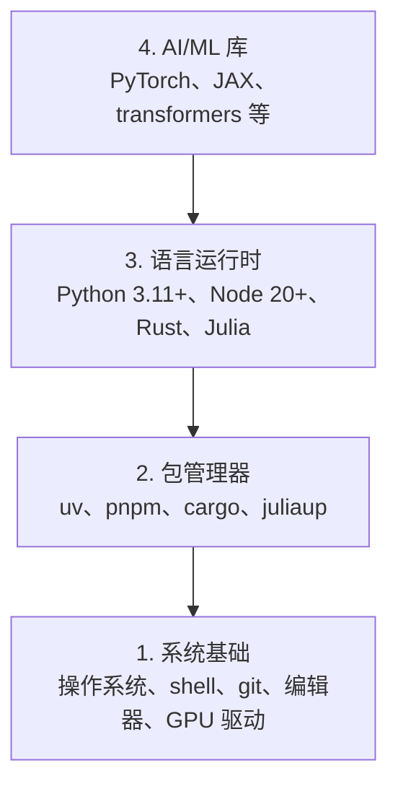

# 开发环境（Dev Environment）

> 工具会塑造你的思维方式。花一次功夫，把它们配置到位。

**Type:** Build
**Languages:** Python, Node.js, Rust
**Prerequisites:** None
**Time:** ~45 minutes

## 学习目标（Learning Objectives）

- 从零开始配置 Python 3.11+、Node.js 20+ 和 Rust 工具链
- 配置虚拟环境与包管理器，实现可复现的构建
- 通过 CUDA/MPS 验证 GPU 可用性，并运行一次测试张量运算
- 理解四层技术栈：系统、软件包、运行时、AI 库

## 问题（The Problem）

你即将通过 500 多节课学习 AI 工程，横跨 Python、TypeScript、Rust 和 Julia。如果环境出了问题，每一节课都会变成与工具的搏斗，而不是学习。

大多数人会跳过环境配置，然后花上几个小时调试导入错误、版本冲突和缺失的 CUDA 驱动。我们要把这件事一次性做对。

## 核心概念（The Concept）

AI 工程环境分为四层：



我们自底向上安装。每一层都依赖它下面的那一层。

```figure
s0-env-stack
```

## 动手构建（Build It）

### 步骤 1：系统基础（Step 1: System Foundation）

检查你的系统并安装基础工具。

```bash
# macOS
xcode-select --install
brew install git curl wget

# Ubuntu/Debian
sudo apt update && sudo apt install -y build-essential git curl wget

# Windows (use WSL2)
wsl --install -d Ubuntu-24.04
```

### 步骤 2：用 uv 安装 Python（Step 2: Python with uv）

我们使用 `uv` —— 它比 pip 快 10-100 倍，还能自动管理虚拟环境。

```bash
curl -LsSf https://astral.sh/uv/install.sh | sh

uv python install 3.12

uv venv
source .venv/bin/activate  # or .venv\Scripts\activate on Windows

uv pip install numpy matplotlib jupyter
```

验证：

```python
import sys
print(f"Python {sys.version}")

import numpy as np
print(f"NumPy {np.__version__}")
a = np.array([1, 2, 3])
print(f"Vector: {a}, dot product with itself: {np.dot(a, a)}")
```

### 步骤 3：用 pnpm 安装 Node.js（Step 3: Node.js with pnpm）

用于 TypeScript 课程（智能体、MCP 服务器、Web 应用）。

```bash
curl -fsSL https://fnm.vercel.app/install | bash
fnm install 22
fnm use 22

npm install -g pnpm

node -e "console.log('Node', process.version)"
```

**macOS / Apple Silicon（M1/M2/M3/M4）：** 如果安装器停止并报 `Error: Cannot install under Rosetta 2 in ARM default prefix (/opt/homebrew)`，说明你的终端正运行在 Rosetta 2 下（`arch` 输出 `i386`），而 Homebrew 是原生 arm64 构建。强制以 arm64 方式安装 fnm，把它接入你的 shell，然后从 `fnm install 22` 开始重新执行上面的命令：

```bash
arch -arm64 brew install fnm
echo 'eval "$(fnm env --use-on-cd)"' >> ~/.zshrc
source ~/.zshrc
```

### 步骤 4：Rust（Step 4: Rust）

用于对性能要求苛刻的课程（推理、系统）。

```bash
curl --proto '=https' --tlsv1.2 -sSf https://sh.rustup.rs | sh

rustc --version
cargo --version
```

### 步骤 5：Julia（可选）（Step 5: Julia (Optional)）

用于数学密集、Julia 大放异彩的课程。

```bash
curl -fsSL https://install.julialang.org | sh

julia -e 'println("Julia ", VERSION)'
```

### 步骤 6：GPU 配置（如果你有 GPU）（Step 6: GPU Setup (If You Have One)）

**NVIDIA（Linux / Windows）：**

```bash
nvidia-smi

# Install PyTorch with CUDA
uv pip install torch torchvision torchaudio --index-url https://download.pytorch.org/whl/cu124
```

**macOS / Apple Silicon（M1/M2/M3/M4）：** Mac 上没有 CUDA——这是预期行为，不是故障。**不要**传入 `--index-url .../cuXXX`（那些 wheel 只支持 Linux/Windows，安装会失败）。直接安装标准构建即可，其中包含 Apple 的 MPS（Metal）GPU 后端：

```bash
uv pip install torch torchvision torchaudio
```

验证（任何平台都适用）：

```python
import torch
print(f"CUDA available: {torch.cuda.is_available()}")           # False on macOS — expected
print(f"MPS available:  {torch.backends.mps.is_available()}")   # True on Apple Silicon
if torch.cuda.is_available():
    print(f"GPU: {torch.cuda.get_device_name(0)}")
```

没有 GPU？没关系。大多数课程在 CPU 上就能运行。对于偏训练的课程，请使用 Google Colab 或云 GPU。

### 步骤 7：验证你想开始的路线（Step 7: Verify the route you want to start）

本课的所有命令都要在仓库根目录下运行，也就是包含 `README.md` 和 `phases/` 的那个目录。预检只检查开始所选路线所需的内容，默认会跳过后面的工具，这样新学习者看到的是一个清晰的结论，而不是满屏的警告。

启动完整的初学者路线：

```bash
python3 phases/00-setup-and-tooling/01-dev-environment/code/verify.py --route beginner
```

或者只检查你想学的路线：

```bash
python3 phases/00-setup-and-tooling/01-dev-environment/code/verify.py --route ml-foundations
python3 phases/00-setup-and-tooling/01-dev-environment/code/verify.py --route llm-engineering
python3 phases/00-setup-and-tooling/01-dev-environment/code/verify.py --route agents
python3 phases/00-setup-and-tooling/01-dev-environment/code/verify.py --route mcp
python3 phases/00-setup-and-tooling/01-dev-environment/code/verify.py --route agent-skills
python3 phases/00-setup-and-tooling/01-dev-environment/code/verify.py --route certification
```

如果想让同一次预检顺带检查后续课程用到的可选工具和依赖，加上 `--show-later` 即可。缺少后续工具绝不会阻塞所选路线。

每个失败的必需检查项都会给出检测到的路径或导入错误，以及一条确切的修正命令。Agent Skills 和认证路线还会显示需要手动完成的主机检查，因为 Python 脚本无法证明 AI 宿主已经发现了某个技能，也无法证明你选定的技能作用域可写。

初学者预检通过后，会打印出确切的第一节可运行课程：

```text
Ready to start Beginner course.
Next: python3 phases/01-math-foundations/01-linear-algebra-intuition/code/vectors.py
```

## 用起来（Use It）

你的环境已经可以开始你验证过的那条路线了。等课程需要时再安装后面的工具，别让第一节课被整套技术栈卡住。下面是你在整个课程中会用到的内容：

| 语言 | 使用范围 | 包管理器 |
|----------|---------|-----------------|
| Python | 阶段 1-12（机器学习、深度学习、NLP、视觉、音频、LLM） | uv |
| TypeScript | 阶段 13-17（工具、智能体、智能体群、基础设施） | pnpm |
| Rust | 阶段 12、15-17（性能关键型系统） | cargo |
| Julia | 阶段 1（数学基础） | Pkg |

## 交付成果（Ship It）

本课产出一个验证脚本，任何人都可以运行它来检查自己的环境配置。

参见 `outputs/prompt-env-check.md`，其中有一个帮助 AI 助手诊断环境问题的提示词。

## 练习（Exercises）

1. 运行验证脚本并修复所有失败项
2. 为本课程创建一个 Python 虚拟环境并安装 PyTorch
3. 用全部四种语言各写一个 “hello world”，并逐一运行
