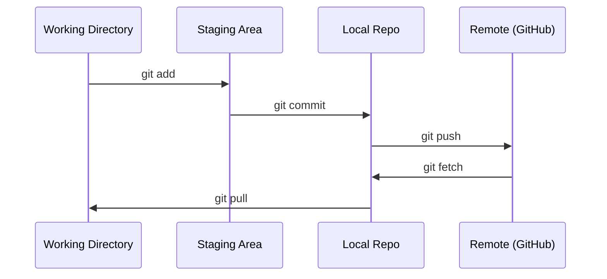

# Git 与协作（Git & Collaboration）

> 版本控制不是可选项。你在这里构建的每一个实验、每一个模型、每一节课，都会被跟踪记录。

**Type:** Learn
**Languages:** --
**Prerequisites:** Phase 0, Lesson 01
**Time:** ~30 minutes

## 学习目标（Learning Objectives）

- 配置 git 身份信息，掌握 add、commit、push 的日常工作流
- 创建并合并分支，在不破坏 main 的前提下做隔离的实验
- 编写 `.gitignore`，排除模型检查点（checkpoint）和大型二进制文件
- 使用 `git log` 浏览提交历史，理解项目的演进过程

## 问题（The Problem）

你将在 20 个阶段中编写数百个代码文件。没有版本控制，你会丢失工作成果、破坏无法挽回的东西，也无法与他人协作。

Git 是工具，GitHub 是代码栖身的地方。本课只讲这门课程需要的内容，仅此而已。

## 核心概念（The Concept）



记住三件事：
1. 经常保存（`git commit`）
2. 推送到远端（`git push`）
3. 用分支做实验（`git checkout -b experiment`）

```figure
s0-commit-dag
```

## 动手构建（Build It）

### 步骤 1：配置 git（Step 1: Configure git）

```bash
git config --global user.name "Your Name"
git config --global user.email "you@example.com"
```

### 步骤 2：日常工作流（Step 2: The daily workflow）

```bash
git status
git add file.py
git commit -m "Add perceptron implementation"
git push origin main
```

### 步骤 3：为实验创建分支（Step 3: Branching for experiments）

```bash
git checkout -b experiment/new-optimizer

# ... make changes, commit ...

git checkout main
git merge experiment/new-optimizer
```

### 步骤 4：与本课程仓库协作（Step 4: Working with this course repo）

你无法向课程仓库本身推送——只有维护者才有写权限。先在 GitHub 上 Fork 它（右上角的 Fork 按钮），让 `origin` 指向你自己的副本：

```bash
git clone https://github.com/YOUR-USERNAME/ai-engineering-from-scratch.git
cd ai-engineering-from-scratch

git checkout -b my-progress
# work through lessons, commit your code
git push origin my-progress
```

## 用起来（Use It）

对于这门课程，你需要的正是这几条命令：

| 命令 | 使用场景 |
|---------|------|
| `git clone` | 获取课程仓库 |
| `git add` + `git commit` | 保存你的工作 |
| `git push` | 备份到 GitHub |
| `git checkout -b` | 尝试新东西而不破坏 main |
| `git log --oneline` | 查看你做过什么 |

就这些。这门课程不需要 rebase、cherry-pick 或 submodule。

## 练习（Exercises）

1. Fork 本仓库，克隆你的 Fork，创建一个名为 `my-progress` 的分支，新建一个文件，提交它，推送它
2. 编写一个 `.gitignore`，排除模型检查点文件（`.pt`、`.pth`、`.safetensors`）
3. 用 `git log --oneline` 查看本仓库的提交历史，读一读这些课程是如何一步步添加进来的

## 关键术语（Key Terms）

| 术语 | 人们常说的 | 实际含义 |
|------|----------------|----------------------|
| Commit | “保存” | 整个项目在某个时间点上的快照 |
| Branch | “一份拷贝” | 指向某个提交的指针，会随着你的工作向前移动 |
| Merge | “合并代码” | 把一个分支上的改动应用到另一个分支 |
| Remote | “云端” | 你的仓库托管在别处的一份副本（GitHub、GitLab） |
