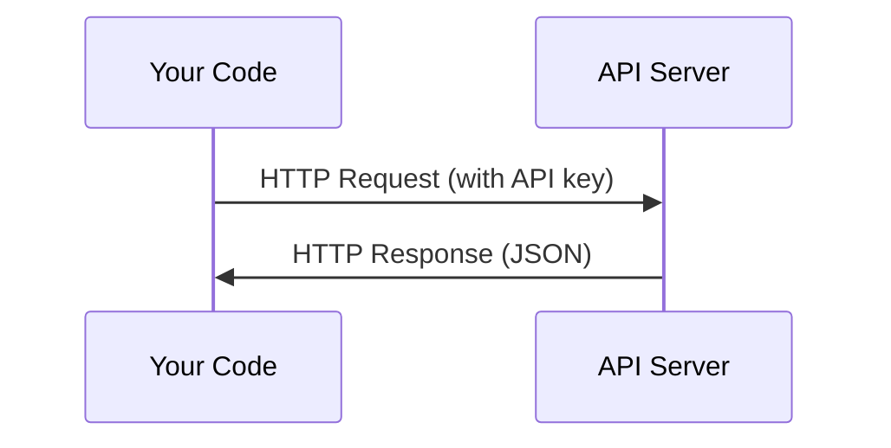

# API 与密钥（APIs & Keys）

> 每个 AI API 的运作方式都一样：发出请求，拿到响应。细节会变，模式不变。

**Type:** Build
**Languages:** Python, TypeScript
**Prerequisites:** Phase 0, Lesson 01
**Time:** ~30 minutes

## 学习目标（Learning Objectives）

- 使用环境变量和 `.env` 文件安全地存放 API 密钥
- 分别用 Anthropic Python SDK 和原生 HTTP 发起 LLM API 调用
- 对比基于 SDK 和原生 HTTP 的请求/响应格式，便于调试
- 识别并处理常见的 API 错误，包括身份验证和速率限制

## 问题（The Problem）

从阶段 11 开始，你将调用 LLM API（Anthropic、OpenAI、Google）。在阶段 13-16，你会构建在循环中使用这些 API 的智能体。你需要了解 API 密钥如何工作、如何安全地存放密钥，以及如何完成你的第一次 API 调用。

## 核心概念（The Concept）



每次 API 调用都包含：
1. 一个端点（URL）
2. 一个 API 密钥（身份验证）
3. 一个请求体（你想要什么）
4. 一个响应体（你拿到什么）

```figure
s0-secret-inject
```

## 动手构建（Build It）

### 步骤 1：安全存放 API 密钥（Step 1: Store API keys safely）

绝不把 API 密钥写进代码。请使用环境变量。

```bash
export ANTHROPIC_API_KEY="sk-ant-..."
export OPENAI_API_KEY="sk-..."
```

或者使用 `.env` 文件（把它加进 `.gitignore`）：

```
ANTHROPIC_API_KEY=sk-ant-...
OPENAI_API_KEY=sk-...
```

### 步骤 2：第一次 API 调用（Python）（Step 2: First API call (Python)）

```python
import os

import anthropic

client = anthropic.Anthropic()

MODEL = os.environ.get("LLM_MODEL", "claude-sonnet-5")

response = client.messages.create(
    model=MODEL,
    max_tokens=256,
    messages=[{"role": "user", "content": "What is a neural network in one sentence?"}]
)

print(response.content[0].text)
```

`LLM_MODEL` 用来选择 Anthropic 的模型 ID，默认值是不带日期的 Sonnet 别名。其他提供商（OpenAI、Google 等）遵循同样的“密钥 + 模型 ID”模式，但每家都有自己的 SDK、端点和请求/响应结构（schema）。

### 步骤 3：第一次 API 调用（TypeScript）（Step 3: First API call (TypeScript)）

```typescript
import Anthropic from "@anthropic-ai/sdk";

const client = new Anthropic();

const MODEL = process.env.LLM_MODEL ?? "claude-sonnet-5";

const response = await client.messages.create({
  model: MODEL,
  max_tokens: 256,
  messages: [{ role: "user", content: "What is a neural network in one sentence?" }],
});

console.log(response.content[0].text);
```

### 步骤 4：原生 HTTP（不用 SDK）（Step 4: Raw HTTP (no SDK)）

```python
import os
import urllib.request
import json

url = "https://api.anthropic.com/v1/messages"
headers = {
    "Content-Type": "application/json",
    "x-api-key": os.environ["ANTHROPIC_API_KEY"],
    "anthropic-version": "2023-06-01",
}
body = json.dumps({
    "model": os.environ.get("LLM_MODEL", "claude-sonnet-5"),
    "max_tokens": 256,
    "messages": [{"role": "user", "content": "What is a neural network in one sentence?"}],
}).encode()

req = urllib.request.Request(url, data=body, headers=headers, method="POST")
with urllib.request.urlopen(req) as resp:
    result = json.loads(resp.read())
    print(result["content"][0]["text"])
```

SDK 在底层做的正是这些事。理解原生 HTTP 调用，调试时会有很大帮助。

## 用起来（Use It）

对于这门课程：

| API | 什么时候需要 | 免费额度 |
|-----|-----------------|-----------|
| Anthropic (Claude) | 阶段 11-16（智能体、工具） | 注册赠送 $5 额度 |
| OpenAI | 阶段 11（对比） | 注册赠送 $5 额度 |
| Hugging Face | 阶段 4-10（模型、数据集） | 免费 |

你不需要现在就把它们全部配好。等课程需要时再设置。

## 交付成果（Ship It）

本课产出：
- `outputs/prompt-api-troubleshooter.md` - 诊断常见的 API 错误

## 练习（Exercises）

1. 获取一个 Anthropic API 密钥，完成你的第一次 API 调用
2. 试试原生 HTTP 版本，把它的响应格式与 SDK 版本进行对比
3. 故意使用一个错误的 API 密钥，阅读报错信息

## 关键术语（Key Terms）

| 术语 | 人们常说的 | 实际含义 |
|------|----------------|----------------------|
| API key | “API 的密码” | 一串唯一标识你的账户并授权请求的字符串 |
| Rate limit | “他们在限流” | 每分钟/每小时允许的最大请求数，用于防止滥用并保障公平使用 |
| Token | “一个词”（API 语境下） | 计费单位：输入和输出的词元（token）分别计数、分别计费 |
| Streaming | “实时响应” | 一个词一个词地接收响应，而不是等完整响应一次性返回 |
