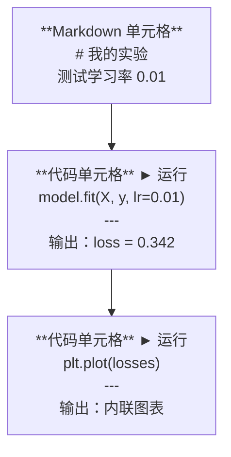
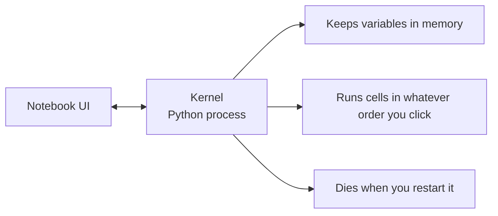

# Jupyter Notebook（Jupyter Notebooks）

> Notebook 是 AI 工程的实验台。你在这里做原型，然后把跑得通的东西搬进生产环境。

**Type:** Build
**Languages:** Python
**Prerequisites:** Phase 0, Lesson 01
**Time:** ~30 minutes

## 学习目标（Learning Objectives）

- 安装并启动 JupyterLab、Jupyter Notebook 或带 Jupyter 扩展的 VS Code
- 使用魔法命令（magic command，如 `%timeit`、`%%time`、`%matplotlib inline`）进行基准测试和内联可视化
- 分清什么时候用 notebook、什么时候用脚本，并运用“在 notebook 里探索、用脚本交付”的工作流
- 识别并避开常见的 notebook 陷阱：乱序执行、隐藏状态和内存泄漏

## 问题（The Problem）

每一篇 AI 论文、每一个教程和每一场 Kaggle 比赛都在用 Jupyter notebook。它让你分块运行代码、内联查看输出、把代码和解释混排在一起，从而快速迭代。如果不用 notebook 学 AI，就像做数学题没有草稿纸。

但 notebook 也有实实在在的陷阱。人们用它做所有事，包括它并不擅长的事。分清什么时候该用 notebook、什么时候该用脚本，能让你日后免受调试噩梦的折磨。

## 核心概念（The Concept）

notebook 由一系列单元格（cell）组成。每个单元格要么是代码，要么是文本。



内核（kernel）是在后台运行的 Python 进程。你运行某个单元格时，代码会被发送给内核，由它执行并把结果传回来。所有单元格共享同一个内核，因此变量在单元格之间持续存在。



“想按什么顺序运行就按什么顺序运行”这一点，既是超能力，也是容易伤到自己的地方。

```figure
s0-cell-order
```

## 动手构建（Build It）

### 步骤 1：选择你的界面（Step 1: Pick your interface）

三种选择，一种格式：

| 界面 | 安装方式 | 最适合 |
|-----------|---------|----------|
| JupyterLab | `pip install jupyterlab`，然后运行 `jupyter lab` | 完整的 IDE 体验、多标签页、文件浏览器、终端 |
| Jupyter Notebook | `pip install notebook`，然后运行 `jupyter notebook` | 简单、轻量，一次只专注一个 notebook |
| VS Code | 安装 “Jupyter” 扩展 | 就在你的编辑器里、git 集成、调试 |

三者读写的都是同一种 `.ipynb` 文件。喜欢哪个就用哪个。AI 工作中最常用的是 JupyterLab。

```bash
pip install jupyterlab
jupyter lab
```

### 步骤 2：真正重要的快捷键（Step 2: Keyboard shortcuts that matter）

你在两种模式下操作。按 `Escape` 进入命令模式（左侧蓝色竖条），按 `Enter` 进入编辑模式（绿色竖条）。

**命令模式（最常用）：**

| 按键 | 操作 |
|-----|--------|
| `Shift+Enter` | 运行单元格并跳到下一个 |
| `A` | 在上方插入单元格 |
| `B` | 在下方插入单元格 |
| `DD` | 删除单元格 |
| `M` | 转换为 markdown |
| `Y` | 转换为代码 |
| `Z` | 撤销单元格操作 |
| `Ctrl+Shift+H` | 显示所有快捷键 |

**编辑模式：**

| 按键 | 操作 |
|-----|--------|
| `Tab` | 自动补全 |
| `Shift+Tab` | 显示函数签名 |
| `Ctrl+/` | 切换注释 |

`Shift+Enter` 是你一天要用上千次的那个。先学会它。

### 步骤 3：单元格类型（Step 3: Cell types）

**代码单元格**运行 Python 并显示输出：

```python
import numpy as np
data = np.random.randn(1000)
data.mean(), data.std()
```

输出：`(0.0032, 0.9987)`

**Markdown 单元格**渲染带格式的文本。用它们记录你在做什么、为什么这样做。支持标题、粗体、斜体、LaTeX 数学（`$E = mc^2$`）、表格和图片。

### 步骤 4：魔法命令（Step 4: Magic commands）

这些不是 Python。它们是 Jupyter 专有的命令，以 `%`（行魔法命令）或 `%%`（单元格魔法命令）开头。

**给代码计时：**

```python
%timeit np.random.randn(10000)
```

输出：`45.2 us +/- 1.3 us per loop`

```python
%%time
model.fit(X_train, y_train, epochs=10)
```

输出：`Wall time: 2.34 s`

`%timeit` 会把代码运行很多次并取平均。`%%time` 只运行一次。微基准测试用 `%timeit`，训练过程用 `%%time`。

**启用内联绘图：**

```python
%matplotlib inline
```

从此每个 `plt.plot()` 或 `plt.show()` 都会直接渲染在 notebook 里。

**不离开 notebook 就能安装包：**

```python
!pip install scikit-learn
```

`!` 前缀可以运行任意 shell 命令。

**查看环境变量：**

```python
%env CUDA_VISIBLE_DEVICES
```

### 步骤 5：内联显示富输出（Step 5: Display rich output inline）

notebook 会自动显示单元格里的最后一个表达式。但你也可以主动控制输出：

```python
import pandas as pd

df = pd.DataFrame({
    "model": ["Linear", "Random Forest", "Neural Net"],
    "accuracy": [0.72, 0.89, 0.94],
    "training_time": [0.1, 2.3, 45.6]
})
df
```

它渲染出的是一张格式化的 HTML 表格，而不是纯文本堆。绘图也一样：

```python
import matplotlib.pyplot as plt

plt.figure(figsize=(8, 4))
plt.plot([1, 2, 3, 4], [1, 4, 2, 3])
plt.title("Inline Plot")
plt.show()
```

图表会直接出现在单元格下方。这正是 notebook 主导 AI 工作的原因：数据、图表和代码同屏可见。

至于图片：

```python
from IPython.display import Image, display
display(Image(filename="architecture.png"))
```

### 步骤 6：Google Colab（Step 6: Google Colab）

Colab 是云端免费的 Jupyter notebook。它提供 GPU、预装的库，并集成了 Google Drive。零配置。

1. 访问 [colab.research.google.com](https://colab.research.google.com)
2. 上传本课程的任意 `.ipynb` 文件
3. Runtime > Change runtime type > T4 GPU（免费）

Colab 与本地 Jupyter 的差异：
- 文件在不同会话之间不保留（保存到 Drive 或下载到本地）
- 预装了 numpy、pandas、matplotlib、torch、tensorflow、sklearn
- 用 `from google.colab import files` 上传/下载文件
- 用 `from google.colab import drive; drive.mount('/content/drive')` 挂载持久化存储
- 闲置 90 分钟后会话超时（免费版）

## 用起来（Use It）

### Notebook 还是脚本：什么时候用哪个（Notebooks vs Scripts: When to use which）

| 适合用 notebook | 适合用脚本 |
|-------------------|-----------------|
| 探索数据集 | 训练流水线 |
| 给模型做原型 | 可复用的工具函数 |
| 可视化结果 | 任何带 `if __name__` 的代码 |
| 讲解你的工作 | 定时运行的代码 |
| 快速实验 | 生产代码 |
| 课程练习 | 包和库 |

规则：**在 notebook 里探索，用脚本交付**。

AI 领域常见的工作流：
1. 在 notebook 中探索数据
2. 在 notebook 中给模型搭原型
3. 跑通之后，把代码搬进 `.py` 文件
4. 再把这些 `.py` 文件导回 notebook 继续实验

### 常见陷阱（Common traps）

**乱序执行。** 你运行了单元格 5，接着是单元格 2，然后是单元格 7。notebook 在你的机器上跑得好好的，别人却从上到下一运行就出错。解决办法：分享之前先执行 Kernel > Restart & Run All。

**隐藏状态。** 你删掉了一个单元格，但它创建的变量还留在内存里。notebook 看起来干干净净，实际上依赖着一个幽灵单元格。解决办法：定期重启内核。

**内存泄漏。** 加载一个 4GB 数据集，训练一个模型，又加载另一个数据集。什么都没有释放。解决办法：用 `del variable_name` 和 `gc.collect()`，或者重启内核。

## 交付成果（Ship It）

本课产出：
- `outputs/prompt-notebook-helper.md`，用来调试 notebook 问题

## 练习（Exercises）

1. 打开 JupyterLab，新建一个 notebook，用 `%timeit` 比较用列表推导式和用 numpy 创建包含 100,000 个随机数的数组谁更快
2. 创建一个既有 markdown 单元格又有代码单元格的 notebook：加载一个 CSV、展示一个 dataframe、画一张图。然后执行 Kernel > Restart & Run All，验证它能从上到下跑通
3. 把 `code/notebook_tips.py` 里的代码粘贴到 Colab notebook 中，用免费 GPU 跑一遍

## 关键术语（Key Terms）

| 术语 | 人们常说的 | 实际含义 |
|------|----------------|----------------------|
| Kernel（内核） | “运行我代码的那个东西” | 一个独立的 Python 进程，负责执行单元格并把变量保存在内存里 |
| Cell（单元格） | “一段代码” | notebook 中可独立运行的单元，要么是代码，要么是 markdown |
| Magic command（魔法命令） | “Jupyter 的小技巧” | 以 `%` 或 `%%` 开头的特殊命令，用来控制 notebook 环境 |
| `.ipynb` | “notebook 文件” | 一种 JSON 文件，包含单元格、输出和元数据。全称是 IPython Notebook |

## 延伸阅读（Further Reading）

- [JupyterLab 文档](https://jupyterlab.readthedocs.io/)：完整功能一览
- [Google Colab FAQ](https://research.google.com/colaboratory/faq.html)：Colab 特有的限制与功能
- [28 个 Jupyter Notebook 技巧](https://www.dataquest.io/blog/jupyter-notebook-tips-tricks-shortcuts/)：进阶用户的快捷操作
