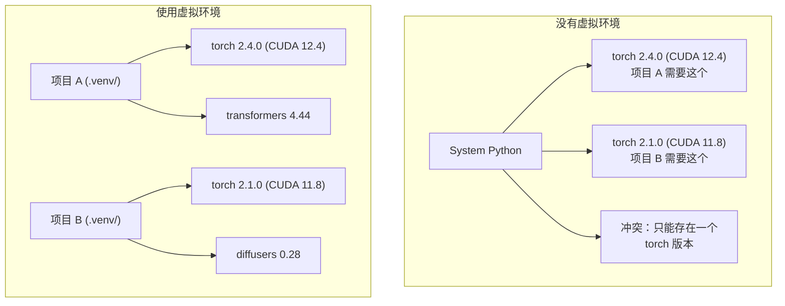

# Python 环境（Python Environments）

> 依赖地狱真实存在。虚拟环境就是解药。

**Type:** Build
**Languages:** Shell
**Prerequisites:** Phase 0, Lesson 01
**Time:** ~30 minutes

## 学习目标（Learning Objectives）

- 使用 `uv`、`venv` 或 `conda` 创建隔离的虚拟环境（virtual environment）
- 编写带可选依赖组的 `pyproject.toml`，并生成锁文件（lockfile）以保证可复现性
- 诊断并修复常见的坑：全局安装、pip/conda 混用、CUDA 版本不匹配
- 为依赖相互冲突的项目实现按阶段隔离的环境策略

## 问题（The Problem）

你为一个微调项目装了 PyTorch 2.4。下周，另一个项目因为锁定了 CUDA 构建版本，需要 PyTorch 2.1。你全局升级，第一个项目崩了；你降级回去，第二个项目又崩了。

这就是依赖地狱（dependency hell）。在 AI/ML 工作中它时刻都在发生，原因如下：

- PyTorch、JAX 和 TensorFlow 各自捆绑了自己的 CUDA 绑定
- 模型库会锁定特定的框架版本
- 全局 `pip install` 会覆盖之前装好的任何东西
- CUDA 11.8 构建无法在 CUDA 12.x 驱动上运行（反之亦然）

解决办法：让每个项目都拥有自己隔离的环境和自己的包。

## 核心概念（The Concept）



```figure
s0-env-isolation
```

## 动手构建（Build It）

### 选项 1：uv venv（推荐）（Option 1: uv venv (Recommended)）

`uv` 是目前最快的 Python 包管理器（比 pip 快 10 到 100 倍）。它用一个工具搞定虚拟环境、Python 版本和依赖解析。

```bash
curl -LsSf https://astral.sh/uv/install.sh | sh

uv python install 3.12

cd your-project
uv venv
source .venv/bin/activate
```

安装包：

```bash
uv pip install torch numpy
```

一步创建带 `pyproject.toml` 的项目：

```bash
uv init my-ai-project
cd my-ai-project
uv add torch numpy matplotlib
```

### 选项 2：venv（内置）（Option 2: venv (Built-in)）

如果装不了 `uv`，Python 自带 `venv`：

```bash
python3 -m venv .venv
source .venv/bin/activate  # Linux/macOS
.venv\Scripts\activate     # Windows

pip install torch numpy
```

比 `uv` 慢，但只要装了 Python 的地方都能用。

### 选项 3：conda（按需使用）（Option 3: conda (When You Need It)）

Conda 管理 CUDA toolkit、cuDNN、C 库这类非 Python 依赖。以下情况用它：

- 你需要特定版本的 CUDA toolkit，又不想装到系统全局
- 你在共享集群上，装不了系统级软件包
- 某个库的安装说明写着“请使用 conda”

```bash
# Install miniconda (not the full Anaconda)
curl -LsSf https://repo.anaconda.com/miniconda/Miniconda3-latest-Linux-x86_64.sh -o miniconda.sh
bash miniconda.sh -b

conda create -n myproject python=3.12
conda activate myproject

conda install pytorch torchvision torchaudio pytorch-cuda=12.4 -c pytorch -c nvidia
```

一条规则：一个环境如果用 conda 创建，里面的所有包就都用 conda 装。往 conda 环境里混用 `pip install` 会引发依赖冲突，调试起来非常痛苦。

### 针对本课程：按阶段的策略（For This Course: Per-Phase Strategy）

你可以给整门课程只建一个环境。别这么做。不同阶段需要不同（有时相互冲突）的依赖。

策略：

```
ai-engineering-from-scratch/
├── .venv/                    <-- shared lightweight env for phases 0-3
├── phases/
│   ├── 04-neural-networks/
│   │   └── .venv/            <-- PyTorch env
│   ├── 05-cnns/
│   │   └── .venv/            <-- same PyTorch env (symlink or shared)
│   ├── 08-transformers/
│   │   └── .venv/            <-- might need different transformer versions
│   └── 11-llm-apis/
│       └── .venv/            <-- API SDKs, no torch needed
```

`code/env_setup.sh` 中的脚本会为本课程创建基础环境。

## pyproject.toml 基础（pyproject.toml Basics）

每个 Python 项目都应该有一个 `pyproject.toml`。它用一个文件取代了 `setup.py`、`setup.cfg` 和 `requirements.txt`。

```toml
[project]
name = "ai-engineering-from-scratch"
version = "0.1.0"
requires-python = ">=3.11"
dependencies = [
    "numpy>=1.26",
    "matplotlib>=3.8",
    "jupyter>=1.0",
    "scikit-learn>=1.4",
]

[project.optional-dependencies]
torch = ["torch>=2.3", "torchvision>=0.18"]
llm = ["anthropic>=0.39", "openai>=1.50"]
```

然后安装：

```bash
uv pip install -e ".[torch]"    # base + PyTorch
uv pip install -e ".[llm]"     # base + LLM SDKs
uv pip install -e ".[torch,llm]" # everything
```

## 锁文件（Lockfiles）

锁文件把每个依赖（包括传递依赖）固定到精确版本。这保证了可复现性：任何从锁文件安装的人，得到的包都完全一致。

```bash
# uv generates uv.lock automatically when using uv add
uv add numpy

# pip-tools approach
uv pip compile pyproject.toml -o requirements.lock
uv pip install -r requirements.lock
```

把锁文件提交到 git。别人克隆仓库后从锁文件安装，就能得到完全相同的版本。

## 常见错误（Common Mistakes）

### 1. 全局安装（Installing globally）

```bash
pip install torch  # BAD: installs to system Python

source .venv/bin/activate
pip install torch  # GOOD: installs to virtual environment
```

检查你的包被装到了哪里：

```bash
which python       # should show .venv/bin/python, not /usr/bin/python
which pip           # should show .venv/bin/pip
```

### 2. 混用 pip 和 conda（Mixing pip and conda）

```bash
conda create -n myenv python=3.12
conda activate myenv
conda install pytorch -c pytorch
pip install some-other-package   # BAD: can break conda's dependency tracking
conda install some-other-package # GOOD: let conda manage everything
```

如果非要在 conda 里用 pip（有些包只发布了 pip 版），那就先装完全部 conda 包，最后再装 pip 包。

### 3. 忘记激活环境（Forgetting to activate）

```bash
python train.py           # uses system Python, missing packages
source .venv/bin/activate
python train.py           # uses project Python, packages found
```

你的 shell 提示符应该显示出环境名称：

```
(.venv) $ python train.py
```

### 4. 把 .venv 提交进 git（Committing .venv to git）

```bash
echo ".venv/" >> .gitignore
```

虚拟环境的体积在 200MB 到 2GB 之间。它们只存在于本地，无法跨机器移植。应该提交的是 `pyproject.toml` 和锁文件。

### 5. CUDA 版本不匹配（CUDA version mismatch）

```bash
nvidia-smi                # shows driver CUDA version (e.g., 12.4)
python -c "import torch; print(torch.version.cuda)"  # shows PyTorch CUDA version

# These must be compatible.
# PyTorch CUDA version must be <= driver CUDA version.
```

## 用起来（Use It）

运行安装脚本，创建你的课程环境：

```bash
bash phases/00-setup-and-tooling/06-python-environments/code/env_setup.sh
```

它会在仓库根目录创建一个 `.venv`，核心依赖已装好并通过验证。

## 练习（Exercises）

1. 运行 `env_setup.sh`，确认所有检查全部通过
2. 创建第二个虚拟环境，在里面装一个不同版本的 numpy，确认两个环境相互隔离
3. 为一个同时需要 PyTorch 和 Anthropic SDK 的项目写一个 `pyproject.toml`
4. 故意在不激活 venv 的情况下全局安装一个包，看看它去了哪里，然后把它卸载

## 关键术语（Key Terms）

| 术语 | 人们常说的 | 实际含义 |
|------|----------------|----------------------|
| 虚拟环境（virtual environment） | “一个 venv” | 一个包含 Python 解释器和包的隔离目录，独立于系统 Python |
| 锁文件（lockfile） | “固定版本的依赖” | 列出每个包及其精确版本的文件，保证跨机器安装结果完全一致 |
| pyproject.toml | “新版 setup.py” | Python 项目的标准配置文件，取代 setup.py/setup.cfg/requirements.txt |
| 传递依赖（transitive dependency） | “依赖的依赖” | 包 B 依赖 C；你安装的 A 依赖 B，那么 C 就是 A 的传递依赖 |
| CUDA 版本不匹配（CUDA mismatch） | “我的 GPU 不工作” | PyTorch 编译时针对的 CUDA 版本与你的 GPU 驱动支持的版本不一致 |
