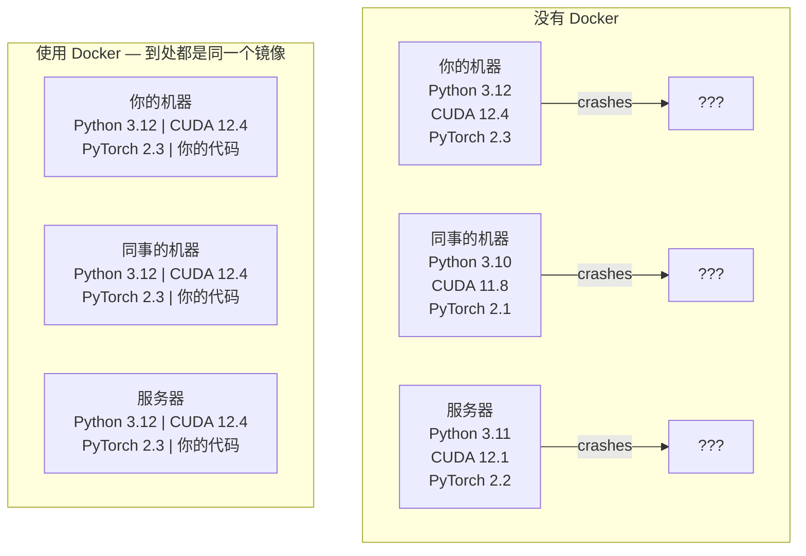

# 面向 AI 的 Docker（Docker for AI）

> 容器让“在我机器上能跑”成为历史。

**Type:** Build
**Languages:** Docker
**Prerequisites:** Phase 0, Lessons 01 and 03
**Time:** ~60 minutes

## 学习目标（Learning Objectives）

- 用 Dockerfile 构建启用 GPU 的 Docker 镜像（image），内置 CUDA、PyTorch 和各类 AI 库
- 把宿主机目录挂载为卷（volume），让模型、数据集和代码在容器重建后依然留存
- 配置 NVIDIA Container Toolkit，让 GPU 在容器内可用
- 使用 Docker Compose 编排多服务 AI 应用（推理服务器 + 向量数据库）

## 问题（The Problem）

你在笔记本上用 PyTorch 2.3、CUDA 12.4 和 Python 3.12 训练了一个模型。同事的机器上是 PyTorch 2.1、CUDA 11.8 和 Python 3.10。你的模型在他机器上崩溃。而你的 Dockerfile 在两台机器上都能跑。

AI 项目的依赖是场噩梦。一个典型的技术栈包括 Python、PyTorch、CUDA 驱动、cuDNN、系统级 C 库，还有像 flash-attn 这类要求精确编译器版本的专用包。Docker 把这一切打包进一个镜像，在任何地方运行都一模一样。

## 核心概念（The Concept）

Docker 把你的代码、运行时、库和系统工具封装进一个叫容器（container）的隔离单元。可以把它当成轻量级虚拟机，但它共享宿主操作系统的内核而不是自带内核，因此启动只要几秒而不是几分钟。



### 为什么 AI 项目比大多数项目更需要 Docker（Why AI projects need Docker more than most）

1. **GPU 驱动很脆弱。** CUDA 12.4 的代码跑不了 CUDA 11.8。Docker 把 CUDA toolkit 隔离在容器内部，同时通过 NVIDIA Container Toolkit 共享宿主机的 GPU 驱动。

2. **模型权重很大。** 一个 7B 参数的模型在 fp16 下就有 14 GB。你不会想每次重建都重新下载它。Docker 卷让你能从宿主机挂载一个模型目录。

3. **多服务架构很常见。** 一个真实的 AI 应用不只是一个 Python 脚本。它是一个推理服务器、一个服务 RAG 的向量数据库，可能还有一个 Web 前端。Docker Compose 用一条命令编排所有这些服务。

### 关键词汇（Key vocabulary）

| 术语 | 含义 |
|------|---------------|
| 镜像 | 只读模板。你的菜谱。由 Dockerfile 构建。 |
| 容器 | 镜像的一个运行实例。你的厨房。 |
| Dockerfile | 构建镜像的指令。一层一层叠加。 |
| 卷 | 容器重启后依然保留数据的持久化存储。 |
| docker-compose | 用 YAML 定义多容器应用的工具。 |

### AI 中常见的容器模式（Common container patterns in AI）

```
Dev Container
  Full toolkit. Editor support. Jupyter. Debugging tools.
  Used during development and experimentation.

Training Container
  Minimal. Just the training script and dependencies.
  Runs on GPU clusters. No editor, no Jupyter.

Inference Container
  Optimized for serving. Small image. Fast cold start.
  Runs behind a load balancer in production.
```

```figure
s0-image-layers
```

## 动手构建（Build It）

### 步骤 1：安装 Docker（Step 1: Install Docker）

```bash
# macOS
brew install --cask docker
open /Applications/Docker.app

# Ubuntu
curl -fsSL https://get.docker.com | sh
sudo usermod -aG docker $USER
# Log out and back in for group change to take effect
```

验证：

```bash
docker --version
docker run hello-world
```

### 步骤 2：安装 NVIDIA Container Toolkit（带 NVIDIA GPU 的 Linux）（Step 2: Install NVIDIA Container Toolkit (Linux with NVIDIA GPU)）

有了它，Docker 容器才能访问你的 GPU。macOS 和 Windows（WSL2）用户可以跳过这一步；Docker Desktop 在这些平台上以不同的方式处理 GPU 直通。

```bash
distribution=$(. /etc/os-release;echo $ID$VERSION_ID)
curl -fsSL https://nvidia.github.io/libnvidia-container/gpgkey | sudo gpg --dearmor -o /usr/share/keyrings/nvidia-container-toolkit-keyring.gpg
curl -s -L https://nvidia.github.io/libnvidia-container/$distribution/libnvidia-container.list | \
    sed 's#deb https://#deb [signed-by=/usr/share/keyrings/nvidia-container-toolkit-keyring.gpg] https://#g' | \
    sudo tee /etc/apt/sources.list.d/nvidia-container-toolkit.list

sudo apt-get update
sudo apt-get install -y nvidia-container-toolkit
sudo nvidia-ctk runtime configure --runtime=docker
sudo systemctl restart docker
```

在容器内测试 GPU 访问：

```bash
docker run --rm --gpus all nvidia/cuda:12.4.1-base-ubuntu22.04 nvidia-smi
```

如果能看到你的 GPU 信息，就说明 toolkit 正常工作了。

### 步骤 3：了解基础镜像（Step 3: Understand base images）

选对基础镜像（base image）能省下数小时的调试时间。

```
nvidia/cuda:12.4.1-devel-ubuntu22.04
  Full CUDA toolkit. Compilers included.
  Use for: building packages that need nvcc (flash-attn, bitsandbytes)
  Size: ~4 GB

nvidia/cuda:12.4.1-runtime-ubuntu22.04
  CUDA runtime only. No compilers.
  Use for: running pre-built code
  Size: ~1.5 GB

pytorch/pytorch:2.6.0-cuda12.4-cudnn9-runtime
  PyTorch pre-installed on top of CUDA.
  Use for: skipping the PyTorch install step
  Size: ~6 GB

python:3.12-slim
  No CUDA. CPU only.
  Use for: inference on CPU, lightweight tools
  Size: ~150 MB
```

### 步骤 4：为 AI 开发编写 Dockerfile（Step 4: Write a Dockerfile for AI development）

下面是 `code/Dockerfile` 里的 Dockerfile。我们逐步过一遍：

```dockerfile
FROM nvidia/cuda:12.4.1-devel-ubuntu22.04

ENV DEBIAN_FRONTEND=noninteractive
ENV PYTHONUNBUFFERED=1

RUN apt-get update && apt-get install -y --no-install-recommends \
    software-properties-common \
    git \
    curl \
    build-essential \
    && add-apt-repository -y ppa:deadsnakes/ppa \
    && apt-get update && apt-get install -y --no-install-recommends \
    python3.12 \
    python3.12-venv \
    python3.12-dev \
    && rm -rf /var/lib/apt/lists/*

RUN update-alternatives --install /usr/bin/python python /usr/bin/python3.12 1

RUN curl -sSL https://raw.githubusercontent.com/pypa/get-pip/3b73145063be545b649ad9ca83ea8da5fc915a4f/public/get-pip.py -o /tmp/get-pip.py \
    && echo "a341e1a43e38001c551a1508a73ff23636a11970b61d901d9a1cad2a18f57055  /tmp/get-pip.py" | sha256sum -c - \
    && python /tmp/get-pip.py \
    && rm /tmp/get-pip.py \
    && update-alternatives --install /usr/bin/pip pip /usr/local/bin/pip3.12 1

RUN python -m pip install --no-cache-dir --upgrade pip setuptools wheel

RUN python -m pip install --no-cache-dir \
    torch==2.6.0+cu124 \
    torchvision==0.21.0+cu124 \
    torchaudio==2.6.0+cu124 \
    --index-url https://download.pytorch.org/whl/cu124

RUN python -m pip install --no-cache-dir \
    numpy \
    pandas \
    scikit-learn \
    matplotlib \
    jupyter \
    transformers \
    datasets \
    accelerate \
    safetensors

WORKDIR /workspace

VOLUME ["/workspace", "/models"]

EXPOSE 8888

CMD ["python"]
```

构建它：

```bash
docker build -t ai-dev -f phases/00-setup-and-tooling/07-docker-for-ai/code/Dockerfile .
```

第一次构建需要一段时间（要下载 CUDA 基础镜像和 PyTorch）。之后的构建会使用缓存的层。

运行它：

```bash
docker run --rm -it --gpus all \
    -v $(pwd):/workspace \
    -v ~/models:/models \
    ai-dev python -c "import torch; print(f'PyTorch {torch.__version__}, CUDA: {torch.cuda.is_available()}')"
```

在容器内运行 Jupyter：

```bash
docker run --rm -it --gpus all \
    -v $(pwd):/workspace \
    -v ~/models:/models \
    -p 8888:8888 \
    ai-dev jupyter notebook --ip=0.0.0.0 --port=8888 --no-browser --allow-root
```

### 步骤 5：为数据和模型挂载卷（Step 5: Volume mounts for data and models）

卷挂载对 AI 工作至关重要。没有它们，你下载的 14 GB 模型会在容器停止时全部消失。

```bash
# Mount your code
-v $(pwd):/workspace

# Mount a shared models directory
-v ~/models:/models

# Mount datasets
-v ~/datasets:/data
```

在你的训练脚本里，从挂载路径加载：

```python
from transformers import AutoModel

model = AutoModel.from_pretrained("/models/llama-7b")
```

模型躺在你的宿主机文件系统上。容器想重建多少次都行，不用重新下载。

### 步骤 6：用 Docker Compose 编排多服务 AI 应用（Step 6: Docker Compose for multi-service AI apps）

一个真实的 RAG 应用需要一个推理服务器和一个向量数据库。Docker Compose 用一条命令把两者都跑起来。

见 `code/docker-compose.yml`：

```yaml
services:
  ai-dev:
    build:
      context: .
      dockerfile: Dockerfile
    deploy:
      resources:
        reservations:
          devices:
            - driver: nvidia
              count: all
              capabilities: [gpu]
    volumes:
      - ../../../:/workspace
      - ~/models:/models
      - ~/datasets:/data
    ports:
      - "8888:8888"
    stdin_open: true
    tty: true
    command: jupyter notebook --ip=0.0.0.0 --port=8888 --no-browser --allow-root

  qdrant:
    image: qdrant/qdrant:v1.12.5
    ports:
      - "6333:6333"
      - "6334:6334"
    volumes:
      - qdrant_data:/qdrant/storage

volumes:
  qdrant_data:
```

启动全部服务：

```bash
cd phases/00-setup-and-tooling/07-docker-for-ai/code
docker compose up -d
```

现在你的 AI 开发容器可以通过服务名访问位于 `http://qdrant:6333` 的向量数据库。Docker Compose 会自动创建一个共享网络。

从 AI 容器内部测试连接：

```python
from qdrant_client import QdrantClient

client = QdrantClient(host="qdrant", port=6333)
print(client.get_collections())
```

停止全部服务：

```bash
docker compose down
```

加上 `-v` 可以一并删除 qdrant 卷：

```bash
docker compose down -v
```

### 步骤 7：AI 工作中实用的 Docker 命令（Step 7: Useful Docker commands for AI work）

```bash
# List running containers
docker ps

# List all images and their sizes
docker images

# Remove unused images (reclaim disk space)
docker system prune -a

# Check GPU usage inside a running container
docker exec -it <container_id> nvidia-smi

# Copy a file from container to host
docker cp <container_id>:/workspace/results.csv ./results.csv

# View container logs
docker logs -f <container_id>
```

## 用起来（Use It）

你现在已经拥有一个可复现的 AI 开发环境。在本课程接下来的部分：

- 用 `docker compose up` 一起启动你的开发环境和向量数据库
- 把代码、模型和数据挂载为卷，重建之间什么都不丢
- 当某节课需要新的 Python 包时，把它加进 Dockerfile 再重建
- 把你的 Dockerfile 分享给队友，他们得到的就是完全相同的环境

### 没有 GPU？（No GPU?）

去掉 `--gpus all` 标志和 NVIDIA deploy 配置块。容器照样能跑基于 CPU 的课程。PyTorch 检测不到 CUDA 时会自动回退到 CPU。

## 练习（Exercises）

1. 构建 Dockerfile，并在容器内运行 `python -c "import torch; print(torch.__version__)"`
2. 启动 docker-compose 栈，验证在 AI 容器内可以通过 `http://qdrant:6333/collections` 访问 Qdrant
3. 把 `flask` 加进 Dockerfile，重建，并在 5000 端口上运行一个简单的 API 服务器。用 `-p 5000:5000` 映射端口
4. 用 `docker images` 测量镜像大小。试着把基础镜像从 `devel` 换成 `runtime`，对比两者的大小

## 关键术语（Key Terms）

| 术语 | 人们常说的 | 实际含义 |
|------|----------------|----------------------|
| 容器（container） | “轻量级虚拟机” | 使用宿主内核的隔离进程，拥有自己的文件系统和网络 |
| 镜像层（image layer） | “被缓存的步骤” | Dockerfile 的每条指令都会创建一层。未变化的层会被缓存，因此重建很快。 |
| NVIDIA Container Toolkit | “Docker 里的 GPU” | 一个运行时钩子，通过 `--gpus` 标志把宿主机 GPU 暴露给容器 |
| 卷挂载（volume mount） | “共享文件夹” | 宿主机上映射进容器的目录。容器停止后，其中的改动依然保留。 |
| 基础镜像（base image） | “起点” | 你的 Dockerfile 所基于的 `FROM` 镜像。它决定了预装了什么。 |
