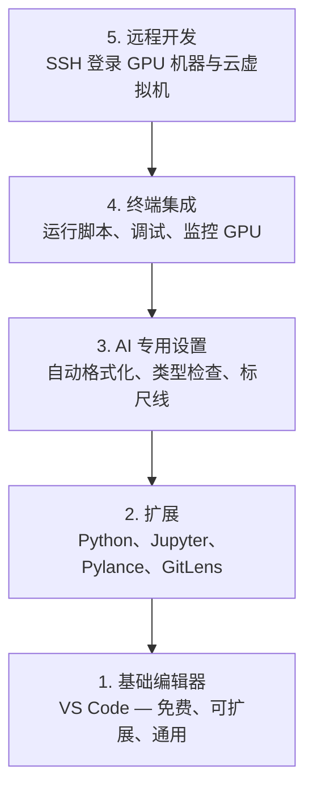

# 编辑器配置（Editor Setup）

> 编辑器是你的副驾驶。花一次工夫把它配置好，让它不再碍事，而是真正帮你干活。

**Type:** Build
**Languages:** --
**Prerequisites:** Phase 0, Lesson 01
**Time:** ~20 minutes

## 学习目标（Learning Objectives）

- 安装 VS Code 以及面向 Python、Jupyter、linting 和远程 SSH 的必备扩展
- 为 AI 工作流配置保存时格式化（format on save）、类型检查（type checking）和 notebook 输出滚动
- 设置 Remote SSH，像操作本地机器一样编辑和调试远程 GPU 机器上的代码
- 评估其他编辑器选择（Cursor、Windsurf、Neovim）及其在 AI 工作中的权衡

## 问题所在（The Problem）

你会在编辑器里度过数千个小时：写 Python、跑 notebook、调试训练循环、SSH 登录 GPU 机器。一个配置不当的编辑器会让每次工作都充满摩擦：没有自动补全、没有类型提示、没有行内报错、要手动格式化，终端工作流也很笨拙。

正确的配置只需 20 分钟。跳过它，你每天都要多花 20 分钟。

## 核心概念（The Concept）

AI 工程的编辑器配置需要五样东西：



```figure
s0-lsp-roundtrip
```

## 动手构建（Build It）

### 第 1 步：安装 VS Code（Step 1: Install VS Code）

VS Code 是推荐的编辑器。它免费、能在所有操作系统上运行、对 Jupyter notebook 有一流支持，扩展生态覆盖了 AI 工作所需的一切。

从 [code.visualstudio.com](https://code.visualstudio.com/) 下载。

在终端里验证：

```bash
code --version
```

如果在 macOS 上找不到 `code` 命令，打开 VS Code，按 `Cmd+Shift+P`，输入 "Shell Command"，然后选择 "Install 'code' command in PATH"。

### 第 2 步：安装必备扩展（Step 2: Install Essential Extensions）

在 VS Code 中打开集成终端（所有平台上都是 `` Ctrl+` ``），安装对 AI 工作重要的扩展：

```bash
code --install-extension ms-python.python
code --install-extension ms-python.vscode-pylance
code --install-extension ms-toolsai.jupyter
code --install-extension eamodio.gitlens
code --install-extension ms-vscode-remote.remote-ssh
code --install-extension ms-python.debugpy
code --install-extension ms-python.black-formatter
code --install-extension charliermarsh.ruff
```

各自的作用：

| 扩展 | 用途 |
|------|------|
| Python | 语言支持、虚拟环境检测、运行与调试 |
| Pylance | 快速类型检查、自动补全、导入解析 |
| Jupyter | 在 VS Code 内运行 notebook、变量查看器 |
| GitLens | 查看谁改了什么、行内 git blame |
| Remote SSH | 像本地文件夹一样打开远程 GPU 机器上的目录 |
| Debugpy | Python 单步调试 |
| Black Formatter | 保存时自动格式化、风格统一 |
| Ruff | 快速 lint、捕获常见错误 |

本课的 `code/.vscode/extensions.json` 文件包含完整的推荐列表。当你打开项目文件夹时，VS Code 会提示你安装它们。

### 第 3 步：配置设置（Step 3: Configure Settings）

复制本课 `code/.vscode/settings.json` 里的设置，或者通过 `Settings > Open Settings (JSON)` 手动应用。

对 AI 工作最关键的设置：

```jsonc
{
    "python.analysis.typeCheckingMode": "basic",
    "editor.formatOnSave": true,
    "editor.rulers": [88, 120],
    "notebook.output.scrolling": true,
    "files.autoSave": "afterDelay"
}
```

这些设置为什么重要：

- **类型检查设为 basic**：在你运行代码之前就抓住参数类型错误，为排查张量形状不匹配和 API 参数错误省下调试时间。
- **保存时格式化**：再也不用操心格式问题，交给 Black 处理。
- **88 和 120 两条标尺线**：Black 在 88 列处换行；120 列的标记提醒你 docstring 和注释开始过长了。
- **notebook 输出滚动**：训练循环会打印成千上万行。没有滚动，输出面板会直接爆掉。
- **自动保存**：你总会忘记保存，训练脚本就会跑旧代码。自动保存能避免这一点。

### 第 4 步：终端集成（Step 4: Terminal Integration）

VS Code 的集成终端是你运行训练脚本、监控 GPU、管理环境的地方。

把它配置好：

```jsonc
{
    "terminal.integrated.defaultProfile.osx": "zsh",
    "terminal.integrated.defaultProfile.linux": "bash",
    "terminal.integrated.fontSize": 13,
    "terminal.integrated.scrollback": 10000
}
```

实用快捷键：

| 操作 | macOS | Linux/Windows |
|------|-------|---------------|
| 切换终端 | `` Ctrl+` `` | `` Ctrl+` `` |
| 新建终端 | `` Ctrl+Shift+` `` | `` Ctrl+Shift+` `` |
| 拆分终端 | `Cmd+\` | `Ctrl+Shift+5` |

拆分终端很有用：一个跑你的脚本，另一个用 `nvidia-smi -l 1` 或 `watch -n 1 nvidia-smi` 监控 GPU。

### 第 5 步：远程开发（SSH 登录 GPU 机器）（Step 5: Remote Development (SSH into GPU Boxes)）

这是对 AI 工作最重要的扩展。你会在远程机器上跑训练（云虚拟机、实验室服务器、Lambda、Vast.ai）。Remote SSH 让你打开远程文件系统、编辑文件、运行终端、调试，就像一切都在本地一样。

设置步骤：

1. 安装 Remote SSH 扩展（第 2 步已完成）。
2. 按 `Ctrl+Shift+P`（或 `Cmd+Shift+P`），输入 "Remote-SSH: Connect to Host"。
3. 输入 `user@your-gpu-box-ip`。
4. VS Code 会自动在远程机器上安装它的服务端组件。

要免密访问，先配置 SSH 密钥：

```bash
ssh-keygen -t ed25519 -C "your-email@example.com"
ssh-copy-id user@your-gpu-box-ip
```

为方便起见，把主机加进 `~/.ssh/config`：

```
Host gpu-box
    HostName 203.0.113.50
    User ubuntu
    IdentityFile ~/.ssh/id_ed25519
    ForwardAgent yes
```

现在 `Remote-SSH: Connect to Host > gpu-box` 一秒就能连上。

## 替代方案（Alternatives）

### Cursor

[cursor.com](https://cursor.com) 是一个内置 AI 代码生成的 VS Code 分支。它使用相同的扩展生态和设置格式。如果你用 Cursor，本课的内容依然全部适用：导入同样的 `settings.json` 和 `extensions.json` 即可。

### Windsurf

[windsurf.com](https://windsurf.com) 是另一个 AI 优先的 VS Code 分支。情况一样：同样的扩展、同样的设置格式、同样的 Remote SSH 支持。

### Vim/Neovim

如果你已经在用 Vim 或 Neovim，而且用得很顺手，那就继续用下去。AI Python 工作的最低配置：

- **pyright** 或 **pylsp** 用于类型检查（通过 Mason 或手动安装）
- **nvim-lspconfig** 用于接入语言服务器
- **jupyter-vim** 或 **molten-nvim** 用于类 notebook 执行
- **telescope.nvim** 用于文件/符号搜索
- **none-ls.nvim** 配合 black 和 ruff 做格式化/lint

如果你还没用过 Vim，现在也别开始。它的学习曲线会和学 AI 工程抢时间。用 VS Code。

## 实际应用（Use It）

有了这套配置，你的日常工作流是这样的：

1. 在 VS Code 中打开项目文件夹（或通过 Remote SSH 连上 GPU 机器）。
2. 在编辑器里写 Python，享受自动补全、类型提示和行内报错。
3. 用 Jupyter 扩展在编辑器内直接运行 Jupyter notebook。
4. 用集成终端跑训练脚本、执行 `uv pip install`、监控 GPU。
5. 提交前用 GitLens 审查改动。

## 练习（Exercises）

1. 安装 VS Code 和第 2 步列出的所有扩展
2. 把本课的 `settings.json` 复制进你的 VS Code 配置
3. 打开一个 Python 文件，验证 Pylance 能显示类型提示、Black 会在保存时格式化
4. 如果你有远程机器可用，配置 Remote SSH 并打开上面的文件夹

## 关键术语（Key Terms）

| 术语 | 人们常说 | 实际含义 |
|------|----------|----------|
| LSP | “自动补全引擎” | 语言服务器协议（Language Server Protocol）：一套标准，让编辑器从针对特定语言的服务器获取类型信息、补全和诊断 |
| Pylance | “那个 Python 插件” | 微软的 Python 语言服务器，用 Pyright 做类型检查和 IntelliSense |
| Remote SSH | “在服务器上干活” | 一个 VS Code 扩展，在远程机器上运行轻量级服务端，并把 UI 流式传回你的本地编辑器 |
| 保存时格式化 | “自动美化” | 每次保存时编辑器都会运行一个格式化工具（Black、Ruff），让代码风格始终一致 |
