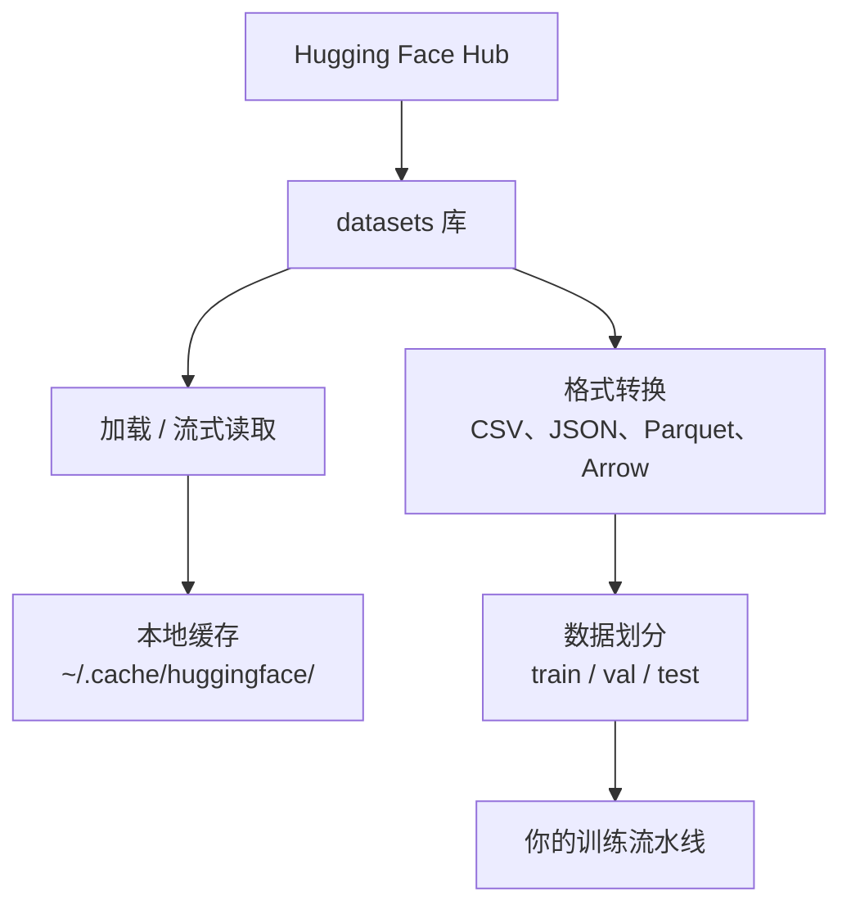

# 数据管理（Data Management）

> 数据是燃料。你管理数据的方式决定了你能跑多快。

**Type:** Build
**Language:** Python
**Prerequisites:** Phase 0, Lesson 01
**Time:** ~45 minutes

## 学习目标（Learning Objectives）

- 使用 Hugging Face `datasets` 库加载、流式读取和缓存数据集
- 在 CSV、JSON、Parquet 和 Arrow 格式之间互相转换，并解释各自的取舍
- 用固定随机种子创建可复现的训练/验证/测试划分
- 使用 `.gitignore`、Git LFS 或 DVC 管理大型模型和数据集文件

## 问题所在（The Problem）

每个 AI 项目都从数据开始。你需要寻找数据集、下载它们、在格式之间转换、划分训练集和评估集，还要做版本管理，让实验可以复现。每次都手动做这些事又慢又容易出错。你需要一套可重复的工作流。

## 核心概念（The Concept）



Hugging Face 的 `datasets` 库是 AI 工作中加载数据的标准方式。它开箱即用地处理下载、缓存、格式转换和流式读取。

```figure
s0-data-pipeline
```

## 动手构建（Build It）

### 第 1 步：安装 datasets 库（Step 1: Install the datasets library）

```bash
pip install datasets huggingface_hub
```

### 第 2 步：加载数据集（Step 2: Load a dataset）

```python
from datasets import load_dataset

dataset = load_dataset("stanfordnlp/imdb")
print(dataset)
print(dataset["train"][0])
```

这会下载 IMDB 电影评论数据集。首次下载之后，就会从 `~/.cache/huggingface/datasets/` 的缓存加载。

### 第 3 步：流式读取大型数据集（Step 3: Stream large datasets）

有些数据集大到连磁盘都放不下。流式读取（streaming）逐行加载数据，而不必下载完整数据集。

```python
dataset = load_dataset("wikimedia/wikipedia", "20220301.en", split="train", streaming=True)

for i, example in enumerate(dataset):
    print(example["title"])
    if i >= 4:
        break
```

流式读取给你一个 `IterableDataset`。数据行一到就处理，无论数据集多大，内存占用都保持恒定。

### 第 4 步：数据集格式（Step 4: Dataset formats）

`datasets` 库底层使用 Apache Arrow。你可以根据流水线的需要转换成其他格式。

```python
dataset = load_dataset("stanfordnlp/imdb", split="train")

dataset.to_csv("imdb_train.csv")
dataset.to_json("imdb_train.json")
dataset.to_parquet("imdb_train.parquet")
```

格式对比：

| 格式 | 体积 | 读取速度 | 最适合 |
|------|------|----------|--------|
| CSV | 大 | 慢 | 人类可读、电子表格 |
| JSON | 大 | 慢 | API、嵌套数据 |
| Parquet | 小 | 快 | 分析、列式查询 |
| Arrow | 小 | 最快 | 内存内处理（`datasets` 内部使用的格式） |

对 AI 工作来说，Parquet 是最好的存储格式；Arrow 是你在内存中操作的格式；CSV 和 JSON 用于数据交换。

### 第 5 步：数据划分（Step 5: Data splits）

每个 ML 项目都需要三个划分：

- **训练集**（train）：模型从中学习（通常占 80%）
- **验证集**（validation）：训练过程中用它检查进度（通常占 10%）
- **测试集**（test）：训练结束后的最终评估（通常占 10%）

有些数据集自带划分。没有的话，就自己动手：

```python
dataset = load_dataset("stanfordnlp/imdb", split="train")

split = dataset.train_test_split(test_size=0.2, seed=42)
train_val = split["train"].train_test_split(test_size=0.125, seed=42)

train_ds = train_val["train"]
val_ds = train_val["test"]
test_ds = split["test"]

print(f"Train: {len(train_ds)}, Val: {len(val_ds)}, Test: {len(test_ds)}")
```

为了可复现，一定要设置随机种子（seed）。同一个种子每次都会产生完全相同的划分。

### 第 6 步：下载并缓存模型（Step 6: Download and cache models）

模型是大文件。`huggingface_hub` 库负责下载和缓存。

```python
from huggingface_hub import hf_hub_download, snapshot_download

model_path = hf_hub_download(
    repo_id="sentence-transformers/all-MiniLM-L6-v2",
    filename="config.json"
)
print(f"Cached at: {model_path}")

model_dir = snapshot_download("sentence-transformers/all-MiniLM-L6-v2")
print(f"Full model at: {model_dir}")
```

模型会缓存到 `~/.cache/huggingface/hub/`。下载过一次之后，后续运行都能立即加载。

### 第 7 步：处理大文件（Step 7: Handle large files）

模型权重和大型数据集不应该提交进 git。有三种选择：

**方案 A：.gitignore（最简单）**

```
*.bin
*.safetensors
*.pt
*.onnx
data/*.parquet
data/*.csv
models/
```

**方案 B：Git LFS（在 git 中跟踪大文件）**

```bash
git lfs install
git lfs track "*.bin"
git lfs track "*.safetensors"
git add .gitattributes
```

Git LFS 在你的仓库里只存指针，实际文件放在单独的服务器上。GitHub 免费提供 1 GB。

**方案 C：DVC（数据版本控制）**

```bash
pip install dvc
dvc init
dvc add data/training_set.parquet
git add data/training_set.parquet.dvc data/.gitignore
git commit -m "Track training data with DVC"
```

DVC 会生成指向数据的小 `.dvc` 文件。数据本身存放在 S3、GCS 或其他远程存储后端。

| 方式 | 复杂度 | 最适合 |
|------|--------|--------|
| .gitignore | 低 | 个人项目、可以重新下载的数据 |
| Git LFS | 中 | 通过 git 共享模型权重的团队 |
| DVC | 高 | 可复现实验、大型数据集、团队协作 |

对本课程来说，`.gitignore` 就够了。需要跨机器精确复现实验时，再用 DVC。

### 第 8 步：存储模式（Step 8: Storage patterns）

**本地存储**适用于 10 GB 以下的数据集，HF 缓存会自动处理。

**云存储**用于更大的数据集，或者需要跨机器共享的场景：

```python
import os

local_path = os.path.expanduser("~/.cache/huggingface/datasets/")

# s3_path = "s3://my-bucket/datasets/"
# gcs_path = "gs://my-bucket/datasets/"
```

DVC 可以直接对接 S3 和 GCS：

```bash
dvc remote add -d myremote s3://my-bucket/dvc-store
dvc push
```

对本课程来说，本地存储已经足够。当你在远程 GPU 实例上微调（fine-tune）时，云存储才会派上用场。

## 本课程使用的数据集（Datasets Used in This Course）

| 数据集 | 课程 | 大小 | 教学内容 |
|--------|------|------|----------|
| IMDB | 词元化（tokenization）、分类 | 84 MB | 文本分类基础 |
| WikiText | 语言建模 | 181 MB | 下一个词元预测（next-token prediction） |
| SQuAD | 问答系统 | 35 MB | 问答、答案区间（span） |
| Common Crawl（子集） | 嵌入（embedding） | 不定 | 大规模文本处理 |
| MNIST | 视觉基础 | 21 MB | 图像分类基础 |
| COCO（子集） | 多模态 | 不定 | 图文对 |

你现在不需要把所有数据集都下载下来。每节课会说明自己需要什么。

## 实际应用（Use It）

运行工具脚本，验证一切正常：

```bash
python code/data_utils.py
```

它会下载一个小数据集、转换格式、做划分，并打印摘要。

## 交付成果（Ship It）

本课产出：
- `code/data_utils.py` - 可复用的数据加载与缓存工具
- `outputs/prompt-data-helper.md` - 用于给任务匹配合适数据集的提示词（prompt）

## 练习（Exercises）

1. 用 `mrpc` 配置加载 `glue` 数据集，并查看前 5 个样本
2. 流式读取 `c4` 数据集，统计 10 秒内能处理多少个样本
3. 把一个数据集转成 Parquet，比较它与 CSV 的文件大小
4. 用固定种子创建 70/15/15 的训练/验证/测试划分，并核对各部分大小

## 关键术语（Key Terms）

| 术语 | 人们常说 | 实际含义 |
|------|----------|----------|
| 数据集划分（split） | “训练数据” | 机器学习生命周期不同阶段使用的一组命名子集（train/val/test） |
| 流式读取 | “懒加载” | 从远程源逐行处理数据，而不下载完整数据集 |
| Parquet | “压缩版 CSV” | 一种列式文件格式，为分析查询和存储效率而优化 |
| Arrow | “快速数据框” | 一种内存中的列式格式，datasets 库内部用它实现零拷贝读取 |
| Git LFS | “大文件版 git” | 一种扩展，把大文件存在 git 仓库之外，同时在版本控制中保留指针 |
| DVC | “数据版 git” | 面向数据集和模型的版本控制系统，可与云存储集成 |
| 缓存 | “已经下载过了” | 之前获取过的数据的本地副本，默认存放在 ~/.cache/huggingface/ |
