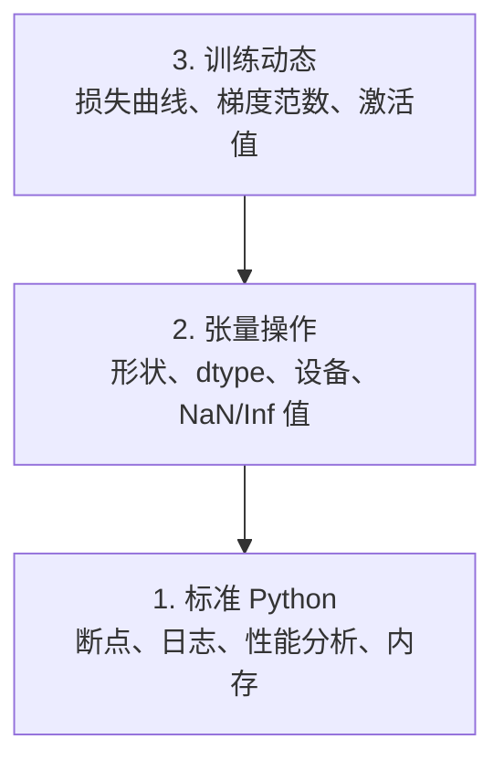

# 调试与性能分析（Debugging and Profiling）

> 最危险的 AI bug 不会让程序崩溃。它们让模型在垃圾数据上悄悄训练，最后报告一条漂亮的损失曲线。

**Type:** Build
**Language:** Python
**Prerequisites:** Lesson 1 (Dev Environment), basic PyTorch familiarity
**Time:** ~60 minutes

## 学习目标（Learning Objectives）

- 使用条件触发的 `breakpoint()` 和 `debug_print`，在训练中途检查张量（tensor）的形状、dtype 和 NaN 值
- 用 `cProfile`、`line_profiler` 和 `tracemalloc` 对训练循环做性能分析（profiling），找出瓶颈
- 检测常见的 AI bug：形状不匹配、NaN 损失、数据泄漏（data leakage）和放错设备的张量
- 配置 TensorBoard，可视化损失曲线、权重直方图和梯度（gradient）分布

## 问题所在（The Problem）

AI 代码的失败方式和普通代码不一样。Web 应用崩溃时会抛出一串堆栈跟踪；而一个配置有误的训练循环会跑上 8 个小时，烧掉 $200 的 GPU 费用，最后产出一个对任何输入都只预测均值的模型。代码全程没有报错。bug 可能是张量放错了设备、忘了写 `.detach()`，也可能是标签泄漏进了特征。

你需要调试工具在这些静默失败浪费你的时间和算力之前，就把它们揪出来。

## 核心概念（The Concept）

AI 调试分三个层次：



大多数人直接跳到第 3 层（盯着 TensorBoard 看）。但 80% 的 AI bug 都藏在第 1 层和第 2 层。

```figure
s0-flame-hot
```

## 动手构建（Build It）

### 第 1 部分：打印调试确实管用（Part 1: Print Debugging (Yes, It Works)）

打印调试常被看轻，但它不该被看轻。对张量代码来说，一条有的放矢的打印语句比在调试器里单步执行更有效，因为你需要同时看到形状、dtype 和取值范围。

```python
def debug_print(name, tensor):
    print(f"{name}: shape={tensor.shape}, dtype={tensor.dtype}, "
          f"device={tensor.device}, "
          f"min={tensor.min().item():.4f}, max={tensor.max().item():.4f}, "
          f"mean={tensor.mean().item():.4f}, "
          f"has_nan={tensor.isnan().any().item()}")
```

在每个可疑操作之后调用它；找到 bug 后，把这些打印删掉。就这么简单。

### 第 2 部分：Python 调试器（pdb 与 breakpoint）（Part 2: Python Debugger (pdb and breakpoint)）

内置调试器在 AI 工作中被低估了。把 `breakpoint()` 放进训练循环，就能交互式地检查张量。

```python
def training_step(model, batch, criterion, optimizer):
    inputs, labels = batch
    outputs = model(inputs)
    loss = criterion(outputs, labels)

    if loss.item() > 100 or torch.isnan(loss):
        breakpoint()

    loss.backward()
    optimizer.step()
```

调试器停下来之后，下面这些命令很有用：

- `p outputs.shape` 查看形状
- `p loss.item()` 查看损失值
- `p torch.isnan(outputs).sum()` 统计 NaN 的数量
- `p model.fc1.weight.grad` 检查梯度
- `c` 继续执行，`q` 退出

这就是条件调试：只有看起来不对劲时才停下来。对一个 10,000 步的训练运行来说，这一点很重要。

### 第 3 部分：Python 日志（Part 3: Python Logging）

当调试超出快速检查的范畴时，用日志（logging）取代 print 语句。

```python
import logging

logging.basicConfig(
    level=logging.INFO,
    format="%(asctime)s [%(levelname)s] %(message)s",
    handlers=[
        logging.FileHandler("training.log"),
        logging.StreamHandler()
    ]
)
logger = logging.getLogger(__name__)

logger.info("Starting training: lr=%.4f, batch_size=%d", lr, batch_size)
logger.warning("Loss spike detected: %.4f at step %d", loss.item(), step)
logger.error("NaN loss at step %d, stopping", step)
```

日志给你时间戳、严重级别和文件输出。当训练在凌晨 3 点失败时，你想要的是一个日志文件，而不是早已滚出屏幕的终端输出。

### 第 4 部分：为代码段计时（Part 4: Timing Code Sections）

知道时间花在哪里，是优化的第一步。

```python
import time

class Timer:
    def __init__(self, name=""):
        self.name = name

    def __enter__(self):
        self.start = time.perf_counter()
        return self

    def __exit__(self, *args):
        elapsed = time.perf_counter() - self.start
        print(f"[{self.name}] {elapsed:.4f}s")

with Timer("data loading"):
    batch = next(dataloader_iter)

with Timer("forward pass"):
    outputs = model(batch)

with Timer("backward pass"):
    loss.backward()
```

一个常见的发现：数据加载占了训练时间的 60%。解决办法是在 DataLoader 里设置 `num_workers > 0`，而不是换一块更快的 GPU。

### 第 5 部分：cProfile 与 line_profiler（Part 5: cProfile and line_profiler）

当你需要比手动计时器更多的东西时：

```bash
python -m cProfile -s cumtime train.py
```

它会按累计时间排序，显示每一次函数调用。要逐行分析的话：

```bash
pip install line_profiler
```

```python
@profile
def train_step(model, data, target):
    output = model(data)
    loss = F.cross_entropy(output, target)
    loss.backward()
    return loss

# Run with: kernprof -l -v train.py
```

### 第 6 部分：内存分析（Part 6: Memory Profiling）

#### 用 tracemalloc 分析 CPU 内存（CPU Memory with tracemalloc）

```python
import tracemalloc

tracemalloc.start()

# your code here
model = build_model()
data = load_dataset()

snapshot = tracemalloc.take_snapshot()
top_stats = snapshot.statistics("lineno")
for stat in top_stats[:10]:
    print(stat)
```

#### 用 memory_profiler 分析 CPU 内存（CPU Memory with memory_profiler）

```bash
pip install memory_profiler
```

```python
from memory_profiler import profile

@profile
def load_data():
    raw = read_csv("data.csv")       # watch memory jump here
    processed = preprocess(raw)       # and here
    return processed
```

用 `python -m memory_profiler your_script.py` 运行，就能看到逐行的内存占用。

#### 用 PyTorch 分析 GPU 内存（GPU Memory with PyTorch）

```python
import torch

if torch.cuda.is_available():
    print(torch.cuda.memory_summary())

    print(f"Allocated: {torch.cuda.memory_allocated() / 1e9:.2f} GB")
    print(f"Cached: {torch.cuda.memory_reserved() / 1e9:.2f} GB")
```

当你遇到 OOM（内存耗尽，Out of Memory）时：

1. 减小 batch size（永远是第一个要试的办法）
2. 用 `torch.cuda.empty_cache()` 释放缓存的显存
3. 对大的中间结果，先 `del tensor`，再执行 `torch.cuda.empty_cache()`
4. 用混合精度（`torch.cuda.amp`）把显存占用减半
5. 对非常深的模型使用梯度检查点（gradient checkpointing）

### 第 7 部分：常见 AI Bug 及其捕获方法（Part 7: Common AI Bugs and How to Catch Them）

#### 形状不匹配（Shape Mismatch）

最常见的 bug：张量的形状是 `[batch, features]`，而模型期望的却是 `[batch, channels, height, width]`。

```python
def check_shapes(model, sample_input):
    print(f"Input: {sample_input.shape}")
    hooks = []

    def make_hook(name):
        def hook(module, inp, out):
            in_shape = inp[0].shape if isinstance(inp, tuple) else inp.shape
            out_shape = out.shape if hasattr(out, "shape") else type(out)
            print(f"  {name}: {in_shape} -> {out_shape}")
        return hook

    for name, module in model.named_modules():
        hooks.append(module.register_forward_hook(make_hook(name)))

    with torch.no_grad():
        model(sample_input)

    for h in hooks:
        h.remove()
```

用一个样例 batch 把这段代码跑一遍，它会把模型里每一次形状变换都列出来。

#### NaN 损失（NaN Loss）

NaN 损失意味着有什么东西爆炸了。常见原因：

- 学习率（learning rate）太高
- 自定义损失里除以零
- 对零或负数取对数
- RNN 中的梯度爆炸

```python
def detect_nan(model, loss, step):
    if torch.isnan(loss):
        print(f"NaN loss at step {step}")
        for name, param in model.named_parameters():
            if param.grad is not None:
                if torch.isnan(param.grad).any():
                    print(f"  NaN gradient in {name}")
                if torch.isinf(param.grad).any():
                    print(f"  Inf gradient in {name}")
        return True
    return False
```

#### 数据泄漏（Data Leakage）

你的模型在测试集上拿到 99% 的准确率。听起来很棒，其实是个 bug。

```python
def check_data_leakage(train_set, test_set, id_column="id"):
    train_ids = set(train_set[id_column].tolist())
    test_ids = set(test_set[id_column].tolist())
    overlap = train_ids & test_ids
    if overlap:
        print(f"DATA LEAKAGE: {len(overlap)} samples in both train and test")
        return True
    return False
```

还要检查时间泄漏（temporal leakage）：用未来的数据去预测过去。切分数据之前，先按时间戳排序。

#### 设备放错（Wrong Device）

张量分布在不同设备上（CPU 与 GPU）会引发运行时错误。但有时某个张量悄悄留在 CPU 上，而其他一切都在 GPU 上，训练只是单纯变慢了。

```python
def check_devices(model, *tensors):
    model_device = next(model.parameters()).device
    print(f"Model device: {model_device}")
    for i, t in enumerate(tensors):
        if t.device != model_device:
            print(f"  WARNING: tensor {i} on {t.device}, model on {model_device}")
```

### 第 8 部分：TensorBoard 基础（Part 8: TensorBoard Basics）

TensorBoard 让你看到训练过程随时间的内部变化。

```bash
pip install tensorboard
```

```python
from torch.utils.tensorboard import SummaryWriter

writer = SummaryWriter("runs/experiment_1")

for step in range(num_steps):
    loss = train_step(model, batch)

    writer.add_scalar("loss/train", loss.item(), step)
    writer.add_scalar("lr", optimizer.param_groups[0]["lr"], step)

    if step % 100 == 0:
        for name, param in model.named_parameters():
            writer.add_histogram(f"weights/{name}", param, step)
            if param.grad is not None:
                writer.add_histogram(f"grads/{name}", param.grad, step)

writer.close()
```

启动它：

```bash
tensorboard --logdir=runs
```

需要关注这些信号：

- **损失不下降**：学习率太低，或者模型架构有问题
- **损失剧烈震荡**：学习率太高
- **损失变成 NaN**：数值不稳定（见上面的 NaN 一节）
- **训练损失下降、验证损失上升**：过拟合（overfitting）
- **权重直方图坍缩到零**：梯度消失（vanishing gradients）
- **梯度直方图爆炸**：需要梯度裁剪（gradient clipping）

### 第 9 部分：VS Code 调试器（Part 9: VS Code Debugger）

要做交互式调试，给 VS Code 配一个 `launch.json`：

```json
{
    "version": "0.2.0",
    "configurations": [
        {
            "name": "Debug Training",
            "type": "debugpy",
            "request": "launch",
            "program": "${file}",
            "console": "integratedTerminal",
            "justMyCode": false
        }
    ]
}
```

点击行号旁的空白处设置断点；用 Variables 面板检查张量属性；Debug Console 允许你在执行过程中运行任意 Python 表达式。

它适合单步跟踪数据预处理流水线，看清每一次变换。

## 实际运用（Use It）

下面这套调试流程能抓住大多数 AI bug：

1. **训练前**：用一个样例 batch 运行 `check_shapes`，确认输入和输出维度符合预期。
2. **前 10 步**：对损失、输出和梯度使用 `debug_print`，确认没有 NaN、数值都在合理范围内。
3. **训练中**：记录损失、学习率和梯度范数。用 TensorBoard 做可视化。
4. **出问题时**：在失败点放下 `breakpoint()`，交互式地检查张量。
5. **性能方面**：分别给数据加载、前向传播（forward pass）和反向传播（backward pass）计时。如果接近 OOM，就做内存分析。

## 发布成果（Ship It）

运行调试工具箱脚本：

```bash
python phases/00-setup-and-tooling/12-debugging-and-profiling/code/debug_tools.py
```

一个有助于诊断 AI 特有 bug 的提示词见 `outputs/prompt-debug-ai-code.md`。

## 练习（Exercises）

1. 运行 `debug_tools.py`，通读每一部分的输出。修改这个假模型，制造一个 NaN（提示：在前向传播里除以零），然后看检测器把它抓住。
2. 用 `cProfile` 分析一个训练循环，找出最慢的函数。
3. 用 `tracemalloc` 找出数据加载流水线里分配内存最多的那一行。
4. 为一次简单的训练运行配置 TensorBoard，判断模型是否在过拟合。
5. 在训练循环里使用 `breakpoint()`，练习在调试器提示符下检查张量的形状、设备和梯度值。
