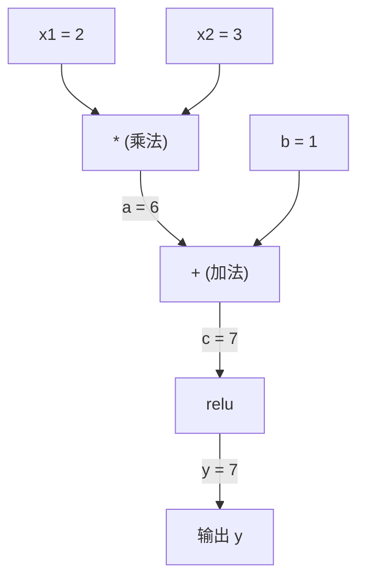
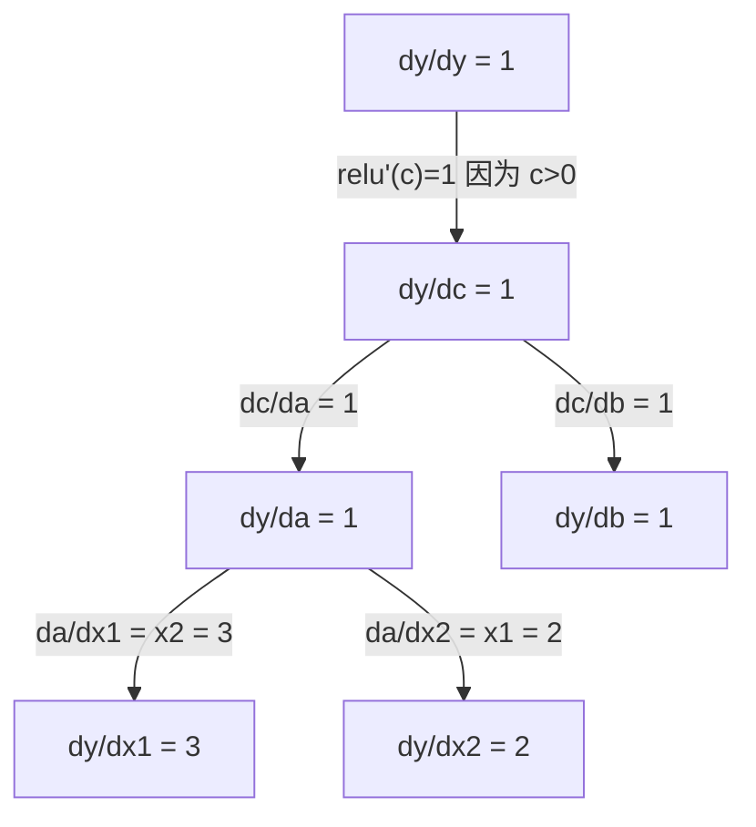

# 链式法则与自动微分（Chain Rule & Automatic Differentiation）

> 链式法则是每一个能学习的神经网络背后的引擎。

**Type:** Build
**Language:** Python
**Prerequisites:** Phase 1, Lesson 04 (Derivatives & Gradients)
**Time:** ~90 minutes

## 学习目标（Learning Objectives）

- 构建一个极简的 autograd 引擎（Value 类），让它记录运算并通过反向模式自动微分计算梯度
- 使用拓扑排序在计算图上实现前向传播与反向传播
- 只用从零实现的 autograd 引擎，在 XOR 上构建并训练一个多层感知机
- 用基于数值有限差分的梯度检查来验证自动微分的正确性

## 问题所在（The Problem）

你会计算简单函数的导数。但神经网络不是一个简单函数，而是成百上千个函数复合在一起：矩阵乘法、加偏置、应用激活函数、再来一次矩阵乘法、softmax、交叉熵损失。输出是函数的函数的函数。

要训练网络，你需要损失函数对每一个权重的梯度。面对数百万个参数，手工推导是不可能的；用数值方法（有限差分）又太慢。

链式法则给了你数学，自动微分（automatic differentiation）给了你算法。两者结合起来，你就能在与一次前向传播同阶的时间内，算出任意函数复合下的精确梯度。

PyTorch、TensorFlow 和 JAX 都是这样工作的。你将从零构建一个迷你版本。

## 核心概念（The Concept）

### 链式法则（The Chain Rule）

若 `y = f(g(x))`，则 `y` 对 `x` 的导数是：

```
dy/dx = dy/dg * dg/dx = f'(g(x)) * g'(x)
```

沿着链把导数乘起来，每一环贡献它自己的局部导数。

例如：`y = sin(x^2)`

```
g(x) = x^2       g'(x) = 2x
f(g) = sin(g)     f'(g) = cos(g)

dy/dx = cos(x^2) * 2x
```

对更深的复合，链继续延伸：

```
y = f(g(h(x)))

dy/dx = f'(g(h(x))) * g'(h(x)) * h'(x)
```

神经网络里的每一层，就是这条链上的一环。

### 计算图（Computational Graphs）

计算图让链式法则变得看得见。每个运算变成一个节点，数据沿图向前流动，梯度反向流动。

**前向传播（计算数值）：**



**反向传播（计算梯度）：**



反向传播在每个节点上应用链式法则，把梯度从输出一路传回输入。

### 前向模式与反向模式（Forward Mode vs Reverse Mode）

沿着图应用链式法则有两种方式。

**前向模式（forward mode）**从输入出发，把导数往前推。它先取 `dx/dx = 1`，再让导数穿过每个运算传播下去。适合输入少、输出多的场景。

```
Forward mode: seed dx/dx = 1, propagate forward

  x = 2       (dx/dx = 1)
  a = x^2     (da/dx = 2x = 4)
  y = sin(a)  (dy/dx = cos(a) * da/dx = cos(4) * 4 = -2.615)
```

**反向模式（reverse mode）**从输出出发，把梯度往回拉。它先取 `dy/dy = 1`，再按相反顺序穿过每个运算。适合输入多、输出少的场景。

```
Reverse mode: seed dy/dy = 1, propagate backward

  y = sin(a)  (dy/dy = 1)
  a = x^2     (dy/da = cos(a) = cos(4) = -0.654)
  x = 2       (dy/dx = dy/da * da/dx = -0.654 * 4 = -2.615)
```

神经网络有数百万个输入（权重）却只有一个输出（损失）。反向模式只需一次反向传播就能算出全部梯度。这就是反向传播（backpropagation）采用反向模式的原因。

| 模式 | 种子值 | 方向 | 最适用的场景 |
|------|------|-----------|-----------|
| 前向 | `dx_i/dx_i = 1` | 从输入到输出 | 输入少、输出多 |
| 反向 | `dy/dy = 1` | 从输出到输入 | 输入多、输出少（神经网络） |

### 用于前向模式的对偶数（Dual Numbers for Forward Mode）

前向模式可以用对偶数（dual numbers）优雅地实现。对偶数形如 `a + b*epsilon`，其中 `epsilon^2 = 0`。

```
Dual number: (value, derivative)

(2, 1) means: value is 2, derivative w.r.t. x is 1

Arithmetic rules:
  (a, a') + (b, b') = (a+b, a'+b')
  (a, a') * (b, b') = (a*b, a'*b + a*b')
  sin(a, a')         = (sin(a), cos(a)*a')
```

给输入变量的导数播种 1，导数就会自动穿过每个运算传播下去。

### 构建自动微分引擎（Building an Autograd Engine）

一个 autograd 引擎需要三样东西：

1. **值的包装。** 把每个数包进一个对象，对象里存它的数值和梯度。
2. **图的记录。** 每个运算记录自己的输入和局部梯度函数。
3. **反向传播。** 对图做拓扑排序（topological sort），然后反向遍历，在每个节点应用链式法则。

这正是 PyTorch 的 `autograd` 在做的事。`torch.Tensor` 类包装数值，在 `requires_grad=True` 时记录运算，并在你调用 `.backward()` 时计算梯度。

### PyTorch Autograd 的底层原理（How PyTorch Autograd Works Under the Hood）

当你写下 PyTorch 代码：

```python
x = torch.tensor(2.0, requires_grad=True)
y = x ** 2 + 3 * x + 1
y.backward()
print(x.grad)  # 7.0 = 2*x + 3 = 2*2 + 3
```

PyTorch 内部发生了这些事：

1. 为 `x` 创建一个 `Tensor` 节点并设置 `requires_grad=True`
2. 每个运算（`**`、`*`、`+`）都会创建一个新节点并记录反向函数
3. `y.backward()` 在记录好的图上触发反向模式自动微分
4. 每个节点的 `grad_fn` 计算局部梯度并传给父节点
5. 梯度以累加（而非覆盖）的方式写入 `.grad` 属性

这张图是动态的（define-by-run，边运行边构建）。每次前向传播都会新建一张图。这就是 PyTorch 支持在模型里使用控制流（if/else、循环）的原因。

```figure
chain-rule
```

## 动手构建（Build It）

### 第 1 步：Value 类（Step 1: The Value class）

```python
class Value:
    def __init__(self, data, children=(), op=''):
        self.data = data
        self.grad = 0.0
        self._backward = lambda: None
        self._prev = set(children)
        self._op = op

    def __repr__(self):
        return f"Value(data={self.data:.4f}, grad={self.grad:.4f})"
```

每个 `Value` 存储自己的数值、梯度（初始为 0）、一个反向函数，以及指向生成它的子节点的指针。

### 第 2 步：带梯度追踪的算术运算（Step 2: Arithmetic operations with gradient tracking）

```python
    def __add__(self, other):
        other = other if isinstance(other, Value) else Value(other)
        out = Value(self.data + other.data, (self, other), '+')
        def _backward():
            self.grad += out.grad
            other.grad += out.grad
        out._backward = _backward
        return out

    def __mul__(self, other):
        other = other if isinstance(other, Value) else Value(other)
        out = Value(self.data * other.data, (self, other), '*')
        def _backward():
            self.grad += other.data * out.grad
            other.grad += self.data * out.grad
        out._backward = _backward
        return out

    def relu(self):
        out = Value(max(0, self.data), (self,), 'relu')
        def _backward():
            self.grad += (1.0 if out.data > 0 else 0.0) * out.grad
        out._backward = _backward
        return out
```

每个运算都会创建一个闭包，闭包知道如何计算局部梯度并乘以上游梯度（`out.grad`）。`+=` 处理的是一个值被多个运算使用的情况。

### 第 3 步：反向传播（Step 3: The backward pass）

```python
    def backward(self):
        topo = []
        visited = set()
        def build_topo(v):
            if v not in visited:
                visited.add(v)
                for child in v._prev:
                    build_topo(child)
                topo.append(v)
        build_topo(self)

        self.grad = 1.0
        for v in reversed(topo):
            v._backward()
```

拓扑排序保证每个节点的梯度在被传给子节点之前已经完整算好。种子梯度是 1.0（dy/dy = 1）。

### 第 4 步：补全引擎所需的更多运算（Step 4: More operations for a complete engine）

基础的 Value 类已经能处理加法、乘法和 relu。一个真正的 autograd 引擎还需要更多。下面是构建神经网络所需的运算：

```python
    def __neg__(self):
        return self * -1

    def __sub__(self, other):
        return self + (-other)

    def __radd__(self, other):
        return self + other

    def __rmul__(self, other):
        return self * other

    def __rsub__(self, other):
        return other + (-self)

    def __pow__(self, n):
        out = Value(self.data ** n, (self,), f'**{n}')
        def _backward():
            self.grad += n * (self.data ** (n - 1)) * out.grad
        out._backward = _backward
        return out

    def __truediv__(self, other):
        return self * (other ** -1) if isinstance(other, Value) else self * (Value(other) ** -1)

    def exp(self):
        import math
        e = math.exp(self.data)
        out = Value(e, (self,), 'exp')
        def _backward():
            self.grad += e * out.grad
        out._backward = _backward
        return out

    def log(self):
        import math
        out = Value(math.log(self.data), (self,), 'log')
        def _backward():
            self.grad += (1.0 / self.data) * out.grad
        out._backward = _backward
        return out

    def tanh(self):
        import math
        t = math.tanh(self.data)
        out = Value(t, (self,), 'tanh')
        def _backward():
            self.grad += (1 - t ** 2) * out.grad
        out._backward = _backward
        return out
```

**每个运算为什么重要：**

| 运算 | 反向规则 | 用在何处 |
|-----------|--------------|---------|
| `__sub__` | 复用 add + neg | 损失计算（pred - target） |
| `__pow__` | n * x^(n-1) | 多项式激活、MSE（error^2） |
| `__truediv__` | 复用 mul + pow(-1) | 归一化、学习率缩放 |
| `exp` | exp(x) * 上游梯度 | Softmax、对数似然 |
| `log` | (1/x) * 上游梯度 | 交叉熵损失、对数概率 |
| `tanh` | (1 - tanh^2) * 上游梯度 | 经典激活函数 |

精妙之处在于：`__sub__` 和 `__truediv__` 是用已有运算定义出来的。它们免费获得正确的梯度，因为链式法则会沿着底层的 add/mul/pow 运算自动复合。

### 第 5 步：从零搭建迷你 MLP（Step 5: Mini MLP from scratch）

有了完整的 Value 类，你就能搭建神经网络。不用 PyTorch，不用 NumPy，只有 Value 和链式法则。

```python
import random

class Neuron:
    def __init__(self, n_inputs):
        self.w = [Value(random.uniform(-1, 1)) for _ in range(n_inputs)]
        self.b = Value(0.0)

    def __call__(self, x):
        act = sum((wi * xi for wi, xi in zip(self.w, x)), self.b)
        return act.tanh()

    def parameters(self):
        return self.w + [self.b]

class Layer:
    def __init__(self, n_inputs, n_outputs):
        self.neurons = [Neuron(n_inputs) for _ in range(n_outputs)]

    def __call__(self, x):
        return [n(x) for n in self.neurons]

    def parameters(self):
        return [p for n in self.neurons for p in n.parameters()]

class MLP:
    def __init__(self, sizes):
        self.layers = [Layer(sizes[i], sizes[i+1]) for i in range(len(sizes)-1)]

    def __call__(self, x):
        for layer in self.layers:
            x = layer(x)
        return x[0] if len(x) == 1 else x

    def parameters(self):
        return [p for layer in self.layers for p in layer.parameters()]
```

`Neuron` 计算 `tanh(w1*x1 + w2*x2 + ... + b)`。`Layer` 是一组神经元。`MLP` 把层堆叠起来。每个权重都是一个 `Value`，所以调用 `loss.backward()` 就能把梯度传播到每一个参数。

**在 XOR 上训练：**

```python
random.seed(42)
model = MLP([2, 4, 1])  # 2 inputs, 4 hidden neurons, 1 output

xs = [[0, 0], [0, 1], [1, 0], [1, 1]]
ys = [-1, 1, 1, -1]  # XOR pattern (using -1/1 for tanh)

for step in range(100):
    preds = [model(x) for x in xs]
    loss = sum((p - y) ** 2 for p, y in zip(preds, ys))

    for p in model.parameters():
        p.grad = 0.0
    loss.backward()

    lr = 0.05
    for p in model.parameters():
        p.data -= lr * p.grad

    if step % 20 == 0:
        print(f"step {step:3d}  loss = {loss.data:.4f}")

print("\nPredictions after training:")
for x, y in zip(xs, ys):
    print(f"  input={x}  target={y:2d}  pred={model(x).data:6.3f}")
```

这就是 micrograd。一个纯 Python、自带自动微分的完整神经网络训练循环。所有商业深度学习框架做的都是同一件事，只是规模大得多。

### 第 6 步：梯度检查（Step 6: Gradient checking）

你怎么知道自己的自动微分是对的？与数值导数对比。这就是梯度检查（gradient checking）。

```python
def gradient_check(build_expr, x_val, h=1e-7):
    x = Value(x_val)
    y = build_expr(x)
    y.backward()
    autodiff_grad = x.grad

    y_plus = build_expr(Value(x_val + h)).data
    y_minus = build_expr(Value(x_val - h)).data
    numerical_grad = (y_plus - y_minus) / (2 * h)

    diff = abs(autodiff_grad - numerical_grad)
    return autodiff_grad, numerical_grad, diff
```

在一个复杂表达式上试一下：

```python
def expr(x):
    return (x ** 3 + x * 2 + 1).tanh()

ad, num, diff = gradient_check(expr, 0.5)
print(f"Autodiff:  {ad:.8f}")
print(f"Numerical: {num:.8f}")
print(f"Difference: {diff:.2e}")
# Difference should be < 1e-5
```

实现新运算时，梯度检查必不可少。如果你的反向传播有 bug，数值检查会把它抓出来。所有严肃的深度学习实现都会在开发阶段运行梯度检查。

**什么时候使用梯度检查：**

| 场景 | 要做梯度检查吗？ |
|-----------|-------------------|
| 给自己的 autograd 添加新运算 | 要，永远要 |
| 调试一个不收敛的训练循环 | 要，先查梯度 |
| 生产环境训练 | 不要，太慢（每个参数要多做 2 次前向传播） |
| autograd 代码的单元测试 | 要，把它自动化 |

### 第 7 步：与手工计算对照验证（Step 7: Verify against manual calculation）

```python
x1 = Value(2.0)
x2 = Value(3.0)
a = x1 * x2          # a = 6.0
b = a + Value(1.0)    # b = 7.0
y = b.relu()          # y = 7.0

y.backward()

print(f"y = {y.data}")          # 7.0
print(f"dy/dx1 = {x1.grad}")   # 3.0 (= x2)
print(f"dy/dx2 = {x2.grad}")   # 2.0 (= x1)
```

手工验证：`y = relu(x1*x2 + 1)`。由于 `x1*x2 + 1 = 7 > 0`，relu 是恒等函数。
`dy/dx1 = x2 = 3`，`dy/dx2 = x1 = 2`。引擎的结果与手算一致。

## 学以致用（Use It）

### 与 PyTorch 对照验证（Verify against PyTorch）

```python
import torch

x1 = torch.tensor(2.0, requires_grad=True)
x2 = torch.tensor(3.0, requires_grad=True)
a = x1 * x2
b = a + 1.0
y = torch.relu(b)
y.backward()

print(f"PyTorch dy/dx1 = {x1.grad.item()}")  # 3.0
print(f"PyTorch dy/dx2 = {x2.grad.item()}")  # 2.0
```

梯度一模一样。你的引擎与 PyTorch 算出同样的结果，因为数学是一样的：基于链式法则的反向模式自动微分。

### 一个更复杂的表达式（A more complex expression）

```python
a = Value(2.0)
b = Value(-3.0)
c = Value(10.0)
f = (a * b + c).relu()  # relu(2*(-3) + 10) = relu(4) = 4

f.backward()
print(f"df/da = {a.grad}")  # -3.0 (= b)
print(f"df/db = {b.grad}")  #  2.0 (= a)
print(f"df/dc = {c.grad}")  #  1.0
```

## 交付成果（Ship It）

本课产出：
- `outputs/skill-autodiff.md` —— 一个用于构建和调试 autograd 系统的技能
- `code/autodiff.py` —— 一个可供你扩展的极简 autograd 引擎

这里构建的 Value 类是第 3 阶段神经网络训练循环的地基。

## 练习（Exercises）

1. 给 Value 类添加 `__pow__`，让你能计算 `x ** n`。验证 `d/dx(x^3)` 在 `x=2` 处等于 `12.0`。

2. 添加 `tanh` 作为激活函数。验证 `tanh'(0) = 1` 且 `tanh'(2) = 0.0707`（近似值）。

3. 为单个神经元构建计算图：`y = relu(w1*x1 + w2*x2 + b)`。算出全部五个梯度，并与 PyTorch 对照验证。

4. 用对偶数实现前向模式自动微分。创建一个 `Dual` 类，验证它与你的反向模式引擎给出相同的导数。

## 关键术语（Key Terms）

| 术语 | 人们常说的 | 实际含义 |
|------|----------------|----------------------|
| 链式法则（Chain rule） | “把导数乘起来” | 复合函数的导数等于各函数的局部导数在正确位置上的乘积 |
| 计算图（Computational graph） | “网络结构图” | 一种有向无环图：节点是运算，边正向携带数值、反向携带梯度 |
| 前向模式（Forward mode） | “把导数往前推” | 从输入到输出传播导数的自动微分。每个输入变量要跑一遍 |
| 反向模式（Reverse mode） | “反向传播” | 从输出到输入传播梯度的自动微分。每个输出变量要跑一遍 |
| Autograd | “自动求梯度” | 一种记录值的运算、构建图、并通过链式法则计算精确梯度的系统 |
| 对偶数（Dual numbers） | “值加导数” | 形如 a + b*epsilon（epsilon^2 = 0）的数，让导数信息随算术运算自动传播 |
| 拓扑排序（Topological sort） | “依赖顺序” | 给图的节点排序，使每个节点都排在它的所有依赖之后。正确传播梯度的前提 |
| 梯度累加（Gradient accumulation） | “累加而非覆盖” | 当一个值流入多个运算时，它的梯度是所有传入梯度贡献的总和 |
| 动态图（Dynamic graph） | “边运行边定义” | 每次前向传播都会重建的计算图，允许模型内部使用 Python 控制流（PyTorch 风格） |
| 梯度检查（Gradient checking） | “数值验证” | 把自动微分梯度与数值有限差分梯度对比来验证正确性。调试必备 |
| MLP | “多层感知机” | 含一个或多个隐藏层的神经网络。每个神经元计算加权和加偏置，再套一个激活函数 |
| 神经元（Neuron） | “加权和 + 激活” | 基本单元：output = activation(w1*x1 + w2*x2 + ... + b)。权重和偏置是可学习参数 |

## 延伸阅读（Further Reading）

- [3Blue1Brown：反向传播的微积分](https://www.youtube.com/watch?v=tIeHLnjs5U8) —— 神经网络中链式法则的可视化讲解
- [PyTorch Autograd mechanics](https://pytorch.org/docs/stable/notes/autograd.html) —— 真实系统是如何工作的
- [Baydin 等人《Automatic Differentiation in Machine Learning: a Survey》](https://arxiv.org/abs/1502.05767) —— 全面性的参考文献
