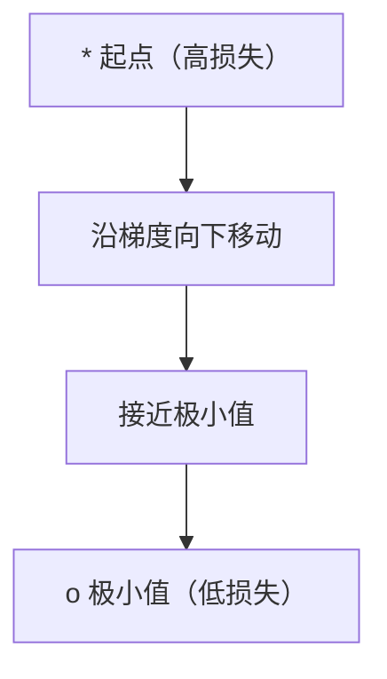
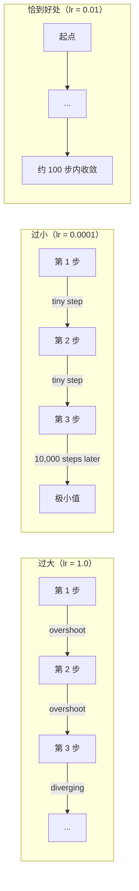
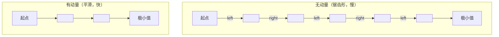
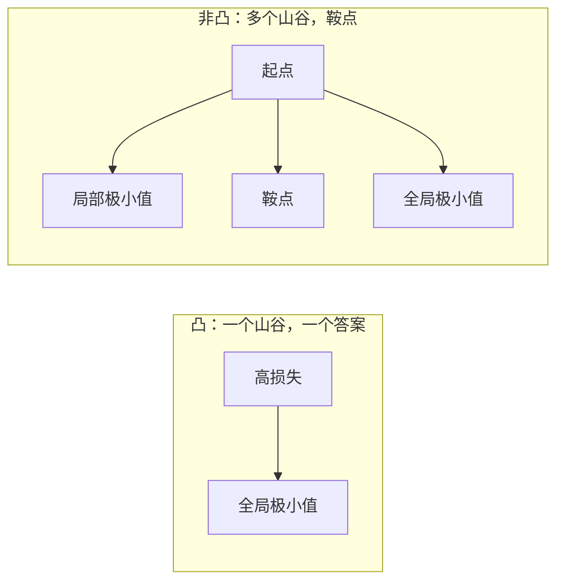
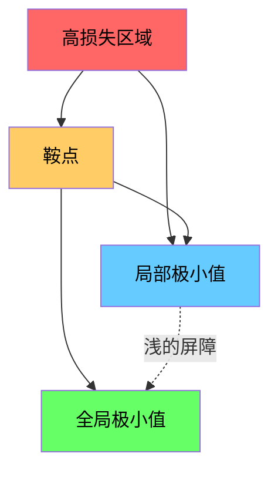

# 优化（Optimization）

> 训练神经网络，本质上就是找到谷底。

**Type:** Build
**Language:** Python
**Prerequisites:** Phase 1, Lessons 04-05 (Derivatives, Gradients)
**Time:** ~75 minutes

## 学习目标（Learning Objectives）

- 从零实现原始梯度下降、带动量的 SGD 和 Adam
- 在 Rosenbrock 函数上比较各优化器的收敛表现，并解释 Adam 为什么能逐权重自适应调整学习率
- 区分凸与非凸损失面，并解释鞍点在高维空间中的作用
- 配置学习率调度（step decay、cosine annealing、warmup）以保证训练稳定

## 问题（The Problem）

你有一个损失函数。它告诉你模型错得有多离谱。你有梯度。它们告诉你哪个方向会让损失变得更糟。现在你需要一个下山的策略。

最朴素的办法很简单：沿梯度的反方向移动。用一个叫学习率（learning rate）的数来缩放步长。重复。这就是梯度下降（gradient descent），而且它确实有效。但"有效"是有附加条件的。学习率太大，你会完全冲过谷底，在两壁之间来回弹跳。学习率太小，你要爬行数千个不必要的步骤才能接近答案。碰上鞍点，你就会停滞不动，尽管你根本没有找到极小值。

深度学习中每一个优化器都是在回答同一个问题：怎样才能更快、更可靠地到达谷底？

## 核心概念（The Concept）

### 优化是什么意思（What optimization means）

优化就是找到使函数最小（或最大）的输入值。在机器学习中，这个函数是损失，输入是模型的权重。训练就是优化。

```
minimize L(w) where:
  L = loss function
  w = model weights (could be millions of parameters)
```

### 梯度下降（原始版）（Gradient descent (vanilla)）

最简单的优化器。计算损失关于每个权重的梯度。让每个权重沿其梯度的反方向移动。用学习率缩放步长。

```
w = w - lr * gradient
```

这就是全部算法。一行代码。



### 学习率：最重要的超参数（Learning rate: the most important hyperparameter）

学习率控制步长大小。它决定着收敛的一切。



学习率没有万能公式。你只能靠实验去找。常见的起点：Adam 用 0.001，带动量的 SGD 用 0.01。

### SGD、批量与小批量（SGD vs batch vs mini-batch）

原始梯度下降在整个数据集上计算完梯度才迈出一步。这叫批量梯度下降（batch gradient descent）。稳定但慢。

随机梯度下降（stochastic gradient descent，SGD）在单个随机样本上计算梯度并立即迈步。有噪声但快。

小批量梯度下降（mini-batch gradient descent）在两者之间折中。在一小批数据（32、64、128、256 个样本）上计算梯度，然后迈步。这是所有人实际在用的方法。

| 变体 | 批大小 | 梯度质量 | 每步速度 | 噪声 |
|---------|-----------|-----------------|---------------|-------|
| 批量 GD | 整个数据集 | 精确 | 慢 | 无 |
| SGD | 1 个样本 | 非常嘈杂 | 快 | 高 |
| 小批量 | 32-256 | 良好的估计 | 均衡 | 中等 |

SGD 和小批量中的噪声不是 bug。它有助于逃出浅的局部极小值和鞍点。

### 动量：滚下山的球（Momentum: the ball rolling downhill）

原始梯度下降只看当前的梯度。如果梯度来回锯齿形震荡（在狭窄山谷中很常见），进展就会很慢。动量（momentum）通过把过去的梯度累积成一个速度项来解决这个问题。

```
v = beta * v + gradient
w = w - lr * v
```

打个比方：一颗滚下山的球。它不会在每个小凸起处停下来重新出发。它在方向一致时越滚越快，并抑制来回的震荡。



`beta`（通常取 0.9）控制保留多少历史。beta 越高，动量越大、路径越平滑，但对方向变化的响应越慢。

### Adam：自适应学习率（Adam: adaptive learning rates）

不同的权重需要不同的学习率。一个很少收到大梯度的权重，在终于收到大梯度时应该迈更大的步子。一个不断收到巨大梯度的权重则应该迈更小的步子。

Adam（Adaptive Moment Estimation，自适应矩估计）为每个权重跟踪两件事：

1. 一阶矩（m）：梯度的滑动平均（类似动量）
2. 二阶矩（v）：梯度平方的滑动平均（梯度幅值）

```
m = beta1 * m + (1 - beta1) * gradient
v = beta2 * v + (1 - beta2) * gradient^2

m_hat = m / (1 - beta1^t)    bias correction
v_hat = v / (1 - beta2^t)    bias correction

w = w - lr * m_hat / (sqrt(v_hat) + epsilon)
```

除以 `sqrt(v_hat)` 是关键的洞见。梯度大的权重会被除以一个大数（有效步长变小）。梯度小的权重会被除以一个小数（有效步长变大）。每个权重都获得属于自己的自适应学习率。

默认超参数：`lr=0.001, beta1=0.9, beta2=0.999, epsilon=1e-8`。这些默认值对大多数问题都效果良好。

### 学习率调度（Learning rate schedules）

固定的学习率是一种折中。训练早期，你想要大步快速推进。训练后期，你想要小步在极小值附近做精细调整。

常见调度：

| 调度 | 公式 | 使用场景 |
|----------|---------|----------|
| 阶梯衰减（Step decay） | lr = lr * factor every N epochs | 简单，手动控制 |
| 指数衰减（Exponential decay） | lr = lr_0 * decay^t | 平滑下降 |
| 余弦退火（Cosine annealing） | lr = lr_min + 0.5 * (lr_max - lr_min) * (1 + cos(pi * t / T)) | Transformer、现代训练 |
| Warmup + 衰减 | 先线性爬升，然后衰减 | 大模型，防止早期不稳定 |

### 凸与非凸（Convex vs non-convex）

凸函数只有一个极小值。梯度下降总能找到它。像 `f(x) = x^2` 这样的二次函数就是凸的。

神经网络的损失函数是非凸的。它们有许多局部极小值、鞍点和平坦区域。



实践中，高维神经网络里的局部极小值很少成为问题。大多数局部极小值的损失值都接近全局极小值。鞍点（在某些方向平坦、在另一些方向弯曲）才是真正的障碍。动量和来自小批量的噪声有助于逃离它们。

### 损失面可视化（Loss landscape visualization）

损失是所有权重的函数。对于一个有 100 万个权重的模型，损失面存在于 1,000,001 维空间中。我们的可视化方法是：在权重空间中随机选取两个方向，并绘制沿这两个方向的损失，从而得到一个 2D 曲面。



尖锐的极小值泛化差。平坦的极小值泛化好。这是带动量的 SGD 在最终测试精度上常常胜过 Adam 的原因之一：它的噪声防止模型落入尖锐的极小值。

```figure
gradient-descent
```

## 动手构建（Build It）

### 第 1 步：定义测试函数（Step 1: Define a test function）

Rosenbrock 函数是经典的优化基准。它的极小值位于 (1, 1)，处在一个容易找到却难以沿着走的狭窄弯曲山谷中。

```
f(x, y) = (1 - x)^2 + 100 * (y - x^2)^2
```

```python
def rosenbrock(params):
    x, y = params
    return (1 - x) ** 2 + 100 * (y - x ** 2) ** 2

def rosenbrock_gradient(params):
    x, y = params
    df_dx = -2 * (1 - x) + 200 * (y - x ** 2) * (-2 * x)
    df_dy = 200 * (y - x ** 2)
    return [df_dx, df_dy]
```

### 第 2 步：原始梯度下降（Step 2: Vanilla gradient descent）

```python
class GradientDescent:
    def __init__(self, lr=0.001):
        self.lr = lr

    def step(self, params, grads):
        return [p - self.lr * g for p, g in zip(params, grads)]
```

### 第 3 步：带动量的 SGD（Step 3: SGD with momentum）

```python
class SGDMomentum:
    def __init__(self, lr=0.001, momentum=0.9):
        self.lr = lr
        self.momentum = momentum
        self.velocity = None

    def step(self, params, grads):
        if self.velocity is None:
            self.velocity = [0.0] * len(params)
        self.velocity = [
            self.momentum * v + g
            for v, g in zip(self.velocity, grads)
        ]
        return [p - self.lr * v for p, v in zip(params, self.velocity)]
```

### 第 4 步：Adam（Step 4: Adam）

```python
class Adam:
    def __init__(self, lr=0.001, beta1=0.9, beta2=0.999, epsilon=1e-8):
        self.lr = lr
        self.beta1 = beta1
        self.beta2 = beta2
        self.epsilon = epsilon
        self.m = None
        self.v = None
        self.t = 0

    def step(self, params, grads):
        if self.m is None:
            self.m = [0.0] * len(params)
            self.v = [0.0] * len(params)

        self.t += 1

        self.m = [
            self.beta1 * m + (1 - self.beta1) * g
            for m, g in zip(self.m, grads)
        ]
        self.v = [
            self.beta2 * v + (1 - self.beta2) * g ** 2
            for v, g in zip(self.v, grads)
        ]

        m_hat = [m / (1 - self.beta1 ** self.t) for m in self.m]
        v_hat = [v / (1 - self.beta2 ** self.t) for v in self.v]

        return [
            p - self.lr * mh / (vh ** 0.5 + self.epsilon)
            for p, mh, vh in zip(params, m_hat, v_hat)
        ]
```

### 第 5 步：运行并比较（Step 5: Run and compare）

```python
def optimize(optimizer, func, grad_func, start, steps=5000):
    params = list(start)
    history = [params[:]]
    for _ in range(steps):
        grads = grad_func(params)
        params = optimizer.step(params, grads)
        history.append(params[:])
    return history

start = [-1.0, 1.0]

gd_history = optimize(GradientDescent(lr=0.0005), rosenbrock, rosenbrock_gradient, start)
sgd_history = optimize(SGDMomentum(lr=0.0001, momentum=0.9), rosenbrock, rosenbrock_gradient, start)
adam_history = optimize(Adam(lr=0.01), rosenbrock, rosenbrock_gradient, start)

for name, history in [("GD", gd_history), ("SGD+M", sgd_history), ("Adam", adam_history)]:
    final = history[-1]
    loss = rosenbrock(final)
    print(f"{name:6s} -> x={final[0]:.6f}, y={final[1]:.6f}, loss={loss:.8f}")
```

预期输出：Adam 收敛最快。带动量的 SGD 路径更平滑。原始 GD 沿着狭窄山谷缓慢推进。

## 直接使用（Use It）

实践中请使用 PyTorch 或 JAX 的优化器。它们处理参数组、权重衰减、梯度裁剪和 GPU 加速。

```python
import torch

model = torch.nn.Linear(784, 10)

sgd = torch.optim.SGD(model.parameters(), lr=0.01, momentum=0.9)
adam = torch.optim.Adam(model.parameters(), lr=0.001)
adamw = torch.optim.AdamW(model.parameters(), lr=0.001, weight_decay=0.01)

scheduler = torch.optim.lr_scheduler.CosineAnnealingLR(adam, T_max=100)
```

经验法则：

- 从 Adam（lr=0.001）开始。它对大多数问题无需调参就能工作。
- 当你需要最佳的最终精度并且能承受更多调参时，换用带动量的 SGD（lr=0.01, momentum=0.9）。
- 对 Transformer 使用 AdamW（解耦权重衰减的 Adam）。
- 训练超过几个 epoch 时，始终使用学习率调度。
- 如果训练不稳定，就降低学习率。如果训练太慢，就提高它。

## 上线交付（Ship It）

本课产出一个用于选择合适优化器的提示词。见 `outputs/prompt-optimizer-guide.md`。

这里构建的优化器类将在第 3 阶段我们从零训练神经网络时再次登场。

## 练习（Exercises）

1. **学习率扫描。** 用学习率 [0.0001, 0.0005, 0.001, 0.005, 0.01] 在 Rosenbrock 函数上运行原始梯度下降。绘制或打印每种学习率在 5000 步后的最终损失。找出仍然收敛的最大学习率。

2. **动量比较。** 用动量值 [0.0, 0.5, 0.9, 0.99] 在 Rosenbrock 函数上运行 SGD。记录每一步的损失。哪个动量值收敛最快？哪个会过冲？

3. **逃离鞍点。** 定义函数 `f(x, y) = x^2 - y^2`（在原点处有一个鞍点）。从 (0.01, 0.01) 出发。比较原始 GD、带动量的 SGD 和 Adam 各自的表现。谁能逃出鞍点？

4. **实现学习率衰减。** 给 GradientDescent 类添加指数衰减调度：`lr = lr_0 * 0.999^step`。在 Rosenbrock 函数上比较有无衰减时的收敛情况。

## 关键术语（Key Terms）

| 术语 | 人们常说 | 实际含义 |
|------|----------------|----------------------|
| 梯度下降（Gradient descent） | "往山下走" | 减去按学习率缩放的梯度来更新权重。最基本的优化器。 |
| 学习率（Learning rate） | "步长大小" | 控制每次更新把权重移动多远的标量。太大会发散，太小浪费算力。 |
| 动量（Momentum） | "继续滚动" | 把过去的梯度累积成速度向量。抑制震荡，并加速沿一致方向的移动。 |
| SGD | "随机采样" | 随机梯度下降。在随机子集而非整个数据集上计算梯度。实践中几乎总是指小批量 SGD。 |
| 小批量（Mini-batch） | "一小块数据" | 用于估计梯度的训练数据小子集（32-256 个样本）。在速度和梯度精度之间取得平衡。 |
| Adam | "默认优化器" | Adaptive Moment Estimation（自适应矩估计）。跟踪每个权重的梯度与梯度平方的滑动平均，为每个权重提供自己的学习率。 |
| 偏差校正（Bias correction） | "修复冷启动" | Adam 的一阶矩和二阶矩都初始化为零。偏差校正通过除以 (1 - beta^t) 在早期步骤中进行补偿。 |
| 学习率调度（Learning rate schedule） | "随时间改变 lr" | 在训练期间调整学习率的函数。早期大步，后期小步。 |
| 凸函数（Convex function） | "只有一个山谷" | 任何局部极小值都是全局极小值的函数。梯度下降总能找到它。神经网络损失不是凸的。 |
| 鞍点（Saddle point） | "平坦但不是极小值" | 梯度为零，但在某些方向是极小值、在另一些方向是极大值的点。高维空间中很常见。 |
| 损失面（Loss landscape） | "地形" | 绘制在权重空间上的损失函数。通过沿两个随机方向切片来可视化。 |
| 收敛（Convergence） | "到达目的地" | 优化器已到达这样一个点：继续迈步不会再显著降低损失。 |

## 延伸阅读（Further Reading）

- [Sebastian Ruder：梯度下降优化算法综述](https://ruder.io/optimizing-gradient-descent/) - 对所有主流优化器的全面综述
- [Why Momentum Really Works (Distill)](https://distill.pub/2017/momentum/) - 动量动力学的交互式可视化
- [Adam: A Method for Stochastic Optimization (Kingma & Ba, 2014)](https://arxiv.org/abs/1412.6980) - Adam 原始论文，可读性强且篇幅短
- [Visualizing the Loss Landscape of Neural Nets (Li et al., 2018)](https://arxiv.org/abs/1712.09913) - 展示尖锐极小值与平坦极小值差异的论文
