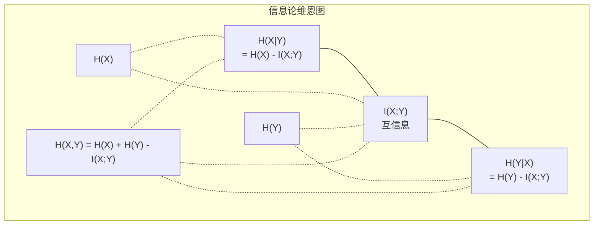

# 信息论（Information Theory）

> 信息论度量意外程度。损失函数正建立在它之上。

**Type:** Learn
**Language:** Python
**Prerequisites:** Phase 1, Lesson 06 (Probability)
**Time:** ~60 minutes

## 学习目标（Learning Objectives）

- 从零计算熵、交叉熵和 KL 散度，并解释它们之间的关系
- 推导为什么最小化交叉熵损失等价于最大化对数似然
- 计算特征与目标之间的互信息，为特征重要性排序
- 解释困惑度（perplexity）是语言模型从中挑选的"有效词表大小"

## 问题（The Problem）

你在训练的每个分类模型里都调用 `CrossEntropyLoss()`。你在每篇语言模型论文里都看到 "perplexity"。你在 VAE、蒸馏和 RLHF 中读到 KL 散度。这些并不是互不相关的概念。它们是同一个思想戴着不同的帽子。

信息论给了你一种语言，用来推理不确定性、压缩和预测。Claude Shannon 在 1948 年发明了它，用于解决通信问题。事实证明，训练神经网络就是一个通信问题：模型在试图通过一个由学习到的权重构成的嘈杂信道，传输正确的标签。

本课从零构建每一个公式，让你看清它们从哪里来、为什么有效。

## 核心概念（The Concept）

### 信息量（意外程度）（Information Content (Surprise)）

当不太可能的事情发生时，它携带更多信息。硬币正面朝上？不意外。中彩票？非常意外。

概率为 p 的事件的信息量是：

```
I(x) = -log(p(x))
```

以 2 为底的对数给出比特（bit）。自然对数给出奈特（nat）。同一个思想，不同的单位。

```
Event              Probability    Surprise (bits)
Fair coin heads    0.5            1.0
Rolling a 6        0.167          2.58
1-in-1000 event    0.001          9.97
Certain event      1.0            0.0
```

确定事件携带的信息量为零。你早就知道它会发生。

### 熵（平均意外）（Entropy (Average Surprise)）

熵是一个分布在其所有可能结果上的期望意外程度。

```
H(P) = -sum( p(x) * log(p(x)) )  for all x
```

对一个二元变量，均匀硬币具有最大熵：1 比特。有偏硬币（99% 正面）熵很低：0.08 比特。你已经知道会发生什么，所以每次抛掷几乎不告诉你任何新信息。

```
Fair coin:    H = -(0.5 * log2(0.5) + 0.5 * log2(0.5)) = 1.0 bit
Biased coin:  H = -(0.99 * log2(0.99) + 0.01 * log2(0.01)) = 0.08 bits
```

熵度量一个分布中不可再削减的不确定性。你无法把压缩做到低于它。

### 交叉熵（你天天用的损失函数）（Cross-Entropy (The Loss Function You Use Every Day)）

交叉熵度量：当你用分布 Q 去编码实际来自分布 P 的事件时，平均意外程度是多少。

```
H(P, Q) = -sum( p(x) * log(q(x)) )  for all x
```

P 是真实分布（标签）。Q 是你模型的预测。如果 Q 与 P 完全一致，交叉熵就等于熵。任何不匹配都会让它变大。

在分类中，P 是一个 one-hot 向量（真实类别的概率为 1，其余为 0）。这使交叉熵简化为：

```
H(P, Q) = -log(q(true_class))
```

这就是分类交叉熵损失的全部公式。最大化正确类别的预测概率。

### KL 散度（分布之间的距离）（KL Divergence (Distance Between Distributions)）

KL 散度度量：用 Q 代替 P 会带来多少额外意外。

```
D_KL(P || Q) = sum( p(x) * log(p(x) / q(x)) )  for all x
             = H(P, Q) - H(P)
```

交叉熵等于熵加上 KL 散度。由于真实分布的熵在训练期间是常数，最小化交叉熵就等价于最小化 KL 散度。你是在把模型的分布推向真实分布。

KL 散度不是对称的：D_KL(P || Q) != D_KL(Q || P)。它不是真正的距离度量。

### 互信息（Mutual Information）

互信息度量：知道一个变量能让你对另一个变量了解多少。

```
I(X; Y) = H(X) - H(X|Y)
        = H(X) + H(Y) - H(X, Y)
```

如果 X 与 Y 独立，互信息为零。知道其中一个对了解另一个毫无帮助。如果它们完全相关，互信息就等于任一变量的熵。

在特征选择中，特征与目标之间的高互信息意味着该特征有用。低互信息意味着它是噪声。

### 条件熵（Conditional Entropy）

H(Y|X) 度量观测 X 之后，关于 Y 还剩多少不确定性。

```
H(Y|X) = H(X,Y) - H(X)
```

两个极端：
- 如果 X 完全决定 Y，则 H(Y|X) = 0。知道 X 消除了关于 Y 的全部不确定性。例：X = 摄氏温度，Y = 华氏温度。
- 如果 X 对了解 Y 毫无帮助，则 H(Y|X) = H(Y)。知道 X 完全不会减少你的不确定性。例：X = 抛硬币，Y = 明天的天气。

条件熵总是非负的，且从不超过 H(Y)：

```
0 <= H(Y|X) <= H(Y)
```

在机器学习中，条件熵出现在决策树里。在每次分裂时，算法选择使 H(Y|X) 最小的特征 X——即最大程度消除关于标签 Y 不确定性的那个特征。

### 联合熵（Joint Entropy）

H(X,Y) 是 X 与 Y 联合分布的熵。

```
H(X,Y) = -sum sum p(x,y) * log(p(x,y))   for all x, y
```

关键性质：

```
H(X,Y) <= H(X) + H(Y)
```

当 X 与 Y 独立时取等号。如果它们共享信息，联合熵就小于各自熵的和。"缺失"的那部分熵恰好就是互信息。



这些关系：
- H(X,Y) = H(X) + H(Y|X) = H(Y) + H(X|Y)
- I(X;Y) = H(X) - H(X|Y) = H(Y) - H(Y|X)
- H(X,Y) = H(X) + H(Y) - I(X;Y)

### 互信息（深入）（Mutual Information (Deep Dive)）

互信息 I(X;Y) 量化：知道一个变量能在多大程度上减少你对另一个变量的不确定性。

```
I(X;Y) = H(X) - H(X|Y)
       = H(Y) - H(Y|X)
       = H(X) + H(Y) - H(X,Y)
       = sum sum p(x,y) * log(p(x,y) / (p(x) * p(y)))
```

性质：
- I(X;Y) >= 0 恒成立。观测某件事绝不会让你丢失信息。
- I(X;Y) = 0 当且仅当 X 与 Y 独立。
- I(X;Y) = I(Y;X)。它是对称的，不像 KL 散度。
- I(X;X) = H(X)。一个变量与自身共享其全部信息。

**用于特征选择的互信息。** 在 ML 中，你想要对目标有信息量的特征。互信息为你提供了一种有原则的特征排序方法：

1. 对每个特征 X_i，计算 I(X_i; Y)，其中 Y 是目标变量。
2. 按 MI 得分对特征排序。
3. 保留前 k 个特征。

这对特征与目标之间的任何关系都有效——线性、非线性、单调或非单调。相关性只能捕捉线性关系。MI 能捕捉一切。

| 方法 | 能检测 | 计算成本 | 支持类别特征？ |
|--------|---------|-------------------|---------------------|
| Pearson 相关 | 线性关系 | O(n) | 否 |
| Spearman 相关 | 单调关系 | O(n log n) | 否 |
| 互信息 | 任何统计依赖 | O(n log n)（需要分箱） | 是 |

### 标签平滑与交叉熵（Label Smoothing and Cross-Entropy）

标准分类使用硬目标：[0, 0, 1, 0]。真实类别的概率为 1，其余为 0。标签平滑（label smoothing）用软目标替换它们：

```
soft_target = (1 - epsilon) * hard_target + epsilon / num_classes
```

取 epsilon = 0.1、4 个类别时：
- 硬目标：  [0, 0, 1, 0]
- 软目标：  [0.025, 0.025, 0.925, 0.025]

从信息论的视角看，标签平滑提高了目标分布的熵。硬 one-hot 目标的熵为 0——没有任何不确定性。软目标具有正熵。

为什么它有帮助：
- 防止模型把 logits 推向极端值（在交叉熵下，要完美匹配 one-hot 目标需要无穷大的 logits）
- 起到正则化作用：模型无法 100% 自信
- 改善校准：预测概率更好地反映真实不确定性
- 缩小训练与推理行为之间的差距

带标签平滑的交叉熵损失变为：

```
L = (1 - epsilon) * CE(hard_target, prediction) + epsilon * H_uniform(prediction)
```

第二项惩罚远离均匀分布的预测——这是对置信度的直接正则化。

### 为什么交叉熵是 THE 分类损失（Why Cross-Entropy Is THE Classification Loss）

三种视角，同一个结论。

**信息论视角。** 交叉熵度量：你用模型分布代替真实分布时浪费了多少比特。最小化它，就是让你的模型成为现实最高效的编码器。

**最大似然视角。** 对 N 个真实类别为 y_i 的训练样本：

```
Likelihood     = product( q(y_i) )
Log-likelihood = sum( log(q(y_i)) )
Negative log-likelihood = -sum( log(q(y_i)) )
```

最后一行就是交叉熵损失。最小化交叉熵 = 在你的模型下最大化训练数据的似然。

**梯度视角。** 交叉熵关于 logits 的梯度就是简单的（预测 - 真实）。干净、稳定、计算快。这就是它与 softmax 完美搭配的原因。

### 比特与奈特（Bits vs Nats）

唯一的区别是对数的底。

```
log base 2   -> bits      (information theory tradition)
log base e   -> nats      (machine learning convention)
log base 10  -> hartleys  (rarely used)
```

1 nat = 1/ln(2) bits = 1.4427 bits。PyTorch 和 TensorFlow 默认使用自然对数（nats）。

### 困惑度（Perplexity）

困惑度是交叉熵的指数。它告诉你：模型实际在多少个等可能的选择之间犹豫不决。

```
Perplexity = 2^H(P,Q)   (if using bits)
Perplexity = e^H(P,Q)   (if using nats)
```

困惑度为 50 的语言模型，平均而言就像要从 50 个等可能的下一个词元中挑选一个那样困惑。越低越好。

GPT-2 在常见基准上达到了约 30 的困惑度。现代模型在数据充足的领域已进入个位数。

```figure
entropy-kl
```

## 动手构建（Build It）

### 第 1 步：信息量与熵（Step 1: Information content and entropy）

```python
import math

def information_content(p, base=2):
    if p <= 0 or p > 1:
        return float('inf') if p <= 0 else 0.0
    return -math.log(p) / math.log(base)

def entropy(probs, base=2):
    return sum(
        p * information_content(p, base)
        for p in probs if p > 0
    )

fair_coin = [0.5, 0.5]
biased_coin = [0.99, 0.01]
fair_die = [1/6] * 6

print(f"Fair coin entropy:   {entropy(fair_coin):.4f} bits")
print(f"Biased coin entropy: {entropy(biased_coin):.4f} bits")
print(f"Fair die entropy:    {entropy(fair_die):.4f} bits")
```

### 第 2 步：交叉熵与 KL 散度（Step 2: Cross-entropy and KL divergence）

```python
def cross_entropy(p, q, base=2):
    total = 0.0
    for pi, qi in zip(p, q):
        if pi > 0:
            if qi <= 0:
                return float('inf')
            total += pi * (-math.log(qi) / math.log(base))
    return total

def kl_divergence(p, q, base=2):
    return cross_entropy(p, q, base) - entropy(p, base)

true_dist = [0.7, 0.2, 0.1]
good_model = [0.6, 0.25, 0.15]
bad_model = [0.1, 0.1, 0.8]

print(f"Entropy of true dist:     {entropy(true_dist):.4f} bits")
print(f"CE (good model):          {cross_entropy(true_dist, good_model):.4f} bits")
print(f"CE (bad model):           {cross_entropy(true_dist, bad_model):.4f} bits")
print(f"KL divergence (good):     {kl_divergence(true_dist, good_model):.4f} bits")
print(f"KL divergence (bad):      {kl_divergence(true_dist, bad_model):.4f} bits")
```

### 第 3 步：作为分类损失的交叉熵（Step 3: Cross-entropy as classification loss）

```python
def softmax(logits):
    max_logit = max(logits)
    exps = [math.exp(z - max_logit) for z in logits]
    total = sum(exps)
    return [e / total for e in exps]

def cross_entropy_loss(true_class, logits):
    probs = softmax(logits)
    return -math.log(probs[true_class])

logits = [2.0, 1.0, 0.1]
true_class = 0

probs = softmax(logits)
loss = cross_entropy_loss(true_class, logits)

print(f"Logits:      {logits}")
print(f"Softmax:     {[f'{p:.4f}' for p in probs]}")
print(f"True class:  {true_class}")
print(f"Loss:        {loss:.4f} nats")
print(f"Perplexity:  {math.exp(loss):.2f}")
```

### 第 4 步：交叉熵等于负对数似然（Step 4: Cross-entropy equals negative log-likelihood）

```python
import random

random.seed(42)

n_samples = 1000
n_classes = 3
true_labels = [random.randint(0, n_classes - 1) for _ in range(n_samples)]
model_logits = [[random.gauss(0, 1) for _ in range(n_classes)] for _ in range(n_samples)]

ce_loss = sum(
    cross_entropy_loss(label, logits)
    for label, logits in zip(true_labels, model_logits)
) / n_samples

nll = -sum(
    math.log(softmax(logits)[label])
    for label, logits in zip(true_labels, model_logits)
) / n_samples

print(f"Cross-entropy loss:      {ce_loss:.6f}")
print(f"Negative log-likelihood: {nll:.6f}")
print(f"Difference:              {abs(ce_loss - nll):.2e}")
```

### 第 5 步：互信息（Step 5: Mutual information）

```python
def mutual_information(joint_probs, base=2):
    rows = len(joint_probs)
    cols = len(joint_probs[0])

    margin_x = [sum(joint_probs[i][j] for j in range(cols)) for i in range(rows)]
    margin_y = [sum(joint_probs[i][j] for i in range(rows)) for j in range(cols)]

    mi = 0.0
    for i in range(rows):
        for j in range(cols):
            pxy = joint_probs[i][j]
            if pxy > 0:
                mi += pxy * math.log(pxy / (margin_x[i] * margin_y[j])) / math.log(base)
    return mi

independent = [[0.25, 0.25], [0.25, 0.25]]
dependent = [[0.45, 0.05], [0.05, 0.45]]

print(f"MI (independent): {mutual_information(independent):.4f} bits")
print(f"MI (dependent):   {mutual_information(dependent):.4f} bits")
```

## 直接使用（Use It）

用 NumPy 实现同样的概念，就像你在实践中会用的那样：

```python
import numpy as np

def np_entropy(p):
    p = np.asarray(p, dtype=float)
    mask = p > 0
    result = np.zeros_like(p)
    result[mask] = p[mask] * np.log(p[mask])
    return -result.sum()

def np_cross_entropy(p, q):
    p, q = np.asarray(p, dtype=float), np.asarray(q, dtype=float)
    mask = p > 0
    return -(p[mask] * np.log(q[mask])).sum()

def np_kl_divergence(p, q):
    return np_cross_entropy(p, q) - np_entropy(p)

true = np.array([0.7, 0.2, 0.1])
pred = np.array([0.6, 0.25, 0.15])
print(f"Entropy:    {np_entropy(true):.4f} nats")
print(f"Cross-ent:  {np_cross_entropy(true, pred):.4f} nats")
print(f"KL div:     {np_kl_divergence(true, pred):.4f} nats")
```

你从零构建了 `torch.nn.CrossEntropyLoss()` 内部在做的事情。现在你知道为什么训练时损失会下降：模型的预测分布正在逼近真实分布，而逼近程度以浪费信息的奈特数来衡量。

## 练习（Exercises）

1. 假设均匀分布，计算英文字母表（26 个字母）的熵。然后用真实的字母频率估计它。哪个更高，为什么？

2. 一个模型对真实类别为 1 的样本输出 logits [5.0, 2.0, 0.5]。手算交叉熵损失，然后用你的 `cross_entropy_loss` 函数验证。什么样的 logits 会给出零损失？

3. 证明 KL 散度不对称。任取两个分布 P 和 Q，计算 D_KL(P || Q) 和 D_KL(Q || P)。解释它们为什么不同。

4. 构建一个函数，为一个词元预测序列计算困惑度。给定一个 (true_token_index, predicted_logits) 对的列表，返回该序列的困惑度。

## 关键术语（Key Terms）

| 术语 | 人们常说 | 实际含义 |
|------|----------------|----------------------|
| 信息量（Information content） | "意外程度" | 编码一个事件所需的比特（或奈特）数：-log(p) |
| 熵（Entropy） | "随机性" | 一个分布在其所有结果上的平均意外程度。度量不可削减的不确定性。 |
| 交叉熵（Cross-entropy） | "损失函数" | 用模型分布 Q 编码来自真实分布 P 的事件时的平均意外程度。 |
| KL 散度（KL divergence） | "分布之间的距离" | 用 Q 代替 P 额外浪费的比特数。等于交叉熵减去熵。不对称。 |
| 互信息（Mutual information） | "X 和 Y 有多相关" | 知道 Y 之后对 X 不确定性的减少量。为零意味着独立。 |
| Softmax | "把 logits 变成概率" | 取指数再归一化。把任意实值向量映射为合法的概率分布。 |
| 困惑度（Perplexity） | "模型有多困惑" | 交叉熵的指数。模型在每一步实际从中挑选的有效词表大小。 |
| 比特（Bit） | "香农的单位" | 以 2 为底的对数度量的信息。一比特解决一次均匀硬币的抛掷。 |
| 奈特（Nat） | "ML 的单位" | 以自然对数度量的信息。PyTorch 和 TensorFlow 默认使用。 |
| 负对数似然（Negative log-likelihood） | "NLL 损失" | 对 one-hot 标签而言与交叉熵损失完全相同。最小化它即最大化正确预测的概率。 |

## 延伸阅读（Further Reading）

- [Shannon 1948：通信的数学理论](https://people.math.harvard.edu/~ctm/home/text/others/shannon/entropy/entropy.pdf) - 原始论文，至今仍然可读
- [Visual Information Theory（Chris Olah）](https://colah.github.io/posts/2015-09-Visual-Information/) - 关于熵和 KL 散度最好的可视化讲解
- [PyTorch CrossEntropyLoss 文档](https://pytorch.org/docs/stable/generated/torch.nn.CrossEntropyLoss.html) - 框架如何实现你刚刚亲手构建的东西
