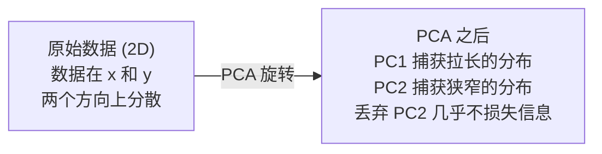

# 降维（Dimensionality Reduction）

> 高维数据自有其结构。选对观察的角度，你就能发现它。

**Type:** Build
**Language:** Python
**Prerequisites:** Phase 1, Lessons 01 (Linear Algebra Intuition), 02 (Vectors, Matrices & Operations), 03 (Eigenvalues & Eigenvectors), 06 (Probability & Distributions)
**Time:** ~90 minutes

## 学习目标（Learning Objectives）

- 从零实现 PCA（主成分分析）：对数据中心化、计算协方差矩阵、进行特征值分解并投影
- 使用解释方差比（explained variance ratio）和肘部法则（elbow method）来选择主成分的数量
- 比较 PCA、t-SNE 和 UMAP 将 MNIST 数字可视化到 2D 的效果，并解释它们各自的权衡
- 应用带 RBF 核的核 PCA（kernel PCA），分离标准 PCA 无法处理的非线性数据结构

## 面临的问题（The Problem）

你有一个数据集，每个样本有 784 个特征。它可能是手写数字的像素值，可能是基因表达水平，也可能是用户行为信号。你无法可视化 784 个维度。你无法把它们画出来，甚至无法在脑子里想象它们。

但这 784 个特征中大部分是冗余的。真正的信息分布在一个小得多的表面上。描述一个手写的"7"不需要 784 个独立的数字，只需要几个：笔画的角度、横杠的长度、倾斜的程度。其余都是噪声。

降维就是找到那个更小的表面。它把你的 784 维数据压缩到 2 维、10 维或 50 维，同时保留真正重要的结构。

## 核心概念（The Concept）

### 维度灾难（The curse of dimensionality）

高维空间是反直觉的。随着维度增长，有三件事会出问题。

**距离变得毫无意义。** 在高维空间中，任意两个随机点之间的距离会收敛到同一个值。如果每个点到其他任何点的距离都大致相同，最近邻搜索就失效了。

```
Dimension    Avg distance ratio (max/min between random points)
2            ~5.0
10           ~1.8
100          ~1.2
1000         ~1.02
```

**体积集中在角落。** d 维单位超立方体有 2^d 个角。在 100 维中，几乎所有体积都集中在远离中心的角落里。数据点散布到边缘，而你的模型在内部区域严重缺乏数据。

**你需要指数级更多的数据。** 要在空间中维持相同的样本密度，从 2 维到 20 维意味着需要 10^18 倍的数据。你永远不会有足够的数据。降低维度能把数据密度拉回到可用的水平。

### PCA：找到重要的方向（PCA: find the directions that matter）

主成分分析（Principal Component Analysis, PCA）找到数据变化最剧烈的那些轴。它旋转你的坐标系，让第一根轴捕获最大的方差，第二根轴捕获次大的方差，依此类推。

算法流程：

```
1. Center the data        (subtract the mean from each feature)
2. Compute covariance     (how features move together)
3. Eigendecomposition     (find the principal directions)
4. Sort by eigenvalue     (biggest variance first)
5. Project               (keep top k eigenvectors, drop the rest)
```

为什么要用特征值分解？协方差矩阵是对称的半正定矩阵。它的特征向量是特征空间中相互正交的方向。特征值告诉你每个方向捕获了多少方差。特征值最大的特征向量指向方差最大的方向。



- **PCA 之前：** 数据云沿 x 和 y 两条轴呈对角分布
- **PCA 之后：** 坐标系被旋转，PC1 与方差最大的方向（拉长的分布）对齐，PC2 与方差最小的方向（狭窄的分布）对齐
- **降维：** 丢弃 PC2 并把数据投影到 PC1 上，几乎不损失信息

### 解释方差比（Explained variance ratio）

每个主成分捕获总方差中的一部分。解释方差比（explained variance ratio）告诉你具体是多少。

```
Component    Eigenvalue    Explained ratio    Cumulative
PC1          4.73          0.473              0.473
PC2          2.51          0.251              0.724
PC3          1.12          0.112              0.836
PC4          0.89          0.089              0.925
...
```

当累计解释方差达到 0.95 时，你就知道这么多的成分捕获了 95% 的信息。之后的部分基本都是噪声。

### 选择成分数量（Choosing the number of components）

三种策略：

1. **阈值法。** 保留足够多的成分，使其能解释 90-95% 的方差。
2. **肘部法则。** 画出每个成分的解释方差，寻找急剧下降的位置。
3. **下游性能。** 把 PCA 当作预处理，扫描 k 并测量模型的准确率。最佳 k 就是准确率趋于平稳的地方。

### t-SNE：保留邻域结构（t-SNE: preserve neighborhoods）

t-分布随机邻域嵌入（t-Distributed Stochastic Neighbor Embedding, t-SNE）专为可视化而设计。它把高维数据映射到 2D（或 3D），同时保留哪些点彼此相邻。

直觉是这样的：在原始空间中，根据点对之间的距离计算一个定义在点对上的概率分布。距离近的点获得高概率，距离远的点获得低概率。然后寻找一个 2D 排布，使同样的概率分布依然成立。在 784 维中互为邻居的点，在 2D 中仍然是邻居。

t-SNE 的关键性质：
- 非线性。它能展开 PCA 无法处理的复杂流形。
- 随机性。不同的运行会产生不同的布局。
- 困惑度（perplexity）参数控制考虑多少个邻居（典型范围：5-50）。
- 输出中簇与簇之间的距离没有意义，只有簇本身有意义。
- 在大数据集上很慢。默认复杂度为 O(n^2)。

### UMAP：更快、更好的全局结构（UMAP: faster, better global structure）

一致流形逼近与投影（Uniform Manifold Approximation and Projection, UMAP）的工作方式与 t-SNE 类似，但有两个优势：
- 更快。它使用近似最近邻图，而不是计算所有两两距离。
- 更好的全局结构。输出中簇与簇的相对位置往往比 t-SNE 更有意义。

UMAP 在高维空间中构建一个加权图（即"模糊拓扑表示"），然后寻找一个尽可能保留这张图的低维布局。

关键参数：
- `n_neighbors`：用多少个邻居定义局部结构（类似于困惑度）。值越大，保留的全局结构越多。
- `min_dist`：点在输出中堆积的紧密程度。值越小，簇越致密。

### 该用哪一个（When to use which）

| 方法 | 使用场景 | 保留什么 | 速度 |
|--------|----------|-----------|-------|
| PCA | 训练前的预处理 | 全局方差 | 快（精确解），可处理数百万样本 |
| PCA | 快速探索性可视化 | 线性结构 | 快 |
| t-SNE | 出版级 2D 图 | 局部邻域 | 慢（理想情况小于 1 万样本） |
| UMAP | 大规模 2D 可视化 | 局部 + 部分全局结构 | 中等（可处理数百万） |
| PCA | 为模型做特征降维 | 按方差排序的特征 | 快 |
| t-SNE / UMAP | 理解簇结构 | 簇的分离情况 | 中等到慢 |

经验法则：预处理和数据压缩用 PCA。需要在 2D 中可视化结构时，用 t-SNE 或 UMAP。

### 核 PCA（Kernel PCA）

标准 PCA 找的是线性子空间。它旋转坐标系然后丢掉一些轴。但如果数据分布在一个非线性流形上呢？2D 中的一个圆无法被任何直线分开，标准 PCA 帮不上忙。

核 PCA 在由核函数诱导的高维特征空间中执行 PCA，而不必显式计算该空间中的坐标。这就是核技巧（kernel trick）——与 SVM 背后的思想相同。

算法流程：
1. 计算核矩阵 K，其中 K_ij = k(x_i, x_j)
2. 在特征空间中对核矩阵做中心化
3. 对中心化后的核矩阵做特征值分解
4. 前几个特征向量（按 1/sqrt(eigenvalue) 缩放）就是投影结果

常见的核函数：

| 核 | 公式 | 适用场景 |
|--------|---------|----------|
| RBF（高斯） | exp(-gamma * \|\|x - y\|\|^2) | 大多数非线性数据、平滑流形 |
| 多项式核 | (x . y + c)^d | 多项式关系 |
| Sigmoid 核 | tanh(alpha * x . y + c) | 类似神经网络的映射 |

核 PCA 与标准 PCA 的取舍：

| 判据 | 标准 PCA | 核 PCA |
|-----------|-------------|------------|
| 数据结构 | 线性子空间 | 非线性流形 |
| 速度 | O(min(n^2 d, d^2 n)) | O(n^2 d + n^3) |
| 可解释性 | 成分是特征的线性组合 | 成分无法直接用特征解释 |
| 可扩展性 | 可处理数百万样本 | 核矩阵是 n x n，受内存限制 |
| 重构 | 可直接逆变换 | 需要预像（pre-image）近似 |

经典的例子：2D 中的同心圆。两圈点，一圈套在另一圈里。标准 PCA 把两者投影到同一条直线上——对分类毫无用处。带 RBF 核的核 PCA 把内圈和外圈映射到不同的区域，使它们线性可分。

### 重构误差（Reconstruction Error）

你的降维效果如何？你把 784 维压缩到了 50 维，损失了什么？

度量重构误差（reconstruction error）：
1. 把数据投影到 k 维：X_reduced = X @ W_k
2. 重构：X_hat = X_reduced @ W_k^T
3. 计算 MSE：mean((X - X_hat)^2)

对 PCA 而言，重构误差与解释方差之间有一个干净的关系：

```
Reconstruction error = sum of eigenvalues NOT included
Total variance = sum of ALL eigenvalues
Fraction lost = (sum of dropped eigenvalues) / (sum of all eigenvalues)
```

每个成分的解释方差比是：

```
explained_ratio_k = eigenvalue_k / sum(all eigenvalues)
```

把累计解释方差对成分数量作图，就得到"肘部"曲线。合适的成分数量位于：
- 曲线变平的地方（边际收益递减）
- 累计方差越过你的阈值的地方（通常是 0.90 或 0.95）
- 下游任务性能趋于平稳的地方

重构误差的用处不止于选择 k。你还可以用它做异常检测：重构误差高的样本是不符合所学子空间的离群点。这正是生产系统中基于 PCA 的异常检测的基础。

```figure
pca-axes
```

## 动手构建（Build It）

### 步骤 1：从零实现 PCA（Step 1: PCA from scratch）

```python
import numpy as np

class PCA:
    def __init__(self, n_components):
        self.n_components = n_components
        self.components = None
        self.mean = None
        self.eigenvalues = None
        self.explained_variance_ratio_ = None

    def fit(self, X):
        self.mean = np.mean(X, axis=0)
        X_centered = X - self.mean

        cov_matrix = np.cov(X_centered, rowvar=False)

        eigenvalues, eigenvectors = np.linalg.eigh(cov_matrix)

        sorted_idx = np.argsort(eigenvalues)[::-1]
        eigenvalues = eigenvalues[sorted_idx]
        eigenvectors = eigenvectors[:, sorted_idx]

        self.components = eigenvectors[:, :self.n_components].T
        self.eigenvalues = eigenvalues[:self.n_components]
        total_var = np.sum(eigenvalues)
        self.explained_variance_ratio_ = self.eigenvalues / total_var

        return self

    def transform(self, X):
        X_centered = X - self.mean
        return X_centered @ self.components.T

    def fit_transform(self, X):
        self.fit(X)
        return self.transform(X)
```

### 步骤 2：在合成数据上测试（Step 2: Test on synthetic data）

```python
np.random.seed(42)
n_samples = 500

t = np.random.uniform(0, 2 * np.pi, n_samples)
x1 = 3 * np.cos(t) + np.random.normal(0, 0.2, n_samples)
x2 = 3 * np.sin(t) + np.random.normal(0, 0.2, n_samples)
x3 = 0.5 * x1 + 0.3 * x2 + np.random.normal(0, 0.1, n_samples)

X_synthetic = np.column_stack([x1, x2, x3])

pca = PCA(n_components=2)
X_reduced = pca.fit_transform(X_synthetic)

print(f"Original shape: {X_synthetic.shape}")
print(f"Reduced shape:  {X_reduced.shape}")
print(f"Explained variance ratios: {pca.explained_variance_ratio_}")
print(f"Total variance captured: {sum(pca.explained_variance_ratio_):.4f}")
```

### 步骤 3：把 MNIST 数字映射到 2D（Step 3: MNIST digits in 2D）

```python
from sklearn.datasets import fetch_openml

mnist = fetch_openml("mnist_784", version=1, as_frame=False, parser="auto")
X_mnist = mnist.data[:5000].astype(float)
y_mnist = mnist.target[:5000].astype(int)

pca_mnist = PCA(n_components=50)
X_pca50 = pca_mnist.fit_transform(X_mnist)
print(f"50 components capture {sum(pca_mnist.explained_variance_ratio_):.2%} of variance")

pca_2d = PCA(n_components=2)
X_pca2d = pca_2d.fit_transform(X_mnist)
print(f"2 components capture {sum(pca_2d.explained_variance_ratio_):.2%} of variance")
```

### 步骤 4：与 sklearn 对比（Step 4: Compare with sklearn）

```python
from sklearn.decomposition import PCA as SklearnPCA
from sklearn.manifold import TSNE

sklearn_pca = SklearnPCA(n_components=2)
X_sklearn_pca = sklearn_pca.fit_transform(X_mnist)

print(f"\nOur PCA explained variance:     {pca_2d.explained_variance_ratio_}")
print(f"Sklearn PCA explained variance: {sklearn_pca.explained_variance_ratio_}")

diff = np.abs(np.abs(X_pca2d) - np.abs(X_sklearn_pca))
print(f"Max absolute difference: {diff.max():.10f}")

tsne = TSNE(n_components=2, perplexity=30, random_state=42)
X_tsne = tsne.fit_transform(X_mnist)
print(f"\nt-SNE output shape: {X_tsne.shape}")
```

### 步骤 5：UMAP 对比（Step 5: UMAP comparison）

```python
try:
    from umap import UMAP

    reducer = UMAP(n_components=2, n_neighbors=15, min_dist=0.1, random_state=42)
    X_umap = reducer.fit_transform(X_mnist)
    print(f"UMAP output shape: {X_umap.shape}")
except ImportError:
    print("Install umap-learn: pip install umap-learn")
```

## 实际应用（Use It）

把 PCA 用作分类器之前的预处理：

```python
from sklearn.decomposition import PCA as SklearnPCA
from sklearn.linear_model import LogisticRegression
from sklearn.model_selection import train_test_split
from sklearn.metrics import accuracy_score

X_train, X_test, y_train, y_test = train_test_split(
    X_mnist, y_mnist, test_size=0.2, random_state=42
)

results = {}
for k in [10, 30, 50, 100, 200]:
    pca_k = SklearnPCA(n_components=k)
    X_tr = pca_k.fit_transform(X_train)
    X_te = pca_k.transform(X_test)

    clf = LogisticRegression(max_iter=1000, random_state=42)
    clf.fit(X_tr, y_train)
    acc = accuracy_score(y_test, clf.predict(X_te))
    var_captured = sum(pca_k.explained_variance_ratio_)
    results[k] = (acc, var_captured)
    print(f"k={k:>3d}  accuracy={acc:.4f}  variance={var_captured:.4f}")
```

性能在远未达到 784 维之前就趋于平稳。那个平稳点就是你的工作点。

## 交付产物（Ship It）

本课产出：
- `outputs/skill-dimensionality-reduction.md` - 一份帮助你为给定任务选择合适降维技术的技能（skill）

## 课后练习（Exercises）

1. 修改 PCA 类，让它支持 `inverse_transform`。分别用 10、50 和 200 个成分重构 MNIST 数字，并打印每个设置下的重构误差（与原始数据的均方差）。

2. 在同一个 MNIST 子集上，用 5、30 和 100 三种困惑度运行 t-SNE。描述输出如何变化。为什么困惑度会影响簇的紧凑程度？

3. 取一个 50 个特征中只有 5 个有信息量的数据集（可以用 `sklearn.datasets.make_classification` 生成一个）。对其应用 PCA，检查解释方差曲线能否正确识别出数据实际上是 5 维的。

## 关键术语（Key Terms）

| 术语 | 人们常说的 | 实际含义 |
|------|----------------|----------------------|
| 维度灾难（curse of dimensionality） | "特征太多" | 随着维度增长，距离、体积和数据密度的表现全都违反直觉。模型需要指数级更多的数据来补偿。 |
| PCA | "降维" | 旋转坐标系，让坐标轴与方差最大的方向对齐，然后丢掉低方差的轴。 |
| 主成分（principal component） | "一个重要的方向" | 协方差矩阵的一个特征向量，即特征空间中数据变化最剧烈的方向。 |
| 解释方差比（explained variance ratio） | "这个成分含有多少信息" | 单个主成分捕获的总方差比例。把前 k 个比例加起来，就能知道 k 个成分保留了多少信息。 |
| 协方差矩阵（covariance matrix） | "特征之间如何相关" | 一个对称矩阵，其中 (i,j) 元素度量特征 i 和特征 j 如何协同变化。对角线元素是各自的方差。 |
| t-SNE | "那张簇图" | 一种非线性方法，通过保留成对的邻域概率把高维数据映射到 2D。适合可视化，不适合预处理。 |
| UMAP | "更快的 t-SNE" | 基于拓扑数据分析的非线性方法。同时保留局部和部分全局结构，比 t-SNE 更容易扩展。 |
| 困惑度（perplexity） | "t-SNE 的一个旋钮" | 控制每个点实际考虑的邻居数量。低困惑度关注非常局部的结构，高困惑度捕捉更宽泛的模式。 |
| 流形（manifold） | "数据所依附的表面" | 嵌入在高维空间中的低维表面。一张揉皱在 3D 空间里的纸就是一个 2D 流形。 |

## 延伸阅读（Further Reading）

- [A Tutorial on Principal Component Analysis](https://arxiv.org/abs/1404.1100) (Shlens) - 从零开始清晰推导 PCA
- [How to Use t-SNE Effectively](https://distill.pub/2016/misread-tsne/) (Wattenberg et al.) - 关于 t-SNE 陷阱与参数选择的交互式指南
- [UMAP documentation](https://umap-learn.readthedocs.io/) - 来自 UMAP 作者的理论与实践指南
