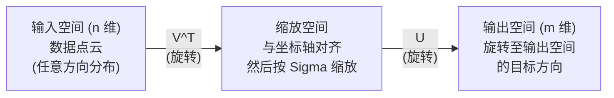
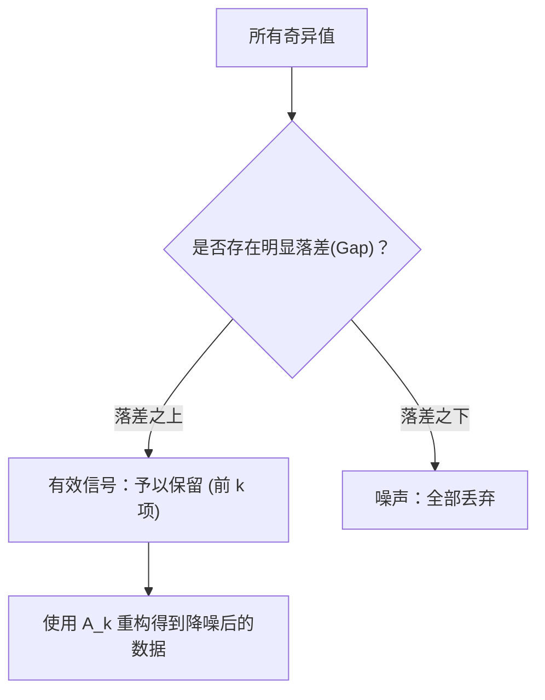

# 奇异值分解（Singular Value Decomposition）

> SVD 是线性代数中的“瑞士军刀”。每一个矩阵都拥有 SVD，每一位数据科学家都需要掌握它。

**Type:** Build
**Languages:** Python, Julia
**Prerequisites:** Phase 1, Lessons 01 (Linear Algebra Intuition), 02 (Vectors & Matrices Operations), 03 (Matrix Transformations)
**Time:** ~120 minutes

## 学习目标（Learning Objectives）

- 通过幂迭代法（Power Iteration）从零实现 SVD，并解释 $U$、$\Sigma$ 和 $V^T$ 的几何意义
- 将截断 SVD 应用于图像压缩，并测量压缩比与重构误差之间的关系
- 基于 SVD 计算摩尔-彭罗斯伪逆（Moore-Penrose Pseudoinverse），用于求解超定最小二乘系统
- 理解 SVD 与 PCA、推荐系统（隐因子模型）以及自然语言处理中的潜在语义分析（LSA）之间的深层联系

## 面临的问题（The Problem）

假设你有一个 $1000 \times 2000$ 的矩阵。它可能是“用户-电影”评分表、文档-词项频次表，或是图像的像素值矩阵。你需要对其进行压缩、降噪、挖掘潜在结构，或用它求解最小二乘问题。然而，特征值分解（Eigendecomposition）仅适用于方阵；即便对于方阵，它也要求矩阵拥有一组完整的线性无关特征向量。

而 SVD 适用于**任何矩阵**——无论形状如何、秩是多少，无需满足任何额外前提条件。它将矩阵分解为三个因子，揭示了该矩阵对空间执行变换的几何本质。它是整个线性代数中最通用、最强大的矩阵分解方法。

## 核心概念（The Concept）

### SVD 的几何意义（What SVD does geometrically）

任何矩阵，无论形状如何，其变换本质上都可以分解为依次进行的三个几何操作：**旋转 $\rightarrow$ 缩放 $\rightarrow$ 旋转**。SVD 将这一分解过程显式表达出来：

```
A = U * Sigma * V^T

      m x n     m x m    m x n    n x n
     (任意)    (旋转)   (缩放)   (旋转)
```

对于任意矩阵 $A$，SVD 将其分解为：
- $V^T$：在输入空间（$n$ 维）中旋转向量
- $\Sigma$：沿各坐标轴进行缩放（拉伸或压缩）
- $U$：将结果旋转到输出空间（$m$ 维）



可以这样理解：当你给 SVD 输入一个矩阵时，它会告诉你：“这个矩阵将输入空间中的一个超球面，先通过 $V^T$ 旋转，再由 $\Sigma$ 沿主轴拉伸成一个超椭球面，最后通过 $U$ 将该超椭球面旋转到输出空间中。”奇异值的大小正是这个超椭球各主半轴的长度。

### 完整分解（The full decomposition）

对于形状为 $m \times n$ 的矩阵 $A$：

```
A = U * Sigma * V^T

其中：
  U     为 m x m 的正交矩阵 (U^T U = I)
  Sigma 为 m x n 的对角矩阵（对角线上为奇异值）
  V     为 n x n 的正交矩阵 (V^T V = I)

奇异值满足：sigma_1 >= sigma_2 >= ... >= sigma_r > 0
其中 r = rank(A) 为矩阵 A 的秩
```

$U$ 的列向量称为**左奇异向量（left singular vectors）**；$V$ 的列向量称为**右奇异向量（right singular vectors）**；$\Sigma$ 对角线上的元素称为**奇异值（singular values）**。奇异值始终是非负实数，习惯上按降序排列。

### 左奇异向量、奇异值与右奇异向量

SVD 的每个组成部分都有明确的几何意义：

**右奇异向量（$V$ 的列向量）：** 构成输入空间（$\mathbb{R}^n$）的一组标准正交基。它们是输入空间中的特定方向，经过矩阵映射后在输出空间中依然保持相互正交。可以将其视为定义域（输入空间）的自然坐标系。

**奇异值（$\Sigma$ 的对角线元素）：** 缩放因子。第 $i$ 个奇异值表示矩阵沿第 $i$ 个右奇异向量方向对空间拉伸的程度。若奇异值为零，意味着矩阵彻底压平了该方向。

**左奇异向量（$U$ 的列向量）：** 构成输出空间（$\mathbb{R}^m$）的一组标准正交基。第 $i$ 个左奇异向量是第 $i$ 个右奇异向量经过缩放后在输出空间中所落入的方向。

它们之间的关系如下：

```
A * v_i = sigma_i * u_i

矩阵 A 作用于第 i 个右奇异向量 v_i，
将其缩放 sigma_i 倍，并映射到第 i 个左奇异向量 u_i 的方向。
```

这为我们提供了任意矩阵变换按坐标轴逐一分解的清晰全景。

### 外积展开形式（Outer product form）

SVD 可以等价地写成一系列秩为 1 的矩阵之和：

```
A = sigma_1 * u_1 * v_1^T + sigma_2 * u_2 * v_2^T + ... + sigma_r * u_r * v_r^T

每一项 sigma_i * u_i * v_i^T 都是一个秩为 1 的矩阵（外积）。
整个矩阵等于 r 个这样的秩-1 矩阵相加，其中 r 为矩阵的秩。
```

这种外积形式是**低秩近似（Low-Rank Approximation）**的基础。每一项都为矩阵增加了一层结构信息：第一项捕获最主要的主导模式，第二项捕获次重要的模式，依此类推。截断这个求和序列即可获得任意指定秩下的最优近似。

```
秩-1 近似:    A_1 = sigma_1 * u_1 * v_1^T
              (捕获最主导的特征模式)

秩-2 近似:    A_2 = sigma_1 * u_1 * v_1^T + sigma_2 * u_2 * v_2^T
              (捕获前两个最重要的特征模式)

秩-k 近似:    A_k = 前 k 项之和
              (根据 Eckart-Young 定理，此为数学上最优的秩-k 近似)
```

### 与特征值分解的关系（Relationship to eigendecomposition）

SVD 与特征值分解紧密相关。矩阵 $A$ 的奇异值和奇异向量直接来源于 $A^T A$ 与 $A A^T$ 的特征值和特征向量。

```
A^T A = V * Sigma^T * U^T * U * Sigma * V^T
      = V * Sigma^T * Sigma * V^T
      = V * D * V^T

其中 D = Sigma^T * Sigma 是对角线上为 sigma_i^2 的对角矩阵。

因此：
- 右奇异向量 (V) 是 A^T A 的特征向量
- 奇异值的平方 (sigma_i^2) 是 A^T A 的特征值

同理：
A A^T = U * Sigma * V^T * V * Sigma^T * U^T
      = U * Sigma * Sigma^T * U^T

因此：
- 左奇异向量 (U) 是 A A^T 的特征向量
- A A^T 的特征值同样也是 sigma_i^2
```

这个联系揭示了三个重要结论：
1. 奇异值始终为非负实数（因为它们是半正定矩阵特征值的平方根）。
2. 虽然理论上可以通过对 $A^T A$ 进行特征值分解来求 SVD，但这会使条件数平方，造成严重的数值精度损失。专用的 SVD 算法能够避免这一问题。
3. 当 $A$ 是对称半正定方阵时，SVD 与特征值分解完全等价。

### 截断 SVD：低秩近似（Truncated SVD: low-rank approximation）

埃卡特-扬-米尔斯基定理（Eckart-Young-Mirsky theorem）指出：在 Frobenius 范数和谱范数下，矩阵 $A$ 的最佳秩-$k$ 近似矩阵是通过仅保留前 $k$ 个最大奇异值及其对应的奇异向量得到的：

```
A_k = U_k * Sigma_k * V_k^T

其中：
  U_k     为 m x k  (U 的前 k 列)
  Sigma_k 为 k x k  (Sigma 左上角 k x k 子块)
  V_k     为 n x k  (V 的前 k 列)

近似误差 = sigma_{k+1}  (在谱范数下)
         = sqrt(sigma_{k+1}^2 + ... + sigma_r^2)  (在 Frobenius 范数下)
```

这不仅仅是一个“较好的”近似，而是在数学上被严格证明为**最优**的秩-$k$ 近似。没有任何其他秩-$k$ 矩阵比 $A_k$ 更接近 $A$。

| 分量 | 相对大小 | 在秩-3 近似中是否保留？ |
|------|---------|-----------------------|
| sigma_1 | 最大 | 是 |
| sigma_2 | 大 | 是 |
| sigma_3 | 较大 | 是 |
| sigma_4 | 中等 | 否 (计入误差) |
| sigma_5 | 较小 | 否 (计入误差) |
| sigma_6 | 小 | 否 (计入误差) |
| sigma_7 | 很小 | 否 (计入误差) |
| sigma_8 | 微小 | 否 (计入误差) |

保留前 3 项：$A_3$ 捕获了最大的三个奇异值。误差即为剩余未保留的分量（$\sigma_4$ 到 $\sigma_8$）。

如果奇异值衰减迅速，极小的 $k$ 即可捕获矩阵的绝大部分信息；如果奇异值衰减缓慢，则说明该矩阵不具备低秩结构。

### 利用 SVD 进行图像压缩（Image compression with SVD）

灰度图像可以表示为由像素灰度值构成的矩阵。一张 $800 \times 600$ 的图像包含 480,000 个数值。利用 SVD 可以用远少于此的数据量来逼近原图。

```
原始图像: 800 x 600 = 480,000 个数值

秩为 k 的 SVD 表示:
  U_k:      800 x k 个数值
  Sigma_k:  k 个数值
  V_k:      600 x k 个数值
  总计:     k * (800 + 600 + 1) = k * 1401 个数值

  k=10:   14,010 个数值  (仅占原始大小的 2.9%)
  k=50:   70,050 个数值  (仅占原始大小的 14.6%)
  k=100: 140,100 个数值  (占原始大小的 29.2%)

  k 越小，压缩比越高，但图像视觉质量会有所下降。
```

核心观察：自然图像的奇异值衰减非常迅速。前几个奇异值捕获了图像的宏观整体结构（轮廓、渐变），而后面的奇异值主要捕获细微纹理和噪声。截断在秩 50 通常能重构出视觉上与原图几乎无法分辨的图像，同时节省约 85% 的存储空间。

### SVD 在推荐系统中的应用（SVD for recommendation systems）

著名的 Netflix Prize 竞赛让这一方法声名大噪。假设有一个“用户-电影”评分矩阵，其中绝大多数位置是缺失的：

```
             电影1   电影2   电影3   电影4   电影5
   用户1      [  5      ?       3       ?       1  ]
   用户2      [  ?      4       ?       2       ?  ]
   用户3      [  3      ?       5       ?       ?  ]
   用户4      [  ?      ?       ?       4       3  ]

   ? = 未知评分
```

核心思想：该评分矩阵具有低秩特性。用户的喜好并非完全孤立随机，而是由少数几个潜在隐因子（如：动作 vs 剧情、怀旧 vs 现代、烧脑 vs 爆米花）决定大部分偏好。

对（填补后的）评分矩阵进行 SVD 分解：
- $U$：用户在隐因子空间中的画像（特征向量）
- $\Sigma$：各个隐因子的重要程度权重
- $V^T$：电影在隐因子空间中的画像（特征向量）

用户对某部电影的预测评分，即为该用户的画像向量与电影画像向量的点积（按奇异值加权）。低秩近似以此填补了矩阵中的未知项。

在工程实践中，通常使用诸如 Simon Funk 增量 SVD 或交替最小二乘法（ALS）等能够直接处理缺失数据的变体算法，但其核心思想完全相同：通过 SVD 进行隐因子分解。

### SVD 在 NLP 中的应用：潜在语义分析（Latent Semantic Analysis）

潜在语义分析（LSA，在信息检索中亦称潜在语义索引 LSI）是将 SVD 应用于“词项-文档”矩阵的技术：

```
             文档1  文档2  文档3  文档4
   "cat"     [  3      0      1      0  ]
   "dog"     [  2      0      0      1  ]
   "fish"    [  0      4      1      0  ]
   "pet"     [  1      1      1      1  ]
   "ocean"   [  0      3      0      0  ]

设定秩 k=2 进行 SVD 分解后：

  每篇文档都映射为 2 维“概念空间”中的一个坐标点。
  每个词项也映射到相同的 2 维空间中。
  主题相似的文档会在空间中聚集在一起。
  语义相近的词项会在空间中相互靠近。

  "cat" 和 "dog" 相互靠近（陆地宠物概念）。
  "fish" 和 "ocean" 相互靠近（海洋水域概念）。
  若文档 1 与文档 3 涉及相似主题，它们也会聚在一起。
```

LSA 是从无标注纯文本中捕获语义相似度的最早成功方法之一。它的有效性在于：同义词往往出现在相似的文档上下文中，SVD 能够将它们归并到相同的隐语义维度上。现代词嵌入方法（如 Word2Vec、GloVe）本质上都继承了这一思想脉络。

### SVD 用于信号与数据降噪（SVD for noise reduction）

含噪数据中的有效信号往往高度集中在前面几个最大的奇异值中，而随机噪声则均匀分散在所有奇异值上。截断较小的奇异值能够有效滤除噪声基底。

**纯净信号的奇异值：**

| 分量 | 数值大小 | 类型 |
|------|---------|------|
| sigma_1 | 极大 | 有效信号 |
| sigma_2 | 大 | 有效信号 |
| sigma_3 | 中等 | 有效信号 |
| sigma_4 | 接近零 | 可忽略 |
| sigma_5 | 接近零 | 可忽略 |

**含噪信号的奇异值（噪声加在所有分量上）：**

| 分量 | 数值大小 | 类型 |
|------|---------|------|
| sigma_1 | 极大 | 有效信号 |
| sigma_2 | 大 | 有效信号 |
| sigma_3 | 中等 | 有效信号 |
| sigma_4 | 较小 | 噪声 |
| sigma_5 | 较小 | 噪声 |
| sigma_6 | 较小 | 噪声 |
| sigma_7 | 较小 | 噪声 |



该技术广泛应用于信号处理、科学实验测量以及数据清洗。当矩阵受到加性噪声污染时，截断 SVD 是一种原则上区分信号与噪声的坚实方法。

### 基于 SVD 计算伪逆（Pseudoinverse via SVD）

摩尔-彭罗斯伪逆（Moore-Penrose Pseudoinverse）$A^+$ 将矩阵求逆推广到了非方阵以及奇异矩阵。利用 SVD，计算伪逆变得极其简单：

```
若 A = U * Sigma * V^T，则：

A+ = V * Sigma+ * U^T

其中 Sigma+ 的构造方法为：
  1. 将 Sigma 转置 (交换行列)
  2. 对每个非零对角线元素 sigma_i 取倒数 1/sigma_i
  3. 零元素保持为 0

对于 A (m x n)：      A+ 为 (n x m)
对于 Sigma (m x n)：  Sigma+ 为 (n x m)
```

伪逆用于求解最小二乘问题。当线性方程组 $Ax = b$ 不存在精确解时（超定系统，方程数多于未知数），$x = A^+ b$ 即为最小二乘解（使 $\|Ax - b\|$ 最小化）。

```
超定方程系统 (方程数多于未知数):

  [1  1]         [3]
  [2  1] x   =   [5]       无精确解存在。
  [3  1]         [6]

  x_ls = A+ b = V * Sigma+ * U^T * b

  此式给出的 x 能够使残差平方和最小化。
  该结果与正规方程 (A^T A)^(-1) A^T b 完全相同，
  但数值上更加稳定。
```

### 数值稳定性优势（Numerical stability advantages）

通过对 $A^T A$ 求特征值分解会使奇异值平方（$A^T A$ 的特征值为 $\sigma_i^2$）。这会导致条件数平方，成倍放大数值误差。

```
示例：
  矩阵 A 的奇异值为 [1000, 1, 0.001]
  A 的条件数：1000 / 0.001 = 10^6

  A^T A 的特征值为 [10^6, 1, 10^{-6}]
  A^T A 的条件数：10^6 / 10^{-6} = 10^{12}

  直接计算 SVD：在条件数 10^6 下运算
  通过 A^T A 计算：在条件数 10^{12} 下运算
                   (额外丢失了约 6 位有效数字精度)
```

现代 SVD 算法（如 Golub-Kahan 双对角化算法）直接作用于矩阵 $A$，绝不会显式构造 $A^T A$。这也是在实际编程中应始终优先选用 `np.linalg.svd(A)` 而非 `np.linalg.eig(A.T @ A)` 的原因。

### 与主成分分析（PCA）的关系

**PCA 本质上就是对去中心化后的数据矩阵进行 SVD。** 这不是类比，而是在数学与计算上完全相同的操作。

```
设数据矩阵 X (n_samples x n_features)，已经过中心化（减去各列均值）：

样本协方差矩阵：C = (1/(n-1)) * X^T X

PCA 求解 C 的特征向量。由于：

  X = U * Sigma * V^T    (X 的 SVD)

  X^T X = V * Sigma^2 * V^T

  C = (1/(n-1)) * V * Sigma^2 * V^T

因此，主成分方向正是右奇异向量矩阵 V。
各成分的解释方差为 sigma_i^2 / (n-1)。

在 scikit-learn 中，PCA 正是基于 SVD 而非特征值分解实现的。
速度更快且数值稳定性更高。
```

这意味着你在 Lesson 10 中学到的所有降维知识，底层引擎全部都是 SVD。PCA 是 SVD 在机器学习中最广泛的应用。

```figure
svd-rank-reconstruction
```

## 实战构建（Build It）

### 步骤 1：基于幂迭代法从零实现 SVD

核心思路：要找到最大的奇异值及其对应的奇异向量，可以对 $A^T A$（或 $A A^T$）执行幂迭代（Power Iteration）。提取该主成分后，从原矩阵中减去该秩-1 矩阵（矩阵降秩 Deflation），然后重复该过程计算下一个奇异值。

```python
import numpy as np

def power_iteration(M, num_iters=100):
    n = M.shape[1]
    v = np.random.randn(n)
    v = v / np.linalg.norm(v)

    for _ in range(num_iters):
        Mv = M @ v
        v = Mv / np.linalg.norm(Mv)

    eigenvalue = v @ M @ v
    return eigenvalue, v

def svd_from_scratch(A, k=None):
    m, n = A.shape
    if k is None:
        k = min(m, n)

    sigmas = []
    us = []
    vs = []

    A_residual = A.copy().astype(float)

    for _ in range(k):
        AtA = A_residual.T @ A_residual
        eigenvalue, v = power_iteration(AtA, num_iters=200)

        if eigenvalue < 1e-10:
            break

        sigma = np.sqrt(eigenvalue)
        u = A_residual @ v / sigma

        sigmas.append(sigma)
        us.append(u)
        vs.append(v)

        A_residual = A_residual - sigma * np.outer(u, v)

    U = np.column_stack(us) if us else np.empty((m, 0))
    S = np.array(sigmas)
    V = np.column_stack(vs) if vs else np.empty((n, 0))

    return U, S, V
```

### 步骤 2：测试并与 NumPy 对比

```python
np.random.seed(42)
A = np.random.randn(5, 4)

U_ours, S_ours, V_ours = svd_from_scratch(A)
U_np, S_np, Vt_np = np.linalg.svd(A, full_matrices=False)

print("Our singular values:", np.round(S_ours, 4))
print("NumPy singular values:", np.round(S_np, 4))

A_reconstructed = U_ours @ np.diag(S_ours) @ V_ours.T
print(f"Reconstruction error: {np.linalg.norm(A - A_reconstructed):.8f}")
```

### 步骤 3：图像压缩实战演示

```python
def compress_image_svd(image_matrix, k):
    U, S, Vt = np.linalg.svd(image_matrix, full_matrices=False)
    compressed = U[:, :k] @ np.diag(S[:k]) @ Vt[:k, :]
    return compressed

image = np.random.seed(42)
rows, cols = 200, 300
image = np.random.randn(rows, cols)

for k in [1, 5, 10, 20, 50]:
    compressed = compress_image_svd(image, k)
    error = np.linalg.norm(image - compressed) / np.linalg.norm(image)
    original_size = rows * cols
    compressed_size = k * (rows + cols + 1)
    ratio = compressed_size / original_size
    print(f"k={k:>3d}  error={error:.4f}  storage={ratio:.1%}")
```

### 步骤 4：数据降噪

```python
np.random.seed(42)
clean = np.outer(np.sin(np.linspace(0, 4*np.pi, 100)),
                 np.cos(np.linspace(0, 2*np.pi, 80)))
noise = 0.3 * np.random.randn(100, 80)
noisy = clean + noise

U, S, Vt = np.linalg.svd(noisy, full_matrices=False)
denoised = U[:, :5] @ np.diag(S[:5]) @ Vt[:5, :]

print(f"Noisy error:    {np.linalg.norm(noisy - clean):.4f}")
print(f"Denoised error: {np.linalg.norm(denoised - clean):.4f}")
print(f"Improvement:    {(1 - np.linalg.norm(denoised - clean) / np.linalg.norm(noisy - clean)):.1%}")
```

### 步骤 5：伪逆求解最小二乘系统

```python
A = np.array([[1, 1], [2, 1], [3, 1]], dtype=float)
b = np.array([3, 5, 6], dtype=float)

U, S, Vt = np.linalg.svd(A, full_matrices=False)
S_inv = np.diag(1.0 / S)
A_pinv = Vt.T @ S_inv @ U.T

x_svd = A_pinv @ b
x_lstsq = np.linalg.lstsq(A, b, rcond=None)[0]
x_pinv = np.linalg.pinv(A) @ b

print(f"SVD pseudoinverse solution:  {x_svd}")
print(f"np.linalg.lstsq solution:   {x_lstsq}")
print(f"np.linalg.pinv solution:    {x_pinv}")
```

## 运行体验（Use It）

完整的可运行演示代码位于 `code/svd.py`。运行它查看 SVD 在图像压缩、推荐系统、潜在语义分析以及降噪中的完整应用：

```bash
python svd.py
```

`code/svd.jl` 中的 Julia 版本利用 Julia 原生的 `svd()` 函数与 `LinearAlgebra` 标准库展示了相同的概念：

```bash
julia svd.jl
```

## 交付产物（Ship It）

本课输出产物：
- `outputs/skill-svd.md` - 指导如何在实际工程项目中判断与应用 SVD 的可复用技能卡片

## 课后练习（Exercises）

1. **不使用幂迭代实现全量 SVD**：通过对 $A^T A$ 进行特征值分解求得 $V$ 和奇异值，然后通过 $U = A V \Sigma^{-1}$ 计算得到 $U$。对比该版本、幂迭代版本与 NumPy 官方实现的数值精度差异。

2. **真实灰度图像压缩**：加载一张真实的灰度图像（或将彩图转为灰度图）。分别在秩 $k=1, 5, 10, 25, 50, 100$ 下进行压缩。计算每个秩下的压缩比与相对重构误差，寻找图像视觉质量达到可接受水准时的临界 $k$ 值。

3. **微型推荐系统构建**：创建一个 $10 \times 8$ 的“用户-电影”评分矩阵，保留部分已知评分。用行均值填补缺失项，计算 SVD 并重构秩-3 近似矩阵。使用重构矩阵预测缺失评分，验证预测结果的合理性。

4. **潜在语义分析实验**：创建一个 $100 \times 50$ 的文档-词项矩阵，构造 3 个合成主题，每个主题包含 5 个关联词项并加入噪声。应用 SVD 并验证前 3 个奇异值是否显著大于其余奇异值。将文档投影到 3 维隐空间中，检验同主题文档是否聚类在一起。

5. **噪声水平与截断秩关系探究**：生成一个纯净的低秩矩阵（秩为 3，大小 $50 \times 40$），并分别添加不同强度的高斯噪声（$\sigma = 0.1, 0.5, 1.0, 2.0$）。对于每个噪声水平，在 $k \in [1, 40]$ 范围内扫描评估，计算相对于纯净矩阵的重构误差以确定最优截断秩，并绘制最优 $k$ 随噪声强度的变化曲线。

## 关键术语表（Key Terms）

| 术语 | 常见通俗说法 | 精确数学定义与含义 |
|------|-------------|-------------------|
| SVD（奇异值分解） | “分解任意矩阵” | 将矩阵 $A$ 分解为 $U \Sigma V^T$，其中 $U$ 与 $V$ 为正交矩阵，$\Sigma$ 为对角线元素非负的对角矩阵。适用于任意形状、任意秩的矩阵。 |
| Singular value（奇异值） | “该分量有多重要” | $\Sigma$ 的第 $i$ 个对角线元素。衡量矩阵沿第 $i$ 个主方向对空间的拉伸幅度。始终为非负实数，按降序排列。 |
| Left singular vector（左奇异向量） | “输出方向” | $U$ 的列向量。表示第 $i$ 个右奇异向量经过矩阵缩放后在输出空间中所映射到的标准正交方向。 |
| Right singular vector（右奇异向量） | “输入方向” | $V$ 的列向量。输入空间中的标准正交方向，经矩阵映射后在输出空间中依然保持正交。 |
| Truncated SVD（截断 SVD） | “低秩近似” | 仅保留前 $k$ 个最大奇异值及其对应的奇异向量。产生数学上证明的最优秩-$k$ 近似矩阵（Eckart-Young 定理）。 |
| Rank（秩） | “真实有效维度” | 非零奇异值的个数。反映了矩阵实际使用的独立维度数量。 |
| Pseudoinverse（伪逆） | “广义逆矩阵” | $V \Sigma^+ U^T$。对非零奇异值求倒数，零值保持为零。用于求解非方阵或奇异矩阵的最小二乘问题。 |
| Condition number（条件数） | “对误差有多敏感” | $\sigma_{\max} / \sigma_{\min}$。较大的条件数意味着输入的微小扰动会导致输出产生巨大误差。SVD 可直接给出该指标。 |
| Latent factor（隐因子） | “隐藏变量” | 由 SVD 发现的低秩空间中的某个维度。在推荐系统中可能对应题材偏好；在 NLP 中可能对应某种抽象主题。 |
| Frobenius norm（Frobenius 范数） | “矩阵总大小” | 矩阵所有元素平方和的平方根，亦等于所有奇异值平方和的平方根。常用于衡量矩阵近似误差。 |
| Eckart-Young theorem（埃卡特-扬定理） | “SVD 提供最佳压缩” | 对于任意目标秩 $k$，截断 SVD 在所有可能的秩-$k$ 矩阵中使近似误差达到全局最小。 |
| Power iteration（幂迭代法） | “求最大特征向量” | 反复将随机向量乘以矩阵并进行归一化。该序列会收敛到最大特征值对应的特征向量。是许多 SVD 算法的基石。 |

## 延伸阅读（Further Reading）

- [Gilbert Strang: Linear Algebra and Its Applications, Chapter 7](https://math.mit.edu/~gs/linearalgebra/) - 对 SVD 及其应用的全面深入讲解
- [3Blue1Brown: But what is the SVD?](https://www.youtube.com/watch?v=vSczTbgc8Rc) - SVD 的直观几何动图解释
- [We Recommend a Singular Value Decomposition](https://www.ams.org/publicoutreach/feature-column/fcarc-svd) - 美国数学学会（AMS）关于 SVD 的通俗综述
- [Netflix Prize and Matrix Factorization](https://sifter.org/~simon/journal/20061211.html) - Simon Funk 关于利用 SVD 解决推荐系统问题的经典博文
- [Latent Semantic Analysis](https://en.wikipedia.org/wiki/Latent_semantic_analysis) - SVD 在自然语言处理中的开创性应用
- [Numerical Linear Algebra by Trefethen and Bau](https://people.maths.ox.ac.uk/trefethen/text.html) - 理解 SVD 算法及其数值分析性质的经典权威教材

