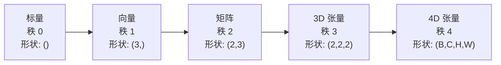
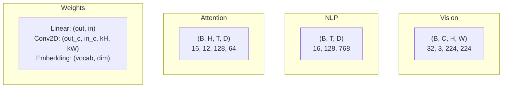
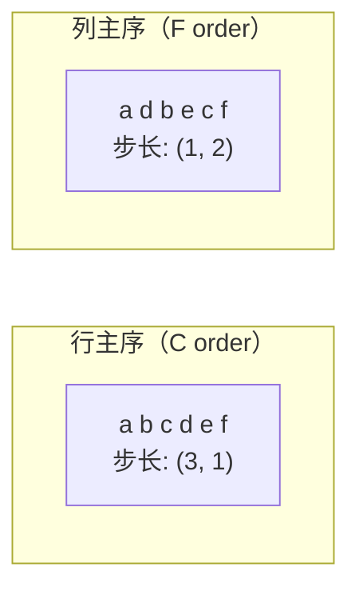
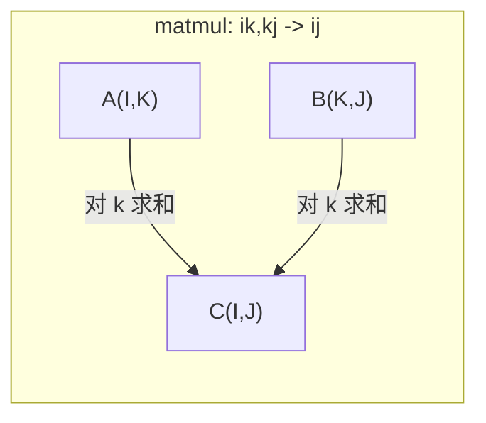

# 张量运算（Tensor Operations）

> 张量是数据与深度学习之间的通用语言。每一张图片、每一句话、每一个梯度都要流经它们。

**Type:** Build
**Language:** Python
**Prerequisites:** Phase 1, Lessons 01 (Linear Algebra Intuition), 02 (Vectors, Matrices & Operations)
**Time:** ~90 minutes

## 学习目标（Learning Objectives）

- 从零实现一个支持 shape、strides、reshape、transpose 和逐元素运算的张量类
- 应用广播（broadcasting）规则，在不复制数据的前提下对不同形状的张量执行运算
- 编写 einsum 表达式来表示点积、矩阵乘法、外积和批量运算
- 追踪多头注意力（multi-head attention）每一步的精确张量形状

## 问题（The Problem）

你在搭建一个 transformer。前向传播看起来没什么问题。一运行，却得到：`RuntimeError: mat1 and mat2 shapes cannot be multiplied (32x768 and 512x768)`。你盯着这些形状，试着加了一个 transpose。现在报错变成 `Expected 4D input (got 3D input)`。你又加了一个 unsqueeze，结果别的地方又坏了。

形状错误是深度学习代码中最常见的 bug。它在概念上并不难——每个运算都有一份形状契约——但它们会迅速叠加。一个 transformer 里串联着几十次 reshape、transpose 和广播。一个轴搞错，错误就会层层蔓延。更糟的是，有些形状错误根本不抛出异常：它们沿着错误的维度广播，或沿着错误的轴求和，悄悄产出垃圾结果。

矩阵处理的是两组事物之间的两两关系，而真实数据塞不进两个维度。一个 batch 为 32、大小 224x224 的 RGB 图像是 4D 张量：`(32, 3, 224, 224)`。带 12 个头的自注意力同样是 4D 的：`(batch, heads, seq_len, head_dim)`。你需要一种能推广到任意维度的数据结构，以及能在所有维度上干净组合的运算。这个结构就是张量。掌握它的运算，形状错误就会变得非常容易调试。

## 概念（The Concept）

### 张量是什么（What a tensor is）

张量是一个数据类型统一的多维数字数组。维度的数量叫作**秩**（rank，也称**阶**，order）。每个维度是一个**轴**（axis）。**形状**（shape）是一个元组，按顺序列出每个轴上的大小。



元素总数 = 所有维度大小的乘积。形状 `(2, 3, 4)` 包含 `2 * 3 * 4 = 24` 个元素。

### 深度学习中的张量形状（Tensor shapes in deep learning）

依照惯例，不同类型的数据对应特定的张量形状。



PyTorch 使用 NCHW（通道在前）。TensorFlow 默认使用 NHWC（通道在后）。布局不匹配会导致无提示的性能下降或报错。

### 内存布局的工作原理（How memory layout works）

内存中的 2D 数组其实是一维的字节序列。**步长**（strides）告诉你沿着每个轴移动一步需要跳过多少个元素。



transpose 不会移动数据，它只是交换步长，使张量变得**不连续**（non-contiguous）——同一行的元素在内存中不再相邻。

### 广播规则（Broadcasting rules）

广播让你无需复制数据就能对形状不同的张量执行运算。把形状从右对齐：两个维度相等或其中之一为 1 时兼容；维度较少的张量在左侧用 1 补齐。

```
Tensor A:     (8, 1, 6, 1)
Tensor B:        (7, 1, 5)
Padded B:     (1, 7, 1, 5)
Result:       (8, 7, 6, 5)
```

### Einsum：通用张量运算（Einsum: the universal tensor operation）

爱因斯坦求和（Einstein summation）给每个轴标一个字母。出现在输入中但没出现在输出中的轴会被求和；同时出现在输入和输出中的轴则保留。



常见模式：`i,i->`（点积）、`i,j->ij`（外积）、`ii->`（迹）、`ij->ji`（转置）、`bij,bjk->bik`（批量矩阵乘法）、`bhtd,bhsd->bhts`（注意力分数）。

```figure
tensor-broadcast
```

## 动手构建（Build It）

代码位于 `code/tensors.py`。下面每一步都会对照其中的实现。

### 第 1 步：张量存储与步长（Step 1: Tensor storage and strides）

张量存储一个扁平的数字列表，外加形状元数据。步长告诉索引逻辑如何把多维索引映射到扁平位置。

```python
class Tensor:
    def __init__(self, data, shape=None):
        if isinstance(data, (list, tuple)):
            self._data, self._shape = self._flatten_nested(data)
        elif isinstance(data, np.ndarray):
            self._data = data.flatten().tolist()
            self._shape = tuple(data.shape)
        else:
            self._data = [data]
            self._shape = ()

        if shape is not None:
            total = reduce(lambda a, b: a * b, shape, 1)
            if total != len(self._data):
                raise ValueError(
                    f"Cannot reshape {len(self._data)} elements into shape {shape}"
                )
            self._shape = tuple(shape)

        self._strides = self._compute_strides(self._shape)

    @staticmethod
    def _compute_strides(shape):
        if len(shape) == 0:
            return ()
        strides = [1] * len(shape)
        for i in range(len(shape) - 2, -1, -1):
            strides[i] = strides[i + 1] * shape[i + 1]
        return tuple(strides)
```

对于形状 `(3, 4)`，步长是 `(4, 1)`——跨过 4 个元素前进一行，跨过 1 个元素前进一列。

### 第 2 步：Reshape、squeeze、unsqueeze（Step 2: Reshape, squeeze, unsqueeze）

reshape 改变形状但不改变元素的排列顺序，元素总数必须保持不变。把其中一个维度写成 `-1`，让系统自动推断它的大小。

```python
t = Tensor(list(range(12)), shape=(2, 6))
r = t.reshape((3, 4))
r = t.reshape((-1, 3))
```

squeeze 移除大小为 1 的轴，unsqueeze 插入一个。unsqueeze 对广播至关重要——要把偏置向量 `(D,)` 加到形状为 `(B, T, D)` 的批次上，必须先 unsqueeze 成 `(1, 1, D)`。

```python
t = Tensor(list(range(6)), shape=(1, 3, 1, 2))
s = t.squeeze()
v = Tensor([1, 2, 3])
u = v.unsqueeze(0)
```

### 第 3 步：Transpose 与 permute（Step 3: Transpose and permute）

transpose 交换两个轴，permute 重排所有轴。在 NCHW 和 NHWC 之间转换就是这么做的。

```python
mat = Tensor(list(range(6)), shape=(2, 3))
tr = mat.transpose(0, 1)

t4d = Tensor(list(range(24)), shape=(1, 2, 3, 4))
perm = t4d.permute((0, 2, 3, 1))
```

经过 transpose 或 permute 之后，张量在内存中不再连续。在 PyTorch 中，`view` 对非连续张量会失败——请改用 `reshape`，或者先调用 `.contiguous()`。

### 第 4 步：逐元素运算与归约（Step 4: Element-wise operations and reductions）

逐元素运算（加法、乘法、减法）独立作用于每个元素并保持形状不变。归约（reduction，如 sum、mean、max）则把一个或多个轴压缩掉。

```python
a = Tensor([[1, 2], [3, 4]])
b = Tensor([[10, 20], [30, 40]])
c = a + b
d = a * 2
s = a.sum(axis=0)
```

CNN 中的全局平均池化：`(B, C, H, W).mean(axis=[2, 3])` 得到 `(B, C)`。NLP 中的序列平均池化：`(B, T, D).mean(axis=1)` 得到 `(B, D)`。

### 第 5 步：用 NumPy 做广播（Step 5: Broadcasting with NumPy）

`tensors.py` 中的 `demo_broadcasting_numpy()` 函数展示了这些核心模式。

```python
activations = np.random.randn(4, 3)
bias = np.array([0.1, 0.2, 0.3])
result = activations + bias

images = np.random.randn(2, 3, 4, 4)
scale = np.array([0.5, 1.0, 1.5]).reshape(1, 3, 1, 1)
result = images * scale

a = np.array([1, 2, 3]).reshape(-1, 1)
b = np.array([10, 20, 30, 40]).reshape(1, -1)
outer = a * b
```

用广播计算两两距离：把 `(M, 2)` reshape 成 `(M, 1, 2)`，把 `(N, 2)` reshape 成 `(1, N, 2)`，相减、平方、沿最后一个轴求和、再开平方根。结果形状为 `(M, N)`。

### 第 6 步：Einsum 运算（Step 6: Einsum operations）

`demo_einsum()` 和 `demo_einsum_gallery()` 函数逐一演示了所有常见模式。

```python
a = np.array([1.0, 2.0, 3.0])
b = np.array([4.0, 5.0, 6.0])
dot = np.einsum("i,i->", a, b)

A = np.array([[1, 2], [3, 4], [5, 6]], dtype=float)
B = np.array([[7, 8, 9], [10, 11, 12]], dtype=float)
matmul = np.einsum("ik,kj->ij", A, B)

batch_A = np.random.randn(4, 3, 5)
batch_B = np.random.randn(4, 5, 2)
batch_mm = np.einsum("bij,bjk->bik", batch_A, batch_B)
```

一次收缩（contraction）的计算代价是所有索引大小（保留的和被求和的）的乘积。对于 B=32、I=128、J=64、K=128 的 `bij,bjk->bik`：`32 * 128 * 64 * 128 = 33,554,432` 次乘加运算。

### 第 7 步：用 einsum 实现注意力机制（Step 7: Attention mechanism via einsum）

`demo_attention_einsum()` 函数端到端地实现了多头注意力。

```python
B, H, T, D = 2, 4, 8, 16
E = H * D

X = np.random.randn(B, T, E)
W_q = np.random.randn(E, E) * 0.02

Q = np.einsum("bte,ek->btk", X, W_q)
Q = Q.reshape(B, T, H, D).transpose(0, 2, 1, 3)

scores = np.einsum("bhtd,bhsd->bhts", Q, K) / np.sqrt(D)
weights = softmax(scores, axis=-1)
attn_output = np.einsum("bhts,bhsd->bhtd", weights, V)

concat = attn_output.transpose(0, 2, 1, 3).reshape(B, T, E)
output = np.einsum("bte,ek->btk", concat, W_o)
```

每一步都是一次张量运算：投影（用 einsum 做矩阵乘法）、头拆分（reshape + transpose）、注意力分数（用 einsum 做批量矩阵乘法）、加权和（用 einsum 做批量矩阵乘法）、头合并（transpose + reshape）、输出投影（用 einsum 做矩阵乘法）。

## 使用它（Use It）

### 手写实现对比 NumPy（Scratch vs NumPy）

| 运算 | 手写实现（Tensor 类） | NumPy |
|---|---|---|
| 创建 | `Tensor([[1,2],[3,4]])` | `np.array([[1,2],[3,4]])` |
| Reshape | `t.reshape((3,4))` | `a.reshape(3,4)` |
| Transpose | `t.transpose(0,1)` | `a.T` 或 `a.transpose(0,1)` |
| Squeeze | `t.squeeze(0)` | `np.squeeze(a, 0)` |
| 求和 | `t.sum(axis=0)` | `a.sum(axis=0)` |
| Einsum | 不支持 | `np.einsum("ij,jk->ik", a, b)` |

### 手写实现对比 PyTorch（Scratch vs PyTorch）

```python
import torch

t = torch.tensor([[1, 2, 3], [4, 5, 6]], dtype=torch.float32)
t.shape
t.stride()
t.is_contiguous()

t.reshape(3, 2)
t.unsqueeze(0)
t.transpose(0, 1)
t.transpose(0, 1).contiguous()

torch.einsum("ik,kj->ij", A, B)
```

PyTorch 额外提供了 autograd、GPU 支持和优化过的 BLAS 内核，但形状语义完全相同。只要理解了手写版本，PyTorch 的形状错误信息就能读得懂。

### 每个神经网络层都是一种张量运算（Every neural network layer as a tensor operation）

| 运算 | 张量形式 | Einsum |
|---|---|---|
| Linear 层 | `Y = X @ W.T + b` | `"bd,od->bo"` + 偏置 |
| 注意力 QKV | `Q = X @ W_q` | `"btd,dh->bth"` |
| 注意力分数 | `Q @ K.T / sqrt(d)` | `"bhtd,bhsd->bhts"` |
| 注意力输出 | `softmax(scores) @ V` | `"bhts,bhsd->bhtd"` |
| 批归一化 | `(X - mu) / sigma * gamma` | 逐元素 + 广播 |
| Softmax | `exp(x) / sum(exp(x))` | 逐元素 + 归约 |

## 交付（Ship It）

本课产出两个可复用的提示词：

1. **`outputs/prompt-tensor-shapes.md`**——一个系统化调试张量形状不匹配的提示词，包含每种常见运算（matmul、broadcast、cat、Linear、Conv2d、BatchNorm、softmax）的决策表和一份修复速查表。

2. **`outputs/prompt-tensor-debugger.md`**——一个分步调试提示词，当形状错误卡住你时，把它粘贴到任意 AI 助手里，喂给它报错信息和你的张量形状，就能得到精确的修复方案。

## 练习（Exercises）

1. **简单——Reshape 往返。** 取一个形状为 `(2, 3, 4)` 的张量，先 reshape 成 `(6, 4)`，再变成 `(24,)`，最后还原回 `(2, 3, 4)`。每一步都打印扁平数据，验证元素顺序保持不变。

2. **中等——实现广播。** 给 `Tensor` 类扩展一个 `broadcast_to(shape)` 方法，把大小为 1 的维度扩展到目标形状。然后修改 `_elementwise_op`，让它在运算前自动广播。用形状 `(3, 1)` 和 `(1, 4)` 测试，应得到 `(3, 4)`。

3. **困难——从零构建 einsum。** 实现一个基础的 `einsum(subscripts, *tensors)` 函数，至少支持：点积（`i,i->`）、矩阵乘法（`ij,jk->ik`）、外积（`i,j->ij`）和转置（`ij->ji`）。解析下标字符串，找出被收缩的索引，然后遍历所有索引组合。把结果与 `np.einsum` 对比。

4. **困难——注意力形状追踪器。** 编写一个函数，输入 `batch_size`、`seq_len`、`embed_dim` 和 `num_heads`，打印多头注意力每一步的精确形状：输入、Q/K/V 投影、头拆分、注意力分数、softmax 权重、加权和、头合并、输出投影。用 `demo_attention_einsum()` 的输出进行验证。

## 关键术语（Key Terms）

| 术语 | 人们常说 | 实际含义 |
|---|---|---|
| 张量（Tensor） | "就是多了几个维度的矩阵" | 一种类型统一、具有明确 shape、strides 和运算的多维数组 |
| 秩（Rank） | "维度数" | 轴的数量。矩阵的 rank 是 2，而不是它的矩阵秩（matrix rank） |
| 形状（Shape） | "张量的大小" | 一个元组，列出每个轴上的大小。`(2, 3)` 表示 2 行 3 列 |
| 步长（Stride） | "内存的排布方式" | 沿每个轴前进一个位置需要跳过的元素个数 |
| 广播（Broadcasting） | "形状不一样也能直接算" | 一套严格的规则：从右对齐，维度必须相等或其中之一为 1 |
| 连续（Contiguous） | "张量是正常的" | 元素按逻辑布局在内存中顺序存放，没有间隔或重排 |
| Einsum | "一种花哨的矩阵乘法写法" | 一种通用记法，一行就能表达任意张量收缩、外积、迹或转置 |
| 视图（View） | "和 reshape 一样" | 与原张量共享同一块内存缓冲、但 shape/stride 元数据不同的张量。对非连续数据会失败 |
| 收缩（Contraction） | "对某个索引求和" | 一种一般化运算：张量之间共享的索引被相乘并求和，得到更低秩的结果 |
| NCHW / NHWC | "PyTorch 与 TensorFlow 的格式之争" | 图像张量的内存布局约定。NCHW 把通道放在空间维度之前，NHWC 放在其后 |

## 延伸阅读（Further Reading）

- [NumPy 广播](https://numpy.org/doc/stable/user/basics.broadcasting.html)——官方权威规则，附可视化示例
- [PyTorch Tensor 视图](https://pytorch.org/docs/stable/tensor_view.html)——视图何时直接复用、何时发生复制
- [einops](https://github.com/arogozhnikov/einops)——一个让张量变形操作可读且安全的库
- [The Illustrated Transformer](https://jalammar.github.io/illustrated-transformer/)——可视化注意力中流动的张量形状
- [NumPy 中的爱因斯坦求和](https://numpy.org/doc/stable/reference/generated/numpy.einsum.html)——完整的 einsum 文档与示例
