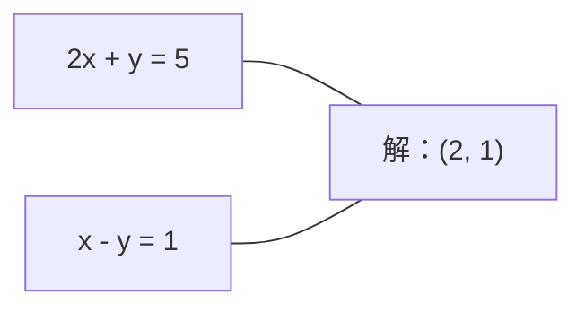
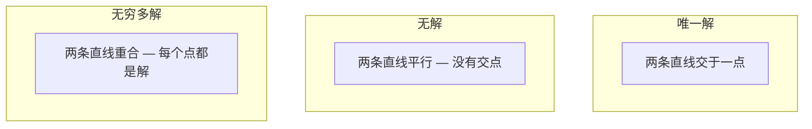

# 线性方程组（Linear Systems）

> 求解 Ax = b 是数学中最古老的问题，而它至今仍在驱动你的神经网络。

**Type:** Build
**Language:** Python
**Prerequisites:** Phase 1, Lessons 01 (Linear Algebra Intuition), 02 (Vectors & Matrices), 03 (Matrix Transformations)
**Time:** ~120 minutes

## 学习目标（Learning Objectives）

- 使用带部分选主元的高斯消元和回代求解 Ax = b
- 用 LU、QR 和 Cholesky 分解对矩阵分解，并解释各自适用的场景
- 推导最小二乘的正规方程，并将其与线性回归和岭回归联系起来
- 用条件数诊断病态系统，并通过正则化使其稳定

## 问题（The Problem）

每次训练线性回归，你都在解一个线性方程组。每次计算最小二乘拟合，你都在解一个线性方程组。每次神经网络层计算 `y = Wx + b`，它都在求线性方程组的其中一边。加入正则化时，你修改了这个方程组。使用高斯过程时，你对一个矩阵做分解。为马氏距离（Mahalanobis distance）对协方差矩阵求逆时，你在解一个线性方程组。

方程 Ax = b 无处不在。A 是已知的系数矩阵，b 是已知的输出向量，x 是你想求的未知向量。在线性回归中，A 是你的数据矩阵，b 是你的目标向量，x 是权重向量。整个模型归结为一句话：找到 x，使 Ax 尽可能接近 b。

本课从零构建求解这个方程的每一种主流方法。你会理解为什么有些方法快而另一些稳定，为什么有些只适用于方阵方程组而另一些能处理超定方程组，以及为什么矩阵的条件数决定了你的答案到底有没有意义。

## 核心概念（The Concept）

### Ax = b 的几何意义（What Ax = b means geometrically）

线性方程组有几何解释。每条方程定义一个超平面。解就是所有超平面相交的点（或点集）。

```
2x + y = 5          Two lines in 2D.
x - y  = 1          They intersect at x=2, y=1.
```



可能出现三种情况：



用矩阵的语言来说，"唯一解"意味着 A 可逆。"无解"意味着方程组不相容。"无穷多解"意味着 A 有零空间。大多数机器学习问题属于"没有精确解"这一类，因为方程（数据点）比未知数（参数）多。这正是最小二乘登场的地方。

### 列图像与行图像（Column picture vs row picture）

阅读 Ax = b 有两种方式。

**行图像（row picture）。** A 的每一行定义一条方程。每条方程是一个超平面。解是它们全部相交的地方。

**列图像（column picture）。** A 的每一列是一个向量。问题变成：A 的各列以什么线性组合能产生 b？

```
A = | 2  1 |    b = | 5 |
    | 1 -1 |        | 1 |

Row picture: solve 2x + y = 5 and x - y = 1 simultaneously.

Column picture: find x1, x2 such that:
  x1 * [2, 1] + x2 * [1, -1] = [5, 1]
  2 * [2, 1] + 1 * [1, -1] = [4+1, 2-1] = [5, 1]   check.
```

列图像更基本。如果 b 落在 A 的列空间（column space）内，方程组有解。如果不在，你就找列空间中离 b 最近的点。那个最近的点就是最小二乘解。

### 高斯消元（Gaussian elimination）

高斯消元把 Ax = b 变换成上三角方程组 Ux = c，然后用回代求解。它是最直接的方法。

算法如下：

```
1. For each column k (the pivot column):
   a. Find the largest entry in column k at or below row k (partial pivoting).
   b. Swap that row with row k.
   c. For each row i below k:
      - Compute multiplier m = A[i][k] / A[k][k]
      - Subtract m times row k from row i.
2. Back substitute: solve from the last equation upward.
```

例子：

```
Original:
| 2  1  1 | 8 |       R2 = R2 - (2)R1     | 2  1   1 |  8 |
| 4  3  3 |20 |  -->  R3 = R3 - (1)R1 --> | 0  1   1 |  4 |
| 2  3  1 |12 |                            | 0  2   0 |  4 |

                       R3 = R3 - (2)R2     | 2  1   1 |  8 |
                                       --> | 0  1   1 |  4 |
                                           | 0  0  -2 | -4 |

Back substitute:
  -2 * x3 = -4    -->  x3 = 2
  x2 + 2  = 4     -->  x2 = 2
  2*x1 + 2 + 2 = 8 --> x1 = 2
```

高斯消元的开销是 O(n^3) 次运算。对一个 1000x1000 的方程组来说，这大约是十亿次浮点运算。很快，但如果你要用同一个 A 求解多个方程组，还能做得更好。

### 部分选主元：为什么它重要（Partial pivoting: why it matters）

不选主元时，高斯消元可能失败或产生垃圾结果。如果主元是零，你会除以零。如果它很小，你会放大舍入误差。

```
Bad pivot:                       With partial pivoting:
| 0.001  1 | 1.001 |            Swap rows first:
| 1      1 | 2     |            | 1      1 | 2     |
                                 | 0.001  1 | 1.001 |
m = 1/0.001 = 1000              m = 0.001/1 = 0.001
R2 = R2 - 1000*R1               R2 = R2 - 0.001*R1
| 0.001  1     | 1.001   |      | 1      1     | 2     |
| 0     -999   | -999.0  |      | 0      0.999 | 0.999 |

x2 = 1.000 (correct)            x2 = 1.000 (correct)
x1 = (1.001 - 1)/0.001          x1 = (2 - 1)/1 = 1.000 (correct)
   = 0.001/0.001 = 1.000        Stable because the multiplier is small.
```

在精度有限的浮点运算中，不选主元的版本可能丢失有效数字。部分选主元总是选择可用的最大主元，以最小化误差放大。

### LU 分解（LU decomposition）

LU 分解把 A 分解为下三角矩阵 L 和上三角矩阵 U：A = LU。矩阵 L 存储高斯消元中的乘数，矩阵 U 是消元的结果。

```
A = L @ U

| 2  1  1 |   | 1  0  0 |   | 2  1   1 |
| 4  3  3 | = | 2  1  0 | @ | 0  1   1 |
| 2  3  1 |   | 1  2  1 |   | 0  0  -2 |
```

为什么要分解而不直接消元？因为一旦有了 L 和 U，对任意新的 b 求解 Ax = b 只需 O(n^2)：

```
Ax = b
LUx = b
Let y = Ux:
  Ly = b    (forward substitution, O(n^2))
  Ux = y    (back substitution, O(n^2))
```

O(n^3) 的代价只在分解时支付一次。之后的每次求解都只需 O(n^2)。如果你要用同一个 A、不同的 b 求解 1000 个方程组，LU 能把总工作量节省 1000/3 倍。

使用部分选主元时，你得到的是 PA = LU，其中 P 是记录行交换的置换矩阵（permutation matrix）。

### QR 分解（QR decomposition）

QR 分解把 A 分解为正交矩阵 Q 和上三角矩阵 R：A = QR。

正交矩阵满足 Q^T Q = I。它的列是标准正交向量。乘以 Q 保持长度和角度不变。

```
A = Q @ R

Q has orthonormal columns: Q^T Q = I
R is upper triangular

To solve Ax = b:
  QRx = b
  Rx = Q^T b    (just multiply by Q^T, no inversion needed)
  Back substitute to get x.
```

对于求解最小二乘问题，QR 在数值上比 LU 更稳定。Gram-Schmidt 过程逐列构建 Q：

```
Given columns a1, a2, ... of A:

q1 = a1 / ||a1||

q2 = a2 - (a2 . q1) * q1        (subtract projection onto q1)
q2 = q2 / ||q2||                (normalize)

q3 = a3 - (a3 . q1) * q1 - (a3 . q2) * q2
q3 = q3 / ||q3||

R[i][j] = qi . aj    for i <= j
```

每一步都去掉沿着之前所有 q 向量的分量，只留下新的正交方向。

### Cholesky 分解（Cholesky decomposition）

当 A 对称（A = A^T）且正定（所有特征值为正）时，可以把它分解为 A = L L^T，其中 L 是下三角矩阵。这就是 Cholesky 分解。

```
A = L @ L^T

| 4  2 |   | 2  0 |   | 2  1 |
| 2  5 | = | 1  2 | @ | 0  2 |

L[i][i] = sqrt(A[i][i] - sum(L[i][k]^2 for k < i))
L[i][j] = (A[i][j] - sum(L[i][k]*L[j][k] for k < j)) / L[j][j]    for i > j
```

Cholesky 的速度是 LU 的两倍，存储量只需一半。它只适用于对称正定矩阵，但这类矩阵随处可见：

- 协方差矩阵是对称半正定的（配合正则化即为正定）。
- 高斯过程中的核矩阵（kernel matrix）是对称正定的。
- 凸函数在极小值处的 Hessian 是对称正定的。
- A^T A 总是对称半正定的。

在高斯过程中，你用 Cholesky 对核矩阵 K 做分解，然后求解 K alpha = y 得到预测均值。Cholesky 因子还给出边缘似然所需的 log-determinant：log det(K) = 2 * sum(log(diag(L)))。

### 最小二乘：当 Ax = b 没有精确解时（Least squares: when Ax = b has no exact solution）

如果 A 是 m x n 且 m > n（方程比未知数多），方程组是超定的（overdetermined）。没有精确解。此时你转而最小化平方误差：

```
minimize ||Ax - b||^2

This is the sum of squared residuals:
  sum((A[i,:] @ x - b[i])^2 for i in range(m))
```

最小化子满足正规方程（normal equations）：

```
A^T A x = A^T b
```

推导：展开 ||Ax - b||^2 = (Ax - b)^T (Ax - b) = x^T A^T A x - 2 x^T A^T b + b^T b。对 x 求梯度并令其为零：2 A^T A x - 2 A^T b = 0。

```
Original system (overdetermined, 4 equations, 2 unknowns):
| 1  1 |         | 3 |
| 1  2 | x     = | 5 |       No exact x satisfies all 4 equations.
| 1  3 |         | 6 |
| 1  4 |         | 8 |

Normal equations:
A^T A = | 4  10 |    A^T b = | 22 |
        | 10 30 |            | 63 |

Solve: x = [1.5, 1.7]

This is linear regression. x[0] is the intercept, x[1] is the slope.
```

### 正规方程 = 线性回归（Normal equations = linear regression）

这个联系是精确的。在线性回归中，数据矩阵 X 每行一个样本、每列一个特征。目标向量 y 每个样本一个条目。权重向量 w 满足：

```
X^T X w = X^T y
w = (X^T X)^(-1) X^T y
```

这就是线性回归的闭式解。每次调用 `sklearn.linear_model.LinearRegression.fit()` 都在计算它（或通过 QR 或 SVD 计算等价形式）。

给矩阵加一个正则项 lambda * I，就得到岭回归（ridge regression）：

```
(X^T X + lambda * I) w = X^T y
w = (X^T X + lambda * I)^(-1) X^T y
```

正则化让矩阵的条件数更好（更容易精确求逆），并把权重向零收缩以防止过拟合。当 lambda > 0 时，矩阵 X^T X + lambda * I 总是对称正定的，因此可以用 Cholesky 求解。

### 伪逆（Moore-Penrose）（Pseudoinverse (Moore-Penrose)）

伪逆 A+ 把矩阵求逆推广到非方阵和奇异矩阵。对任意矩阵 A：

```
x = A+ b

where A+ = V Sigma+ U^T    (computed via SVD)
```

Sigma+ 的做法是：取每个非零奇异值的倒数，然后转置结果。如果 A = U Sigma V^T，那么 A+ = V Sigma+ U^T。

```
A = U Sigma V^T        (SVD)

Sigma = | 5  0 |       Sigma+ = | 1/5  0  0 |
        | 0  2 |                | 0  1/2  0 |
        | 0  0 |

A+ = V Sigma+ U^T
```

伪逆给出最小范数最小二乘解。如果方程组：
- 有唯一解：A+ b 给出它。
- 无解：A+ b 给出最小二乘解。
- 有无穷多解：A+ b 给出 ||x|| 最小的那一个。

NumPy 的 `np.linalg.lstsq` 和 `np.linalg.pinv` 内部都使用 SVD。

### 条件数（Condition number）

条件数衡量解对输入微小变化的敏感程度。对矩阵 A，条件数是：

```
kappa(A) = ||A|| * ||A^(-1)|| = sigma_max / sigma_min
```

其中 sigma_max 和 sigma_min 分别是最大和最小奇异值。

```
Well-conditioned (kappa ~ 1):        Ill-conditioned (kappa ~ 10^15):
Small change in b -->                Small change in b -->
small change in x                    huge change in x

| 2  0 |   kappa = 2/1 = 2          | 1   1          |   kappa ~ 10^15
| 0  1 |   safe to solve            | 1   1+10^(-15) |   solution is garbage
```

经验法则：
- kappa < 100：安全，解是精确的。
- kappa ~ 10^k：你会损失大约 k 位浮点精度。
- kappa ~ 10^16（float64 的情况下）：解毫无意义。矩阵实际上是奇异的。

在机器学习中，特征近乎共线时会出现病态。正则化（加 lambda * I）把条件数从 sigma_max / sigma_min 改善为 (sigma_max + lambda) / (sigma_min + lambda)。

### 迭代方法：共轭梯度（Iterative methods: conjugate gradient）

对于超大规模稀疏方程组（数百万未知数），LU 或 Cholesky 这类直接方法代价太高。迭代方法通过多轮迭代不断改进一个猜测来逼近解。

共轭梯度法（CG）在 A 对称正定时求解 Ax = b。在精确算术下，它最多 n 次迭代就能找到精确解；但如果 A 的特征值比较聚集，通常收敛要快得多。

```
Algorithm sketch:
  x0 = initial guess (often zero)
  r0 = b - A x0           (residual)
  p0 = r0                 (search direction)

  For k = 0, 1, 2, ...:
    alpha = (rk . rk) / (pk . A pk)
    x_{k+1} = xk + alpha * pk
    r_{k+1} = rk - alpha * A pk
    beta = (r_{k+1} . r_{k+1}) / (rk . rk)
    p_{k+1} = r_{k+1} + beta * pk
    if ||r_{k+1}|| < tolerance: stop
```

CG 用于：
- 大规模优化（Newton-CG 方法）
- 求解 PDE 离散化
- 核矩阵大到无法分解的核方法
- 为其他迭代求解器做预条件（preconditioning）

收敛速度取决于条件数。条件数越好的系统收敛越快，这也是正则化有帮助的另一个原因。

### 全景图：什么场景用什么方法（The full picture: which method when）

| 方法 | 要求 | 代价 | 适用场景 |
|--------|-------------|------|----------|
| 高斯消元 | 方阵、非奇异 A | O(n^3) | 一次性求解方阵方程组 |
| LU 分解 | 方阵、非奇异 A | O(n^3) 分解 + O(n^2) 求解 | 用同一个 A 多次求解 |
| QR 分解 | 任意 A（m >= n） | O(mn^2) | 最小二乘，数值稳定 |
| Cholesky | 对称正定 A | O(n^3/3) | 协方差矩阵、高斯过程、岭回归 |
| 正规方程 | 超定（m > n） | O(mn^2 + n^3) | 线性回归（n 较小时） |
| SVD / 伪逆 | 任意 A | O(mn^2) | 秩亏系统、最小范数解 |
| 共轭梯度 | 对称正定、稀疏 A | O(n * k * nnz) | 大型稀疏系统，k = 迭代次数 |

### 与机器学习的联系（Connection to ML）

本课的每一种方法都出现在生产级机器学习中：

**线性回归。** 闭式解求解正规方程 X^T X w = X^T y。实现方式是 Cholesky（n 较小时）、QR（在意数值稳定性时）或 SVD（矩阵可能秩亏时）。

**岭回归。** 给 X^T X 加上 lambda * I。正则化后的方程组 (X^T X + lambda * I) w = X^T y 总能用 Cholesky 求解，因为 lambda > 0 时 X^T X + lambda * I 对称正定。

**高斯过程。** 预测均值需要求解 K alpha = y，其中 K 是核矩阵。对 K 做 Cholesky 分解是标准做法。对数边缘似然用到 log det(K) = 2 sum(log(diag(L)))。

**神经网络初始化。** 正交初始化用 QR 分解生成列标准正交的权重矩阵。这能防止深层网络中的信号塌缩。

**预条件。** 大规模优化器用不完全 Cholesky 或不完全 LU 作为共轭梯度求解器的预条件子。

**特征工程。** X^T X 的条件数能告诉你特征是否共线。如果 kappa 很大，删掉一些特征或加正则化。

```figure
linear-system-conditioning
```

## 动手构建（Build It）

### 步骤 1：带部分选主元的高斯消元（Step 1: Gaussian elimination with partial pivoting）

```python
import numpy as np

def gaussian_elimination(A, b):
    n = len(b)
    Ab = np.hstack([A.astype(float), b.reshape(-1, 1).astype(float)])

    for k in range(n):
        max_row = k + np.argmax(np.abs(Ab[k:, k]))
        Ab[[k, max_row]] = Ab[[max_row, k]]

        if abs(Ab[k, k]) < 1e-12:
            raise ValueError(f"Matrix is singular or nearly singular at pivot {k}")

        for i in range(k + 1, n):
            m = Ab[i, k] / Ab[k, k]
            Ab[i, k:] -= m * Ab[k, k:]

    x = np.zeros(n)
    for i in range(n - 1, -1, -1):
        x[i] = (Ab[i, -1] - Ab[i, i+1:n] @ x[i+1:n]) / Ab[i, i]

    return x
```

### 步骤 2：LU 分解（Step 2: LU decomposition）

```python
def lu_decompose(A):
    n = A.shape[0]
    L = np.eye(n)
    U = A.astype(float).copy()
    P = np.eye(n)

    for k in range(n):
        max_row = k + np.argmax(np.abs(U[k:, k]))
        if max_row != k:
            U[[k, max_row]] = U[[max_row, k]]
            P[[k, max_row]] = P[[max_row, k]]
            if k > 0:
                L[[k, max_row], :k] = L[[max_row, k], :k]

        for i in range(k + 1, n):
            L[i, k] = U[i, k] / U[k, k]
            U[i, k:] -= L[i, k] * U[k, k:]

    return P, L, U

def lu_solve(P, L, U, b):
    n = len(b)
    Pb = P @ b.astype(float)

    y = np.zeros(n)
    for i in range(n):
        y[i] = Pb[i] - L[i, :i] @ y[:i]

    x = np.zeros(n)
    for i in range(n - 1, -1, -1):
        x[i] = (y[i] - U[i, i+1:] @ x[i+1:]) / U[i, i]

    return x
```

### 步骤 3：Cholesky 分解（Step 3: Cholesky decomposition）

```python
def cholesky(A):
    n = A.shape[0]
    L = np.zeros_like(A, dtype=float)

    for i in range(n):
        for j in range(i + 1):
            s = A[i, j] - L[i, :j] @ L[j, :j]
            if i == j:
                if s <= 0:
                    raise ValueError("Matrix is not positive definite")
                L[i, j] = np.sqrt(s)
            else:
                L[i, j] = s / L[j, j]

    return L
```

### 步骤 4：用正规方程求最小二乘（Step 4: Least squares via normal equations）

```python
def least_squares_normal(A, b):
    AtA = A.T @ A
    Atb = A.T @ b
    return gaussian_elimination(AtA, Atb)

def ridge_regression(A, b, lam):
    n = A.shape[1]
    AtA = A.T @ A + lam * np.eye(n)
    Atb = A.T @ b
    L = cholesky(AtA)
    y = np.zeros(n)
    for i in range(n):
        y[i] = (Atb[i] - L[i, :i] @ y[:i]) / L[i, i]
    x = np.zeros(n)
    for i in range(n - 1, -1, -1):
        x[i] = (y[i] - L.T[i, i+1:] @ x[i+1:]) / L.T[i, i]
    return x
```

### 步骤 5：条件数（Step 5: Condition number）

```python
def condition_number(A):
    U, S, Vt = np.linalg.svd(A)
    return S[0] / S[-1]
```

## 生产实践（Use It）

把各部分拼起来，在真实数据上做线性回归和岭回归：

```python
np.random.seed(42)
X_raw = np.random.randn(100, 3)
w_true = np.array([2.0, -1.0, 0.5])
y = X_raw @ w_true + np.random.randn(100) * 0.1

X = np.column_stack([np.ones(100), X_raw])

w_ols = least_squares_normal(X, y)
print(f"OLS weights (ours):    {w_ols}")

w_np = np.linalg.lstsq(X, y, rcond=None)[0]
print(f"OLS weights (numpy):   {w_np}")
print(f"Max difference: {np.max(np.abs(w_ols - w_np)):.2e}")

w_ridge = ridge_regression(X, y, lam=1.0)
print(f"Ridge weights (ours):  {w_ridge}")

from sklearn.linear_model import Ridge
ridge_sk = Ridge(alpha=1.0, fit_intercept=False)
ridge_sk.fit(X, y)
print(f"Ridge weights (sklearn): {ridge_sk.coef_}")
```

## 交付成果（Ship It）

本课产出：
- `code/linear_systems.py`，包含从零实现的高斯消元、LU 分解、Cholesky 分解、最小二乘和岭回归
- 一个可运行的演示，证明正规方程与 sklearn 的 LinearRegression 得到相同的权重

## 练习（Exercises）

1. 用你自己的高斯消元、你自己的 LU 求解器和 `np.linalg.solve` 求解方程组 `[[1,2,3],[4,5,6],[7,8,10]] x = [6, 15, 27]`。验证三者在浮点容差内给出相同答案。

2. 生成一个 50x5 的随机矩阵 X 和目标 y = X @ w_true + noise。分别用正规方程、QR（`np.linalg.qr`）、SVD（`np.linalg.svd`）和 `np.linalg.lstsq` 求 w。比较这四种解。测量 X^T X 的条件数，并解释它如何影响你信任哪种方法。

3. 让两列几乎相同（例如第 2 列 = 第 1 列 + 1e-10 * noise）来构造一个近乎奇异的矩阵。计算它的条件数。分别在有正则化和无正则化（加 0.01 * I）的情况下求解 Ax = b，比较两者的解和残差。解释为什么正则化有帮助。

4. 对一个 100x100 的随机对称正定矩阵实现共轭梯度算法。数一数收敛到容差 1e-8 需要多少次迭代。与理论最大值 n 次迭代比较。

5. 在规模为 10、50、200、500 的对称正定矩阵上，为你的 Cholesky 求解器、LU 求解器和 `np.linalg.solve` 计时。画出结果。验证 Cholesky 大约比 LU 快 2 倍。

## 关键术语（Key Terms）

| 术语 | 人们怎么说 | 它的实际含义 |
|------|----------------|----------------------|
| 线性方程组 | "解出 x" | 一组线性方程 Ax = b。求 x 就是找到在变换 A 下产生输出 b 的输入。 |
| 高斯消元 | "行约简" | 用行运算系统地把对角线下方的元素清零，得到可用回代求解的上三角方程组。O(n^3)。 |
| 部分选主元 | "交换行以保稳定" | 在第 k 列消元之前，把该列绝对值最大的行换到主元位置。避免除以小数字。 |
| LU 分解 | "分解成三角形" | 写成 A = LU，其中 L 是下三角（存乘数），U 是上三角（消元后的矩阵）。把 O(n^3) 的代价摊销到多次求解。 |
| QR 分解 | "正交分解" | 写成 A = QR，其中 Q 的列标准正交，R 是上三角。解最小二乘时比 LU 更稳定。 |
| Cholesky 分解 | "矩阵的平方根" | 对对称正定的 A 写成 A = LL^T。代价是 LU 的一半。用于协方差矩阵、核矩阵和岭回归。 |
| 最小二乘 | "无法精确时求最佳拟合" | 方程组超定（方程多于未知数）时，最小化残差平方和 ||Ax - b||^2。 |
| 正规方程 | "微积分捷径" | A^T A x = A^T b。把 ||Ax - b||^2 的梯度置零。这就是线性回归的闭式解。 |
| 伪逆 | "非方阵的求逆" | 通过 SVD 得到 A+ = V Sigma+ U^T。对任何矩阵——方的、长方的、奇异的——都给出最小范数最小二乘解。 |
| 条件数 | "这个答案有多可信" | kappa = sigma_max / sigma_min。衡量对输入扰动的敏感度。大约损失 log10(kappa) 位精度。 |
| 岭回归 | "正则化最小二乘" | 求解 (X^T X + lambda I) w = X^T y。加 lambda I 改善条件数并把权重向零收缩。防止过拟合。 |
| 共轭梯度 | "大矩阵的迭代 Ax=b" | 对称正定系统的迭代求解器。最多 n 步收敛。在分解代价过高的超大型稀疏系统上很实用。 |
| 超定方程组 | "数据比参数多" | m x n 系统中 m > n。不存在精确解。最小二乘找到最佳近似。这就是每一个回归问题。 |
| 回代 | "从下往上解" | 给定上三角方程组，先解最后一条方程，再逐个往回代入。O(n^2)。 |
| 前代（forward substitution） | "从上往下解" | 给定下三角方程组，先解第一条方程，再逐个往前代入。O(n^2)。用于 LU 求解的 L 步骤。 |

## 延伸阅读（Further Reading）

- [MIT 18.06: Linear Algebra](https://ocw.mit.edu/courses/18-06-linear-algebra-spring-2010/) (Gilbert Strang) -- 关于线性方程组与矩阵分解的权威课程
- [Numerical Linear Algebra](https://people.maths.ox.ac.uk/trefethen/text.html) (Trefethen & Bau) -- 理解数值稳定性、条件数以及算法为何失败的标准参考书
- [Matrix Computations](https://www.cs.cornell.edu/cv/GolubVanLoan4/golubandvanloan.htm) (Golub & Van Loan) -- 覆盖所有矩阵算法的百科全书式参考
- [3Blue1Brown: Inverse Matrices](https://www.3blue1brown.com/lessons/inverse-matrices) -- 从几何直觉理解求解 Ax = b 意味着什么
