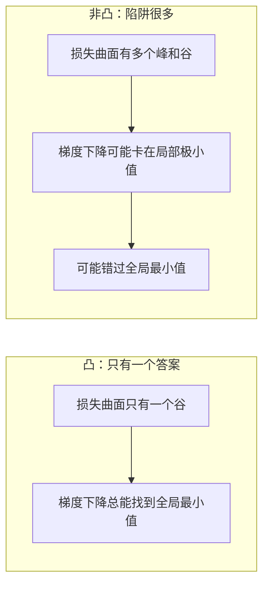
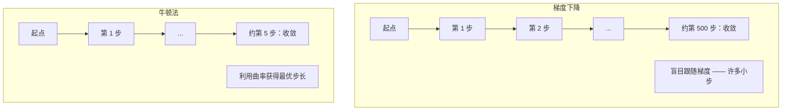
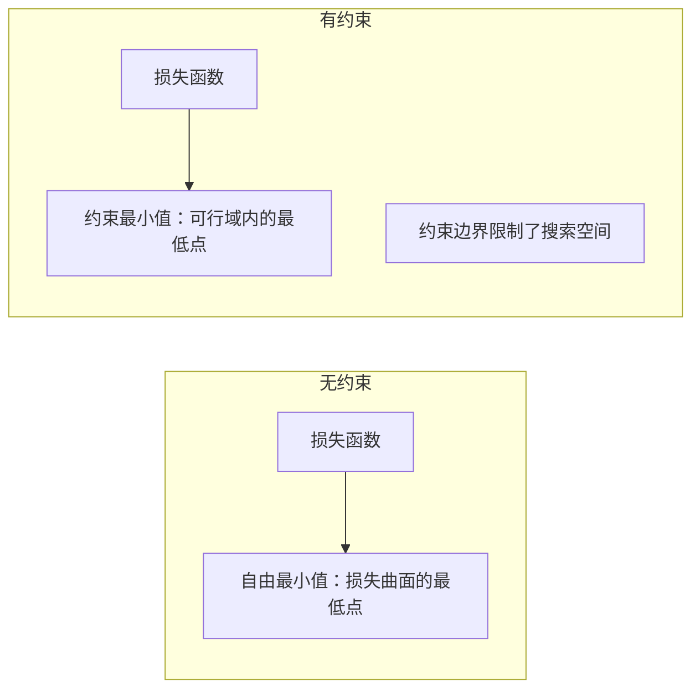
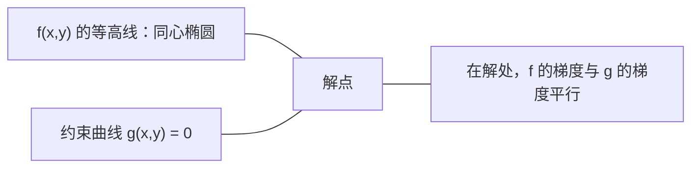

# 凸优化（Convex Optimization）

> 凸问题只有一个谷底。神经网络有数百万个。分清这两者至关重要。

**Type:** Build
**Language:** Python
**Prerequisites:** Phase 1, Lessons 04 (Calculus for ML), 08 (Optimization)
**Time:** ~90 minutes

## 学习目标（Learning Objectives）

- 用定义、二阶导数和 Hessian 判据检验函数是否为凸
- 实现牛顿法（Newton's method），并将其二次收敛速度与梯度下降对比
- 用拉格朗日乘子法（Lagrange multipliers）求解约束优化问题，并解读 KKT 条件
- 解释为什么神经网络的损失景观是非凸的，而 SGD 仍然能找到好的解

## 问题（The Problem）

第 08 课教了你梯度下降、动量和 Adam。这些优化器能在任何曲面上往下走，但它们不附带任何保证。在非凸景观上运行梯度下降，可能落进糟糕的局部极小值，卡在鞍点上，或者永远振荡。你照样用它，因为神经网络是非凸的，而且别无选择。

但机器学习中很多问题是凸的：线性回归、逻辑回归、SVM、LASSO、岭回归。对这些问题，存在更强的工具：带数学保证的优化。凸问题恰好只有一个谷底。任何往下走的算法都会到达全局最小值。不需要随机重启，不需要学习率调度，不需要祈祷。

理解凸性会带来三样东西。第一，它告诉你问题何时容易（凸）何时困难（非凸）。第二，它为你提供凸问题上更快的工具，比如牛顿法。第三，它解释了贯穿机器学习的许多概念：作为约束的正则化、SVM 中的对偶性，以及为什么深度学习在违反了凸性给你的每一条好性质的情况下仍然有效。

## 核心概念（The Concept）

### 凸集（Convex sets）

如果集合 S 中任意两点的连线段也完全落在 S 内，则 S 是凸集。

| 凸集 | 非凸 |
|---|---|
| **矩形**：内部任意两点都能用一条留在集合内的线段连接 | **星形/月牙形**：两个内点之间的连线可能跑到集合外 |
| **三角形**：所有内点都满足同样的性质 | **甜甜圈/圆环**：中间的洞使某些线段离开集合 |
| 任意两点之间的线段都留在集合内 | 某些点对之间的线段会跑出集合 |

形式化判据：对 S 中任意点 x、y 和任意 t ∈ [0, 1]，点 tx + (1-t)y 也在 S 中。

凸集的例子：
- 直线、平面、整个 R^n
- 球（圆、球面、超球面）
- 半空间：{x : a^T x <= b}
- 任意多个凸集的交集

非凸集的例子：
- 甜甜圈（圆环）
- 两个不相交圆的并集
- 任何带"凹痕"或"洞"的集合

### 凸函数（Convex functions）

如果函数 f 的定义域是凸集，且对定义域内任意两点 x、y 和任意 t ∈ [0, 1]：

```
f(tx + (1-t)y) <= t*f(x) + (1-t)*f(y)
```

几何意义：图像上任意两点之间的线段位于图像上方或图像上。

| 性质 | 凸函数 | 非凸函数 |
|---|---|---|
| **线段检验** | 图像上任意两点之间的连线**位于曲线上方或曲线上** | 图像上某些点之间的连线**低于**曲线 |
| **形状** | 单一的上弯碗形/谷形 | 多个峰和谷，曲率混合 |
| **局部极小值** | 每个局部极小值都是全局最小值 | 可能存在高度不同的多个局部极小值 |

常见凸函数：
- f(x) = x^2（抛物线）
- f(x) = |x|（绝对值）
- f(x) = e^x（指数）
- f(x) = max(0, x)（ReLU，虽然是分段线性）
- f(x) = -log(x)，当 x > 0（负对数）
- 任何线性函数 f(x) = a^T x + b（既凸又凹）

### 凸性判定（Testing for convexity）

三种实用判据，从最简单到最严格。

**判据 1：二阶导数判据（一维）。** 如果对所有 x 都有 f''(x) >= 0，那么 f 是凸的。

- f(x) = x^2：f''(x) = 2 >= 0。凸。
- f(x) = x^3：f''(x) = 6x。x < 0 时为负。不是凸的。
- f(x) = e^x：f''(x) = e^x > 0。凸。

**判据 2：Hessian 判据（多元）。** 如果 Hessian 矩阵 H(x) 对所有 x 都半正定，那么 f 是凸的。Hessian 是由二阶偏导数组成的矩阵。

**判据 3：定义判据。** 直接验证不等式 f(tx + (1-t)y) <= t*f(x) + (1-t)*f(y)。对难以求导的函数很有用。

### 凸性为什么重要（Why convexity matters）

凸优化的中心定理：

**对凸函数而言，每个局部极小值都是全局最小值。**

这意味着梯度下降不可能被困住。任何下行路径都通向同一个答案。算法保证收敛到最优解。



推论：
- 不需要随机重启
- 不需要复杂的学习率调度
- 可以给出收敛性证明（速率取决于函数性质）
- 解是唯一的（平坦区域除外）

### 机器学习中的凸与非凸（Convex vs non-convex in ML）

| 问题 | 凸吗？ | 原因 |
|---------|---------|-----|
| 线性回归（MSE） | 是 | 损失对权重是二次的 |
| 逻辑回归 | 是 | 对数损失对权重是凸的 |
| SVM（hinge 损失） | 是 | 线性函数的最大值 |
| LASSO（L1 回归） | 是 | 凸函数之和仍是凸的 |
| 岭回归（L2） | 是 | 二次 + 二次 = 凸 |
| 神经网络（任何损失） | 否 | 非线性激活制造出非凸景观 |
| k-means 聚类 | 否 | 离散的分配步骤 |
| 矩阵分解 | 否 | 未知数的乘积 |

带凸损失的线性模型是凸的。一旦加入带非线性激活的隐藏层，凸性就被打破。

### Hessian 矩阵（The Hessian matrix）

函数 f: R^n -> R 的 Hessian H 是由二阶偏导数组成的 n x n 矩阵。

```
H[i][j] = d^2 f / (dx_i dx_j)
```

对 f(x, y) = x^2 + 3xy + y^2：

```
df/dx = 2x + 3y       d^2f/dx^2 = 2      d^2f/dxdy = 3
df/dy = 3x + 2y       d^2f/dydx = 3      d^2f/dy^2 = 2

H = [ 2  3 ]
    [ 3  2 ]
```

Hessian 告诉你曲率信息：
- 特征值全为正：函数在每个方向都向上弯（该点处是凸的）
- 特征值全为负：在每个方向都向下弯（凹，局部极大值）
- 正负混合：鞍点（某些方向向上弯，另一些向下弯）
- 零特征值：该方向上平坦（退化）

要判定凸性，Hessian 必须处处半正定（所有特征值 >= 0），而不只是在一个点上。

### 牛顿法（Newton's method）

梯度下降使用一阶信息（梯度）。牛顿法使用二阶信息（Hessian）。它在当前点拟合一个二次近似，然后直接跳到那个二次函数的最小值。

```
Update rule:
  x_new = x - H^(-1) * gradient

Compare to gradient descent:
  x_new = x - lr * gradient
```

牛顿法用逆 Hessian 取代标量学习率。它根据局部曲率自动调整步长和方向。



优点：
- 在极小值附近二次收敛（误差每步平方）
- 没有学习率要调
- 尺度不变（无论问题如何参数化都有效）

缺点：
- 计算 Hessian 需要 O(n^2) 内存，求逆需要 O(n^3)
- 对一个有 100 万权重的神经网络来说，那是 10^12 个条目和 10^18 次运算
- 对深度学习不实用

### 约束优化（Constrained optimization）

无约束优化：在所有 x 上最小化 f(x)。
约束优化：在满足约束的条件下最小化 f(x)。

现实问题都有约束。你想最小化成本，但预算有限。你想最小化误差，但模型复杂度有上限。



### 拉格朗日乘子法（Lagrange multipliers）

拉格朗日乘子法把约束问题转化为无约束问题。

问题：在 g(x) = 0 的约束下最小化 f(x)。

解法：引入一个新变量（拉格朗日乘子 lambda），然后求解无约束问题：

```
L(x, lambda) = f(x) + lambda * g(x)
```

在解处，L 的梯度为零：

```
dL/dx = df/dx + lambda * dg/dx = 0
dL/dlambda = g(x) = 0
```

几何直觉：在约束极小值处，f 的梯度必须与约束 g 的梯度平行。如果不平行，你就可以沿约束面移动并进一步降低 f。



例子：在 x + y = 1 的约束下最小化 f(x,y) = x^2 + y^2。

```
L = x^2 + y^2 + lambda(x + y - 1)

dL/dx = 2x + lambda = 0  =>  x = -lambda/2
dL/dy = 2y + lambda = 0  =>  y = -lambda/2
dL/dlambda = x + y - 1 = 0

From first two: x = y
Substituting: 2x = 1, so x = y = 0.5, lambda = -1
```

直线 x + y = 1 上离原点最近的点是 (0.5, 0.5)。

### KKT 条件（KKT conditions）

Karush-Kuhn-Tucker 条件把拉格朗日乘子法推广到不等式约束。

问题：在 g_i(x) <= 0（i = 1, ..., m）的约束下最小化 f(x)。

KKT 条件（最优性的必要条件）：

```
1. Stationarity:    df/dx + sum(lambda_i * dg_i/dx) = 0
2. Primal feasibility:  g_i(x) <= 0  for all i
3. Dual feasibility:    lambda_i >= 0  for all i
4. Complementary slackness:  lambda_i * g_i(x) = 0  for all i
```

互补松弛（complementary slackness）是关键洞察：要么约束是活跃的（g_i = 0，解位于边界上），要么乘子为零（该约束不起作用）。不影响解的约束其 lambda = 0。

KKT 条件是 SVM 的核心。支持向量就是约束活跃的那些数据点（lambda > 0）。所有其他数据点的 lambda = 0，不影响决策边界。

### 作为约束优化的正则化（Regularization as constrained optimization）

L1 和 L2 正则化不是随意发明的技巧。它们是伪装起来的约束优化问题。

**L2 正则化（Ridge）：**

```
minimize  Loss(w)  subject to  ||w||^2 <= t

Equivalent unconstrained form:
minimize  Loss(w) + lambda * ||w||^2
```

约束 ||w||^2 <= t 定义了一个球（二维是圆，三维是球）。解就是损失等高线第一次触到这个球的地方。

**L1 正则化（LASSO）：**

```
minimize  Loss(w)  subject to  ||w||_1 <= t

Equivalent unconstrained form:
minimize  Loss(w) + lambda * ||w||_1
```

约束 ||w||_1 <= t 定义了一个菱形（二维中旋转的正方形）。

| 性质 | L2 约束（圆） | L1 约束（菱形） |
|---|---|---|
| **约束形状** | 圆（高维是球） | 菱形（二维中旋转的正方形） |
| **损失等高线触到的位置** | 平滑边界 — 圆上的任意一点 | 角 — 与坐标轴对齐 |
| **解的行为** | 权重小但非零 | 某些权重恰好为零（稀疏） |
| **结果** | 权重收缩 | 特征选择 |

这解释了为什么 L1 产生稀疏模型（特征选择），而 L2 只收缩权重。菱形的角与坐标轴对齐，损失等高线更容易触到角上，从而使一个或多个权重恰好为零。

### 对偶性（Duality）

每个约束优化问题（原始问题，primal）都有一个伴随问题（对偶问题，dual）。对凸问题，原始问题和对偶问题的最优值相同。这就是强对偶性（strong duality）。

拉格朗日对偶函数：

```
Primal: minimize f(x) subject to g(x) <= 0
Lagrangian: L(x, lambda) = f(x) + lambda * g(x)
Dual function: d(lambda) = min_x L(x, lambda)
Dual problem: maximize d(lambda) subject to lambda >= 0
```

为什么对偶性重要：
- 对偶问题有时比原始问题更容易求解
- SVM 以对偶形式求解，此时问题只依赖数据点之间的点积（从而启用核技巧）
- 对偶为原始最优值提供下界，可用于检验解的质量

具体到 SVM：

```
Primal: find w, b that maximize the margin 2/||w|| subject to
        y_i(w^T x_i + b) >= 1 for all i

Dual:   maximize sum(alpha_i) - 0.5 * sum_ij(alpha_i * alpha_j * y_i * y_j * x_i^T x_j)
        subject to alpha_i >= 0 and sum(alpha_i * y_i) = 0

The dual only involves dot products x_i^T x_j.
Replace x_i^T x_j with K(x_i, x_j) to get the kernel trick.
```

### 为什么深度学习在非凸性下仍然有效（Why deep learning works despite non-convexity）

神经网络的损失函数是极度非凸的。按每一条经典标准，优化它们都应该失败。然而随机梯度下降总能可靠地找到好的解。以下几个因素解释了这一点。

**大多数局部极小值已经足够好。** 在高维空间中，随机临界点（梯度为零的点）绝大多数是鞍点，而不是局部极小值。少数存在的局部极小值，其损失值往往接近全局最小值。当参数空间有数百万维时，被困在糟糕局部极小值中的可能性极低。

**真正的障碍是鞍点，不是局部极小值。** 在一个有 n 个参数的函数中，鞍点同时具有正的和负的曲率方向。对高维中的随机临界点，n 个特征值全为正（局部极小值）的概率大约是 2^(-n)。几乎所有临界点都是鞍点。SGD 的噪声有助于逃离它们。

**过参数化让景观变得平滑。** 参数多于训练样本的网络拥有更平滑、更连通的损失曲面。更宽的网络有更少的糟糕局部极小值。这有违直觉，但在经验上反复成立。

**损失景观结构：**

| 性质 | 低维空间 | 高维空间 |
|---|---|---|
| **景观** | 许多孤立的峰和谷 | 平滑连通的谷 |
| **极小值** | 许多孤立的局部极小值 | 糟糕的局部极小值很少；大多数接近最优 |
| **导航** | 很难找到全局最小值 | 许多路径通向好的解 |
| **临界点** | 局部极小值和鞍点混合 | 绝大多数是鞍点，不是局部极小值 |

**随机噪声起到隐式正则化的作用。** 小批量 SGD 引入的噪声防止模型落入尖锐的极小值。尖锐极小值过拟合；平坦极小值泛化。噪声把优化偏向损失景观的平坦区域。

### 实践中的二阶方法（Second-order methods in practice）

纯牛顿法对大型模型不实用。几种近似方法让二阶信息变得可用。

**L-BFGS（Limited-memory BFGS）：** 用最近 m 次梯度差来近似逆 Hessian。只需要 O(mn) 内存而不是 O(n^2)。对多达约 10,000 个参数的问题效果很好。用于经典机器学习（逻辑回归、CRF），不用于深度学习。

**自然梯度（natural gradient）：** 用 Fisher 信息矩阵（对数似然的期望 Hessian）取代标准 Hessian。这考虑了概率分布的几何结构。K-FAC（Kronecker-Factored Approximate Curvature）把 Fisher 矩阵近似为 Kronecker 积，使其在神经网络上变得实用。

**无 Hessian 优化（Hessian-free）：** 用共轭梯度求解 Hx = g，而完全不显式构造 H。只需要 Hessian-向量积，而它可以通过自动微分在 O(n) 时间内算出。

**对角近似：** Adam 的二阶矩就是 Hessian 对角线的一个对角近似。AdaHessian 在此基础上通过 Hutchinson 估计器使用真实的 Hessian 对角元素。

| 方法 | 内存 | 每步代价 | 何时使用 |
|--------|--------|--------------|-------------|
| 梯度下降 | O(n) | O(n) | 基线，大型模型 |
| 牛顿法 | O(n^2) | O(n^3) | 小型凸问题 |
| L-BFGS | O(mn) | O(mn) | 中型凸问题 |
| Adam | O(n) | O(n) | 深度学习默认 |
| K-FAC | O(n) | 每层 O(n) | 研究，大批量训练 |

```figure
convex-vs-nonconvex
```

## 动手构建（Build It）

### 步骤 1：凸性检查器（Step 1: Convexity checker）

构建一个通过采样点并检查定义来经验性测试凸性的函数。

```python
import random
import math

def check_convexity(f, dim, bounds=(-5, 5), samples=1000):
    violations = 0
    for _ in range(samples):
        x = [random.uniform(*bounds) for _ in range(dim)]
        y = [random.uniform(*bounds) for _ in range(dim)]
        t = random.uniform(0, 1)
        mid = [t * xi + (1 - t) * yi for xi, yi in zip(x, y)]
        lhs = f(mid)
        rhs = t * f(x) + (1 - t) * f(y)
        if lhs > rhs + 1e-10:
            violations += 1
    return violations == 0, violations
```

### 步骤 2：二维牛顿法（Step 2: Newton's method for 2D）

使用显式 Hessian 实现牛顿法。与梯度下降比较收敛速度。

```python
def newtons_method(f, grad_f, hessian_f, x0, steps=50, tol=1e-12):
    x = list(x0)
    history = [x[:]]
    for _ in range(steps):
        g = grad_f(x)
        H = hessian_f(x)
        det = H[0][0] * H[1][1] - H[0][1] * H[1][0]
        if abs(det) < 1e-15:
            break
        H_inv = [
            [H[1][1] / det, -H[0][1] / det],
            [-H[1][0] / det, H[0][0] / det],
        ]
        dx = [
            H_inv[0][0] * g[0] + H_inv[0][1] * g[1],
            H_inv[1][0] * g[0] + H_inv[1][1] * g[1],
        ]
        x = [x[0] - dx[0], x[1] - dx[1]]
        history.append(x[:])
        if sum(gi ** 2 for gi in g) < tol:
            break
    return history
```

### 步骤 3：拉格朗日乘子求解器（Step 3: Lagrange multiplier solver）

在拉格朗日函数上用梯度下降求解约束优化。

```python
def lagrange_solve(f_grad, g_val, g_grad, x0, lr=0.01,
                   lr_lambda=0.01, steps=5000):
    x = list(x0)
    lam = 0.0
    history = []
    for _ in range(steps):
        fg = f_grad(x)
        gv = g_val(x)
        gg = g_grad(x)
        x = [
            xi - lr * (fgi + lam * ggi)
            for xi, fgi, ggi in zip(x, fg, gg)
        ]
        lam = lam + lr_lambda * gv
        history.append((x[:], lam, gv))
    return history
```

### 步骤 4：一阶方法与二阶方法对比（Step 4: Compare first-order vs second-order）

在同一个二次函数上运行梯度下降和牛顿法。数一数各自收敛需要多少步。

```python
def quadratic(x):
    return 5 * x[0] ** 2 + x[1] ** 2

def quadratic_grad(x):
    return [10 * x[0], 2 * x[1]]

def quadratic_hessian(x):
    return [[10, 0], [0, 2]]
```

牛顿法将在 1 步内收敛（对二次函数它是精确的）。梯度下降要花几百步，因为 Hessian 的特征值相差 5 倍，形成一条拉长的峡谷。

## 生产实践（Use It）

选择机器学习模型和求解器时，凸性分析可以直接派上用场。

对凸问题（逻辑回归、SVM、LASSO）：
- 使用专用求解器（liblinear、CVXPY、scipy.optimize.minimize 并指定 method='L-BFGS-B'）
- 预期存在唯一的全局解
- 二阶方法实用且快速

对非凸问题（神经网络）：
- 使用一阶方法（SGD、Adam）
- 接受解依赖于初始化和随机性这一事实
- 把过参数化、噪声和学习率调度当作隐式正则化
- 不要浪费时间寻找全局最小值。一个好的局部极小值就够了。

```python
from scipy.optimize import minimize

result = minimize(
    fun=lambda w: sum((y - X @ w) ** 2) + 0.1 * sum(w ** 2),
    x0=np.zeros(d),
    method='L-BFGS-B',
    jac=lambda w: -2 * X.T @ (y - X @ w) + 0.2 * w,
)
```

对 SVM，对偶形式让你能用核技巧：

```python
from sklearn.svm import SVC

svm = SVC(kernel='rbf', C=1.0)
svm.fit(X_train, y_train)
print(f"Support vectors: {svm.n_support_}")
```

## 练习（Exercises）

1. **凸性画廊。** 用检查器检验这些函数的凸性：f(x) = x^4、f(x) = sin(x)、f(x,y) = x^2 + y^2、f(x,y) = x*y、f(x) = max(x, 0)。解释每个结果为什么合理。

2. **牛顿法与梯度下降赛跑。** 从起点 (10, 10) 出发，在 f(x,y) = 50*x^2 + y^2 上运行两种方法。各自需要多少步才能达到损失 < 1e-10？当条件数（Hessian 最大与最小特征值之比）增大时，梯度下降会发生什么？

3. **拉格朗日乘子的几何。** 在 x + 2y = 4 的约束下最小化 f(x,y) = (x-3)^2 + (y-3)^2。通过验证在解处 f 的梯度与 g 的梯度平行来核实答案。

4. **正则化约束。** 实现带 L1 约束的优化：在 |x| + |y| <= 1 的约束下最小化 (x-3)^2 + (y-2)^2。证明解有一个坐标恰好为零（来自菱形约束的稀疏性）。

5. **Hessian 特征值分析。** 计算 Rosenbrock 函数在 (1,1) 和 (-1,1) 处的 Hessian。算出这两点的特征值。关于极小值处与远离极小值处的曲率，这些特征值告诉你什么？

## 关键术语（Key Terms）

| 术语 | 含义 |
|------|---------------|
| 凸集 | 集合内任意两点的连线段都留在集合内的集合 |
| 凸函数 | 图像上任意两点的连线位于图像上方或图像上的函数。等价地，Hessian 处处半正定 |
| 局部极小值 | 比所有邻近点都低的点。对凸函数，每个局部极小值都是全局最小值 |
| 全局最小值 | 函数在整个定义域上的最低点 |
| Hessian 矩阵 | 所有二阶偏导数组成的矩阵。编码曲率信息 |
| 半正定 | 所有特征值非负的矩阵。"二阶导数 >= 0" 的多维版本 |
| 条件数 | Hessian 最大与最小特征值之比。条件数高意味着峡谷拉长、梯度下降变慢 |
| 牛顿法 | 用逆 Hessian 决定步长和方向的二阶优化器。在极小值附近二次收敛 |
| 拉格朗日乘子 | 为把约束优化问题转化为无约束问题而引入的变量 |
| KKT 条件 | 带不等式约束时最优性的必要条件。是拉格朗日乘子的推广 |
| 互补松弛 | 在解处，要么约束活跃，要么其乘子为零。绝不会两者同时非零 |
| 对偶性 | 每个约束问题都有一个伴随的对偶问题。对凸问题，两者最优值相同 |
| 强对偶性 | 原始与对偶最优值相等。对满足 Slater 条件的凸问题成立 |
| L-BFGS | 近似二阶方法，只存最近 m 次梯度差而不是完整 Hessian |
| 鞍点 | 梯度为零，但在某些方向是极小、在另一些方向是极大的点 |
| 过参数化 | 使用多于训练样本的参数。让损失景观更平滑，减少糟糕的局部极小值 |

## 延伸阅读（Further Reading）

- [Boyd & Vandenberghe: Convex Optimization](https://web.stanford.edu/~boyd/cvxbook/) - 标准教科书，可在线免费获取
- [Bottou, Curtis, Nocedal: Optimization Methods for Large-Scale Machine Learning (2018)](https://arxiv.org/abs/1606.04838) - 连接凸优化理论与深度学习实践
- [Choromanska et al.: The Loss Surfaces of Multilayer Networks (2015)](https://arxiv.org/abs/1412.0233) - 为什么非凸的神经网络景观没有看起来那么糟
- [Nocedal & Wright: Numerical Optimization](https://link.springer.com/book/10.1007/978-0-387-40065-5) - 牛顿法、L-BFGS 和约束优化的全面参考
