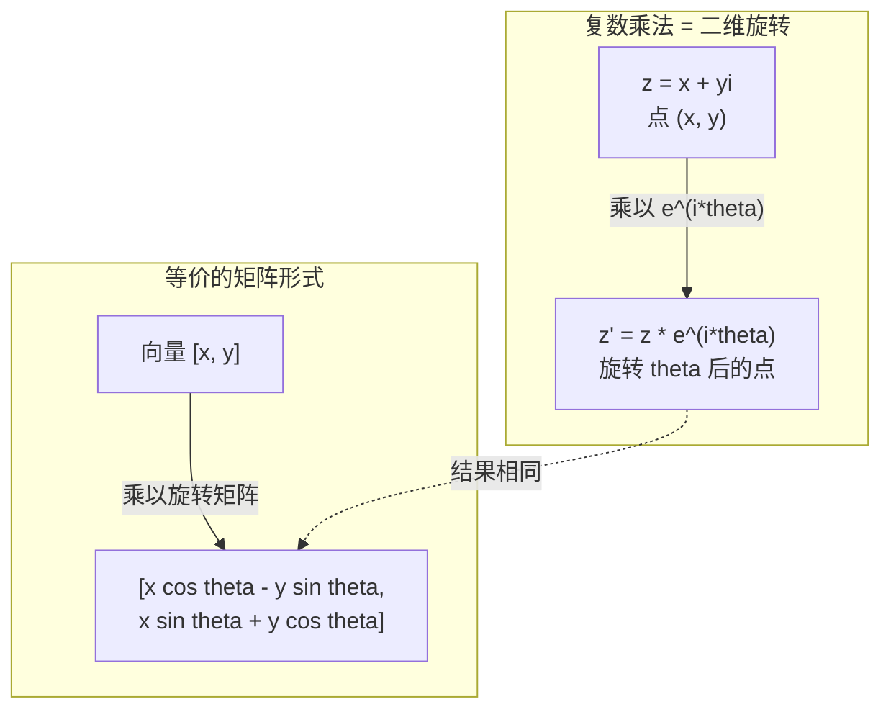
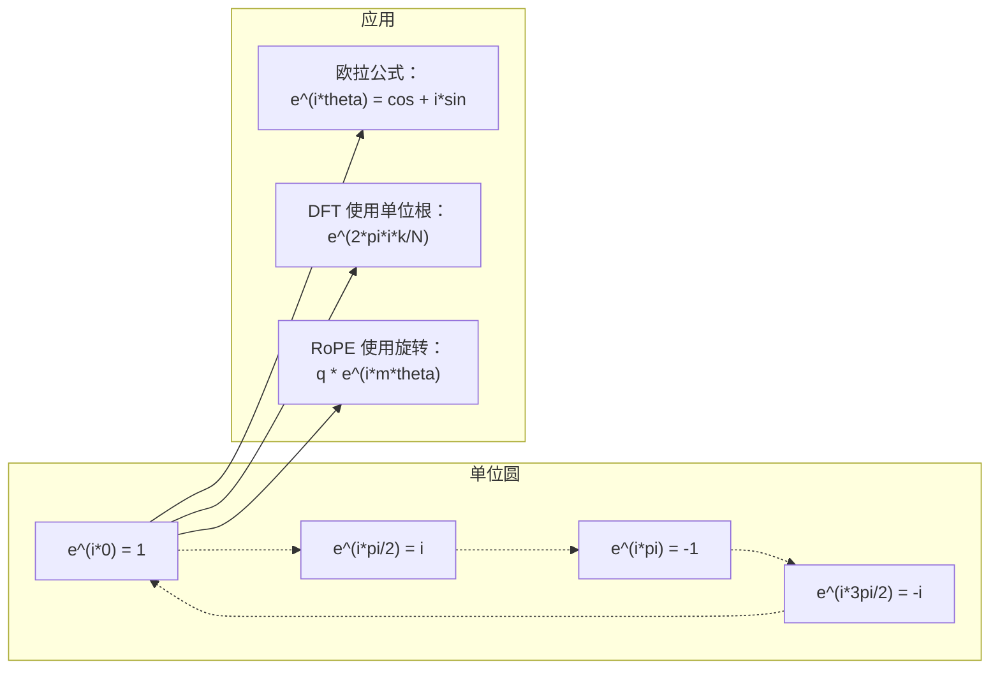

# 面向 AI 的复数（Complex Numbers for AI）

> -1 的平方根并不"虚"。它是理解旋转、频率以及半个信号处理领域的钥匙。

**Type:** Learn
**Language:** Python
**Prerequisites:** Phase 1, Lessons 01-04 (linear algebra, calculus)
**Time:** ~60 minutes

## 学习目标（Learning Objectives）

- 在直角坐标形式与极坐标形式下进行复数运算（加、乘、除、共轭）
- 运用欧拉公式在复指数与三角函数之间相互转换
- 使用复单位根实现离散傅里叶变换（DFT）
- 解释复数旋转如何支撑 Transformer 中的 RoPE 与正弦位置编码

## 问题所在（The Problem）

你打开一篇关于傅里叶变换的论文，`i` 随处可见。你查看 Transformer 的位置编码，看到不同频率上的 `sin` 和 `cos`——它们正是复指数的实部和虚部。你阅读量子计算的资料，发现一切都表述在复向量空间里。

复数看起来很抽象。一个建立在 -1 的平方根之上的数系像是一个数学戏法。但它不是戏法。它是旋转与振荡的自然语言。每当有东西在旋转、振动或振荡，复数就是合适的工具。

不理解复数，你就无法理解离散傅里叶变换，无法理解 FFT，无法理解 RoPE（Rotary Position Embedding，旋转位置编码）在现代语言模型中如何工作，也无法理解原始 Transformer 论文中的正弦位置编码为什么选用那些频率。

本课从零开始构建复数运算，把它与几何联系起来，并确切地指出复数出现在机器学习中的哪些地方。

## 核心概念（The Concept）

### 什么是复数？（What is a complex number?）

复数由两部分组成：实部和虚部。

```
z = a + bi

where:
  a is the real part
  b is the imaginary part
  i is the imaginary unit, defined by i^2 = -1
```

就是这样。你把数轴扩展成了平面。实数位于一条轴上，虚数位于另一条轴上。每个复数都是这个平面上的一个点。

### 复数运算（Complex arithmetic）

**加法。** 实部与实部相加，虚部与虚部相加。

```
(a + bi) + (c + di) = (a + c) + (b + d)i

Example: (3 + 2i) + (1 + 4i) = 4 + 6i
```

**乘法。** 使用分配律，并记住 i^2 = -1。

```
(a + bi)(c + di) = ac + adi + bci + bdi^2
                 = ac + adi + bci - bd
                 = (ac - bd) + (ad + bc)i

Example: (3 + 2i)(1 + 4i) = 3 + 12i + 2i + 8i^2
                            = 3 + 14i - 8
                            = -5 + 14i
```

**共轭（conjugate）。** 翻转虚部的符号。

```
conjugate of (a + bi) = a - bi
```

复数与其共轭的乘积总是实数：

```
(a + bi)(a - bi) = a^2 + b^2
```

**除法。** 分子分母同时乘以分母的共轭。

```
(a + bi) / (c + di) = (a + bi)(c - di) / (c^2 + d^2)
```

这样就消去了分母中的虚部，得到一个干净的复数。

### 复平面（The complex plane）

复平面把每个复数映射为二维平面上的一个点。水平轴是实轴，垂直轴是虚轴。

```
z = 3 + 2i  corresponds to the point (3, 2)
z = -1 + 0i corresponds to the point (-1, 0) on the real axis
z = 0 + 4i  corresponds to the point (0, 4) on the imaginary axis
```

一个复数既是平面上的一个点，也是从原点出发的一个向量。这种双重解释正是复数对几何有用的原因。

### 极坐标形式（Polar form）

平面上的任意一点都可以用它到原点的距离、以及它与正实轴的夹角来描述。

```
z = r * (cos(theta) + i*sin(theta))

where:
  r = |z| = sqrt(a^2 + b^2)     (magnitude, or modulus)
  theta = atan2(b, a)             (phase, or argument)
```

直角坐标形式（a + bi）适合加法。极坐标形式（r, theta）适合乘法。

**极坐标形式下的乘法。** 模相乘，角相加。

```
z1 = r1 * e^(i*theta1)
z2 = r2 * e^(i*theta2)

z1 * z2 = (r1 * r2) * e^(i*(theta1 + theta2))
```

这正是复数完美适配旋转的原因。乘以一个模为 1 的复数就是一次纯旋转。

### 欧拉公式（Euler's formula）

连接复指数与三角学的桥梁：

```
e^(i*theta) = cos(theta) + i*sin(theta)
```

这是本课最重要的公式。当 theta = pi 时：

```
e^(i*pi) = cos(pi) + i*sin(pi) = -1 + 0i = -1

Therefore: e^(i*pi) + 1 = 0
```

五个基本常数（e、i、pi、1、0）被联系在同一个等式里。

### 欧拉公式为何对机器学习很重要（Why Euler's formula matters for ML）

欧拉公式说的是：随着 theta 变化，`e^(i*theta)` 会描出单位圆。theta = 0 时你位于 (1, 0)；theta = pi/2 时你位于 (0, 1)；theta = pi 时你位于 (-1, 0)；theta = 3*pi/2 时你位于 (0, -1)。转满一整圈对应 theta = 2*pi。

这意味着复指数就是旋转。而旋转在信号处理和机器学习中无处不在。

### 与二维旋转的联系（Connection to 2D rotations）

把复数 (x + yi) 乘以 e^(i*theta)，就是把点 (x, y) 绕原点旋转角度 theta。

```
Rotation via complex multiplication:
  (x + yi) * (cos(theta) + i*sin(theta))
  = (x*cos(theta) - y*sin(theta)) + (x*sin(theta) + y*cos(theta))i

Rotation via matrix multiplication:
  [cos(theta)  -sin(theta)] [x]   [x*cos(theta) - y*sin(theta)]
  [sin(theta)   cos(theta)] [y] = [x*sin(theta) + y*cos(theta)]
```

两者给出完全相同的结果。复数乘法就是二维旋转。旋转矩阵只是用矩阵记号写出来的复数乘法。



### 相量与旋转信号（Phasors and rotating signals）

复指数 e^(i*omega*t) 是一个以角频率 omega 绕单位圆旋转的点。随着 t 增大，这个点沿圆周运行。

这个旋转点的实部是 cos(omega*t)，虚部是 sin(omega*t)。正弦信号就是一个旋转复数的影子。

```
e^(i*omega*t) = cos(omega*t) + i*sin(omega*t)

Real part:      cos(omega*t)    -- a cosine wave
Imaginary part: sin(omega*t)    -- a sine wave
```

这就是相量（phasor）表示。你不必追踪一条来回摆动的正弦波，而是追踪一支平滑旋转的箭头。相位偏移变成角度偏移，幅度变化变成模的变化，信号的相加变成向量相加。

### 单位根（Roots of unity）

N 次单位根（roots of unity）是单位圆上等距分布的 N 个点：

```
w_k = e^(2*pi*i*k/N)    for k = 0, 1, 2, ..., N-1
```

N = 4 时，单位根是：1、i、-1、-i（四个罗盘方位点）。
N = 8 时，你会得到四个罗盘方位点再加上四个对角点。

单位根是离散傅里叶变换的基础。DFT 把信号分解到这 N 个等距频率上。

### 与 DFT 的联系（Connection to the DFT）

信号 x[0], x[1], ..., x[N-1] 的离散傅里叶变换（Discrete Fourier Transform, DFT）是：

```
X[k] = sum_{n=0}^{N-1} x[n] * e^(-2*pi*i*k*n/N)
```

每个 X[k] 度量信号与第 k 个单位根（频率为 k 的复正弦）的相关程度。DFT 把信号拆解成 N 个旋转相量，并告诉你每个相量的幅度和相位。

### 为什么 i 并不"虚"（Why i is not imaginary）

"虚数"（imaginary）这个词是历史上的偶然。笛卡尔当年用它表达轻蔑。但 i 并不比负数更"虚"——负数最初也遭到过人们的拒绝。负数回答的是"从 3 里减去 5 得到什么？"，而虚数单位回答的是"什么数的平方等于 -1？"

更有用的说法是：i 是一个 90 度旋转算子。把一个实数乘以一次 i，你旋转 90 度到达虚轴；再乘一次 i（即 i^2），你又旋转 90 度——此时你指向负实轴方向。这就是 i^2 = -1 的原因。它并不神秘，它是由两个四分之一圈拼成的一个半圈。

这就是复数在工程领域无处不在的原因。任何旋转的东西——电磁波、量子态、信号振荡、位置编码——都天然地由复数描述。

### 复指数与三角函数的对比（Complex exponentials vs trigonometric functions）

在欧拉公式出现之前，工程师把信号写成 A*cos(omega*t + phi)——幅度 A、频率 omega、相位 phi。这样行得通，但运算很痛苦。要把两个相位不同的余弦相加，得动用三角恒等式。

用复指数，同一个信号就是 A*e^(i*(omega*t + phi))。两个信号相加就是两个复数相加。相乘（调制）就是模相乘、角相加。相位偏移变成角度加法，频率搬移变成乘以一个相量。

整个信号处理领域之所以转向复指数记号，是因为数学更干净。"真实信号"永远只是复表示的实部。虚部作为"记账"一路随身携带，让所有代数推导自然成立。

### 与 Transformer 的联系（Connection to transformers）

**正弦位置编码（sinusoidal positional encodings）**（原始 Transformer 论文）：

```
PE(pos, 2i) = sin(pos / 10000^(2i/d))
PE(pos, 2i+1) = cos(pos / 10000^(2i/d))
```

这些 sin 和 cos 对正是不同频率的复指数的实部和虚部。每个频率为位置编码提供不同的"分辨率"。低频变化慢（粗略位置），高频变化快（精细位置）。它们共同赋予每个位置一个独一无二的频率指纹。

**RoPE（Rotary Position Embedding，旋转位置编码）**走得更远。它显式地把 query 和 key 向量乘以复旋转矩阵。两个词元（token）之间的相对位置变成一个旋转角度。注意力用这些旋转后的向量来计算，使模型通过复数乘法对相对位置敏感。

| 运算 | 代数形式 | 几何意义 |
|-----------|---------------|-------------------|
| 加法 | (a+c) + (b+d)i | 平面中的向量加法 |
| 乘法 | (ac-bd) + (ad+bc)i | 旋转并缩放 |
| 共轭 | a - bi | 关于实轴作镜像 |
| 模 | sqrt(a^2 + b^2) | 到原点的距离 |
| 相位 | atan2(b, a) | 相对正实轴的角度 |
| 除法 | 乘以共轭 | 逆转旋转并重新缩放 |
| 幂 | r^n * e^(i*n*theta) | 旋转 n 次，并按 r^n 缩放 |



```figure
roots-of-unity
```

## 动手实现（Build It）

### 步骤 1：Complex 类（Step 1: Complex class）

构建一个支持运算、模、相位以及直角坐标与极坐标形式相互转换的复数类 Complex。

```python
import math

class Complex:
    def __init__(self, real, imag=0.0):
        self.real = real
        self.imag = imag

    def __add__(self, other):
        return Complex(self.real + other.real, self.imag + other.imag)

    def __mul__(self, other):
        r = self.real * other.real - self.imag * other.imag
        i = self.real * other.imag + self.imag * other.real
        return Complex(r, i)

    def __truediv__(self, other):
        denom = other.real ** 2 + other.imag ** 2
        r = (self.real * other.real + self.imag * other.imag) / denom
        i = (self.imag * other.real - self.real * other.imag) / denom
        return Complex(r, i)

    def magnitude(self):
        return math.sqrt(self.real ** 2 + self.imag ** 2)

    def phase(self):
        return math.atan2(self.imag, self.real)

    def conjugate(self):
        return Complex(self.real, -self.imag)
```

### 步骤 2：极坐标转换与欧拉公式（Step 2: Polar conversion and Euler's formula）

```python
def to_polar(z):
    return z.magnitude(), z.phase()

def from_polar(r, theta):
    return Complex(r * math.cos(theta), r * math.sin(theta))

def euler(theta):
    return Complex(math.cos(theta), math.sin(theta))
```

验证：`euler(theta).magnitude()` 应该始终为 1.0。`euler(0)` 应该给出 (1, 0)。`euler(pi)` 应该给出 (-1, 0)。

### 步骤 3：旋转（Step 3: Rotation）

把点 (x, y) 旋转角度 theta 只需一次复数乘法：

```python
point = Complex(3, 4)
rotated = point * euler(math.pi / 4)
```

模保持不变，只有角度改变。

### 步骤 4：用复数运算实现 DFT（Step 4: DFT from complex arithmetic）

```python
def dft(signal):
    N = len(signal)
    result = []
    for k in range(N):
        total = Complex(0, 0)
        for n in range(N):
            angle = -2 * math.pi * k * n / N
            total = total + Complex(signal[n], 0) * euler(angle)
        result.append(total)
    return result
```

这就是 O(N^2) 的 DFT。每个输出 X[k] 是信号采样值与单位根相乘后求和的结果。

### 步骤 5：逆 DFT（Step 5: Inverse DFT）

逆 DFT 从频谱重建原始信号。与正向 DFT 相比只有两处改动：指数符号取反，并除以 N。

```python
def idft(spectrum):
    N = len(spectrum)
    result = []
    for n in range(N):
        total = Complex(0, 0)
        for k in range(N):
            angle = 2 * math.pi * k * n / N
            total = total + spectrum[k] * euler(angle)
        result.append(Complex(total.real / N, total.imag / N))
    return result
```

这样就能完美重建。先做 DFT 再做 IDFT，你会在机器精度内拿回原始信号。没有任何信息丢失。

### 步骤 6：单位根（Step 6: Roots of unity）

```python
def roots_of_unity(N):
    return [euler(2 * math.pi * k / N) for k in range(N)]
```

验证两个性质：
- 每个根的模都精确等于 1。
- 所有 N 个根之和为零（由对称性相互抵消）。

正是这些性质让 DFT 可逆。单位根构成了频域的一组正交基。

## 直接使用（Use It）

Python 内置了复数支持。字面量 `j` 表示虚数单位。

```python
z = 3 + 2j
w = 1 + 4j

print(z + w)
print(z * w)
print(abs(z))

import cmath
print(cmath.phase(z))
print(cmath.exp(1j * cmath.pi))
```

对数组而言，numpy 原生支持复数：

```python
import numpy as np

z = np.array([1+2j, 3+4j, 5+6j])
print(np.abs(z))
print(np.angle(z))
print(np.conj(z))
print(np.real(z))
print(np.imag(z))

signal = np.sin(2 * np.pi * 5 * np.linspace(0, 1, 128))
spectrum = np.fft.fft(signal)
freqs = np.fft.fftfreq(128, d=1/128)
```

## 交付成果（Ship It）

运行 `code/complex_numbers.py` 生成 `outputs/skill-complex-arithmetic.md`。

## 练习（Exercises）

1. **手算复数运算。** 计算 (2 + 3i) * (4 - i) 并用代码验证。然后计算 (5 + 2i) / (1 - 3i)。把两个结果都画在复平面上，验证乘法确实旋转并缩放了第一个数。

2. **旋转序列。** 从点 (1, 0) 出发，连续乘以 e^(i*pi/6) 十二次。验证 12 次乘法之后你回到 (1, 0)。打印每一步的坐标，确认它们描出一个正十二边形。

3. **已知信号的 DFT。** 构造一个由 sin(2*pi*3*t) 与 0.5*sin(2*pi*7*t) 之和组成的信号，采样 32 个点。运行你的 DFT。验证幅度谱在频率 3 和 7 处出现峰值，且 7 处峰的高度是 3 处峰的一半。

4. **单位根可视化。** 计算 8 次单位根。验证它们之和为零。验证任意一个根乘以本原根 e^(2*pi*i/8) 都得到下一个根。

5. **旋转矩阵等价性。** 取 10 个随机角度和 10 个随机点，验证复数乘法与 2x2 旋转矩阵的矩阵-向量乘法给出相同结果。打印最大数值差异。

## 关键术语（Key Terms）

| 术语 | 含义 |
|------|---------------|
| 复数 | 形如 a + bi 的数，其中 a 是实部，b 是虚部，且 i^2 = -1 |
| 虚数单位 | 数 i，由 i^2 = -1 定义。并非哲学意义上的"虚"——它是一个旋转算子 |
| 复平面 | x 轴为实轴、y 轴为虚轴的二维平面。也称为 Argand 平面 |
| 模（modulus） | 到原点的距离：sqrt(a^2 + b^2)。记作 \|z\| |
| 相位（辐角） | 相对正实轴的角度：atan2(b, a)。记作 arg(z) |
| 共轭 | 关于实轴的镜像：a + bi 的共轭是 a - bi |
| 极坐标形式 | 把 z 表示成 r * e^(i*theta) 而非 a + bi。让乘法变得容易 |
| 欧拉公式 | e^(i*theta) = cos(theta) + i*sin(theta)。把指数与三角学联系起来 |
| 相量 | 表示正弦信号的旋转复数 e^(i*omega*t) |
| 单位根 | N 个复数 e^(2*pi*i*k/N)，k 取 0 到 N-1。单位圆上 N 个等距点 |
| DFT | 离散傅里叶变换。利用单位根把信号分解为复正弦分量 |
| RoPE | 旋转位置编码（Rotary Position Embedding）。在 Transformer 注意力中用复数乘法编码相对位置 |

## 延伸阅读（Further Reading）

- [欧拉公式的直观介绍](https://betterexplained.com/articles/intuitive-understanding-of-eulers-formula/) - 不依赖繁重记号，帮你建立几何直觉
- [Su et al.: RoFormer (2021)](https://arxiv.org/abs/2104.09864) - 提出用复数旋转实现旋转位置编码（RoPE）的论文
- [Vaswani et al.: Attention Is All You Need (2017)](https://arxiv.org/abs/1706.03762) - 提出正弦位置编码的原始 Transformer 论文
- [3Blue1Brown: Euler's formula with introductory group theory](https://www.youtube.com/watch?v=mvmuCPvRoWQ) - 直观解释为什么 e^(i*pi) = -1
- [Needham: Visual Complex Analysis](https://global.oup.com/academic/product/visual-complex-analysis-9780198534464) - 复数最好的可视化讲解，充满几何洞见
- [Strang: Introduction to Linear Algebra, Ch. 10](https://math.mit.edu/~gs/linearalgebra/) - 线性代数与特征值语境下的复数
