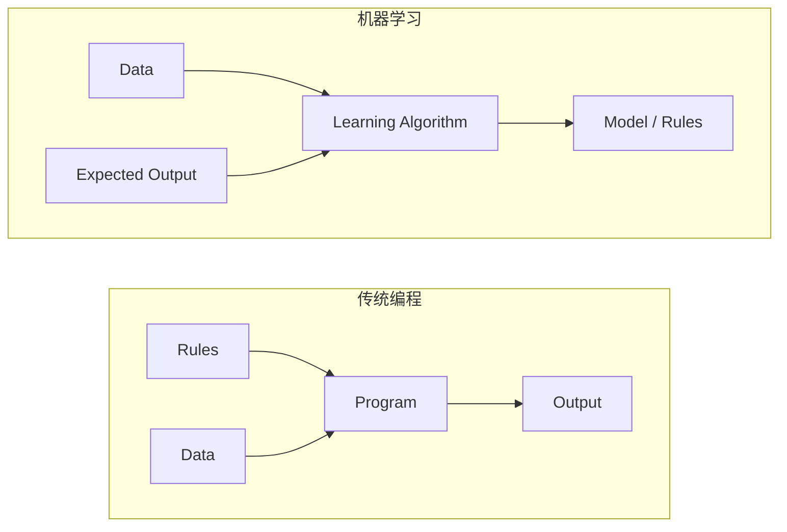
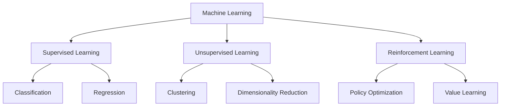
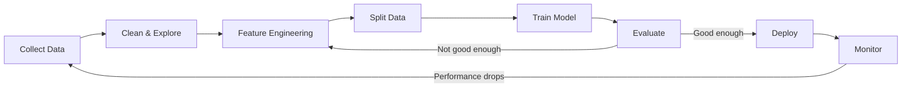
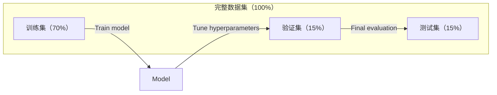
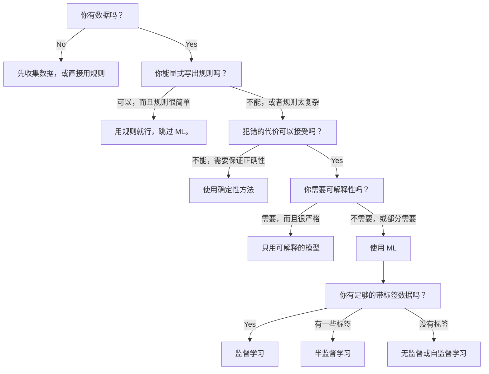

# 什么是机器学习（What Is Machine Learning）

> 机器学习是让计算机从数据中找出模式，而不是靠人手写规则。

**Type:** Learn
**Languages:** Python
**Prerequisites:** Phase 1 (Math Foundations)
**Time:** ~45 minutes

## 学习目标（Learning Objectives）

- 解释监督学习、无监督学习和强化学习之间的区别，并判断给定问题属于哪一类
- 从零实现一个最近质心分类器，并与随机基线进行对比评估
- 区分分类任务和回归任务，并为各自选择合适的损失函数
- 评估某个业务问题是适合用机器学习，还是用确定性规则求解更好

## 问题（The Problem）

你想构建一个垃圾邮件过滤器。传统做法是：坐下来写几百条规则。"如果邮件包含 'FREE MONEY'，就标记为垃圾邮件。如果感叹号超过 3 个，也标记为垃圾邮件。"你花几周写规则。然后垃圾邮件发送者换了措辞，你的规则失效了。你写更多规则。这个循环永无止境。

机器学习把这件事反了过来。你不再手写规则，而是给计算机成千上万封带标签的邮件（"垃圾邮件"或"非垃圾邮件"），让它自己弄清规则。计算机会发现你根本想不到的模式。当垃圾邮件发送者改变策略时，你只需用新数据重新训练，而不用重写代码。

从"编写规则"到"从数据中学习"的这一转变，正是机器学习的核心。每一个推荐引擎、语音助手、自动驾驶汽车和语言模型都是这样工作的。

## 概念（The Concept）

### 从数据中学习，而非手写规则（Learning From Data, Not Rules）

传统编程和机器学习以相反的方向解决问题。



传统编程：规则由你来写。程序把规则应用到数据上，产出输出。

机器学习：你提供数据和期望输出，算法去发现规则。

训练得到的"模型"本身就是规则，只不过被编码成了数字（权重、参数）。它从见过的样本中泛化，对从未见过的数据做出预测。

### 机器学习的三大类型（The Three Types of Machine Learning）



**监督学习（Supervised Learning）**：你拥有输入-输出对，模型学习把输入映射到输出。
- "这里有 10,000 张标注为猫或狗的照片。学会区分它们。"
- "这里有房屋特征和价格。学会预测价格。"

**无监督学习（Unsupervised Learning）**：你只有输入，没有标签，模型自己发现结构。
- "这里有 10,000 条客户购买历史。找出自然的分组。"
- "这里有 1,000 维的数据点。在保留结构的同时降到 2 维。"

**强化学习（Reinforcement Learning）**：智能体（agent）在环境中采取动作并获得奖励或惩罚。它学习一种策略（policy）来最大化总奖励。
- "玩这个游戏。赢了 +1，输了 -1。自己想出策略。"
- "控制这个机械臂。拿起物体 +1，每浪费一秒 -0.01。"

你在实践中构建的东西大多使用监督学习。无监督学习常用于预处理和探索。强化学习则支撑着游戏 AI、机器人技术，以及面向语言模型的 RLHF。

### 三大类型之外（Beyond the Big Three）

上面的三大类划分得很清晰，但现实中的机器学习常常界限模糊。

**半监督学习（semi-supervised learning）**使用少量带标签数据和大量无标签数据。你可能只有 100 张带标签的医学影像，却有 100,000 张无标签影像。常用技术包括：

- **标签传播（label propagation）：**构建一张图把相似的数据点连接起来，标签沿着图从带标签的节点扩散到无标签的邻居。
- **伪标签（pseudo-labeling）：**先用带标签数据训练模型，再用它为无标签数据预测标签，然后用全部数据重新训练。模型自举（bootstraps）出自己的训练集。
- **一致性正则化（consistency regularization）：**模型对一个输入和它的轻微扰动版本应给出相同的预测。即使没有标签，这一方法也有效。

**自监督学习（self-supervised learning）**从数据本身构造监督信号，完全不需要人工标注。模型根据数据的结构给自己创建预测任务。

- **掩码语言建模（BERT）：**遮住句子中 15% 的词，训练模型预测缺失的词。"标签"来自原始文本。
- **对比学习（SimCLR）：**取一张图片，生成两个增强版本，训练模型识别出它们来自同一张图片，并把它们与其他图片的增强版本区分开。
- **下一个词元预测（GPT）：**给定前面所有的词，预测下一个词。每篇文本文档都变成一个训练样本。

它们并不是三大类型之外的独立类别，而是把监督和无监督思想结合起来的策略。自监督学习在技术上属于监督学习（模型确实在预测某个东西），但标签是自动生成的，不是人工给的。

### 分类与回归（Classification vs Regression）

这是监督学习的两大主要任务。

| 方面 | 分类 | 回归 |
|--------|---------------|------------|
| 输出 | 离散类别 | 连续数值 |
| 示例 | "这封邮件是垃圾邮件吗？" | "房价会是多少？" |
| 输出空间 | {猫、狗、鸟} | 任意实数 |
| 损失函数 | 交叉熵、准确率 | 均方误差、MAE |
| 决策 | 类别之间的边界 | 拟合数据的曲线 |

分类回答"属于哪一类？"，回归回答"是多少？"。

有些问题两种方式都可以建模。预测股票涨跌是分类，预测具体价格是回归。

### 机器学习工作流（The ML Workflow）

无论用什么算法，每个机器学习项目都遵循同一条流水线。



**收集数据（Collect Data）**：收集原始数据。数据更多几乎总是更好，但质量比数量更重要。

**清洗与探索（Clean & Explore）**：处理缺失值、去除重复、可视化分布、发现异常。这一步常常占掉整个项目 60-80% 的时间。

**特征工程（Feature Engineering）**：把原始数据转换成模型能用的特征。把日期转换成星期几，对数值列做归一化，对类别变量做编码。好的特征比花哨的算法更重要。

**划分数据（Split Data）**：把数据分成训练集、验证集和测试集。模型在训练数据上训练，你在验证数据上调超参数，最终性能在测试数据上报告。

**训练模型（Train Model）**：把训练数据喂给算法。算法调整内部参数以最小化损失函数。

**评估（Evaluate）**：在验证/测试数据上衡量性能。如果性能不可接受，就回头尝试不同的特征、算法或超参数。

**部署（Deploy）**：把模型投入生产环境，对新数据做出预测。

**监控（Monitor）**：持续跟踪性能。数据分布会变化（数据漂移，data drift），模型会退化。性能下降时就重新训练。

### 训练集、验证集与测试集划分（Training, Validation, and Test Splits）

这是初学者最容易搞错的重要概念。你必须用训练期间从未见过的数据来评估模型，否则你度量的是记忆，而不是学习。



| 划分 | 用途 | 使用时机 | 典型占比 |
|-------|---------|-----------|-------------|
| 训练集 | 模型从这些数据中学习 | 训练期间 | 60-80% |
| 验证集 | 调超参数、比较模型 | 每次训练之后 | 10-20% |
| 测试集 | 最终的无偏性能估计 | 只用一次，最后使用 | 10-20% |

测试集是神圣的。你看它的次数有且只有一次。如果你不断根据测试表现调整模型，你实际上就是在测试集上训练，你报告的数字也就毫无意义。

对于小数据集，使用 k 折交叉验证（k-fold cross-validation）：把数据分成 k 份，用其中 k-1 份训练，用剩下的一份验证，轮换进行，再对结果取平均。

### 过拟合与欠拟合（Overfitting vs Underfitting）


**欠拟合（underfitting）**：模型太简单，捕捉不到数据中的模式。就像用一条直线去拟合弯曲的关系。训练误差高，测试误差也高。

**过拟合（overfitting）**：模型太复杂，把训练数据连同噪声一起背了下来。就像一条扭来扭去的曲线穿过了每个训练点，但在新数据上表现很差。训练误差低，测试误差高。

**良好拟合（good fit）**：模型捕捉到了真实模式，又没有记住噪声。训练误差和测试误差都处于合理的较低水平。

过拟合的迹象：
- 训练准确率远高于验证准确率
- 模型在训练数据上表现很好，在新数据上却很差
- 增加训练数据能提升性能（说明模型是在背数据，而不是在学习）

过拟合的解决办法：
- 获取更多训练数据
- 降低模型复杂度（更少的参数、更简单的结构）
- 正则化（对大权重施加惩罚）
- Dropout（训练时随机把神经元置零）
- 早停（early stopping，当验证误差开始上升时停止训练）

欠拟合的解决办法：
- 使用更复杂的模型
- 增加更多特征
- 减弱正则化
- 训练更久

### 偏差-方差权衡（The Bias-Variance Tradeoff）

这是过拟合与欠拟合背后的数学框架。

**偏差（bias）**：模型假设错误带来的误差。当真实关系是非线性时，线性模型的偏差就很高。高偏差导致欠拟合。

**方差（variance）**：模型对训练数据中小幅波动过于敏感带来的误差。高方差模型在不同数据子集上训练，会给出差别很大的预测。高方差导致过拟合。

| 模型复杂度 | 偏差 | 方差 | 结果 |
|-----------------|------|----------|--------|
| 过低（用线性模型拟合弯曲数据） | 高 | 低 | 欠拟合 |
| 恰到好处 | 中 | 中 | 泛化良好 |
| 过高（用 20 次多项式拟合 10 个点） | 低 | 高 | 过拟合 |

总误差 = 偏差^2 + 方差 + 不可约噪声

不可约噪声无法降低（它是数据本身的随机性）。你要找的是让 bias^2 + variance 最小的那个最佳平衡点。

### 没有免费午餐定理（No Free Lunch Theorem）

没有哪个算法能在所有问题上都表现最好。在一类问题上表现出色的算法，在另一类问题上往往表现不佳。这就是数据科学家要尝试多种算法并比较结果的原因。

在实践中，如何选择取决于：
- 你有多少数据
- 特征有多少
- 关系是线性的还是非线性的
- 你是否需要可解释性
- 你能负担多少算力

### 什么时候不该用机器学习（When NOT to Use Machine Learning）

ML 很强大，但并不总是正确的工具。在伸手拿模型之前，先问问自己是否真的需要它。

**以下情况不要用 ML：**

- **规则简单且定义清晰。**税收计算、排序算法、单位换算。如果几条 if 语句就能写出逻辑，引入模型只会徒增复杂度，毫无好处。
- **你没有数据或数据极少。**ML 需要样本才能学习。只有 10 个数据点时，你训练不出任何有意义的东西。先去收集数据。
- **犯错的代价是灾难性的，而且你需要保证正确。**药物剂量计算、核反应堆控制、密码学验证。ML 模型是概率性的，它们总会偶尔出错。如果"偶尔出错"不可接受，就用确定性方法。
- **一张查找表或启发式规则就能解决问题。**如果简单的阈值或查表就能覆盖 99% 的情况，加上 ML 只会增加维护成本，不会有实质改进。
- **决策无法解释，而可解释性是硬性要求。**受监管行业（借贷、保险、刑事司法）有时要求每个决策都能被完全解释。有些 ML 模型是可解释的（线性回归、小决策树），大多数不是。
- **问题变化的速度比你重新训练还快。**如果规则每天都在变，而重新训练需要一周，那模型永远都是过时的。

用下面这棵决策流程图：



```figure
f3-learning-boundary
```

## 动手构建（Build It）

`code/ml_intro.py` 中的代码从零实现了一个最近质心分类器——这是最简单的 ML 算法。它演示了核心思想：先从数据中学习，再对新数据做预测。

### 第 1 步：从零实现最近质心分类器（Step 1: Nearest Centroid Classifier from Scratch）

最近质心分类器（nearest centroid classifier）计算训练数据中每个类别的中心（均值）。预测时，它把每个新点分配给中心离它最近的那个类。

```python
class NearestCentroid:
    def fit(self, X, y):
        self.classes = np.unique(y)
        self.centroids = np.array([
            X[y == c].mean(axis=0) for c in self.classes
        ])

    def predict(self, X):
        distances = np.array([
            np.sqrt(((X - c) ** 2).sum(axis=1))
            for c in self.centroids
        ])
        return self.classes[distances.argmin(axis=0)]
```

这就是算法的全部。fit 计算两个均值，predict 计算距离。没有梯度下降，没有迭代，没有超参数。

### 第 2 步：在合成数据上训练（Step 2: Train on Synthetic Data）

我们生成一个二维分类数据集，包含两个略微重叠的类别。质心分类器会在两个类别中心之间画出一条线性决策边界（decision boundary）。

```python
rng = np.random.RandomState(42)
X_class0 = rng.randn(100, 2) + np.array([1.0, 1.0])
X_class1 = rng.randn(100, 2) + np.array([-1.0, -1.0])
X = np.vstack([X_class0, X_class1])
y = np.array([0] * 100 + [1] * 100)
```

### 第 3 步：与基线对比（Step 3: Compare Against a Baseline）

每个 ML 模型都应该和一个简单的基线（baseline）做比较。这里的基线随机预测类别。如果你的 ML 模型连随机猜测都赢不了，那一定出了问题。

```python
baseline_preds = rng.choice([0, 1], size=len(y_test))
baseline_acc = np.mean(baseline_preds == y_test)
```

在这个干净的数据集上，质心分类器应该能达到 90% 以上的准确率。随机基线大约是 50%。

### 为什么这很重要（Why This Matters）

最近质心分类器简单到极致：没有超参数，没有迭代，也没有梯度下降。但它捕捉到了 ML 的基本模式：

1. **学习（Learn）**：从训练数据中学到一个表示（representation，即质心）
2. **预测（Predict）**：用这个表示对新数据做预测（最近的距离）
3. **评估（Evaluate）**：与基线（随机猜测）比较

从逻辑回归到 transformer，每一个 ML 算法都遵循同样的三步模式。表示会变得越来越复杂，但工作流始终不变。

### 第 4 步：质心分类器做不到的事（Step 4: What the Centroid Classifier Cannot Do）

最近质心分类器假设每个类别都构成单独的一团，它画出的是线性决策边界。以下情况它会失败：

- 类别有多个簇（例如，数字"1"有好几种不同的写法）
- 决策边界是非线性的（例如，一个类包围着另一个类）
- 特征的量纲差异很大（距离会被量纲最大的特征主导）

这些局限正是你后面要学的每个算法的动机。K 近邻（K-nearest neighbors）能处理多个簇，决策树能处理非线性边界，特征缩放（feature scaling）能解决量纲问题。每一课都建立在前一课的局限之上。

## 直接使用（Use It）

sklearn 提供了 `NearestCentroid` 和合成数据生成器：

```python
from sklearn.neighbors import NearestCentroid
from sklearn.datasets import make_classification
from sklearn.model_selection import train_test_split

X, y = make_classification(
    n_samples=500, n_features=2, n_redundant=0,
    n_clusters_per_class=1, random_state=42
)
X_train, X_test, y_train, y_test = train_test_split(X, y, test_size=0.3)

clf = NearestCentroid()
clf.fit(X_train, y_train)
print(f"Accuracy: {clf.score(X_test, y_test):.3f}")
```

## 发布成果（Ship It）

本课的产出是 `outputs/prompt-ml-problem-framer.md`——一个把模糊的业务问题转化为具体 ML 任务的提示词（prompt）。给它一段问题描述（"我们想减少用户流失"或"预测下季度的需求"），它就会识别学习类型、定义预测目标、列出候选特征、选定成功指标、建立基线，并标记出数据泄露或类别不平衡之类的坑。在任何 ML 项目开始时都用它，可以避免做错方向。

## 关键术语（Key Terms）

| 术语 | 人们常说 | 实际含义 |
|------|----------------|----------------------|
| 模型（Model） | "那个 AI" | 带可学习参数的数学函数，把输入映射为输出 |
| 训练（Training） | "教 AI" | 运行优化算法调整模型参数，使预测逼近已知输出 |
| 特征（Feature） | "一个输入列" | 数据的一个可测量属性，模型用它来做预测 |
| 标签（Label） | "标准答案" | 训练样本的已知输出，用来计算误差信号 |
| 超参数（Hyperparameter） | "你随手调的设置" | 训练前设定的参数，控制学习过程（学习率、层数） |
| 损失函数（Loss function） | "模型有多离谱" | 度量预测输出与真实输出之间差距的函数，训练的目标就是把它最小化 |
| 过拟合（Overfitting） | "把测试背下来了" | 模型学到的是训练数据特有的噪声而非普遍模式，因此在新数据上失败 |
| 欠拟合（Underfitting） | "什么都没学会" | 模型太简单，捕捉不到数据中的真实模式 |
| 泛化（Generalization） | "在新数据上也好使" | 模型在未训练过的数据上做出准确预测的能力 |
| 交叉验证（Cross-validation） | "换不同的块来测" | 反复把数据划分成训练/验证折并取平均，给出更稳健的性能估计 |
| 正则化（Regularization） | "把权重压小" | 在损失函数中加入惩罚项，抑制过于复杂的模型 |
| 数据漂移（Data drift） | "世界变了" | 输入数据的统计分布随时间偏移，导致模型性能退化 |

## 练习（Exercises）

1. 任选一个数据集（例如 Iris、Titanic），按 70/15/15 划分成训练/验证/测试集。解释为什么不该在测试集上调超参数。
2. 列出三个现实世界的问题。对每个问题，判断它属于分类、回归还是聚类，是监督还是无监督。
3. 一个模型在训练数据上有 99% 的准确率，在测试数据上却只有 60%。诊断问题所在，并列出你会尝试的三种修复办法。

## 延伸阅读（Further Reading）

- [An Introduction to Statistical Learning](https://www.statlearning.com/) ——免费教材，覆盖所有经典 ML 方法，并配有实用例子
- [Google 机器学习速成课程](https://developers.google.com/machine-learning/crash-course) ——简明的 ML 概念可视化入门
- [scikit-learn 用户指南](https://scikit-learn.org/stable/user_guide.html) ——用 Python 实现 ML 的实用参考
