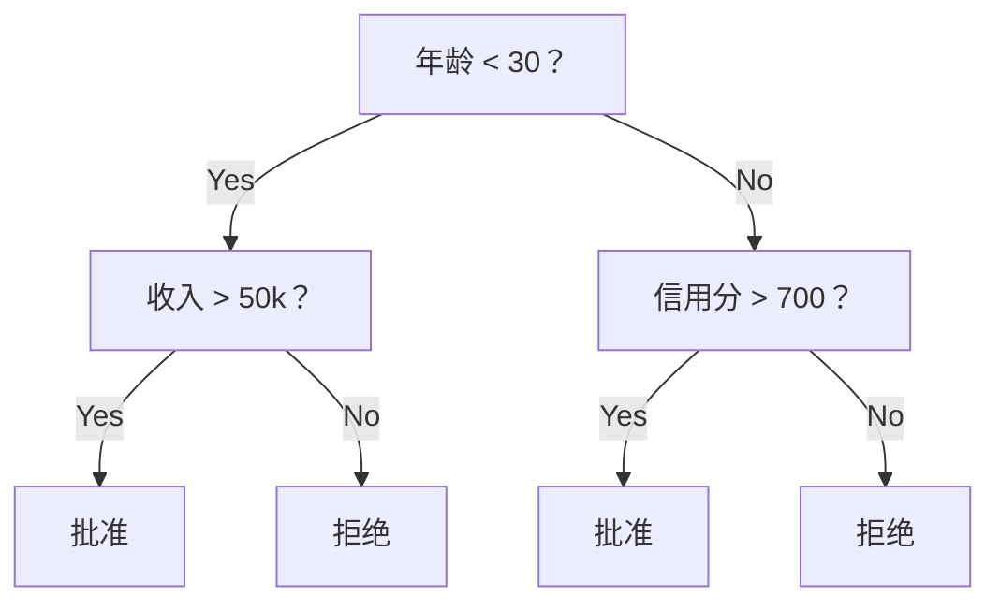
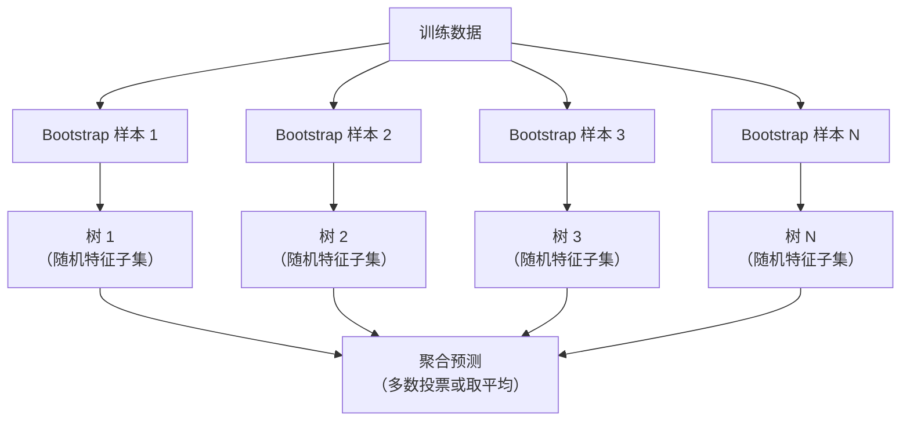

# 决策树与随机森林（Decision Trees and Random Forests）

> 决策树就是一张流程图。但一片由它们组成的森林，是 ML 中最强大的工具之一。

**Type:** Build
**Language:** Python
**Prerequisites:** Phase 1 (Lessons 09 Information Theory, 06 Probability)
**Time:** ~90 minutes

## 学习目标（Learning Objectives）

- 实现基尼不纯度（Gini impurity）、熵（entropy）和信息增益（information gain）的计算，找出最优的决策树分裂
- 从零构建带预剪枝控制（最大深度、最小样本数）的决策树分类器
- 使用 bootstrap 采样和特征随机化构建随机森林，并解释它为什么能降低方差
- 比较 MDI 特征重要性与置换重要性（permutation importance），并识别 MDI 何时有偏

## 问题（The Problem）

你有一份表格数据。行是样本，列是特征，还有一个你想预测的目标列。你可以直接上神经网络。但对表格数据来说，基于树的模型（决策树、随机森林、梯度提升树）始终胜过深度学习。结构化数据的 Kaggle 竞赛被 XGBoost 和 LightGBM 主宰，而不是 transformer。

为什么？树能不经预处理就处理混合特征类型（数值和类别），不需要特征工程就能处理非线性关系，而且可解释：你可以直接看着这棵树，弄清预测到底是为什么做出的。而平均了许多棵树的随机森林，在中等规模数据集上非常抗过拟合。

本课用递归分裂从零构建决策树，然后在上面构建随机森林。你将实现分裂准则背后的数学（基尼不纯度、熵、信息增益），并理解为什么弱学习器的集成会变成强学习器。

## 概念（The Concept）

### 决策树在做什么（What a decision tree does）

决策树通过问一连串是非问题，把特征空间划分成一个个矩形区域。



每个内部节点把某个特征与一个阈值做比较，每个叶节点给出一个预测。要分类一个新数据点，从根出发沿着分支走，直到到达叶子。

树是自顶向下构建的：在每个节点上选择最能分开数据的特征和阈值。"最好"由分裂准则来定义。

### 分裂准则：度量不纯度（Split criteria: measuring impurity）

每个节点上有一批样本。我们希望把它们分开，让得到的子节点尽可能"纯"，也就是每个子节点几乎只包含一个类别。

**基尼不纯度（Gini impurity）**度量的是：如果按照该节点的类别分布随机给样本贴标签，一个随机抽到的样本会被分错的概率。

```
Gini(S) = 1 - sum(p_k^2)

where p_k is the proportion of class k in set S.
```

纯节点（全是一个类）的 Gini 为 0。对 50/50 的二类分裂，Gini 为 0.5。越低越好。

```
Example: 6 cats, 4 dogs

Gini = 1 - (0.6^2 + 0.4^2) = 1 - (0.36 + 0.16) = 0.48
```

**熵（Entropy）**度量节点中的信息量（混乱程度）。第 1 阶段第 09 课讲过。

```
Entropy(S) = -sum(p_k * log2(p_k))
```

纯节点的熵为 0。对 50/50 的二类分裂，熵为 1.0。越低越好。

```
Example: 6 cats, 4 dogs

Entropy = -(0.6 * log2(0.6) + 0.4 * log2(0.4))
        = -(0.6 * -0.737 + 0.4 * -1.322)
        = 0.442 + 0.529
        = 0.971 bits
```

**信息增益（Information gain）**是分裂之后不纯度（熵或基尼）的下降量。

```
IG(S, feature, threshold) = Impurity(S) - weighted_avg(Impurity(S_left), Impurity(S_right))

where the weights are the proportions of samples in each child.
```

每个节点上的贪心算法：尝试每个特征和每个可能的阈值，选出使信息增益最大的（特征，阈值）对。

### 分裂是如何进行的（How splitting works）

对当前节点上有 n 个特征、m 个样本的数据集：

1. 对每个特征 j（j 从 1 到 n）：
   - 按特征 j 对样本排序
   - 把相邻不同取值之间的每个中点都当作阈值试一遍
   - 为每个阈值计算信息增益
2. 选出信息增益最高的特征和阈值
3. 把数据分成左（特征 <= 阈值）右（特征 > 阈值）两份
4. 对每个子节点递归

这种贪心方法不保证得到全局最优的树。找最优树是 NP-hard 问题。但贪心分裂在实践中效果很好。

### 停止条件（Stopping conditions）

没有停止条件的话，树会一直长到每个叶子都纯（每个叶子一个样本）。这样它完美记住了训练数据，泛化却一塌糊涂。

**预剪枝（pre-pruning）**在树完全长成之前就让它停下：
- 最大深度：树达到设定深度时停止分裂
- 叶子最小样本数：节点样本少于 k 时停止
- 最小信息增益：最佳分裂对不纯度的改善小于阈值时停止
- 最大叶子数：限制叶子的总数

**后剪枝（post-pruning）**先长出完整的树，再往回修剪：
- 代价复杂度剪枝（scikit-learn 使用）：加入与叶子数成正比的惩罚。加大惩罚就得到更小的树
- 降低错误剪枝：如果验证误差不增加，就移除子树

预剪枝更简单、更快。后剪枝往往能产生更好的树，因为它不会过早终止那些本来可能引出更多有用分裂的分裂。

### 用于回归的决策树（Decision trees for regression）

用于回归时，叶子的预测是该叶子中目标值的均值。分裂准则也相应改变：

**方差缩减（variance reduction）**取代信息增益：

```
VR(S, feature, threshold) = Var(S) - weighted_avg(Var(S_left), Var(S_right))
```

选择让方差缩减最多的分裂。树把输入空间分成若干区域，并在每个区域内预测一个常数（均值）。

### 随机森林：集成的力量（Random forests: the power of ensembles）

单棵决策树是高方差的。数据的一点小变化就可能产生完全不同的树。随机森林通过平均许多棵树来解决这个问题。



两个随机性来源让树彼此多样：

**Bagging（bootstrap aggregating）：**每棵树都在一个 bootstrap 样本上训练——即从训练数据中有放回地随机抽取的样本。大约 63% 的原始样本会出现在每个 bootstrap 样本中（其余的是袋外（out-of-bag）样本，可用于验证）。

**特征随机化：**每次分裂只考虑随机的一个特征子集。分类的默认值是 sqrt(n_features)，回归是 n_features/3。这防止所有树都在同一个主导特征上分裂。

关键洞察：平均许多互不相关的树可以在不增加偏差的情况下降低方差。每棵单独的树可能平平无奇，但集成在一起就很强。

### 特征重要性（Feature importance）

随机森林天然提供特征重要性分数。最常用的方法：

**不纯度平均下降（Mean Decrease in Impurity，MDI）：**对每个特征，把该特征在所有树、所有节点上带来的不纯度下降总量加起来。在较早的分裂中带来更大不纯度下降的特征更重要。

```
importance(feature_j) = sum over all nodes where feature_j is used:
    (n_samples_at_node / n_total_samples) * impurity_decrease
```

它很快（训练期间顺带算出），但偏向高基数特征以及可能分裂点多的特征。

**置换重要性（Permutation importance）**是另一种办法：打乱某个特征的取值，度量模型准确率下降多少。更可靠，但更慢。

### 什么时候树胜过神经网络（When trees beat neural networks）

在表格数据上，树和森林压制神经网络。原因有几个：

| 因素 | 树模型 | 神经网络 |
|--------|-------|----------------|
| 混合类型（数值 + 类别） | 原生支持 | 需要编码 |
| 小数据集（< 10k 行） | 表现良好 | 过拟合 |
| 特征交互 | 通过分裂发现 | 需要设计架构 |
| 可解释性 | 完全透明 | 黑盒 |
| 训练时间 | 分钟级 | 小时级 |
| 超参数敏感度 | 低 | 高 |

当数据具有空间或序列结构（图像、文本、音频）时，神经网络赢。对扁平的特征表格，树是默认选择。

```figure
decision-tree-depth
```

## 动手构建（Build It）

### 第 1 步：基尼不纯度与熵（Step 1: Gini impurity and entropy）

从零实现这两种分裂准则，并验证它们对"哪些分裂是好的"判断一致。

```python
import math

def gini_impurity(labels):
    n = len(labels)
    if n == 0:
        return 0.0
    counts = {}
    for label in labels:
        counts[label] = counts.get(label, 0) + 1
    return 1.0 - sum((c / n) ** 2 for c in counts.values())

def entropy(labels):
    n = len(labels)
    if n == 0:
        return 0.0
    counts = {}
    for label in labels:
        counts[label] = counts.get(label, 0) + 1
    return -sum(
        (c / n) * math.log2(c / n) for c in counts.values() if c > 0
    )
```

### 第 2 步：找出最佳分裂（Step 2: Find the best split）

尝试每个特征和每个阈值，返回信息增益最高的那个。

```python
def information_gain(parent_labels, left_labels, right_labels, criterion="gini"):
    measure = gini_impurity if criterion == "gini" else entropy
    n = len(parent_labels)
    n_left = len(left_labels)
    n_right = len(right_labels)
    if n_left == 0 or n_right == 0:
        return 0.0
    parent_impurity = measure(parent_labels)
    child_impurity = (
        (n_left / n) * measure(left_labels) +
        (n_right / n) * measure(right_labels)
    )
    return parent_impurity - child_impurity
```

### 第 3 步：构建 DecisionTree 类（Step 3: Build the DecisionTree class）

递归分裂、预测和特征重要性跟踪。`_build` 是树的心脏：节点纯了或者触发预剪枝限制就停，否则取最佳分裂并对两个子节点递归。

```python
import random

class DecisionTree:
    def __init__(self, max_depth=None, min_samples_split=2,
                 min_samples_leaf=1, criterion="gini",
                 max_features=None):
        self.max_depth = max_depth
        self.min_samples_split = min_samples_split
        self.min_samples_leaf = min_samples_leaf
        self.criterion = criterion
        self.max_features = max_features
        self.tree = None
        self.feature_importances_ = None

    def fit(self, X, y):
        self.n_features = len(X[0])
        self.feature_importances_ = [0.0] * self.n_features
        self.n_samples = len(X)
        self.tree = self._build(X, y, depth=0)
        total = sum(self.feature_importances_)
        if total > 0:
            self.feature_importances_ = [
                fi / total for fi in self.feature_importances_
            ]

    def predict(self, X):
        return [self._predict_one(x, self.tree) for x in X]

    def _build(self, X, y, depth):
        if len(set(y)) == 1:
            return {"leaf": True, "value": y[0]}

        if self.max_depth is not None and depth >= self.max_depth:
            return self._make_leaf(y)

        if len(y) < self.min_samples_split:
            return self._make_leaf(y)

        best_feature, best_threshold, best_gain = self._best_split(X, y)

        if best_feature is None or best_gain <= 0:
            return self._make_leaf(y)

        left_X, left_y, right_X, right_y = self._split_data(
            X, y, best_feature, best_threshold
        )

        if len(left_y) < self.min_samples_leaf or len(right_y) < self.min_samples_leaf:
            return self._make_leaf(y)

        weight = len(y) / self.n_samples
        self.feature_importances_[best_feature] += weight * best_gain

        return {
            "leaf": False,
            "feature": best_feature,
            "threshold": best_threshold,
            "left": self._build(left_X, left_y, depth + 1),
            "right": self._build(right_X, right_y, depth + 1),
        }

    def _make_leaf(self, y):
        counts = {}
        for label in y:
            counts[label] = counts.get(label, 0) + 1
        return {"leaf": True, "value": max(counts, key=counts.get)}

    def _best_split(self, X, y):
        best_feature = None
        best_threshold = None
        best_gain = -1.0

        if self.max_features == "sqrt":
            k = max(1, int(math.sqrt(self.n_features)))
            feature_indices = random.sample(range(self.n_features), k)
        elif isinstance(self.max_features, int):
            if self.max_features < 1:
                raise ValueError("max_features must be at least 1 when given as an integer")
            k = min(self.max_features, self.n_features)
            feature_indices = random.sample(range(self.n_features), k)
        else:
            feature_indices = list(range(self.n_features))

        for feature_idx in feature_indices:
            values = sorted(set(X[i][feature_idx] for i in range(len(X))))
            if len(values) <= 1:
                continue

            for i in range(len(values) - 1):
                threshold = (values[i] + values[i + 1]) / 2.0
                left_y = [y[j] for j in range(len(X)) if X[j][feature_idx] <= threshold]
                right_y = [y[j] for j in range(len(X)) if X[j][feature_idx] > threshold]

                if len(left_y) < self.min_samples_leaf or len(right_y) < self.min_samples_leaf:
                    continue

                gain = information_gain(y, left_y, right_y, self.criterion)
                if gain > best_gain:
                    best_gain = gain
                    best_feature = feature_idx
                    best_threshold = threshold

        return best_feature, best_threshold, best_gain

    def _split_data(self, X, y, feature, threshold):
        left_X, left_y, right_X, right_y = [], [], [], []
        for i in range(len(X)):
            if X[i][feature] <= threshold:
                left_X.append(X[i])
                left_y.append(y[i])
            else:
                right_X.append(X[i])
                right_y.append(y[i])
        return left_X, left_y, right_X, right_y

    def _predict_one(self, x, node):
        if node["leaf"]:
            return node["value"]
        if x[node["feature"]] <= node["threshold"]:
            return self._predict_one(x, node["left"])
        return self._predict_one(x, node["right"])
```

### 第 4 步：构建 RandomForest 类（Step 4: Build the RandomForest class）

Bootstrap 采样、特征随机化和多数投票。

```python
class RandomForest:
    def __init__(self, n_trees=100, max_depth=None,
                 min_samples_split=2, max_features="sqrt",
                 criterion="gini"):
        self.n_trees = n_trees
        self.max_depth = max_depth
        self.min_samples_split = min_samples_split
        self.max_features = max_features
        self.criterion = criterion
        self.trees = []

    def fit(self, X, y):
        n = len(X)
        for _ in range(self.n_trees):
            indices = [random.randint(0, n - 1) for _ in range(n)]
            X_boot = [X[i] for i in indices]
            y_boot = [y[i] for i in indices]
            tree = DecisionTree(
                max_depth=self.max_depth,
                min_samples_split=self.min_samples_split,
                max_features=self.max_features,
                criterion=self.criterion,
            )
            tree.fit(X_boot, y_boot)
            self.trees.append(tree)

    def predict(self, X):
        all_preds = [tree.predict(X) for tree in self.trees]
        predictions = []
        for i in range(len(X)):
            votes = {}
            for preds in all_preds:
                v = preds[i]
                votes[v] = votes.get(v, 0) + 1
            predictions.append(max(votes, key=votes.get))
        return predictions
```

完整实现和所有辅助方法见 `code/trees.py`。

## 直接使用（Use It）

用 scikit-learn 训练随机森林只要三行：

```python
from sklearn.ensemble import RandomForestClassifier
from sklearn.datasets import load_iris
from sklearn.model_selection import train_test_split

X, y = load_iris(return_X_y=True)
X_train, X_test, y_train, y_test = train_test_split(X, y, random_state=42)

rf = RandomForestClassifier(n_estimators=100, random_state=42)
rf.fit(X_train, y_train)
print(f"Accuracy: {rf.score(X_test, y_test):.4f}")
print(f"Feature importances: {rf.feature_importances_}")
```

实践中，梯度提升树（XGBoost、LightGBM、CatBoost）往往比随机森林更强，因为它们按顺序构建树，每棵树都在纠正前面树的错误。但随机森林更不容易被配错，而且几乎不需要调超参数。

## 发布成果（Ship It）

本课的产出是 `outputs/prompt-tree-interpreter.md`——一个为业务干系人解读决策树分裂的提示词。把训练好的树的结构（深度、特征、分裂阈值、准确率）喂给它，它会把模型翻译成大白话规则、给特征重要性排序、标记过拟合或数据泄露，并推荐下一步行动。每当你需要向不读代码的人解释树模型时，都用它。

## 练习（Exercises）

1. 在一个 3 类的二维数据集上训练单棵决策树。手动追踪分裂并画出矩形的决策边界。比较 max_depth=2 和 max_depth=10 时的边界。

2. 为回归树实现方差缩减分裂。用 200 个点生成 y = sin(x) + noise，拟合你的回归树。把树的分段常数预测与真实曲线画在一起。

3. 构建分别含 1、5、10、50、200 棵树的随机森林。画出训练准确率和测试准确率随树数量的变化。观察测试准确率会趋于平稳但不会下降（森林抗过拟合）。

4. 在 5 个不同的数据集上比较基尼不纯度与熵这两种分裂准则。测量准确率和树的深度。大多数情况下，两者的结果几乎一样。解释为什么。

5. 实现置换重要性。在一个某个特征是纯随机噪声但基数很高的数据集上，把它与 MDI 重要性做比较。MDI 会把噪声特征排得很高，置换重要性则不会。

## 关键术语（Key Terms）

| 术语 | 人们常说 | 实际含义 |
|------|----------------|----------------------|
| 决策树（Decision tree） | "会做预测的流程图" | 通过学习一串 if/else 分裂，把特征空间划分成矩形区域的模型 |
| 基尼不纯度（Gini impurity） | "节点有多混杂" | 在一个节点上随机分错一个样本的概率。0 = 纯，二类情形 0.5 = 最大不纯度 |
| 熵（Entropy） | "节点的混乱程度" | 节点的信息量。0 = 纯，二类情形 1.0 = 最大不确定性。来自信息论 |
| 信息增益（Information gain） | "分裂有多好" | 分裂后不纯度的下降量。贪心选择分裂的准则 |
| 预剪枝（Pre-pruning） | "让树早点停" | 通过设置最大深度、最小样本数或最小增益阈值，提前停止树的生长 |
| 后剪枝（Post-pruning） | "长完再修剪" | 先长出完整的树，再移除不能提升验证表现的子树 |
| Bagging | "在随机子集上训练" | Bootstrap aggregating。每个模型在不同的有放回随机样本上训练 |
| 随机森林（Random forest） | "一堆树" | 决策树集成，每棵树在 bootstrap 样本上训练，且每次分裂只用随机特征子集 |
| 特征重要性（Feature importance，MDI） | "哪些特征重要" | 每个特征带来的不纯度下降总量，在所有树和节点上求和 |
| 置换重要性（Permutation importance） | "打乱看看" | 随机打乱某个特征的取值后准确率下降多少。对噪声特征比 MDI 更可靠 |
| 方差缩减（Variance reduction） | "信息增益的回归版" | 信息增益在回归树上的对应物。选择让目标方差下降最多的分裂 |
| Bootstrap 样本（Bootstrap sample） | "带重复的随机样本" | 从原始数据集有放回抽取的随机样本。大小相同，但有重复 |

## 延伸阅读（Further Reading）

- [Breiman: Random Forests (2001)](https://link.springer.com/article/10.1023/A:1010933404324) ——随机森林的原始论文
- [Grinsztajn et al.: Why do tree-based models still outperform deep learning on tabular data? (2022)](https://arxiv.org/abs/2207.08815) ——在表格任务上对树与神经网络的严格比较
- [scikit-learn Decision Trees 文档](https://scikit-learn.org/stable/modules/tree.html) ——带可视化工具的实用指南
- [XGBoost: A Scalable Tree Boosting System (Chen & Guestrin, 2016)](https://arxiv.org/abs/1603.02754) ——称霸 Kaggle 的梯度提升论文
