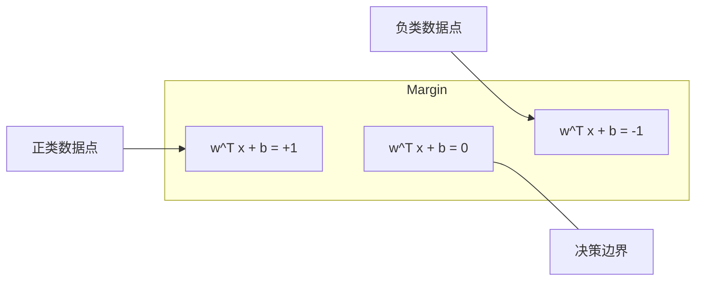
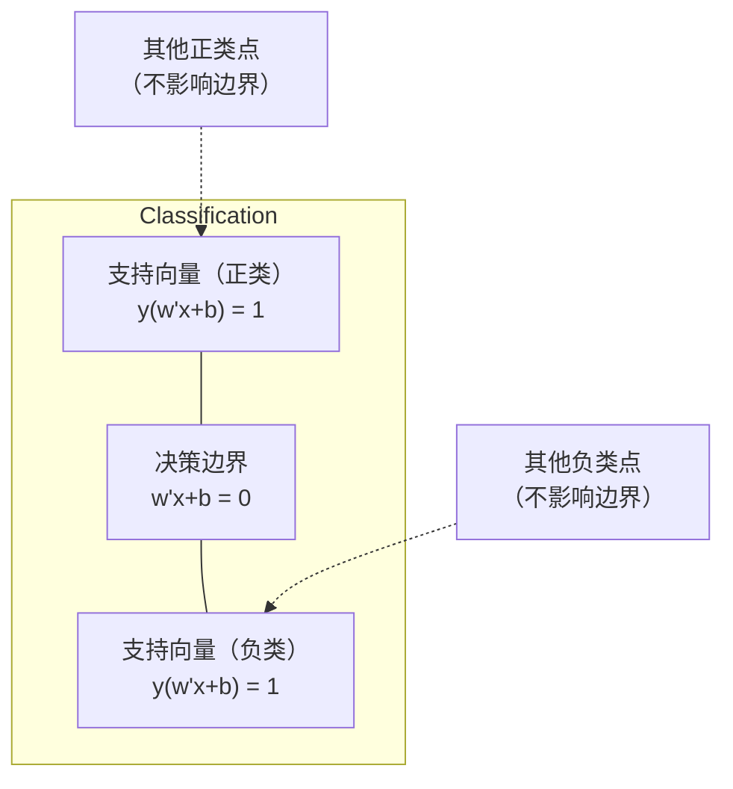
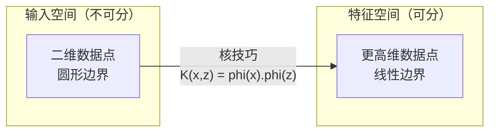

# 支持向量机（Support Vector Machines）

> 在两个类别之间找出最宽的"街道"。这就是全部思想。

**Type:** Build
**Language:** Python
**Prerequisites:** Phase 1 (Lessons 08 Optimization, 14 Norms and Distances, 18 Convex Optimization)
**Time:** ~90 minutes

## 学习目标（Learning Objectives）

- 使用合页损失（hinge loss）和梯度下降（gradient descent），基于原始形式（primal formulation）从零实现线性 SVM
- 解释最大间隔（maximum margin）原理，并从训练好的模型中识别支持向量（support vector）
- 比较线性核、多项式核与 RBF 核，并解释核技巧（kernel trick）如何避免显式的高维映射
- 评估 C 参数在间隔宽度与分类错误之间控制的权衡

## 问题（The Problem）

你有两类数据点，需要画一条直线（或超平面）把它们分开。可行的直线有无数条，你该选哪一条？

间隔（margin）最大的那一条。间隔是决策边界与两侧最近数据点之间的距离。间隔越宽，分类器越有信心，对未见数据的泛化能力也越强。

这一直觉引出了支持向量机（SVM）——机器学习中数学上最优雅的算法之一。在深度学习兴起之前，SVM 曾是主流的分类方法；而对于小数据集、高维数据，以及那些需要一个原理清晰、有理论保证的模型的问题，它至今仍是最优选择。

SVM 与第 1 阶段的内容直接相连：优化问题是凸的（第 18 课），间隔用范数（norm）来度量（第 14 课），而核技巧则利用点积处理非线性边界，完全无需在高维空间中进行计算。

## 核心概念（The Concept）

### 最大间隔分类器（The maximum margin classifier）

给定线性可分的数据，标签 y_i 取值于 {-1, +1}，特征向量为 x_i，我们希望找到一个超平面 w^T x + b = 0 把两类分开。

点 x_i 到超平面的距离为：

```
distance = |w^T x_i + b| / ||w||
```

对于被正确分类的点：y_i * (w^T x_i + b) > 0。间隔是超平面到任一侧最近点距离的两倍。



优化问题为：

```
maximize    2 / ||w||     (the margin width)
subject to  y_i * (w^T x_i + b) >= 1  for all i
```

等价形式（最小化 ||w||^2 更容易优化）：

```
minimize    (1/2) ||w||^2
subject to  y_i * (w^T x_i + b) >= 1  for all i
```

这是一个凸二次规划（convex quadratic program），具有唯一的全局解。恰好落在间隔边界上（即 y_i * (w^T x_i + b) = 1）的数据点就是支持向量。它们是唯一决定决策边界的点。移动或删除任何非支持向量的点，边界都不会改变。

### 支持向量：关键的少数（Support vectors: the critical few）



大多数训练点都无关紧要，只有支持向量才重要。这正是 SVM 在预测时节省内存的原因：你只需要存储支持向量，而不必存储整个训练集。

支持向量的数量还能给出泛化误差的一个界。相对于数据集规模，支持向量越少，泛化越好。

### 软间隔：用 C 参数处理噪声（Soft margin: handling noise with the C parameter）

真实数据很少能被完美分开。有些点可能落在边界的错误一侧，或者落在间隔内部。软间隔（soft margin）形式通过引入松弛变量（slack variable）来允许这种违反。

```
minimize    (1/2) ||w||^2 + C * sum(xi_i)
subject to  y_i * (w^T x_i + b) >= 1 - xi_i
            xi_i >= 0  for all i
```

松弛变量 xi_i 度量第 i 个点对间隔的违反程度。C 控制二者的权衡：

| C 取值 | 行为 |
|---------|----------|
| 大 C | 对违反项惩罚很重。间隔窄，误分类少。过拟合 |
| 小 C | 允许更多违反。间隔宽，误分类多。欠拟合 |

C 相当于反过来的正则化强度：C 大 = 正则化更少，C 小 = 正则化更多。

### 合页损失：SVM 的损失函数（Hinge loss: the SVM loss function）

软间隔 SVM 可以改写为无约束优化：

```
minimize    (1/2) ||w||^2 + C * sum(max(0, 1 - y_i * (w^T x_i + b)))
```

项 max(0, 1 - y_i * f(x_i)) 就是合页损失。当点被正确分类且超出间隔时它为零；当点落在间隔内或被误分类时它呈线性。

```
Hinge loss for a single point:

loss
  |
  | \
  |  \
  |   \
  |    \
  |     \_______________
  |
  +-----|-----|-------->  y * f(x)
       0     1

Zero loss when y*f(x) >= 1 (correctly classified, outside margin).
Linear penalty when y*f(x) < 1.
```

对比逻辑损失（logistic regression 所用的损失）：

```
Hinge:     max(0, 1 - y*f(x))          Hard cutoff at margin
Logistic:  log(1 + exp(-y*f(x)))        Smooth, never exactly zero
```

合页损失产生稀疏解（只有支持向量有非零贡献），而逻辑损失会用到所有数据点。这使得 SVM 在预测时更节省内存。

### 用梯度下降训练线性 SVM（Training a linear SVM with gradient descent）

你可以在合页损失加 L2 正则化的目标上用梯度下降训练线性 SVM，而无需求解带约束的 QP：

```
L(w, b) = (lambda/2) * ||w||^2 + (1/n) * sum(max(0, 1 - y_i * (w^T x_i + b)))

Gradient with respect to w:
  If y_i * (w^T x_i + b) >= 1:  dL/dw = lambda * w
  If y_i * (w^T x_i + b) < 1:   dL/dw = lambda * w - y_i * x_i

Gradient with respect to b:
  If y_i * (w^T x_i + b) >= 1:  dL/db = 0
  If y_i * (w^T x_i + b) < 1:   dL/db = -y_i
```

这称为原始形式（primal formulation）。每个 epoch 的复杂度为 O(n * d)，其中 n 是样本数，d 是特征数。对于大规模、稀疏、高维的数据（文本分类），这非常快。

### 对偶形式与核技巧（The dual formulation and the kernel trick）

SVM 问题的拉格朗日对偶（lagrangian dual，见第 1 阶段第 18 课的 KKT 条件）为：

```
maximize    sum(alpha_i) - (1/2) * sum_ij(alpha_i * alpha_j * y_i * y_j * (x_i . x_j))
subject to  0 <= alpha_i <= C
            sum(alpha_i * y_i) = 0
```

对偶形式只涉及数据点之间的点积 x_i . x_j。这就是关键洞察：把每个点积替换成核函数（kernel function）K(x_i, x_j)，SVM 就能学习非线性边界，而完全无需显式计算那个变换。

```
Linear kernel:      K(x, z) = x . z
Polynomial kernel:  K(x, z) = (x . z + c)^d
RBF (Gaussian):     K(x, z) = exp(-gamma * ||x - z||^2)
```

RBF 核把数据映射到一个无穷维空间。输入空间中相近的点核值接近 1，相距很远的点核值接近 0。它能学习任意平滑的决策边界。



核技巧在高维空间中计算点积，却从不需要真正进入那个空间。对于 D 维数据上次数为 d 的多项式核，显式特征空间有 O(D^d) 维，但计算 K(x, z) 只需 O(D) 时间。

### 用于回归的 SVM：SVR（SVM for regression (SVR)）

支持向量回归（Support Vector Regression, SVR）在数据周围拟合一个宽度为 epsilon 的"管道"。管道内的点损失为零，管道外的点受到线性惩罚。

```
minimize    (1/2) ||w||^2 + C * sum(xi_i + xi_i*)
subject to  y_i - (w^T x_i + b) <= epsilon + xi_i
            (w^T x_i + b) - y_i <= epsilon + xi_i*
            xi_i, xi_i* >= 0
```

epsilon 参数控制管道宽度。管道越宽 = 支持向量越少 = 拟合越平滑；管道越窄 = 支持向量越多 = 拟合越紧。

### 为什么 SVM 输给了深度学习（以及它们何时仍然占优）（Why SVMs lost to deep learning (and when they still win)）

从 20 世纪 90 年代末到 2010 年代初，SVM 一直主导着机器学习。深度学习超越它的原因有以下几点：

| 因素 | SVM | 深度学习 |
|--------|------|---------------|
| 特征工程 | 需要人工设计 | 自动学习特征 |
| 可扩展性 | 核方法为 O(n^2) 到 O(n^3) | 使用 SGD 时每个 epoch 为 O(n) |
| 图像/文本/音频 | 需要手工特征 | 从原始数据学习 |
| 大型数据集（>10 万样本） | 慢 | 扩展性良好 |
| GPU 加速 | 收益有限 | 提速巨大 |

SVM 在以下情形中仍然占优：
- 小数据集（几百到几千个样本）
- 高维稀疏数据（带 TF-IDF 特征的文本）
- 需要数学保证（间隔界）时
- 训练时间必须极短时（线性 SVM 非常快）
- 具有清晰间隔结构的二分类问题
- 异常检测（单类 SVM，one-class SVM）

```figure
svm-margin
```

## 动手实现（Build It）

### 第 1 步：合页损失与梯度（Step 1: Hinge loss and gradient）

基础部分：为一个批次计算合页损失及其梯度。

```python
def hinge_loss(X, y, w, b):
    n = len(X)
    total_loss = 0.0
    for i in range(n):
        margin = y[i] * (dot(w, X[i]) + b)
        total_loss += max(0.0, 1.0 - margin)
    return total_loss / n
```

### 第 2 步：用梯度下降训练线性 SVM（Step 2: Linear SVM via gradient descent）

通过最小化带正则化的合页损失来训练，不需要 QP 求解器。

```python
class LinearSVM:
    def __init__(self, lr=0.001, lambda_param=0.01, n_epochs=1000):
        self.lr = lr
        self.lambda_param = lambda_param
        self.n_epochs = n_epochs
        self.w = None
        self.b = 0.0

    def fit(self, X, y):
        n_features = len(X[0])
        self.w = [0.0] * n_features
        self.b = 0.0

        for epoch in range(self.n_epochs):
            for i in range(len(X)):
                margin = y[i] * (dot(self.w, X[i]) + self.b)
                if margin >= 1:
                    self.w = [wj - self.lr * self.lambda_param * wj
                              for wj in self.w]
                else:
                    self.w = [wj - self.lr * (self.lambda_param * wj - y[i] * X[i][j])
                              for j, wj in enumerate(self.w)]
                    self.b -= self.lr * (-y[i])

    def predict(self, X):
        return [1 if dot(self.w, x) + self.b >= 0 else -1 for x in X]
```

### 第 3 步：核函数（Step 3: Kernel functions）

实现线性核、多项式核和 RBF 核。

```python
def linear_kernel(x, z):
    return dot(x, z)

def polynomial_kernel(x, z, degree=3, c=1.0):
    return (dot(x, z) + c) ** degree

def rbf_kernel(x, z, gamma=0.5):
    diff = [xi - zi for xi, zi in zip(x, z)]
    return math.exp(-gamma * dot(diff, diff))
```

### 第 4 步：间隔与支持向量识别（Step 4: Margin and support vector identification）

训练完成后，找出哪些点是支持向量，并计算间隔宽度。

```python
def find_support_vectors(X, y, w, b, tol=1e-3):
    support_vectors = []
    for i in range(len(X)):
        margin = y[i] * (dot(w, X[i]) + b)
        if abs(margin - 1.0) < tol:
            support_vectors.append(i)
    return support_vectors
```

完整实现和所有演示见 `code/svm.py`。

## 直接使用（Use It）

使用 scikit-learn：

```python
from sklearn.svm import SVC, LinearSVC, SVR
from sklearn.preprocessing import StandardScaler
from sklearn.pipeline import Pipeline

clf = Pipeline([
    ("scaler", StandardScaler()),
    ("svm", SVC(kernel="rbf", C=1.0, gamma="scale")),
])
clf.fit(X_train, y_train)
print(f"Accuracy: {clf.score(X_test, y_test):.4f}")
print(f"Support vectors: {clf['svm'].n_support_}")
```

重要提示：训练 SVM 之前一定要先缩放特征。SVM 对特征的量级很敏感，因为间隔取决于 ||w||，而未缩放的特征会扭曲几何结构。

对于大型数据集，请使用 `LinearSVC`（原始形式，每个 epoch O(n)），而不是 `SVC`（对偶形式，O(n^2) 到 O(n^3)）：

```python
from sklearn.svm import LinearSVC

clf = Pipeline([
    ("scaler", StandardScaler()),
    ("svm", LinearSVC(C=1.0, max_iter=10000)),
])
```

## 练习（Exercises）

1. 生成一个二维线性可分数据集。训练你的 LinearSVM 并找出支持向量。验证支持向量正是最靠近决策边界的那些点。

2. 在一个带噪声的数据集上把 C 从 0.001 变到 1000。为每个 C 值画出决策边界。观察从宽间隔（欠拟合）到窄间隔（过拟合）的转变。

3. 构造一个类别边界为圆形（而非线性）的数据集。证明线性 SVM 会失败。计算 RBF 核矩阵，并展示两类在核诱导的特征空间中变得可分。

4. 在同一数据集上比较合页损失与逻辑损失。分别训练一个线性 SVM 和一个逻辑回归。统计每个模型的决策边界由多少训练点决定（支持向量与全部点）。

5. 实现 SVR（epsilon-不敏感损失）。用它拟合 y = sin(x) + noise。画出围绕预测的 epsilon 管道，并标出支持向量（管道外的点）。

## 关键术语（Key Terms）

| 术语 | 实际含义 |
|------|----------------------|
| 支持向量 | 最靠近决策边界的训练点。唯一决定超平面的点 |
| 间隔 | 决策边界与最近支持向量之间的距离。SVM 最大化这个量 |
| 合页损失 | max(0, 1 - y*f(x))。正确分类且在间隔外时为零，否则为线性惩罚 |
| C 参数 | 间隔宽度与分类错误之间的权衡。C 大 = 间隔窄，C 小 = 间隔宽 |
| 软间隔 | 通过松弛变量允许违反间隔的 SVM 形式。可处理不可分数据 |
| 核技巧 | 在高维特征空间中计算点积，而无需显式映射到该空间 |
| 线性核 | K(x, z) = x . z。等价于标准点积。适用于线性可分数据 |
| RBF 核 | K(x, z) = exp(-gamma * \|\|x-z\|\|^2)。映射到无穷维。能学习任意平滑边界 |
| 多项式核 | K(x, z) = (x . z + c)^d。映射到多项式组合构成的特征空间 |
| 对偶形式 | SVM 问题的另一种表述，只依赖数据点之间的点积。使核方法成为可能 |
| SVR | 支持向量回归。在数据周围拟合一个 epsilon 管道。管道内的点损失为零 |
| 松弛变量 | xi_i：度量一个点对间隔的违反程度。正确分类且在间隔外的点取值为零 |
| 最大间隔 | 选择使到每类最近点的距离最大化的超平面这一原则 |

## 延伸阅读（Further Reading）

- [Vapnik: The Nature of Statistical Learning Theory (1995)](https://link.springer.com/book/10.1007/978-1-4757-3264-1) - 关于 SVM 与统计学习的奠基之作
- [Cortes & Vapnik: Support-vector networks (1995)](https://link.springer.com/article/10.1007/BF00994018) - SVM 的原始论文
- [Platt: Sequential Minimal Optimization (1998)](https://www.microsoft.com/en-us/research/publication/sequential-minimal-optimization-a-fast-algorithm-for-training-support-vector-machines/) - 让 SVM 训练变得实用的 SMO 算法
- [scikit-learn SVM documentation](https://scikit-learn.org/stable/modules/svm.html) - 包含实现细节的实用指南
- [LIBSVM: A Library for Support Vector Machines](https://www.csie.ntu.edu.tw/~cjlin/libsvm/) - 大多数 SVM 实现背后的 C++ 库
