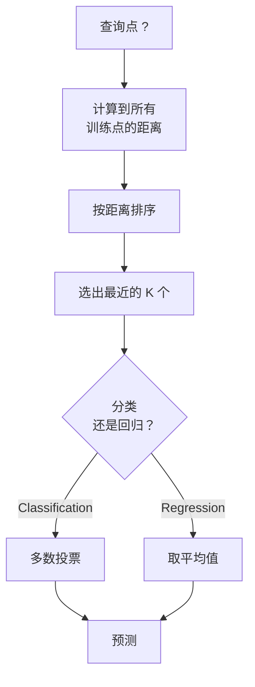
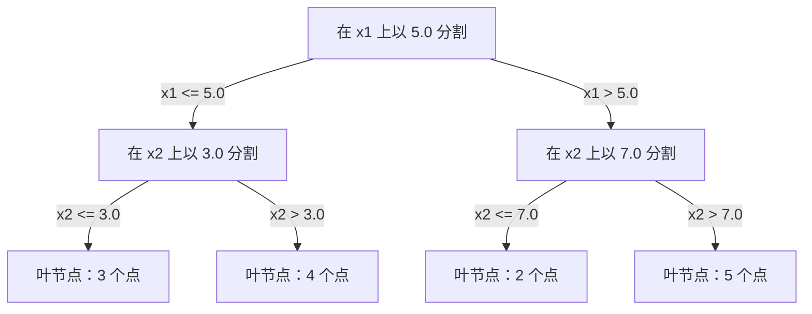

# K 近邻与距离（K-Nearest Neighbors and Distances）

> 存下所有数据，靠邻居来做预测。这是最简单却真正有效的算法。

**Type:** Build
**Language:** Python
**Prerequisites:** Phase 1 (Lesson 14 Norms and Distances)
**Time:** ~90 minutes

## 学习目标（Learning Objectives）

- 从零实现 KNN 分类与回归，支持可配置的 K 以及距离加权投票
- 比较 L1、L2、余弦（cosine）与 Minkowski 距离度量，并针对给定的数据类型选择合适的一种
- 解释维度灾难（curse of dimensionality），并演示为什么 KNN 在高维空间中性能退化
- 构建用于高效最近邻搜索的 KD 树（KD-tree），并分析它何时优于暴力搜索

## 问题（The Problem）

你有一个数据集。一个新的数据点到来了，你需要对它分类或预测它的值。与线性回归或 SVM 不同（它们从数据中学习参数），你只需找出离新点最近的 K 个训练点，让它们投票。

这就是 K 近邻（K-nearest neighbors, KNN）。没有训练阶段，没有要学习的参数，没有要最小化的损失函数。你存储整个训练集，在预测时计算距离。

它简单得让人怀疑是否真能奏效。但 KNN 在许多问题上出奇地有竞争力，尤其是在中小规模数据集上；而深入理解它会揭示许多基本概念：距离度量的选择（呼应第 1 阶段第 14 课）、维度灾难，以及懒惰学习（lazy learning）与急切学习（eager learning）的区别。

KNN 在现代 AI 中无处不在，只是换了名字。向量数据库对嵌入（embedding）做 KNN 搜索；检索增强生成（RAG）寻找 K 个最近的文档块；推荐系统寻找相似的用户或物品。算法是同一个，不同的只是规模和数据结构。

## 核心概念（The Concept）

### KNN 如何工作（How KNN works）

给定一个由带标签的点组成的数据集和一个新的查询点：

1. 计算查询点到数据集中每个点的距离
2. 按距离排序
3. 取最近的 K 个点
4. 分类任务：在 K 个邻居中做多数投票
5. 回归任务：取 K 个邻居值的平均（或加权平均）



这就是全部算法。没有拟合，没有梯度下降，没有 epoch。

### 选择 K（Choosing K）

K 是唯一的超参数，它控制偏差-方差（bias-variance）权衡：

| K | 行为 |
|---|----------|
| K = 1 | 决策边界贴合每个点。训练误差为零。方差高。过拟合 |
| 较小的 K（3-5） | 对局部结构敏感。能捕捉复杂边界 |
| 较大的 K | 边界更平滑。对噪声更稳健。可能欠拟合 |
| K = N | 对每个点都预测多数类。偏差最大 |

对于一个含 N 个点的数据集，常见的起点是 K = sqrt(N)。二分类任务请使用奇数 K，以避免平票。


### 距离度量（Distance metrics）

距离函数定义了什么叫"近"。不同的度量产生不同的邻居、不同的预测。

**L2（欧氏距离）**是默认选择，即直线距离。

```
d(a, b) = sqrt(sum((a_i - b_i)^2))
```

它对特征尺度敏感。在 KNN 中使用 L2 之前，一定要先标准化特征。

**L1（曼哈顿距离）**对绝对差求和。因为不对差值平方，所以比 L2 对离群点更稳健。

```
d(a, b) = sum(|a_i - b_i|)
```

**余弦距离**度量向量之间的夹角，忽略幅值。对文本和嵌入数据至关重要。

```
d(a, b) = 1 - (a . b) / (||a|| * ||b||)
```

**Minkowski 距离**用参数 p 统一了 L1 和 L2。

```
d(a, b) = (sum(|a_i - b_i|^p))^(1/p)

p=1: Manhattan
p=2: Euclidean
p->inf: Chebyshev (max absolute difference)
```

用哪种度量取决于数据：

| 数据类型 | 最佳度量 | 原因 |
|-----------|------------|-----|
| 数值特征，尺度相近 | L2（欧氏距离） | 默认选择，适用于空间数据 |
| 数值特征，含离群点 | L1（曼哈顿距离） | 稳健，不会放大大差异 |
| 文本嵌入 | 余弦 | 幅值是噪声，方向才是语义 |
| 高维稀疏 | 余弦或 L1 | L2 受维度灾难困扰 |
| 混合类型 | 自定义距离 | 按特征类型组合不同度量 |

### 加权 KNN（Weighted KNN）

标准 KNN 给所有 K 个邻居相同的权重。但距离 0.1 的邻居理应比距离 5.0 的邻居更重要。

**距离加权 KNN**按距离的倒数给每个邻居加权：

```
weight_i = 1 / (distance_i + epsilon)

For classification: weighted vote
For regression:     weighted average = sum(w_i * y_i) / sum(w_i)
```

epsilon 防止查询点与某个训练点完全重合时出现除零。

加权 KNN 对 K 的选择不那么敏感，因为无论 K 取多大，远处邻居的贡献都很小。

### 维度灾难（The curse of dimensionality）

KNN 在高维下性能退化。这不是含糊的担忧，而是数学事实。

**问题 1：距离趋于一致。** 随着维度增加，最大距离与最小距离之比趋近于 1。所有点与查询点的"远近"变得几乎相同。

```
In d dimensions, for random uniform points:

d=2:    max_dist / min_dist = varies widely
d=100:  max_dist / min_dist ~ 1.01
d=1000: max_dist / min_dist ~ 1.001

When all distances are nearly equal, "nearest" is meaningless.
```

**问题 2：体积爆炸。** 要在数据的固定比例内捕捉到 K 个邻居，你必须把搜索半径扩大到覆盖特征空间中大得多的比例。高维中的"邻域"会囊括大部分空间。

**问题 3：角落主导。** 在 d 维单位超立方体中，大部分体积集中在角落附近而非中心。随着 d 增大，内切于立方体的球所包含的体积比例趋近于零。

实际结论：KNN 在特征数不超过约 20-50 时效果良好。超过这个范围，你需要先做降维（PCA、UMAP、t-SNE）再应用 KNN，或者使用能利用数据内在低维结构的树形搜索结构。

### KD 树：快速最近邻搜索（KD-trees: fast nearest neighbor search）

暴力 KNN 会计算查询点到每个训练点的距离，每次查询的复杂度为 O(n * d)。对大型数据集来说，这太慢了。

KD 树沿特征轴递归地划分空间。每一层沿着一个维度在中位数处切分。



查找最近邻时，先沿树下行到包含查询点的叶节点，然后回溯，只有当相邻分区可能包含更近的点时才检查它们。

低维时平均查询时间为 O(log n)。但在高维（d > 20）下，KD 树会退化到 O(n)，因为回溯能剪掉的分支越来越少。

### 球树：中等维度下更优（Ball trees: better for moderate dimensions）

球树（ball tree）用嵌套的超球体而不是轴对齐的矩形来划分数据。每个节点定义一个球（中心 + 半径），包含该子树中的所有点。

相比 KD 树的优势：
- 在中等维度（约 50 以内）下表现更好
- 能处理非轴对齐的结构
- 更紧的包围体意味着搜索时能剪掉更多分支

KD 树和球树都是精确算法。对于真正的大规模搜索（数百万个点、数百个维度），则需要改用近似最近邻方法（HNSW、IVF、乘积量化）。这些内容在第 1 阶段第 14 课中介绍。

### 懒惰学习与急切学习（Lazy learning vs eager learning）

KNN 是懒惰学习器：训练时什么都不做，把所有工作留到预测时。其他大多数算法（线性回归、SVM、神经网络）都是急切学习器：训练时进行大量计算以构建一个紧凑模型，之后预测很快。

| 维度 | 懒惰（KNN） | 急切（SVM、神经网络） |
|--------|------------|------------------------|
| 训练时间 | O(1)，只存储数据 | O(n * epochs) |
| 预测时间 | 每次查询 O(n * d) | O(d) 或 O(parameters) |
| 预测时的内存 | 存储整个训练集 | 只存储模型参数 |
| 适应新数据 | 即时添加点 | 重新训练模型 |
| 决策边界 | 隐式，即时计算 | 显式，训练后固定 |

懒惰学习适用于：
- 数据集频繁变化（增删点无需重新训练）
- 只需为极少数查询做预测
- 你希望训练时间为零
- 数据集小到暴力搜索也足够快

### 用于回归的 KNN（KNN for regression）

用于回归的 KNN 不做多数投票，而是对 K 个邻居的目标值取平均。

```
prediction = (1/K) * sum(y_i for i in K nearest neighbors)

Or with distance weighting:
prediction = sum(w_i * y_i) / sum(w_i)
where w_i = 1 / distance_i
```

KNN 回归产生分段常数（加权时为分段平滑）的预测。它无法外推到训练数据的范围之外。如果训练目标都在 0 到 100 之间，KNN 永远不会预测出 200。

```figure
knn-smoothness
```

## 动手实现（Build It）

### 第 1 步：距离函数（Step 1: Distance functions）

实现 L1、L2、余弦和 Minkowski 距离。它们与第 1 阶段第 14 课直接呼应。

```python
import math

def l2_distance(a, b):
    return math.sqrt(sum((ai - bi) ** 2 for ai, bi in zip(a, b)))

def l1_distance(a, b):
    return sum(abs(ai - bi) for ai, bi in zip(a, b))

def cosine_distance(a, b):
    dot_val = sum(ai * bi for ai, bi in zip(a, b))
    norm_a = math.sqrt(sum(ai ** 2 for ai in a))
    norm_b = math.sqrt(sum(bi ** 2 for bi in b))
    if norm_a == 0 or norm_b == 0:
        return 1.0
    return 1.0 - dot_val / (norm_a * norm_b)

def minkowski_distance(a, b, p=2):
    if p == float('inf'):
        return max(abs(ai - bi) for ai, bi in zip(a, b))
    return sum(abs(ai - bi) ** p for ai, bi in zip(a, b)) ** (1 / p)
```

### 第 2 步：KNN 分类器与回归器（Step 2: KNN classifier and regressor）

构建完整的 KNN，支持可配置的 K、距离度量以及可选的距离加权。

```python
class KNN:
    def __init__(self, k=5, distance_fn=l2_distance, weighted=False,
                 task="classification"):
        self.k = k
        self.distance_fn = distance_fn
        self.weighted = weighted
        self.task = task
        self.X_train = None
        self.y_train = None

    def fit(self, X, y):
        self.X_train = X
        self.y_train = y

    def predict(self, X):
        return [self._predict_one(x) for x in X]
```

### 第 3 步：用于高效搜索的 KD 树（Step 3: KD-tree for efficient search）

从零构建一棵 KD 树，沿每个维度的中位数递归切分。

```python
class KDTree:
    def __init__(self, X, indices=None, depth=0):
        # Recursively partition the data
        self.axis = depth % len(X[0])
        # Split on median of the current axis
        ...

    def query(self, point, k=1):
        # Traverse to leaf, then backtrack
        ...
```

完整实现、所有辅助方法和演示见 `code/knn.py`。

### 第 4 步：特征缩放（Step 4: Feature scaling）

KNN 需要特征缩放，因为距离对特征的量级很敏感。取值范围 0 到 1000 的特征会压过取值范围 0 到 1 的特征。

```python
def standardize(X):
    n = len(X)
    d = len(X[0])
    means = [sum(X[i][j] for i in range(n)) / n for j in range(d)]
    stds = [
        max(1e-10, (sum((X[i][j] - means[j]) ** 2 for i in range(n)) / n) ** 0.5)
        for j in range(d)
    ]
    return [[((X[i][j] - means[j]) / stds[j]) for j in range(d)] for i in range(n)], means, stds
```

## 直接使用（Use It）

使用 scikit-learn：

```python
from sklearn.neighbors import KNeighborsClassifier
from sklearn.preprocessing import StandardScaler
from sklearn.pipeline import Pipeline

clf = Pipeline([
    ("scaler", StandardScaler()),
    ("knn", KNeighborsClassifier(n_neighbors=5, metric="euclidean")),
])
clf.fit(X_train, y_train)
print(f"Accuracy: {clf.score(X_test, y_test):.4f}")
```

当数据集足够大、维度足够低时，scikit-learn 会自动使用 KD 树或球树；对高维数据则回退到暴力搜索。你可以用 `algorithm` 参数控制这一行为。

对于大规模最近邻搜索（数百万个向量），请使用 FAISS、Annoy 或向量数据库：

```python
import faiss

index = faiss.IndexFlatL2(dimension)
index.add(embeddings)
distances, indices = index.search(query_vectors, k=5)
```

## 练习（Exercises）

1. 在一个有 3 个类别的二维数据集上实现 KNN 分类。画出 K=1、K=5、K=15 和 K=N 时的决策边界。观察从过拟合到欠拟合的转变。

2. 在 2、5、10、50、100、500 维下各生成 1000 个随机点。对每个维度，计算最大成对距离与最小成对距离之比。画出比值随维度变化的曲线，直观展示维度灾难。

3. 在一个文本分类问题（使用 TF-IDF 向量）上，比较 L1、L2 和余弦距离下的 KNN。哪种度量的准确率最高？为什么余弦在文本上往往胜出？

4. 实现 KD 树，并在 2D、10D、50D 下分别对 1k、10k、100k 个点的数据集，测量其查询时间与暴力搜索的对比。在多大维度上 KD 树不再快于暴力搜索？

5. 为 y = sin(x) + noise 构建一个加权 KNN 回归器，并在 K=3、10、30 下与不加权的 KNN 比较。展示加权能产生更平滑的预测，尤其是 K 较大时。

## 关键术语（Key Terms）

| 术语 | 实际含义 |
|------|----------------------|
| K 近邻 | 非参数算法，通过找出与查询点最近的 K 个训练点来做预测 |
| 懒惰学习 | 训练时不做任何计算，所有工作都发生在预测时。KNN 是典型代表 |
| 急切学习 | 训练时进行大量计算以构建紧凑模型。大多数机器学习算法都是急切学习 |
| 维度灾难 | 高维下距离趋于一致、邻域扩张到覆盖大部分空间，使 KNN 失效 |
| KD 树 | 沿特征轴递归划分空间的二叉树。低维下查询为 O(log n) |
| 球树 | 嵌套超球体构成的树。在中等维度（约 50 以内）下优于 KD 树 |
| 加权 KNN | 邻居按距离倒数加权。越近的邻居对预测的影响越大 |
| 特征缩放 | 把特征归一化到可比的范围。KNN 等基于距离的方法必需 |
| 多数投票 | 统计 K 个邻居中最常见的类别来完成分类 |
| 暴力搜索 | 计算到每个训练点的距离。每次查询 O(n*d)。结果精确但 n 大时慢 |
| 近似最近邻 | （HNSW、LSH、IVF 等）比精确搜索快得多地找到近似最近点的算法 |
| Voronoi 图 | 空间的一种划分：每个区域包含所有离某个训练点比离其他任何训练点都近的点。K=1 的 KNN 产生 Voronoi 边界 |

## 延伸阅读（Further Reading）

- [Cover & Hart: Nearest Neighbor Pattern Classification (1967)](https://ieeexplore.ieee.org/document/1053964) - 奠基性的 KNN 论文，证明其错误率至多是贝叶斯最优的两倍
- [Friedman, Bentley, Finkel: An Algorithm for Finding Best Matches in Logarithmic Expected Time (1977)](https://dl.acm.org/doi/10.1145/355744.355745) - KD 树的原始论文
- [Beyer et al.: When Is "Nearest Neighbor" Meaningful? (1999)](https://link.springer.com/chapter/10.1007/3-540-49257-7_15) - 对最近邻维度灾难的正式分析
- [scikit-learn Nearest Neighbors documentation](https://scikit-learn.org/stable/modules/neighbors.html) - 包含算法选择的实用指南
- [FAISS: A Library for Efficient Similarity Search](https://github.com/facebookresearch/faiss) - Meta 的库，用于十亿规模的近似最近邻搜索
