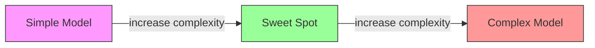
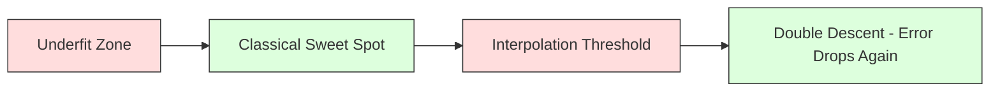
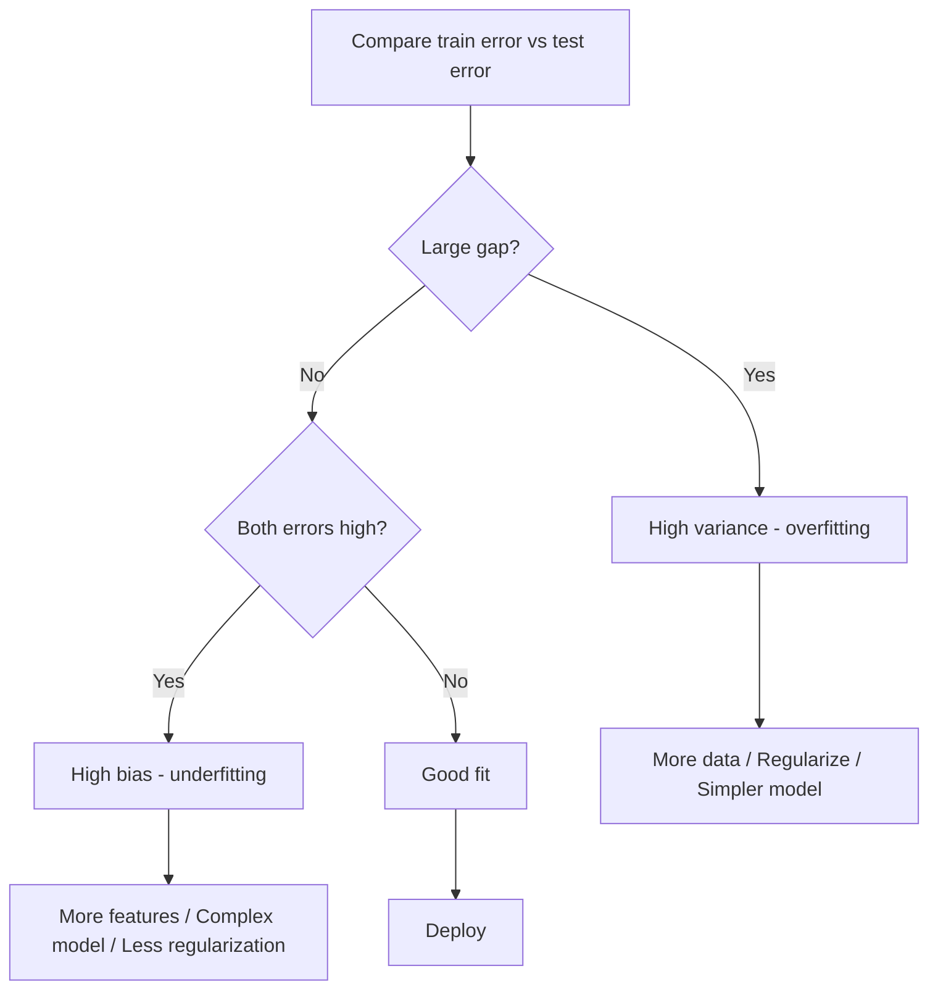
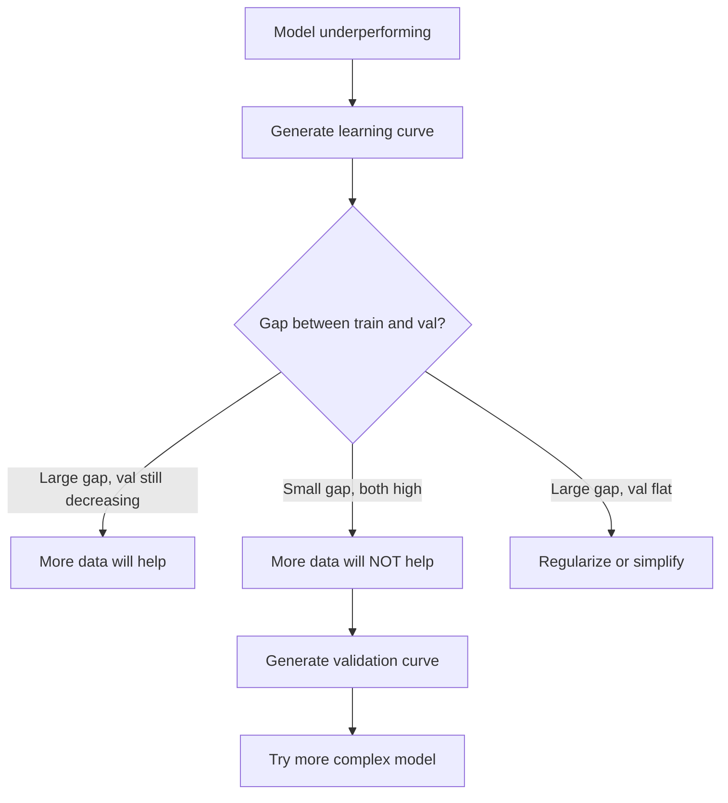

# 偏差-方差权衡（Bias-Variance Tradeoff）

> 模型的每一分误差都来自三个来源之一：偏差、方差或噪声。你只能控制前两者。

**Type:** Learn
**Language:** Python
**Prerequisites:** Phase 2, Lessons 01-09 (ML basics, regression, classification, evaluation)
**Time:** ~75 minutes

## 学习目标（Learning Objectives）

- 推导期望预测误差的偏差-方差分解，并解释不可约噪声的作用
- 利用训练误差与测试误差的模式，诊断模型的问题是高偏差还是高方差
- 解释正则化技术（L1、L2、dropout、早停）如何以偏差换方差
- 实现可视化实验，展示复杂度递增的模型之间的偏差-方差权衡

## 问题（The Problem）

你训练了一个模型，它在测试数据上有一些误差。这些误差从何而来？

如果模型太简单（在弯曲的数据上做线性回归），它会始终抓不住真实模式。这就是偏差。如果模型太复杂（用 20 次多项式拟合 15 个数据点），它能完美拟合训练数据，但在新数据上给出的预测却千差万别。这就是方差。

对固定容量的模型来说，你无法同时最小化两者。把偏差压下去，方差就升上来；把方差压下去，偏差又升上来。理解这一权衡是机器学习中最有用的诊断技能。它告诉你该把模型变复杂还是变简单、该收集更多数据还是构造更好的特征、该加强还是减弱正则化。

## 核心概念（The Concept）

### 偏差：系统性误差（Bias: Systematic Error）

偏差衡量的是模型的平均预测与真实值之间相差多远。如果你在同一分布抽取的许多不同训练集上训练同一个模型，并对预测取平均，偏差就是这个平均值与真值之间的差距。

高偏差意味着模型太僵化，抓不住真实模式。用一条直线去拟合抛物线，无论给多少数据，它都永远贴不上那条曲线。这就是欠拟合（underfitting）。

```
High bias (underfitting):
  Model always predicts roughly the same wrong thing.
  Training error: HIGH
  Test error: HIGH
  Gap between them: SMALL
```

### 方差：对训练数据的敏感性（Variance: Sensitivity to Training Data）

方差衡量的是换用不同的训练子集时，预测会变化多大。如果训练集的微小变化会导致模型的巨大变化，方差就高。

高方差意味着模型在拟合训练数据里的噪声，而不是底层信号。20 次多项式会穿过每一个训练点，却在点与点之间剧烈震荡。这就是过拟合（overfitting）。

```
High variance (overfitting):
  Model fits training data perfectly but fails on new data.
  Training error: LOW
  Test error: HIGH
  Gap between them: LARGE
```

### 分解（The Decomposition）

对任意点 x，平方损失下的期望预测误差可以精确分解：

```
Expected Error = Bias^2 + Variance + Irreducible Noise

where:
  Bias^2   = (E[f_hat(x)] - f(x))^2
  Variance = E[(f_hat(x) - E[f_hat(x)])^2]
  Noise    = E[(y - f(x))^2]             (sigma^2)
```

- `f(x)` 是真实函数
- `f_hat(x)` 是模型的预测
- `E[...]` 是对不同训练集取的期望
- `y` 是观测标签（真实函数加噪声）

噪声项是不可约的。在带噪数据上，任何模型都不可能好过 sigma^2。你的任务是在 bias^2 与方差之间找到正确的平衡。

### 模型复杂度与误差（Model Complexity vs Error）



经典的 U 形曲线：

| 复杂度 | 偏差 | 方差 | 总误差 |
|-----------|------|----------|-------------|
| 过低 | 高 | 低 | 高（欠拟合） |
| 恰到好处 | 中等 | 中等 | 最低 |
| 过高 | 低 | 高 | 高（过拟合） |

### 用正则化控制偏差-方差（Regularization as Bias-Variance Control）

正则化故意增加偏差来换取方差的下降。它约束模型，让它无法去追噪声。

- **L2（Ridge）**：把所有权重向零收缩。保留所有特征，但削弱它们的影响。
- **L1（Lasso）**：把一部分权重精确压到零。起到特征选择的作用。
- **Dropout**：训练期间随机停用神经元。迫使模型形成冗余表示。
- **早停（early stopping）**：在模型完全拟合训练数据之前就停止训练。

正则化强度（lambda、dropout 率、epoch 数）直接控制你在偏差-方差曲线上的位置。正则化越强，偏差越大，方差越小。

### 双下降：现代视角（Double Descent: The Modern Perspective）

经典理论说：越过最佳点之后，复杂度越高只会越糟。但 2019 年以来的研究揭示了一个意外的现象。如果把模型容量增加到远超插值阈值（interpolation threshold，即模型的参数足以完美拟合训练数据的那个点），测试误差可能再次下降。



这种“双下降（double descent）”现象解释了为什么大规模过参数化的神经网络（参数远多于训练样本）仍然能很好地泛化。经典的偏差-方差权衡并没有错，只是对现代情形而言并不完整。

关于双下降的关键观察：
- 它出现在线性模型、决策树和神经网络中
- 在插值区域，更多数据反而可能有害（sample-wise double descent）
- 更多训练轮数也可能引发它（epoch-wise double descent）
- 正则化能削平峰值，但无法消除它

为什么会这样？在插值阈值处，模型的容量刚好够拟合所有训练点。它被迫采用一个非常特定的解，穿过每一个点，数据的微小扰动就会导致拟合结果的巨大变化。这正是方差达到峰值的地方。越过阈值之后，模型有许多能完美拟合数据的解可选。学习算法（例如带隐式正则化的梯度下降）倾向于从中挑出最简单的那个。正是这种对简单解的隐式偏好，让过参数化模型得以泛化。

| 区域 | 参数与样本数 | 行为 |
|--------|----------------------|----------|
| 欠参数化 | p << n | 适用经典权衡 |
| 插值阈值 | p ~ n | 方差达到峰值，测试误差飙升 |
| 过参数化 | p >> n | 隐式正则化生效，测试误差下降 |

从实用角度出发：如果你用的是神经网络或大型树集成，不要停在插值阈值上。要么远远低于它（配合显式正则化），要么远远越过它。最糟糕的位置就是恰好在阈值上。

### 诊断你的模型（Diagnosing Your Model）



| 症状 | 诊断 | 对策 |
|---------|-----------|-----|
| 训练误差高，测试误差高 | 偏差 | 增加特征、用更复杂的模型、减弱正则化 |
| 训练误差低，测试误差高 | 方差 | 更多数据、正则化、更简单的模型、dropout |
| 训练误差低，测试误差低 | 拟合良好 | 直接发布 |
| 训练误差在降，测试误差在升 | 正在过拟合 | 早停 |

### 实用策略（Practical Strategies）

**当偏差是问题时：**
- 增加多项式特征或交互特征
- 使用更灵活的模型（用树集成代替线性模型）
- 减小正则化强度
- 训练更久（如果尚未收敛）

**当方差是问题时：**
- 获取更多训练数据
- 使用 bagging（随机森林）
- 加强正则化（更大的 lambda、更多 dropout）
- 特征选择（去掉噪声特征）
- 用交叉验证及早发现问题

### 集成方法与方差削减（Ensemble Methods and Variance Reduction）

集成方法是对抗方差最实用的工具。

**Bagging（Bootstrap Aggregating，自助聚合）**在训练数据的不同自助样本（bootstrap sample）上训练多个模型，然后对它们的预测取平均。单个模型方差很高，但平均值的方差低得多。随机森林就是把 bagging 应用到决策树上。

从数学上看它为什么有效：如果对 N 个相互独立、各自方差为 sigma^2 的预测取平均，平均值的方差就是 sigma^2 / N。这些模型并非真正独立（它们看到的数据相似），所以削减幅度达不到 1/N，但依然相当可观。

**Boosting** 通过顺序构建模型来降低偏差，每个新模型都专注于此前集成的错误。梯度提升（gradient boosting）和 AdaBoost 是主要代表。如果加入太多模型，boosting 也会过拟合，所以需要早停或正则化。

| 方法 | 主要作用 | 偏差变化 | 方差变化 |
|--------|---------------|-------------|-----------------|
| Bagging | 降低方差 | 不变 | 下降 |
| Boosting | 降低偏差 | 下降 | 可能上升 |
| Stacking | 两者都降 | 取决于元学习器 | 取决于基模型 |
| Dropout | 隐式 bagging | 略微上升 | 下降 |

**实用法则**：如果你的基模型方差高（深树、高次多项式），用 bagging。如果你的基模型偏差高（浅层树桩、简单线性模型），用 boosting。

### 学习曲线（Learning Curves）

学习曲线把训练误差和验证误差画成训练集大小的函数。它是你手头最实用的诊断工具。与单次训练/测试对比不同，学习曲线展示模型的轨迹，并告诉你更多数据是否会有帮助。


如何解读：

| 场景 | 训练误差 | 验证误差 | 差距 | 含义 | 对策 |
|----------|---------------|-----------------|-----|---------------|------------|
| 高偏差 | 高 | 高 | 小 | 模型抓不住模式 | 增加特征、用更复杂的模型、减弱正则化 |
| 高方差 | 低 | 高 | 大 | 模型背下了训练数据 | 更多数据、正则化、更简单的模型 |
| 拟合良好 | 中等 | 中等 | 小 | 模型泛化良好 | 直接发布 |
| 高方差但在改善 | 低 | 随数据增多而下降 | 在缩小 | 数据能解决的方差问题 | 收集更多数据 |
| 高偏差且平坦 | 高 | 高且平坦 | 小且平坦 | 更多数据帮不上忙 | 更换模型架构 |

关键洞察：如果两条曲线都已进入平台期、差距很小但两个误差都很高，那么更多数据毫无用处，你需要的是更好的模型。如果差距很大且还在缩小，更多数据会有帮助。

### 如何生成学习曲线（How to Generate Learning Curves）

有两种做法：

**方法 1：固定模型，改变训练集大小。** 保持模型和超参数不变，在越来越大的训练子集上训练，测量每个规模下的训练误差和验证误差。这就是标准学习曲线。

**方法 2：固定数据，改变模型复杂度。** 保持数据不变，扫过一个复杂度参数（多项式次数、树深度、层数），测量每个复杂度下的训练误差和验证误差。这就是验证曲线（validation curve），直接呈现偏差-方差权衡。

两种方法互为补充。第一种告诉你更多数据是否有帮助，第二种告诉你换模型是否有帮助。在决定下一步之前，两种都跑一遍。



```figure
bias-variance
```

## 动手实现（Build It）

`code/bias_variance.py` 中的代码运行完整的偏差-方差分解实验。下面按步骤介绍做法。

### 第 1 步：从已知函数生成合成数据（Step 1: Generate Synthetic Data from a Known Function）

我们使用 `f(x) = sin(1.5x) + 0.5x` 加高斯噪声。知道真实函数，我们就能精确计算偏差和方差。

```python
def true_function(x):
    return np.sin(1.5 * x) + 0.5 * x

def generate_data(n_samples=30, noise_std=0.5, x_range=(-3, 3), seed=None):
    rng = np.random.RandomState(seed)
    x = rng.uniform(x_range[0], x_range[1], n_samples)
    y = true_function(x) + rng.normal(0, noise_std, n_samples)
    return x, y
```

### 第 2 步：自助采样与多项式拟合（Step 2: Bootstrap Sampling and Polynomial Fitting）

对每个多项式次数，我们抽取许多自助训练集、拟合多项式，并记录在固定测试网格上的预测。这样我们就得到每个测试点上的预测分布。

```python
def fit_polynomial(x_train, y_train, degree, lam=0.0):
    X = np.column_stack([x_train ** d for d in range(degree + 1)])
    if lam > 0:
        penalty = lam * np.eye(X.shape[1])
        penalty[0, 0] = 0
        w = np.linalg.solve(X.T @ X + penalty, X.T @ y_train)
    else:
        w = np.linalg.lstsq(X, y_train, rcond=None)[0]
    return w
```

我们在 200 个不同的自助样本上拟合。每个自助样本都来自同一底层分布，但包含的点各不相同。

### 第 3 步：计算 Bias^2 与方差分解（Step 3: Computing Bias^2, Variance Decomposition）

有了每个测试点上的 200 组预测，我们就可以直接按定义计算分解：

```python
mean_pred = predictions.mean(axis=0)
bias_sq = np.mean((mean_pred - y_true) ** 2)
variance = np.mean(predictions.var(axis=0))
total_error = np.mean(np.mean((predictions - y_true) ** 2, axis=1))
```

- `mean_pred` 是由自助样本估计出的 E[f_hat(x)]
- `bias_sq` 是平均预测与真值之间差距的平方
- `variance` 是各自助样本间预测的平均离散程度
- `total_error` 应近似等于 bias^2 + variance + noise

### 第 4 步：学习曲线（Step 4: Learning Curves）

学习曲线在固定模型复杂度的同时扫过训练集大小。它们展示你的模型是受数据限制还是受容量限制。

```python
def demo_learning_curves():
    sizes = [10, 15, 20, 30, 50, 75, 100, 150, 200, 300]
    degree = 5

    for n in sizes:
        train_errors = []
        test_errors = []
        for seed in range(50):
            x_train, y_train = generate_data(n_samples=n, seed=seed * 100)
            w = fit_polynomial(x_train, y_train, degree)
            train_pred = predict_polynomial(x_train, w)
            train_mse = np.mean((train_pred - y_train) ** 2)
            test_pred = predict_polynomial(x_test, w)
            test_mse = np.mean((test_pred - y_test) ** 2)
            train_errors.append(train_mse)
            test_errors.append(test_mse)
        # Average over runs gives the learning curve point
```

对高方差模型（小数据下的 5 次多项式），你会看到：
- 训练误差起点低，随着数据增多、记忆变难而上升
- 测试误差起点高，随着模型获得更多信号而下降
- 差距随数据增多而缩小

对高偏差模型（1 次多项式），两个误差很快收敛到同一个高值，更多数据也无济于事。

### 第 5 步：正则化扫描（Step 5: Regularization Sweep）

代码中还包含 `demo_regularization_sweep()`，它固定一个高次多项式（15 次），把 Ridge 正则化强度从 0.001 扫到 100。这从另一个角度展示了偏差-方差权衡：我们不改变模型复杂度，而是改变约束强度。

```python
def demo_regularization_sweep():
    alphas = [0.001, 0.005, 0.01, 0.05, 0.1, 0.5, 1.0, 5.0, 10.0, 50.0, 100.0]
    for alpha in alphas:
        results = bias_variance_decomposition([15], lam=alpha)
        r = results[15]
        print(f"alpha={alpha:.3f}  bias={r['bias_sq']:.4f}  var={r['variance']:.4f}")
```

alpha 很低时，15 次多项式几乎没有约束，方差占主导，因为模型在追逐每个自助样本里的噪声。alpha 很高时，惩罚强到让模型实际上变成一个近似常数的函数，偏差占主导。最优的 alpha 位于两个极端之间。

这与改变多项式次数时的 U 形曲线是同一条，只不过这次由一个连续旋钮而非离散开关控制。实践中，正则化是控制这一权衡的首选方式，因为它可以在不改动特征集的情况下进行细粒度控制。

## 用起来（Use It）

sklearn 提供 `learning_curve` 和 `validation_curve`，无需手写自助循环就能把这些诊断自动化。

### 验证曲线：扫描模型复杂度（Validation Curve: Sweep Model Complexity）

```python
from sklearn.model_selection import validation_curve
from sklearn.pipeline import make_pipeline
from sklearn.preprocessing import PolynomialFeatures
from sklearn.linear_model import Ridge

degrees = list(range(1, 16))
train_scores_all = []
val_scores_all = []

for d in degrees:
    pipe = make_pipeline(PolynomialFeatures(d), Ridge(alpha=0.01))
    train_scores, val_scores = validation_curve(
        pipe, X, y, param_name="polynomialfeatures__degree",
        param_range=[d], cv=5, scoring="neg_mean_squared_error"
    )
    train_scores_all.append(-train_scores.mean())
    val_scores_all.append(-val_scores.mean())
```

这直接给出偏差-方差权衡曲线。验证得分相对训练得分最差的地方，方差占主导；两者都差的地方，偏差占主导。

### 学习曲线：扫描训练集大小（Learning Curve: Sweep Training Set Size）

```python
from sklearn.model_selection import learning_curve

pipe = make_pipeline(PolynomialFeatures(5), Ridge(alpha=0.01))
train_sizes, train_scores, val_scores = learning_curve(
    pipe, X, y, train_sizes=np.linspace(0.1, 1.0, 10),
    cv=5, scoring="neg_mean_squared_error"
)
train_mse = -train_scores.mean(axis=1)
val_mse = -val_scores.mean(axis=1)
```

把 `train_mse` 和 `val_mse` 对着 `train_sizes` 画出来。曲线的形状会告诉你关于模型的一切。

### 交叉验证与正则化扫描（Cross-Validation with Regularization Sweep）

```python
from sklearn.model_selection import cross_val_score

alphas = [0.001, 0.01, 0.1, 1.0, 10.0, 100.0]
for alpha in alphas:
    pipe = make_pipeline(PolynomialFeatures(10), Ridge(alpha=alpha))
    scores = cross_val_score(pipe, X, y, cv=5, scoring="neg_mean_squared_error")
    print(f"alpha={alpha:>7.3f}  MSE={-scores.mean():.4f} +/- {scores.std():.4f}")
```

这在固定模型复杂度下扫描正则化强度。你会看到同样的偏差-方差权衡：alpha 低意味着高方差，alpha 高意味着高偏差。

### 整合所有环节：完整的诊断工作流（Putting It All Together: A Complete Diagnostic Workflow）

实践中，你按顺序执行这些诊断：

1. 训练模型，计算训练误差和测试误差。
2. 如果两者都高：你遇到了偏差问题，直接跳到第 4 步。
3. 如果训练误差低但测试误差高：你遇到了方差问题。生成学习曲线，看看更多数据是否有帮助；如果没有，就做正则化。
4. 生成扫过主要复杂度参数的验证曲线，找到最佳点。
5. 在最佳点处生成学习曲线。如果差距仍然很大，你需要更多数据或正则化。
6. 用 `cross_val_score` 尝试不同 alpha 值的 Ridge/Lasso，选择交叉验证误差最低的 alpha。

对大多数表格数据集来说，这只需 10-15 分钟的计算，却能省去数小时的瞎猜。

## 发布（Ship It）

本课产出：`outputs/prompt-model-diagnostics.md`

## 练习（Exercises）

1. 用 `noise_std=0`（无噪声）运行分解实验。不可约误差项会怎样？最优复杂度会改变吗？

2. 把训练集大小从 30 增加到 300。这对方差分量有什么影响？最优多项式次数会移动吗？

3. 给实验加上 L2 正则化（岭回归）。固定高次多项式（15 次），把 lambda 从 0 扫到 100。画出 bias^2 和方差随 lambda 变化的曲线。

4. 把真实函数从多项式改成 `sin(x)`。偏差-方差分解会如何变化？还存在明确的最优次数吗？

5. 实现一个简单的自助聚合（bagging）包装器：在自助样本上训练 10 个模型并对预测取平均。证明这能降低方差，而几乎不增加偏差。

## 关键术语（Key Terms）

| 术语 | 人们常说 | 实际含义 |
|------|----------------|----------------------|
| 偏差（bias） | “模型太简单” | 由错误假设导致的系统性误差。模型平均预测与真值之间的差距。 |
| 方差（variance） | “模型过拟合了” | 由对训练数据的敏感性带来的误差。预测在不同训练集之间的变化幅度。 |
| 不可约误差（irreducible error） | “数据里的噪声” | 来自真实数据生成过程中随机性的误差。任何模型都无法消除。 |
| 欠拟合（underfitting） | “学得不够” | 模型偏差高。即使在训练数据上也抓不住真实模式。 |
| 过拟合（overfitting） | “背数据” | 模型方差高。拟合了训练数据中无法泛化的噪声。 |
| 正则化（regularization） | “约束模型” | 加入惩罚项以降低模型复杂度，用偏差换取更低的方差。 |
| 双下降（double descent） | “参数多也有好处” | 当模型容量远超插值阈值时，测试误差再次下降。 |
| 模型复杂度（model complexity） | “模型有多灵活” | 模型拟合任意模式的能力。由架构、特征或正则化控制。 |

## 延伸阅读（Further Reading）

- [Hastie, Tibshirani, Friedman: Elements of Statistical Learning, Ch. 7](https://hastie.su.domains/ElemStatLearn/) -- 偏差-方差分解的权威论述
- [Belkin et al., Reconciling modern machine learning practice and the bias-variance trade-off (2019)](https://arxiv.org/abs/1812.11118) -- 双下降论文
- [Nakkiran et al., Deep Double Descent (2019)](https://arxiv.org/abs/1912.02292) -- epoch 维度与样本维度的双下降
- [Scott Fortmann-Roe：理解偏差-方差权衡](http://scott.fortmann-roe.com/docs/BiasVariance.html) -- 清晰的可视化讲解
