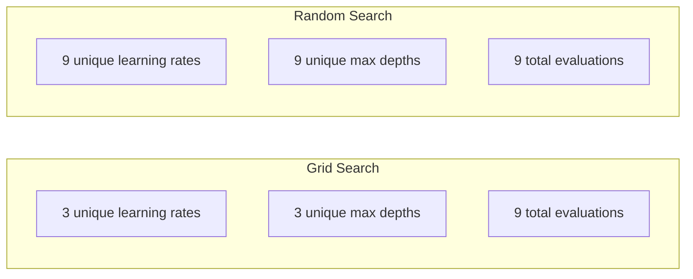
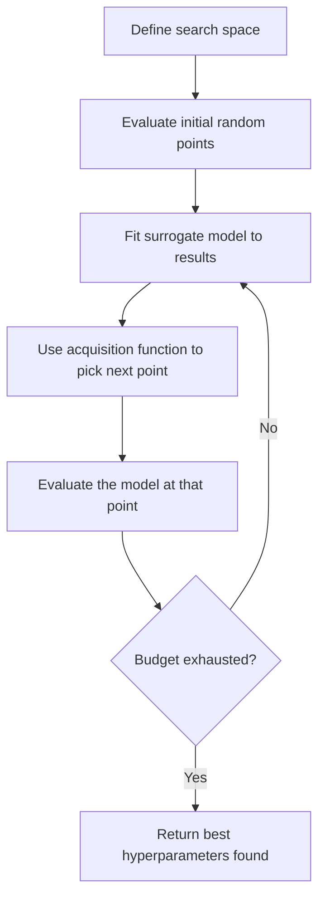
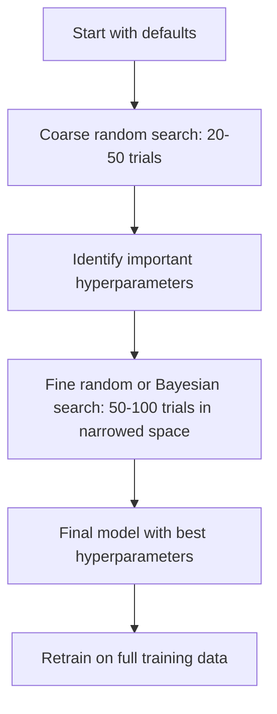
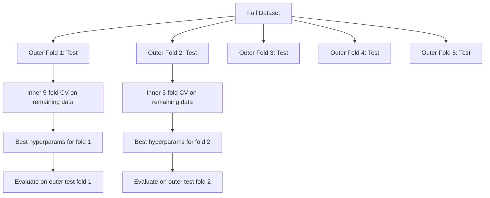

# 超参数调优（Hyperparameter Tuning）

> 超参数是你在训练开始前转动的旋钮。转得好不好，决定模型是平庸还是出色。

**Type:** Build
**Language:** Python
**Prerequisites:** Phase 2, Lesson 11 (Ensemble Methods)
**Time:** ~90 minutes

## 学习目标（Learning Objectives）

- 从零实现网格搜索、随机搜索和贝叶斯优化，并比较它们的样本效率
- 解释当大多数超参数的有效维度很低时，为什么随机搜索优于网格搜索
- 构建一个由代理模型（surrogate model）和采集函数（acquisition function）引导搜索的贝叶斯优化循环
- 设计一套通过适当交叉验证避免对验证集过拟合的超参数调优策略

## 问题（The Problem）

你的梯度提升模型有学习率、树的数量、最大深度、每个叶节点的最小样本数、子采样比例和列采样比例。这是 6 个超参数。如果每个有 5 个合理取值，网格就有 5^6 = 15,625 种组合。训练一次要 10 秒，全部试完需要 43 小时的算力。

网格搜索是最直观的做法，也是规模大时最糟的做法。随机搜索用更少的算力做得更好。贝叶斯优化还能从过去的评估中学习，做得更好。知道该用哪种策略、哪些超参数真正重要，能省下好几天被浪费的 GPU 时间。

## 核心概念（The Concept）

### 参数与超参数（Parameters vs Hyperparameters）

参数（parameter）在训练过程中学习得到（权重、偏置、分裂阈值）。超参数（hyperparameter）在训练开始前设定，控制学习如何进行。

| 超参数 | 控制什么 | 典型范围 |
|---------------|-----------------|---------------|
| 学习率 | 每次更新的步长 | 0.001 到 1.0 |
| 树的数量/epoch 数 | 训练多久 | 10 到 10,000 |
| 最大深度 | 模型复杂度 | 1 到 30 |
| 正则化（lambda） | 防止过拟合 | 0.0001 到 100 |
| 批大小（batch size） | 梯度估计噪声 | 16 到 512 |
| Dropout 率 | 被丢弃的神经元比例 | 0.0 到 0.5 |

### 网格搜索（Grid Search）

网格搜索评估指定值的每一种组合。它穷尽一切、容易理解，但计算量随超参数数量指数增长。

```
Grid for 2 hyperparameters:

  learning_rate: [0.01, 0.1, 1.0]
  max_depth:     [3, 5, 7]

  Evaluations: 3 x 3 = 9 combinations

  (0.01, 3)  (0.01, 5)  (0.01, 7)
  (0.1,  3)  (0.1,  5)  (0.1,  7)
  (1.0,  3)  (1.0,  5)  (1.0,  7)
```

网格搜索有一个根本缺陷：如果一个超参数重要而另一个不重要，大多数评估都被浪费了。9 次评估只换来重要参数的 3 个不同取值。

### 随机搜索（Random Search）

随机搜索从分布中采样超参数，而不是遍历网格。同样 9 次评估的预算，每个超参数却能得到 9 个不同取值。



随机搜索为什么胜过网格搜索（Bergstra & Bengio, 2012）：

- 大多数超参数的有效维度很低。对给定问题，6 个超参数中通常只有 1-2 个真正重要。
- 网格搜索把评估浪费在不重要的维度上。
- 同样的预算下，随机搜索对重要维度的覆盖更密集。
- 60 次随机试验后，你有 95% 的概率找到一个距最优值 5% 以内的点（前提是搜索空间中存在这样的点）。

### 贝叶斯优化（Bayesian Optimization）

随机搜索无视结果。它不会学到“学习率太大会发散”或“深度 3 始终优于深度 10”。贝叶斯优化（Bayesian optimization）利用过去的评估来决定下一步在哪里搜索。



两个关键组件：

**代理模型（surrogate model）：**一个评估代价很低的模型（通常是高斯过程），用来近似昂贵的目标函数。它在搜索空间的任意一点都能同时给出预测和不确定性估计。

**采集函数（acquisition function）：**在利用（exploitation，在已知的好点附近搜索）和探索（exploration，在不确定性高的地方搜索）之间权衡，决定下一步在哪里评估。常见选择：

- **期望改进（Expected Improvement，EI）：**在这一点上，我们期望比当前最优改进多少？
- **置信上界（Upper Confidence Bound，UCB）：**预测加上不确定性的某个倍数。UCB 高意味着要么有前景，要么尚未被探索。
- **改进概率（Probability of Improvement，PI）：**这个点超过当前最优的概率是多少？

贝叶斯优化通常用比随机搜索少 2-5 倍的评估次数找到更好的超参数。相比训练真实模型，拟合代理模型的开销可以忽略不计。

### 早停（Early Stopping）

不是每次训练都要跑完。如果一个配置在 10 个 epoch 后明显很差，就停掉它，继续下一个。这就是超参数搜索语境下的早停（early stopping）。

策略：
- **基于耐心值（patience）：**验证损失连续 N 个 epoch 没有改善就停止
- **中位数剪枝（median pruning）：**如果试验的中间结果差于同一步已完成试验的中位数，就停止
- **Hyperband：**给许多配置分配小预算，然后逐步给最好的那些增加预算

Hyperband 特别有效。它以每个 1 epoch 启动 81 个配置，保留前三分之一，给它们 3 个 epoch，再保留前三分之一，依此类推。相比让所有配置跑满完整预算，它找到好配置的速度快 10-50 倍。

### 学习率调度器（Learning Rate Schedulers）

学习率几乎总是最重要的超参数。与其保持固定，不如让调度器在训练过程中调整它。

| 调度器 | 公式 | 何时使用 |
|-----------|---------|-------------|
| 阶梯衰减（step decay） | 每 N 个 epoch 乘以 0.1 | 经典 CNN 训练 |
| 余弦退火（cosine annealing） | lr * 0.5 * (1 + cos(pi * t / T)) | 现代默认选择 |
| 预热 + 衰减（warmup + decay） | 先线性上升再余弦衰减 | Transformer |
| One-cycle | 一个周期内先升后降 | 快速收敛 |
| 平台期缩减（reduce on plateau） | 指标停滞时按比例缩减 | 安全的默认选择 |

### 超参数重要性（Hyperparameter Importance）

并非所有超参数都同等重要。对随机森林（Probst et al., 2019）和梯度提升的研究显示出一致的模式：

**高重要性：**
- 学习率（永远最先调）
- 估计器数量 / epoch 数（用早停代替调参）
- 正则化强度

**中等重要性：**
- 最大深度 / 层数
- 每叶最小样本数 / 权重衰减（weight decay）
- 子采样比例

**低重要性：**
- 最大特征数（随机森林的 max_features）
- 具体激活函数的选择
- 批大小（在合理范围内）

先调重要的，其余保持默认。

### 实用策略（Practical Strategy）



具体工作流：

1. **从库的默认值开始。** 它们由经验丰富的从业者选定，往往已经达到 80% 的效果。
2. **粗粒度随机搜索。** 宽范围，20-50 次试验。用早停快速淘汰糟糕的运行。
3. **分析结果。** 哪些超参数与性能相关？缩小搜索空间。
4. **细粒度搜索。** 在缩小后的空间里做贝叶斯优化或聚焦的随机搜索。50-100 次试验。
5. **用找到的最优超参数在全部训练数据上重新训练。**

### 与交叉验证结合（Cross-Validation Integration）

在单一验证切分上调超参数有风险。最好的超参数可能对这个特定的验证折过拟合。嵌套交叉验证（nested cross-validation）用两层循环解决这个问题：

- **外层循环**（评估）：把数据分成 train+val 和 test。报告无偏的性能。
- **内层循环**（调参）：把 train+val 分成 train 和 val。寻找最优超参数。



每个外层折独立找到自己的最优超参数。外层分数是对泛化性能的无偏估计。

用 sklearn：

```python
from sklearn.model_selection import cross_val_score, GridSearchCV
from sklearn.ensemble import GradientBoostingRegressor

inner_cv = GridSearchCV(
    GradientBoostingRegressor(),
    param_grid={
        "learning_rate": [0.01, 0.05, 0.1],
        "max_depth": [2, 3, 5],
        "n_estimators": [50, 100, 200],
    },
    cv=5,
    scoring="neg_mean_squared_error",
)

outer_scores = cross_val_score(
    inner_cv, X, y, cv=5, scoring="neg_mean_squared_error"
)

print(f"Nested CV MSE: {-outer_scores.mean():.4f} +/- {outer_scores.std():.4f}")
```

这很昂贵（5 个外层折 x 5 个内层折 x 27 个网格点 = 675 次模型拟合），但能给你一个可信的性能估计。在论文中报告最终结果、或决策赌注很高时使用它。

### 实用技巧（Practical Tips）

**从学习率开始。** 对基于梯度的方法，它永远是最重要的超参数。学习率不对，其他一切都无从谈起。先把其他超参数固定为默认值，最先扫学习率。

**对学习率和正则化使用对数均匀分布。** 0.001 与 0.01 之间的差异，和 0.1 与 1.0 之间的差异同等重要。线性搜索会把预算浪费在大数值一端。

**用早停代替调节 n_estimators。** 对 boosting 和神经网络，把 n_estimators 或 epochs 设得很高，让早停决定何时停止。这样就从搜索中去掉了一个超参数。

**预算分配。** 把 60% 的调参预算花在最重要的 2 个超参数上，剩下的 40% 花在其他所有超参数上。前 2 个贡献了大部分性能变化。

**尺度很重要。** 绝不要在对数尺度上搜索批大小（16、32、64 这样就行）。学习率则永远要在对数尺度上搜索。让搜索分布与超参数影响模型的方式相匹配。

| 模型类型 | 最重要的超参数 | 推荐搜索方式 | 预算 |
|-----------|--------------------|--------------------|--------|
| 随机森林 | n_estimators, max_depth, min_samples_leaf | 随机搜索，50 次试验 | 低（训练快） |
| 梯度提升 | learning_rate, n_estimators, max_depth | 贝叶斯，100 次试验 + 早停 | 中 |
| 神经网络 | learning_rate, weight_decay, batch_size | 贝叶斯或随机，100+ 次试验 | 高（训练慢） |
| SVM | C, gamma（RBF 核） | 对数尺度网格，25-50 次试验 | 低（2 个参数） |
| Lasso/Ridge | alpha | 对数尺度一维搜索，20 次试验 | 非常低 |
| XGBoost | learning_rate, max_depth, subsample, colsample | 贝叶斯，100-200 次试验 + 早停 | 中 |

**拿不准时：** 用随机搜索，试验次数取超参数数量的 2 倍（例如 6 个超参数 = 至少 12 次试验）。你会惊讶地发现，50 次试验的随机搜索有多频繁地击败精心设计的网格搜索。

```figure
k-fold-cv
```

## 动手实现（Build It）

### 第 1 步：从零实现网格搜索（Step 1: Grid Search from Scratch）

`code/tuning.py` 中的代码从零实现了网格搜索、随机搜索和一个简单的贝叶斯优化器。

```python
def grid_search(model_fn, param_grid, X_train, y_train, X_val, y_val):
    keys = list(param_grid.keys())
    values = list(param_grid.values())
    best_score = -float("inf")
    best_params = None
    n_evals = 0

    for combo in itertools.product(*values):
        params = dict(zip(keys, combo))
        model = model_fn(**params)
        model.fit(X_train, y_train)
        score = evaluate(model, X_val, y_val)
        n_evals += 1

        if score > best_score:
            best_score = score
            best_params = params

    return best_params, best_score, n_evals
```

### 第 2 步：从零实现随机搜索（Step 2: Random Search from Scratch）

```python
def random_search(model_fn, param_distributions, X_train, y_train,
                  X_val, y_val, n_iter=50, seed=42):
    rng = np.random.RandomState(seed)
    best_score = -float("inf")
    best_params = None

    for _ in range(n_iter):
        params = {k: sample(v, rng) for k, v in param_distributions.items()}
        model = model_fn(**params)
        model.fit(X_train, y_train)
        score = evaluate(model, X_val, y_val)

        if score > best_score:
            best_score = score
            best_params = params

    return best_params, best_score, n_iter
```

### 第 3 步：贝叶斯优化（简化版）（Step 3: Bayesian Optimization (Simplified)）

核心思想：对观测到的（超参数，分数）对拟合一个高斯过程，然后用采集函数决定下一步去哪里找。

```python
class SimpleBayesianOptimizer:
    def __init__(self, search_space, n_initial=5):
        self.search_space = search_space
        self.n_initial = n_initial
        self.X_observed = []
        self.y_observed = []

    def _kernel(self, x1, x2, length_scale=1.0):
        dists = np.sum((x1[:, None, :] - x2[None, :, :]) ** 2, axis=2)
        return np.exp(-0.5 * dists / length_scale ** 2)

    def _fit_gp(self, X_new):
        X_obs = np.array(self.X_observed)
        y_obs = np.array(self.y_observed)
        y_mean = y_obs.mean()
        y_centered = y_obs - y_mean

        K = self._kernel(X_obs, X_obs) + 1e-4 * np.eye(len(X_obs))
        K_star = self._kernel(X_new, X_obs)

        L = np.linalg.cholesky(K)
        alpha = np.linalg.solve(L.T, np.linalg.solve(L, y_centered))
        mu = K_star @ alpha + y_mean

        v = np.linalg.solve(L, K_star.T)
        var = 1.0 - np.sum(v ** 2, axis=0)
        var = np.maximum(var, 1e-6)

        return mu, var

    def _expected_improvement(self, mu, var, best_y):
        sigma = np.sqrt(var)
        z = (mu - best_y) / (sigma + 1e-10)
        ei = sigma * (z * norm_cdf(z) + norm_pdf(z))
        return ei

    def suggest(self):
        if len(self.X_observed) < self.n_initial:
            return sample_random(self.search_space)

        candidates = [sample_random(self.search_space) for _ in range(500)]
        X_cand = np.array([to_vector(c) for c in candidates])
        mu, var = self._fit_gp(X_cand)
        ei = self._expected_improvement(mu, var, max(self.y_observed))
        return candidates[np.argmax(ei)]

    def observe(self, params, score):
        self.X_observed.append(to_vector(params))
        self.y_observed.append(score)
```

GP 代理在每个候选点给出两样东西：预测分数（mu）和不确定性（var）。期望改进在这两者之间取得平衡：它偏爱模型预测高分或者不确定性高的点。早期大多数点的不确定性都很高，优化器在探索；后期它聚焦于最有希望的区域。

### 第 4 步：比较所有方法（Step 4: Compare All Methods）

在同一个合成目标上运行这三种方法并比较。这个比较使用了一个简化包装器，直接用目标函数调用每个优化器（不训练模型），所以这里的 API 与上面基于模型的实现不同：

```python
def synthetic_objective(params):
    lr = params["learning_rate"]
    depth = params["max_depth"]
    return -(np.log10(lr) + 2) ** 2 - (depth - 4) ** 2 + 10

param_grid = {
    "learning_rate": [0.001, 0.01, 0.1, 1.0],
    "max_depth": [2, 3, 4, 5, 6, 7, 8],
}

grid_best = None
grid_score = -float("inf")
grid_history = []
for combo in itertools.product(*param_grid.values()):
    params = dict(zip(param_grid.keys(), combo))
    score = synthetic_objective(params)
    grid_history.append((params, score))
    if score > grid_score:
        grid_score = score
        grid_best = params

param_dist = {
    "learning_rate": ("log_float", 0.001, 1.0),
    "max_depth": ("int", 2, 8),
}

rand_best = None
rand_score = -float("inf")
rand_history = []
rng = np.random.RandomState(42)
for _ in range(28):
    params = {k: sample(v, rng) for k, v in param_dist.items()}
    score = synthetic_objective(params)
    rand_history.append((params, score))
    if score > rand_score:
        rand_score = score
        rand_best = params

optimizer = SimpleBayesianOptimizer(param_dist, n_initial=5)
bayes_history = []
for _ in range(28):
    params = optimizer.suggest()
    score = synthetic_objective(params)
    optimizer.observe(params, score)
    bayes_history.append((params, score))
bayes_score = max(s for _, s in bayes_history)

print(f"{'Method':<20} {'Best Score':>12} {'Evaluations':>12}")
print("-" * 50)
print(f"{'Grid Search':<20} {grid_score:>12.4f} {len(grid_history):>12}")
print(f"{'Random Search':<20} {rand_score:>12.4f} {len(rand_history):>12}")
print(f"{'Bayesian Opt':<20} {bayes_score:>12.4f} {len(bayes_history):>12}")
```

同样的预算下，贝叶斯优化通常最快找到最好的分数，因为它不会把评估浪费在明显糟糕的区域。随机搜索比网格搜索覆盖面更广。网格搜索只有在你超参数极少、又负担得起穷举时才占优。

## 用起来（Use It）

### Optuna 实战（Optuna in Practice）

Optuna 是认真做超参数调优时推荐的库。它开箱即用地支持剪枝、分布式搜索和可视化。

```python
import optuna

def objective(trial):
    lr = trial.suggest_float("learning_rate", 1e-4, 1e-1, log=True)
    n_est = trial.suggest_int("n_estimators", 50, 500)
    max_depth = trial.suggest_int("max_depth", 2, 10)

    model = GradientBoostingRegressor(
        learning_rate=lr,
        n_estimators=n_est,
        max_depth=max_depth,
    )
    model.fit(X_train, y_train)
    return mean_squared_error(y_val, model.predict(X_val))

study = optuna.create_study(direction="minimize")
study.optimize(objective, n_trials=100)

print(f"Best params: {study.best_params}")
print(f"Best MSE: {study.best_value:.4f}")
```

Optuna 的关键特性：
- `suggest_float(..., log=True)` 用于最好在对数尺度上搜索的参数（学习率、正则化）
- `suggest_int` 用于整数参数
- `suggest_categorical` 用于离散选择
- 内置 MedianPruner，可对糟糕的试验早停
- `study.trials_dataframe()` 用于分析

### Optuna 与剪枝（Optuna with Pruning）

剪枝（pruning）会提前停止没有希望的试验，节省大量算力。模式如下：

```python
import optuna
from sklearn.model_selection import cross_val_score

def objective(trial):
    params = {
        "learning_rate": trial.suggest_float("lr", 1e-4, 0.5, log=True),
        "max_depth": trial.suggest_int("max_depth", 2, 10),
        "n_estimators": trial.suggest_int("n_estimators", 50, 500),
        "subsample": trial.suggest_float("subsample", 0.5, 1.0),
    }

    model = GradientBoostingRegressor(**params)
    scores = cross_val_score(model, X_train, y_train, cv=3,
                             scoring="neg_mean_squared_error")
    mean_score = -scores.mean()

    trial.report(mean_score, step=0)
    if trial.should_prune():
        raise optuna.TrialPruned()

    return mean_score

pruner = optuna.pruners.MedianPruner(n_startup_trials=10, n_warmup_steps=5)
study = optuna.create_study(direction="minimize", pruner=pruner)
study.optimize(objective, n_trials=200)
```

`MedianPruner` 会在某个试验的中间值差于同一步所有已完成试验的中位数时停止它。剪枝需要调用 `trial.report()` 上报中间指标，并调用 `trial.should_prune()` 检查试验是否应被停止。`n_startup_trials=10` 确保至少 10 个试验完整跑完后剪枝才生效。这通常能节省 40-60% 的总算力。

### sklearn 内置的调参器（sklearn's Built-in Tuners）

做快速实验时，sklearn 提供 `GridSearchCV`、`RandomizedSearchCV` 和 `HalvingRandomSearchCV`：

```python
from sklearn.model_selection import RandomizedSearchCV
from scipy.stats import loguniform, randint

param_dist = {
    "learning_rate": loguniform(1e-4, 0.5),
    "max_depth": randint(2, 10),
    "n_estimators": randint(50, 500),
}

search = RandomizedSearchCV(
    GradientBoostingRegressor(),
    param_dist,
    n_iter=100,
    cv=5,
    scoring="neg_mean_squared_error",
    random_state=42,
    n_jobs=-1,
)
search.fit(X_train, y_train)
print(f"Best params: {search.best_params_}")
print(f"Best CV MSE: {-search.best_score_:.4f}")
```

学习率和正则化用 scipy 的 `loguniform`。整数超参数用 `randint`。`n_jobs=-1` 标志会在所有 CPU 核上并行。

### 超参数调优的常见错误（Common Mistakes in Hyperparameter Tuning）

**预处理造成的数据泄漏。** 如果你在交叉验证之前就在完整数据集上拟合了缩放器，验证折的信息就泄漏进了训练。一定要把预处理放进 `Pipeline`，让它只在训练折上拟合。

**对验证集过拟合。** 跑几千次试验实际上就是在验证集上训练。最终性能估计要用嵌套交叉验证，或者单独留出一个调参期间绝不触碰的测试集。

**搜索范围太窄。** 如果最优值出现在搜索空间的边界上，说明你搜得不够宽。最优值可能在你的范围之外。一定要检查最优参数是否贴着边缘。

**忽视交互效应。** 在 boosting 中，学习率和估计器数量强烈交互。学习率低就需要更多估计器。分开调的效果不如一起调。

**迭代模型不用早停。** 对梯度提升和神经网络，把 n_estimators 或 epochs 设成高值，然后使用早停。这严格优于把迭代次数当作超参数来调。

## 练习（Exercises）

1. 用相同的总预算（例如 50 次评估）运行网格搜索和随机搜索。比较两者找到的最好分数。换不同的种子把实验跑 10 遍。随机搜索多少次获胜？

2. 从零实现 Hyperband。从 81 个配置开始，每个训练 1 个 epoch。每轮保留前 1/3 并把它们的预算增至三倍。比较总算力（所有配置的 epoch 总和）与让 81 个配置跑满完整预算的开销。

3. 给第 11 课的梯度提升实现加上学习率调度器（余弦退火）。与固定学习率相比有帮助吗？

4. 用 Optuna 在真实数据集（例如 sklearn 的乳腺癌数据集）上调优一个 RandomForestClassifier。用 `optuna.visualization.plot_param_importances(study)` 看哪些超参数最重要。结果与本课的重要性排序一致吗？

5. 实现一个简单的采集函数（期望改进 EI），演示探索与利用的对比。画出代理模型的均值和不确定性，并标出 EI 下一步选择评估的位置。

## 关键术语（Key Terms）

| 术语 | 人们常说 | 实际含义 |
|------|----------------|----------------------|
| 超参数（hyperparameter） | “你自己选的设置” | 训练前设定、控制学习过程的值，不是从数据中学到的 |
| 网格搜索（grid search） | “每个组合都试一遍” | 在指定参数网格上穷举搜索。代价指数增长。 |
| 随机搜索（random search） | “随便采样” | 从分布中采样超参数。比网格搜索更好地覆盖重要维度。 |
| 贝叶斯优化（Bayesian optimization） | “聪明地搜索” | 用目标的代理模型决定下一步在哪里评估，在探索与利用之间权衡 |
| 代理模型（surrogate model） | “廉价的近似” | 一个（通常是高斯过程的）模型，根据已观测的评估来近似昂贵的目标函数 |
| 采集函数（acquisition function） | “下一步去哪找” | 通过权衡期望改进与不确定性给候选点打分。EI 和 UCB 是常见选择。 |
| 早停（early stopping） | “别浪费时间了” | 当验证性能不再提升时提前终止训练 |
| Hyperband | “配置的淘汰赛” | 自适应资源分配：先给许多配置小预算，保留最好的并增加它们的预算 |
| 学习率调度器（learning rate scheduler） | “训练中改变学习率” | 在训练过程中调整学习率以获得更好收敛的函数 |

## 延伸阅读（Further Reading）

- [Bergstra & Bengio: Random Search for Hyper-Parameter Optimization (2012)](https://jmlr.org/papers/v13/bergstra12a.html) -- 证明随机搜索胜过网格搜索的论文
- [Snoek et al., Practical Bayesian Optimization of Machine Learning Algorithms (2012)](https://arxiv.org/abs/1206.2944) -- 面向机器学习的贝叶斯优化
- [Li et al., Hyperband: A Novel Bandit-Based Approach (2018)](https://jmlr.org/papers/v18/16-558.html) -- Hyperband 论文
- [Optuna: A Next-generation Hyperparameter Optimization Framework](https://arxiv.org/abs/1907.10902) -- Optuna 论文
- [Probst et al., Tunability: Importance of Hyperparameters (2019)](https://jmlr.org/papers/v20/18-444.html) -- 哪些超参数重要
