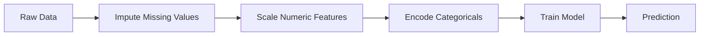
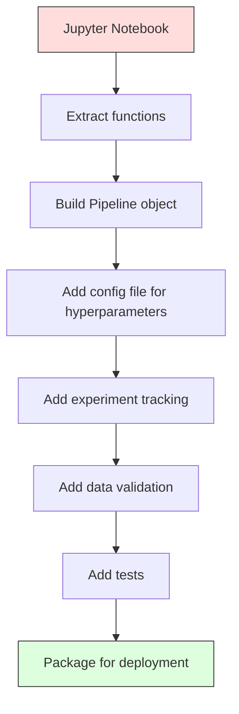

# 机器学习流水线（ML Pipelines）

> 模型本身不是产品，流水线才是。流水线涵盖了从原始数据到上线预测的全部环节，其中每一步都必须可复现。

**Type:** Build
**Language:** Python
**Prerequisites:** Phase 2, Lesson 12 (Hyperparameter Tuning)
**Time:** ~120 minutes

## 学习目标（Learning Objectives）

- 从零构建一个 ML 流水线（pipeline），把插补（imputation）、缩放（scaling）、编码（encoding）和模型训练串成一个可复现的对象
- 识别数据泄漏（data leakage）场景，并解释流水线如何通过只在训练数据上拟合转换器（transformer）来防止泄漏
- 构建一个 ColumnTransformer，对数值特征和类别特征应用不同的预处理
- 实现流水线序列化，并演示同一个已拟合的流水线在训练和生产中产生完全相同的结果

## 问题（The Problem）

你有一个 notebook：加载数据、用中位数填充缺失值、缩放特征、训练模型、打印准确率。它能跑，于是你把它上线了。

一个月后，有人重新训练模型，却得到了不同的结果。中位数是在包含测试数据的完整数据集上算出来的（数据泄漏）。缩放参数没有被保存，推理时用的是另一套统计量。特征工程代码在训练和服务两条路径之间靠复制粘贴维护，两份拷贝逐渐分道扬镳。某个类别列在生产环境里出现了编码器从未见过的新取值。

这些都不是假设，而是 ML 系统在生产环境中最常见的失败原因。流水线把每一个转换步骤打包进一个有序、可复现的单一对象，一举解决上述所有问题。

## 概念（The Concept）

### 流水线是什么（What a Pipeline Is）

流水线是一串有序的数据变换，后面接一个模型。每一步把上一步的输出作为输入。整条流水线只在训练数据上拟合一次。推理时，同一个已拟合的流水线对新数据施加相同的变换并给出预测。



流水线保证：
- 变换只在训练数据上拟合（无泄漏）
- 推理时施加相同的变换
- 整个对象可以序列化为一个制品进行部署
- 交叉验证按折（fold）套用整条流水线，防止隐蔽的泄漏

### 数据泄漏：沉默的杀手（Data Leakage: The Silent Killer）

当测试集或未来数据的信息混入训练时，就发生了数据泄漏。流水线能防止最常见的形式。

**有泄漏（错误做法）：**
```python
X = df.drop("target", axis=1)
y = df["target"]

scaler = StandardScaler()
X_scaled = scaler.fit_transform(X)

X_train, X_test = X_scaled[:800], X_scaled[800:]
y_train, y_test = y[:800], y[800:]
```

缩放器看到了测试数据。均值和标准差里混进了测试样本，这会虚高准确率估计。

**正确做法：**
```python
X_train, X_test = X[:800], X[800:]

scaler = StandardScaler()
X_train_scaled = scaler.fit_transform(X_train)
X_test_scaled = scaler.transform(X_test)
```

有了流水线，你根本不用操心这些，流水线会自动处理。

### sklearn 的 Pipeline（sklearn Pipeline）

sklearn 的 `Pipeline` 把转换器（transformer）和一个估计器（estimator）串起来。它暴露 `.fit()`、`.predict()` 和 `.score()`，按顺序执行所有步骤。

```python
from sklearn.pipeline import Pipeline
from sklearn.preprocessing import StandardScaler
from sklearn.linear_model import LogisticRegression

pipe = Pipeline([
    ("scaler", StandardScaler()),
    ("model", LogisticRegression()),
])

pipe.fit(X_train, y_train)
predictions = pipe.predict(X_test)
```

当你调用 `pipe.fit(X_train, y_train)` 时：
1. 缩放器对 X_train 调用 `fit_transform`
2. 模型对缩放后的 X_train 调用 `fit`

当你调用 `pipe.predict(X_test)` 时：
1. 缩放器对 X_test 调用 `transform`（不是 fit_transform）
2. 模型对缩放后的 X_test 调用 `predict`

拟合过程中缩放器从不接触测试数据。这就是全部意义所在。

### ColumnTransformer：不同列、不同流水线（ColumnTransformer: Different Pipelines for Different Columns）

真实数据集里既有数值列也有类别列，需要不同的预处理。`ColumnTransformer` 就是干这个的。

```python
from sklearn.compose import ColumnTransformer
from sklearn.preprocessing import StandardScaler, OneHotEncoder
from sklearn.impute import SimpleImputer

numeric_pipe = Pipeline([
    ("impute", SimpleImputer(strategy="median")),
    ("scale", StandardScaler()),
])

categorical_pipe = Pipeline([
    ("impute", SimpleImputer(strategy="most_frequent")),
    ("encode", OneHotEncoder(handle_unknown="ignore")),
])

preprocessor = ColumnTransformer([
    ("num", numeric_pipe, ["age", "income", "score"]),
    ("cat", categorical_pipe, ["city", "gender", "plan"]),
])

full_pipeline = Pipeline([
    ("preprocess", preprocessor),
    ("model", GradientBoostingClassifier()),
])
```

OneHotEncoder 的 `handle_unknown="ignore"` 对生产至关重要。出现新类别时（一个模型从未见过的城市），它会输出零向量而不是崩溃。

### 实验跟踪（Experiment Tracking）

流水线让训练可复现，但你还需要跟踪每次实验发生了什么：用了哪些超参数（hyperparameter）、哪个数据集版本、指标是多少、跑的是哪份代码。

**MLflow** 是最常见的开源方案：

```python
import mlflow

with mlflow.start_run():
    mlflow.log_param("max_depth", 5)
    mlflow.log_param("n_estimators", 100)
    mlflow.log_param("learning_rate", 0.1)

    pipe.fit(X_train, y_train)
    accuracy = pipe.score(X_test, y_test)

    mlflow.log_metric("accuracy", accuracy)
    mlflow.sklearn.log_model(pipe, "model")
```

每次运行都会连同参数、指标、制品和完整模型一起被记录。你可以比较各次运行、复现任意实验、部署任意模型版本。

**Weights & Biases（wandb）** 提供同样的功能，并附带托管仪表盘：

```python
import wandb

wandb.init(project="my-pipeline")
wandb.config.update({"max_depth": 5, "n_estimators": 100})

pipe.fit(X_train, y_train)
accuracy = pipe.score(X_test, y_test)

wandb.log({"accuracy": accuracy})
```

### 模型版本管理（Model Versioning）

实验跟踪之后，你还需要管理模型版本。哪个模型在生产？哪个在预发？哪个是上周的？

MLflow 的 Model Registry 提供：
- **版本跟踪：** 每个保存的模型都有版本号
- **阶段流转：** "Staging"、"Production"、"Archived"
- **审批流程：** 模型必须被显式提升到生产
- **回滚：** 立即切回之前的版本

### 用 DVC 做数据版本管理（Data Versioning with DVC）

代码用 git 做版本管理。数据也应该版本化，但 git 处理不了大文件。DVC（Data Version Control）解决了这个问题。

```
dvc init
dvc add data/training.csv
git add data/training.csv.dvc data/.gitignore
git commit -m "Track training data"
dvc push
```

DVC 把实际数据存放在远程存储（S3、GCS、Azure），在 git 里只保留一个记录哈希的小 `.dvc` 文件。当你 checkout 一个 git 提交时，`dvc checkout` 会恢复当时使用的确切数据。

这意味着每个 git 提交同时钉住了代码和数据。完全可复现。

### 可复现的实验（Reproducible Experiments）

可复现的实验需要四样东西：

1. **固定随机种子：** 为 numpy、random 和框架（torch、sklearn）设置种子
2. **锁定依赖版本：** 用 requirements.txt 或 poetry.lock 固定精确版本
3. **数据版本化：** DVC 或类似工具
4. **配置文件：** 所有超参数放进配置，不要硬编码

```python
import numpy as np
import random

def set_seed(seed=42):
    random.seed(seed)
    np.random.seed(seed)
    try:
        import torch
        torch.manual_seed(seed)
        torch.cuda.manual_seed_all(seed)
        torch.backends.cudnn.deterministic = True
    except ImportError:
        pass
```

### 从 Notebook 到生产流水线（From Notebook to Production Pipeline）



典型的演进路径：

1. **Notebook 探索：** 快速实验、可视化、特征灵感
2. **抽取函数：** 把预处理、特征工程、评估移进模块
3. **构建 Pipeline：** 把变换串成 sklearn Pipeline 或自定义类
4. **配置管理：** 把所有超参数移进 YAML/JSON 配置
5. **实验跟踪：** 加入 MLflow 或 wandb 日志
6. **数据校验：** 训练前检查模式（schema）、分布和缺失值模式
7. **测试：** 转换器的单元测试、完整流水线的集成测试
8. **部署：** 序列化流水线、包上 API（FastAPI、Flask）、容器化

### 常见的流水线错误（Common Pipeline Mistakes）

| 错误 | 为什么糟糕 | 修复办法 |
|---------|-------------|-----|
| 切分前在全量数据上拟合 | 数据泄漏 | 使用 Pipeline 配合 cross_val_score |
| 在流水线之外做特征工程 | 训练与服务时的变换不一致 | 把所有变换放进 Pipeline |
| 不处理未知类别 | 新取值导致生产崩溃 | OneHotEncoder(handle_unknown="ignore") |
| 硬编码列名 | 模式（schema）一变就崩 | 使用配置中的列名列表 |
| 不做数据校验 | 坏数据导致静默的错误预测 | 在预测前加模式校验 |
| 训练/服务偏差 | 生产中模型看到的特征不一致 | 训练与推理共用同一个 Pipeline 对象 |

```figure
f3-pipeline-flow
```

## 动手构建（Build It）

`code/pipeline.py` 中的代码从零构建一条完整的 ML 流水线：

### 第 1 步：自定义转换器（Step 1: Custom Transformer）

```python
class CustomTransformer:
    def __init__(self):
        self.means = None
        self.stds = None

    def fit(self, X):
        self.means = np.mean(X, axis=0)
        self.stds = np.std(X, axis=0)
        self.stds[self.stds == 0] = 1.0
        return self

    def transform(self, X):
        return (X - self.means) / self.stds

    def fit_transform(self, X):
        return self.fit(X).transform(X)
```

### 第 2 步：从零实现流水线（Step 2: Pipeline from Scratch）

```python
class PipelineFromScratch:
    def __init__(self, steps):
        self.steps = steps

    def fit(self, X, y=None):
        X_current = X.copy()
        for name, step in self.steps[:-1]:
            X_current = step.fit_transform(X_current)
        name, model = self.steps[-1]
        model.fit(X_current, y)
        return self

    def predict(self, X):
        X_current = X.copy()
        for name, step in self.steps[:-1]:
            X_current = step.transform(X_current)
        name, model = self.steps[-1]
        return model.predict(X_current)
```

### 第 3 步：流水线配合交叉验证（Step 3: Cross-Validation with Pipeline）

代码演示了带流水线的交叉验证如何防止数据泄漏：缩放器在每一折的训练数据上单独拟合。

### 第 4 步：用 sklearn 构建完整的生产流水线（Step 4: Full Production Pipeline with sklearn）

一条完整的流水线，包含 `ColumnTransformer`、多条预处理路径和一个模型，用规范的交叉验证和实验日志训练。

## 发布成果（Ship It）

本课产出：
- `outputs/prompt-ml-pipeline.md` -- 一个用于构建和调试 ML 流水线的技能
- `code/pipeline.py` -- 一条从零实现一直用到 sklearn 的完整流水线

## 练习（Exercises）

1. 构建一个能处理 3 个数值列、2 个类别列数据集的流水线。用 `ColumnTransformer` 对数值列做中位数插补 + 缩放，对类别列做最高频插补 + 独热编码（one-hot encoding）。用 5 折交叉验证训练。

2. 故意引入数据泄漏：切分前先在完整数据集上拟合缩放器。把有泄漏的交叉验证分数与流水线的交叉验证分数（干净）比较，差距有多大？

3. 用 `joblib.dump` 序列化你的流水线。在另一个脚本里加载并运行预测，验证预测结果完全一致。

4. 给流水线加一个自定义转换器，为两个最重要的数值列生成多项式特征（degree 2）。它应该放在流水线的哪个位置？

5. 为流水线接入 MLflow 跟踪。用不同超参数跑 5 次实验。用 MLflow UI（`mlflow ui`）比较各次运行，挑出最好的模型。

## 关键术语（Key Terms）

| 术语 | 人们的说法 | 实际含义 |
|------|----------------|----------------------|
| 流水线（Pipeline） | "一串变换加一个模型" | 由已拟合的转换器序列和一个模型构成、作为一个整体应用以防止泄漏的有序结构 |
| 数据泄漏（Data leakage） | "测试集信息泄漏进了训练" | 使用训练集之外的信息构建模型，导致性能估计虚高 |
| ColumnTransformer | "按列区分预处理" | 对不同的列子集应用不同的流水线，再合并结果 |
| 实验跟踪（Experiment tracking） | "记录你的每次运行" | 为每次训练运行记录参数、指标、制品和代码版本 |
| MLflow | "跟踪并部署模型" | 面向实验跟踪、模型注册表和部署的开源平台 |
| DVC | "数据的 git" | 大型数据文件的版本控制系统：git 里存哈希，远程存储里存数据 |
| 模型注册表（Model registry） | "模型版本目录" | 用阶段标签（staging、production、archived）跟踪模型版本的系统 |
| 训练/服务偏差（Training/serving skew） | "在 notebook 里明明是好的" | 训练与推理时数据处理方式的差异，会引发静默错误 |
| 可复现性（Reproducibility） | "同样的代码、同样的结果" | 用相同的代码、数据和配置得到完全一致结果的能力 |

## 延伸阅读（Further Reading）

- [scikit-learn Pipeline 文档](https://scikit-learn.org/stable/modules/compose.html) -- 官方流水线参考
- [MLflow 文档](https://mlflow.org/docs/latest/index.html) -- 实验跟踪与模型注册表
- [DVC 文档](https://dvc.org/doc) -- 数据版本管理
- [Sculley et al., Hidden Technical Debt in Machine Learning Systems (2015)](https://papers.nips.cc/paper/2015/hash/86df7dcfd896fcaf2674f757a2463eba-Abstract.html) -- 关于 ML 系统复杂性的开山之作
- [Google ML 最佳实践：Rules of ML](https://developers.google.com/machine-learning/guides/rules-of-ml) -- 实用的生产级 ML 建议
