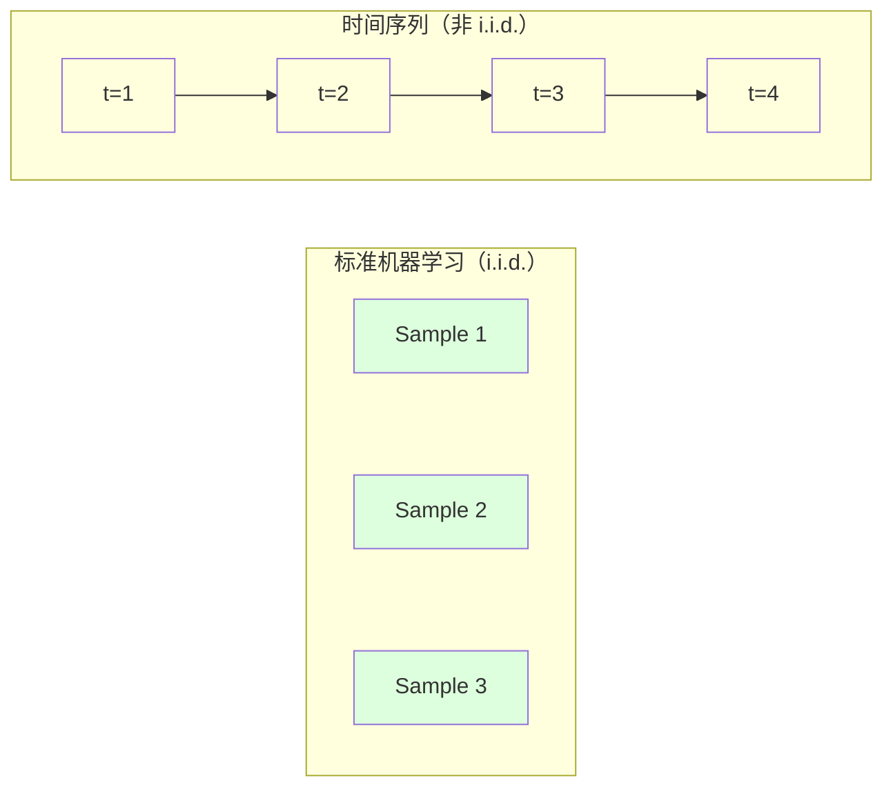
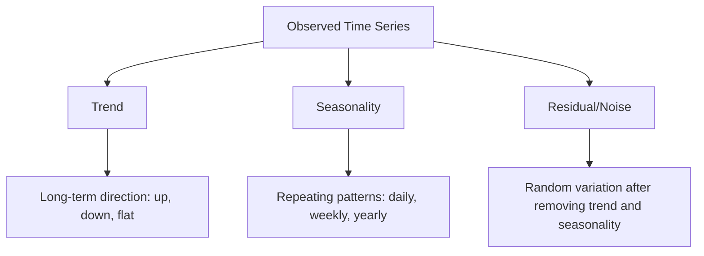
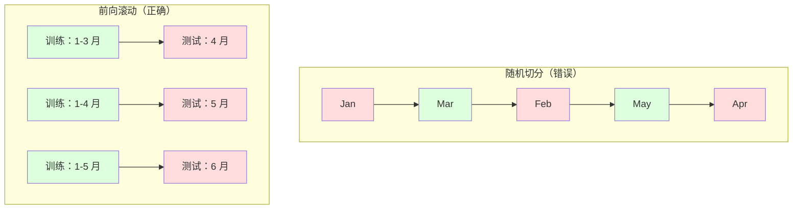

# 时间序列基础（Time Series Fundamentals）

> 过往表现确实能预测未来结果 -- 前提是你先检验了平稳性。

**Type:** Build
**Language:** Python
**Prerequisites:** Phase 2, Lessons 01-09
**Time:** ~90 minutes

## 学习目标（Learning Objectives）

- 把时间序列分解为趋势（trend）、季节性（seasonality）和残差（residual）成分，并检验平稳性（stationarity）
- 实现滞后特征（lag features）和滚动统计量，把时间序列转化为监督学习问题
- 构建前向滚动验证（walk-forward validation）框架，防止未来数据泄漏进训练集
- 解释为什么随机训练/测试切分对时间序列无效，并演示它相对规范时序切分的性能差距

## 问题（The Problem）

你手里是按时间排列的数据：日销售额、逐小时气温、每分钟 CPU 使用率、每周股价。你想预测下一个值、下一周、下一个季度。

你伸手去拿标准 ML 工具箱：随机训练/测试切分、交叉验证、特征矩阵进、预测出。每一步都是错的。

时间序列打破了标准 ML 依赖的假设。样本不独立 -- 今天的气温取决于昨天。随机切分把未来信息泄漏进过去。回测里表现亮眼的特征上线后失灵，因为它们依赖会随时间漂移的模式。

一个用随机交叉验证能到 95% 准确率的模型，换成规范的时间维度评估可能只剩 55%。这个差距不是技术细节，而是"纸上能跑的模型"和"生产中能用的模型"之间的差距。

本课讲基础：时间数据特殊在哪、如何诚实地评估模型，以及如何把时间序列变成标准 ML 模型能消化的特征。

## 概念（The Concept）

### 时间序列的特殊之处（What Makes Time Series Different）

标准 ML 假设数据独立同分布（i.i.d.，independent and identically distributed）：每个样本都从同一分布中独立抽取。时间序列两条都违反：

- **不独立。** 今天的股价取决于昨天，本周的销售额与上周相关。
- **不同分布。** 分布随时间漂移，12 月的销量和 3 月长得不一样。

这些违反都不是小事。它们改变了你构造特征的方式、评估模型的方式，以及哪些算法可用。



在标准 ML 中，样本可以互换，打乱顺序毫无影响。在时间序列中，顺序就是一切，打乱即摧毁信号。

### 时间序列的组成成分（Components of a Time Series）

每条时间序列都是以下成分的组合：



- **趋势（trend）**：长期方向。营收每年增长 10%，全球气温上升。
- **季节性（seasonality）**：固定间隔重复出现的模式。零售销量在 12 月飙升，空调使用在 7 月达到峰值。
- **残差（residual）**：去掉趋势和季节性后剩下的部分。如果残差看起来像白噪声，说明分解捕捉到了信号。

### 平稳性（Stationarity）

如果一条时间序列的统计性质（均值、方差、自相关）不随时间变化，它就是平稳的。大多数预测方法都假设平稳性。

**为什么重要：** 非平稳序列的均值在漂移。用 1 月数据训练的模型学到的均值，和 2 月将会展现的均值不同，它必然系统性地出错。

**如何检查：** 在窗口上计算滚动均值和滚动标准差。如果它们在漂移，序列就是非平稳的。

**如何修复：** 差分（differencing）。不对原始值建模，而对相邻值之间的变化建模：

```
diff[t] = value[t] - value[t-1]
```

如果一轮差分还不能让序列平稳，就再做一轮（二阶差分）。大多数真实序列最多两轮就够。

**例子：**

原序列：[100, 102, 106, 112, 120]
一次差分：[2, 4, 6, 8]（仍呈上升趋势）
二次差分：[2, 2, 2]（恒定 -- 平稳）

原序列有二次趋势。一次差分后变成线性趋势，两次差分后变成平的。实践中你很少需要超过两轮。

**正式检验：** 增广迪基-福勒检验（Augmented Dickey-Fuller, ADF）是平稳性的标准统计检验。原假设是"序列非平稳"，p 值低于 0.05 就可以拒绝原假设、认定平稳。我们不会从零实现 ADF（它需要渐近分布表），但代码中的滚动统计量方法提供了一个实用的可视化检查。

### 自相关（Autocorrelation）

自相关（autocorrelation）衡量时刻 t 的取值与 t-k 时刻（k 步之前）取值的相关程度。自相关函数（ACF）把这种相关按每个滞后阶数 k 画出来。

**ACF 告诉你：**
- 序列的记忆有多远。如果 ACF 在滞后 5 之后降到零，5 步之前的值就不相关了。
- 是否存在季节性。如果 ACF 在滞后 12 处出现尖峰（月度数据），说明有年度季节性。
- 该创建多少个滞后特征。用到 ACF 变得可忽略为止的滞后。

**PACF（偏自相关函数，Partial Autocorrelation Function）** 剔除间接相关。如果今天与 3 天前相关只是因为两者都与昨天相关，那么滞后 3 的 PACF 会是零，而 ACF 不会。

### 滞后特征：把时间序列变成监督学习（Lag Features: Turning Time Series into Supervised Learning）

标准 ML 模型需要特征矩阵 X 和目标 y，而时间序列只给你一列数值。桥梁就是滞后特征（lag features）。

取序列 [10, 12, 14, 13, 15]，构造 lag-1 和 lag-2 特征：

| lag_2 | lag_1 | target |
|-------|-------|--------|
| 10    | 12    | 14     |
| 12    | 14    | 13     |
| 14    | 13    | 15     |

现在你有了一个标准的回归问题。任何 ML 模型（线性回归、随机森林、梯度提升）都能用滞后值预测目标。

你还可以构造这些额外特征：
- **滚动统计量：** 最近 k 个值上的均值、标准差、最小值、最大值
- **日历特征：** 星期几、月份、is_holiday、is_weekend
- **差分值：** 相对上一步的变化
- **扩展统计量：** 累计均值、累计和
- **比值特征：** 当前值 / 滚动均值（离近期均值有多远）
- **交互特征：** lag_1 * day_of_week（星期几对动量的影响）

**用多少个滞后？** 看自相关函数。如果 ACF 到滞后 10 都显著，就至少用 10 个滞后。如果有周季节性，加入 lag 7（可能还有 14）。滞后越多，模型能看到的历史越多，但要拟合的特征也越多，过拟合风险随之上升。

**目标对齐陷阱。** 构造滞后特征时，目标必须是时刻 t 的值，所有特征只能用时刻 t-1 或更早的值。如果你不小心把时刻 t 的值也当成了特征，你就得到了一个"完美预测器" -- 以及一个完全无用的模型。这是时间序列特征工程中最常见的 bug。

### 前向滚动验证（Walk-Forward Validation）

这是本课最重要的概念。标准 k 折交叉验证把样本随机分给训练集和测试集，对时间序列来说，这会泄漏未来信息。



前向滚动验证：
1. 用截至时刻 t 的数据训练
2. 在时刻 t+1 做预测（多步预测则是 t+1 到 t+k）
3. 窗口向前滑动
4. 重复

每个测试折只包含晚于全部训练数据的数据，没有未来泄漏。这能给你一个诚实的估计：模型上线后会表现如何。

**扩展窗口（expanding window）** 用全部历史数据做训练（窗口不断变大）。**滑动窗口（sliding window）** 用固定大小的训练窗口（窗口向前滑）。如果你认为更早的数据仍然相关，用扩展窗口；如果世界已经变了、旧数据反而有害，用滑动窗口。

### ARIMA 直觉（ARIMA Intuition）

ARIMA 是经典的时间序列模型，由三部分组成：

- **AR（自回归，Autoregressive）：** 从过去的值预测。AR(p) 用最近 p 个值。
- **I（差分，Integrated）：** 用差分达成平稳。I(d) 做 d 轮差分。
- **MA（移动平均，Moving Average）：** 从过去的预测误差预测。MA(q) 用最近 q 个误差。

ARIMA(p, d, q) 把三者结合。p、d、q 依据 ACF/PACF 分析或自动搜索（auto-ARIMA）来选。

我们不会从零实现 ARIMA -- 它需要的数值优化超出了本课范围。关键是理解每个组件在做什么，这样你才能解读 ARIMA 的结果，并知道什么时候该用它。

### 什么时候用什么（When to Use What）

| 方法 | 最适合 | 处理季节性 | 处理外部特征 |
|----------|---------|-------------------|------------------------|
| 滞后特征 + ML | 带大量外部特征的表格数据 | 借助日历特征 | 是 |
| ARIMA | 单变量序列、短期预测 | SARIMA 变体 | 否（有限场景用 ARIMAX） |
| 指数平滑 | 简单趋势 + 季节性 | 是（Holt-Winters） | 否 |
| Prophet | 业务预测、节假日 | 是（Fourier 项） | 有限 |
| 神经网络（LSTM、Transformer） | 长序列、多序列 | 学习得到 | 是 |

对大多数实际问题，滞后特征 + 梯度提升是最强的起点：它天然支持外部特征、不要求平稳性、也容易调试。

### 预测步长与策略（Forecasting Horizons and Strategies）

单步预测向前预测一个时间步，多步预测向前预测多个时间步。有三种策略：

**递归（迭代）式：** 先预测一步，再把预测值当作下一步的输入。简单，但误差会累积 -- 每次预测都基于上一次预测，错误会复利式放大。

**直接式：** 为每个步长单独训练一个模型。Model-1 预测 t+1，Model-5 预测 t+5。没有误差累积，但每个模型的训练样本更少，彼此也不共享信息。

**多输出式：** 训练一个同时输出所有步长的模型。各步长之间共享信息，但要求模型支持多输出（或自定义损失函数）。

对大多数实际问题：短步长（1-5 步）先用递归式，更长步长用直接式。

### 时间序列的常见错误（Common Mistakes in Time Series）

| 错误 | 为什么会发生 | 如何修复 |
|---------|---------------|-----------|
| 随机训练/测试切分 | 标准 ML 的习惯 | 使用前向滚动或时序切分 |
| 使用未来特征 | 时刻 t 的特征被误加入 | 逐个审计特征的时间对齐 |
| 对季节性过拟合 | 模型记住了日历模式 | 在测试集中保留完整的一个季节周期 |
| 忽视量级变化 | 营收翻倍但模式未变 | 改为对百分比变化建模，而非绝对值 |
| 滞后特征太多 | "历史越多越好" | 用 ACF 确定相关滞后 |
| 不做差分 | "模型自己会搞明白" | 树模型能处理趋势；线性模型需要平稳性 |

```figure
f3-series-decompose
```

## 动手构建（Build It）

`code/time_series.py` 中的代码从零实现了核心构件。

### 滞后特征生成器（Lag Feature Creator）

```python
def make_lag_features(series, n_lags):
    n = len(series)
    X = np.full((n, n_lags), np.nan)
    for lag in range(1, n_lags + 1):
        X[lag:, lag - 1] = series[:-lag]
    valid = ~np.isnan(X).any(axis=1)
    return X[valid], series[valid]
```

它把一维序列变成特征矩阵：每一行用最近 `n_lags` 个值作为特征，当前值作为目标。

### 前向滚动交叉验证（Walk-Forward Cross-Validation）

```python
def walk_forward_split(n_samples, n_splits=5, min_train=50):
    assert min_train < n_samples, "min_train must be less than n_samples"
    step = max(1, (n_samples - min_train) // n_splits)
    for i in range(n_splits):
        train_end = min_train + i * step
        test_end = min(train_end + step, n_samples)
        if train_end >= n_samples:
            break
        yield slice(0, train_end), slice(train_end, test_end)
```

每个切分都保证训练数据严格早于测试数据，训练窗口随每一折扩展。

### 简单自回归模型（Simple Autoregressive Model）

纯 AR 模型就是对滞后特征做线性回归：

```python
class SimpleAR:
    def __init__(self, n_lags=5):
        self.n_lags = n_lags
        self.weights = None
        self.bias = None

    def fit(self, series):
        X, y = make_lag_features(series, self.n_lags)
        # Solve via normal equations
        X_b = np.column_stack([np.ones(len(X)), X])
        theta = np.linalg.lstsq(X_b, y, rcond=None)[0]
        self.bias = theta[0]
        self.weights = theta[1:]
        return self
```

这与第 02 课的线性回归在概念上完全一致，只是作用在同一变量的时间滞后版本上。

### 平稳性检查（Stationarity Check）

代码计算滚动统计量，从视觉和数值两方面评估平稳性：

```python
def check_stationarity(series, window=50):
    rolling_mean = np.array([
        series[max(0, i - window):i].mean()
        for i in range(1, len(series) + 1)
    ])
    rolling_std = np.array([
        series[max(0, i - window):i].std()
        for i in range(1, len(series) + 1)
    ])
    return rolling_mean, rolling_std
```

如果滚动均值在漂移或滚动标准差在变化，序列就是非平稳的。做差分后再检查。

代码还通过比较序列前半段和后半段来检查平稳性。如果均值相差超过半个标准差，或方差比超过 2 倍，序列就被标记为非平稳。

### 自相关（Autocorrelation）

```python
def autocorrelation(series, max_lag=20):
    n = len(series)
    mean = series.mean()
    var = series.var()
    acf = np.zeros(max_lag + 1)
    for k in range(max_lag + 1):
        cov = np.mean((series[:n-k] - mean) * (series[k:] - mean))
        acf[k] = cov / var if var > 0 else 0
    return acf
```

## 直接使用（Use It）

在 sklearn 中，滞后特征可以直接配合任意回归器使用：

```python
from sklearn.linear_model import Ridge
from sklearn.ensemble import GradientBoostingRegressor

X, y = make_lag_features(series, n_lags=10)

for train_idx, test_idx in walk_forward_split(len(X)):
    model = Ridge(alpha=1.0)
    model.fit(X[train_idx], y[train_idx])
    predictions = model.predict(X[test_idx])
```

ARIMA 则用 statsmodels：

```python
from statsmodels.tsa.arima.model import ARIMA

model = ARIMA(train_series, order=(5, 1, 2))
fitted = model.fit()
forecast = fitted.forecast(steps=30)
```

`time_series.py` 中的代码演示了两种方法，并用前向滚动验证比较它们。

### sklearn 的 TimeSeriesSplit（sklearn TimeSeriesSplit）

sklearn 提供了实现前向滚动验证的 `TimeSeriesSplit`：

```python
from sklearn.model_selection import TimeSeriesSplit

tscv = TimeSeriesSplit(n_splits=5)
for train_index, test_index in tscv.split(X):
    X_train, X_test = X[train_index], X[test_index]
    y_train, y_test = y[train_index], y[test_index]
    model.fit(X_train, y_train)
    score = model.score(X_test, y_test)
```

它与我们从零实现的 `walk_forward_split` 等价，但集成进了 sklearn 的交叉验证框架。你可以配合 `cross_val_score` 使用：

```python
from sklearn.model_selection import cross_val_score

scores = cross_val_score(model, X, y, cv=TimeSeriesSplit(n_splits=5))
print(f"Mean score: {scores.mean():.4f} +/- {scores.std():.4f}")
```

### 评估指标（Evaluation Metrics）

时间序列预测使用回归指标，但要带着时间维度的语境：

- **MAE（平均绝对误差）：** |y_true - y_pred| 的平均。用原始单位解释，直观。"平均而言，预测偏差 3.2 度。"
- **RMSE（均方根误差）：** 均方误差的平方根。比 MAE 更重罚大误差。当大错误比许多小错误更糟时使用。
- **MAPE（平均绝对百分比误差）：** |error / true_value| * 100 的平均。与量纲无关，适合跨序列比较。但真实值为零时无定义。
- **朴素基线对比：** 一定要和简单基线比较。季节朴素基线直接预测一个周期前的值（昨天、上周）。如果你的模型赢不了朴素基线，一定有问题。

### 滚动特征（Rolling Features）

代码演示了在滞后特征之外加入滚动统计量（7 天和 14 天窗口上的均值、标准差、最小值、最大值）。这些特征提供近期趋势和波动性的信息，是滞后特征单独捕捉不到的。

例如，滚动均值上升暗示上行趋势；滚动标准差增大暗示波动加剧。这类模式树模型能学，线性模型学不了。

## 发布成果（Ship It）

本课产出：
- `outputs/prompt-time-series-advisor.md` -- 一个用于框定时间序列问题的提示词
- `code/time_series.py` -- 滞后特征、前向滚动验证、AR 模型、平稳性检查

### 你必须打败的基线（Baselines You Must Beat）

构建任何模型之前，先立好基线：

1. **最后一个值（持续性基线）。** 预测明天和今天一样。对许多序列来说，它出奇地难打败。
2. **季节朴素基线。** 预测今天与上周（或去年）同一天相同。如果你的模型赢不了它，说明它除了季节性之外什么有用模式都没学到。
3. **移动平均。** 预测最近 k 个值的平均。能平滑噪声，但捕捉不到突变。

如果你的高级 ML 模型输给了季节朴素基线，那就是有 bug。最常见的原因：特征里泄漏了未来、评估方法不对，或者序列本身就是纯随机、不可预测的。

### 实用建议（Practical Tips）

1. **先画图。** 建模之前先画出原始序列。找趋势、季节性、离群点、结构性突变（行为的突然改变）。30 秒的目视检查往往比一小时的自动分析告诉你更多。

2. **先差分，后建模。** 序列有清晰趋势时，先差分再构造滞后特征。树模型能处理趋势，线性模型不能，而差分从不会有害。

3. **至少留出一个完整季节周期。** 有周季节性，测试集至少要有一整个星期；月季节性则至少一整个月。否则你无法评估模型是否捕捉到了季节模式。

4. **在生产环境中监控。** 世界在变，时间序列模型会随时间退化。滚动跟踪预测误差；误差开始上升时，用近期数据重训模型。

5. **警惕体制变化（regime changes）。** 用疫情前数据训练的模型预测不了疫情后的行为。把已知体制变化的指标加进特征，或使用会遗忘旧数据的滑动窗口。

6. **对偏态序列做对数变换。** 营收、价格、计数往往右偏。取对数能稳定方差，把乘性模式变成加性模式，线性模型就能处理。在对数空间预测，再取指数回到原始单位。

## 练习（Exercises）

1. **平稳性实验。** 生成一条带线性趋势的序列，用滚动统计量检查平稳性，做一次差分，再检查。二次趋势需要几轮差分？

2. **滞后选择。** 在周期为 7 的季节序列上计算 ACF。哪些滞后的自相关最高？只用这些滞后（而非连续滞后）构造滞后特征。与用 lag 1 到 7 相比，准确率有提升吗？

3. **前向滚动对随机切分。** 在滞后特征上训练 Ridge 回归，分别用随机 80/20 切分和前向滚动验证评估。随机切分高估了多少性能？

4. **特征工程。** 在滞后特征之外加入滚动均值（window=7）、滚动标准差（window=7）和星期几特征，用前向滚动验证比较有无这些附加特征时的准确率。

5. **多步预测。** 修改 AR 模型，从预测 1 步改为预测 5 步。比较两种策略：(a) 预测一步，把预测值作为下一步输入（递归式）；(b) 为每个步长训练单独的模型（直接式）。哪种更准？

## 关键术语（Key Terms）

| 术语 | 人们的说法 | 实际含义 |
|------|----------------|----------------------|
| 平稳性（Stationarity） | "统计性质不随时间改变" | 均值、方差和自相关结构在时间上恒定的序列 |
| 差分（Differencing） | "相邻值相减" | 计算 y[t] - y[t-1] 以去除趋势、达成平稳 |
| 自相关（Autocorrelation, ACF） | "序列与自身的相关" | 时间序列与其滞后副本之间的相关，是滞后阶数的函数 |
| 偏自相关（Partial autocorrelation, PACF） | "只看直接相关" | 剔除所有更短滞后的影响后，滞后 k 处的自相关 |
| 滞后特征（Lag features） | "把过去的值当输入" | 用 y[t-1]、y[t-2]、…、y[t-k] 作为特征预测 y[t] |
| 前向滚动验证（Walk-forward validation） | "尊重时间顺序的交叉验证" | 训练数据在时间上总是早于测试数据的评估方式 |
| ARIMA | "经典时间序列模型" | 自回归差分移动平均（AutoRegressive Integrated Moving Average）：结合过去的值（AR）、差分（I）和过去的误差（MA） |
| 季节性（Seasonality） | "重复的日历模式" | 时间序列中与日历周期（日、周、年）绑定的规律性、可预测的循环 |
| 趋势（Trend） | "长期方向" | 序列水平随时间的持续上升或下降 |
| 扩展窗口（Expanding window） | "用全部历史" | 训练集随每一折增长的前向滚动验证 |
| 滑动窗口（Sliding window） | "固定大小的历史" | 训练集是固定长度、向前滑动窗口的前向滚动验证 |

## 延伸阅读（Further Reading）

- [Hyndman and Athanasopoulos, Forecasting: Principles and Practice (3rd ed.)](https://otexts.com/fpp3/) -- 最好的免费时间序列预测教材
- [scikit-learn Time Series Split](https://scikit-learn.org/stable/modules/generated/sklearn.model_selection.TimeSeriesSplit.html) -- sklearn 的前向滚动切分器
- [statsmodels ARIMA 文档](https://www.statsmodels.org/stable/generated/statsmodels.tsa.arima.model.ARIMA.html) -- 带诊断功能的 ARIMA 实现
- [Makridakis et al., The M5 Competition (2022)](https://www.sciencedirect.com/science/article/pii/S0169207021001874) -- 展示 ML 方法与统计方法对决的大规模预测竞赛
