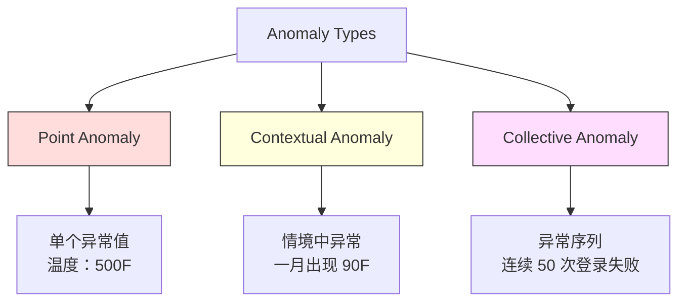
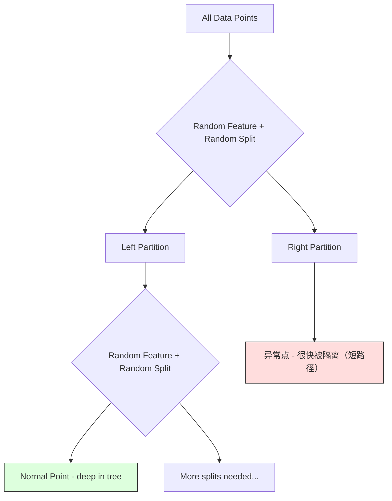
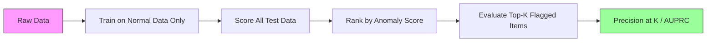

# 异常检测（Anomaly Detection）

> 正常容易定义，异常就是一切塞不进"正常"里的东西。

**Type:** Build
**Language:** Python
**Prerequisites:** Phase 2, Lessons 01-09
**Time:** ~75 minutes

## 学习目标（Learning Objectives）

- 从零实现 Z-score、IQR 和孤立森林（Isolation Forest）异常检测方法
- 区分点异常（point anomaly）、情境异常（contextual anomaly）和集体异常（collective anomaly），并为每类选择合适的检测方法
- 解释为什么异常检测被框定为对"正常数据"建模，而不是对异常分类
- 比较无监督异常检测与有监督分类，并权衡对新型异常的覆盖率与精确率

## 问题（The Problem）

一张信用卡下午 2 点在纽约刷过，下午 2:05 又出现在东京。工厂传感器读数为 150 度，而正常范围是 80-120 度。一台服务器每秒收到 50,000 个请求，而日均值是 200。

这些都是异常，发现它们至关重要：欺诈造成数十亿损失，设备故障造成停机，网络入侵泄露数据。

难点在于：你几乎拿不到带标签的异常样本。欺诈只占交易的 0.1%，设备故障一年只发生几次。你没法训练标准分类器，因为"异常"类几乎没有可学习的东西。就算有一些标签，你见过的异常也不是你将来会遇到的所有类型 -- 明天的欺诈手法和今天的不一样。

异常检测把问题反过来：不去学什么是异常，而是去学什么是正常。任何偏离正常的东西都值得怀疑。这种方式不需要标签，能适应新型异常，也能扩展到海量数据。

## 概念（The Concept）

### 异常的类型（Types of Anomalies）

异常并不都一样：

- **点异常（point anomaly）。** 一个无论语境如何都反常的单点。500 度的温度读数。平时只花 $50 的账户冒出一笔 $50,000 的交易。
- **情境异常（contextual anomaly）。** 在其情境下反常的数据点。90 度的气温在夏天正常，在冬天异常。同样的值，不同的情境。
- **集体异常（collective anomaly）。** 作为整体反常的数据点序列，尽管每个点单独看可能正常。5 次登录失败是正常的，连续 50 次就是暴力破解攻击。

大多数方法检测的是点异常。情境异常需要时间或位置特征，集体异常需要具备序列感知能力的方法。



### 无监督框架（The Unsupervised Framing）

标准分类中，两个类别都有标签。异常检测中，你通常处于以下三种情况之一：

1. **完全无监督。** 完全没有标签。在全部数据上拟合检测器，祈祷异常足够稀少，不至于污染"正常"模型。
2. **半监督。** 你有一份只含正常数据的干净数据集。在这份干净数据上拟合，然后给其余所有数据打分。可行时，这是最强的设置。
3. **弱监督。** 你有少量带标签的异常。把它们用于评估而非训练：无监督训练，然后在带标签子集上度量精确率/召回率。

关键洞察：异常检测与分类有本质区别。你建模的是正常数据的分布，而不是两个类别之间的决策边界。

### 有监督与无监督：权衡（Supervised vs Unsupervised: The Tradeoff）

如果你确实有带标签的异常，应该把它们用于训练（有监督分类），还是仅用于评估（无监督检测）？

**有监督（当作分类问题）：**
- 能抓住你以前见过的那些异常类型
- 在已知异常类型上精确率更高
- 会完全漏掉新型异常
- 新异常类型出现时需要重新训练
- 需要足够的异常样本（往往太少）

**无监督（对正常建模，标记偏离）：**
- 能抓住任何对正常的偏离，包括新型异常
- 不需要带标签的异常
- 假阳性率更高（不寻常的东西未必都有害）
- 对分布漂移更稳健

实践中，最好的系统会两者结合：用无监督检测保证覆盖面，用有监督模型对付已知的高优先级异常类型，把模糊案例交给人审。

### Z-score 方法（Z-Score Method）

最简单的方法。计算每个特征的均值和标准差，标记任何偏离均值超过 k 个标准差的点。

```text
z_score = (x - mean) / std
anomaly if |z_score| > threshold
```

默认阈值是 3.0（对高斯分布，99.7% 的正常数据落在 3 个标准差之内）。

**优点：** 简单、快速、可解释（"这个值偏离正常 4.5 个标准差"）。

**缺点：** 假设数据服从正态分布。对训练数据中的离群点敏感（离群点会移动均值、抬高标准差，反而让自己更难被发现）。在多峰分布上失效。

**适用场景：** 数据近似钟形的单特征监控。服务器响应时间、制造公差、基线稳定的传感器读数。

**失效场景：** 多簇数据（两个办公室的基线温度不同）、偏态数据（$1000 的交易额罕见但并非异常）、训练集本身含离群点的数据。

### IQR 方法（IQR Method）

比 Z-score 更稳健。用四分位距（interquartile range, IQR）代替均值和标准差。

```
Q1 = 25th percentile
Q3 = 75th percentile
IQR = Q3 - Q1
lower_bound = Q1 - factor * IQR
upper_bound = Q3 + factor * IQR
anomaly if x < lower_bound or x > upper_bound
```

默认系数是 1.5。

**优点：** 对离群点稳健（分位数不受极端值影响）。适用于偏态分布。不假设正态性。

**缺点：** 只能单变量（每个特征独立应用）。检测不到"只在特征联合起来看才反常"的异常（一个点可能每个特征单独看都正常，但在联合空间里异常）。

**实践提示：** IQR 的 1.5 系数对应箱线图（box plot）的须。须外的点是潜在离群点。把 1.5 换成 3.0 会让检测器更保守（标记更少、误报更少）。合适的系数取决于你对误报的容忍度。

### 孤立森林（Isolation Forest）

关键洞察：异常既稀少又不同。在对数据做随机划分时，异常更容易被隔离 -- 把异常与剩余数据分开所需的随机切分次数更少。



**工作原理：**
1. 构建多棵随机树（即孤立森林）
2. 在每个节点，随机选一个特征，并在该特征的最小值与最大值之间随机选一个切分值
3. 持续切分，直到每个点都被隔离（独自占一个叶子）
4. 异常在所有树上的平均路径长度更短

**为什么有效：** 正常点住在稠密区域，要把它们与邻居隔开需要很多次随机切分。异常点住在稀疏区域，一两次随机切分就足以把它们隔离。

异常分数基于所有树上的平均路径长度，并用随机二叉搜索树的期望路径长度归一化：

```
score(x) = 2^(-average_path_length(x) / c(n))
```

其中 `c(n)` 是 n 个样本对应的期望路径长度。分数接近 1 是异常，接近 0.5 是正常，接近 0 则非常正常（深藏在稠密簇里）。

**优点：** 不做分布假设。适用于高维。可扩展性好（每棵树只用一个子样本，样本量上是次线性的）。能处理混合特征类型。

**缺点：** 对稠密区域中的异常无能为力（掩蔽效应）。当很多特征都不相关时，随机切分的效率下降。

**关键超参数：**
- `n_estimators`：树的数量。100 通常够用。更多树让分数更稳定，但计算更慢。
- `max_samples`：每棵树的样本数。原论文默认 256。更小的值让单棵树不够准，但增加了多样性。正是子采样让孤立森林快 -- 每棵树只看到数据的一小部分。
- `contamination`：预期的异常比例。只用于设定阈值，不影响分数本身。

### 局部离群因子（Local Outlier Factor, LOF）

LOF 把一个点周围的局部密度与它邻居周围的密度做比较。稀疏区域中被稠密区域包围的点就是异常。

**工作原理：**
1. 对每个点找出它的 k 个最近邻
2. 计算局部可达密度（邻域有多稠密）
3. 把每个点的密度与邻居的密度比较
4. 如果一个点的密度远低于邻居，它就是离群点

**LOF 分数：**
- LOF 接近 1.0 表示与邻居密度相近（正常）
- LOF 大于 1.0 表示密度低于邻居（可能异常）
- LOF 远大于 1.0（如 2.0 以上）表示密度显著更低（很可能是异常）

"局部"二字至关重要。设想一个有两簇的数据集：一个 1000 个点的稠密簇和一个 50 个点的稀疏簇。稀疏簇边缘的一个点在全局上并不稀奇 -- 它有 50 个邻居。但如果它的直接邻居比它所在处更稠密，它在局部就是反常的。LOF 捕捉的正是这种全局方法会漏掉的细微差别。

**优点：** 能检测局部异常（在自身邻域内反常、但全局未必反常的点）。适用于密度不同的簇。

**缺点：** 大数据集上很慢（朴素实现为 O(n^2)）。对 k 的选择敏感。在极高维上效果不好（维度灾难影响距离计算）。

### 对比（Comparison）

| 方法 | 假设 | 速度 | 应对高维 | 检测局部异常 |
|--------|------------|-------|-------------------|------------------------|
| Z-score | 正态分布 | 非常快 | 是（逐特征） | 否 |
| IQR | 无（逐特征） | 非常快 | 是（逐特征） | 否 |
| 孤立森林（Isolation Forest） | 无 | 快 | 是 | 部分 |
| LOF | 距离有意义 | 慢 | 差 | 是 |

### 评估的挑战（Evaluation Challenges）

评估异常检测器比评估分类器更难：

- **极端的类别不平衡。** 异常占 0.1% 时，把一切都预测成"正常"就有 99.9% 的准确率。准确率毫无用处。
- **AUROC 有误导性。** 严重不平衡时，即使在实用阈值下模型漏掉了大多数异常，AUROC 看起来也可能很不错。
- **更好的指标：** Precision@k（标记的前 k 个里有多少是真异常）、AUPRC（精确率-召回率曲线下面积），以及固定假阳性率下的召回率。



### 异常检测流水线（Anomaly Detection Pipeline）

实践中，异常检测遵循这样的流程：

1. **收集基线数据。** 理想情况是一段你知道没有（或极少）异常的时期。
2. **特征工程。** 原始特征加上派生特征（滚动统计量、时间特征、比值）。
3. **训练检测器。** 在基线数据上拟合，模型学会"正常"长什么样。
4. **给新数据打分。** 每条新观测得到一个异常分数。
5. **阈值选择。** 选定分数截断点。这是业务决策：阈值越高，误报越少，但漏掉的异常越多。
6. **告警与调查。** 被标记的点进入人工审查或自动响应。
7. **收集反馈。** 记录被标记的项目是真异常还是误报，用这些数据评估检测器并随时间调整阈值。

流水线永远没有"完工"一说。数据分布在漂移，新异常类型在涌现，阈值需要调整。把异常检测当作一个活的系统，而不是一次性模型。

```figure
f3-anomaly-fence
```

## 动手构建（Build It）

`code/anomaly_detection.py` 中的代码从零实现了 Z-score、IQR 和孤立森林。

### Z-score 检测器（Z-Score Detector）

```python
def zscore_detect(X, threshold=3.0):
    mean = X.mean(axis=0)
    std = X.std(axis=0)
    std[std == 0] = 1.0
    z = np.abs((X - mean) / std)
    return z.max(axis=1) > threshold
```

简单且已向量化。任一特征超过阈值就标记该点。

### IQR 检测器（IQR Detector）

```python
def iqr_detect(X, factor=1.5):
    q1 = np.percentile(X, 25, axis=0)
    q3 = np.percentile(X, 75, axis=0)
    iqr = q3 - q1
    iqr[iqr == 0] = 1.0
    lower = q1 - factor * iqr
    upper = q3 + factor * iqr
    outside = (X < lower) | (X > upper)
    return outside.any(axis=1)
```

### 从零实现孤立森林（Isolation Forest from Scratch）

从零实现构建随机划分特征空间的孤立树（isolation tree）：

```python
class IsolationTree:
    def __init__(self, max_depth):
        self.max_depth = max_depth

    def fit(self, X, depth=0):
        n, p = X.shape
        if depth >= self.max_depth or n <= 1:
            self.is_leaf = True
            self.size = n
            return self
        self.is_leaf = False
        self.feature = np.random.randint(p)
        x_min = X[:, self.feature].min()
        x_max = X[:, self.feature].max()
        if x_min == x_max:
            self.is_leaf = True
            self.size = n
            return self
        self.threshold = np.random.uniform(x_min, x_max)
        left_mask = X[:, self.feature] < self.threshold
        self.left = IsolationTree(self.max_depth).fit(X[left_mask], depth + 1)
        self.right = IsolationTree(self.max_depth).fit(X[~left_mask], depth + 1)
        return self
```

隔离一个点所需的路径长度决定它的异常分数。路径越短越异常。

`IsolationForest` 类包装多棵树：

```python
class IsolationForest:
    def __init__(self, n_estimators=100, max_samples=256, seed=42):
        self.n_estimators = n_estimators
        self.max_samples = max_samples

    def fit(self, X):
        sample_size = min(self.max_samples, X.shape[0])
        max_depth = int(np.ceil(np.log2(sample_size)))
        for _ in range(self.n_estimators):
            idx = rng.choice(X.shape[0], size=sample_size, replace=False)
            tree = IsolationTree(max_depth=max_depth)
            tree.fit(X[idx])
            self.trees.append(tree)

    def anomaly_score(self, X):
        avg_path = average path length across all trees
        scores = 2.0 ** (-avg_path / c(max_samples))
        return scores
```

归一化因子 `c(n)` 是含 n 个元素的二叉搜索树中一次不成功搜索的期望路径长度，等于 `2 * H(n-1) - 2*(n-1)/n`，其中 `H` 是调和数。这一归一化保证分数在不同规模的数据集之间可比。

### 演示场景（Demo Scenarios）

代码生成多个测试场景：

1. **单簇加离群点。** 一个二维高斯簇，异常被注入在远离中心处。所有方法在这里都应该有效。
2. **多峰数据。** 三个大小和密度不同的簇，簇之间的点是异常。Z-score 会很吃力，因为逐特征的取值范围很宽。
3. **高维数据。** 50 个特征，但异常只在其中 5 个上不同。测试各方法能否在特征子集中发现异常。

每个演示都用精确率、召回率、F1 和 Precision@k 比较所有方法。

## 直接使用（Use It）

用 sklearn（使用库实现，而非从零实现）：

```python
from sklearn.ensemble import IsolationForest
from sklearn.neighbors import LocalOutlierFactor

iso = IsolationForest(n_estimators=100, contamination=0.05, random_state=42)
iso.fit(X_train)
predictions = iso.predict(X_test)

lof = LocalOutlierFactor(n_neighbors=20, contamination=0.05, novelty=True)
lof.fit(X_train)
predictions = lof.predict(X_test)
```

注意 `contamination` 设定的是预期异常比例。设对很重要 -- 太低会漏掉异常，太高会制造误报。

`anomaly_detection.py` 中的代码在同一份数据上比较从零实现与 sklearn。

### sklearn 的 contamination 参数（sklearn Contamination Parameter）

sklearn 的 `contamination` 参数决定把连续异常分数转成二值预测的阈值，并不改变底层分数。

```python
iso_5 = IsolationForest(contamination=0.05)
iso_10 = IsolationForest(contamination=0.10)
```

两者产生的异常分数完全相同，但 `iso_5` 标记最高的 5%，`iso_10` 标记最高的 10%。如果你不知道真实异常率（通常不知道），把 contamination 设为 "auto"，直接用原始分数，再依据假阳性和假阴性的代价权衡自行设定阈值。

### 单类 SVM（One-Class SVM）

另一个值得了解的无监督异常检测器。单类 SVM（One-Class SVM）在高维特征空间中（借助核技巧）围绕正常数据拟合一个边界。

```python
from sklearn.svm import OneClassSVM

oc_svm = OneClassSVM(kernel="rbf", gamma="auto", nu=0.05)
oc_svm.fit(X_train)
predictions = oc_svm.predict(X_test)
```

`nu` 参数近似异常的比例。单类 SVM 在中小规模数据集上表现良好，但无法扩展到超大数据（核矩阵按平方增长）。

### 自编码器方法预览（Autoencoder Approach (Preview)）

自编码器（autoencoder）是学习压缩并重建数据的神经网络。在正常数据上训练；测试时异常的重建误差会很高，因为网络只学过重建正常模式。

这在第 3 阶段（深度学习）会讲，但原理相同：对正常建模，标记偏离。

### 集成异常检测（Ensemble Anomaly Detection）

正如集成方法能提升分类（第 11 课），组合多个异常检测器也能提升检测效果。最简单的做法：

1. 运行多个检测器（Z-score、IQR、孤立森林、LOF）
2. 把每个检测器的分数归一化到 [0, 1]
3. 对归一化后的分数取平均
4. 标记平均分高于阈值的点

这能减少误报，因为不同方法的失效模式不同。被全部四种方法标记的点几乎可以肯定是异常；只被一种方法标记的点，可能只是那个方法的怪癖。

更精细的集成会按每个检测器的估计可靠性加权（如有条件，在带已知异常的验证集上测得）。

### 生产环境注意事项（Production Considerations）

1. **阈值漂移。** 数据分布漂移后，固定阈值会过时。监控异常分数的分布，定期调整。
2. **告警疲劳。** 误报太多，运维人员就不看了。从高阈值起步（告警少而可靠），随着信任建立再调低。
3. **集成方法。** 生产中组合多个检测器，只有多个方法都认定异常才标记。这能显著减少误报。
4. **特征工程。** 原始特征很少够用。加入滚动统计量、比值、距上次事件的时长和领域特征。好的特征集比检测器的选择更重要。
5. **反馈闭环。** 运维人员调查被标记项目并确认或驳回后，把结果回灌进系统。随时间积累带标签数据，用于评估和改进检测器。

## 发布成果（Ship It）

本课产出：
- `outputs/skill-anomaly-detector.md` -- 一个帮你选对检测器的决策技能
- `code/anomaly_detection.py` -- 从零实现的 Z-score、IQR 和孤立森林，附 sklearn 对比

### 选择阈值（Choosing a Threshold）

异常分数是连续的，你需要一个阈值来做二值决策。这是业务决策，不是技术决策。

考虑两个场景：
- **欺诈检测。** 漏掉欺诈代价高昂（拒付、客户信任）。误报只花分析师 5 分钟调查。把阈值调低，多抓欺诈，接受更多误报。
- **设备维护。** 一次误报意味着 $50,000 的不必要停机；漏掉一次故障意味着 $500,000 的维修。把阈值设在两类成本的平衡点上。

两种场景中，最优阈值都取决于假阳性和假阴性的代价比。画出不同阈值下的精确率和召回率，叠加成本函数，选成本最低的点。

### 扩展到生产规模（Scaling to Production）

生产环境的实时异常检测：

1. **批量训练，在线打分。** 定期（每天、每周）在近期正常数据上训练模型；每条新观测到达时即时打分。
2. **特征计算必须对齐。** 如果训练时用了 30 天的滚动统计量，给新观测算特征就需要 30 天历史。把所需历史缓冲起来。
3. **分数分布监控。** 随时间跟踪异常分数的分布。如果分数中位数向上漂移，要么数据在变，要么模型过时了。
4. **可解释性。** 标记异常时要说清原因。Z-score："特征 X 高出正常 4.2 个标准差。"孤立森林："这个点平均 3.1 次切分就被隔离（正常点需要 8.5 次）。"

## 练习（Exercises）

1. **阈值调优。** 以 0.5 为步长，在 1.0 到 5.0 之间取阈值运行 Z-score 检测器，画出每个阈值下的精确率和召回率。你的数据的最佳平衡点在哪里？

2. **多变量异常。** 构造二维数据：每个特征单独看都正常，但组合起来异常（例如远离主簇对角线的点）。证明逐特征的 Z-score 会漏掉它们，而孤立森林能抓住。

3. **从零实现 LOF。** 用 k 近邻实现局部离群因子，在同一份数据上与 sklearn 的 LocalOutlierFactor 比较。分别取 k=10 和 k=50 -- k 的选择对结果影响多大？

4. **流式异常检测。** 把 Z-score 检测器改成流式版本：新点到达时更新运行均值和方差（Welford 在线算法）。在同一份数据上与批量 Z-score 比较。

5. **真实数据评估。** 拿一个带已知异常的数据集（比如 Kaggle 上的信用卡欺诈），用 precision@100、precision@500 和 AUPRC 评估全部四种方法。哪种最好？为什么？

## 关键术语（Key Terms）

| 术语 | 人们的说法 | 实际含义 |
|------|----------------|----------------------|
| 异常（Anomaly） | "离群点、不寻常的点" | 显著偏离正常数据预期模式的数据点 |
| 点异常（Point anomaly） | "单个奇怪值" | 无论语境如何都反常的单个观测 |
| 情境异常（Contextual anomaly） | "值正常，语境不对" | 在其情境（时间、位置等）下反常、但在另一情境中可能正常的观测 |
| 孤立森林（Isolation Forest） | "用随机切分找离群点" | 用随机树集成隔离异常的算法，异常所需的切分次数比正常点少 |
| 局部离群因子（Local Outlier Factor） | "和邻居比密度" | 标记局部密度远低于其邻居的点的方法 |
| Z-score | "离均值多少个标准差" | (x - mean) / std，以标准差为单位度量点离中心多远 |
| IQR | "四分位距" | Q3 - Q1，度量中间 50% 数据的散布，用于稳健的离群点检测 |
| Contamination | "预期的异常比例" | 告诉检测器应把多大比例的数据标记为异常的超参数 |
| Precision@k | "前 k 个标记里多少是真的" | 只在 k 个最可疑点上计算的精确率，对不平衡的异常检测很有用 |
| AUPRC | "精确率-召回率曲线下面积" | 跨所有阈值汇总精确率-召回率表现的指标，在不平衡数据上优于 AUROC |

## 延伸阅读（Further Reading）

- [Liu et al., Isolation Forest (2008)](https://cs.nju.edu.cn/zhouzh/zhouzh.files/publication/icdm08b.pdf) -- 孤立森林原始论文
- [Breunig et al., LOF: Identifying Density-Based Local Outliers (2000)](https://dl.acm.org/doi/10.1145/342009.335388) -- LOF 原始论文
- [scikit-learn Outlier Detection 文档](https://scikit-learn.org/stable/modules/outlier_detection.html) -- 全部 sklearn 异常检测器概览
- [Chandola et al., Anomaly Detection: A Survey (2009)](https://dl.acm.org/doi/10.1145/1541880.1541882) -- 覆盖全面的异常检测方法综述
- [Goldstein and Uchida, A Comparative Evaluation of Unsupervised Anomaly Detection Algorithms (2016)](https://journals.plos.org/plosone/article?id=10.1371/journal.pone.0152173) -- 10 种方法在真实数据集上的实证比较
