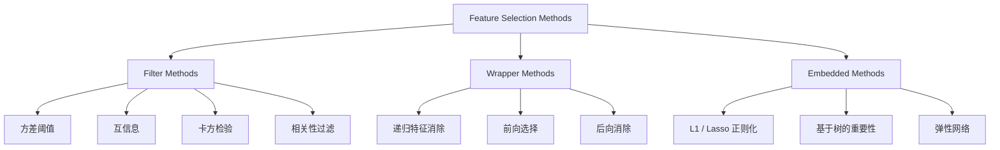
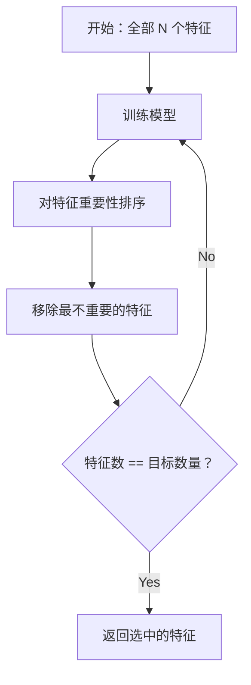
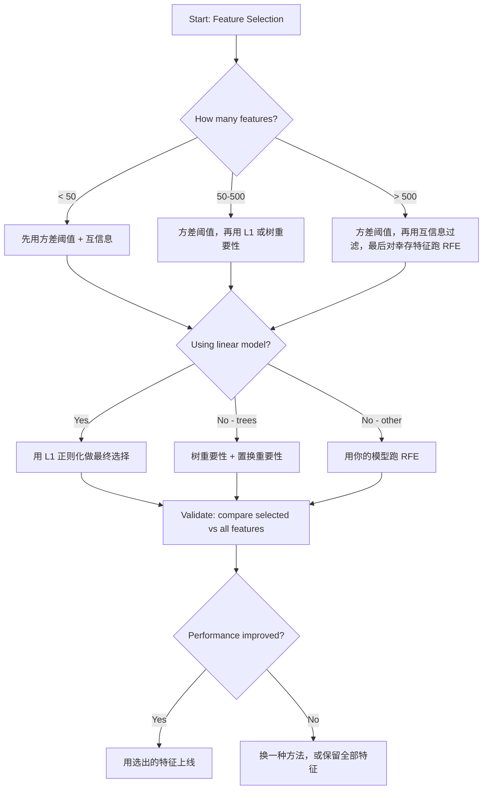

# 特征选择（Feature Selection）

> 特征不是越多越好，选对特征才更好。

**Type:** Build
**Language:** Python
**Prerequisites:** Phase 2, Lessons 01-09, 08 (feature engineering)
**Time:** ~75 minutes

## 学习目标（Learning Objectives）

- 从零实现过滤式方法（filter methods）与包裹式方法（wrapper methods），包括方差阈值（variance threshold）、互信息（mutual information）、卡方检验（chi-squared）、RFE 与前向选择（forward selection）
- 解释为什么互信息能捕捉相关系数会遗漏的、特征与目标之间的非线性关系
- 比较 L1 正则化（嵌入式选择）与 RFE（包裹式选择），并评估两者在计算开销上的权衡
- 构建一条组合多种方法的特征选择流水线，并在留出数据上证明泛化能力得到提升

## 问题所在（The Problem）

你有 500 个特征。模型训练缓慢、频繁过拟合（overfitting），没人能解释它到底学到了什么。你指望加入更多特征来提升性能，结果却更糟。

这就是维度灾难（curse of dimensionality）的实际体现。随着特征数量增长，特征空间的体积急剧膨胀，数据点变得稀疏，点与点之间的距离趋于接近。模型需要指数级更多的数据才能找到真正的规律。噪声特征淹没了信号特征，过拟合成了默认结局。

特征选择就是解药。去掉噪声，剔除冗余，只保留真正携带目标信息的特征。结果是：训练更快、泛化更好，而且模型是你真正能解释的。

目标不是用上所有可用的信息，而是用对信息。

## 核心概念（The Concept）

### 特征选择的三种类别（Three Categories of Feature Selection）

每种特征选择方法都属于以下三类之一：



**过滤式方法**用某个统计量独立地为每个特征打分，不依赖任何模型。速度快，但会遗漏特征之间的交互。

**包裹式方法**训练一个模型来评估特征子集，用模型性能作为评分。效果更好，但代价高昂，因为要多次重新训练模型。

**嵌入式方法**把特征选择融入模型训练本身。L1 正则化把权重压到零；决策树（decision tree）在最有用的特征上分裂。选择发生在拟合过程中，而不是一个独立的步骤。

### 方差阈值（Variance Threshold）

最简单的过滤式方法。如果一个特征在样本之间几乎不变，它几乎不携带任何信息。

设想一个特征，在 1000 个样本中有 999 个取值为 0.0。它的方差接近零，任何模型都无法用它区分类别。删掉它。

```
variance(x) = mean((x - mean(x))^2)
```

设定一个阈值（比如 0.01），删掉方差低于它的每个特征。这样完全不用看目标变量，就能去除常量或近似常量的特征。

何时使用：作为其他方法之前的预处理步骤，以近乎为零的成本先筛掉明显无用的特征。

局限：一个特征可能方差很高却仍是纯噪声。方差阈值是必要条件，但不是充分条件。

### 互信息（Mutual Information）

互信息衡量的是：知道特征 X 的取值之后，能在多大程度上降低对目标 Y 的不确定性。

```
I(X; Y) = sum_x sum_y p(x, y) * log(p(x, y) / (p(x) * p(y)))
```

如果 X 与 Y 相互独立，则 p(x, y) = p(x) * p(y)，对数项为零，I(X; Y) = 0。X 能告诉你的关于 Y 的信息越多，互信息就越高。

相比相关系数（correlation）的关键优势：互信息能捕捉非线性关系。一个特征与目标的相关系数可能为零，但互信息很高，因为两者之间的关系是二次的或周期性的。

对于连续特征，先离散化分箱（基于直方图的估计）。分箱数量会影响估计结果——箱太少会丢失信息，箱太多会引入噪声。常见选择：sqrt(n) 个箱，或 Sturges 规则（1 + log2(n)）。


### 递归特征消除（Recursive Feature Elimination (RFE)）

RFE 是一种包裹式方法。它利用模型自身的特征重要性来迭代式地剪枝：

1. 用全部特征训练模型
2. 按重要性对特征排序（线性模型看系数，树模型看不纯度（impurity）下降量）
3. 移除最不重要的特征
4. 重复上述过程，直到剩下目标数量的特征



RFE 会考虑特征之间的交互，因为模型是把所有剩余特征放在一起看的。移除一个特征会改变其他特征的重要性。这使它比过滤式方法更彻底。

代价是：模型要训练 N - target 次。若有 500 个特征、目标是 10 个，就要训练 490 次。对于训练开销大的模型来说，这很慢。你可以通过每步移除多个特征来提速（比如每轮移除最不重要的 10%）。

### L1（Lasso）正则化（L1 (Lasso) Regularization）

L1 正则化在损失函数（loss function）中加入权重的绝对值：

```
loss = prediction_error + alpha * sum(|w_i|)
```

alpha 参数控制剪枝的激进程度。alpha 越大，被压到恰好为零的权重就越多。

为什么恰好是零？L1 惩罚在权重空间中构造出一个菱形的约束区域，最优解往往落在菱形的角上，而角上有一个或多个权重为零。L2 正则化（ridge，岭回归）构造的是圆形约束，权重会被压缩，但很少恰好为零。

这就是嵌入式特征选择：模型在训练过程中自己学会忽略哪些特征。权重为零的特征实际上已经被移除。

优点：只需一次训练；能处理相关特征（保留一个，把其余压为零）；已内置在大多数线性模型实现中。

局限：只适用于线性模型，无法捕捉非线性的特征重要性。

### 基于树的特征重要性（Tree-Based Feature Importance）

决策树及其集成模型（随机森林、梯度提升）天然会对特征排序。每次分裂都会降低不纯度（分类用 Gini 或熵，回归用方差）。带来更大不纯度下降的特征更重要。

对于一个有 T 棵树的随机森林：

```
importance(feature_j) = (1/T) * sum over all trees of
    sum over all nodes splitting on feature_j of
        (n_samples * impurity_decrease)
```

这为每个特征给出一个归一化的重要性得分，并自动处理非线性关系和特征交互。

注意：基于树的重要性偏向于唯一取值很多的特征（高基数，high cardinality）。一个随机的 ID 列会显得很重要，因为它能把每个样本完美地分开。用置换重要性（permutation importance）做一次合理性检查。

### 置换重要性（Permutation Importance）

一种与模型无关的方法：

1. 训练模型，记录它在验证数据上的基线性能
2. 对每个特征：随机打乱它的取值，测量性能下降幅度
3. 下降越大，该特征越重要

如果打乱某个特征后性能没有受损，说明模型并不依赖它；如果性能大幅下滑，说明该特征至关重要。

置换重要性避免了基于树的重要性的基数偏差。但它很慢：每个特征要做一次完整评估，还要重复多次以保证结果稳定。

### 方法对比表（Comparison Table）

| 方法 | 类型 | 速度 | 非线性 | 特征交互 |
|--------|------|-------|-----------|---------------------|
| 方差阈值 | 过滤式 | 非常快 | 否 | 否 |
| 互信息 | 过滤式 | 快 | 是 | 否 |
| 相关性过滤 | 过滤式 | 快 | 否 | 否 |
| RFE | 包裹式 | 慢 | 取决于模型 | 是 |
| L1 / Lasso | 嵌入式 | 快 | 否（线性） | 否 |
| 树重要性 | 嵌入式 | 中等 | 是 | 是 |
| 置换重要性 | 与模型无关 | 慢 | 是 | 是 |

### 决策流程图（Decision Flowchart）



```figure
f3-feature-prune
```

## 动手构建（Build It）

### 第 1 步：生成具有已知特征结构的合成数据（Step 1: Generate synthetic data with known feature structure）

```python
import numpy as np


def make_feature_selection_data(n_samples=500, seed=42):
    rng = np.random.RandomState(seed)

    x1 = rng.randn(n_samples)
    x2 = rng.randn(n_samples)
    x3 = rng.randn(n_samples)
    x4 = x1 + 0.1 * rng.randn(n_samples)
    x5 = x2 + 0.1 * rng.randn(n_samples)

    informative = np.column_stack([x1, x2, x3, x4, x5])

    correlated = np.column_stack([
        x1 * 0.9 + 0.1 * rng.randn(n_samples),
        x2 * 0.8 + 0.2 * rng.randn(n_samples),
        x3 * 0.7 + 0.3 * rng.randn(n_samples),
        x1 * 0.5 + x2 * 0.5 + 0.1 * rng.randn(n_samples),
        x2 * 0.6 + x3 * 0.4 + 0.1 * rng.randn(n_samples),
    ])

    noise = rng.randn(n_samples, 10) * 0.5

    X = np.hstack([informative, correlated, noise])
    y = (2 * x1 - 1.5 * x2 + x3 + 0.5 * rng.randn(n_samples) > 0).astype(int)

    feature_names = (
        [f"info_{i}" for i in range(5)]
        + [f"corr_{i}" for i in range(5)]
        + [f"noise_{i}" for i in range(10)]
    )

    return X, y, feature_names
```

我们知道真实答案：特征 0-4 是有信息量的（另外 3 和 4 分别是 0 和 1 的相关副本），特征 5-9 与有信息量的特征相关，特征 10-19 是纯噪声。一个好的选择方法应该把 0-4 排在最前面，把 10-19 排在最后面。

### 第 2 步：方差阈值（Step 2: Variance threshold）

```python
def variance_threshold(X, threshold=0.01):
    variances = np.var(X, axis=0)
    mask = variances > threshold
    return mask, variances
```

### 第 3 步：互信息（离散版）（Step 3: Mutual information (discrete)）

```python
def discretize(x, n_bins=10):
    min_val, max_val = x.min(), x.max()
    if max_val == min_val:
        return np.zeros_like(x, dtype=int)
    bin_edges = np.linspace(min_val, max_val, n_bins + 1)
    binned = np.digitize(x, bin_edges[1:-1])
    return binned


def mutual_information(X, y, n_bins=10):
    n_samples, n_features = X.shape
    mi_scores = np.zeros(n_features)

    y_vals, y_counts = np.unique(y, return_counts=True)
    p_y = y_counts / n_samples

    for f in range(n_features):
        x_binned = discretize(X[:, f], n_bins)
        x_vals, x_counts = np.unique(x_binned, return_counts=True)
        p_x = dict(zip(x_vals, x_counts / n_samples))

        mi = 0.0
        for xv in x_vals:
            for yi, yv in enumerate(y_vals):
                joint_mask = (x_binned == xv) & (y == yv)
                p_xy = np.sum(joint_mask) / n_samples
                if p_xy > 0:
                    mi += p_xy * np.log(p_xy / (p_x[xv] * p_y[yi]))
        mi_scores[f] = mi

    return mi_scores
```

### 第 4 步：递归特征消除（Step 4: Recursive Feature Elimination）

```python
def simple_logistic_importance(X, y, lr=0.1, epochs=100):
    n_samples, n_features = X.shape
    w = np.zeros(n_features)
    b = 0.0

    for _ in range(epochs):
        z = X @ w + b
        pred = 1.0 / (1.0 + np.exp(-np.clip(z, -500, 500)))
        error = pred - y
        w -= lr * (X.T @ error) / n_samples
        b -= lr * np.mean(error)

    return w, b


def rfe(X, y, n_features_to_select=5, lr=0.1, epochs=100):
    n_total = X.shape[1]
    remaining = list(range(n_total))
    rankings = np.ones(n_total, dtype=int)
    rank = n_total

    while len(remaining) > n_features_to_select:
        X_subset = X[:, remaining]
        w, _ = simple_logistic_importance(X_subset, y, lr, epochs)
        importances = np.abs(w)

        least_idx = np.argmin(importances)
        original_idx = remaining[least_idx]
        rankings[original_idx] = rank
        rank -= 1
        remaining.pop(least_idx)

    for idx in remaining:
        rankings[idx] = 1

    selected_mask = rankings == 1
    return selected_mask, rankings
```

### 第 5 步：L1 特征选择（Step 5: L1 feature selection）

```python
def soft_threshold(w, alpha):
    return np.sign(w) * np.maximum(np.abs(w) - alpha, 0)


def l1_feature_selection(X, y, alpha=0.1, lr=0.01, epochs=500):
    n_samples, n_features = X.shape
    w = np.zeros(n_features)
    b = 0.0

    for _ in range(epochs):
        z = X @ w + b
        pred = 1.0 / (1.0 + np.exp(-np.clip(z, -500, 500)))
        error = pred - y

        gradient_w = (X.T @ error) / n_samples
        gradient_b = np.mean(error)

        w -= lr * gradient_w
        w = soft_threshold(w, lr * alpha)
        b -= lr * gradient_b

    selected_mask = np.abs(w) > 1e-6
    return selected_mask, w
```

### 第 6 步：基于树的重要性（简单决策树）（Step 6: Tree-based importance (simple decision tree)）

```python
def gini_impurity(y):
    if len(y) == 0:
        return 0.0
    classes, counts = np.unique(y, return_counts=True)
    probs = counts / len(y)
    return 1.0 - np.sum(probs ** 2)


def best_split(X, y, feature_idx):
    values = np.unique(X[:, feature_idx])
    if len(values) <= 1:
        return None, -1.0

    best_threshold = None
    best_gain = -1.0
    parent_gini = gini_impurity(y)
    n = len(y)

    for i in range(len(values) - 1):
        threshold = (values[i] + values[i + 1]) / 2.0
        left_mask = X[:, feature_idx] <= threshold
        right_mask = ~left_mask

        n_left = np.sum(left_mask)
        n_right = np.sum(right_mask)

        if n_left == 0 or n_right == 0:
            continue

        gain = parent_gini - (n_left / n) * gini_impurity(y[left_mask]) - (n_right / n) * gini_impurity(y[right_mask])

        if gain > best_gain:
            best_gain = gain
            best_threshold = threshold

    return best_threshold, best_gain


def tree_importance(X, y, n_trees=50, max_depth=5, seed=42):
    rng = np.random.RandomState(seed)
    n_samples, n_features = X.shape
    importances = np.zeros(n_features)

    for _ in range(n_trees):
        sample_idx = rng.choice(n_samples, size=n_samples, replace=True)
        feature_subset = rng.choice(n_features, size=max(1, int(np.sqrt(n_features))), replace=False)

        X_boot = X[sample_idx]
        y_boot = y[sample_idx]

        tree_imp = _build_tree_importance(X_boot, y_boot, feature_subset, max_depth)
        importances += tree_imp

    total = importances.sum()
    if total > 0:
        importances /= total

    return importances


def _build_tree_importance(X, y, feature_subset, max_depth, depth=0):
    n_features = X.shape[1]
    importances = np.zeros(n_features)

    if depth >= max_depth or len(np.unique(y)) <= 1 or len(y) < 4:
        return importances

    best_feature = None
    best_threshold = None
    best_gain = -1.0

    for f in feature_subset:
        threshold, gain = best_split(X, y, f)
        if gain > best_gain:
            best_gain = gain
            best_feature = f
            best_threshold = threshold

    if best_feature is None or best_gain <= 0:
        return importances

    importances[best_feature] += best_gain * len(y)

    left_mask = X[:, best_feature] <= best_threshold
    right_mask = ~left_mask

    importances += _build_tree_importance(X[left_mask], y[left_mask], feature_subset, max_depth, depth + 1)
    importances += _build_tree_importance(X[right_mask], y[right_mask], feature_subset, max_depth, depth + 1)

    return importances
```

### 第 7 步：运行所有方法并比较（Step 7: Run all methods and compare）

代码文件会在同一个合成数据集上运行全部五种方法，并打印一张对比表，展示每种方法各自选中了哪些特征。

## 直接使用（Use It）

有了 scikit-learn，特征选择已经内置到流水线中：

```python
from sklearn.feature_selection import (
    VarianceThreshold,
    mutual_info_classif,
    RFE,
    SelectFromModel,
)
from sklearn.linear_model import Lasso, LogisticRegression
from sklearn.ensemble import RandomForestClassifier

vt = VarianceThreshold(threshold=0.01)
X_filtered = vt.fit_transform(X)

mi_scores = mutual_info_classif(X, y)
top_k = np.argsort(mi_scores)[-10:]

rfe_selector = RFE(LogisticRegression(), n_features_to_select=10)
rfe_selector.fit(X, y)
X_rfe = rfe_selector.transform(X)

lasso_selector = SelectFromModel(Lasso(alpha=0.01))
lasso_selector.fit(X, y)
X_lasso = lasso_selector.transform(X)

rf = RandomForestClassifier(n_estimators=100)
rf.fit(X, y)
importances = rf.feature_importances_
```

从零实现的版本清楚地展示了每种方法内部到底发生了什么。方差阈值只是计算 `var(X, axis=0)` 然后应用掩码；互信息就是在列联表（contingency table）中统计联合频率与边缘频率；RFE 是一个训练、排序、剪枝的循环；L1 是带软阈值（soft-thresholding）步骤的梯度下降（gradient descent）；树重要性则是在各次分裂上累加不纯度下降。没有魔法——只有统计和循环。

sklearn 版本增加了稳健性（例如 mutual_info_classif 使用 k-NN 密度估计而非分箱）、速度（C 语言实现）以及流水线集成能力。

## 成果交付（Ship It）

本课产出：
- `outputs/skill-feature-selector.md` —— 一份快速参考决策树，帮你选对特征选择方法

## 练习（Exercises）

1. **前向选择**：实现 RFE 的反向操作。从零个特征开始，每一步加入最能提升模型性能的特征，直到再加特征不再有帮助为止。把选出的特征与 RFE 的结果做比较：哪个更快？哪个效果更好？

2. **稳定性选择（stability selection）**：把 L1 特征选择运行 50 次，每次在数据的一个随机 80% 子样本上进行，并使用略有不同的 alpha 值。统计每个特征被选中的频率，在超过 80% 的运行中都被选中的特征就是"稳定"特征。把稳定特征与单次运行的 L1 选择结果做比较：哪个更可靠？

3. **多重共线性检测（multicollinearity detection）**：计算所有特征的相关系数矩阵。实现一个函数：给定一个相关性阈值（比如 0.9），从每一对高相关的特征中移除一个（保留与目标之间互信息更高的那个）。在合成数据集上测试，验证它移除了冗余的相关特征。

4. **特征选择流水线**：把方差阈值、互信息过滤和 RFE 串联成一条流水线。先移除近零方差特征，再按互信息保留前 50%，最后对幸存特征运行 RFE。把这条流水线与直接在全部特征上运行 RFE 做比较：流水线更快吗？精度是否相当？

5. **从零实现置换重要性**：实现置换重要性。对每个特征，将其取值随机打乱 10 次，测量 F1 分数的平均下降。把得到的排序与基于树的重要性做比较，找出两者不一致的情况并解释原因（提示：相关特征）。

## 关键术语（Key Terms）

| 术语 | 人们常说的 | 它实际的含义 |
|------|----------------|----------------------|
| 过滤式方法 | "独立地为特征打分" | 一种特征选择方法：不训练模型，用统计量给特征排序，孤立地评估每个特征 |
| 包裹式方法 | "让模型来挑特征" | 一种特征选择方法：通过训练模型来评估特征子集，并把模型性能作为选择标准 |
| 嵌入式方法 | "模型在训练时自己选特征" | 在模型拟合过程中完成的特征选择，例如 L1 正则化把权重压到零 |
| 互信息 | "一个变量能告诉你多少关于另一个变量的信息" | 衡量在知道 X 之后 Y 的不确定性减少了多少，同时捕捉线性与非线性依赖 |
| 递归特征消除 | "训练、排序、剪枝、重复" | 一种迭代式包裹方法：训练模型，移除最不重要的特征，重复直到达到目标数量 |
| L1 / Lasso 正则化 | "能杀死特征的惩罚项" | 在损失函数中加入权重绝对值之和，使不重要特征的权重恰好为零 |
| 方差阈值 | "移除常量特征" | 删除样本间方差低于指定阈值的特征，过滤掉不携带信息的特征 |
| 特征重要性 | "哪些特征最要紧" | 表示每个特征对模型预测贡献大小的得分，由分裂增益（树模型）或系数大小（线性模型）计算得出 |
| 置换重要性 | "打乱之后看损失了多少" | 通过随机打乱每个特征的取值并测量模型性能的下降幅度来评估特征重要性 |
| 维度灾难 | "特征太多，数据不够" | 增加特征会使特征空间的体积呈指数级膨胀，导致数据稀疏、距离失去意义的现象 |

## 延伸阅读（Further Reading）

- [An Introduction to Variable and Feature Selection (Guyon & Elisseeff, 2003)](https://jmlr.org/papers/v3/guyon03a.html) —— 特征选择方法的奠基性综述，至今仍被广泛引用
- [scikit-learn Feature Selection Guide](https://scikit-learn.org/stable/modules/feature_selection.html) —— 过滤式、包裹式与嵌入式方法的实用参考，附代码示例
- [Stability Selection (Meinshausen & Buhlmann, 2010)](https://arxiv.org/abs/0809.2932) —— 将子采样与特征选择相结合，得到稳健且可复现的结果
- [Beware Default Random Forest Importances (Strobl et al., 2007)](https://bmcbioinformatics.biomedcentral.com/articles/10.1186/1471-2105-8-25) —— 论证了基于树的重要性中的基数偏差，并提出条件重要性作为替代方案
