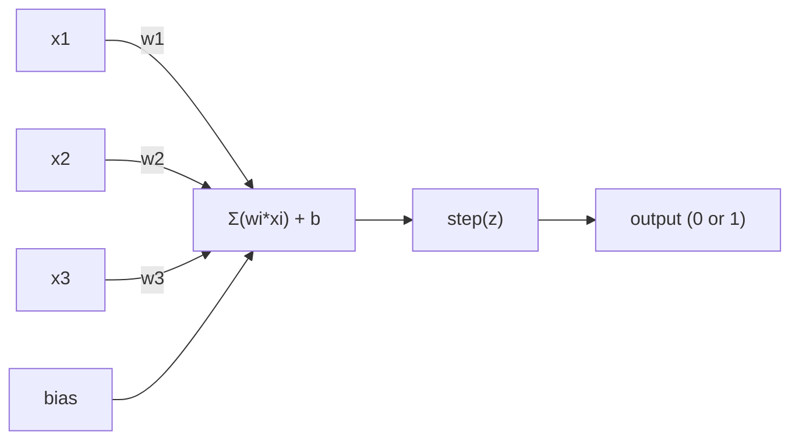
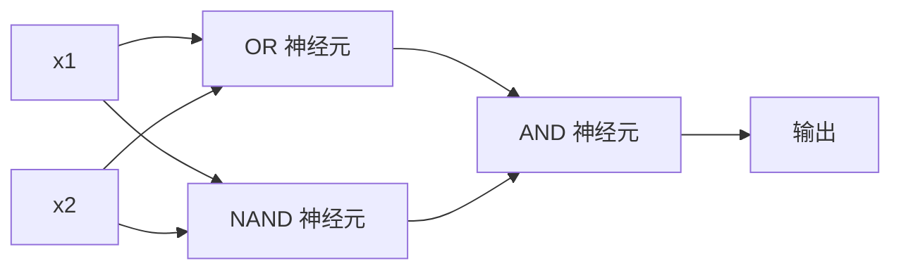

# 感知机（The Perceptron）

> 感知机是神经网络的原子。把它拆开，你会看到权重、偏置和一个决策。

**Type:** Build
**Languages:** Python
**Prerequisites:** Phase 1 (Linear Algebra Intuition)
**Time:** ~60 minutes

## 学习目标（Learning Objectives）

- 用 Python 从零实现一个感知机，包括权重更新规则和阶跃激活函数
- 解释为什么单个感知机只能解决线性可分问题，并演示 XOR 失败的案例
- 通过组合 OR、NAND、AND 门构建多层感知机来求解 XOR
- 训练一个带 sigmoid 激活和反向传播的两层网络，让它自动学会 XOR

## 问题（The Problem）

你已经懂向量和点积，也知道矩阵能把输入变换成输出。可机器要怎么*学习*该用哪种变换呢？

感知机给出了答案。它是能造出来的最简单的学习机器：取一些输入，乘上权重，加上偏置，做一个二值决策，然后调整。就这么简单。有史以来造出的每一个神经网络，都是把这个想法一层层堆叠起来的产物。

理解感知机，就是理解"学习"在代码里的真正含义：不断调整数字，直到输出符合现实。

## 核心概念（The Concept）

### 一个神经元，一次决策（One Neuron, One Decision）

感知机接收 n 个输入，把每个输入乘以对应的权重，求和后加上偏置，再把结果传入激活函数。



阶跃函数简单粗暴：如果加权和加上偏置大于等于 0，就输出 1；否则输出 0。

```
step(z) = 1  if z >= 0
           0  if z < 0
```

这是一个线性分类器。权重和偏置定义了一条直线（在更高维度上是超平面），把输入空间切分成两个区域。

### 决策边界（The Decision Boundary）

对于两个输入，感知机会在二维空间中画出一条直线：

```
  x2
  ┤
  │  Class 1        /
  │    (0)          /
  │                /
  │               / w1·x1 + w2·x2 + b = 0
  │              /
  │             /     Class 2
  │            /        (1)
  ┼───────────/──────────── x1
```

直线一侧的所有点输出 0，另一侧的所有点输出 1。训练就是移动这条直线，直到它能正确分开两个类别。

### 学习规则（The Learning Rule）

感知机学习规则很简单：

```
For each training example (x, y_true):
    y_pred = predict(x)
    error = y_true - y_pred

    For each weight:
        w_i = w_i + learning_rate * error * x_i
    bias = bias + learning_rate * error
```

如果预测正确，error 为 0，什么都不变。如果预测是 0 但应该是 1，权重就增大；如果预测是 1 但应该是 0，权重就减小。学习率（learning rate）决定每次调整的幅度。

### XOR 问题（The XOR Problem）

它就是在这里失效的。看看这些逻辑门：

```
AND gate:           OR gate:            XOR gate:
x1  x2  out         x1  x2  out         x1  x2  out
0   0   0           0   0   0           0   0   0
0   1   0           0   1   1           0   1   1
1   0   0           1   0   1           1   0   1
1   1   1           1   1   1           1   1   0
```

AND 和 OR 是线性可分的：画一条直线就能把 0 和 1 分开。XOR 不行。没有任何一条直线能把 [0,1] 和 [1,0] 与 [0,0] 和 [1,1] 分开。

```
AND (separable):        XOR (not separable):

  x2                      x2
  1 ┤  0     1            1 ┤  1     0
    │     /                 │
  0 ┤  0 / 0              0 ┤  0     1
    ┼──/──────── x1         ┼──────────── x1
       line works!          no single line works!
```

这是一个根本性的极限。单个感知机只能解决线性可分问题。Minsky 和 Papert 在 1969 年证明了这一点，神经网络研究因此几乎停滞了十年。

解决办法：把感知机堆叠成层。多层感知机把两个线性决策组合成一个非线性决策，就能解决 XOR。

```figure
perceptron-boundary
```

## 动手构建（Build It）

### 第 1 步：Perceptron 类（Step 1: The Perceptron class）

```python
class Perceptron:
    def __init__(self, n_inputs, learning_rate=0.1):
        self.weights = [0.0] * n_inputs
        self.bias = 0.0
        self.lr = learning_rate

    def predict(self, inputs):
        total = sum(w * x for w, x in zip(self.weights, inputs))
        total += self.bias
        return 1 if total >= 0 else 0

    def train(self, training_data, epochs=100):
        for epoch in range(epochs):
            errors = 0
            for inputs, target in training_data:
                prediction = self.predict(inputs)
                error = target - prediction
                if error != 0:
                    errors += 1
                    for i in range(len(self.weights)):
                        self.weights[i] += self.lr * error * inputs[i]
                    self.bias += self.lr * error
            if errors == 0:
                print(f"Converged at epoch {epoch + 1}")
                return
        print(f"Did not converge after {epochs} epochs")
```

### 第 2 步：在逻辑门上训练（Step 2: Train on logic gates）

```python
and_data = [
    ([0, 0], 0),
    ([0, 1], 0),
    ([1, 0], 0),
    ([1, 1], 1),
]

or_data = [
    ([0, 0], 0),
    ([0, 1], 1),
    ([1, 0], 1),
    ([1, 1], 1),
]

not_data = [
    ([0], 1),
    ([1], 0),
]

print("=== AND Gate ===")
p_and = Perceptron(2)
p_and.train(and_data)
for inputs, _ in and_data:
    print(f"  {inputs} -> {p_and.predict(inputs)}")

print("\n=== OR Gate ===")
p_or = Perceptron(2)
p_or.train(or_data)
for inputs, _ in or_data:
    print(f"  {inputs} -> {p_or.predict(inputs)}")

print("\n=== NOT Gate ===")
p_not = Perceptron(1)
p_not.train(not_data)
for inputs, _ in not_data:
    print(f"  {inputs} -> {p_not.predict(inputs)}")
```

### 第 3 步：观察 XOR 失败（Step 3: Watch XOR fail）

```python
xor_data = [
    ([0, 0], 0),
    ([0, 1], 1),
    ([1, 0], 1),
    ([1, 1], 0),
]

print("\n=== XOR Gate (single perceptron) ===")
p_xor = Perceptron(2)
p_xor.train(xor_data, epochs=1000)
for inputs, expected in xor_data:
    result = p_xor.predict(inputs)
    status = "OK" if result == expected else "WRONG"
    print(f"  {inputs} -> {result} (expected {expected}) {status}")
```

它永远不会收敛。这就是单个感知机学不会 XOR 的铁证。

### 第 4 步：用两层解决 XOR（Step 4: Solve XOR with two layers）

诀窍在于：XOR = (x1 OR x2) AND NOT (x1 AND x2)。把三个感知机组合起来：



```python
def xor_network(x1, x2):
    or_neuron = Perceptron(2)
    or_neuron.weights = [1.0, 1.0]
    or_neuron.bias = -0.5

    nand_neuron = Perceptron(2)
    nand_neuron.weights = [-1.0, -1.0]
    nand_neuron.bias = 1.5

    and_neuron = Perceptron(2)
    and_neuron.weights = [1.0, 1.0]
    and_neuron.bias = -1.5

    hidden1 = or_neuron.predict([x1, x2])
    hidden2 = nand_neuron.predict([x1, x2])
    output = and_neuron.predict([hidden1, hidden2])
    return output


print("\n=== XOR Gate (multi-layer network) ===")
for inputs, expected in xor_data:
    result = xor_network(inputs[0], inputs[1])
    print(f"  {inputs} -> {result} (expected {expected})")
```

四种情况全部正确。把感知机堆叠成层，就能造出单个感知机永远产生不了的决策边界。

### 第 5 步：训练两层网络（Step 5: Train a Two-Layer Network）

第 4 步是手工把权重接好的。这对 XOR 行得通，但对事先不知道正确权重的真实问题就行不通了。解决办法：把阶跃函数换成 sigmoid，通过反向传播（backpropagation）自动学出权重。

```python
class TwoLayerNetwork:
    def __init__(self, learning_rate=0.5):
        import random
        random.seed(0)
        self.w_hidden = [[random.uniform(-1, 1), random.uniform(-1, 1)] for _ in range(2)]
        self.b_hidden = [random.uniform(-1, 1), random.uniform(-1, 1)]
        self.w_output = [random.uniform(-1, 1), random.uniform(-1, 1)]
        self.b_output = random.uniform(-1, 1)
        self.lr = learning_rate

    def sigmoid(self, x):
        import math
        x = max(-500, min(500, x))
        return 1.0 / (1.0 + math.exp(-x))

    def forward(self, inputs):
        self.inputs = inputs
        self.hidden_outputs = []
        for i in range(2):
            z = sum(w * x for w, x in zip(self.w_hidden[i], inputs)) + self.b_hidden[i]
            self.hidden_outputs.append(self.sigmoid(z))
        z_out = sum(w * h for w, h in zip(self.w_output, self.hidden_outputs)) + self.b_output
        self.output = self.sigmoid(z_out)
        return self.output

    def train(self, training_data, epochs=10000):
        for epoch in range(epochs):
            total_error = 0
            for inputs, target in training_data:
                output = self.forward(inputs)
                error = target - output
                total_error += error ** 2

                d_output = error * output * (1 - output)

                saved_w_output = self.w_output[:]
                hidden_deltas = []
                for i in range(2):
                    h = self.hidden_outputs[i]
                    hd = d_output * saved_w_output[i] * h * (1 - h)
                    hidden_deltas.append(hd)

                for i in range(2):
                    self.w_output[i] += self.lr * d_output * self.hidden_outputs[i]
                self.b_output += self.lr * d_output

                for i in range(2):
                    for j in range(len(inputs)):
                        self.w_hidden[i][j] += self.lr * hidden_deltas[i] * inputs[j]
                    self.b_hidden[i] += self.lr * hidden_deltas[i]
```

```python
net = TwoLayerNetwork(learning_rate=2.0)
net.train(xor_data, epochs=10000)
for inputs, expected in xor_data:
    result = net.forward(inputs)
    predicted = 1 if result >= 0.5 else 0
    print(f"  {inputs} -> {result:.4f} (rounded: {predicted}, expected {expected})")
```

与第 4 步相比有两个关键区别。第一，sigmoid 替换了阶跃函数——它是光滑的，所以梯度存在。第二，`train` 方法把误差从输出层反向传播回隐藏层，按每个权重对误差的贡献比例来调整它。这就是用 20 行代码写成的反向传播。

这是通向第 03 课的桥梁。`d_output` 和 `hidden_deltas` 背后的数学，就是作用在网络图上的链式法则（chain rule）。我们会在那一课认真推导它。

## 直接使用（Use It）

你刚从零构建的一切，其实一次 import 就能得到：

```python
from sklearn.linear_model import Perceptron as SkPerceptron
import numpy as np

X = np.array([[0,0],[0,1],[1,0],[1,1]])
y = np.array([0, 0, 0, 1])

clf = SkPerceptron(max_iter=100, tol=1e-3)
clf.fit(X, y)
print([clf.predict([x])[0] for x in X])
```

五行代码。你那个 30 行的 `Perceptron` 类做的是同一件事。sklearn 版本增加了收敛检查、多种损失函数和稀疏输入支持——但核心循环一模一样：加权和、阶跃函数、出错时更新权重。

真正的差距体现在规模上。生产级网络里变化的是：

- 阶跃函数换成了 sigmoid、ReLU 或其他光滑激活函数
- 权重通过反向传播自动学习（第 03 课）
- 层数更深：3 层、10 层、100 层以上
- 原理不变：每一层都从上一层的输出创造新的特征

单个感知机只能画直线。把它们堆起来，你就能画出任何形状。

## 交付成果（Ship It）

本课产出：
- `outputs/skill-perceptron.md` —— 一份技能（skill）文档，讲清单层与多层架构各自适用的场景

## 练习（Exercises）

1. 在 NAND 门上训练一个感知机（NAND 是通用门——任何逻辑电路都能用 NAND 搭出来）。验证它的权重和偏置构成一个有效的决策边界。
2. 修改 Perceptron 类，在每个 epoch 跟踪决策边界（w1*x1 + w2*x2 + b = 0）。打印在 AND 门上训练时这条直线是如何移动的。
3. 构建一个 3 输入感知机，只有当 3 个输入中至少 2 个为 1 时才输出 1（多数表决函数）。这是线性可分的吗？为什么？

## 关键术语（Key Terms）

| 术语 | 人们怎么说 | 实际含义 |
|------|----------------|----------------------|
| 感知机（Perceptron） | "一个假神经元" | 一种线性分类器：输入与权重做点积，加上偏置，再经过阶跃函数 |
| 权重（Weight） | "一个输入有多重要" | 一个乘数，缩放每个输入对决策的贡献 |
| 偏置（Bias） | "阈值" | 平移决策边界的常数，让感知机即使输入全为 0 也能被激活 |
| 激活函数（Activation function） | "把值挤压的东西" | 加权和之后施加的函数——感知机用阶跃函数，现代网络用 sigmoid/ReLU |
| 线性可分（Linearly separable） | "能画一条线把它们分开" | 一个数据集，单个超平面就能完美分开各个类别 |
| XOR 问题（XOR problem） | "感知机做不到的事" | 证明单层网络学不会非线性可分函数 |
| 决策边界（Decision boundary） | "分类器切换的地方" | 把输入空间分成两个类别的超平面 w*x + b = 0 |
| 多层感知机（Multi-layer perceptron） | "真正的神经网络" | 按层堆叠的感知机，每层的输出作为下一层的输入 |

## 延伸阅读（Further Reading）

- Frank Rosenblatt，《The Perceptron: A Probabilistic Model for Information Storage and Organization in the Brain》（1958）—— 开创这一切的原始论文
- Minsky 和 Papert，《Perceptrons》（1969）—— 证明了单层网络解决不了 XOR、让感知机研究停滞十年的那本书
- Michael Nielsen，《Neural Networks and Deep Learning》第 1 章 (http://neuralnetworksanddeeplearning.com/) —— 免费在线阅读，对感知机如何组合成网络的最佳可视化讲解
