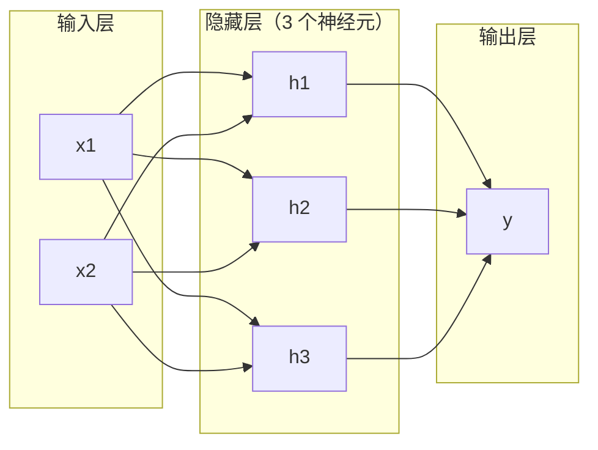
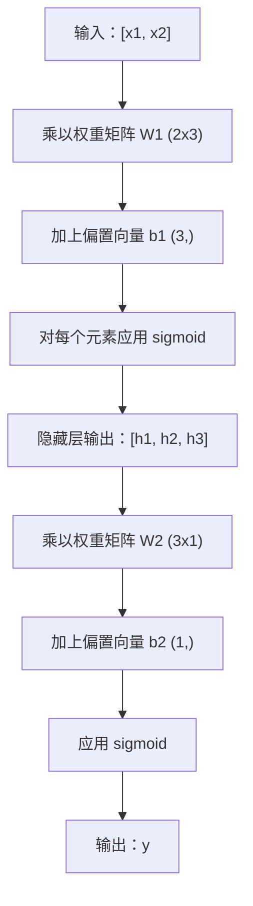

# 多层网络与前向传播（Multi-Layer Networks and Forward Pass）

> 一个神经元画一条直线。把它们堆起来，你就能画出任何东西。

**Type:** Build
**Languages:** Python
**Prerequisites:** Phase 01 (Math Foundations), Lesson 03.01 (The Perceptron)
**Time:** ~90 minutes

## 学习目标（Learning Objectives）

- 用 Layer 和 Network 类从零构建一个多层网络，完成完整的前向传播
- 追踪矩阵维度在网络各层之间的流动，并识别形状不匹配
- 解释堆叠非线性激活如何让网络学到弯曲的决策边界
- 使用 2-2-1 架构和手工调好的 sigmoid 权重解决 XOR 问题

## 问题（The Problem）

单个神经元是一台画直线机器。仅此而已：一条穿过你数据的直线。AI 里的每个真实问题——图像识别、语言理解、下围棋——都需要曲线。把神经元堆叠成层，才能得到曲线。

1969 年，Minsky 和 Papert 证明了这个限制是致命的：单层网络学不会 XOR。不是"学得费劲"——是数学上不可能。XOR 真值表把 [0,1] 和 [1,0] 放在一侧，把 [0,0] 和 [1,1] 放在另一侧。没有任何一条直线能把它们分开。

这让神经网络研究断炊了十多年。事后来看，补救办法显而易见：别只用一层。把神经元堆叠成层。让第一层把输入空间切出新的特征，让第二层把这些特征组合成任何单条直线都做不出的决策。

这个堆叠结构就是多层网络。它是如今每一个生产级深度学习模型的地基。前向传播（forward pass）——数据从输入流经隐藏层到达输出——是你最先要构建的东西，其他一切功能都建立在它之上。

## 核心概念（The Concept）

### 层：输入层、隐藏层、输出层（Layers: Input, Hidden, Output）

多层网络有三类层：

**输入层（Input layer）**——其实算不上真正的层。它只是存放你的原始数据。两个特征对应两个输入节点。这里不发生任何计算。

**隐藏层（Hidden layers）**——干活的地方。每个神经元接收上一层的所有输出，施加权重和偏置，再把结果传入激活函数。叫"隐藏"是因为在训练数据里你永远看不到这些值。

**输出层（Output layer）**——最终答案。二分类用一个带 sigmoid 的神经元；多分类则是每个类别一个神经元。



这是一个 2-3-1 网络：两个输入、三个隐藏神经元、一个输出。每条连接都带一个权重，每个神经元（输入除外）都带一个偏置。

每一层产出一个数字向量，称为隐藏状态（hidden state）。对文本来说，隐藏状态在升维——把一个词编码成 768 个数字来捕捉语义；对图像来说，隐藏状态在降维——把数百万像素压缩成一个可控的表示。学习就发生在隐藏状态里。

### 神经元与激活（Neurons and Activations）

每个神经元做三件事：

1. 把每个输入乘以对应的权重
2. 把所有乘积求和并加上偏置
3. 把和传入激活函数

本课先让激活函数是 sigmoid：

```
sigmoid(z) = 1 / (1 + e^(-z))
```

sigmoid 把任何数压进 (0, 1) 区间。大的正输入被推向 1，大的负输入被推向 0，0 映射到 0.5。正是这条光滑曲线让学习成为可能——不像感知机生硬的阶跃函数，sigmoid 处处有梯度。

### 前向传播：数据如何流动（Forward Pass: How Data Flows）

前向传播把输入数据逐层推过网络，直到抵达输出。前向传播过程中没有任何学习，它是纯粹的计算：相乘、相加、激活，循环往复。



在每一层，同样的运算依次发生：

```
z = W * input + b       (linear transformation)
a = sigmoid(z)           (activation)
```

一层的输出成为下一层的输入。这就是前向传播的全部。

### 矩阵维度（Matrix Dimensions）

追踪维度是深度学习中最重要的调试技能，没有之一。下面是这个 2-3-1 网络：

| 步骤 | 运算 | 维度 | 结果形状 |
|------|-----------|------------|-------------|
| 输入 | x | -- | (2,) |
| 隐藏层线性 | W1 * x + b1 | W1: (3, 2), b1: (3,) | (3,) |
| 隐藏层激活 | sigmoid(z1) | -- | (3,) |
| 输出层线性 | W2 * h + b2 | W2: (1, 3), b2: (1,) | (1,) |
| 输出层激活 | sigmoid(z2) | -- | (1,) |

规则是：第 k 层的权重矩阵 W 形状为 (neurons_in_layer_k, neurons_in_layer_k_minus_1)。行对应当前层的神经元数，列对应上一层的神经元数。形状对不上，就说明有 bug。

### 万能近似定理（Universal Approximation Theorem）

1989 年，George Cybenko 证明了一个惊人的结论：一个只有单隐藏层的神经网络，只要有足够多的神经元，就能以任意想要的精度逼近任何连续函数。

这并不意味着单隐藏层总是最优，它只是说明这种架构在理论上可行。实践中，更深的网络（层数更多、每层神经元更少）能用少得多的总参数学到同样的函数。这正是深度学习有效的原因。

直觉是这样的：隐藏层里的每个神经元学到一个"凸起"（bump）或特征。足够多的凸起放在合适的位置，就能逼近任何光滑曲线。神经元越多，凸起越多，逼近越好。


### 可组合性（Composability）

神经网络是可组合的：可以堆叠、串联、并行运行。Whisper 模型用一个编码器（encoder）网络处理音频，再用一个单独的解码器（decoder）网络生成文本。现代 LLM 是 decoder-only 的；BERT 是 encoder-only 的；T5 是 encoder-decoder 的。架构选择决定了模型能做什么。

```figure
mlp-forward
```

## 动手构建（Build It）

纯 Python。不用 numpy。每个矩阵运算都从零写起。

### 第 1 步：sigmoid 激活（Step 1: Sigmoid Activation）

```python
import math

def sigmoid(x):
    x = max(-500.0, min(500.0, x))
    return 1.0 / (1.0 + math.exp(-x))
```

截断到 [-500, 500] 是为了防止溢出。`math.exp(500)` 很大但有限，`math.exp(1000)` 就是无穷大了。

### 第 2 步：Layer 类（Step 2: Layer Class）

深度学习中最重要的运算是矩阵乘法。每一层、每个注意力头（attention head）、每次前向传播——一路到底都是矩阵乘法。线性层接收一个输入向量，乘以一个权重矩阵，再加上一个偏置向量：y = Wx + b。这一个等式占掉了神经网络 90% 的计算量。

一个 Layer 保存一个权重矩阵和一个偏置向量。它的 forward 方法接收输入向量，返回激活后的输出。

```python
class Layer:
    def __init__(self, n_inputs, n_neurons, weights=None, biases=None):
        if weights is not None:
            self.weights = weights
        else:
            import random
            self.weights = [
                [random.uniform(-1, 1) for _ in range(n_inputs)]
                for _ in range(n_neurons)
            ]
        if biases is not None:
            self.biases = biases
        else:
            self.biases = [0.0] * n_neurons

    def forward(self, inputs):
        self.last_input = inputs
        self.last_output = []
        for neuron_idx in range(len(self.weights)):
            z = sum(
                w * x for w, x in zip(self.weights[neuron_idx], inputs)
            )
            z += self.biases[neuron_idx]
            self.last_output.append(sigmoid(z))
        return self.last_output
```

权重矩阵的形状是 (n_neurons, n_inputs)，每一行是一个神经元对所有输入的权重。forward 方法遍历各个神经元，计算加权和加偏置，应用 sigmoid，然后收集结果。

### 第 3 步：Network 类（Step 3: Network Class）

网络就是一个层的列表。前向传播把它们串起来：第 k 层的输出送进第 k+1 层。

```python
class Network:
    def __init__(self, layers):
        self.layers = layers

    def forward(self, inputs):
        current = inputs
        for layer in self.layers:
            current = layer.forward(current)
        return current
```

这就是完整的前向传播：四行逻辑。数据进去，流过每一层，从另一头出来。

### 第 4 步：手工调权重解 XOR（Step 4: XOR with Hand-Tuned Weights）

在第 01 课里，我们靠组合 OR、NAND、AND 感知机解决了 XOR。现在用我们的 Layer 和 Network 类做同样的事。2-2-1 架构：两个输入、两个隐藏神经元、一个输出。

```python
hidden = Layer(
    n_inputs=2,
    n_neurons=2,
    weights=[[20.0, 20.0], [-20.0, -20.0]],
    biases=[-10.0, 30.0],
)

output = Layer(
    n_inputs=2,
    n_neurons=1,
    weights=[[20.0, 20.0]],
    biases=[-30.0],
)

xor_net = Network([hidden, output])

xor_data = [
    ([0, 0], 0),
    ([0, 1], 1),
    ([1, 0], 1),
    ([1, 1], 0),
]

for inputs, expected in xor_data:
    result = xor_net.forward(inputs)
    predicted = 1 if result[0] >= 0.5 else 0
    print(f"  {inputs} -> {result[0]:.6f} (rounded: {predicted}, expected: {expected})")
```

很大的权重（20、-20）让 sigmoid 表现得像阶跃函数。第一个隐藏神经元近似 OR，第二个近似 NAND。输出神经元把两者组合成 AND，而这就是 XOR。

### 第 5 步：圆形分类（Step 5: Circle Classification）

一个更难的问题：判断二维点在以原点为圆心、半径 0.5 的圆内还是圆外。这需要一条弯曲的决策边界——单个感知机绝无可能。

```python
import random
import math

random.seed(42)

data = []
for _ in range(200):
    x = random.uniform(-1, 1)
    y = random.uniform(-1, 1)
    label = 1 if (x * x + y * y) < 0.25 else 0
    data.append(([x, y], label))

circle_net = Network([
    Layer(n_inputs=2, n_neurons=8),
    Layer(n_inputs=8, n_neurons=1),
])
```

用随机权重，网络的分类效果不会好。但前向传播照样能跑。重点就在这里——前向传播只是计算。学出正确的权重是反向传播的事，第 03 课见。

```python
correct = 0
for inputs, expected in data:
    result = circle_net.forward(inputs)
    predicted = 1 if result[0] >= 0.5 else 0
    if predicted == expected:
        correct += 1

print(f"Accuracy with random weights: {correct}/{len(data)} ({100*correct/len(data):.1f}%)")
```

随机权重的准确率很差——往往比无脑猜多数类还糟。经过训练（第 03 课）之后，同样这个带 8 个隐藏神经元的架构就能画出一条弯曲的边界，把圆内和圆外分开。

## 直接使用（Use It）

上面的一切，PyTorch 四行就能搞定：

```python
import torch
import torch.nn as nn

model = nn.Sequential(
    nn.Linear(2, 8),
    nn.Sigmoid(),
    nn.Linear(8, 1),
    nn.Sigmoid(),
)

x = torch.tensor([[0.0, 0.0], [0.0, 1.0], [1.0, 0.0], [1.0, 1.0]])
output = model(x)
print(output)
```

`nn.Linear(2, 8)` 就是你的 Layer 类：形状 (8, 2) 的权重矩阵加形状 (8,) 的偏置向量。`nn.Sigmoid()` 就是逐元素应用你的 sigmoid 函数。`nn.Sequential` 就是你的 Network 类：按顺序串联各层。

区别在于速度和规模。PyTorch 跑在 GPU 上，能处理数百万样本的批次，还会自动为反向传播计算梯度。但前向传播的逻辑与你刚从零构建的完全一致。

## 交付成果（Ship It）

本课产出一个用于设计网络架构的可复用提示词（prompt）：

- `outputs/prompt-network-architect.md`

当你需要为一个给定问题决定用多少层、每层多少神经元、以及用哪些激活函数时，就使用它。

## 练习（Exercises）

1. 构建一个 2-4-2-1 网络（两个隐藏层），用随机权重在 XOR 数据上跑前向传播。打印中间隐藏层的输出，看看表示在每一层是如何变换的。

2. 把圆形分类器的隐藏层大小从 8 改成 2，再改成 32。每次都用随机权重跑前向传播。隐藏神经元的数量会改变输出的范围或分布吗？为什么？

3. 在 Network 类上实现一个 `count_parameters` 方法，返回可训练权重和偏置的总数。在一个 784-256-128-10 网络（经典的 MNIST 架构）上测试它。它有多少参数？

4. 为一个 3-4-4-2 网络构建前向传播。喂给它 RGB 颜色值（归一化到 0-1），观察两个输出。这就是一个两类简单颜色分类器的架构。

5. 把 sigmoid 换成一个"泄漏阶跃"函数：z < 0 时返回 0.01 * z，否则返回 1.0。用第 4 步同样的手工权重在 XOR 上跑前向传播。它还能正常工作吗？为什么光滑的 sigmoid 比硬截断更受青睐？

## 关键术语（Key Terms）

| 术语 | 人们怎么说 | 实际含义 |
|------|----------------|----------------------|
| 前向传播（Forward pass） | "运行模型" | 把输入推过每一层——乘以权重、加上偏置、激活——最终产生输出 |
| 隐藏层（Hidden layer） | "中间那部分" | 输入层和输出层之间的任何一层，它的值无法从数据中直接观察到 |
| 多层网络（Multi-layer network） | "深度神经网络" | 神经元按顺序堆叠成层，每层的输出作为下一层的输入 |
| 激活函数（Activation function） | "非线性那部分" | 线性变换之后施加的函数，为决策边界引入弯曲 |
| Sigmoid | "S 形曲线" | sigma(z) = 1/(1+e^(-z))，把任何实数压缩到 (0,1)，处处光滑可导 |
| 权重矩阵（Weight matrix） | "参数" | 形状为 (current_layer_neurons, previous_layer_neurons) 的矩阵 W，包含可学习的连接强度 |
| 偏置向量（Bias vector） | "偏移量" | 矩阵乘法之后加上的向量，让神经元即使输入全为 0 也能激活 |
| 万能近似（Universal approximation） | "神经网络什么都能学" | 单个隐藏层只要有足够的神经元就能逼近任何连续函数——但"足够"可能意味着数十亿 |
| 线性变换（Linear transformation） | "矩阵乘法那一步" | z = W * x + b，激活之前的计算，把输入映射到一个新空间 |
| 决策边界（Decision boundary） | "分类器切换的地方" | 输入空间中网络输出跨越分类阈值所形成的曲面 |

## 延伸阅读（Further Reading）

- Michael Nielsen，《Neural Networks and Deep Learning》第 1-2 章 (http://neuralnetworksanddeeplearning.com/) —— 对前向传播和网络结构最清晰的免费讲解，配有交互式可视化
- Cybenko，《Approximation by Superpositions of a Sigmoidal Function》（1989）—— 万能近似定理的原始论文，出奇地好读
- 3Blue1Brown，《But what is a neural network?》 (https://www.youtube.com/watch?v=aircAruvnKk) —— 用 20 分钟直观讲解层、权重和前向传播，帮你建立正确的心智模型
- Goodfellow、Bengio、Courville，《Deep Learning》第 6 章 (https://www.deeplearningbook.org/) —— 多层网络的标准参考书，免费在线阅读
