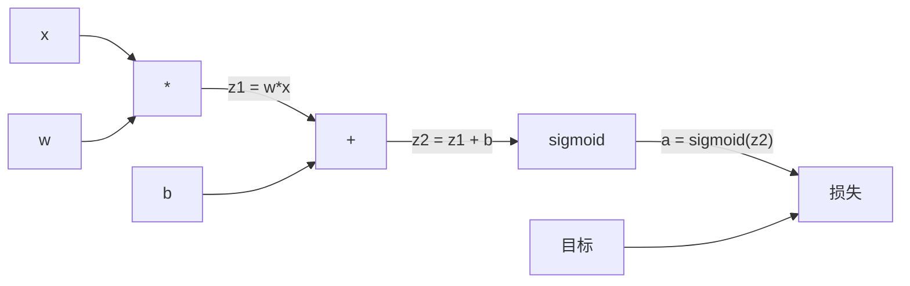
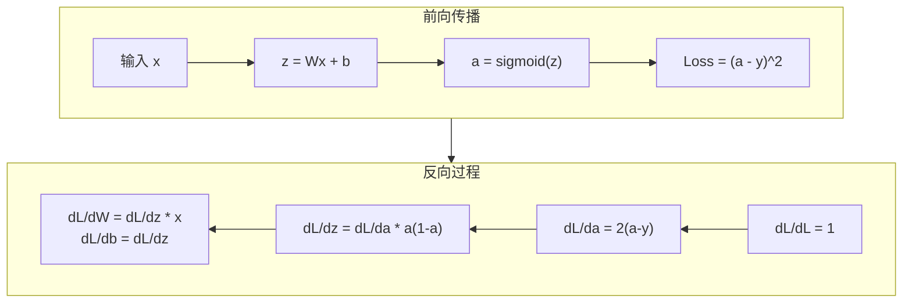

# 从零实现反向传播（Backpropagation from Scratch）

> 反向传播是让学习成为可能的算法。没有它，神经网络只是一台昂贵的随机数生成器。

**Type:** Build
**Languages:** Python
**Prerequisites:** Lesson 03.02 (Multi-Layer Networks)
**Time:** ~120 minutes

## 学习目标（Learning Objectives）

- 实现一个基于 Value 的 autograd 引擎：构建计算图（computational graph），通过拓扑排序（topological sort）计算梯度
- 用链式法则（chain rule）推导加法、乘法和 sigmoid 的反向传播
- 只用你从零实现的反向传播引擎，在 XOR 和圆形分类上训练多层网络
- 识别深层 sigmoid 网络中的梯度消失（vanishing gradient）问题，并解释梯度为什么会指数级缩小

## 问题（The Problem）

你的网络有一个隐藏层，768 个输入、3072 个输出，也就是 2,359,296 个权重。它做出了一个错误的预测，是哪些权重造成的？逐个测试每个权重意味着 230 万次前向传播。反向传播用一次反向过程就算出全部 230 万个梯度。这不是锦上添花的优化，而是"可训练"与"不可能"之间的分水岭。

朴素的做法是：取一个权重，微微动一点，再跑一次前向传播，看损失是升了还是降了。这就得到这个权重的梯度。现在对网络里的每个权重都这么做一遍，再乘上数千个训练步和数百万个数据点——想训练出任何有用的东西，你需要以地质纪元计的时间。

反向传播解决了这个问题：一次前向传播，一次反向传播，所有梯度全部算出。诀窍是把微积分里的链式法则系统地应用在计算图上。正是这个算法让深度学习变得实用。没有它，我们至今还困在玩具问题上。

## 核心概念（The Concept）

### 链式法则在网络中的应用（The Chain Rule, Applied to Networks）

你在第 01 阶段第 05 课见过链式法则。快速回顾：若 y = f(g(x))，则 dy/dx = f'(g(x)) * g'(x)。沿着链把导数乘起来即可。

在神经网络里，"链"就是从输入到损失的一串运算。每一层施加权重、加上偏置、通过激活函数，损失函数把最终输出与目标做比较。反向传播沿这条链往回追溯，算出每个运算对误差的贡献。

### 计算图（Computational Graphs）

每次前向传播都会构建一个图。每个节点是一次运算（乘、加、sigmoid）；每条边向前传值，向后传梯度。



前向传播：值从左流向右。x 和 w 相乘得到 z1 = w*x，加上 b 得到 z2，sigmoid 给出激活 a，再用损失函数把 a 与目标 y 比较。

反向传播：梯度从右流向左。从 dL/da（损失随激活的变化）出发，乘上 da/dz2（sigmoid 的导数），得到 dL/dz2。再拆成 dL/db（因为 z2 = z1 + b，它就等于 dL/dz2）和 dL/dz1。然后 dL/dw = dL/dz1 * x，dL/dx = dL/dz1 * w。

反向传播时，图里的每个节点只做一件事：接住从上游传来的梯度，乘上自己的局部导数，再往下传。

### 前向与反向（Forward vs Backward）



前向传播保存每一个中间值：z、a、每一层的输入。反向传播需要这些存下来的值来计算梯度。这就是反向传播核心的"内存换计算"权衡：用内存（保存激活值）换速度（跑一次传播，而不是数百万次）。

### 梯度流经一个网络（Gradient Flow Through a Network）

对一个 3 层网络，梯度像链条一样穿过每一层：


在每一层，梯度都要乘上 sigmoid 的导数。sigmoid 的导数是 a * (1 - a)，最大值 0.25（在 a = 0.5 时取到）。深到 3 层，梯度最多已被乘上 0.25^3 = 0.0156；深到 10 层：0.25^10 = 0.000001。

### 梯度消失（Vanishing Gradients）

这就是梯度消失问题。sigmoid 把输出压在 0 到 1 之间，它的导数永远小于 0.25。堆叠足够多的 sigmoid 层，梯度就会缩小到没有。浅层几乎学不到东西，因为它们收到的是接近零的梯度。

```
sigmoid(z):     Output range [0, 1]
sigmoid'(z):    Max value 0.25 (at z = 0)

After 5 layers:   gradient * 0.25^5 = 0.001x original
After 10 layers:  gradient * 0.25^10 = 0.000001x original
```

这就是深层 sigmoid 网络几乎无法训练的原因。补救办法——ReLU 及其变体——是第 04 课的主题。现在你要明白的是：反向传播本身运转得毫无问题，问题出在它所穿过的地方。

### 推导两层网络的梯度（Deriving Gradients for a 2-Layer Network）

具体的数学：一个网络，输入 x，隐藏层用 sigmoid，输出层用 sigmoid，损失用 MSE。

前向传播：
```
z1 = W1 * x + b1
a1 = sigmoid(z1)
z2 = W2 * a1 + b2
a2 = sigmoid(z2)
L = (a2 - y)^2
```

反向传播（逐步应用链式法则）：
```
dL/da2 = 2(a2 - y)
da2/dz2 = a2 * (1 - a2)
dL/dz2 = dL/da2 * da2/dz2 = 2(a2 - y) * a2 * (1 - a2)

dL/dW2 = dL/dz2 * a1
dL/db2 = dL/dz2

dL/da1 = dL/dz2 * W2
da1/dz1 = a1 * (1 - a1)
dL/dz1 = dL/da1 * da1/dz1

dL/dW1 = dL/dz1 * x
dL/db1 = dL/dz1
```

每个梯度都是从损失出发、一路回溯得到的局部导数乘积。反向传播的全部内容就这些。

```figure
backprop-vanishing
```

## 动手构建（Build It）

### 第 1 步：Value 节点（Step 1: The Value Node）

我们计算中的每个数都会变成一个 Value。它保存自己的数据、自己的梯度，以及自己是怎样被创建的（这样它就知道如何反向计算梯度）。

```python
class Value:
    def __init__(self, data, children=(), op=''):
        self.data = data
        self.grad = 0.0
        self._backward = lambda: None
        self._children = set(children)
        self._op = op

    def __repr__(self):
        return f"Value(data={self.data:.4f}, grad={self.grad:.4f})"
```

此时还没有梯度（0.0），也还没有反向函数（空操作）。`_children` 记录是由哪些 Value 产生了它，方便稍后对图做拓扑排序。

### 第 2 步：带反向函数的运算（Step 2: Operations with Backward Functions）

每个运算都会创建一个新的 Value，并定义梯度如何从它那里反向流过。

```python
def __add__(self, other):
    other = other if isinstance(other, Value) else Value(other)
    out = Value(self.data + other.data, (self, other), '+')

    def _backward():
        self.grad += out.grad
        other.grad += out.grad

    out._backward = _backward
    return out

def __mul__(self, other):
    other = other if isinstance(other, Value) else Value(other)
    out = Value(self.data * other.data, (self, other), '*')

    def _backward():
        self.grad += other.data * out.grad
        other.grad += self.data * out.grad

    out._backward = _backward
    return out
```

加法：d(a+b)/da = 1，d(a+b)/db = 1。所以两个输入直接拿到输出的梯度。

乘法：d(a*b)/da = b，d(a*b)/db = a。每个输入拿到的是"对方的值乘以输出梯度"。

`+=` 至关重要。一个 Value 可能被用在多个运算里，它的梯度是所有路径上的梯度之和。

### 第 3 步：sigmoid 与损失（Step 3: Sigmoid and Loss）

```python
import math

def sigmoid(self):
    x = self.data
    x = max(-500, min(500, x))
    s = 1.0 / (1.0 + math.exp(-x))
    out = Value(s, (self,), 'sigmoid')

    def _backward():
        self.grad += (s * (1 - s)) * out.grad

    out._backward = _backward
    return out
```

sigmoid 的导数是 sigmoid(x) * (1 - sigmoid(x))。前向传播时我们已经算出了 sigmoid(x) = s，直接复用，不费额外功夫。

```python
def mse_loss(predicted, target):
    diff = predicted + Value(-target)
    return diff * diff
```

单个输出的 MSE：(predicted - target)^2。我们把减法表示成加上一个取负的 Value。

### 第 4 步：反向传播（Step 4: Backward Pass）

拓扑排序保证我们按正确的顺序处理节点——一个节点的梯度完全累积好之后，才会穿过它继续传播。

```python
def backward(self):
    topo = []
    visited = set()

    def build_topo(v):
        if v not in visited:
            visited.add(v)
            for child in v._children:
                build_topo(child)
            topo.append(v)

    build_topo(self)
    self.grad = 1.0
    for v in reversed(topo):
        v._backward()
```

从损失出发（梯度为 1.0，因为 dL/dL = 1），沿着排好序的图往回走。每个节点的 `_backward` 把梯度推给它的子节点。

### 第 5 步：Layer 与 Network（Step 5: Layer and Network）

```python
import random

class Neuron:
    def __init__(self, n_inputs):
        scale = (2.0 / n_inputs) ** 0.5
        self.weights = [Value(random.uniform(-scale, scale)) for _ in range(n_inputs)]
        self.bias = Value(0.0)

    def __call__(self, x):
        act = sum((wi * xi for wi, xi in zip(self.weights, x)), self.bias)
        return act.sigmoid()

    def parameters(self):
        return self.weights + [self.bias]


class Layer:
    def __init__(self, n_inputs, n_outputs):
        self.neurons = [Neuron(n_inputs) for _ in range(n_outputs)]

    def __call__(self, x):
        out = [n(x) for n in self.neurons]
        return out[0] if len(out) == 1 else out

    def parameters(self):
        params = []
        for n in self.neurons:
            params.extend(n.parameters())
        return params


class Network:
    def __init__(self, sizes):
        self.layers = []
        for i in range(len(sizes) - 1):
            self.layers.append(Layer(sizes[i], sizes[i + 1]))

    def __call__(self, x):
        for layer in self.layers:
            x = layer(x)
            if not isinstance(x, list):
                x = [x]
        return x[0] if len(x) == 1 else x

    def parameters(self):
        params = []
        for layer in self.layers:
            params.extend(layer.parameters())
        return params

    def zero_grad(self):
        for p in self.parameters():
            p.grad = 0.0
```

Neuron 接收输入，计算加权和 + 偏置，然后应用 sigmoid。权重初始化按 sqrt(2/n_inputs) 缩放，以防更深的网络出现 sigmoid 饱和。Layer 是一组 Neuron，Network 是一组 Layer。`parameters()` 方法收集所有可学习的 Value，供我们更新。

### 第 6 步：在 XOR 上训练（Step 6: Train on XOR）

```python
random.seed(42)
net = Network([2, 4, 1])

xor_data = [
    ([0.0, 0.0], 0.0),
    ([0.0, 1.0], 1.0),
    ([1.0, 0.0], 1.0),
    ([1.0, 1.0], 0.0),
]

learning_rate = 1.0

for epoch in range(1000):
    total_loss = Value(0.0)
    for inputs, target in xor_data:
        x = [Value(i) for i in inputs]
        pred = net(x)
        loss = mse_loss(pred, target)
        total_loss = total_loss + loss

    net.zero_grad()
    total_loss.backward()

    for p in net.parameters():
        p.data -= learning_rate * p.grad

    if epoch % 100 == 0:
        print(f"Epoch {epoch:4d} | Loss: {total_loss.data:.6f}")

print("\nXOR Results:")
for inputs, target in xor_data:
    x = [Value(i) for i in inputs]
    pred = net(x)
    print(f"  {inputs} -> {pred.data:.4f} (expected {target})")
```

看着损失不断下降。从随机预测到正确的 XOR 输出，全程由反向传播驱动：计算梯度，再把权重往正确的方向一点点推。

### 第 7 步：圆形分类（Step 7: Circle Classification）

在第 02 课里，你为圆形分类手工调过权重。现在让网络自己学。

```python
random.seed(7)

def generate_circle_data(n=100):
    data = []
    for _ in range(n):
        x1 = random.uniform(-1.5, 1.5)
        x2 = random.uniform(-1.5, 1.5)
        label = 1.0 if x1 * x1 + x2 * x2 < 1.0 else 0.0
        data.append(([x1, x2], label))
    return data

circle_data = generate_circle_data(80)

circle_net = Network([2, 8, 1])
learning_rate = 0.5

for epoch in range(2000):
    random.shuffle(circle_data)
    total_loss_val = 0.0
    for inputs, target in circle_data:
        x = [Value(i) for i in inputs]
        pred = circle_net(x)
        loss = mse_loss(pred, target)
        circle_net.zero_grad()
        loss.backward()
        for p in circle_net.parameters():
            p.data -= learning_rate * p.grad
        total_loss_val += loss.data

    if epoch % 200 == 0:
        correct = 0
        for inputs, target in circle_data:
            x = [Value(i) for i in inputs]
            pred = circle_net(x)
            predicted_class = 1.0 if pred.data > 0.5 else 0.0
            if predicted_class == target:
                correct += 1
        accuracy = correct / len(circle_data) * 100
        print(f"Epoch {epoch:4d} | Loss: {total_loss_val:.4f} | Accuracy: {accuracy:.1f}%")
```

这里用的是在线 SGD——每处理一个样本就更新权重，而不是累积整个批次。这样能更快打破对称性，避免 sigmoid 在完整损失面上饱和。每个 epoch 都打乱数据，防止网络记住顺序。

完全不用手工调参。网络自己发现了圆形决策边界。这就是反向传播的力量：你定义架构、损失函数和数据，算法自己把权重算出来。

## 直接使用（Use It）

上面的一切，PyTorch 用几行代码就能完成。核心思想完全一致——autograd 在前向传播时构建计算图，再沿着图反向追溯来计算梯度。

```python
import torch
import torch.nn as nn

model = nn.Sequential(
    nn.Linear(2, 4),
    nn.Sigmoid(),
    nn.Linear(4, 1),
    nn.Sigmoid(),
)
optimizer = torch.optim.SGD(model.parameters(), lr=1.0)
criterion = nn.MSELoss()

X = torch.tensor([[0,0],[0,1],[1,0],[1,1]], dtype=torch.float32)
y = torch.tensor([[0],[1],[1],[0]], dtype=torch.float32)

for epoch in range(1000):
    pred = model(X)
    loss = criterion(pred, y)
    optimizer.zero_grad()
    loss.backward()
    optimizer.step()

print("PyTorch XOR Results:")
with torch.no_grad():
    for i in range(4):
        pred = model(X[i])
        print(f"  {X[i].tolist()} -> {pred.item():.4f} (expected {y[i].item()})")
```

`loss.backward()` 就是你的 `total_loss.backward()`。`optimizer.step()` 就是你手写的 `p.data -= lr * p.grad`。`optimizer.zero_grad()` 就是你的 `net.zero_grad()`。同一个算法，工业级实现。PyTorch 处理 GPU 加速、混合精度、梯度检查点和几百种层类型，但反向传播仍然是同一条链式法则应用在同一张计算图上。

训练先跑前向传播，再跑反向传播，然后更新权重。推理只跑前向传播：没有梯度，没有更新。这个区别很重要，因为生产环境中发生的是推理。当你调用 Claude 或 GPT 这样的 API 时，你运行的是推理——你的提示词（prompt）向前流过网络，词元（token）从另一头出来，权重没有任何变化。理解反向传播很重要，因为正是它塑造了那个网络里的每一个权重。

## 交付成果（Ship It）

本课产出：
- `outputs/prompt-gradient-debugger.md` —— 一个可复用提示词（prompt），用于诊断任何神经网络中的梯度问题（消失、爆炸、NaN）

## 练习（Exercises）

1. 给 Value 类添加一个 `__sub__` 方法（a - b = a + (-1 * b)），再实现一个 `__neg__` 方法。用 (a - b)^2 这样的简单表达式与手工计算对比，验证梯度是否正确。

2. 给 Value 添加一个 `relu` 方法（输出 max(0, x)，导数在 x > 0 时为 1，否则为 0）。把隐藏层的 sigmoid 换成 relu，再在 XOR 上训练一次，比较收敛速度。你应该会看到训练变快——这是第 04 课的预告。

3. 在 Value 上实现一个支持整数幂的 `__pow__` 方法，用它把 `mse_loss` 换成正规的 `(predicted - target) ** 2` 表达式。验证梯度与原实现一致。

4. 在训练循环里加入梯度裁剪：调用 `backward()` 之后，把所有梯度裁剪到 [-1, 1]。训练一个更深的网络（4 层以上、用 sigmoid），对比有裁剪和无裁剪时的损失曲线。这是你对抗梯度爆炸的第一道防线。

5. 做一个可视化：在 XOR 上训练完后，打印网络里每个参数的梯度，找出哪一层的梯度最小。这就演示了你在核心概念部分读到的梯度消失问题。

## 关键术语（Key Terms）

| 术语 | 人们怎么说 | 实际含义 |
|------|----------------|----------------------|
| 反向传播（Backpropagation） | "网络在学习" | 一种算法：沿计算图反向应用链式法则，为每个权重计算 dL/dw |
| 计算图（Computational graph） | "网络结构" | 一种有向无环图：节点是运算，边向前传值、向后传梯度 |
| 链式法则（Chain rule） | "把导数乘起来" | 若 y = f(g(x))，则 dy/dx = f'(g(x)) * g'(x)——反向传播的数学基础 |
| 梯度（Gradient） | "上升最陡的方向" | 损失对某个参数的偏导数——告诉你如何改变该参数来降低损失 |
| 梯度消失（Vanishing gradient） | "深网络学不动" | 梯度穿过带 sigmoid 这类饱和激活的层时会指数级缩小 |
| 前向传播（Forward pass） | "运行网络" | 从输入算出输出：依次执行每层的运算并保存中间值 |
| 反向过程（Backward pass） | "计算梯度" | 逆着计算图遍历，用链式法则在每个节点累积梯度 |
| 学习率（Learning rate） | "学得多快" | 控制权重更新步长的标量：w_new = w_old - lr * gradient |
| 拓扑排序（Topological sort） | "正确的顺序" | 图节点的一种排序：每个节点排在它依赖的所有节点之后——保证梯度在传播前完全累积 |
| 自动微分（Autograd） | "自动求导" | 在前向计算时构建计算图并自动计算梯度的系统——PyTorch 的引擎做的就是这件事 |

## 延伸阅读（Further Reading）

- Rumelhart、Hinton 和 Williams，《Learning representations by back-propagating errors》（1986）—— 让反向传播成为主流、解锁多层网络训练的论文
- 3Blue1Brown，《Neural Networks》系列 (https://www.youtube.com/playlist?list=PLZHQObOWTQDNU6R1_67000Dx_ZCJB-3pi) —— 反向传播与梯度流经网络的最好可视化讲解
