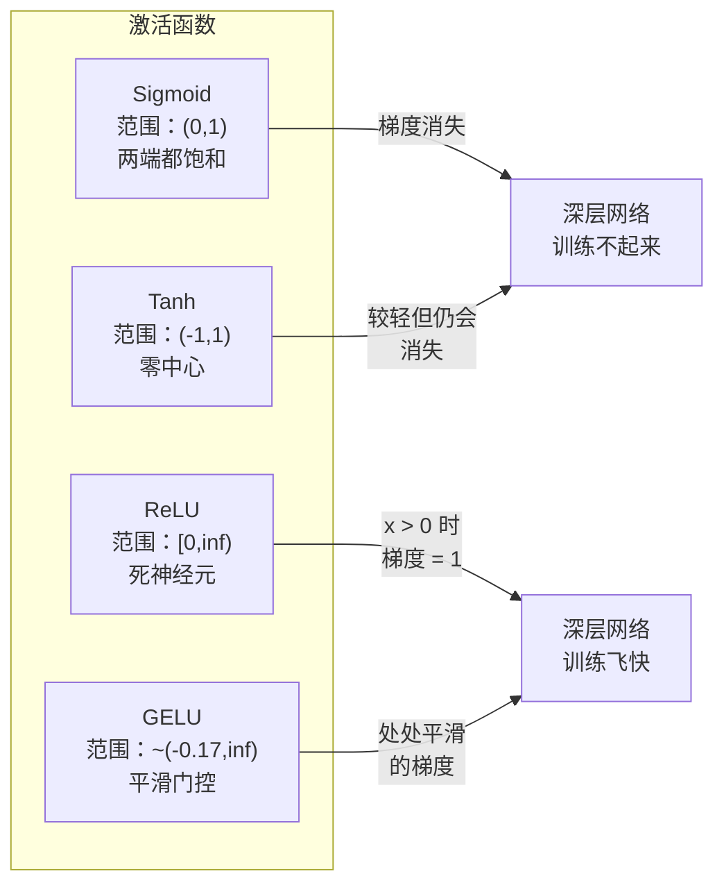
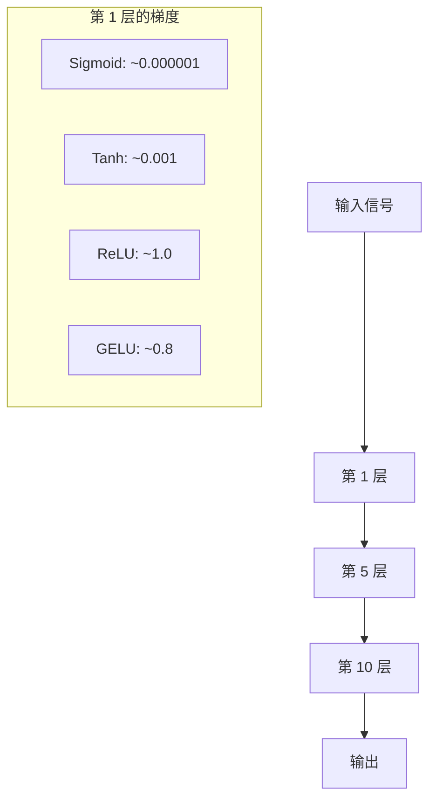
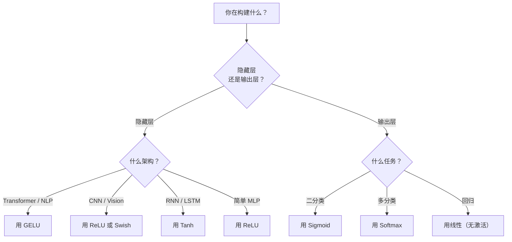

# 激活函数（Activation Functions）

> 没有非线性，你的 100 层网络不过是一次花哨的矩阵乘法。激活函数是让神经网络用曲线思考的闸门。

**Type:** Build
**Languages:** Python
**Prerequisites:** Lesson 03.03 (Backpropagation)
**Time:** ~75 minutes

## 学习目标（Learning Objectives）

- 从零实现 sigmoid、tanh、ReLU、Leaky ReLU、GELU、Swish 和 softmax 及其导数
- 通过测量不同激活在 10 层以上网络中的激活幅值，诊断梯度消失（vanishing gradient）问题
- 检测 ReLU 网络中的死神经元（dead neuron），并解释 GELU 为什么能避免这种失败模式
- 为给定架构（transformer、CNN、RNN、输出层）选择正确的激活函数

## 问题（The Problem）

叠两层线性变换：y = W2(W1x + b1) + b2。展开：y = W2W1x + W2b1 + b2。这就是 y = Ax + c——一个单独的线性变换。不管叠多少层线性层，结果都坍缩成一次矩阵乘法。你的 100 层网络，表达能力跟单层没两样。

这不是理论上的冷知识。它意味着深层线性网络真的学不会 XOR，分不了螺旋数据集，也认不出人脸。没有激活函数，深度只是错觉。

激活函数打破线性。它们用一个非线性函数去扭曲每一层的输出，让网络能够弯折决策边界、逼近任意函数，真正学到东西。但一旦选错激活函数，你的梯度可能消失为零（深层网络里的 sigmoid）、爆炸到无穷（没有谨慎初始化的无界激活），或者神经元永久死亡（带大负偏置的 ReLU）。激活函数的选择直接决定你的网络到底能不能学。

## 核心概念（The Concept）

### 为什么必须有非线性（Why Nonlinearity Is Necessary）

矩阵乘法是可组合的。向量先乘矩阵 A、再乘矩阵 B，与直接乘 AB 完全相同。这意味着十个线性层叠起来，在数学上等价于一个带一大块矩阵的线性层。那么多参数、那么深的深度——全白费了。你需要某种东西来打破这条链。这正是激活函数干的事。

来看证明。一个线性层计算 f(x) = Wx + b。叠两层：

```
Layer 1: h = W1 * x + b1
Layer 2: y = W2 * h + b2
```

代入：

```
y = W2 * (W1 * x + b1) + b2
y = (W2 * W1) * x + (W2 * b1 + b2)
y = A * x + c
```

还是只有一层。在层与层之间插入一个非线性激活 g()：

```
h = g(W1 * x + b1)
y = W2 * h + b2
```

现在代入化简失效了。W2 * g(W1 * x + b1) + b2 无法再化简成单一的线性变换。网络从此可以表示非线性函数。每增加一个带激活的层，表示能力就增加一分。

### Sigmoid（Sigmoid）

神经网络最早使用的激活函数。

```
sigmoid(x) = 1 / (1 + e^(-x))
```

输出范围是 (0, 1)。光滑、可导，把任何实数映射成一个类似概率的值。

它的导数：

```
sigmoid'(x) = sigmoid(x) * (1 - sigmoid(x))
```

这个导数的最大值是 0.25，出现在 x = 0 处。在反向传播中，梯度逐层相乘。十层 sigmoid 意味着梯度最多被 0.25 连乘十次：

```
0.25^10 = 0.000000953674
```

不到原始信号的百万分之一。这就是梯度消失问题。浅层的梯度小到权重几乎不更新。网络看起来在学习——后面几层的损失在降——但最前面的层被冻住了。深层 sigmoid 网络根本训练不起来。

还有个问题：sigmoid 的输出恒为正（0 到 1），这意味着权重上的梯度总是同一个符号。这会让梯度下降（gradient descent）出现锯齿状震荡。

### Tanh（Tanh）

sigmoid 的零中心版本。

```
tanh(x) = (e^x - e^(-x)) / (e^x + e^(-x))
```

输出范围是 (-1, 1)。零中心，消除了锯齿问题。

它的导数：

```
tanh'(x) = 1 - tanh(x)^2
```

导数最大值在 x = 0 处为 1.0——比 sigmoid 好 4 倍。但梯度消失问题依然存在。对很大的正输入或负输入，导数趋近于零。十层仍然会压垮梯度，只是没那么狠。

### ReLU：突破（ReLU: The Breakthrough）

修正线性单元（Rectified Linear Unit）。2010 年由 Nair 和 Hinton 推广到深度学习（这个函数本身可以追溯到 Fukushima 1969 年的工作），它改变了一切。

```
relu(x) = max(0, x)
```

输出范围是 [0, ∞)。导数简单到不能再简单：

```
relu'(x) = 1  if x > 0
            0  if x <= 0
```

对正输入没有梯度消失。梯度恰好是 1，原封不动地直通过去。这就是深层网络从此可训练的原因——ReLU 保住了梯度在层间的幅值。

但它有一个失败模式：死神经元问题。如果一个神经元的加权输入总是负的（因为一个很大的负偏置，或者不走运的权重初始化），它的输出永远是零，梯度永远是零，永远不会更新。它永久死亡。实践中，ReLU 网络里可能有 10-40% 的神经元在训练过程中死掉。

### Leaky ReLU（Leaky ReLU）

修复死神经元最简单的办法。

```
leaky_relu(x) = x        if x > 0
                alpha * x if x <= 0
```

其中 alpha 是一个小常数，通常取 0.01。负半轴带一个小斜率而不是零，于是死神经元仍然能得到梯度信号，还有机会恢复。

### GELU：现代默认选择（GELU: The Modern Default）

高斯误差线性单元（Gaussian Error Linear Unit）。Hendrycks 和 Gimpel 于 2016 年提出。BERT、GPT 以及大多数现代 transformer 的默认激活函数。

```
gelu(x) = x * Phi(x)
```

其中 Phi(x) 是标准正态分布的累积分布函数。实践中使用的近似：

```
gelu(x) ~= 0.5 * x * (1 + tanh(sqrt(2/pi) * (x + 0.044715 * x^3)))
```

GELU 处处光滑，允许小的负值（不像 ReLU 那样硬截为零），并且有一个概率解释：它按照输入在高斯分布下为正的可能性来加权每个输入。这种平滑门控在 transformer 架构中胜过 ReLU，因为它带来更好的梯度流，并且彻底避开了死神经元问题。

### Swish / SiLU（Swish / SiLU）

由 Ramachandran 等人于 2017 年通过自动搜索发现的自门控（self-gated）激活函数。

```
swish(x) = x * sigmoid(x)
```

Swish 的正式形式就是 x * sigmoid(x)。Google 通过在激活函数空间上做自动搜索发现了它——用神经网络设计神经网络的一部分。

和 GELU 一样，它光滑、非单调、允许小的负值。区别很微妙：Swish 用 sigmoid 做门控，GELU 用高斯 CDF。实践中两者表现几乎一样。Swish 用在 EfficientNet 和一些视觉模型里；GELU 在语言模型中占主导。

### Softmax：输出层激活（Softmax: The Output Activation）

不用于隐藏层。Softmax 把原始分数向量（logits）转换成一个概率分布。

```
softmax(x_i) = e^(x_i) / sum(e^(x_j) for all j)
```

每个输出都在 0 到 1 之间，所有输出加起来等于 1。这使它成为多分类的标准最终激活。最大的 logit 拿到最高的概率，但与 argmax 不同，softmax 可导，并且保留了相对置信度的信息。

### 形状对比（Comparison of Shapes）



### 梯度流对比（Gradient Flow Comparison）



### 何时用哪种激活（Which Activation When）



```figure
softmax-temperature
```

## 动手构建（Build It）

### 第 1 步：实现所有激活函数及其导数（Step 1: Implement All Activation Functions with Derivatives）

每个函数接收一个 float、返回一个 float。每个导数函数接收同样的输入、返回梯度。

```python
import math

def sigmoid(x):
    x = max(-500, min(500, x))
    return 1.0 / (1.0 + math.exp(-x))

def sigmoid_derivative(x):
    s = sigmoid(x)
    return s * (1 - s)

def tanh_act(x):
    return math.tanh(x)

def tanh_derivative(x):
    t = math.tanh(x)
    return 1 - t * t

def relu(x):
    return max(0.0, x)

def relu_derivative(x):
    return 1.0 if x > 0 else 0.0

def leaky_relu(x, alpha=0.01):
    return x if x > 0 else alpha * x

def leaky_relu_derivative(x, alpha=0.01):
    return 1.0 if x > 0 else alpha

def gelu(x):
    return 0.5 * x * (1 + math.tanh(math.sqrt(2 / math.pi) * (x + 0.044715 * x ** 3)))

def gelu_derivative(x):
    phi = 0.5 * (1 + math.erf(x / math.sqrt(2)))
    pdf = math.exp(-0.5 * x * x) / math.sqrt(2 * math.pi)
    return phi + x * pdf

def swish(x):
    return x * sigmoid(x)

def swish_derivative(x):
    s = sigmoid(x)
    return s + x * s * (1 - s)

def softmax(xs):
    max_x = max(xs)
    exps = [math.exp(x - max_x) for x in xs]
    total = sum(exps)
    return [e / total for e in exps]
```

### 第 2 步：可视化梯度在哪里死亡（Step 2: Visualize Where Gradients Die）

在 -5 到 5 之间均匀取 100 个点计算梯度，打印文本直方图，显示每个激活函数的梯度在哪些地方接近零。

```python
def gradient_scan(name, derivative_fn, start=-5, end=5, n=100):
    step = (end - start) / n
    near_zero = 0
    healthy = 0
    for i in range(n):
        x = start + i * step
        g = derivative_fn(x)
        if abs(g) < 0.01:
            near_zero += 1
        else:
            healthy += 1
    pct_dead = near_zero / n * 100
    print(f"{name:15s}: {healthy:3d} healthy, {near_zero:3d} near-zero ({pct_dead:.0f}% dead zone)")

gradient_scan("Sigmoid", sigmoid_derivative)
gradient_scan("Tanh", tanh_derivative)
gradient_scan("ReLU", relu_derivative)
gradient_scan("Leaky ReLU", leaky_relu_derivative)
gradient_scan("GELU", gelu_derivative)
gradient_scan("Swish", swish_derivative)
```

### 第 3 步：梯度消失实验（Step 3: Vanishing Gradient Experiment）

用 sigmoid 和 ReLU 分别把信号前向传播过 N 层，测量激活幅值如何变化。

```python
import random

def vanishing_gradient_experiment(activation_fn, name, n_layers=10, n_inputs=5):
    random.seed(42)
    values = [random.gauss(0, 1) for _ in range(n_inputs)]

    print(f"\n{name} through {n_layers} layers:")
    for layer in range(n_layers):
        weights = [random.gauss(0, 1) for _ in range(n_inputs)]
        z = sum(w * v for w, v in zip(weights, values))
        activated = activation_fn(z)
        magnitude = abs(activated)
        bar = "#" * int(magnitude * 20)
        print(f"  Layer {layer+1:2d}: magnitude = {magnitude:.6f} {bar}")
        values = [activated] * n_inputs

vanishing_gradient_experiment(sigmoid, "Sigmoid")
vanishing_gradient_experiment(relu, "ReLU")
vanishing_gradient_experiment(gelu, "GELU")
```

### 第 4 步：死神经元检测器（Step 4: Dead Neuron Detector）

创建一个 ReLU 网络，把随机输入喂进去，统计有多少神经元从未激活。

```python
def dead_neuron_detector(n_inputs=5, hidden_size=20, n_samples=1000):
    random.seed(0)
    weights = [[random.gauss(0, 1) for _ in range(n_inputs)] for _ in range(hidden_size)]
    biases = [random.gauss(0, 1) for _ in range(hidden_size)]

    fire_counts = [0] * hidden_size

    for _ in range(n_samples):
        inputs = [random.gauss(0, 1) for _ in range(n_inputs)]
        for neuron_idx in range(hidden_size):
            z = sum(w * x for w, x in zip(weights[neuron_idx], inputs)) + biases[neuron_idx]
            if relu(z) > 0:
                fire_counts[neuron_idx] += 1

    dead = sum(1 for c in fire_counts if c == 0)
    rarely_fire = sum(1 for c in fire_counts if 0 < c < n_samples * 0.05)
    healthy = hidden_size - dead - rarely_fire

    print(f"\nDead Neuron Report ({hidden_size} neurons, {n_samples} samples):")
    print(f"  Dead (never fired):     {dead}")
    print(f"  Barely alive (<5%):     {rarely_fire}")
    print(f"  Healthy:                {healthy}")
    print(f"  Dead neuron rate:       {dead/hidden_size*100:.1f}%")

    for i, c in enumerate(fire_counts):
        status = "DEAD" if c == 0 else "WEAK" if c < n_samples * 0.05 else "OK"
        bar = "#" * (c * 40 // n_samples)
        print(f"  Neuron {i:2d}: {c:4d}/{n_samples} fires [{status:4s}] {bar}")

dead_neuron_detector()
```

### 第 5 步：训练对比——Sigmoid vs ReLU vs GELU（Step 5: Training Comparison -- Sigmoid vs ReLU vs GELU）

用三种不同的激活，在圆形数据集（圆内的点 = 类别 1，圆外 = 类别 0）上训练同一个两层网络。比较收敛速度。

```python
def make_circle_data(n=200, seed=42):
    random.seed(seed)
    data = []
    for _ in range(n):
        x = random.uniform(-2, 2)
        y = random.uniform(-2, 2)
        label = 1.0 if x * x + y * y < 1.5 else 0.0
        data.append(([x, y], label))
    return data


class ActivationNetwork:
    def __init__(self, activation_fn, activation_deriv, hidden_size=8, lr=0.1):
        random.seed(0)
        self.act = activation_fn
        self.act_d = activation_deriv
        self.lr = lr
        self.hidden_size = hidden_size

        self.w1 = [[random.gauss(0, 0.5) for _ in range(2)] for _ in range(hidden_size)]
        self.b1 = [0.0] * hidden_size
        self.w2 = [random.gauss(0, 0.5) for _ in range(hidden_size)]
        self.b2 = 0.0

    def forward(self, x):
        self.x = x
        self.z1 = []
        self.h = []
        for i in range(self.hidden_size):
            z = self.w1[i][0] * x[0] + self.w1[i][1] * x[1] + self.b1[i]
            self.z1.append(z)
            self.h.append(self.act(z))

        self.z2 = sum(self.w2[i] * self.h[i] for i in range(self.hidden_size)) + self.b2
        self.out = sigmoid(self.z2)
        return self.out

    def backward(self, target):
        error = self.out - target
        d_out = error * self.out * (1 - self.out)

        for i in range(self.hidden_size):
            d_h = d_out * self.w2[i] * self.act_d(self.z1[i])
            self.w2[i] -= self.lr * d_out * self.h[i]
            for j in range(2):
                self.w1[i][j] -= self.lr * d_h * self.x[j]
            self.b1[i] -= self.lr * d_h
        self.b2 -= self.lr * d_out

    def train(self, data, epochs=200):
        losses = []
        for epoch in range(epochs):
            total_loss = 0
            correct = 0
            for x, y in data:
                pred = self.forward(x)
                self.backward(y)
                total_loss += (pred - y) ** 2
                if (pred >= 0.5) == (y >= 0.5):
                    correct += 1
            avg_loss = total_loss / len(data)
            accuracy = correct / len(data) * 100
            losses.append(avg_loss)
            if epoch % 50 == 0 or epoch == epochs - 1:
                print(f"    Epoch {epoch:3d}: loss={avg_loss:.4f}, accuracy={accuracy:.1f}%")
        return losses


data = make_circle_data()

configs = [
    ("Sigmoid", sigmoid, sigmoid_derivative),
    ("ReLU", relu, relu_derivative),
    ("GELU", gelu, gelu_derivative),
]

results = {}
for name, act_fn, act_d_fn in configs:
    print(f"\n=== Training with {name} ===")
    net = ActivationNetwork(act_fn, act_d_fn, hidden_size=8, lr=0.1)
    losses = net.train(data, epochs=200)
    results[name] = losses

print("\n=== Final Loss Comparison ===")
for name, losses in results.items():
    print(f"  {name:10s}: start={losses[0]:.4f} -> end={losses[-1]:.4f} (improvement: {(1 - losses[-1]/losses[0])*100:.1f}%)")
```

## 直接使用（Use It）

PyTorch 以函数式和模块式两种形式提供以上所有激活函数：

```python
import torch
import torch.nn as nn
import torch.nn.functional as F

x = torch.randn(4, 10)

relu_out = F.relu(x)
gelu_out = F.gelu(x)
sigmoid_out = torch.sigmoid(x)
swish_out = F.silu(x)

logits = torch.randn(4, 5)
probs = F.softmax(logits, dim=1)

model = nn.Sequential(
    nn.Linear(10, 64),
    nn.GELU(),
    nn.Linear(64, 32),
    nn.GELU(),
    nn.Linear(32, 5),
)
```

transformer 的隐藏层：GELU。CNN 的隐藏层：ReLU。分类的输出层：softmax。回归的输出层：不用（线性）。输出概率的层：sigmoid。就这么简单。从这些默认值开始，只有拿到证据才去改。

RNN 和 LSTM 的隐藏状态用 tanh、门用 sigmoid，但如果你今天是白手起家构建，多半不会用 RNN。如果你的 ReLU 网络里神经元在死亡，换 GELU。没有特别的理由不要上 Leaky ReLU——GELU 既解决死神经元问题，梯度流也更好。

## 交付成果（Ship It）

本课产出：
- `outputs/prompt-activation-selector.md` —— 一个可复用提示词（prompt），帮你为任何架构挑到合适的激活函数

## 练习（Exercises）

1. 实现 Parametric ReLU（PReLU），负斜率 alpha 是可学习参数。在圆形数据集上训练它，并与固定斜率的 Leaky ReLU 比较。

2. 把梯度消失实验从 10 层改成 50 层。画出 sigmoid、tanh、ReLU 和 GELU 每一层的幅值。每种激活的信号实际上在哪一层归零？

3. 实现 ELU（Exponential Linear Unit）：x > 0 时 elu(x) = x，x <= 0 时 elu(x) = alpha * (e^x - 1)。在同一个网络上比较它与 ReLU 的死神经元率。

4. 构建一个训练时运行的"梯度健康监视器"：每个 epoch 计算每层的平均梯度幅值，当任何一层的梯度低于 0.001 或超过 100 时打印警告。

5. 把训练对比改用第 01 课的 XOR 数据集而不是圆形数据。哪种激活在 XOR 上收敛最快？为什么与圆形数据的结果不同？

## 关键术语（Key Terms）

| 术语 | 人们怎么说 | 实际含义 |
|------|----------------|----------------------|
| 激活函数（Activation function） | "非线性的部分" | 施加在每个神经元输出上的函数，打破线性，让网络能学习非线性映射 |
| 梯度消失（Vanishing gradient） | "梯度在深网络里消失了" | 当激活的导数小于 1 时，梯度穿层指数级缩小，浅层无法训练 |
| 梯度爆炸（Exploding gradient） | "梯度爆掉了" | 当有效乘子超过 1 时，梯度穿层指数级增长，导致训练不稳定 |
| 死神经元（Dead neuron） | "停止学习的神经元" | 输入永远为负的 ReLU 神经元，输出为零、梯度为零 |
| Sigmoid | "把值压到 0-1" | logistic 函数 1/(1+e^-x)，历史上很重要，但在深网络中导致梯度消失 |
| ReLU | "把负数截成零" | max(0, x)——保住梯度幅值、让深度学习变得实用的激活函数 |
| GELU | "transformer 的激活函数" | Gaussian Error Linear Unit，一种平滑激活，按输入为正的概率为其加权 |
| Swish/SiLU | "自门控的 ReLU" | x * sigmoid(x)，通过自动搜索发现，用于 EfficientNet |
| Softmax | "把分数变成概率" | 把 logits 向量归一化成概率分布，所有值在 (0,1) 内且总和为 1 |
| Leaky ReLU | "不会死的 ReLU" | max(alpha*x, x)，其中 alpha 很小（0.01），允许小的负梯度以防神经元死亡 |
| 饱和（Saturation） | "sigmoid 的平坦段" | 激活函数导数趋近于零的区域，阻断梯度流动 |
| Logit | "softmax 之前的原始分数" | 最后一层在应用 softmax 或 sigmoid 之前的未归一化输出 |

## 延伸阅读（Further Reading）

- Nair 和 Hinton，《Rectified Linear Units Improve Restricted Boltzmann Machines》（2010）—— 提出 ReLU、让深层网络可训练的论文
- Hendrycks 和 Gimpel，《Gaussian Error Linear Units (GELUs)》（2016）—— 提出了后来成为 transformer 默认的激活函数
- Ramachandran 等，《Searching for Activation Functions》（2017）—— 用自动搜索发现 Swish，证明激活函数设计可以自动化
- Glorot 和 Bengio，《Understanding the difficulty of training deep feedforward neural networks》（2010）—— 诊断了梯度消失/爆炸并提出 Xavier 初始化的论文
- Goodfellow、Bengio、Courville，《Deep Learning》第 6.3 章 (https://www.deeplearningbook.org/) —— 对隐藏单元和激活函数的严格论述
