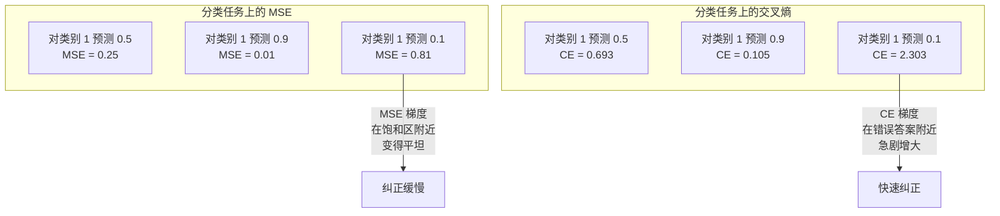
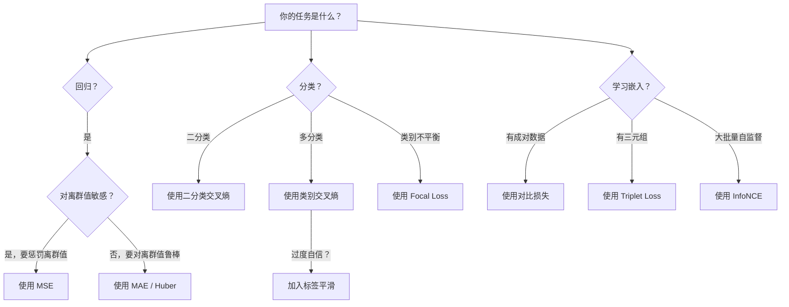
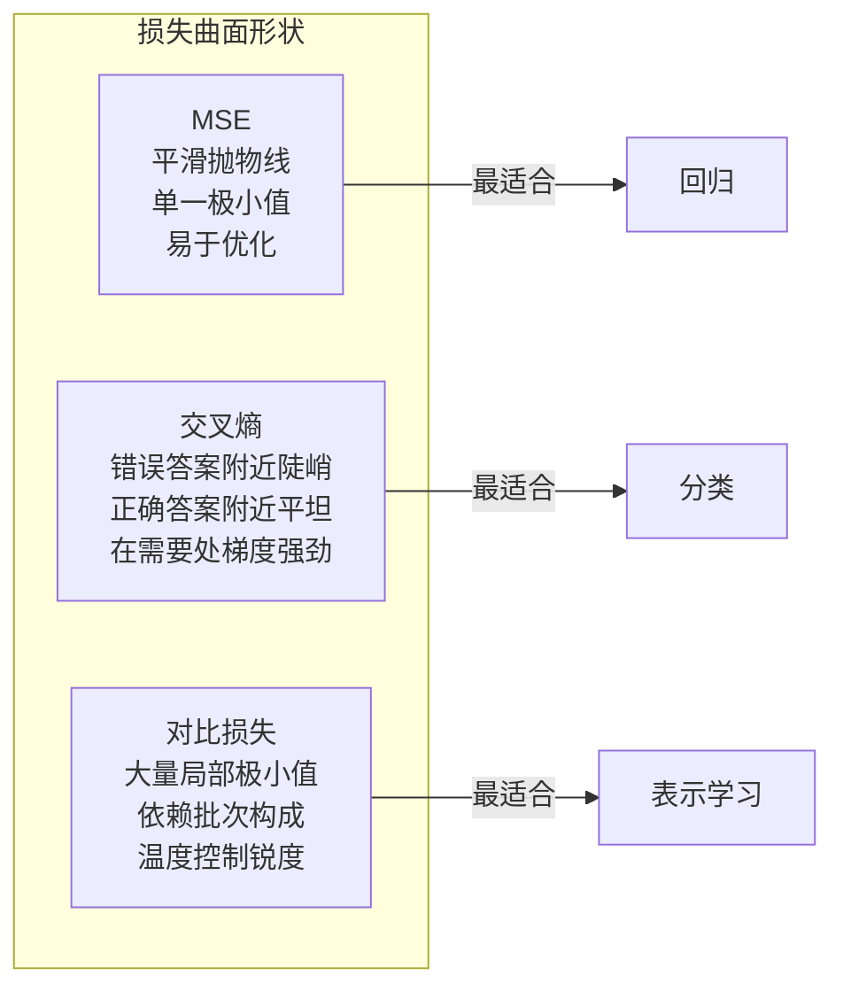

# 损失函数（Loss Functions）

> 网络做出了预测，真实答案却不是这样。到底错了多少？这个数值就是损失。损失函数一旦选错，模型优化的方向就完全错了。

**Type:** Build
**Languages:** Python
**Prerequisites:** Lesson 03.04 (Activation Functions)
**Time:** ~75 minutes

## 学习目标（Learning Objectives）

- 从零实现 MSE、二分类交叉熵（binary cross-entropy）、类别交叉熵（categorical cross-entropy）和对比损失（contrastive loss，InfoNCE），并推导它们的梯度
- 通过演示"对所有输入都预测 0.5"这一失败模式，解释为什么 MSE 不适用于分类
- 在交叉熵上应用标签平滑（label smoothing），并说明它如何防止过度自信的预测
- 为回归、二分类、多分类和嵌入（embedding）学习任务选择正确的损失函数

## 问题所在（The Problem）

在分类问题上最小化 MSE 的模型，会自信地对所有输入都预测 0.5。它确实在最小化损失，但也毫无用处。

模型真正优化的只有损失函数。不是准确率，不是 F1 分数，也不是你汇报给上级的任何指标。优化器取损失函数的梯度，然后调整权重，让这个数值变小。如果损失函数没有刻画你真正关心的东西，模型就会找到满足它的数学上最省力的方式，而那种方式几乎从来不是你想要的。

来看一个具体的例子。你有一个二分类任务，两个类别各占 50%。你用 MSE 作为损失，模型对每一个输入都预测 0.5。平均 MSE 是 0.25，这是不学习任何东西时可能取到的最小值。模型没有任何判别能力，但从技术上讲，它确实最小化了你的损失函数。换成交叉熵后，同样的模型就被迫把预测推向 0 或 1，因为 -log(0.5) = 0.693 是很糟的损失，而 -log(0.99) = 0.01 会奖励自信且正确的预测。损失函数的选择，决定了你得到的是一个真正在学习的模型，还是一个钻指标空子的模型。

更麻烦的是自监督学习，那里连标签都没有。对比损失完全定义了学习信号：什么算相似、什么算不同，以及模型要把它们推开多用力。对比损失写错了，嵌入就会塌缩成一个点——所有输入都映射到同一个向量。损失在技术上等于零，但毫无价值。

## 核心概念（The Concept）

### 均方误差（Mean Squared Error, MSE）

回归任务的默认选择。计算预测值与目标值之差的平方，再对所有样本求平均。

```
MSE = (1/n) * sum((y_pred - y_true)^2)
```

平方为什么重要：它按二次方惩罚大误差。误差为 2 的代价是误差为 1 的 4 倍，误差为 10 的代价是 100 倍。这让 MSE 对离群值非常敏感——一个离谱的错误预测就能主导整个损失。

用真实数字感受一下：如果你的模型预测房价，对大多数房子的偏差是 $10,000，但有一栋豪宅偏差 $200,000，MSE 会不遗余力地去修正那栋豪宅，甚至可能损害其余 99 栋房子的预测表现。

MSE 对预测值的梯度是：

```
dMSE/dy_pred = (2/n) * (y_pred - y_true)
```

梯度对误差是线性的：误差越大，梯度越大。对回归来说这是优点（大误差需要大修正），对分类来说这是缺陷（你希望对自信的错误答案按指数惩罚，而不是线性惩罚）。

### 交叉熵损失（Cross-Entropy Loss）

分类任务的标准损失函数。它源于信息论——度量预测概率分布与真实分布之间的散度。

**二分类交叉熵（Binary Cross-Entropy, BCE）：**

```
BCE = -(y * log(p) + (1 - y) * log(1 - p))
```

其中 y 是真实标签（0 或 1），p 是预测概率。

-log(p) 为什么有效：当真实标签为 1 且你预测 p = 0.99 时，损失是 -log(0.99) = 0.01；当你预测 p = 0.01 时，损失是 -log(0.01) = 4.6。这 460 倍的差距正是交叉熵有效的原因：它残酷地惩罚自信的错误预测，而对自信的正确预测几乎不施加惩罚。

梯度讲述着同样的故事：

```
dBCE/dp = -(y/p) + (1-y)/(1-p)
```

当 y = 1 且 p 接近零时，梯度为 -1/p，趋向负无穷。模型会得到一个巨大的信号去纠正错误。当 p 接近 1 时，梯度极小——已经答对了，没什么可修的。

**类别交叉熵（Categorical Cross-Entropy）：**

用于带 one-hot 编码目标的多分类任务。

```
CCE = -sum(y_i * log(p_i))
```

只有真实类别对损失有贡献（因为其他 y_i 全为零）。假设有 10 个类别，正确类别拿到概率 0.1（随机猜测），损失就是 -log(0.1) = 2.3；如果正确类别拿到概率 0.9，损失就是 -log(0.9) = 0.105。模型由此学会把概率质量集中到正确答案上。

### 为什么 MSE 不适用于分类（Why MSE Fails for Classification）



当预测值接近 0 或 1 时（由于 sigmoid 饱和），MSE 的梯度会变得平坦。交叉熵的梯度弥补了这一点——-log 项抵消了 sigmoid 的平坦区域，在最需要强梯度的位置恰好给出强梯度。

### 标签平滑（Label Smoothing）

标准 one-hot 标签宣称"这个样本 100% 属于类别 3，其余类别为 0%"。这是个很强的断言，标签平滑把它软化：

```
smooth_label = (1 - alpha) * one_hot + alpha / num_classes
```

取 alpha = 0.1、10 个类别时：目标不再是 [0, 0, 1, 0, ...]，而是变成 [0.01, 0.01, 0.91, 0.01, ...]。模型要把真实类别拟合到 0.91 而不是 1.0。

它有效的原因：要让模型经过 softmax 恰好输出 1.0，就得把 logits 推到无穷大。这会导致过度自信、损害泛化能力，并使模型在分布偏移面前变得脆弱。标签平滑把目标上限压到 0.9（当 alpha=0.1 时），让 logits 保持在合理范围内。GPT 和大多数现代模型都使用标签平滑或其等价物。

### 对比损失（Contrastive Loss）

没有标签，没有类别，只有输入对，以及一个问题：它们相似还是不同？

**SimCLR 风格的对比损失（NT-Xent / InfoNCE）：**

取一张图像，对它做两个增强视图（裁剪、旋转、颜色抖动）。这两者构成"正样本对"——它们的嵌入应该相似。批次中的其他所有图像则构成"负样本对"——它们的嵌入应该不同。

```
L = -log(exp(sim(z_i, z_j) / tau) / sum(exp(sim(z_i, z_k) / tau)))
```

其中 sim() 是余弦相似度，z_i 和 z_j 是正样本对，求和遍历所有负样本，tau（温度）控制分布的尖锐程度。温度越低 = 负样本越难 = 分离越激进。

真实数字：批次大小为 256 意味着每个正样本对有 255 个负样本。温度 tau = 0.07（SimCLR 默认值）。这个损失看起来就是对相似度做的 softmax——它想让正样本对的相似度在全部 256 个选项中最高。

**三元组损失（Triplet Loss）：**

它接收三个输入：锚点（anchor）、正样本（同类）、负样本（不同类）。

```
L = max(0, d(anchor, positive) - d(anchor, negative) + margin)
```

间隔（margin，通常取 0.2-1.0）在正、负样本距离之间强制一个最小差距。如果负样本已经足够远，损失就是零——没有梯度，也没有更新。这让训练高效，但需要精心的三元组挖掘（挑选靠近锚点的困难负样本）。

### 焦点损失（Focal Loss）

用于类别不平衡的数据集。标准交叉熵对所有分对的样本一视同仁，焦点损失则降低简单样本的权重：

```
FL = -alpha * (1 - p_t)^gamma * log(p_t)
```

其中 p_t 是真实类别的预测概率，gamma 控制聚焦程度。gamma = 0 时退化为标准交叉熵；gamma = 2（默认值）时：

- 简单样本（p_t = 0.9）：权重 = (0.1)^2 = 0.01，实际上被忽略。
- 困难样本（p_t = 0.1）：权重 = (0.9)^2 = 0.81，梯度信号完整保留。

焦点损失由 Lin 等人为目标检测提出，那里 99% 的候选区域都是背景（简单负样本）。没有 Focal loss，模型会淹没在简单的背景样本里，永远学不会检测物体；有了它，模型就能把容量集中到那些真正重要的困难、模糊样本上。

### 损失函数决策树（Loss Function Decision Tree）



### 损失曲面（Loss Landscape）



```figure
cross-entropy-loss
```

## 动手实现（Build It）

### 第 1 步：MSE 及其梯度（Step 1: MSE and Its Gradient）

```python
def mse(predictions, targets):
    n = len(predictions)
    total = 0.0
    for p, t in zip(predictions, targets):
        total += (p - t) ** 2
    return total / n

def mse_gradient(predictions, targets):
    n = len(predictions)
    grads = []
    for p, t in zip(predictions, targets):
        grads.append(2.0 * (p - t) / n)
    return grads
```

### 第 2 步：二分类交叉熵（Step 2: Binary Cross-Entropy）

log(0) 问题真实存在：如果模型对正样本恰好预测 0，log(0) = 负无穷。裁剪（clipping）可以防止这种情况。

```python
import math

def binary_cross_entropy(predictions, targets, eps=1e-15):
    n = len(predictions)
    total = 0.0
    for p, t in zip(predictions, targets):
        p_clipped = max(eps, min(1 - eps, p))
        total += -(t * math.log(p_clipped) + (1 - t) * math.log(1 - p_clipped))
    return total / n

def bce_gradient(predictions, targets, eps=1e-15):
    grads = []
    for p, t in zip(predictions, targets):
        p_clipped = max(eps, min(1 - eps, p))
        grads.append(-(t / p_clipped) + (1 - t) / (1 - p_clipped))
    return grads
```

### 第 3 步：带 Softmax 的类别交叉熵（Step 3: Categorical Cross-Entropy with Softmax）

Softmax 把原始 logits 转换为概率，然后我们针对 one-hot 目标计算交叉熵。

```python
def softmax(logits):
    max_val = max(logits)
    exps = [math.exp(x - max_val) for x in logits]
    total = sum(exps)
    return [e / total for e in exps]

def categorical_cross_entropy(logits, target_index, eps=1e-15):
    probs = softmax(logits)
    p = max(eps, probs[target_index])
    return -math.log(p)

def cce_gradient(logits, target_index):
    probs = softmax(logits)
    grads = list(probs)
    grads[target_index] -= 1.0
    return grads
```

softmax + 交叉熵的梯度化简得非常漂亮：真实类别就是（预测概率 - 1），其他所有类别就是（预测概率）。这个优雅的化简并非巧合——这正是 softmax 和交叉熵总是配对出现的原因。

### 第 4 步：标签平滑（Step 4: Label Smoothing）

```python
def label_smoothed_cce(logits, target_index, num_classes, alpha=0.1, eps=1e-15):
    probs = softmax(logits)
    loss = 0.0
    for i in range(num_classes):
        if i == target_index:
            smooth_target = 1.0 - alpha + alpha / num_classes
        else:
            smooth_target = alpha / num_classes
        p = max(eps, probs[i])
        loss += -smooth_target * math.log(p)
    return loss
```

### 第 5 步：对比损失（简化版 InfoNCE）（Step 5: Contrastive Loss (Simplified InfoNCE)）

```python
def cosine_similarity(a, b):
    dot = sum(x * y for x, y in zip(a, b))
    norm_a = math.sqrt(sum(x * x for x in a))
    norm_b = math.sqrt(sum(x * x for x in b))
    if norm_a < 1e-10 or norm_b < 1e-10:
        return 0.0
    return dot / (norm_a * norm_b)

def contrastive_loss(anchor, positive, negatives, temperature=0.07):
    sim_pos = cosine_similarity(anchor, positive) / temperature
    sim_negs = [cosine_similarity(anchor, neg) / temperature for neg in negatives]

    max_sim = max(sim_pos, max(sim_negs)) if sim_negs else sim_pos
    exp_pos = math.exp(sim_pos - max_sim)
    exp_negs = [math.exp(s - max_sim) for s in sim_negs]
    total_exp = exp_pos + sum(exp_negs)

    return -math.log(max(1e-15, exp_pos / total_exp))
```

### 第 6 步：分类任务上 MSE 与交叉熵的对比（Step 6: MSE vs Cross-Entropy on Classification）

用两种损失函数分别训练第 04 课的同一个网络（圆形数据集），观察交叉熵收敛得更快。

```python
import random

def sigmoid(x):
    x = max(-500, min(500, x))
    return 1.0 / (1.0 + math.exp(-x))

def make_circle_data(n=200, seed=42):
    random.seed(seed)
    data = []
    for _ in range(n):
        x = random.uniform(-2, 2)
        y = random.uniform(-2, 2)
        label = 1.0 if x * x + y * y < 1.5 else 0.0
        data.append(([x, y], label))
    return data


class LossComparisonNetwork:
    def __init__(self, loss_type="bce", hidden_size=8, lr=0.1):
        random.seed(0)
        self.loss_type = loss_type
        self.lr = lr
        self.hidden_size = hidden_size

        self.w1 = [[random.gauss(0, 0.5) for _ in range(2)] for _ in range(hidden_size)]
        self.b1 = [0.0] * hidden_size
        self.w2 = [random.gauss(0, 0.5) for _ in range(hidden_size)]
        self.b2 = 0.0

    def forward(self, x):
        self.x = x
        self.z1 = []
        self.h = []
        for i in range(self.hidden_size):
            z = self.w1[i][0] * x[0] + self.w1[i][1] * x[1] + self.b1[i]
            self.z1.append(z)
            self.h.append(max(0.0, z))

        self.z2 = sum(self.w2[i] * self.h[i] for i in range(self.hidden_size)) + self.b2
        self.out = sigmoid(self.z2)
        return self.out

    def backward(self, target):
        if self.loss_type == "mse":
            d_loss = 2.0 * (self.out - target)
        else:
            eps = 1e-15
            p = max(eps, min(1 - eps, self.out))
            d_loss = -(target / p) + (1 - target) / (1 - p)

        d_sigmoid = self.out * (1 - self.out)
        d_out = d_loss * d_sigmoid

        for i in range(self.hidden_size):
            d_relu = 1.0 if self.z1[i] > 0 else 0.0
            d_h = d_out * self.w2[i] * d_relu
            self.w2[i] -= self.lr * d_out * self.h[i]
            for j in range(2):
                self.w1[i][j] -= self.lr * d_h * self.x[j]
            self.b1[i] -= self.lr * d_h
        self.b2 -= self.lr * d_out

    def compute_loss(self, pred, target):
        if self.loss_type == "mse":
            return (pred - target) ** 2
        else:
            eps = 1e-15
            p = max(eps, min(1 - eps, pred))
            return -(target * math.log(p) + (1 - target) * math.log(1 - p))

    def train(self, data, epochs=200):
        losses = []
        for epoch in range(epochs):
            total_loss = 0.0
            correct = 0
            for x, y in data:
                pred = self.forward(x)
                self.backward(y)
                total_loss += self.compute_loss(pred, y)
                if (pred >= 0.5) == (y >= 0.5):
                    correct += 1
            avg_loss = total_loss / len(data)
            accuracy = correct / len(data) * 100
            losses.append((avg_loss, accuracy))
            if epoch % 50 == 0 or epoch == epochs - 1:
                print(f"    Epoch {epoch:3d}: loss={avg_loss:.4f}, accuracy={accuracy:.1f}%")
        return losses
```

## 直接使用（Use It）

PyTorch 提供了所有标准损失函数，并内置了数值稳定性处理：

```python
import torch
import torch.nn as nn
import torch.nn.functional as F

predictions = torch.tensor([0.9, 0.1, 0.7], requires_grad=True)
targets = torch.tensor([1.0, 0.0, 1.0])

mse_loss = F.mse_loss(predictions, targets)
bce_loss = F.binary_cross_entropy(predictions, targets)

logits = torch.randn(4, 10)
labels = torch.tensor([3, 7, 1, 9])
ce_loss = F.cross_entropy(logits, labels)
ce_smooth = F.cross_entropy(logits, labels, label_smoothing=0.1)
```

使用 `F.cross_entropy`（而不是 `F.nll_loss` 加手动 softmax）。它把 log-softmax 和负对数似然合并在一个数值稳定的操作里。先单独做 softmax 再取 log 的稳定性较差——大指数相减时会损失精度。

对比学习方面，大多数团队使用自定义实现或 `lightly`、`pytorch-metric-learning` 这类库。核心循环始终一样：计算两两相似度，对正负样本做 softmax，然后反向传播。

## 交付成果（Ship It）

本课产出：
- `outputs/prompt-loss-function-selector.md`——用于选择正确损失函数的可复用提示词
- `outputs/prompt-loss-debugger.md`——当损失曲线看起来不对劲时使用的诊断提示词

## 练习（Exercises）

1. 实现 Huber 损失（smooth L1 损失），它在小误差时表现为 MSE，大误差时表现为 MAE。训练一个预测 y = sin(x) 的回归网络，在 5% 的训练目标加入随机噪声（离群值）的情况下，分别用 MSE 和 Huber 训练并比较最终测试误差。

2. 把 Focal loss 加入二分类训练循环。构造一个不平衡数据集（90% 类别 0、10% 类别 1），在训练 200 个 epoch 后，比较标准 BCE 与 Focal loss（gamma=2）在少数类上的召回率。

3. 实现带半困难负样本挖掘（semi-hard negative mining）的三元组损失。生成 5 个类别的二维嵌入数据。对每个锚点，找出仍比正样本远的最难负样本（半困难）。将其收敛速度与随机选择三元组进行比较。

4. 重跑 MSE 与交叉熵的对比，但在训练过程中记录每一层的梯度大小。绘制每个 epoch 的平均梯度范数。验证在模型最不确定的早期 epoch 中，交叉熵会产生更大的梯度。

5. 实现 KL 散度损失，验证当真实分布为 one-hot 时，最小化 KL(true || predicted) 与交叉熵给出相同的梯度。然后尝试软目标（类似知识蒸馏），其中"真实"分布来自教师模型的 softmax 输出。

## 关键术语（Key Terms）

| 术语 | 人们常说的 | 实际含义 |
|------|----------------|----------------------|
| 损失函数（loss function） | "模型错了多少" | 一个可微函数，把预测和目标映射为一个标量，供优化器最小化 |
| MSE | "平均平方误差" | 预测与目标之差的平方的平均值；按二次方惩罚大误差 |
| 交叉熵（cross-entropy） | "那个分类损失" | 用 -log(p) 度量预测概率分布与真实分布之间的散度 |
| 二分类交叉熵（binary cross-entropy） | "BCE" | 两类问题的交叉熵：-(y*log(p) + (1-y)*log(1-p)) |
| 标签平滑（label smoothing） | "把目标软化" | 用软值（如 0.1/0.9）替换硬性的 0/1 目标，防止过度自信并改善泛化 |
| 对比损失（contrastive loss） | "拉近正样本，推远负样本" | 通过让相似样本对在嵌入空间中靠近、不相似样本对远离来学习表示的损失 |
| InfoNCE | "CLIP/SimCLR 用的那个损失" | 对相似度分数做的带温度归一化交叉熵；把对比学习当作分类问题处理 |
| Focal loss | "不平衡数据的解药" | 用 (1-p_t)^gamma 加权的交叉熵，降低简单样本权重、聚焦困难样本 |
| 三元组损失（triplet loss） | "锚点-正样本-负样本" | 在嵌入空间中让锚点到正样本的距离至少比到负样本的距离近一个间隔 |
| 温度（temperature） | "锐度旋钮" | 对 logits/相似度做除法的一个标量，控制结果分布有多尖；越低越尖 |

## 延伸阅读（Further Reading）

- Lin et al., "Focal Loss for Dense Object Detection" (2017)——为处理目标检测中的极端类别不平衡提出焦点损失（RetinaNet）
- Chen et al., "A Simple Framework for Contrastive Learning of Visual Representations" (SimCLR, 2020)——用 NT-Xent 损失定义了现代对比学习流程
- Szegedy et al., "Rethinking the Inception Architecture" (2016)——把标签平滑作为一种正则化技术提出，如今已是大多数大型模型的标准配置
- Hinton et al., "Distilling the Knowledge in a Neural Network" (2015)——使用软目标和 KL 散度的知识蒸馏，是模型压缩的基础
