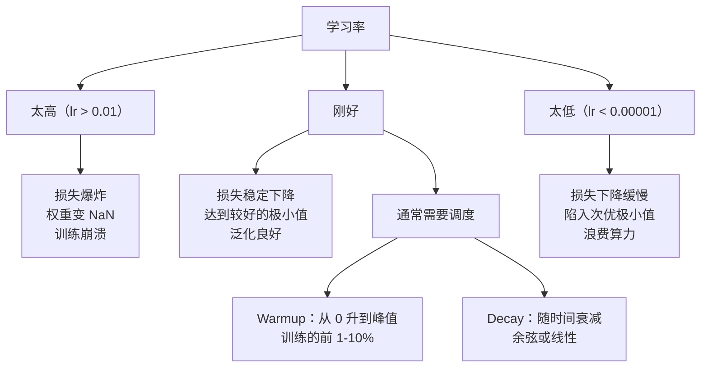
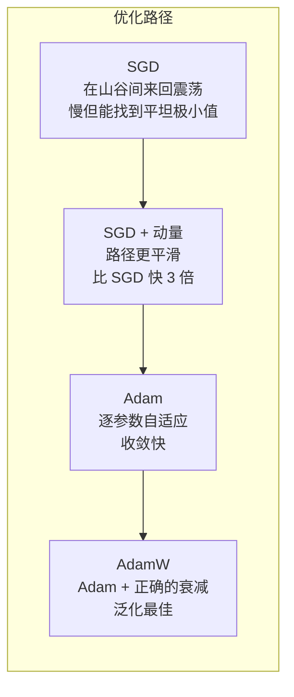
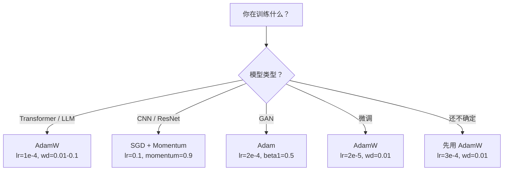

# 优化器（Optimizers）

> 梯度下降告诉你往哪个方向走，却没说走多远、走多快。SGD 是一个指南针，Adam 是带实时路况的 GPS。

**Type:** Build
**Languages:** Python
**Prerequisites:** Lesson 03.05 (Loss Functions)
**Time:** ~75 minutes

## 学习目标（Learning Objectives）

- 用 Python 从零实现 SGD、带动量的 SGD、Adam 和 AdamW 优化器
- 解释 Adam 的偏置修正（bias correction）如何在训练初期补偿零初始化的矩估计
- 在同一任务上演示为什么 AdamW 比带 L2 正则化的 Adam 泛化更好
- 为 transformer、CNN、GAN 和微调场景选择合适的优化器与默认超参数

## 问题所在（The Problem）

你已经算出了梯度。你知道权重 #4,721 应该减小 0.003 才能降低损失。但 0.003 是什么单位？要按什么比例缩放？第 1 步和第 1,000 步应该移动相同的距离吗？

朴素梯度下降对每个参数、每一步都施加同样的学习率：w = w - lr * gradient。这带来三个问题，让神经网络训练在实践中变得痛苦。

第一，震荡。损失曲面很少长得像光滑的碗，它更像一条狭长的山谷。梯度指向横穿山谷的方向（陡峭方向），而不是沿着山谷的方向（平缓方向）。梯度下降在窄的维度上来回弹跳，而在有用的维度上只前进一小步。你见过这种现象：损失先快速下降然后停滞，不是模型收敛了，而是它在震荡。

第二，所有参数共用一个学习率是错的。有些权重需要大幅更新（它们还处于早期的欠拟合阶段），另一些只需要微小调整（它们已接近最优值）。适合前者的学习率会毁掉后者，反之亦然。

第三，鞍点。在高维空间中，损失曲面存在大片梯度接近零的平坦区域。朴素 SGD 以梯度的速度（实际上为零）在这些区域里爬行。模型看起来卡住了——其实没卡住，它只是身处一片平坦区域，另一侧还有有用的下降方向。但 SGD 没有任何机制能冲过去。

Adam 一次性解决这三个问题。它为每个参数维护两个滑动平均——梯度的均值（动量，解决震荡）和梯度平方的均值（自适应步长，解决尺度差异）。再加上对前几步的偏置修正，你就有了一个用默认超参数就能解决 80% 问题的优化器。本课从零构建它，让你确切理解它在剩下 20% 的问题上何时、为何失效。

## 核心概念（The Concept）

### 随机梯度下降（Stochastic Gradient Descent, SGD）

最简单的优化器。在一个 mini-batch 上计算梯度，然后朝反方向走一步。

```
w = w - lr * gradient
```

"随机"的意思是你用数据的一个随机子集（mini-batch）来估计梯度，而不是整个数据集。这种噪声其实有用——它帮助逃离尖锐的局部极小值。但噪声也会引起震荡。

学习率是唯一的旋钮。太高：损失发散。太低：训练遥遥无期。最优值取决于架构、数据、批次大小和当前训练阶段。对现代网络上的朴素 SGD，典型取值在 0.01 到 0.1 之间。但即使在同一次训练里，理想的学习率也在变化。

### 动量（Momentum）

球从山坡滚下去的类比虽然被用滥了，但很准确。不是只按梯度走一步，而是维护一个累积了历史梯度的速度。

```
m_t = beta * m_{t-1} + gradient
w = w - lr * m_t
```

Beta（通常取 0.9）控制保留多少历史。取 beta = 0.9 时，动量约等于最近 10 个梯度的平均（1 / (1 - 0.9) = 10）。

为什么这能解决震荡：方向一致的梯度会累积，方向翻转的梯度会相互抵消。在那条狭长的山谷里，"横穿"分量每步都翻转符号，于是被衰减掉；"沿谷"分量保持一致，于是被放大。结果就是在有用的方向上平滑加速。

真实数字：在病态的损失曲面上，单靠 SGD 可能要走 10,000 步；带动量的 SGD（beta=0.9）在同一问题上通常只需 3,000-5,000 步。这个加速绝非可有可无。

### RMSProp

第一个真正有效的逐参数自适应学习率方法。由 Hinton 在一门 Coursera 课程中提出（从未正式发表）。

```
s_t = beta * s_{t-1} + (1 - beta) * gradient^2
w = w - lr * gradient / (sqrt(s_t) + epsilon)
```

s_t 记录梯度平方的滑动平均。梯度持续偏大的参数会被除以一个大数（有效学习率变小）；梯度偏小的参数会被除以一个小数（有效学习率变大）。

这解决了"所有参数共用一个学习率"的问题。一个一直在接受大幅更新的权重，多半已接近目标——让它慢下来。一个一直只接受微小更新的权重，可能训练不足——让它快起来。

Epsilon（通常取 1e-8）防止某个参数从未更新时除以零。

### Adam：动量 + RMSProp（Adam: Momentum + RMSProp）

Adam 把两个想法结合起来。它为每个参数维护两个指数滑动平均：

```
m_t = beta1 * m_{t-1} + (1 - beta1) * gradient        (first moment: mean)
v_t = beta2 * v_{t-1} + (1 - beta2) * gradient^2       (second moment: variance)
```

**偏置修正**是大多数讲解都跳过的关键细节。在第 1 步，m_1 = (1 - beta1) * gradient。取 beta1 = 0.9，就是 0.1 * gradient——比真实值小了十倍。滑动平均还没热身完。偏置修正对此进行补偿：

```
m_hat = m_t / (1 - beta1^t)
v_hat = v_t / (1 - beta2^t)
```

在第 1 步、beta1 = 0.9 时：m_hat = m_1 / (1 - 0.9) = m_1 / 0.1 = 真实梯度。到第 100 步：(1 - 0.9^100) 约等于 1.0，修正量消失。偏置修正只在前约 10 步重要，约 50 步之后就无关紧要了。

更新公式：

```
w = w - lr * m_hat / (sqrt(v_hat) + epsilon)
```

Adam 默认值：lr = 0.001，beta1 = 0.9，beta2 = 0.999，epsilon = 1e-8。这些默认值能应付 80% 的问题。不奏效时，先调 lr，再调 beta2。几乎永远不要动 beta1 和 epsilon。

### AdamW：把权重衰减做对（AdamW: Weight Decay Done Right）

L2 正则化在损失里加上 lambda * w^2。在朴素 SGD 中，这等价于权重衰减（每步从权重里减去 lambda * w）。在 Adam 中，这种等价性被打破。

Loshchilov 与 Hutter 的洞见：当你把 L2 加进损失、再让 Adam 处理梯度时，自适应学习率会把正则化项也一并缩放。梯度方差大的参数得到的正则化更少，方差小的参数得到的更多。这不是你想要的——你希望无论梯度统计如何，正则化都一视同仁。

AdamW 的修正是在 Adam 更新之后，把权重衰减直接施加到权重上：

```
w = w - lr * m_hat / (sqrt(v_hat) + epsilon) - lr * lambda * w
```

权重衰减项（lr * lambda * w）不经过 Adam 自适应因子的缩放，每个参数都得到相同的等比例收缩。

这听起来像个小细节，其实不是。在几乎所有任务上，AdamW 都收敛到比 Adam + L2 正则化更好的解。它是 PyTorch 中训练 transformer、扩散模型和大多数现代架构的默认优化器。BERT、GPT、LLaMA、Stable Diffusion——全都是用 AdamW 训练的。

### 学习率：最重要的超参数（Learning Rate: The Most Important Hyperparameter）



如果只让你调一个超参数，那就调学习率。学习率上 10 倍的变化，比你将做出的任何架构决策都重要。常见默认值：

- SGD：lr = 0.01 到 0.1
- Adam/AdamW：lr = 1e-4 到 3e-4
- 微调预训练模型：lr = 1e-5 到 5e-5
- 学习率预热（warmup）：在最初 1-10% 的步数内线性爬升

### 优化器对比（Optimizer Comparison）



### 各优化器何时胜出（When Each Optimizer Wins）



```figure
optimizer-trajectory
```

## 动手实现（Build It）

### 第 1 步：朴素 SGD（Step 1: Vanilla SGD）

```python
class SGD:
    def __init__(self, lr=0.01):
        self.lr = lr

    def step(self, params, grads):
        for i in range(len(params)):
            params[i] -= self.lr * grads[i]
```

### 第 2 步：带动量的 SGD（Step 2: SGD with Momentum）

```python
class SGDMomentum:
    def __init__(self, lr=0.01, beta=0.9):
        self.lr = lr
        self.beta = beta
        self.velocities = None

    def step(self, params, grads):
        if self.velocities is None:
            self.velocities = [0.0] * len(params)
        for i in range(len(params)):
            self.velocities[i] = self.beta * self.velocities[i] + grads[i]
            params[i] -= self.lr * self.velocities[i]
```

### 第 3 步：Adam（Step 3: Adam）

```python
import math

class Adam:
    def __init__(self, lr=0.001, beta1=0.9, beta2=0.999, epsilon=1e-8):
        self.lr = lr
        self.beta1 = beta1
        self.beta2 = beta2
        self.epsilon = epsilon
        self.m = None
        self.v = None
        self.t = 0

    def step(self, params, grads):
        if self.m is None:
            self.m = [0.0] * len(params)
            self.v = [0.0] * len(params)

        self.t += 1

        for i in range(len(params)):
            self.m[i] = self.beta1 * self.m[i] + (1 - self.beta1) * grads[i]
            self.v[i] = self.beta2 * self.v[i] + (1 - self.beta2) * grads[i] ** 2

            m_hat = self.m[i] / (1 - self.beta1 ** self.t)
            v_hat = self.v[i] / (1 - self.beta2 ** self.t)

            params[i] -= self.lr * m_hat / (math.sqrt(v_hat) + self.epsilon)
```

### 第 4 步：AdamW（Step 4: AdamW）

```python
class AdamW:
    def __init__(self, lr=0.001, beta1=0.9, beta2=0.999, epsilon=1e-8, weight_decay=0.01):
        self.lr = lr
        self.beta1 = beta1
        self.beta2 = beta2
        self.epsilon = epsilon
        self.weight_decay = weight_decay
        self.m = None
        self.v = None
        self.t = 0

    def step(self, params, grads):
        if self.m is None:
            self.m = [0.0] * len(params)
            self.v = [0.0] * len(params)

        self.t += 1

        for i in range(len(params)):
            self.m[i] = self.beta1 * self.m[i] + (1 - self.beta1) * grads[i]
            self.v[i] = self.beta2 * self.v[i] + (1 - self.beta2) * grads[i] ** 2

            m_hat = self.m[i] / (1 - self.beta1 ** self.t)
            v_hat = self.v[i] / (1 - self.beta2 ** self.t)

            params[i] -= self.lr * m_hat / (math.sqrt(v_hat) + self.epsilon)
            params[i] -= self.lr * self.weight_decay * params[i]
```

### 第 5 步：训练对比（Step 5: Training Comparison）

用全部四种优化器在第 05 课的圆形数据集上训练同一个两层网络，比较收敛情况。

```python
import random

def sigmoid(x):
    x = max(-500, min(500, x))
    return 1.0 / (1.0 + math.exp(-x))

def make_circle_data(n=200, seed=42):
    random.seed(seed)
    data = []
    for _ in range(n):
        x = random.uniform(-2, 2)
        y = random.uniform(-2, 2)
        label = 1.0 if x * x + y * y < 1.5 else 0.0
        data.append(([x, y], label))
    return data


class OptimizerTestNetwork:
    def __init__(self, optimizer, hidden_size=8):
        random.seed(0)
        self.hidden_size = hidden_size
        self.optimizer = optimizer

        self.w1 = [[random.gauss(0, 0.5) for _ in range(2)] for _ in range(hidden_size)]
        self.b1 = [0.0] * hidden_size
        self.w2 = [random.gauss(0, 0.5) for _ in range(hidden_size)]
        self.b2 = 0.0

    def get_params(self):
        params = []
        for row in self.w1:
            params.extend(row)
        params.extend(self.b1)
        params.extend(self.w2)
        params.append(self.b2)
        return params

    def set_params(self, params):
        idx = 0
        for i in range(self.hidden_size):
            for j in range(2):
                self.w1[i][j] = params[idx]
                idx += 1
        for i in range(self.hidden_size):
            self.b1[i] = params[idx]
            idx += 1
        for i in range(self.hidden_size):
            self.w2[i] = params[idx]
            idx += 1
        self.b2 = params[idx]

    def forward(self, x):
        self.x = x
        self.z1 = []
        self.h = []
        for i in range(self.hidden_size):
            z = self.w1[i][0] * x[0] + self.w1[i][1] * x[1] + self.b1[i]
            self.z1.append(z)
            self.h.append(max(0.0, z))

        self.z2 = sum(self.w2[i] * self.h[i] for i in range(self.hidden_size)) + self.b2
        self.out = sigmoid(self.z2)
        return self.out

    def compute_grads(self, target):
        eps = 1e-15
        p = max(eps, min(1 - eps, self.out))
        d_loss = -(target / p) + (1 - target) / (1 - p)
        d_sigmoid = self.out * (1 - self.out)
        d_out = d_loss * d_sigmoid

        grads = [0.0] * (self.hidden_size * 2 + self.hidden_size + self.hidden_size + 1)
        idx = 0
        for i in range(self.hidden_size):
            d_relu = 1.0 if self.z1[i] > 0 else 0.0
            d_h = d_out * self.w2[i] * d_relu
            grads[idx] = d_h * self.x[0]
            grads[idx + 1] = d_h * self.x[1]
            idx += 2

        for i in range(self.hidden_size):
            d_relu = 1.0 if self.z1[i] > 0 else 0.0
            grads[idx] = d_out * self.w2[i] * d_relu
            idx += 1

        for i in range(self.hidden_size):
            grads[idx] = d_out * self.h[i]
            idx += 1

        grads[idx] = d_out
        return grads

    def train(self, data, epochs=300):
        losses = []
        for epoch in range(epochs):
            total_loss = 0.0
            correct = 0
            for x, y in data:
                pred = self.forward(x)
                grads = self.compute_grads(y)
                params = self.get_params()
                self.optimizer.step(params, grads)
                self.set_params(params)

                eps = 1e-15
                p = max(eps, min(1 - eps, pred))
                total_loss += -(y * math.log(p) + (1 - y) * math.log(1 - p))
                if (pred >= 0.5) == (y >= 0.5):
                    correct += 1
            avg_loss = total_loss / len(data)
            accuracy = correct / len(data) * 100
            losses.append((avg_loss, accuracy))
            if epoch % 75 == 0 or epoch == epochs - 1:
                print(f"    Epoch {epoch:3d}: loss={avg_loss:.4f}, accuracy={accuracy:.1f}%")
        return losses
```

## 直接使用（Use It）

PyTorch 优化器帮你处理参数组、梯度裁剪和学习率调度：

```python
import torch
import torch.optim as optim

model = torch.nn.Sequential(
    torch.nn.Linear(784, 256),
    torch.nn.ReLU(),
    torch.nn.Linear(256, 10),
)

optimizer = optim.AdamW(model.parameters(), lr=3e-4, weight_decay=0.01)

scheduler = optim.lr_scheduler.CosineAnnealingLR(optimizer, T_max=100)

for epoch in range(100):
    optimizer.zero_grad()
    output = model(torch.randn(32, 784))
    loss = torch.nn.functional.cross_entropy(output, torch.randint(0, 10, (32,)))
    loss.backward()
    torch.nn.utils.clip_grad_norm_(model.parameters(), max_norm=1.0)
    optimizer.step()
    scheduler.step()
```

套路永远是：zero_grad、forward、loss、backward、（clip）、step、（schedule）。把这个顺序背下来。搞错顺序（比如在 optimizer.step() 之前调用 scheduler.step()）是许多隐蔽 bug 的根源。

对 CNN，很多从业者仍偏好 SGD + 动量（lr=0.1, momentum=0.9, weight_decay=1e-4），配合阶梯式或余弦调度。SGD 找到的极小值更平坦，往往泛化更好。对 transformer 和 LLM，AdamW 加 warmup + 余弦衰减是通用默认。没有实测依据，就不要和这个共识对着干。

## 交付成果（Ship It）

本课产出：
- `outputs/prompt-optimizer-selector.md`——为任意架构选择合适优化器和学习率的决策提示词

## 练习（Exercises）

1. 实现 Nesterov 动量：在"前瞻"位置（w - lr * beta * v）而不是当前位置计算梯度。在圆形数据集上与标准动量比较收敛情况。

2. 实现学习率预热调度：在最初 10% 的训练步数内从 0 线性升到 max_lr，然后按余弦衰减到 0。分别用带预热的 Adam 和不带预热的 Adam 训练，测量在圆形数据集上达到 90% 准确率需要多少个 epoch。

3. 在 Adam 训练过程中跟踪每个参数的有效学习率。有效学习率是 lr * m_hat / (sqrt(v_hat) + eps)。绘制第 10、50、200 步后有效学习率的分布。所有参数真的在以同样的速度更新吗？

4. 实现梯度裁剪（按全局范数裁剪），把最大梯度范数设为 1.0。用较高的学习率（Adam 取 lr=0.01）分别做带裁剪和不带裁剪的训练。在 10 个随机种子下统计两种设置各有多少次运行发散（损失变成 NaN）。

5. 在一个权重很大的网络上比较 Adam 与 AdamW。把所有权重初始化为 [-5, 5] 内的随机值（远大于正常范围），用 weight_decay=0.1 训练 200 个 epoch，绘制两个优化器在整个训练过程中权重的 L2 范数。AdamW 应该表现出更快的权重收缩。

## 关键术语（Key Terms）

| 术语 | 人们常说的 | 实际含义 |
|------|----------------|----------------------|
| 学习率（learning rate） | "步子大小" | 梯度更新上的标量乘数；训练中影响最大的单一超参数 |
| SGD | "基础版梯度下降" | 随机梯度下降：在一个 mini-batch 上计算梯度，按 lr * gradient 减去来更新权重 |
| 动量（momentum） | "滚球类比" | 历史梯度的指数滑动平均；抑制震荡并加速方向一致的运动 |
| RMSProp | "自适应学习率" | 把每个参数的梯度除以其近期梯度的滑动 RMS；均衡各参数的学习率 |
| Adam | "默认优化器" | 结合动量（一阶矩）与 RMSProp（二阶矩），并对初始几步做偏置修正 |
| AdamW | "修正版的 Adam" | 带解耦权重衰减的 Adam；正则化直接施加到权重上，而不经过梯度 |
| 偏置修正（bias correction） | "给滑动平均热身" | 除以 (1 - beta^t)，补偿 Adam 矩估计的零初始化 |
| 权重衰减（weight decay） | "把权重缩小" | 每步减去权重值的一小部分；一种通过权重大小惩罚复杂度的正则化手段 |
| 学习率调度（learning rate schedule） | "随时间调整 lr" | 在训练过程中调整学习率的函数；warmup + 余弦衰减是现代默认 |
| 梯度裁剪（gradient clipping） | "给梯度范数封顶" | 当梯度向量的范数超过阈值时按比例缩小它；防止梯度更新爆炸 |

## 延伸阅读（Further Reading）

- Kingma & Ba, "Adam: A Method for Stochastic Optimization" (2014)——Adam 原始论文，含收敛性分析与偏置修正的推导
- Loshchilov & Hutter, "Decoupled Weight Decay Regularization" (2017)——证明 L2 正则化与权重衰减在 Adam 中并不等价，并提出 AdamW
- Smith, "Cyclical Learning Rates for Training Neural Networks" (2017)——提出 LR range test 和循环调度，免去调固定学习率的负担
- Ruder, "An Overview of Gradient Descent Optimization Algorithms" (2016)——关于各种优化器变体最好的单篇综述，对比清晰、直觉到位
