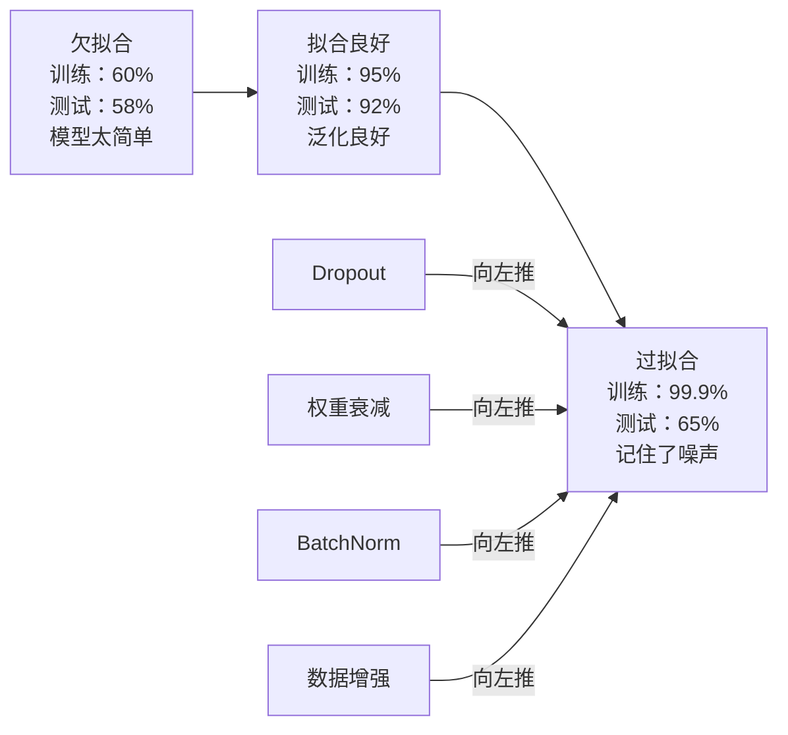
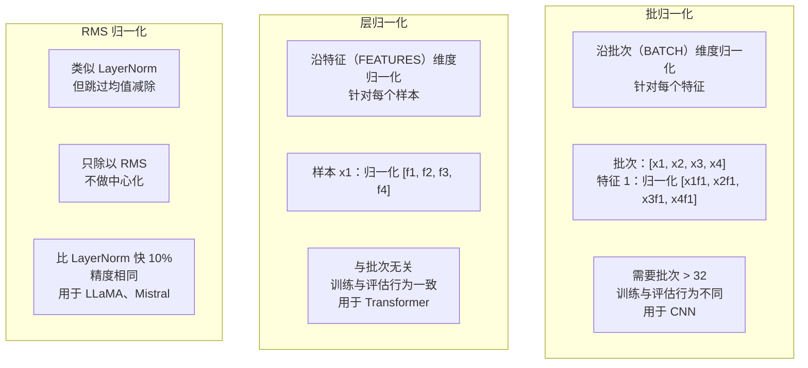
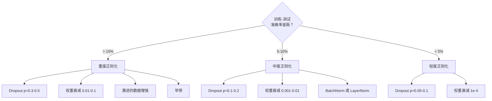

# 正则化（Regularization）

> 模型在训练集上拿 99%，测试集上只有 60%。它背下了数据，而不是学会了规律。正则化就是你强加给复杂性的税，逼模型学会泛化。

**Type:** Build
**Languages:** Python
**Prerequisites:** Lesson 03.06 (Optimizers)
**Time:** ~75 minutes

## 学习目标（Learning Objectives）

- 从零实现带反向缩放（inverted scaling）的 dropout、L2 权重衰减、批归一化（batch normalization）、层归一化（layer normalization）和 RMSNorm
- 测量训练-测试准确率差距，并通过正则化实验诊断过拟合
- 解释为什么 transformer 用 LayerNorm 而不是 BatchNorm，以及为什么现代 LLM 更偏爱 RMSNorm
- 根据过拟合的严重程度，应用正确的正则化技术组合

## 问题所在（The Problem）

参数足够的神经网络可以记住任何数据集。这不是假设——Zhang 等人（2017）用随机标签在 ImageNet 上训练标准网络证明了这一点。这些网络在完全随机的标签分配上把训练损失压到了接近零。它们记住了一百万对毫无规律的随机输入-输出。训练损失完美，测试准确率为零。

这就是过拟合问题，而且模型越大越严重。GPT-3 有 1750 亿个参数，训练集约 5000 亿个词元（token）。参数多到这个程度，模型有足够的容量把训练数据的很大一部分一字不差地背下来。没有正则化，它就只会原样吐出训练样本，而不是学习可泛化的模式。

训练表现与测试表现之间的差距就是过拟合差距。本课的每种技术都从不同角度攻击这个差距。Dropout 逼网络不依赖任何单个神经元。权重衰减防止任何单个权重长得太大。批归一化把损失曲面抚平，让优化器找到更平坦、更可泛化的极小值。层归一化做的是同一件事，但在批归一化失效的场景（小批次、变长序列）下依然有效。RMSNorm 去掉了均值计算，速度快约 10%。每种技术都很简单，合在一起，就决定了你得到的是一个背书的模型还是一个会举一反三的模型。

## 核心概念（The Concept）

### 过拟合谱系（The Overfitting Spectrum）

每个模型都处在从欠拟合（太简单，抓不住规律）到过拟合（太复杂，把噪声也学进去了）的谱系上的某个位置。最佳平衡点在中间，正则化就是从过拟合一侧把模型往中间推。



### Dropout

最简单的正则化技术，却有着最优雅的解释。训练时，以概率 p 随机把每个神经元的输出置零。

```
output = activation(z) * mask    where mask[i] ~ Bernoulli(1 - p)
```

取 p = 0.5，每次前向传播都有一半神经元被置零。网络必须学习冗余的表示，因为它无法预测哪些神经元可用。这防止了共适应（co-adaptation）——神经元学会依赖另外某些特定神经元的存在。

集成解释：一个有 N 个神经元的网络加 dropout 会产生 2^N 个可能的子网络（每个神经元开或关的每种组合）。用 dropout 训练近似于同时训练全部 2^N 个子网络，各自面对不同的 mini-batch。测试时你使用全部神经元（不 dropout），并把输出乘以 (1 - p) 来匹配训练时的期望值。这等价于对 2^N 个子网络的预测取平均——单个模型撑起一个庞大集成。

实践中，缩放放在训练阶段而不是测试阶段做（inverted dropout）：

```
During training:  output = activation(z) * mask / (1 - p)
During testing:   output = activation(z)   (no change needed)
```

这样更干净，因为测试代码完全不需要知道 dropout 的存在。

默认比率：transformer 用 p = 0.1，MLP 用 p = 0.5，CNN 用 p = 0.2-0.3。Dropout 越高 = 正则化越强 = 欠拟合风险越大。

### 权重衰减与 L2 正则化（Weight Decay (L2 Regularization)）

把所有权重的平方和加进损失：

```
total_loss = task_loss + (lambda / 2) * sum(w_i^2)
```

正则化项的梯度是 lambda * w。这意味着每一步，每个权重都朝零收缩，收缩量与其自身大小成正比。大权重受罚更重，模型被推向"没有任何单个权重独大"的解。

为什么这有助于泛化：过拟合的模型往往有大权重，会放大训练数据里的噪声。权重衰减把权重保持得很小，限制了模型的有效容量，逼它依靠鲁棒、可泛化的特征，而不是记住的怪癖。

lambda 超参数控制强度。典型取值：

- transformer 上的 AdamW：0.01
- CNN 上的 SGD：1e-4
- 严重过拟合的模型：0.1

正如第 06 课讨论的：权重衰减与 L2 正则化在 SGD 中等价，在 Adam 中不等价。用 Adam 训练时，请始终使用 AdamW（解耦权重衰减）。

### 批归一化（Batch Normalization）

在把每一层的输出传给下一层之前，沿 mini-batch 维度对其做归一化。

对某一层的一批激活值：

```
mu = (1/B) * sum(x_i)           (batch mean)
sigma^2 = (1/B) * sum((x_i - mu)^2)   (batch variance)
x_hat = (x_i - mu) / sqrt(sigma^2 + eps)   (normalize)
y = gamma * x_hat + beta        (scale and shift)
```

Gamma 和 beta 是可学习参数，如果最优解是撤销归一化，网络可以自己学出来。没有它们，你就强行要求每层输出都是零均值、单位方差，而这未必是网络想要的。

**训练与推理的区别：** 训练时，mu 和 sigma 来自当前 mini-batch；推理时，你使用训练期间累积的滑动平均（动量 momentum = 0.1 的指数滑动平均，即 90% 旧值 + 10% 新值）。

BatchNorm 为什么有效至今仍有争议。原论文声称它减少了"内部协变量偏移"（internal covariate shift，即前面各层更新时层输入分布的变化）。Santurkar 等人（2018）证明这个解释是错的。真正的原因是：BatchNorm 让损失曲面更平滑。梯度更具可预测性，Lipschitz 常数更小，优化器可以安全地迈更大的步子。这就是 BatchNorm 让你能用更高学习率、更快收敛的原因。

BatchNorm 有一个根本局限：它依赖批次统计量。批次大小为 1 时，均值和方差毫无意义；小批次（< 32）时，统计量噪声很大，损害性能。这对目标检测（显存限制批次大小）和语言建模（序列长度不一）这类任务很关键。

### 层归一化（Layer Normalization）

改为沿特征维度而不是批次维度归一化。对单个样本：

```
mu = (1/D) * sum(x_j)           (feature mean)
sigma^2 = (1/D) * sum((x_j - mu)^2)   (feature variance)
x_hat = (x_j - mu) / sqrt(sigma^2 + eps)
y = gamma * x_hat + beta
```

D 是特征维度。每个样本独立归一化——完全不依赖批次大小。这就是 transformer 用 LayerNorm 而不用 BatchNorm 的原因：序列长度可变，批次常常很小（生成时甚至为 1），而且训练与推理的计算完全一致。

Transformer 中的 LayerNorm 放在每个自注意力块和每个前馈块之后（Post-LN），或放在它们之前（Pre-LN，训练更稳定）。

### RMSNorm

去掉均值减除的 LayerNorm。由 Zhang 与 Sennrich（2019）提出。

```
rms = sqrt((1/D) * sum(x_j^2))
y = gamma * x / rms
```

就这么简单。不算均值，没有 beta 参数。他们的观察是：LayerNorm 中重新居中（减均值）对模型性能的贡献很小，却要花计算。去掉它，精度不变，开销省约 10%。

LLaMA、LLaMA 2、LLaMA 3、Mistral 以及大多数现代 LLM 都用 RMSNorm 而不是 LayerNorm。在数十亿参数、数万亿词元的规模上，这 10% 的节省非常可观。

### 归一化方法对比（Normalization Comparison）



### 作为正则化的数据增强（Data Augmentation as Regularization）

不改模型，改数据。在保持标签不变的前提下变换训练输入：

- 图像：随机裁剪、翻转、旋转、颜色抖动、cutout
- 文本：同义词替换、回译、随机删除
- 音频：时间拉伸、音高偏移、加噪声

效果与正则化完全一样：它增大了训练集的有效规模，让模型更难记住具体样本。只见过原始形态图像一次的模型可以把它背下来；见过每张图 50 个增强版本的模型则被迫学习不变的结构。

### 早停（Early Stopping）

最简单的正则化手段：当验证损失开始上升时就停止训练。那时模型还没有过拟合。实践中，你每个 epoch 记录验证损失，保存最好的模型，并继续训练一个"耐心"窗口（通常 5-20 个 epoch）。如果验证损失在耐心窗口内没有改善，就停下来，加载保存的最好模型。

### 何时用什么（When to Apply What）



```figure
l2-regularization
```

## 动手实现（Build It）

### 第 1 步：Dropout（训练与评估模式）（Step 1: Dropout (Train and Eval Mode)）

```python
import random
import math


class Dropout:
    def __init__(self, p=0.5):
        self.p = p
        self.training = True
        self.mask = None

    def forward(self, x):
        if not self.training:
            return list(x)
        self.mask = []
        output = []
        for val in x:
            if random.random() < self.p:
                self.mask.append(0)
                output.append(0.0)
            else:
                self.mask.append(1)
                output.append(val / (1 - self.p))
        return output

    def backward(self, grad_output):
        grads = []
        for g, m in zip(grad_output, self.mask):
            if m == 0:
                grads.append(0.0)
            else:
                grads.append(g / (1 - self.p))
        return grads
```

### 第 2 步：L2 权重衰减（Step 2: L2 Weight Decay）

```python
def l2_regularization(weights, lambda_reg):
    penalty = 0.0
    for w in weights:
        penalty += w * w
    return lambda_reg * 0.5 * penalty

def l2_gradient(weights, lambda_reg):
    return [lambda_reg * w for w in weights]
```

### 第 3 步：批归一化（Step 3: Batch Normalization）

```python
class BatchNorm:
    def __init__(self, num_features, momentum=0.1, eps=1e-5):
        self.gamma = [1.0] * num_features
        self.beta = [0.0] * num_features
        self.eps = eps
        self.momentum = momentum
        self.running_mean = [0.0] * num_features
        self.running_var = [1.0] * num_features
        self.training = True
        self.num_features = num_features

    def forward(self, batch):
        batch_size = len(batch)
        if self.training:
            mean = [0.0] * self.num_features
            for sample in batch:
                for j in range(self.num_features):
                    mean[j] += sample[j]
            mean = [m / batch_size for m in mean]

            var = [0.0] * self.num_features
            for sample in batch:
                for j in range(self.num_features):
                    var[j] += (sample[j] - mean[j]) ** 2
            var = [v / batch_size for v in var]

            for j in range(self.num_features):
                self.running_mean[j] = (1 - self.momentum) * self.running_mean[j] + self.momentum * mean[j]
                self.running_var[j] = (1 - self.momentum) * self.running_var[j] + self.momentum * var[j]
        else:
            mean = list(self.running_mean)
            var = list(self.running_var)

        self.x_hat = []
        output = []
        for sample in batch:
            normalized = []
            out_sample = []
            for j in range(self.num_features):
                x_h = (sample[j] - mean[j]) / math.sqrt(var[j] + self.eps)
                normalized.append(x_h)
                out_sample.append(self.gamma[j] * x_h + self.beta[j])
            self.x_hat.append(normalized)
            output.append(out_sample)
        return output
```

### 第 4 步：层归一化（Step 4: Layer Normalization）

```python
class LayerNorm:
    def __init__(self, num_features, eps=1e-5):
        self.gamma = [1.0] * num_features
        self.beta = [0.0] * num_features
        self.eps = eps
        self.num_features = num_features

    def forward(self, x):
        mean = sum(x) / len(x)
        var = sum((xi - mean) ** 2 for xi in x) / len(x)

        self.x_hat = []
        output = []
        for j in range(self.num_features):
            x_h = (x[j] - mean) / math.sqrt(var + self.eps)
            self.x_hat.append(x_h)
            output.append(self.gamma[j] * x_h + self.beta[j])
        return output
```

### 第 5 步：RMSNorm（Step 5: RMSNorm）

```python
class RMSNorm:
    def __init__(self, num_features, eps=1e-6):
        self.gamma = [1.0] * num_features
        self.eps = eps
        self.num_features = num_features

    def forward(self, x):
        rms = math.sqrt(sum(xi * xi for xi in x) / len(x) + self.eps)
        output = []
        for j in range(self.num_features):
            output.append(self.gamma[j] * x[j] / rms)
        return output
```

### 第 6 步：有无正则化的训练对比（Step 6: Training With and Without Regularization）

```python
def sigmoid(x):
    x = max(-500, min(500, x))
    return 1.0 / (1.0 + math.exp(-x))


def make_circle_data(n=200, seed=42):
    random.seed(seed)
    data = []
    for _ in range(n):
        x = random.uniform(-2, 2)
        y = random.uniform(-2, 2)
        label = 1.0 if x * x + y * y < 1.5 else 0.0
        data.append(([x, y], label))
    return data


class RegularizedNetwork:
    def __init__(self, hidden_size=16, lr=0.05, dropout_p=0.0, weight_decay=0.0):
        random.seed(0)
        self.hidden_size = hidden_size
        self.lr = lr
        self.dropout_p = dropout_p
        self.weight_decay = weight_decay
        self.dropout = Dropout(p=dropout_p) if dropout_p > 0 else None

        self.w1 = [[random.gauss(0, 0.5) for _ in range(2)] for _ in range(hidden_size)]
        self.b1 = [0.0] * hidden_size
        self.w2 = [random.gauss(0, 0.5) for _ in range(hidden_size)]
        self.b2 = 0.0

    def forward(self, x, training=True):
        self.x = x
        self.z1 = []
        self.h = []
        for i in range(self.hidden_size):
            z = self.w1[i][0] * x[0] + self.w1[i][1] * x[1] + self.b1[i]
            self.z1.append(z)
            self.h.append(max(0.0, z))

        if self.dropout and training:
            self.dropout.training = True
            self.h = self.dropout.forward(self.h)
        elif self.dropout:
            self.dropout.training = False
            self.h = self.dropout.forward(self.h)

        self.z2 = sum(self.w2[i] * self.h[i] for i in range(self.hidden_size)) + self.b2
        self.out = sigmoid(self.z2)
        return self.out

    def backward(self, target):
        eps = 1e-15
        p = max(eps, min(1 - eps, self.out))
        d_loss = -(target / p) + (1 - target) / (1 - p)
        d_sigmoid = self.out * (1 - self.out)
        d_out = d_loss * d_sigmoid

        for i in range(self.hidden_size):
            d_relu = 1.0 if self.z1[i] > 0 else 0.0
            d_h = d_out * self.w2[i] * d_relu
            self.w2[i] -= self.lr * (d_out * self.h[i] + self.weight_decay * self.w2[i])
            for j in range(2):
                self.w1[i][j] -= self.lr * (d_h * self.x[j] + self.weight_decay * self.w1[i][j])
            self.b1[i] -= self.lr * d_h
        self.b2 -= self.lr * d_out

    def evaluate(self, data):
        correct = 0
        total_loss = 0.0
        for x, y in data:
            pred = self.forward(x, training=False)
            eps = 1e-15
            p = max(eps, min(1 - eps, pred))
            total_loss += -(y * math.log(p) + (1 - y) * math.log(1 - p))
            if (pred >= 0.5) == (y >= 0.5):
                correct += 1
        return total_loss / len(data), correct / len(data) * 100

    def train_model(self, train_data, test_data, epochs=300):
        history = []
        for epoch in range(epochs):
            total_loss = 0.0
            correct = 0
            for x, y in train_data:
                pred = self.forward(x, training=True)
                self.backward(y)
                eps = 1e-15
                p = max(eps, min(1 - eps, pred))
                total_loss += -(y * math.log(p) + (1 - y) * math.log(1 - p))
                if (pred >= 0.5) == (y >= 0.5):
                    correct += 1
            train_loss = total_loss / len(train_data)
            train_acc = correct / len(train_data) * 100
            test_loss, test_acc = self.evaluate(test_data)
            history.append((train_loss, train_acc, test_loss, test_acc))
            if epoch % 75 == 0 or epoch == epochs - 1:
                gap = train_acc - test_acc
                print(f"    Epoch {epoch:3d}: train_acc={train_acc:.1f}%, test_acc={test_acc:.1f}%, gap={gap:.1f}%")
        return history
```

## 直接使用（Use It）

PyTorch 把所有归一化和正则化都做成了模块：

```python
import torch
import torch.nn as nn

model = nn.Sequential(
    nn.Linear(784, 256),
    nn.BatchNorm1d(256),
    nn.ReLU(),
    nn.Dropout(0.3),
    nn.Linear(256, 128),
    nn.BatchNorm1d(128),
    nn.ReLU(),
    nn.Dropout(0.3),
    nn.Linear(128, 10),
)

model.train()
out_train = model(torch.randn(32, 784))

model.eval()
out_test = model(torch.randn(1, 784))
```

`model.train()` / `model.eval()` 这个开关至关重要。它控制 dropout 的开与关，并告诉 BatchNorm 使用批次统计量还是滑动统计量。推理前忘了 `model.eval()` 是深度学习最常见的 bug 之一：dropout 仍在生效、BatchNorm 还在用 mini-batch 统计量，你的测试准确率会随机波动。

对 transformer，模式不一样：

```python
class TransformerBlock(nn.Module):
    def __init__(self, d_model=512, nhead=8, dropout=0.1):
        super().__init__()
        self.attention = nn.MultiheadAttention(d_model, nhead, dropout=dropout)
        self.norm1 = nn.LayerNorm(d_model)
        self.ff = nn.Sequential(
            nn.Linear(d_model, d_model * 4),
            nn.GELU(),
            nn.Linear(d_model * 4, d_model),
            nn.Dropout(dropout),
        )
        self.norm2 = nn.LayerNorm(d_model)
        self.dropout = nn.Dropout(dropout)

    def forward(self, x):
        attended, _ = self.attention(x, x, x)
        x = self.norm1(x + self.dropout(attended))
        x = self.norm2(x + self.ff(x))
        return x
```

用 LayerNorm，不用 BatchNorm；Dropout 取 p=0.1，不取 p=0.5。这些就是 transformer 的默认配置。

## 交付成果（Ship It）

本课产出：
- `outputs/prompt-regularization-advisor.md`——诊断过拟合并推荐正确正则化策略的提示词

## 练习（Exercises）

1. 为二维数据实现空间 dropout（spatial dropout）：不丢弃单个神经元，而是丢弃整个特征通道。模拟方法是：把连续的特征分组当作通道，整组整组地丢弃。在圆形数据集上（hidden_size=32）比较它与标准 dropout 的训练-测试差距。

2. 把第 05 课的标签平滑与本课的 dropout 结合起来。用四种配置训练：都不用、只用 dropout、只用标签平滑、两者都用。测量每种配置的最终训练-测试准确率差距。哪种组合差距最小？

3. 在你的圆形数据集网络中，在隐藏层和激活函数之间加一个 BatchNorm 层。分别在 0.01、0.05、0.1 三个学习率下做带 BatchNorm 和不带 BatchNorm 的训练。BatchNorm 应该能在朴素网络发散的高学习率下保持训练稳定。

4. 实现早停：每个 epoch 记录测试损失，保存最好的权重，如果测试损失连续 20 个 epoch 没有改善就停止。把正则化网络跑满 1000 个 epoch，报告最佳测试准确率出现在哪个 epoch，以及省下了多少个 epoch 的计算量。

5. 在一个 4 层网络（不只是 2 层）上比较 LayerNorm 与 RMSNorm。两者用相同的权重初始化，训练 200 个 epoch，比较最终准确率、训练速度（每个 epoch 耗时）和第一层的梯度大小。验证 RMSNorm 在精度相同的情况下更快。

## 关键术语（Key Terms）

| 术语 | 人们常说的 | 实际含义 |
|------|----------------|----------------------|
| 过拟合（overfitting） | "模型把数据背下来了" | 模型的训练表现显著高于测试表现，说明它学到的是噪声而不是信号 |
| 正则化（regularization） | "防止过拟合" | 任何约束模型复杂度以改善泛化的技术：dropout、权重衰减、归一化、数据增强 |
| Dropout | "随机删神经元" | 训练时以概率 p 随机把神经元置零，逼出冗余表示；等价于训练一个集成 |
| 权重衰减（weight decay） | "L2 惩罚" | 每步减去 lambda * w，把所有权重往零收缩；通过权重大小惩罚复杂度 |
| 批归一化（batch normalization） | "按批次归一化" | 训练时用批次统计量、推理时用滑动平均，沿批次维度归一化层输出 |
| 层归一化（layer normalization） | "按样本归一化" | 在每个样本内部沿特征维度归一化；与批次无关，用于批次大小多变的 transformer |
| RMSNorm | "去掉均值的 LayerNorm" | 均方根归一化；去掉 LayerNorm 的均值减除，提速 10% 而精度不变 |
| 早停（early stopping） | "过拟合前就停" | 验证损失不再改善时终止训练；最简单的正则化手段，常与其他手段配合 |
| 数据增强（data augmentation） | "把一份数据变多份" | 变换训练输入（翻转、裁剪、加噪）以扩大有效数据集规模，逼模型学习不变性 |
| 泛化差距（generalization gap） | "训练-测试落差" | 训练与测试表现的差值；正则化的目标就是把这段差距压到最小 |

## 延伸阅读（Further Reading）

- Srivastava et al., "Dropout: A Simple Way to Prevent Neural Networks from Overfitting" (2014)——dropout 原始论文，含集成解释与大量实验
- Ioffe & Szegedy, "Batch Normalization: Accelerating Deep Network Training by Reducing Internal Covariate Shift" (2015)——提出 BatchNorm 及其训练流程，是引用最多的深度学习论文之一
- Zhang & Sennrich, "Root Mean Square Layer Normalization" (2019)——证明 RMSNorm 以更少的计算达到与 LayerNorm 相当的精度；被 LLaMA 和 Mistral 采用
- Zhang et al., "Understanding Deep Learning Requires Rethinking Generalization" (2017)——里程碑式论文，证明神经网络能记住随机标签，挑战了传统的泛化观念
