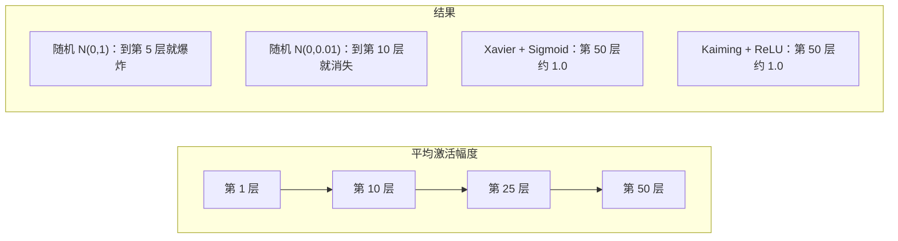
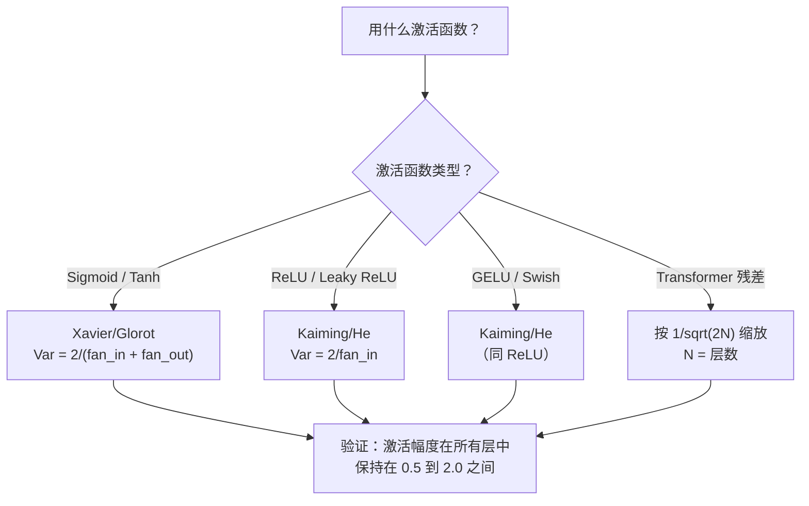

# 权重初始化与训练稳定性（Weight Initialization and Training Stability）

> 初始化错了，训练根本无法开始；初始化对了，50 层网络也能训练得像 3 层一样平稳。

**Type:** Build
**Languages:** Python
**Prerequisites:** Lesson 03.04 (Activation Functions), Lesson 03.07 (Regularization)
**Time:** ~90 minutes

## 学习目标（Learning Objectives）

- 实现零初始化、随机初始化、Xavier/Glorot 和 Kaiming/He 初始化策略，并测量它们在 50 层网络中对激活值幅度的影响
- 推导 Xavier 初始化为什么用 Var(w) = 2/(fan_in + fan_out)，而 Kaiming 为什么用 Var(w) = 2/fan_in
- 用零初始化演示对称性问题，并解释为什么仅有随机缩放还不够
- 把正确的初始化策略与激活函数配对：Xavier 配 sigmoid/tanh，Kaiming 配 ReLU/GELU

## 问题所在（The Problem）

把所有权初始化为零。什么都学不到。每个神经元计算相同的函数，收到相同的梯度，更新得一模一样。跑完 10,000 个 epoch，你的 512 神经元隐藏层仍然是 512 份同一个神经元的拷贝。你花了 512 个参数的钱，只买到 1 个。

把它们初始化得太大。激活值沿着网络层层爆炸，到第 10 层就冲到 1e15，到第 20 层直接溢出成无穷大。梯度会沿同样的轨迹反向爆炸。

用标准正态分布随机初始化。3 层的网络没问题；到了 50 层，信号要么塌缩为零，要么炸成无穷大，取决于随机尺度是稍微偏小还是稍微偏大。"能用"和"报废"之间的边界薄如刀刃。

权重初始化是深度学习里最被低估的决策。架构能上论文，优化器能上博客，初始化只能混个脚注。但它一旦做错，其他一切都无所谓了——你的网络在训练开始前就已经死了。

## 核心概念（The Concept）

### 对称性问题（The Symmetry Problem）

同一层里的每个神经元结构都一样：输入乘权重，加偏置，套激活函数。如果所有权重从同一个值出发（零是极端情况），每个神经元就算出相同的输出。反向传播时，每个神经元收到相同的梯度；更新时，每个神经元移动相同的距离。

你被困住了。网络有数百个参数，却都在齐步走。这叫对称性（symmetry），随机初始化是打破它的暴力手段。每个神经元在权重空间里从不同的点出发，于是各自学到不同的特征。

但"随机"还不够。随机性的*尺度*决定网络能不能训练起来。

### 跨层的方差传播（Variance Propagation Through Layers）

考虑一个有 fan_in 个输入的单层：

```
z = w1*x1 + w2*x2 + ... + w_n*x_n
```

如果每个权重 wi 来自方差为 Var(w) 的分布，每个输入 xi 的方差为 Var(x)，那么输出方差是：

```
Var(z) = fan_in * Var(w) * Var(x)
```

如果 Var(w) = 1、fan_in = 512，输出方差就是输入方差的 512 倍。过 10 层之后：512^10 = 1.2e27。信号爆炸了。

如果 Var(w) = 0.001，输出方差每层缩小 0.001 * 512 = 0.512 倍。过 10 层之后：0.512^10 = 0.00013。信号消失了。

目标：选好 Var(w)，让 Var(z) = Var(x)，信号幅度跨层保持恒定。

### Xavier/Glorot 初始化（Xavier/Glorot Initialization）

Glorot 和 Bengio（2010）为 sigmoid 和 tanh 激活推导出了这个解。要让方差在前向和反向传播中都保持恒定：

```
Var(w) = 2 / (fan_in + fan_out)
```

实践中权重按下面的分布采样：

```
w ~ Uniform(-limit, limit)  where limit = sqrt(6 / (fan_in + fan_out))
```

或者：

```
w ~ Normal(0, sqrt(2 / (fan_in + fan_out)))
```

它有效是因为 sigmoid 和 tanh 在零附近近似线性，而初始化得当的激活值恰好就活在那附近。方差因此能稳定穿过几十层。

### Kaiming/He 初始化（Kaiming/He Initialization）

ReLU 杀掉一半输出（所有负值都变成零）。有效 fan_in 因此减半，因为平均有一半输入被清零。Xavier 初始化没有考虑这一点——它低估了所需的方差。

He 等人（2015）调整了公式：

```
Var(w) = 2 / fan_in
```

权重按下面的分布采样：

```
w ~ Normal(0, sqrt(2 / fan_in))
```

这个因子 2 补偿了 ReLU 清零一半激活值的事实。没有它，信号每层缩小约 0.5 倍；50 层之后：0.5^50 = 8.8e-16。Kaiming 初始化防的就是这个。

### Transformer 初始化（Transformer Initialization）

GPT-2 引入了一种不同的模式。残差连接把每个子层的输出加到它的输入上：

```
x = x + sublayer(x)
```

每加一次，方差就涨一点。有 N 个残差层，方差就按 N 成比例增长。GPT-2 把残差层的权重乘以 1/sqrt(2N)，其中 N 是层数。这保证了累积信号幅度的稳定。

Llama 3（4050 亿参数，126 层）用的是类似方案。没有这个缩放，残差流会在 126 层注意力块和前馈块中无节制地膨胀。

```mermaid
flowchart TD
    subgraph "零初始化"
        Z1["第 1 层<br/>所有权重 = 0"] --> Z2["第 2 层<br/>所有神经元完全相同"]
        Z2 --> Z3["第 3 层<br/>依然完全相同"]
        Z3 --> ZR["结果：无论宽度多大<br/>只有 1 个有效神经元"]
    end

    subgraph "Xavier 初始化"
        X1["第 1 层<br/>Var = 2/(fan_in+fan_out)"] --> X2["第 2 层<br/>信号稳定"]
        X2 --> X3["第 50 层<br/>信号稳定"]
        X3 --> XR["结果：可与<br/>sigmoid/tanh 搭配训练"]
    end

    subgraph "Kaiming 初始化"
        K1["第 1 层<br/>Var = 2/fan_in"] --> K2["第 2 层<br/>信号稳定"]
        K2 --> K3["第 50 层<br/>信号稳定"]
        K3 --> KR["结果：可与<br/>ReLU/GELU 搭配训练"]
    end
```



### 50 层中的激活值幅度（Activation Magnitude Through 50 Layers）



### 选择合适的初始化（Choosing the Right Init）



```figure
weight-init-variance
```

## 动手实现（Build It）

### 第 1 步：初始化策略（Step 1: Initialization Strategies）

四种初始化权重矩阵的方式。每种都返回一个列表的列表（二维矩阵），有 fan_in 列、fan_out 行。

```python
import math
import random


def zero_init(fan_in, fan_out):
    return [[0.0 for _ in range(fan_in)] for _ in range(fan_out)]


def random_init(fan_in, fan_out, scale=1.0):
    return [[random.gauss(0, scale) for _ in range(fan_in)] for _ in range(fan_out)]


def xavier_init(fan_in, fan_out):
    std = math.sqrt(2.0 / (fan_in + fan_out))
    return [[random.gauss(0, std) for _ in range(fan_in)] for _ in range(fan_out)]


def kaiming_init(fan_in, fan_out):
    std = math.sqrt(2.0 / fan_in)
    return [[random.gauss(0, std) for _ in range(fan_in)] for _ in range(fan_out)]
```

### 第 2 步：激活函数（Step 2: Activation Functions）

我们需要 sigmoid、tanh 和 ReLU，把每种初始化策略与它设计时对应的激活函数配对测试。

```python
def sigmoid(x):
    x = max(-500, min(500, x))
    return 1.0 / (1.0 + math.exp(-x))


def tanh_act(x):
    return math.tanh(x)


def relu(x):
    return max(0.0, x)
```

### 第 3 步：穿过 50 层的前向传播（Step 3: Forward Pass Through 50 Layers）

把随机数据送进一个深网络，测量每一层的平均激活幅度。

```python
def forward_deep(init_fn, activation_fn, n_layers=50, width=64, n_samples=100):
    random.seed(42)
    layer_magnitudes = []

    inputs = [[random.gauss(0, 1) for _ in range(width)] for _ in range(n_samples)]

    for layer_idx in range(n_layers):
        weights = init_fn(width, width)
        biases = [0.0] * width

        new_inputs = []
        for sample in inputs:
            output = []
            for neuron_idx in range(width):
                z = sum(weights[neuron_idx][j] * sample[j] for j in range(width)) + biases[neuron_idx]
                output.append(activation_fn(z))
            new_inputs.append(output)
        inputs = new_inputs

        magnitudes = []
        for sample in inputs:
            magnitudes.append(sum(abs(v) for v in sample) / width)
        mean_mag = sum(magnitudes) / len(magnitudes)
        layer_magnitudes.append(mean_mag)

    return layer_magnitudes
```

### 第 4 步：实验（Step 4: The Experiment）

跑全部组合：零初始化、随机 N(0,1)、随机 N(0,0.01)、Xavier 配 sigmoid、Xavier 配 tanh、Kaiming 配 ReLU。打印关键层的幅度。

```python
def run_experiment():
    configs = [
        ("Zero init + Sigmoid", lambda fi, fo: zero_init(fi, fo), sigmoid),
        ("Random N(0,1) + ReLU", lambda fi, fo: random_init(fi, fo, 1.0), relu),
        ("Random N(0,0.01) + ReLU", lambda fi, fo: random_init(fi, fo, 0.01), relu),
        ("Xavier + Sigmoid", xavier_init, sigmoid),
        ("Xavier + Tanh", xavier_init, tanh_act),
        ("Kaiming + ReLU", kaiming_init, relu),
    ]

    print(f"{'Strategy':<30} {'L1':>10} {'L5':>10} {'L10':>10} {'L25':>10} {'L50':>10}")
    print("-" * 80)

    for name, init_fn, act_fn in configs:
        mags = forward_deep(init_fn, act_fn)
        row = f"{name:<30}"
        for idx in [0, 4, 9, 24, 49]:
            val = mags[idx]
            if val > 1e6:
                row += f" {'EXPLODED':>10}"
            elif val < 1e-6:
                row += f" {'VANISHED':>10}"
            else:
                row += f" {val:>10.4f}"
        print(row)
```

### 第 5 步：对称性演示（Step 5: Symmetry Demonstration）

展示零初始化会产生完全相同的神经元。

```python
def symmetry_demo():
    random.seed(42)
    weights = zero_init(2, 4)
    biases = [0.0] * 4

    inputs = [0.5, -0.3]
    outputs = []
    for neuron_idx in range(4):
        z = sum(weights[neuron_idx][j] * inputs[j] for j in range(2)) + biases[neuron_idx]
        outputs.append(sigmoid(z))

    print("\nSymmetry Demo (4 neurons, zero init):")
    for i, out in enumerate(outputs):
        print(f"  Neuron {i}: output = {out:.6f}")
    all_same = all(abs(outputs[i] - outputs[0]) < 1e-10 for i in range(len(outputs)))
    print(f"  All identical: {all_same}")
    print(f"  Effective parameters: 1 (not {len(weights) * len(weights[0])})")
```

### 第 6 步：逐层幅度报告（Step 6: Layer-by-Layer Magnitude Report）

打印一个可视化的条形图，展示激活幅度穿过 50 层的变化。

```python
def magnitude_report(name, magnitudes):
    print(f"\n{name}:")
    for i, mag in enumerate(magnitudes):
        if i % 5 == 0 or i == len(magnitudes) - 1:
            if mag > 1e6:
                bar = "X" * 50 + " EXPLODED"
            elif mag < 1e-6:
                bar = "." + " VANISHED"
            else:
                bar_len = min(50, max(1, int(mag * 10)))
                bar = "#" * bar_len
            print(f"  Layer {i+1:3d}: {bar} ({mag:.6f})")
```

## 直接使用（Use It）

PyTorch 把这些做成了内置函数：

```python
import torch
import torch.nn as nn

layer = nn.Linear(512, 256)

nn.init.xavier_uniform_(layer.weight)
nn.init.xavier_normal_(layer.weight)

nn.init.kaiming_uniform_(layer.weight, nonlinearity='relu')
nn.init.kaiming_normal_(layer.weight, nonlinearity='relu')

nn.init.zeros_(layer.bias)
```

当你调用 `nn.Linear(512, 256)` 时，PyTorch 默认使用 Kaiming 均匀初始化。这就是为什么大多数简单网络"开箱即用"——PyTorch 已经替你做了正确的选择。但当你搭建自定义架构或深度超过 20 层时，就需要理解背后发生了什么，并可能要覆盖默认值。

对 transformer 来说，HuggingFace 模型通常在各自的 `_init_weights` 方法里处理初始化。GPT-2 的实现把残差投影乘以 1/sqrt(N)。如果你从零构建 transformer，就得自己加上这一步。

## 交付成果（Ship It）

本课产出：
- `outputs/prompt-init-strategy.md`——诊断权重初始化问题并推荐正确策略的提示词

## 练习（Exercises）

1. 实现 LeCun 初始化（Var = 1/fan_in，为 SELU 激活设计）。用 LeCun 初始化 + tanh 跑 50 层实验，与 Xavier + tanh 比较。

2. 实现 GPT-2 的残差缩放：在把每层输出加进残差流之前，先乘以 1/sqrt(2*N)。分别跑 50 层的带缩放和不带缩放版本，测量残差幅度增长得多快。

3. 写一个"初始化健康检查"函数：接收网络的各层维度和激活函数类型，推荐正确的初始化方式，并在当前初始化会出问题时给出警告。

4. 分别用 fan_in = 16 和 fan_in = 1024 跑实验。Xavier 和 Kaiming 会自适应 fan_in，而随机初始化不会。展示层越大时，"能用"与"报废"之间的差距如何拉大。

5. 实现正交初始化（生成一个随机矩阵，计算它的 SVD，使用正交矩阵 U）。在 50 层的 ReLU 网络上与 Kaiming 比较。

## 关键术语（Key Terms）

| 术语 | 人们常说的 | 实际含义 |
|------|----------------|----------------------|
| 权重初始化（weight initialization） | "随机设个起始权重" | 选择初始权重值的策略，决定网络到底能不能训练起来 |
| 对称性打破（symmetry breaking） | "让神经元彼此不同" | 用随机初始化保证各神经元学到不同的特征，而不是计算同一个函数 |
| Fan-in | "一个神经元的输入个数" | 入边连接数，决定输入方差在加权和里如何累积 |
| Fan-out | "一个神经元的输出个数" | 出边连接数，关系到反向传播时能否维持梯度方差 |
| Xavier/Glorot 初始化 | "给 sigmoid 用的初始化" | Var(w) = 2/(fan_in + fan_out)，为在 sigmoid 和 tanh 激活下保持方差而设计 |
| Kaiming/He 初始化 | "给 ReLU 用的初始化" | Var(w) = 2/fan_in，考虑了 ReLU 清零一半激活值的事实 |
| 方差传播（variance propagation） | "信号跨层是变强还是变弱" | 分析激活方差如何随权重尺度逐层变化的数学工具 |
| 残差缩放（residual scaling） | "GPT-2 的初始化技巧" | 把残差连接的权重乘以 1/sqrt(2N)，防止方差在 N 层 transformer 中持续增长 |
| 死网络（dead network） | "什么都训不动" | 初始化不当导致所有梯度为零或所有激活饱和的网络 |
| 激活值爆炸（exploding activations） | "数值奔向无穷大" | 权重方差过高，激活幅度逐层指数增长的现象 |

## 延伸阅读（Further Reading）

- Glorot & Bengio, "Understanding the difficulty of training deep feedforward neural networks" (2010)——Xavier 初始化原始论文，含方差分析
- He et al., "Delving Deep into Rectifiers" (2015)——为 ReLU 网络提出 Kaiming 初始化
- Radford et al., "Language Models are Unsupervised Multitask Learners" (2019)——GPT-2 论文，含残差缩放初始化
- Mishkin & Matas, "All You Need is a Good Init" (2016)——层序单位方差初始化（layer-sequential unit-variance），解析公式之外的经验方案
