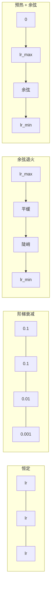
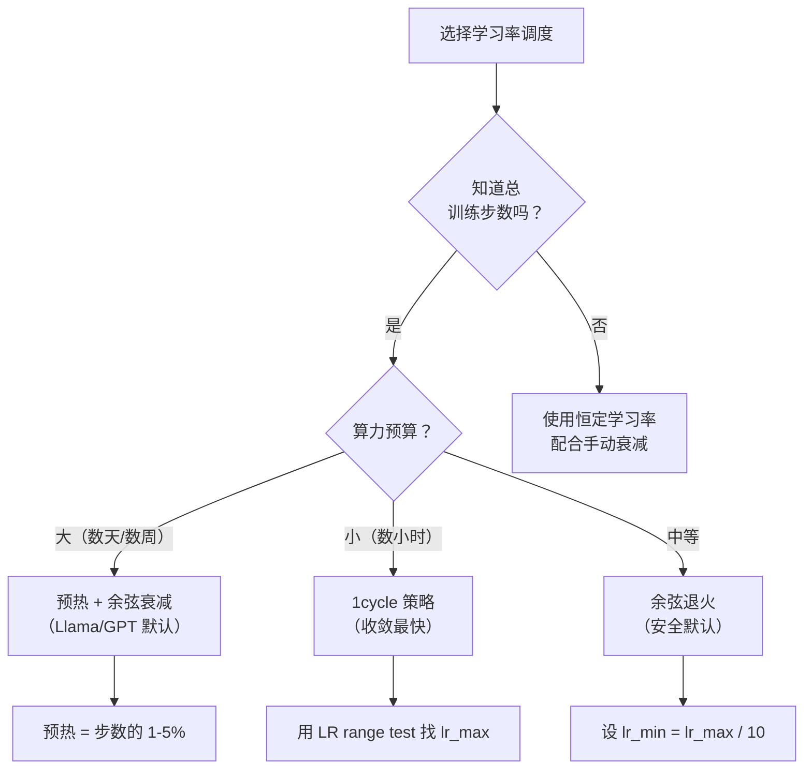
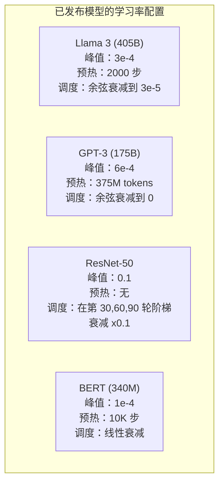

# 学习率调度与预热（Learning Rate Schedules and Warmup）

> 学习率是唯一最重要的超参数。不是架构，不是数据量，也不是激活函数——是学习率。别的都可以不调，这个必须调。

**Type:** Build
**Languages:** Python
**Prerequisites:** Lesson 03.06 (Optimizers), Lesson 03.08 (Weight Initialization)
**Time:** ~90 minutes

## 学习目标（Learning Objectives）

- 从零实现恒定、阶梯衰减、余弦退火、warmup + 余弦和 1cycle 学习率调度
- 演示学习率选择的三种失败模式：发散（太高）、停滞（太低）和震荡（没有衰减）
- 解释为什么基于 Adam 的优化器需要预热（warmup），以及它如何稳定训练初期
- 在同一任务上比较全部五种调度的收敛速度，并根据训练预算选出合适的一种

## 问题所在（The Problem）

把学习率设成 0.1，训练发散——3 步之内损失冲到无穷大。设成 0.0001，训练爬行——100 个 epoch 之后模型几乎还在随机初始化的位置。设成 0.01，前 50 个 epoch 训练正常，然后损失在一个永远够不着的极小值附近震荡，因为步子太大。

最优学习率不是一个常数，它在训练过程中不断变化。训练早期，你要大步快跑，尽快扫过大片区域；训练后期，你要小碎步，稳稳落进一个尖锐的极小值。90% 准确率的模型和 95% 准确率的模型，差别常常只在调度上。

过去三年发表的每个主流模型都用学习率调度。Llama 3 用峰值 lr=3e-4、2000 步 warmup，再余弦衰减到 3e-5。GPT-3 用 lr=6e-4，在前 3.75 亿个词元上做 warmup。这些都不是拍脑袋定的，而是花费数百万美元做大规模超参数搜索得出的结果。

你必须理解调度，因为默认参数在你的问题上不会奏效。微调预训练模型时，正确的调度和从零训练不同。加大批次后，warmup 时长也得变。训练在第 10,000 步崩掉时，你需要判断这是调度问题还是别的问题。

## 核心概念（The Concept）

### 恒定学习率（Constant Learning Rate）

最简单的做法。选一个数，每一步都用它。

```
lr(t) = lr_0
```

很少是最优解。它在训练后期要么太高（在极小值附近震荡），要么在训练初期太低（小步走浪费算力）。小模型和调试时够用；任何要训练超过一小时的任务，这都是糟糕的选择。

### 阶梯衰减（Step Decay）

ResNet 时代的老派做法。在固定的 epoch 处把学习率砍掉一个倍数（通常是 10 倍）。

```
lr(t) = lr_0 * gamma^(floor(epoch / step_size))
```

gamma = 0.1、step_size = 30 的意思是：每 30 个 epoch 学习率降 10 倍。ResNet-50 就是这么做的——lr=0.1，在第 30、60、90 个 epoch 各降 10 倍。

问题在于：最优的衰减时机取决于数据集和架构。换一个问题，你就得重新调"什么时候降"。而且切换非常突兀——学习率骤变时损失可能会跳一下。

### 余弦退火（Cosine Annealing）

沿余弦曲线从最大学习率平滑衰减到最小值：

```
lr(t) = lr_min + 0.5 * (lr_max - lr_min) * (1 + cos(pi * t / T))
```

其中 t 是当前步数，T 是总步数。

t=0 时余弦项为 1，所以 lr = lr_max；t=T 时余弦项为 -1，所以 lr = lr_min。衰减先平缓，中段加速，临近尾声再变平缓。

这是大多数现代训练的默认选择。除了 lr_max 和 lr_min，没有别的超参数要调。余弦形状符合一个经验观察：大部分学习发生在训练的中段——你正希望在这段关键时期保持合理的步长。

### 预热：为什么要从小步开始（Warmup: Why You Start Small）

Adam 和其他自适应优化器维护着梯度均值和方差的滑动估计。第 0 步时，这些估计被初始化为零，最初几次梯度更新依据的是垃圾统计量。如果这段时间学习率很大，模型就会迈出巨大而方向糟糕的步子。

预热解决这个问题。用极小的学习率起步（常见为 lr_max / warmup_steps，甚至从零开始），在前 N 步线性爬升到 lr_max。等你到达完整学习率时，Adam 的统计量已经稳定下来了。

```
lr(t) = lr_max * (t / warmup_steps)     for t < warmup_steps
```

典型的预热：占总训练步数的 1-5%。Llama 3 训练了约 1.8 万亿个词元，预热了 2000 步；GPT-3 在 3.75 亿个词元上做预热。

### 线性预热 + 余弦衰减（Linear Warmup + Cosine Decay）

现代默认方案。先线性爬升，再按余弦衰减：

```
if t < warmup_steps:
    lr(t) = lr_max * (t / warmup_steps)
else:
    progress = (t - warmup_steps) / (total_steps - warmup_steps)
    lr(t) = lr_min + 0.5 * (lr_max - lr_min) * (1 + cos(pi * progress))
```

Llama、GPT、PaLM 和大多数现代 transformer 用的都是它。预热防住早期的不稳定，余弦衰减把模型安顿进一个好的极小值。

### 1cycle 策略（1cycle Policy）

Leslie Smith 的发现（2018）：训练前半程把学习率从低值拉到高值，后半程再拉回来。反直觉——为什么要在训练中途*提高*学习率？

理论解释：高学习率通过给优化轨迹注入噪声而起到正则化的作用。爬升阶段让模型探索损失曲面更多的区域，找到更好的盆地；下降阶段再在找到的最好盆地里做精细打磨。

```
Phase 1 (0 to T/2):    lr ramps from lr_max/25 to lr_max
Phase 2 (T/2 to T):    lr ramps from lr_max to lr_max/10000
```

在固定算力预算下，1cycle 往往比余弦退火训练得更快。代价是：你必须提前知道总步数。

### 调度曲线形状（Schedule Shapes）



### 决策流程图（Decision Flowchart）



### 已发布模型的真实数字（Real Numbers from Published Models）



```figure
lr-schedule
```

## 动手实现（Build It）

### 第 1 步：调度函数（Step 1: Schedule Functions）

每个函数接收当前步数，返回该步的学习率。

```python
import math


def constant_schedule(step, lr=0.01, **kwargs):
    return lr


def step_decay_schedule(step, lr=0.1, step_size=100, gamma=0.1, **kwargs):
    return lr * (gamma ** (step // step_size))


def cosine_schedule(step, lr=0.01, total_steps=1000, lr_min=1e-5, **kwargs):
    if step >= total_steps:
        return lr_min
    return lr_min + 0.5 * (lr - lr_min) * (1 + math.cos(math.pi * step / total_steps))


def warmup_cosine_schedule(step, lr=0.01, total_steps=1000, warmup_steps=100, lr_min=1e-5, **kwargs):
    if total_steps <= warmup_steps:
        return lr * (step / max(warmup_steps, 1))
    if step < warmup_steps:
        return lr * step / warmup_steps
    progress = (step - warmup_steps) / (total_steps - warmup_steps)
    return lr_min + 0.5 * (lr - lr_min) * (1 + math.cos(math.pi * progress))


def one_cycle_schedule(step, lr=0.01, total_steps=1000, **kwargs):
    mid = max(total_steps // 2, 1)
    if step < mid:
        return (lr / 25) + (lr - lr / 25) * step / mid
    else:
        progress = (step - mid) / max(total_steps - mid, 1)
        return lr * (1 - progress) + (lr / 10000) * progress
```

### 第 2 步：可视化所有调度（Step 2: Visualize All Schedules）

打印一个文本版的图，展示每种调度在训练过程中的演变。

```python
def visualize_schedule(name, schedule_fn, total_steps=500, **kwargs):
    steps = list(range(0, total_steps, total_steps // 20))
    if total_steps - 1 not in steps:
        steps.append(total_steps - 1)

    lrs = [schedule_fn(s, total_steps=total_steps, **kwargs) for s in steps]
    max_lr = max(lrs) if max(lrs) > 0 else 1.0

    print(f"\n{name}:")
    for s, lr_val in zip(steps, lrs):
        bar_len = int(lr_val / max_lr * 40)
        bar = "#" * bar_len
        print(f"  Step {s:4d}: lr={lr_val:.6f} {bar}")
```

### 第 3 步：训练网络（Step 3: Training Network）

圆形数据集上的简单两层网络，和前面几课一样，但这次我们更换调度。

```python
import random


def sigmoid(x):
    x = max(-500, min(500, x))
    return 1.0 / (1.0 + math.exp(-x))


def relu(x):
    return max(0.0, x)


def relu_deriv(x):
    return 1.0 if x > 0 else 0.0


def make_circle_data(n=200, seed=42):
    random.seed(seed)
    data = []
    for _ in range(n):
        x = random.uniform(-2, 2)
        y = random.uniform(-2, 2)
        label = 1.0 if x * x + y * y < 1.5 else 0.0
        data.append(([x, y], label))
    return data


def train_with_schedule(schedule_fn, schedule_name, data, epochs=300, base_lr=0.05, **kwargs):
    random.seed(0)
    hidden_size = 8
    total_steps = epochs * len(data)

    std = math.sqrt(2.0 / 2)
    w1 = [[random.gauss(0, std) for _ in range(2)] for _ in range(hidden_size)]
    b1 = [0.0] * hidden_size
    w2 = [random.gauss(0, std) for _ in range(hidden_size)]
    b2 = 0.0

    step = 0
    epoch_losses = []

    for epoch in range(epochs):
        total_loss = 0
        correct = 0

        for x, target in data:
            lr = schedule_fn(step, lr=base_lr, total_steps=total_steps, **kwargs)

            z1 = []
            h = []
            for i in range(hidden_size):
                z = w1[i][0] * x[0] + w1[i][1] * x[1] + b1[i]
                z1.append(z)
                h.append(relu(z))

            z2 = sum(w2[i] * h[i] for i in range(hidden_size)) + b2
            out = sigmoid(z2)

            error = out - target
            d_out = error * out * (1 - out)

            for i in range(hidden_size):
                d_h = d_out * w2[i] * relu_deriv(z1[i])
                w2[i] -= lr * d_out * h[i]
                for j in range(2):
                    w1[i][j] -= lr * d_h * x[j]
                b1[i] -= lr * d_h
            b2 -= lr * d_out

            total_loss += (out - target) ** 2
            if (out >= 0.5) == (target >= 0.5):
                correct += 1
            step += 1

        avg_loss = total_loss / len(data)
        accuracy = correct / len(data) * 100
        epoch_losses.append(avg_loss)

    return epoch_losses
```

### 第 4 步：对比所有调度（Step 4: Compare All Schedules）

用每种调度训练同一个网络，比较最终损失和收敛行为。

```python
def compare_schedules(data):
    configs = [
        ("Constant", constant_schedule, {}),
        ("Step Decay", step_decay_schedule, {"step_size": 15000, "gamma": 0.1}),
        ("Cosine", cosine_schedule, {"lr_min": 1e-5}),
        ("Warmup+Cosine", warmup_cosine_schedule, {"warmup_steps": 3000, "lr_min": 1e-5}),
        ("1cycle", one_cycle_schedule, {}),
    ]

    print(f"\n{'Schedule':<20} {'Start Loss':>12} {'Mid Loss':>12} {'End Loss':>12} {'Best Loss':>12}")
    print("-" * 70)

    for name, schedule_fn, extra_kwargs in configs:
        losses = train_with_schedule(schedule_fn, name, data, epochs=300, base_lr=0.05, **extra_kwargs)
        mid_idx = len(losses) // 2
        best = min(losses)
        print(f"{name:<20} {losses[0]:>12.6f} {losses[mid_idx]:>12.6f} {losses[-1]:>12.6f} {best:>12.6f}")
```

### 第 5 步：学习率过高与过低（Step 5: LR Too High vs Too Low）

演示三种失败模式：过高（发散）、过低（爬行）和刚刚好。

```python
def lr_sensitivity(data):
    learning_rates = [1.0, 0.1, 0.01, 0.001, 0.0001]

    print("\nLR Sensitivity (constant schedule, 100 epochs):")
    print(f"  {'LR':>10} {'Start Loss':>12} {'End Loss':>12} {'Status':>15}")
    print("  " + "-" * 52)

    for lr in learning_rates:
        losses = train_with_schedule(constant_schedule, f"lr={lr}", data, epochs=100, base_lr=lr)
        start = losses[0]
        end = losses[-1]

        if end > start or math.isnan(end) or end > 1.0:
            status = "DIVERGED"
        elif end > start * 0.9:
            status = "BARELY MOVED"
        elif end < 0.15:
            status = "CONVERGED"
        else:
            status = "LEARNING"

        end_str = f"{end:.6f}" if not math.isnan(end) else "NaN"
        print(f"  {lr:>10.4f} {start:>12.6f} {end_str:>12} {status:>15}")
```

## 直接使用（Use It）

PyTorch 在 `torch.optim.lr_scheduler` 里提供了各种调度器：

```python
import torch
import torch.optim as optim
from torch.optim.lr_scheduler import CosineAnnealingLR, OneCycleLR, StepLR

model = nn.Sequential(nn.Linear(10, 64), nn.ReLU(), nn.Linear(64, 1))
optimizer = optim.Adam(model.parameters(), lr=3e-4)

scheduler = CosineAnnealingLR(optimizer, T_max=1000, eta_min=1e-5)

for step in range(1000):
    loss = train_step(model, optimizer)
    scheduler.step()
```

预热 + 余弦组合可以用 lambda 调度器，或者用 HuggingFace 的 `get_cosine_schedule_with_warmup`：

```python
from transformers import get_cosine_schedule_with_warmup

scheduler = get_cosine_schedule_with_warmup(
    optimizer,
    num_warmup_steps=2000,
    num_training_steps=100000,
)
```

大多数 Llama 和 GPT 微调脚本用的都是 HuggingFace 这个函数。拿不准的时候，就用预热 + 余弦，预热取总步数的 3-5%。它几乎适用于一切。

## 交付成果（Ship It）

本课产出：
- `outputs/prompt-lr-schedule-advisor.md`——为你的训练配置推荐正确学习率调度和超参数的提示词

## 练习（Exercises）

1. 实现指数衰减：lr(t) = lr_0 * gamma^t，其中 gamma = 0.999。在圆形数据集上与余弦退火比较。

2. 实现学习率范围测试（LR range test，Leslie Smith）：训练几百步，同时把 LR 从 1e-7 指数增长到 1，绘制损失对 LR 的曲线。最优的最大 LR 就在损失开始上升之前。

3. 用预热 + 余弦训练，但改变预热长度：总步数的 0%、1%、5%、10%、20%。找出训练最稳定的最佳点。

4. 实现带热重启的余弦退火（SGDR）：每 T 步把学习率重置回 lr_max，再重新衰减。在更长的训练中与标准余弦比较。

5. 做一个"调度外科医生"：监控训练损失，损失稳定后自动从预热切换到余弦，损失长时间停滞时自动降低 lr。

## 关键术语（Key Terms）

| 术语 | 人们常说的 | 实际含义 |
|------|----------------|----------------------|
| 学习率（learning rate） | "模型学得多快" | 与梯度相乘、决定参数更新幅度的标量 |
| 调度（schedule） | "随时间改 LR" | 把训练步数映射到学习率的函数，目的是优化收敛 |
| 预热（warmup） | "先用小学习率" | 在最初 N 步把 LR 从接近零线性爬升到目标值，稳定优化器统计量 |
| 余弦退火（cosine annealing） | "平滑地降 LR" | 训练过程中沿余弦曲线从 lr_max 降到 lr_min |
| 阶梯衰减（step decay） | "在里程碑处砍 LR" | 在固定的 epoch 间隔把 LR 乘一个系数（通常 0.1） |
| 1cycle 策略（1cycle policy） | "先升后降" | Leslie Smith 的方法：单个周期内先拉高再拉低 LR，换取更快收敛 |
| LR range test | "找到最佳学习率" | 短暂训练并逐步提高 LR，找到损失开始发散的位置 |
| 带热重启的余弦（cosine with warm restarts） | "重置再来一遍" | 周期性地把 LR 重置回 lr_max 再重新衰减（SGDR） |
| Eta min | "LR 的地板" | 调度衰减到的最小学习率 |
| 峰值学习率（peak learning rate） | "最大的 LR" | 训练中达到的最高 LR，通常在预热之后 |

## 延伸阅读（Further Reading）

- Loshchilov & Hutter, "SGDR: Stochastic Gradient Descent with Warm Restarts" (2017)——提出余弦退火与热重启
- Smith, "Super-Convergence: Very Fast Training of Neural Networks Using Large Learning Rates" (2018)——1cycle 策略论文
- Touvron et al., "Llama 2: Open Foundation and Fine-Tuned Chat Models" (2023)——记录了大规模训练使用的 warmup + 余弦调度
- Goyal et al., "Accurate, Large Minibatch SGD: Training ImageNet in 1 Hour" (2017)——大批量训练的线性缩放规则与预热
