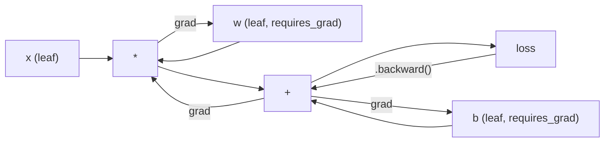
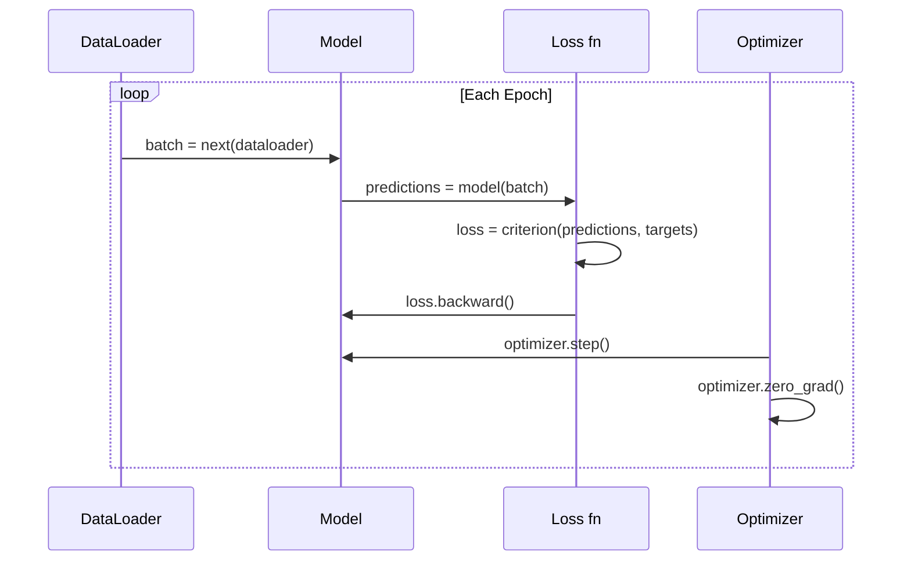

# PyTorch 入门（Introduction to PyTorch）

> 你已经用活塞和曲轴造出了一台发动机。现在来学一学大家真正在开的那辆。

**Type:** Build
**Languages:** Python
**Prerequisites:** Lesson 03.10 (Build Your Own Mini Framework)
**Time:** ~75 minutes

## 学习目标（Learning Objectives）

- 使用 PyTorch 的 nn.Module、nn.Sequential 和 autograd 构建并训练神经网络
- 使用 PyTorch 张量、GPU 加速，以及标准训练循环（zero_grad、forward、loss、backward、step）
- 把你从零构建的迷你框架组件转换为对应的 PyTorch 等价物
- 在同一任务上分析并比较纯 Python 框架与 PyTorch 的训练速度

## 问题所在（The Problem）

你有一个能跑的迷你框架：Linear 层、ReLU、dropout、批归一化、Adam、一个 DataLoader、一个训练循环。它能在纯 Python 下训练一个 4 层网络解决圆形分类问题。

但在同一个问题上，它比 PyTorch 慢 500 倍。

你的迷你框架用嵌套的 Python 循环一次处理一个样本。PyTorch 则把同样的操作分发给运行在 GPU 上的优化过的 C++/CUDA 内核。在单块 NVIDIA A100 上，PyTorch 大约 6 小时就能在 ImageNet（1.28M 张图像）上训完一个 ResNet-50（25.6M 参数）。同样的任务，你的框架大概要花 3000 小时 —— 前提是它没有先耗尽内存。

速度并不是唯一的差距。你的框架不支持 GPU；没有自动微分 —— 每个模块的 backward() 都是你手写的；没有序列化；没有分布式训练；没有混合精度（mixed precision）；离开 print 语句就没法调试梯度流。

PyTorch 填补了上述所有差距，同时保留了你已经建立的完全相同的思维模型：Module、forward()、parameters()、backward()、optimizer.step()。概念一一对应，语法几乎相同。区别在于，PyTorch 在你从零设计的同一套接口背后，封装了十年的系统工程。

## 核心概念（The Concept）

### PyTorch 为什么赢了（Why PyTorch Won）

2015 年的 TensorFlow 要求你在运行任何东西之前先定义一张静态计算图（computation graph）。你先建图、编译图，然后把数据喂进去。调试意味着盯着图的可视化看；改架构意味着从零重建整张图。

PyTorch 在 2017 年带着另一种哲学登场：急切执行（eager execution）。你写 Python，它立即执行。`y = model(x)` 现在就算出 y，而不是"往图里加一个稍后才会计算 y 的节点"。这意味着标准的 Python 调试工具都能用：print() 能用，pdb 能用，forward 里的 if/else 也能用。

到 2020 年，市场已经给出了答案。PyTorch 在机器学习研究论文中的占比从 7%（2017 年）涨到超过 75%（2022 年）。Meta、Google DeepMind、OpenAI、Anthropic 和 Hugging Face 都把 PyTorch 作为主力框架。TensorFlow 2.x 作为回应也采用了急切执行 —— 等于默认承认 PyTorch 的设计是对的。

教训是：开发体验会产生复利。一个慢 10% 但调试快 50% 的框架，每次都会胜出。

### 张量（Tensors）

张量（tensor）是一种多维数组，有三个关键属性：shape、dtype 和 device。

```python
import torch

x = torch.zeros(3, 4)           # shape: (3, 4), dtype: float32, device: cpu
x = torch.randn(2, 3, 224, 224) # batch of 2 RGB images, 224x224
x = torch.tensor([1, 2, 3])     # from a Python list
```

**Shape（形状）** 指的是维度。标量是 ()，向量是 (n,)，矩阵是 (m, n)，一批图像是 (batch, channels, height, width)。

**Dtype（数据类型）** 控制精度和内存。

| dtype | 位数 | 取值范围 | 使用场景 |
|-------|------|-------|----------|
| float32 | 32 | 约 7 位十进制精度 | 默认训练 |
| float16 | 16 | 约 3.3 位十进制精度 | 混合精度 |
| bfloat16 | 16 | 与 float32 同范围，精度更低 | LLM 训练 |
| int8 | 8 | -128 到 127 | 量化推理 |

**Device（设备）** 决定计算发生在哪里。

```python
device = torch.device("cuda" if torch.cuda.is_available() else "cpu")
x = torch.randn(3, 4, device=device)
x = x.to("cuda")
x = x.cpu()
```

每个操作都要求所有张量位于同一个设备上。这是新手最常撞见的 PyTorch 错误：`RuntimeError: Expected all tensors to be on the same device`。解决办法是在计算之前把所有东西移到同一个设备上。

**Reshaping（重塑形状）** 是常数时间操作 —— 它只修改元数据，而不动数据本身。

```python
x = torch.randn(2, 3, 4)
x.view(2, 12)      # reshape to (2, 12) -- must be contiguous
x.reshape(6, 4)    # reshape to (6, 4) -- works always
x.permute(2, 0, 1) # reorder dimensions
x.unsqueeze(0)     # add dimension: (1, 2, 3, 4)
x.squeeze()        # remove size-1 dimensions
```

### 自动微分（Autograd）

你的迷你框架要求你为每个模块实现 backward()。PyTorch 不需要。它把张量上的每个操作记录到一张有向无环图（即计算图）中，然后反向遍历这张图，自动算出梯度。



与你的框架的关键区别在于：PyTorch 使用基于磁带（tape）的自动微分。前向传播时每个操作都追加到"磁带"上，调用 `.backward()` 时把磁带倒着重放一遍。

```python
x = torch.randn(3, requires_grad=True)
y = x ** 2 + 3 * x
z = y.sum()
z.backward()
print(x.grad)  # dz/dx = 2x + 3
```

自动微分的三大规则：

1. 只有 `requires_grad=True` 的叶子张量会累积梯度
2. 梯度默认是累积的 —— 每次反向传播前要调用 `optimizer.zero_grad()`
3. `torch.no_grad()` 会关闭梯度追踪（评估时使用）

### nn.Module（nn.Module）

`nn.Module` 是 PyTorch 中所有神经网络组件的基类。你在第 10 课已经亲手构建过这个抽象。PyTorch 的版本增加了自动参数注册、递归模块发现、设备管理和 state dict 序列化。

```python
import torch.nn as nn

class MLP(nn.Module):
    def __init__(self, input_dim, hidden_dim, output_dim):
        super().__init__()
        self.layer1 = nn.Linear(input_dim, hidden_dim)
        self.relu = nn.ReLU()
        self.layer2 = nn.Linear(hidden_dim, output_dim)

    def forward(self, x):
        x = self.layer1(x)
        x = self.relu(x)
        x = self.layer2(x)
        return x
```

当你在 `__init__` 中把一个 `nn.Module` 或 `nn.Parameter` 赋值为属性时，PyTorch 会自动注册它。`model.parameters()` 会递归收集所有已注册的参数。这就是为什么你不必像在迷你框架里那样手动收集权重。

关键构建模块：

| 模块 | 作用 | 参数量 |
|--------|-------------|------------|
| nn.Linear(in, out) | Wx + b | in*out + out |
| nn.Conv2d(in_ch, out_ch, k) | 2D 卷积 | in_ch*out_ch*k*k + out_ch |
| nn.BatchNorm1d(features) | 归一化激活值 | 2 * features |
| nn.Dropout(p) | 随机置零 | 0 |
| nn.ReLU() | max(0, x) | 0 |
| nn.GELU() | 高斯误差线性单元 | 0 |
| nn.Embedding(vocab, dim) | 查找表 | vocab * dim |
| nn.LayerNorm(dim) | 逐样本归一化 | 2 * dim |

### 损失函数与优化器（Loss Functions and Optimizers）

你构建过的所有东西，PyTorch 都提供了生产级的版本。

**损失函数**（来自 `torch.nn`）：

| 损失函数 | 任务 | 输入 |
|------|------|-------|
| nn.MSELoss() | 回归 | 任意形状 |
| nn.CrossEntropyLoss() | 多分类 | logits（不是 softmax） |
| nn.BCEWithLogitsLoss() | 二分类 | logits（不是 sigmoid） |
| nn.L1Loss() | 回归（鲁棒） | 任意形状 |
| nn.CTCLoss() | 序列对齐 | 对数概率 |

注意：`CrossEntropyLoss` 内部组合了 `LogSoftmax` + `NLLLoss`。应传入原始 logits，而不是 softmax 的输出。这是一个常见错误，会悄悄产生错误的梯度。

**优化器**（来自 `torch.optim`）：

| 优化器 | 何时使用 | 典型学习率 |
|-----------|-------------|-----------|
| SGD(params, lr, momentum) | CNN、调优好的流水线 | 0.01--0.1 |
| Adam(params, lr) | 默认起点 | 1e-3 |
| AdamW(params, lr, weight_decay) | Transformer、微调 | 1e-4--1e-3 |
| LBFGS(params) | 小规模、二阶方法 | 1.0 |

### 训练循环（The Training Loop）

每个 PyTorch 训练循环都遵循同样的 5 步模式。你在第 10 课已经见过它。



经典模式：

```python
for epoch in range(num_epochs):
    model.train()
    for inputs, targets in train_loader:
        inputs, targets = inputs.to(device), targets.to(device)
        optimizer.zero_grad()
        outputs = model(inputs)
        loss = criterion(outputs, targets)
        loss.backward()
        optimizer.step()
```

批次循环里的 5 行代码。就是这 5 行训练出了 GPT-4、Stable Diffusion 和 LLaMA。架构会变，数据会变，这 5 行不会变。

### Dataset 与 DataLoader（Dataset and DataLoader）

PyTorch 的 `Dataset` 是一个只有两个方法的抽象类：`__len__` 和 `__getitem__`。`DataLoader` 在它外面包了一层，提供分批、打乱和多进程数据加载。

```python
from torch.utils.data import Dataset, DataLoader

class MNISTDataset(Dataset):
    def __init__(self, images, labels):
        self.images = images
        self.labels = labels

    def __len__(self):
        return len(self.labels)

    def __getitem__(self, idx):
        return self.images[idx], self.labels[idx]

loader = DataLoader(dataset, batch_size=64, shuffle=True, num_workers=4)
```

`num_workers=4` 会启动 4 个进程并行加载数据，与此同时 GPU 在当前批次上训练。对于受磁盘速度限制的工作负载（大图片、音频），仅这一项就能让训练速度翻倍。

### GPU 训练（GPU Training）

把模型移到 GPU 上：

```python
device = torch.device("cuda" if torch.cuda.is_available() else "cpu")
model = model.to(device)
```

这会递归地把每个参数和缓冲区（buffer）都移到 GPU 上。训练时再把每个批次移过去：

```python
inputs, targets = inputs.to(device), targets.to(device)
```

**混合精度（mixed precision）**在前向/反向中使用 float16，同时用 float32 保存主权重（master weights），在现代 GPU（A100、H100、RTX 4090）上能把内存占用减半、吞吐量翻倍：

```python
from torch.amp import autocast, GradScaler

scaler = GradScaler()
for inputs, targets in loader:
    with autocast(device_type="cuda"):
        outputs = model(inputs)
        loss = criterion(outputs, targets)
    scaler.scale(loss).backward()
    scaler.step(optimizer)
    scaler.update()
    optimizer.zero_grad()
```

### 比较：迷你框架 vs PyTorch vs JAX（Comparison: Mini Framework vs PyTorch vs JAX）

| 特性 | 迷你框架（L10） | PyTorch | JAX |
|---------|---------------------|---------|-----|
| 自动微分 | 手写 backward() | 基于磁带的 autograd | 函数式变换 |
| 执行方式 | 急切（Python 循环） | 急切（C++ 内核） | 追踪 + JIT 编译 |
| GPU 支持 | 无 | 有（CUDA、ROCm、MPS） | 有（CUDA、TPU） |
| 速度（MNIST MLP） | ~300s/epoch | ~0.5s/epoch | ~0.3s/epoch |
| 模块系统 | 自定义 Module 类 | nn.Module | 无状态函数（Flax/Equinox） |
| 调试 | print() | print()、pdb、breakpoint() | 更难（JIT 追踪会让 print 失效） |
| 生态系统 | 无 | Hugging Face、Lightning、timm | Flax、Optax、Orbax |
| 学习曲线 | 你亲手构建过 | 中等 | 陡峭（函数式范式） |
| 生产使用 | 玩具问题 | Meta、OpenAI、Anthropic、HF | Google DeepMind、Midjourney |

```figure
dropout-mask
```

## 动手构建（Build It）

一个只用 PyTorch 原语在 MNIST 上训练的 3 层 MLP。不用高级封装，不用 `torchvision.datasets`，我们自己下载并解析原始数据。

### 第 1 步：从原始文件加载 MNIST（Step 1: Load MNIST From Raw Files）

MNIST 以 4 个 gzip 压缩文件发布：训练图像（60,000 x 28 x 28）、训练标签、测试图像（10,000 x 28 x 28）、测试标签。我们把它们下载下来并解析其二进制格式。

```python
import torch
import torch.nn as nn
import struct
import gzip
import urllib.request
import os

def download_mnist(path="./mnist_data"):
    base_url = "https://storage.googleapis.com/cvdf-datasets/mnist/"
    files = [
        "train-images-idx3-ubyte.gz",
        "train-labels-idx1-ubyte.gz",
        "t10k-images-idx3-ubyte.gz",
        "t10k-labels-idx1-ubyte.gz",
    ]
    os.makedirs(path, exist_ok=True)
    for f in files:
        filepath = os.path.join(path, f)
        if not os.path.exists(filepath):
            urllib.request.urlretrieve(base_url + f, filepath)

def load_images(filepath):
    with gzip.open(filepath, "rb") as f:
        magic, num, rows, cols = struct.unpack(">IIII", f.read(16))
        data = f.read()
        images = torch.frombuffer(bytearray(data), dtype=torch.uint8)
        images = images.reshape(num, rows * cols).float() / 255.0
    return images

def load_labels(filepath):
    with gzip.open(filepath, "rb") as f:
        magic, num = struct.unpack(">II", f.read(8))
        data = f.read()
        labels = torch.frombuffer(bytearray(data), dtype=torch.uint8).long()
    return labels
```

### 第 2 步：定义模型（Step 2: Define the Model）

一个 3 层 MLP：784 -> 256 -> 128 -> 10，ReLU 激活，用 Dropout 做正则化。为了保持简单，不用批归一化。

```python
class MNISTModel(nn.Module):
    def __init__(self):
        super().__init__()
        self.net = nn.Sequential(
            nn.Linear(784, 256),
            nn.ReLU(),
            nn.Dropout(0.2),
            nn.Linear(256, 128),
            nn.ReLU(),
            nn.Dropout(0.2),
            nn.Linear(128, 10),
        )

    def forward(self, x):
        return self.net(x)
```

输出层产生 10 个原始 logits（每个数字一个）。不做 softmax —— `CrossEntropyLoss` 会在内部处理。

参数量：784*256 + 256 + 256*128 + 128 + 128*10 + 10 = 235,146。以现代标准来看非常小。GPT-2 small 有 124M。这个模型几秒钟就能训完。

### 第 3 步：训练循环（Step 3: Training Loop）

经典的 forward-loss-backward-step 模式。

```python
def train_one_epoch(model, loader, criterion, optimizer, device):
    model.train()
    total_loss = 0
    correct = 0
    total = 0
    for images, labels in loader:
        images, labels = images.to(device), labels.to(device)
        optimizer.zero_grad()
        outputs = model(images)
        loss = criterion(outputs, labels)
        loss.backward()
        optimizer.step()
        total_loss += loss.item() * images.size(0)
        _, predicted = outputs.max(1)
        correct += predicted.eq(labels).sum().item()
        total += labels.size(0)
    return total_loss / total, correct / total


def evaluate(model, loader, criterion, device):
    model.eval()
    total_loss = 0
    correct = 0
    total = 0
    with torch.no_grad():
        for images, labels in loader:
            images, labels = images.to(device), labels.to(device)
            outputs = model(images)
            loss = criterion(outputs, labels)
            total_loss += loss.item() * images.size(0)
            _, predicted = outputs.max(1)
            correct += predicted.eq(labels).sum().item()
            total += labels.size(0)
    return total_loss / total, correct / total
```

注意评估时的 `torch.no_grad()`。它会关闭 autograd，降低内存占用并加快推理。没有它，PyTorch 会构建一张你根本用不到的计算图。

### 第 4 步：把一切组装起来（Step 4: Wire Everything Together）

```python
def main():
    device = torch.device("cuda" if torch.cuda.is_available() else "cpu")

    download_mnist()
    train_images = load_images("./mnist_data/train-images-idx3-ubyte.gz")
    train_labels = load_labels("./mnist_data/train-labels-idx1-ubyte.gz")
    test_images = load_images("./mnist_data/t10k-images-idx3-ubyte.gz")
    test_labels = load_labels("./mnist_data/t10k-labels-idx1-ubyte.gz")

    train_dataset = torch.utils.data.TensorDataset(train_images, train_labels)
    test_dataset = torch.utils.data.TensorDataset(test_images, test_labels)
    train_loader = torch.utils.data.DataLoader(
        train_dataset, batch_size=64, shuffle=True
    )
    test_loader = torch.utils.data.DataLoader(
        test_dataset, batch_size=256, shuffle=False
    )

    model = MNISTModel().to(device)
    criterion = nn.CrossEntropyLoss()
    optimizer = torch.optim.Adam(model.parameters(), lr=1e-3)

    num_params = sum(p.numel() for p in model.parameters())
    print(f"Device: {device}")
    print(f"Parameters: {num_params:,}")
    print(f"Train samples: {len(train_dataset):,}")
    print(f"Test samples: {len(test_dataset):,}")
    print()

    for epoch in range(10):
        train_loss, train_acc = train_one_epoch(
            model, train_loader, criterion, optimizer, device
        )
        test_loss, test_acc = evaluate(
            model, test_loader, criterion, device
        )
        print(
            f"Epoch {epoch+1:2d} | "
            f"Train Loss: {train_loss:.4f} | Train Acc: {train_acc:.4f} | "
            f"Test Loss: {test_loss:.4f} | Test Acc: {test_acc:.4f}"
        )

    torch.save(model.state_dict(), "mnist_mlp.pt")
    print(f"\nModel saved to mnist_mlp.pt")
    print(f"Final test accuracy: {test_acc:.4f}")
```

10 个 epoch 后的预期输出：约 97.8% 的测试准确率。CPU 训练时间：约 30 秒；GPU 上：约 5 秒；用你的迷你框架跑同样的架构：约 45 分钟。

## 使用它（Use It）

### 快速比较：迷你框架 vs PyTorch（Quick Comparison: Mini Framework vs PyTorch）

| 迷你框架（第 10 课） | PyTorch |
|---------------------------|---------|
| `model = Sequential(Linear(784, 256), ReLU(), ...)` | `model = nn.Sequential(nn.Linear(784, 256), nn.ReLU(), ...)` |
| `pred = model.forward(x)` | `pred = model(x)` |
| `optimizer.zero_grad()` | `optimizer.zero_grad()` |
| `grad = criterion.backward()` 然后 `model.backward(grad)` | `loss.backward()` |
| `optimizer.step()` | `optimizer.step()` |
| 无 GPU | `model.to("cuda")` |
| 每个模块都要手写反向传播 | autograd 全权处理 |

接口几乎一模一样，差别全在底层。

### 保存与加载模型（Saving and Loading Models）

```python
torch.save(model.state_dict(), "model.pt")

model = MNISTModel()
model.load_state_dict(torch.load("model.pt", weights_only=True))
model.eval()
```

一定要保存 `state_dict()`（参数字典），而不是模型对象。保存模型对象用的是 pickle，一旦重构代码就会失效。state dict 是可移植的。

### 学习率调度（Learning Rate Scheduling）

```python
scheduler = torch.optim.lr_scheduler.CosineAnnealingLR(
    optimizer, T_max=10
)
for epoch in range(10):
    train_one_epoch(model, train_loader, criterion, optimizer, device)
    scheduler.step()
```

PyTorch 内置 15 种以上的调度器：StepLR、ExponentialLR、CosineAnnealingLR、OneCycleLR、ReduceLROnPlateau。它们都接入同一个优化器接口。

## 交付（Ship It）

本课产出两个工件：

- `outputs/prompt-pytorch-debugger.md` —— 一个用于诊断常见 PyTorch 训练故障的提示词
- `outputs/skill-pytorch-patterns.md` —— 一份关于 PyTorch 训练模式的技能参考

## 练习（Exercises）

1. **加入批归一化。** 在每个线性层之后（激活之前）插入 `nn.BatchNorm1d`。与只用 dropout 的版本比较测试准确率和训练速度。批归一化应该能用更少的 epoch 达到 98% 以上。

2. **实现学习率查找器。** 用指数递增的学习率（从 1e-7 到 1.0）训练一个 epoch，画出损失随学习率变化的曲线。最优学习率就在损失开始攀升之前。用它为 MNIST 模型挑一个更好的学习率。

3. **用混合精度迁移到 GPU。** 在训练循环中加入 `torch.amp.autocast` 和 `GradScaler`。在 GPU 上测量开启与不开启混合精度时的吞吐量（样本/秒）。在 A100 上，预期约 2 倍加速。

4. **构建一个自定义 Dataset。** 下载 Fashion-MNIST（格式与 MNIST 相同，但内容是服饰）。实现一个带 `__getitem__` 和 `__len__` 的 `FashionMNISTDataset(Dataset)` 类。训练同样的 MLP 并比较准确率。Fashion-MNIST 更难 —— 预期约 88% 对比约 98%。

5. **把 Adam 换成 SGD + 动量。** 用 `SGD(params, lr=0.01, momentum=0.9)` 训练，比较收敛曲线。然后加上 `CosineAnnealingLR` 调度器，看看 SGD 到第 10 个 epoch 时能否追上 Adam。

## 关键术语（Key Terms）

| 术语 | 人们常说什么 | 实际含义 |
|------|----------------|----------------------|
| 张量（Tensor） | "多维数组" | 带类型、感知设备的数组，每个操作都内建了自动微分支持 |
| 自动微分（Autograd） | "自动反向传播" | 一个基于磁带的系统：前向传播时记录操作，再倒放磁带以计算精确梯度 |
| nn.Module | "一层" | 任何可微计算块的基类 —— 负责注册参数、支持嵌套、处理 train/eval 模式 |
| state_dict | "模型权重" | 一个把参数名映射到张量的 OrderedDict —— 训练好的模型的可移植、可序列化表示 |
| .backward() | "计算梯度" | 反向遍历计算图，为每个 requires_grad=True 的叶子张量计算并累积梯度 |
| .to(device) | "移到 GPU" | 递归地把所有参数和缓冲区转移到指定设备（CPU、CUDA、MPS） |
| DataLoader | "数据管道" | 一个迭代器，负责对来自 Dataset 的数据分批、打乱，并可选地并行加载 |
| 混合精度（Mixed precision） | "用 float16" | 前向/反向用 float16 求速度，同时保留 float32 主权重保证数值稳定性 |
| 急切执行（Eager execution） | "立刻执行" | 操作在调用时立即执行，而不是推迟到之后的编译步骤 —— 这是 PyTorch 区别于 TF 1.x 的核心设计选择 |
| zero_grad | "重置梯度" | 在下一次反向传播前把所有参数梯度置零，因为 PyTorch 默认会累积梯度 |

## 延伸阅读（Further Reading）

- Paszke et al., "PyTorch: An Imperative Style, High-Performance Deep Learning Library" (2019) —— 解释 PyTorch 设计权衡的原始论文
- PyTorch Tutorials: "Learning PyTorch with Examples" (https://pytorch.org/tutorials/beginner/pytorch_with_examples.html) —— 从张量到 nn.Module 的官方学习路径
- PyTorch Performance Tuning Guide (https://pytorch.org/tutorials/recipes/recipes/tuning_guide.html) —— 混合精度、DataLoader 工作进程、固定内存（pinned memory）等生产级优化
- Horace He, "Making Deep Learning Go Brrrr" (https://horace.io/brrr_intro.html) —— 解释 GPU 训练为什么快，并给出 PyTorch 专属的优化策略
