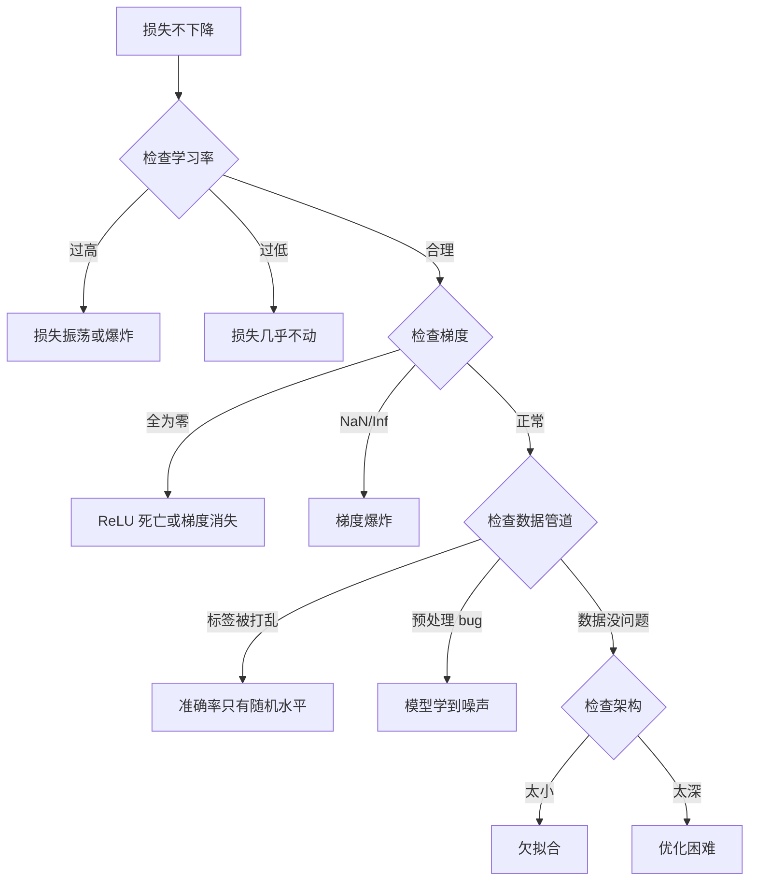
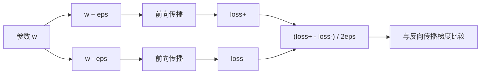
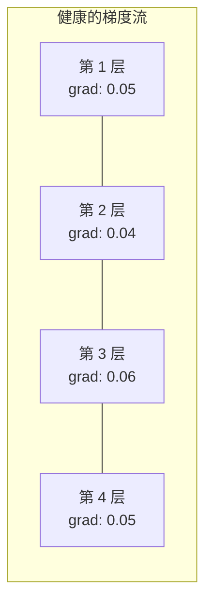
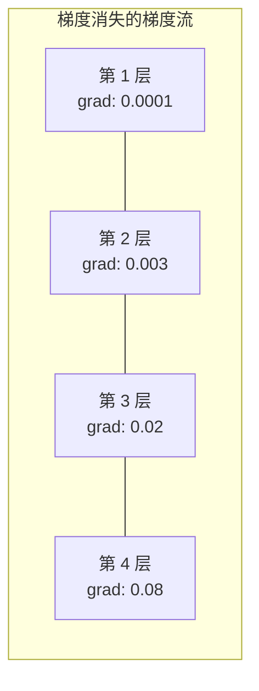
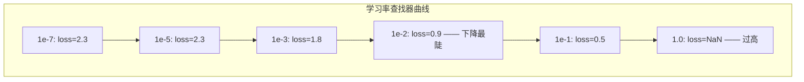

# 神经网络调试（Debugging Neural Networks）

> 你的网络编译通过、成功运行、输出了一个数字。这个数字是错的，而且什么都没有崩溃。欢迎来到最难的调试——没有错误信息的那种。

**Type:** Build
**Languages:** Python, PyTorch
**Prerequisites:** Phase 03 Lessons 01-10 (especially backpropagation, loss functions, optimizers)
**Time:** ~90 minutes

## 学习目标（Learning Objectives）

- 使用系统化的调试策略诊断常见的神经网络故障（NaN 损失、损失曲线平坦、过拟合（overfitting）、损失振荡）
- 应用"单批次过拟合"（overfit one batch）技术，验证模型架构和训练循环是否正确
- 检查梯度幅值、激活值分布和权重范数，识别梯度消失/梯度爆炸（vanishing/exploding gradients）问题
- 构建一份覆盖数据管道、模型架构、损失函数、优化器和学习率（learning rate）问题的调试清单

## 问题所在（The Problem）

传统软件坏了会崩溃。空指针会抛出异常，类型不匹配会在编译期报错，差一错误（off-by-one error）会产生明显错误的输出。

神经网络不会给你这种待遇。

坏掉的神经网络照样能跑完整个流程，打印出损失值，输出预测结果。损失可能在下降，预测看起来也可能说得过去。但模型在悄悄出错——学的是投机取巧的捷径，背的是噪声，或者收敛到一个毫无用处的局部极小值（local minimum）。Google 研究人员估计，机器学习调试时间有 60%-70% 花在那些不报错、只会拉低模型质量的"沉默"（silent）bug 上。

能用的模型和坏掉的模型之间，往往只差一行写错位置的代码：漏掉一次 `zero_grad()`、一个转置错的维度、一个差了 10 倍的学习率。经典的《Recipe for Training Neural Networks》（2019）开篇第一句就是："最常见的神经网络错误，是那些不会崩溃的 bug。"

本课教你找出这些 bug。

## 核心概念（The Concept）

### 调试思维（The Debugging Mindset）

别再靠"打印输出碰运气"来调试。神经网络调试需要系统化的方法，因为反馈回路很慢（每次训练要几分钟到几小时），而且症状含糊不清（损失不好可能意味着 20 种不同的问题）。

黄金法则：**从简单开始，一次只增加一个复杂度组件，并独立验证每一个组件。**



### 症状 1：损失不下降（Symptom 1: Loss Not Decreasing）

这是最常见的抱怨。训练循环在跑，epoch 一个个过去，损失却纹丝不动，或者剧烈振荡。

**学习率不对。** 太高：损失振荡或直接跳到 NaN。太低：损失下降得极慢，看起来就像不动。对 Adam，从 1e-3 起步；对 SGD，从 1e-1 或 1e-2 起步。在断定是别的问题之前，一定要先试 3 个彼此相差 10 倍的学习率（例如 1e-2、1e-3、1e-4）。

**死掉的 ReLU（dead ReLU）。** 如果一个 ReLU 神经元接收到很大的负输入，它会输出 0，梯度也是 0，从此再也不激活。死的神经元够多，网络就学不动了。检查方法：打印每个 ReLU 层之后激活值恰好为 0 的比例。如果超过 50% 的激活是死的，就换成 LeakyReLU 或降低学习率。

**梯度消失（vanishing gradients）。** 在使用 sigmoid 或 tanh 激活的深网络里，梯度反向传播（backpropagation）时会指数级缩小。等传到第一层时，梯度已经接近 0，前面的层就停止学习了。修复：改用 ReLU/GELU、加残差连接，或使用批归一化（batch normalization）。

**梯度爆炸（exploding gradients）。** 反过来的问题——梯度指数级增长。在 RNN 和特别深的网络中很常见，损失会直接跳到 NaN。修复：做梯度裁剪（gradient clipping，`torch.nn.utils.clip_grad_norm_`）、降低学习率，或加归一化。

### 症状 2：损失在下降但模型很糟糕（Symptom 2: Loss Decreasing But Model is Bad）

损失在下降，训练准确率达到 99%，但测试准确率只有 55%。或者模型在真实数据上输出一堆莫名其妙的结果。

**过拟合（overfitting）。** 模型把训练数据背了下来，而不是学习规律。训练损失和验证损失之间的差距随时间越拉越大。修复：增加数据、dropout、权重衰减（weight decay）、早停（early stopping）、数据增强。

**数据泄漏（data leakage）。** 测试数据混进了训练集，准确率高得可疑。常见原因：先打乱再切分、用整个数据集的统计量做预处理、不同切分之间存在重复样本。修复：先切分、后预处理，并检查重复。

**标签错误（label errors）。** 大多数真实数据集中有 5%-10% 的标签是错的（Northcutt et al., 2021——"Pervasive Label Errors in Test Sets"）。模型把这些噪声学了进去。修复：用置信学习（confident learning）找出并修正标错的样本，或用损失截断忽略高损失样本。

### 症状 3：损失中出现 NaN 或 Inf（Symptom 3: NaN or Inf in Loss）

损失值变成了 `nan` 或 `inf`。训练已经没救了。

**学习率太高。** 梯度更新一步跨得太远，权重直接爆炸。修复：把学习率缩小 10 倍。

**log(0) 或 log(负数)。** 交叉熵损失要计算 `log(p)`。如果模型输出的概率恰好是 0 或负数，对数就会爆炸。修复：把预测截断到 `[eps, 1-eps]`，其中 `eps=1e-7`。

**除以零。** 批归一化要除以标准差。一个取值完全相同的批次标准差为 0。修复：在分母上加 epsilon（PyTorch 默认会加，但自己写的实现未必）。

**数值溢出。** 很大的激活值喂进 `exp()` 会得到 Inf。Softmax 尤其容易中招。修复：在求幂之前先减去最大值（log-sum-exp 技巧）。

### 技术 1：梯度检查（Technique 1: Gradient Checking）

把反向传播得到的解析梯度与有限差分算出的数值梯度做比较。如果两者对不上，说明你的反向传播有 bug。

参数 `w` 的数值梯度：

```
grad_numerical = (loss(w + eps) - loss(w - eps)) / (2 * eps)
```

一致性度量（相对差）：

```
rel_diff = |grad_analytical - grad_numerical| / max(|grad_analytical|, |grad_numerical|, 1e-8)
```

如果 `rel_diff < 1e-5`：正确。如果 `rel_diff > 1e-3`：几乎可以肯定有 bug。



### 技术 2：激活值统计（Technique 2: Activation Statistics）

在训练过程中监控每一层之后激活值的均值和标准差。健康的网络里，激活值的均值接近 0、标准差接近 1（经过归一化之后），或者至少有界。

| 健康指标 | 均值 | 标准差 | 诊断 |
|-----------------|------|-----|-----------|
| 健康 | ~0 | ~1 | 网络正在正常学习 |
| 饱和 | >>0 或 <<0 | ~0 | 激活值卡在极端值上 |
| 死亡 | 0 | 0 | 神经元已死（激活全为 0） |
| 爆炸 | >>10 | >>10 | 激活值无界增长 |

### 技术 3：梯度流可视化（Technique 3: Gradient Flow Visualization）

画出每一层的平均梯度幅值。健康的网络中，各层的梯度幅值应该大致相当。如果靠前的层梯度比靠后的层小 1000 倍，那就是梯度消失了。





### 技术 4：单批次过拟合测试（Technique 4: The Overfit-One-Batch Test）

深度学习中最重要的调试技术，没有之一。

取一个小批次（8-32 个样本），在上面训练 100 轮以上。损失应当降到接近零，训练准确率应当达到 100%。如果做不到，说明你的模型或训练循环有根本性的 bug——不要急着开始完整训练。

这项测试能抓住的问题：
- 损失函数写错了
- 反向传播写错了
- 模型太小，不足以表达数据
- 优化器没有接入模型参数
- 数据和标签错位

这个测试只要 30 秒就能跑完，却省下你调试完整训练的几个小时。

### 技术 5：学习率查找器（Technique 5: Learning Rate Finder）

Leslie Smith（2017）提出：在一个 epoch 内把学习率从极小（1e-7）扫到极大（10），同时记录损失，然后画出损失随学习率变化的曲线。最优学习率大约是"损失下降最快处"那个学习率的 1/10。



本例中最优学习率约为 1e-3（比最陡的那个点小一个数量级）。

### 常见 PyTorch bug（Common PyTorch Bugs）

下面是 PyTorch 社区里浪费大家最多时间的 bug：

| Bug | 症状 | 修复方法 |
|-----|---------|-----|
| 忘记调用 `optimizer.zero_grad()` | 梯度跨批次累积，损失振荡 | 在 `loss.backward()` 之前加上 `optimizer.zero_grad()` |
| 测试时忘记调用 `model.eval()` | Dropout 和批归一化行为不一致，测试准确率每次运行都不同 | 加上 `model.eval()` 和 `torch.no_grad()` |
| 张量形状错误 | 静默广播产生错误结果，且不报错 | 调试时每做一步操作就打印一次形状 |
| CPU/GPU 不匹配 | `RuntimeError: expected CUDA tensor` | 模型和数据都要 `.to(device)` |
| 张量没有 detach | 计算图无限增长，内存耗尽（OOM） | 使用 `.detach()` 或 `with torch.no_grad()` |
| 原地操作破坏 autograd | `RuntimeError: modified by in-place operation` | 把 `x += 1` 改成 `x = x + 1` |
| 数据没有归一化 | 损失卡在随机猜测水平 | 把输入归一化到均值 0、标准差 1 |
| 标签 dtype 不对 | 交叉熵要求 `Long`，却拿到了 `Float` | 转换标签类型：`labels.long()` |

### 调试总表（The Master Debugging Table）

| 症状 | 可能的原因 | 首先尝试 |
|---------|-------------|-------------------|
| 损失卡在 -log(1/num_classes) | 模型在输出均匀分布 | 检查数据管道，确认标签与输入一一对应 |
| 训练几步后损失变成 NaN | 学习率太高 | 学习率缩小 10 倍 |
| 损失立刻变成 NaN | log(0) 或除以零 | 给 log 和除法操作加上 epsilon |
| 损失剧烈振荡 | 学习率太高或批次太小 | 降低学习率，增大批次大小 |
| 损失先下降后停滞 | 微调阶段学习率太高 | 加学习率调度（cosine 或 step decay） |
| 训练准确率高，测试准确率低 | 过拟合 | 加 dropout、权重衰减，增加数据 |
| 训练准确率 = 测试准确率 = 随机水平 | 模型什么都没学到 | 跑单批次过拟合测试 |
| 训练准确率 = 测试准确率，但都偏低 | 欠拟合（underfitting） | 更大的模型、更多层、更多特征 |
| 梯度全为零 | ReLU 死亡或计算图被 detach | 换成 LeakyReLU，检查 `.requires_grad` |
| 训练时内存耗尽 | 批次太大或计算图没有释放 | 减小批次大小，评估时用 `torch.no_grad()` |

```figure
learning-curves
```

## 动手构建（Build It）

一个监控激活值、梯度和损失曲线的诊断工具箱。你会故意把网络弄坏，再用这个工具箱诊断出每一个问题。

### 第 1 步：NetworkDebugger 类（Step 1: The NetworkDebugger Class）

挂载到 PyTorch 模型上，逐层记录激活值和梯度的统计信息。

```python
import torch
import torch.nn as nn
import math


class NetworkDebugger:
    def __init__(self, model):
        self.model = model
        self.activation_stats = {}
        self.gradient_stats = {}
        self.loss_history = []
        self.lr_losses = []
        self.hooks = []
        self._register_hooks()

    def _register_hooks(self):
        for name, module in self.model.named_modules():
            if isinstance(module, (nn.Linear, nn.Conv2d, nn.ReLU, nn.LeakyReLU)):
                hook = module.register_forward_hook(self._make_activation_hook(name))
                self.hooks.append(hook)
                hook = module.register_full_backward_hook(self._make_gradient_hook(name))
                self.hooks.append(hook)

    def _make_activation_hook(self, name):
        def hook(module, input, output):
            with torch.no_grad():
                out = output.detach().float()
                self.activation_stats[name] = {
                    "mean": out.mean().item(),
                    "std": out.std().item(),
                    "fraction_zero": (out == 0).float().mean().item(),
                    "min": out.min().item(),
                    "max": out.max().item(),
                }
        return hook

    def _make_gradient_hook(self, name):
        def hook(module, grad_input, grad_output):
            if grad_output[0] is not None:
                with torch.no_grad():
                    grad = grad_output[0].detach().float()
                    self.gradient_stats[name] = {
                        "mean": grad.mean().item(),
                        "std": grad.std().item(),
                        "abs_mean": grad.abs().mean().item(),
                        "max": grad.abs().max().item(),
                    }
        return hook

    def record_loss(self, loss_value):
        self.loss_history.append(loss_value)

    def check_loss_health(self):
        if len(self.loss_history) < 2:
            return "NOT_ENOUGH_DATA"
        recent = self.loss_history[-10:]
        if any(math.isnan(v) or math.isinf(v) for v in recent):
            return "NAN_OR_INF"
        if len(self.loss_history) >= 20:
            first_half = sum(self.loss_history[:10]) / 10
            second_half = sum(self.loss_history[-10:]) / 10
            if second_half >= first_half * 0.99:
                return "NOT_DECREASING"
        if len(recent) >= 5:
            diffs = [recent[i+1] - recent[i] for i in range(len(recent)-1)]
            if max(diffs) - min(diffs) > 2 * abs(sum(diffs) / len(diffs)):
                return "OSCILLATING"
        return "HEALTHY"

    def check_activations(self):
        issues = []
        for name, stats in self.activation_stats.items():
            if stats["fraction_zero"] > 0.5:
                issues.append(f"DEAD_NEURONS: {name} has {stats['fraction_zero']:.0%} zero activations")
            if abs(stats["mean"]) > 10:
                issues.append(f"EXPLODING_ACTIVATIONS: {name} mean={stats['mean']:.2f}")
            if stats["std"] < 1e-6:
                issues.append(f"COLLAPSED_ACTIVATIONS: {name} std={stats['std']:.2e}")
        return issues if issues else ["HEALTHY"]

    def check_gradients(self):
        issues = []
        grad_magnitudes = []
        for name, stats in self.gradient_stats.items():
            grad_magnitudes.append((name, stats["abs_mean"]))
            if stats["abs_mean"] < 1e-7:
                issues.append(f"VANISHING_GRADIENT: {name} abs_mean={stats['abs_mean']:.2e}")
            if stats["abs_mean"] > 100:
                issues.append(f"EXPLODING_GRADIENT: {name} abs_mean={stats['abs_mean']:.2e}")
        if len(grad_magnitudes) >= 2:
            first_mag = grad_magnitudes[0][1]
            last_mag = grad_magnitudes[-1][1]
            if last_mag > 0 and first_mag / last_mag > 100:
                issues.append(f"GRADIENT_RATIO: first/last = {first_mag/last_mag:.0f}x (vanishing)")
        return issues if issues else ["HEALTHY"]

    def print_report(self):
        print("\n=== NETWORK DEBUGGER REPORT ===")
        print(f"\nLoss health: {self.check_loss_health()}")
        if self.loss_history:
            print(f"  Last 5 losses: {[f'{v:.4f}' for v in self.loss_history[-5:]]}")
        print("\nActivation diagnostics:")
        for item in self.check_activations():
            print(f"  {item}")
        print("\nGradient diagnostics:")
        for item in self.check_gradients():
            print(f"  {item}")
        print("\nPer-layer activation stats:")
        for name, stats in self.activation_stats.items():
            print(f"  {name}: mean={stats['mean']:.4f} std={stats['std']:.4f} zero={stats['fraction_zero']:.1%}")
        print("\nPer-layer gradient stats:")
        for name, stats in self.gradient_stats.items():
            print(f"  {name}: abs_mean={stats['abs_mean']:.2e} max={stats['max']:.2e}")

    def remove_hooks(self):
        for hook in self.hooks:
            hook.remove()
        self.hooks.clear()
```

### 第 2 步：单批次过拟合测试（Step 2: The Overfit-One-Batch Test）

```python
def overfit_one_batch(model, x_batch, y_batch, criterion, lr=0.01, steps=200):
    optimizer = torch.optim.Adam(model.parameters(), lr=lr)
    model.train()
    print("\n=== OVERFIT ONE BATCH TEST ===")
    print(f"Batch size: {x_batch.shape[0]}, Steps: {steps}")

    for step in range(steps):
        optimizer.zero_grad()
        output = model(x_batch)
        loss = criterion(output, y_batch)
        loss.backward()
        optimizer.step()

        if step % 50 == 0 or step == steps - 1:
            with torch.no_grad():
                preds = (output > 0).float() if output.shape[-1] == 1 else output.argmax(dim=1)
                targets = y_batch if y_batch.dim() == 1 else y_batch.squeeze()
                acc = (preds.squeeze() == targets).float().mean().item()
            print(f"  Step {step:3d} | Loss: {loss.item():.6f} | Accuracy: {acc:.1%}")

    final_loss = loss.item()
    if final_loss > 0.1:
        print(f"\n  FAIL: Loss did not converge ({final_loss:.4f}). Model or training loop is broken.")
        return False
    print(f"\n  PASS: Loss converged to {final_loss:.6f}")
    return True
```

### 第 3 步：学习率查找器（Step 3: Learning Rate Finder）

```python
def find_learning_rate(model, x_data, y_data, criterion, start_lr=1e-7, end_lr=10, steps=100):
    import copy
    original_state = copy.deepcopy(model.state_dict())
    optimizer = torch.optim.SGD(model.parameters(), lr=start_lr)
    lr_mult = (end_lr / start_lr) ** (1 / steps)

    model.train()
    results = []
    best_loss = float("inf")
    current_lr = start_lr

    print("\n=== LEARNING RATE FINDER ===")

    for step in range(steps):
        optimizer.zero_grad()
        output = model(x_data)
        loss = criterion(output, y_data)

        if math.isnan(loss.item()) or loss.item() > best_loss * 10:
            break

        best_loss = min(best_loss, loss.item())
        results.append((current_lr, loss.item()))

        loss.backward()
        optimizer.step()

        current_lr *= lr_mult
        for param_group in optimizer.param_groups:
            param_group["lr"] = current_lr

    model.load_state_dict(original_state)

    if len(results) < 10:
        print("  Could not complete LR sweep -- loss diverged too quickly")
        return results

    min_loss_idx = min(range(len(results)), key=lambda i: results[i][1])
    suggested_lr = results[max(0, min_loss_idx - 10)][0]

    print(f"  Swept {len(results)} steps from {start_lr:.0e} to {results[-1][0]:.0e}")
    print(f"  Minimum loss {results[min_loss_idx][1]:.4f} at lr={results[min_loss_idx][0]:.2e}")
    print(f"  Suggested learning rate: {suggested_lr:.2e}")

    return results
```

### 第 4 步：梯度检查器（Step 4: Gradient Checker）

```python
def _flat_to_multi_index(flat_idx, shape):
    multi_idx = []
    remaining = flat_idx
    for dim in reversed(shape):
        multi_idx.insert(0, remaining % dim)
        remaining //= dim
    return tuple(multi_idx)


def gradient_check(model, x, y, criterion, eps=1e-4):
    model.train()
    x_double = x.double()
    y_double = y.double()
    model_double = model.double()

    print("\n=== GRADIENT CHECK ===")
    overall_max_diff = 0
    checked = 0

    for name, param in model_double.named_parameters():
        if not param.requires_grad:
            continue

        layer_max_diff = 0

        model_double.zero_grad()
        output = model_double(x_double)
        loss = criterion(output, y_double)
        loss.backward()
        analytical_grad = param.grad.clone()

        num_checks = min(5, param.numel())
        for i in range(num_checks):
            idx = _flat_to_multi_index(i, param.shape)
            original = param.data[idx].item()

            param.data[idx] = original + eps
            with torch.no_grad():
                loss_plus = criterion(model_double(x_double), y_double).item()

            param.data[idx] = original - eps
            with torch.no_grad():
                loss_minus = criterion(model_double(x_double), y_double).item()

            param.data[idx] = original

            numerical = (loss_plus - loss_minus) / (2 * eps)
            analytical = analytical_grad[idx].item()

            denom = max(abs(numerical), abs(analytical), 1e-8)
            rel_diff = abs(numerical - analytical) / denom

            layer_max_diff = max(layer_max_diff, rel_diff)
            checked += 1

        overall_max_diff = max(overall_max_diff, layer_max_diff)
        status = "OK" if layer_max_diff < 1e-5 else "MISMATCH"
        print(f"  {name}: max_rel_diff={layer_max_diff:.2e} [{status}]")

    model.float()

    print(f"\n  Checked {checked} parameters")
    if overall_max_diff < 1e-5:
        print("  PASS: Gradients match (rel_diff < 1e-5)")
    elif overall_max_diff < 1e-3:
        print("  WARN: Small differences (1e-5 < rel_diff < 1e-3)")
    else:
        print("  FAIL: Gradient mismatch detected (rel_diff > 1e-3)")
    return overall_max_diff
```

### 第 5 步：故意弄坏的网络（Step 5: Deliberately Broken Networks）

现在把这个工具箱用在这些坏掉的网络身上，逐一诊断。

```python
def demo_broken_networks():
    torch.manual_seed(42)
    x = torch.randn(64, 10)
    y = (x[:, 0] > 0).long()

    print("\n" + "=" * 60)
    print("BUG 1: Learning rate too high (lr=10)")
    print("=" * 60)
    model1 = nn.Sequential(nn.Linear(10, 32), nn.ReLU(), nn.Linear(32, 2))
    debugger1 = NetworkDebugger(model1)
    optimizer1 = torch.optim.SGD(model1.parameters(), lr=10.0)
    criterion = nn.CrossEntropyLoss()
    for step in range(20):
        optimizer1.zero_grad()
        out = model1(x)
        loss = criterion(out, y)
        debugger1.record_loss(loss.item())
        loss.backward()
        optimizer1.step()
    debugger1.print_report()
    debugger1.remove_hooks()

    print("\n" + "=" * 60)
    print("BUG 2: Dead ReLUs from bad initialization")
    print("=" * 60)
    model2 = nn.Sequential(nn.Linear(10, 32), nn.ReLU(), nn.Linear(32, 32), nn.ReLU(), nn.Linear(32, 2))
    with torch.no_grad():
        for m in model2.modules():
            if isinstance(m, nn.Linear):
                m.weight.fill_(-1.0)
                m.bias.fill_(-5.0)
    debugger2 = NetworkDebugger(model2)
    optimizer2 = torch.optim.Adam(model2.parameters(), lr=1e-3)
    for step in range(50):
        optimizer2.zero_grad()
        out = model2(x)
        loss = criterion(out, y)
        debugger2.record_loss(loss.item())
        loss.backward()
        optimizer2.step()
    debugger2.print_report()
    debugger2.remove_hooks()

    print("\n" + "=" * 60)
    print("BUG 3: Missing zero_grad (gradients accumulate)")
    print("=" * 60)
    model3 = nn.Sequential(nn.Linear(10, 32), nn.ReLU(), nn.Linear(32, 2))
    debugger3 = NetworkDebugger(model3)
    optimizer3 = torch.optim.SGD(model3.parameters(), lr=0.01)
    for step in range(50):
        out = model3(x)
        loss = criterion(out, y)
        debugger3.record_loss(loss.item())
        loss.backward()
        optimizer3.step()
    debugger3.print_report()
    debugger3.remove_hooks()

    print("\n" + "=" * 60)
    print("HEALTHY NETWORK: Correct setup for comparison")
    print("=" * 60)
    model_good = nn.Sequential(nn.Linear(10, 32), nn.ReLU(), nn.Linear(32, 2))
    debugger_good = NetworkDebugger(model_good)
    optimizer_good = torch.optim.Adam(model_good.parameters(), lr=1e-3)
    for step in range(50):
        optimizer_good.zero_grad()
        out = model_good(x)
        loss = criterion(out, y)
        debugger_good.record_loss(loss.item())
        loss.backward()
        optimizer_good.step()
    debugger_good.print_report()
    debugger_good.remove_hooks()

    print("\n" + "=" * 60)
    print("OVERFIT-ONE-BATCH TEST (healthy model)")
    print("=" * 60)
    model_test = nn.Sequential(nn.Linear(10, 32), nn.ReLU(), nn.Linear(32, 2))
    overfit_one_batch(model_test, x[:8], y[:8], criterion)

    print("\n" + "=" * 60)
    print("LEARNING RATE FINDER")
    print("=" * 60)
    model_lr = nn.Sequential(nn.Linear(10, 32), nn.ReLU(), nn.Linear(32, 2))
    find_learning_rate(model_lr, x, y, criterion)

    print("\n" + "=" * 60)
    print("GRADIENT CHECK")
    print("=" * 60)
    model_grad = nn.Sequential(nn.Linear(10, 8), nn.ReLU(), nn.Linear(8, 2))
    gradient_check(model_grad, x[:4], y[:4], criterion)
```

## 直接使用（Use It）

### PyTorch 内置工具（PyTorch Built-in Tools）

```python
import torch
import torch.nn as nn

model = nn.Sequential(
    nn.Linear(768, 256),
    nn.ReLU(),
    nn.Linear(256, 10),
)

with torch.autograd.detect_anomaly():
    output = model(input_tensor)
    loss = criterion(output, target)
    loss.backward()

for name, param in model.named_parameters():
    if param.grad is not None:
        print(f"{name}: grad_mean={param.grad.abs().mean():.2e}")
```

### Weights & Biases 集成（Weights & Biases Integration）

```python
import wandb

wandb.init(project="debug-training")

for epoch in range(100):
    loss = train_one_epoch()
    wandb.log({
        "loss": loss,
        "lr": optimizer.param_groups[0]["lr"],
        "grad_norm": torch.nn.utils.clip_grad_norm_(model.parameters(), float("inf")),
    })

    for name, param in model.named_parameters():
        if param.grad is not None:
            wandb.log({f"grad/{name}": wandb.Histogram(param.grad.cpu().numpy())})
```

### TensorBoard

```python
from torch.utils.tensorboard import SummaryWriter

writer = SummaryWriter("runs/debug_experiment")

for epoch in range(100):
    loss = train_one_epoch()
    writer.add_scalar("Loss/train", loss, epoch)

    for name, param in model.named_parameters():
        writer.add_histogram(f"weights/{name}", param, epoch)
        if param.grad is not None:
            writer.add_histogram(f"gradients/{name}", param.grad, epoch)
```

### 正式训练前的调试清单（The Debug Checklist (Before Full Training)）

1. 跑单批次过拟合测试。失败就停下。
2. 打印模型摘要——确认参数量合理。
3. 用随机数据跑一次前向传播——检查输出形状。
4. 训练 5 个 epoch——确认损失在下降。
5. 检查激活值统计——没有死层，也没有爆炸。
6. 检查梯度流——不消失，也不爆炸。
7. 验证数据管道——打印 5 个带标签的随机样本。

## 交付成果（Ship It）

本课产出：
- `outputs/prompt-nn-debugger.md`——一个用于诊断神经网络训练故障的提示词
- `outputs/skill-debug-checklist.md`——一棵用于排查训练问题的决策树清单

调试的关键落地模式：
- 在生产训练脚本中加入监控钩子
- 每 N 步把激活值和梯度统计记录到 W&B 或 TensorBoard
- 针对 NaN 损失、死神经元（零激活超过 80%）或梯度爆炸实现自动告警
- 每次改动架构或数据管道后，都跑一遍单批次过拟合测试

## 练习（Exercises）

1. **增加一个梯度爆炸检测器。** 修改 `NetworkDebugger`，让它在梯度超过阈值时检测出来，并自动给出建议的梯度裁剪值。在一个没有任何归一化的 20 层网络上测试它。

2. **构建一个"复活死神经元"的工具。** 编写一个函数，找出死掉的 ReLU 神经元（永远输出 0），并用 Kaiming 初始化重新初始化它们的输入权重。证明它能救活一个超过 70% 神经元已死的网络。

3. **实现带绘图的学习率查找器。** 扩展 `find_learning_rate`，把结果保存成 CSV，再写一个独立脚本读取 CSV，并用 matplotlib 画出学习率-损失曲线。找出 ResNet-18 在 CIFAR-10 上的最优学习率。

4. **创建一个数据管道校验器。** 编写一个函数检查：训练/测试切分之间的重复样本、标签分布不均衡（比例超过 10:1）、输入归一化（均值接近 0、标准差接近 1），以及数据中的 NaN/Inf 值。在一个故意污染的数据集上运行它。

5. **调试一个真实故障。** 拿出第 10 课的迷你框架，悄悄埋一个隐蔽的 bug（例如把反向传播中的权重矩阵转置），然后用梯度检查精确定位哪个参数的梯度不对。把整个调试过程记录下来。

## 关键术语（Key Terms）

| 术语 | 大家这么说 | 实际含义 |
|------|----------------|----------------------|
| 沉默 bug（silent bug） | "能跑，但结果不对" | 不报错却拉低模型质量的 bug——机器学习中最主要的故障模式 |
| 死 ReLU（dead ReLU） | "神经元死了" | 输入永远为负的 ReLU 神经元，因此永远输出 0、永远收到 0 梯度 |
| 梯度消失（vanishing gradients） | "前面的层不学了" | 梯度逐层指数级缩小，靠前层的权重实际上被冻结 |
| 梯度爆炸（exploding gradients） | "损失变成 NaN 了" | 梯度逐层指数级增长，权重更新大到溢出 |
| 梯度检查（gradient checking） | "验证反向传播对不对" | 把反向传播得到的解析梯度与有限差分算出的数值梯度做比较 |
| 单批次过拟合（overfit-one-batch） | "最重要的调试测试" | 在一个小批次上训练，验证模型确实"能学"——如果连这个都做不到，说明有根本性的问题 |
| 学习率查找器（LR finder） | "扫一遍找到合适的学习率" | 在一个 epoch 内指数级增大学习率，取损失发散之前的那一档 |
| 数据泄漏（data leakage） | "测试数据漏进了训练集" | 测试集的信息污染了训练过程，造成虚高的准确率 |
| 激活值统计（activation statistics） | "监控每一层的健康状况" | 跟踪每层输出的均值、标准差和零值占比，发现死掉、饱和或爆炸的神经元 |
| 梯度裁剪（gradient clipping） | "给梯度幅值封顶" | 当梯度范数超过阈值时按比例缩小，防止权重更新爆炸 |

## 延伸阅读（Further Reading）

- Smith, "Cyclical Learning Rates for Training Neural Networks" (2017)——提出学习率区间测试（LR finder）的论文
- Northcutt et al., "Pervasive Label Errors in Test Sets Destabilize Machine Learning Benchmarks" (2021)——证明 ImageNet、CIFAR-10 等主要基准中有 3%-6% 的标签是错的
- Zhang et al., "Understanding Deep Learning Requires Rethinking Generalization" (2017)——证明神经网络能记住随机标签的论文，这正是单批次过拟合测试有效的原因
- PyTorch 文档中关于 `torch.autograd.detect_anomaly` 和 `torch.autograd.set_detect_anomaly` 的内置 NaN/Inf 检测说明
