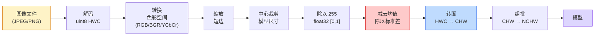
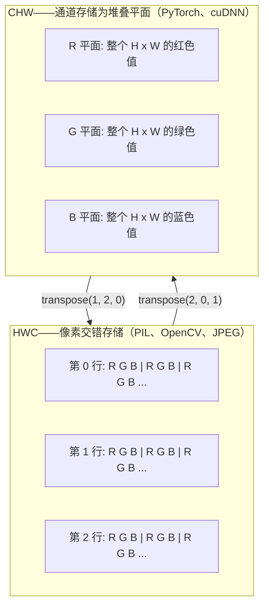

# 图像基础——像素、通道与色彩空间（Image Fundamentals — Pixels, Channels, Color Spaces）

> 图像就是一张由光强样本组成的张量。你今后用到的每一个视觉模型，都建立在这个事实之上。

**Type:** Build
**Languages:** Python
**Prerequisites:** Phase 1 Lesson 12 (Tensor Operations), Phase 3 Lesson 11 (Intro to PyTorch)
**Time:** ~45 minutes

## 学习目标（Learning Objectives）

- 解释连续场景如何被离散化为像素，以及采样/量化决策为什么为所有下游模型设定了上限
- 把图像当作 NumPy 数组来读取、切片和检查，并在 HWC 与 CHW 布局之间自如切换
- 在 RGB、灰度、HSV 与 YCbCr 之间相互转换，并说明每种色彩空间存在的理由
- 严格按照预训练 PyTorch 视觉模型的期望执行像素级预处理（归一化、标准化、缩放、通道前置）

## 问题（The Problem）

你读过的每一篇论文、下载过的每一份预训练权重、调用过的每一个视觉 API，都对输入的编码方式有明确假设。把 `uint8` 图像喂给想要 `float32` 的模型，它照样能跑——然后悄悄产出垃圾。把 BGR 喂给在 RGB 上训练的网络，准确率会暴跌十个百分点。给期望 channels-first 的模型传 channels-last 输入，第一个卷积层就会把高度当成特征通道。这些情况没有一个会抛错。它们只是毁掉你的指标，然后让你花一个星期去揪一个藏在文件加载方式里的 bug。

一旦你知道卷积在什么上面滑动，它就不再复杂。难的地方在于："图像"这个词对相机、JPEG 解码器、PIL、OpenCV、torchvision 和 CUDA 内核来说含义各不相同。每一层技术栈都有自己的轴顺序、字节范围和通道约定。分不清这些的视觉工程师，交付的必然是坏掉的流水线。

本课把这个地基修好，让本阶段其余课程都能在其上构建。学完之后你会明白：像素到底是什么；为什么每个像素是三个数而不是一个；"用 ImageNet 统计量归一化"究竟做了什么；以及如何在本阶段其他课程都会默认的那两三种布局之间来回移动。

## 核心概念（The Concept）

### 预处理流水线一览（The full preprocessing pipeline at a glance）

每个生产级视觉系统都是同一串可逆变换。搞错其中一步，模型看到的输入就和它训练时见到的不同。



红色和蓝色两个框是 80% 静默失败的藏身之处：漏掉标准化，以及布局搞错。

### 像素是一个样本，而不是一个方块（A pixel is a sample, not a square）

相机传感器统计落在一网格微小感光单元上的光子。每个感光单元在极短时间内对光做积分，并输出与击中它的光子数量成正比的电压。传感器随后把这个电压离散化为整数。一个感光单元就变成一个像素。

```
Continuous scene                 Sensor grid                     Digital image
(infinite detail)                (H x W detectors)               (H x W integers)

    ~~~~~                        +--+--+--+--+--+                 210 198 180 155 120
   ~   ~   ~                     |  |  |  |  |  |                 205 195 178 152 118
  ~ light ~      ---->           +--+--+--+--+--+     ---->       200 190 175 150 115
   ~~~~~                         |  |  |  |  |  |                 195 185 170 148 112
                                 +--+--+--+--+--+                 188 180 165 145 108
```

这一步会做出两个选择，它们为下游的一切设定了上限：

- **空间采样（spatial sampling）**决定场景每度视角要放多少个感光单元。太少，边缘会变得锯齿化（走样，aliasing）。太多，存储和计算量会爆炸。
- **强度量化（intensity quantization）**决定电压被划分得多细。8 bit 给出 256 个层级，是显示的标准。10、12、16 bit 给出更平滑的渐变，对医学影像、HDR 和原始传感器流水线很重要。

像素不是一块有面积的彩色方块。它是一次测量。当你缩放或旋转时，你是在对这个测量网格重新采样。

### 为什么是三个通道（Why three channels）

一个感光单元统计整个可见光谱的光子——那就是灰度。要得到彩色，传感器在网格上覆盖一层由红、绿、蓝滤镜构成的马赛克。经过去马赛克（demosaicing）之后，每个空间位置都有三个整数：红滤镜感光单元的响应，以及它附近的绿滤镜和蓝滤镜感光单元的响应。这三个整数就是一个像素的 RGB 三元组。

```
One pixel in memory:

    (R, G, B) = (210, 140, 30)   <- reddish-orange

An H x W RGB image:

    shape (H, W, 3)     stored as   H rows of W pixels of 3 values
                                    each in [0, 255] for uint8
```

三不是魔法。深度相机加一个 Z 通道。卫星加红外和紫外波段。医学扫描常常只有一个通道（X 光、CT）或者很多通道（高光谱）。通道数是最后一个轴；卷积层学习如何跨它做混合。

### 两种布局约定：HWC 与 CHW（Two layout conventions: HWC and CHW）

同一个张量，两种排列。每个库各选其一。

```
HWC (height, width, channels)           CHW (channels, height, width)

   W ->                                    H ->
  +-----+-----+-----+                     +-----+-----+
H |R G B|R G B|R G B|                   C |R R R R R R|
| +-----+-----+-----+                   | +-----+-----+
v |R G B|R G B|R G B|                   v |G G G G G G|
  +-----+-----+-----+                     +-----+-----+
                                          |B B B B B B|
                                          +-----+-----+

   PIL, OpenCV, matplotlib,              PyTorch, most deep learning
   almost every image file on disk       frameworks, cuDNN kernels
```

CHW 的存在是因为卷积核要在 H 和 W 上滑动。把通道轴放在最前面，意味着每个卷积核对每个通道看到的是一块连续的二维平面，向量化非常干净。磁盘格式保留 HWC，因为这符合传感器逐行吐出扫描线的方式。

你会敲上千遍的那一行转换：

```
img_chw = img_hwc.transpose(2, 0, 1)      # NumPy
img_chw = img_hwc.permute(2, 0, 1)        # PyTorch tensor
```

内存布局可视化：



### 字节范围与 dtype（Byte ranges and dtype）

三种约定占主导：

| 约定 | dtype | 范围 | 你在哪里见到它 |
|------|-------|------|----------------|
| 原始（Raw） | `uint8` | [0, 255] | 磁盘上的文件、PIL、OpenCV 的输出 |
| 归一化（Normalized） | `float32` | [0.0, 1.0] | `img.astype('float32') / 255` 之后 |
| 标准化（Standardized） | `float32` | 大致 [-2, +2] | 减去均值并除以标准差之后 |

卷积网络是在标准化输入上训练的。ImageNet 统计量 `mean=[0.485, 0.456, 0.406]`、`std=[0.229, 0.224, 0.225]` 是三个通道在整个 ImageNet 训练集上的算术均值和标准差，计算时使用 [0, 1] 归一化后的像素。把原始 `uint8` 喂给期望标准化浮点数的模型，是应用视觉中最常见的静默失败，没有之一。

### 色彩空间及其存在的理由（Color spaces and why they exist）

RGB 是采集格式，但对模型而言它并不总是最有用的表示。

```
 RGB               HSV                       YCbCr / YUV

 R red             H hue (angle 0-360)       Y luminance (brightness)
 G green           S saturation (0-1)        Cb chroma blue-yellow
 B blue            V value/brightness (0-1)  Cr chroma red-green

 Linear to         Separates color from      Separates brightness from
 sensor output     brightness. Useful for    color. JPEG and most video
                   color thresholding, UI    codecs compress the chroma
                   sliders, simple filters   channels harder because the
                                             human eye is less sensitive
                                             to chroma detail than to Y.
```

对大多数现代 CNN，你喂的是 RGB。其他色彩空间会出现在这些场合：

- **HSV**——传统 CV 代码、基于颜色的分割、白平衡。
- **YCbCr**——解读 JPEG 内部结构、视频流水线、只在 Y 上运算的超分辨率模型。
- **灰度**——OCR、文档模型，以及颜色只是干扰变量而非信号的一切场景。

从 RGB 得到灰度用的是加权和，不是平均，因为人眼对绿色比红色和蓝色更敏感：

```
Y = 0.299 R + 0.587 G + 0.114 B       (ITU-R BT.601, the classic weights)
```

### 长宽比、缩放与插值（Aspect ratio, resizing, and interpolation）

每个模型都有固定的输入尺寸（大多数 ImageNet 分类器是 224x224，现代检测器是 384x384 或 512x512）。你的图像很少恰好匹配。三种真正重要的缩放选择：

- **先缩放短边，再中心裁剪**——标准的 ImageNet 配方。保持长宽比，扔掉一圈边缘像素。
- **缩放并填充**——保持长宽比和每一个像素，代价是补上黑边。检测和 OCR 的标准做法。
- **直接缩放到目标尺寸**——拉伸图像。便宜，但扭曲几何，对许多分类任务来说够用。

当新网格与旧网格不对齐时，插值方法决定中间像素如何计算：

```
Nearest neighbour     fastest, blocky, only choice for masks/labels
Bilinear              fast, smooth, default for most image resizing
Bicubic               slower, sharper on upscaling
Lanczos               slowest, best quality, used for final display
```

经验法则：训练用 bilinear，要给人看的素材用 bicubic 或 lanczos，凡包含整数类别 ID 的东西用 nearest。

```figure
conv-output-size
```

## 动手实现（Build It）

### 第 1 步：构建图像张量并检查其形状（Step 1: Build an image tensor and inspect its shape）

先用一个确定性的合成图像，这样第一个实验只需要 NumPy 就能离线运行。文件解码是另一条边界：一旦 JPEG 或 PNG 解码器返回 RGB 字节，下面的所有张量操作就都一样了。

```python
import numpy as np

def synthetic_rgb(h=128, w=192, seed=0):
    rng = np.random.default_rng(seed)
    yy, xx = np.meshgrid(np.linspace(0, 1, h), np.linspace(0, 1, w), indexing="ij")
    r = (np.sin(xx * 6) * 0.5 + 0.5) * 255
    g = yy * 255
    b = (1 - yy) * xx * 255
    rgb = np.stack([r, g, b], axis=-1) + rng.normal(0, 6, (h, w, 3))
    return np.clip(rgb, 0, 255).astype(np.uint8)

arr = synthetic_rgb()

print(f"type:   {type(arr).__name__}")
print(f"dtype:  {arr.dtype}")
print(f"shape:  {arr.shape}     # (H, W, C)")
print(f"min:    {arr.min()}")
print(f"max:    {arr.max()}")
print(f"pixel at (0, 0): {arr[0, 0]}")
```

预期输出：`shape: (H, W, 3)`、`dtype: uint8`、范围 `[0, 255]`。无论这些字节来自相机、图像解码器还是这个合成生成器，标准的解码后表示都是这个样子。

### 第 2 步：拆分通道并重排布局（Step 2: Split channels and re-order layout）

分别取出 R、G、B，然后为 PyTorch 把 HWC 转成 CHW。

```python
R = arr[:, :, 0]
G = arr[:, :, 1]
B = arr[:, :, 2]
print(f"R shape: {R.shape}, mean: {R.mean():.1f}")
print(f"G shape: {G.shape}, mean: {G.mean():.1f}")
print(f"B shape: {B.shape}, mean: {B.mean():.1f}")

arr_chw = arr.transpose(2, 0, 1)
print(f"\nHWC shape: {arr.shape}")
print(f"CHW shape: {arr_chw.shape}")
```

三张灰度平面，每个通道一张。CHW 只是重排坐标轴；只要内存布局允许，并不严格需要复制数据。

### 第 3 步：灰度与 HSV 转换（Step 3: Grayscale and HSV conversions）

加权和灰度转换，然后是手写的 RGB 到 HSV。

```python
def rgb_to_grayscale(rgb):
    weights = np.array([0.299, 0.587, 0.114], dtype=np.float32)
    return (rgb.astype(np.float32) @ weights).astype(np.uint8)

def rgb_to_hsv(rgb):
    rgb_f = rgb.astype(np.float32) / 255.0
    r, g, b = rgb_f[..., 0], rgb_f[..., 1], rgb_f[..., 2]
    cmax = np.max(rgb_f, axis=-1)
    cmin = np.min(rgb_f, axis=-1)
    delta = cmax - cmin

    h = np.zeros_like(cmax)
    mask = delta > 0
    argmax = np.argmax(rgb_f, axis=-1)
    rmax = mask & (argmax == 0)
    gmax = mask & (argmax == 1)
    bmax = mask & (argmax == 2)
    h[rmax] = ((g[rmax] - b[rmax]) / delta[rmax]) % 6
    h[gmax] = ((b[gmax] - r[gmax]) / delta[gmax]) + 2
    h[bmax] = ((r[bmax] - g[bmax]) / delta[bmax]) + 4
    h = h * 60.0

    s = np.divide(delta, cmax, out=np.zeros_like(delta), where=cmax > 0)
    v = cmax
    return np.stack([h, s, v], axis=-1)

gray = rgb_to_grayscale(arr)
hsv = rgb_to_hsv(arr)
print(f"gray shape: {gray.shape}, range: [{gray.min()}, {gray.max()}]")
print(f"hsv   shape: {hsv.shape}")
print(f"hue range: [{hsv[..., 0].min():.1f}, {hsv[..., 0].max():.1f}] degrees")
print(f"sat range: [{hsv[..., 1].min():.2f}, {hsv[..., 1].max():.2f}]")
print(f"val range: [{hsv[..., 2].min():.2f}, {hsv[..., 2].max():.2f}]")
```

色相以度为单位输出，饱和度和明度在 [0, 1] 之间。这与 OpenCV 的 `hsv_full` 约定一致。

### 第 4 步：归一化、标准化及其逆操作（Step 4: Normalize, standardize, and reverse it）

从原始字节出发，得到预训练 ImageNet 模型期望的那个张量，然后再变回去。

```python
mean = np.array([0.485, 0.456, 0.406], dtype=np.float32)
std = np.array([0.229, 0.224, 0.225], dtype=np.float32)

def preprocess_imagenet(rgb_uint8):
    x = rgb_uint8.astype(np.float32) / 255.0
    x = (x - mean) / std
    x = x.transpose(2, 0, 1)
    return x

def deprocess_imagenet(chw_float32):
    x = chw_float32.transpose(1, 2, 0)
    x = x * std + mean
    x = np.clip(x * 255.0, 0, 255).astype(np.uint8)
    return x

x = preprocess_imagenet(arr)
print(f"preprocessed shape: {x.shape}     # (C, H, W)")
print(f"preprocessed dtype: {x.dtype}")
print(f"preprocessed mean per channel:  {x.mean(axis=(1, 2)).round(3)}")
print(f"preprocessed std  per channel:  {x.std(axis=(1, 2)).round(3)}")

roundtrip = deprocess_imagenet(x)
max_diff = np.abs(roundtrip.astype(int) - arr.astype(int)).max()
print(f"roundtrip max pixel diff: {max_diff}    # should be 0 or 1")
```

每个通道的均值应接近零，标准差接近一。这对 preprocess/deprocess 正是 torchvision 中每次调用 `transforms.Normalize` 在底层做的事。

### 第 5 步：从零实现缩放（Step 5: Resize from scratch）

最近邻把每个输出坐标四舍五入到单个源像素。双线性插值找到周围的四个像素，按距离加权混合。下面两种实现都使用端点对齐的坐标，因此第一个和最后一个源像素保持不动。

```python
def resize_coordinates(source_length, target_length):
    if target_length == 1:
        return np.zeros(1, dtype=np.float32)
    return np.linspace(0, source_length - 1, target_length, dtype=np.float32)

def nearest_resize(image, target_height, target_width):
    y = np.rint(resize_coordinates(image.shape[0], target_height)).astype(int)
    x = np.rint(resize_coordinates(image.shape[1], target_width)).astype(int)
    return image[y[:, None], x[None, :]]

def bilinear_resize(image, target_height, target_width):
    y = resize_coordinates(image.shape[0], target_height)
    x = resize_coordinates(image.shape[1], target_width)
    y0 = np.floor(y).astype(int)
    x0 = np.floor(x).astype(int)
    y1 = np.minimum(y0 + 1, image.shape[0] - 1)
    x1 = np.minimum(x0 + 1, image.shape[1] - 1)
    wy = (y - y0)[:, None, None]
    wx = (x - x0)[None, :, None]

    source = image.astype(np.float32)
    top = source[y0[:, None], x0[None, :]] * (1 - wx)
    top += source[y0[:, None], x1[None, :]] * wx
    bottom = source[y1[:, None], x0[None, :]] * (1 - wx)
    bottom += source[y1[:, None], x1[None, :]] * wx
    result = top * (1 - wy) + bottom * wy
    return np.clip(np.rint(result), 0, 255).astype(image.dtype)

target_height = arr.shape[0] * 3
target_width = arr.shape[1] * 3
nearest = nearest_resize(arr, target_height, target_width)
bilinear = bilinear_resize(arr, target_height, target_width)

def local_roughness(x):
    gy = np.diff(x.astype(float), axis=0)
    gx = np.diff(x.astype(float), axis=1)
    return float(np.abs(gy).mean() + np.abs(gx).mean())

for name, out in [("nearest", nearest), ("bilinear", bilinear)]:
    print(f"{name:>8}  shape={out.shape}  roughness={local_roughness(out):6.2f}")
```

最近邻在粗糙度上得分最高，因为它保留了硬边缘。双线性更平滑，因为每个新像素在每个轴上都混合了两个位置。配套的可运行代码把同样的可分离思路扩展到每轴四个邻居，采用 Catmull-Rom 三次核，然后在不用任何图像库的情况下打印全部三种结果。

## 直接使用（Use It）

PyTorch 在成批的、感知设备的张量上执行同样的操作。下面的代码缩放短边、做中心裁剪、标准化每个通道，并产出预训练模型期望的 NCHW 张量。

```python
import torch
import torch.nn.functional as F

image_hwc = torch.from_numpy(synthetic_rgb(256, 320))
batch = image_hwc.permute(2, 0, 1).unsqueeze(0).float() / 255.0

height, width = batch.shape[-2:]
scale = 256 / min(height, width)
resized_height = round(height * scale)
resized_width = round(width * scale)
batch = F.interpolate(
    batch,
    size=(resized_height, resized_width),
    mode="bilinear",
    align_corners=False,
    antialias=True,
)

top = (resized_height - 224) // 2
left = (resized_width - 224) // 2
batch = batch[:, :, top:top + 224, left:left + 224]

mean = torch.tensor([0.485, 0.456, 0.406]).view(1, 3, 1, 1)
std = torch.tensor([0.229, 0.224, 0.225]).view(1, 3, 1, 1)
batch = (batch - mean) / std

print(f"tensor dtype: {batch.dtype}")
print(f"batched shape: {tuple(batch.shape)}")
print(f"per-channel mean: {batch.mean(dim=(0, 2, 3)).tolist()}")
print(f"per-channel std:  {batch.std(dim=(0, 2, 3)).tolist()}")
```

四个步骤，必须严格按这个顺序：把字节转成 float 并把 HWC 换成 NCHW；把短边缩放到 256；做 224x224 中心裁剪；减去 ImageNet 均值再除以其标准差。打乱这个顺序，送进模型的东西就在悄悄改变。

## 交付成果（Ship It）

本课产出：

- `outputs/prompt-vision-preprocessing-audit.md`——一个提示词，把任何模型卡或数据集卡变成一份清单，列出团队必须遵守的确切预处理不变量。
- `outputs/skill-image-tensor-inspector.md`——一个技能，给定任何图像形状的张量或数组，报告 dtype、布局、取值范围，以及它看起来是原始的、归一化的还是标准化的。

## 练习（Exercises）

1. **（简单）** 创建一个包含四种不同颜色的 2x2 RGB `uint8` 数组。把 HWC 转成 CHW 再转回来，打印两种形状，并证明往返之后每个值都保持不变。
2. **（中等）** 编写 `standardize(img, mean, std)` 及其逆函数，使两者一起能在任何 uint8 图像上通过 `roundtrip_max_diff <= 1` 测试。你的函数必须用同一种调用方式，既作用于 HWC 的单张图像，也作用于 NCHW 的批次。
3. **（困难）** 取一个 3 通道的 ImageNet 标准化张量，让它通过一个学习 RGB 加权混合、输出单个灰度通道的 1x1 卷积。把权重初始化为 `[0.299, 0.587, 0.114]` 并冻结，然后验证输出与手写的 `rgb_to_grayscale` 在浮点误差范围内一致。还有哪些经典色彩空间变换可以写成 1x1 卷积？

## 关键术语（Key Terms）

| 术语 | 人们常说什么 | 实际含义 |
|------|-------------|---------|
| 像素（Pixel） | "一块彩色方块" | 某个网格位置上的一次光强采样——彩色是三个数，灰度是一个数 |
| 通道（Channel） | "颜色" | 堆叠成图像张量的多个并行空间网格之一；HWC 中是最后一个轴，CHW 中是第一个轴 |
| HWC / CHW | "形状" | 图像张量的轴排列方式；磁盘和 PIL 用 HWC，PyTorch 和 cuDNN 用 CHW |
| 归一化（Normalize） | "缩放图像" | 除以 255，让像素落在 [0, 1]——必要但不充分 |
| 标准化（Standardize） | "零中心化" | 逐通道减去均值再除以标准差，让输入分布匹配模型训练时的分布 |
| 灰度转换（Grayscale conversion） | "对通道求平均" | 系数为 0.299/0.587/0.114 的加权和，对应人眼的亮度感知 |
| 插值（Interpolation） | "缩放怎么选像素" | 新网格与旧网格不对齐时决定输出取值的规则——标签用 nearest，训练用 bilinear，显示用 bicubic |
| 长宽比（Aspect ratio） | "宽比高" | 区分"缩放并填充"与"缩放并拉伸"的那个比值 |

## 延伸阅读（Further Reading）

- [Charles Poynton — A Guided Tour of Color Space](https://poynton.ca/PDFs/Guided_tour.pdf)——对"色彩空间为什么这么多、各自何时重要"最清晰的技术阐述
- [PyTorch Vision Transforms Docs](https://pytorch.org/vision/stable/transforms.html)——你在生产中真正会组合使用的完整变换流水线
- [How JPEG Works (Colt McAnlis)](https://www.youtube.com/watch?v=F1kYBnY6mwg)——对色度子采样、DCT 以及 JPEG 为何编码 YCbCr 而非 RGB 的精彩视觉讲解
- [ImageNet Preprocessing Conventions (torchvision models)](https://pytorch.org/vision/stable/models.html)——`mean=[0.485, 0.456, 0.406]` 的权威出处，以及为什么模型动物园里每个模型都期望它
