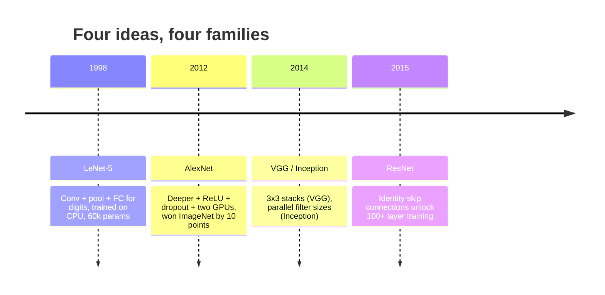
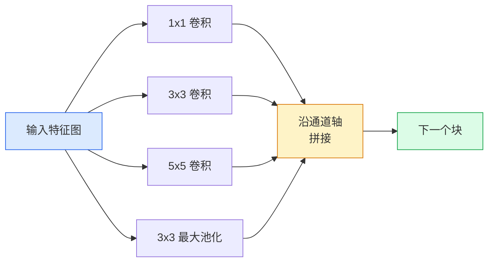
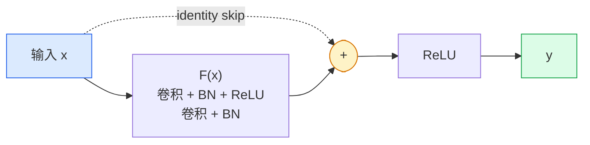

# CNN——从 LeNet 到 ResNet（CNNs — LeNet to ResNet）

> 过去三十年里每个重要的 CNN，都是同一套"卷积–非线性–下采样"配方外加一个新想法。请按顺序学习这些想法。

**Type:** Learn + Build
**Languages:** Python
**Prerequisites:** Phase 3 Lesson 11 (PyTorch), Phase 4 Lesson 01 (Image Fundamentals), Phase 4 Lesson 02 (Convolutions from Scratch)
**Time:** ~75 minutes

## 学习目标（Learning Objectives）

- 梳理 LeNet-5 -> AlexNet -> VGG -> Inception -> ResNet 的架构谱系，并说出每个家族贡献的那个新想法
- 在 PyTorch 中实现 LeNet-5、一个 VGG 风格的块和一个 ResNet BasicBlock，每个都不超过 40 行
- 解释残差连接为什么能把一个 1,000 层的网络从不可训练变成最先进
- 读懂一个现代骨干网络（ResNet-18、ResNet-50），并在看源码之前预测它的输出形状、感受野和参数量

## 问题（The Problem）

2011 年，最好的 ImageNet 分类器 top-5 准确率大约 74%。2012 年 AlexNet 达到 85%。2015 年 ResNet 达到 96%。没有新数据，没有新一代 GPU。收益来自架构思想。一名合格的视觉工程师必须知道哪个思想来自哪篇论文，因为你在 2026 年交付的每个生产级骨干都是这些部件的重新组合——而且这些思想还在不断迁移：分组卷积从 CNN 走进了 transformer，残差连接从 ResNet 走进了现存的每一个 LLM，批归一化（batch normalization）活在扩散模型里。

按顺序研究这些网络还能让你对一种常见错误免疫：明明一个 LeNet 量级的网络就能解决问题，却伸手去拿最大的可用模型。MNIST 不需要 ResNet。了解每个家族的缩放曲线，你就知道该坐在曲线的哪个位置。

## 核心概念（The Concept）

### 改变视觉的四个想法（The four ideas that changed vision）



传统视觉里没有别的进步比得上这四次跳跃。

### LeNet-5（1998）

Yann LeCun 的数字识别器。60,000 个参数。两个卷积-池化块，两个全连接层，tanh 激活。它定义了每个 CNN 都继承的模板：

```
input (1, 32, 32)
  conv 5x5 -> (6, 28, 28)
  avg pool 2x2 -> (6, 14, 14)
  conv 5x5 -> (16, 10, 10)
  avg pool 2x2 -> (16, 5, 5)
  flatten -> 400
  dense -> 120
  dense -> 84
  dense -> 10
```

现代世界称为 CNN 的一切——交替的卷积与下采样、后面接一个小的分类头——无非是层数更多、通道更宽、激活更好的 LeNet。

### AlexNet（2012）

三个变化加在一起打破了 ImageNet 的格局：

1. 用 **ReLU** 取代 tanh。梯度不再消失。训练速度提升六倍。
2. 全连接头里加 **Dropout**。正则化变成了一层，而不是一个技巧。
3. **深度与宽度**。五个卷积层、三个全连接层，6,000 万参数，模型拆到两块 GPU 上训练。

论文的图 2 至今仍把 GPU 拆分画成两条并行流。那种并行是硬件上的权宜之计，不是架构洞见——但上面三个想法仍然存在于你用的每一个模型里。

### VGG（2014）

VGG 问的是：如果只用 3x3 卷积，并且把网络做深，会发生什么？

```
stack:   conv 3x3 -> conv 3x3 -> pool 2x2
repeat:  16 or 19 conv layers
```

两个 3x3 卷积与一个 5x5 卷积看到同样的 5x5 输入区域，但参数更少（2*9*C^2 = 18C^2 对 25*C^2），中间还多了一个 ReLU。VGG 把这个观察变成了一整个架构。这种简单性——一种块类型，不断重复——使它成为后来一切的参照点。

代价：1.38 亿参数，训练慢，推理贵。

### Inception（2014，同年）

对于"我该用多大的卷积核？"这个问题，Google 的回答是：全都要，并行地要。



每条分支各司其职——1x1 负责通道混合，3x3 负责局部纹理，5x5 负责更大的模式，池化负责平移不变的特征——而拼接让下一层自由挑选有用的分支。Inception v1 在每条分支内部用 1x1 卷积做瓶颈，把参数量控制在合理范围。

### 退化问题（The degradation problem）

到 2015 年，VGG-19 能训练，VGG-32 不行。按理说深度应该有帮助，但超过约 20 层之后，训练损失和测试损失都变差了。这不是过拟合。这是优化器找不到有用的权重，因为梯度在穿过每一层时都在按乘法缩小。

```
Plain deep network:
  y = f_L( f_{L-1}( ... f_1(x) ... ) )

Gradient wrt early layer:
  dL/dW_1 = dL/dy * df_L/df_{L-1} * ... * df_2/df_1 * df_1/dW_1

Each multiplicative term has magnitude roughly (weight magnitude) * (activation gain).
Stack 100 of them with gains < 1 and the gradient is effectively zero.
```

VGG 在 19 层能工作，是因为批归一化（batch norm，同期发表）把激活值的尺度维持得很好。但即便是批归一化，也无法把深度救到 30 层以上。

### ResNet（2015）

He、Zhang、Ren、Sun 提出了一个改变，修复了一切：

```
standard block:   y = F(x)
residual block:   y = F(x) + x
```

`+ x` 意味着这一层永远可以选择什么都不做：把 `F(x)` 压到零即可。一个 1,000 层的 ResNet 现在最多也就和一个 1 层网络一样差，因为每个多余的块都有一个轻易的逃生通道。有了这个保证，优化器才愿意让每个块都*略微*有用——而略微有用的东西堆上 100 次，就是最先进的水平。



这个块的两种变体随处可见：

- **BasicBlock**（ResNet-18、ResNet-34）：两个 3x3 卷积，跳跃连接绕过两者。
- **Bottleneck**（ResNet-50、-101、-152）：1x1 降维、3x3 居中、1x1 升维，跳跃连接绕过三件套。通道数很多时更便宜。

当跳跃连接必须跨越一次下采样（stride=2）时，恒等路径会替换成一个 stride=2 的 1x1 卷积来匹配形状。

### 残差为何在视觉之外同样重要（Why residuals matter beyond vision）

这个想法其实与图像分类无关。它真正的意义是把深度网络从"双手合十祈祷梯度活下来"变成可靠、可扩展的工程工具。你在下一阶段读到的每个 transformer，每个块里都有完全相同的跳跃连接。没有 ResNet，就没有 GPT。

```figure
pooling
```

## 动手实现（Build It）

### 第 1 步：LeNet-5（Step 1: LeNet-5）

一个极简而忠实的 LeNet。tanh 激活，平均池化。对现代性的唯一让步是下游改用 `nn.CrossEntropyLoss`，而不是原来的 Gaussian 连接。

```python
import torch
import torch.nn as nn
import torch.nn.functional as F

class LeNet5(nn.Module):
    def __init__(self, num_classes=10):
        super().__init__()
        self.conv1 = nn.Conv2d(1, 6, kernel_size=5)
        self.conv2 = nn.Conv2d(6, 16, kernel_size=5)
        self.pool = nn.AvgPool2d(2)
        self.fc1 = nn.Linear(16 * 5 * 5, 120)
        self.fc2 = nn.Linear(120, 84)
        self.fc3 = nn.Linear(84, num_classes)

    def forward(self, x):
        x = self.pool(torch.tanh(self.conv1(x)))
        x = self.pool(torch.tanh(self.conv2(x)))
        x = torch.flatten(x, 1)
        x = torch.tanh(self.fc1(x))
        x = torch.tanh(self.fc2(x))
        return self.fc3(x)

net = LeNet5()
x = torch.randn(1, 1, 32, 32)
print(f"output: {net(x).shape}")
print(f"params: {sum(p.numel() for p in net.parameters()):,}")
```

预期输出：`output: torch.Size([1, 10])`、`params: 61,706`。这就是开启现代视觉的那个完整数字分类器。

### 第 2 步：一个 VGG 块（Step 2: A VGG block）

一个可复用的块：两个 3x3 卷积、ReLU、批归一化、最大池化。

```python
class VGGBlock(nn.Module):
    def __init__(self, in_c, out_c):
        super().__init__()
        self.conv1 = nn.Conv2d(in_c, out_c, kernel_size=3, padding=1)
        self.bn1 = nn.BatchNorm2d(out_c)
        self.conv2 = nn.Conv2d(out_c, out_c, kernel_size=3, padding=1)
        self.bn2 = nn.BatchNorm2d(out_c)
        self.pool = nn.MaxPool2d(2)

    def forward(self, x):
        x = F.relu(self.bn1(self.conv1(x)))
        x = F.relu(self.bn2(self.conv2(x)))
        return self.pool(x)

class MiniVGG(nn.Module):
    def __init__(self, num_classes=10):
        super().__init__()
        self.stack = nn.Sequential(
            VGGBlock(3, 32),
            VGGBlock(32, 64),
            VGGBlock(64, 128),
        )
        self.head = nn.Sequential(
            nn.AdaptiveAvgPool2d(1),
            nn.Flatten(),
            nn.Linear(128, num_classes),
        )

    def forward(self, x):
        return self.head(self.stack(x))

net = MiniVGG()
x = torch.randn(1, 3, 32, 32)
print(f"output: {net(x).shape}")
print(f"params: {sum(p.numel() for p in net.parameters()):,}")
```

在 CIFAR 尺寸的输入上放三个 VGG 块、一个自适应池化、一个线性层。约 29 万参数。对 CIFAR-10 来说绰绰有余。

### 第 3 步：一个 ResNet BasicBlock（Step 3: A ResNet BasicBlock）

ResNet-18 和 ResNet-34 的核心构建块。

```python
class BasicBlock(nn.Module):
    def __init__(self, in_c, out_c, stride=1):
        super().__init__()
        self.conv1 = nn.Conv2d(in_c, out_c, kernel_size=3, stride=stride, padding=1, bias=False)
        self.bn1 = nn.BatchNorm2d(out_c)
        self.conv2 = nn.Conv2d(out_c, out_c, kernel_size=3, stride=1, padding=1, bias=False)
        self.bn2 = nn.BatchNorm2d(out_c)
        if stride != 1 or in_c != out_c:
            self.shortcut = nn.Sequential(
                nn.Conv2d(in_c, out_c, kernel_size=1, stride=stride, bias=False),
                nn.BatchNorm2d(out_c),
            )
        else:
            self.shortcut = nn.Identity()

    def forward(self, x):
        out = F.relu(self.bn1(self.conv1(x)))
        out = self.bn2(self.conv2(out))
        out = out + self.shortcut(x)
        return F.relu(out)
```

卷积层上的 `bias=False` 是批归一化的惯例——BN 的 beta 参数已经承担了偏置，再带一个卷积偏置纯属浪费。`shortcut` 只有在步幅或通道数变化时才需要一个真正的卷积；否则它就是一个什么都不做的恒等映射。

### 第 4 步：一个小型 ResNet（Step 4: A tiny ResNet）

堆四组 BasicBlock，得到一个能在 CIFAR 尺寸输入上工作的 ResNet。

```python
class TinyResNet(nn.Module):
    def __init__(self, num_classes=10):
        super().__init__()
        self.stem = nn.Sequential(
            nn.Conv2d(3, 32, kernel_size=3, stride=1, padding=1, bias=False),
            nn.BatchNorm2d(32),
            nn.ReLU(inplace=True),
        )
        self.layer1 = self._make_group(32, 32, num_blocks=2, stride=1)
        self.layer2 = self._make_group(32, 64, num_blocks=2, stride=2)
        self.layer3 = self._make_group(64, 128, num_blocks=2, stride=2)
        self.layer4 = self._make_group(128, 256, num_blocks=2, stride=2)
        self.head = nn.Sequential(
            nn.AdaptiveAvgPool2d(1),
            nn.Flatten(),
            nn.Linear(256, num_classes),
        )

    def _make_group(self, in_c, out_c, num_blocks, stride):
        blocks = [BasicBlock(in_c, out_c, stride=stride)]
        for _ in range(num_blocks - 1):
            blocks.append(BasicBlock(out_c, out_c, stride=1))
        return nn.Sequential(*blocks)

    def forward(self, x):
        x = self.stem(x)
        x = self.layer1(x)
        x = self.layer2(x)
        x = self.layer3(x)
        x = self.layer4(x)
        return self.head(x)

net = TinyResNet()
x = torch.randn(1, 3, 32, 32)
print(f"output: {net(x).shape}")
print(f"params: {sum(p.numel() for p in net.parameters()):,}")
```

四组，每组两个块。第 2、3、4 组的开头步幅为 2。通道数在每次下采样时翻倍。大约 280 万参数。这就是能干净地缩放到 ResNet-152 的标准配方。

### 第 5 步：比较参数到特征的效率（Step 5: Compare parameter-to-feature efficiency）

把同样的输入跑过三个网络，比较参数量。

```python
def summary(name, net, x):
    y = net(x)
    params = sum(p.numel() for p in net.parameters())
    print(f"{name:12s}  input {tuple(x.shape)} -> output {tuple(y.shape)}  params {params:>10,}")

x = torch.randn(1, 3, 32, 32)
summary("LeNet5",     LeNet5(),       torch.randn(1, 1, 32, 32))
summary("MiniVGG",    MiniVGG(),      x)
summary("TinyResNet", TinyResNet(),   x)
```

三个模型，三个时代，参数量相差三个数量级。就 CIFAR-10 准确率而言，训练几个 epoch 之后大致是：LeNet 60%，MiniVGG 89%，TinyResNet 93%。

## 直接使用（Use It）

`torchvision.models` 提供了上述所有架构的预训练版本。各家族的调用签名完全一致——这正是骨干抽象的意义所在。

```python
from torchvision.models import resnet18, ResNet18_Weights, vgg16, VGG16_Weights

r18 = resnet18(weights=ResNet18_Weights.IMAGENET1K_V1)
r18.eval()

print(f"ResNet-18 params: {sum(p.numel() for p in r18.parameters()):,}")
print(r18.layer1[0])
print()

v16 = vgg16(weights=VGG16_Weights.IMAGENET1K_V1)
v16.eval()
print(f"VGG-16   params: {sum(p.numel() for p in v16.parameters()):,}")
```

ResNet-18 有 1,170 万参数，VGG-16 有 1.38 亿。ImageNet top-1 准确率接近（69.8% 对 71.6%）。残差连接给你换来 12 倍的参数效率优势。这就是 ResNet 系从 2016 年统治到 2021 年 ViT 出现的原因——而在算力受限的真实部署中，它至今仍在统治。

迁移学习的配方永远一样：加载预训练权重，冻结骨干，替换分类头。

```python
for p in r18.parameters():
    p.requires_grad = False
r18.fc = nn.Linear(r18.fc.in_features, 10)
```

三行代码。你现在有了一个 10 类的 CIFAR 分类器，它继承了 ImageNet 花大价钱学来的表示。

## 交付成果（Ship It）

本课产出：

- `outputs/prompt-backbone-selector.md`——一个提示词，根据任务、数据集规模和算力预算挑选合适的 CNN 家族（LeNet/VGG/ResNet/MobileNet/ConvNeXt）。
- `outputs/skill-residual-block-reviewer.md`——一个技能，读取 PyTorch 模块并标出跳跃连接的错误（步幅变化时缺少 shortcut、shortcut 的激活顺序、BN 相对于相加的位置）。

## 练习（Exercises）

1. **（简单）** 手工逐层数出 `TinyResNet` 的参数量，与 `sum(p.numel() for p in net.parameters())` 对比。参数预算的大头花在哪里——卷积、BN 还是分类头？
2. **（中等）** 实现 Bottleneck 块（1x1 -> 3x3 -> 1x1，带跳跃连接），并用它搭一个 ResNet-50 风格的 CIFAR 网络。与 `TinyResNet` 比较参数量。
3. **（困难）** 去掉 `BasicBlock` 的跳跃连接，在 CIFAR-10 上分别训练一个 34 块的"plain"网络和一个 34 块的 ResNet，各 10 个 epoch。画出两者的训练损失对 epoch 的曲线。复现 He 等人图 1 的结果：plain 深网络收敛到的损失比它更浅的孪生兄弟更高。

## 关键术语（Key Terms）

| 术语 | 人们常说什么 | 实际含义 |
|------|-------------|---------|
| 骨干网络（Backbone） | "模型本身" | 产生送入任务头的特征图的卷积块堆叠 |
| 残差连接（Residual connection） | "跳跃连接（skip connection）" | `y = F(x) + x`；让优化器把 F 置零就能学到恒等映射，从而让任意深度都可训练 |
| BasicBlock | "两个带跳跃的 3x3 卷积" | ResNet-18/34 的构建块：conv-BN-ReLU-conv-BN-add-ReLU |
| Bottleneck | "1x1 降维、3x3、1x1 升维" | ResNet-50/101/152 的块；通道数多时更便宜，因为 3x3 在缩窄后的宽度上运行 |
| 退化问题（Degradation problem） | "越深越差" | 超过约 20 层 plain 卷积后，训练误差和测试误差都上升；解决之道是残差连接，不是更多数据 |
| Stem | "第一层" | 把 3 通道输入转成基础特征宽度的初始卷积；ImageNet 通常是 7x7 步幅 2，CIFAR 通常是 3x3 步幅 1 |
| Head | "分类器" | 最后一个骨干块之后的层：自适应池化、展平、一个或多个线性层 |
| 迁移学习（Transfer learning） | "预训练权重" | 加载在 ImageNet 上训练的骨干，只在你的任务上微调头部 |

## 延伸阅读（Further Reading）

- [Deep Residual Learning for Image Recognition (He et al., 2015)](https://arxiv.org/abs/1512.03385)——ResNet 论文；每一张图都值得研究
- [Very Deep Convolutional Networks (Simonyan & Zisserman, 2014)](https://arxiv.org/abs/1409.1556)——VGG 论文；至今仍是"为什么 3x3"的最佳参考
- [ImageNet Classification with Deep CNNs (Krizhevsky et al., 2012)](https://papers.nips.cc/paper_files/paper/2012/hash/c399862d3b9d6b76c8436e924a68c45b-Abstract.html)——AlexNet；终结手工特征时代的论文
- [Going Deeper with Convolutions (Szegedy et al., 2014)](https://arxiv.org/abs/1409.4842)——Inception v1；至今仍出现在视觉 transformer 中的并行滤波器思想
