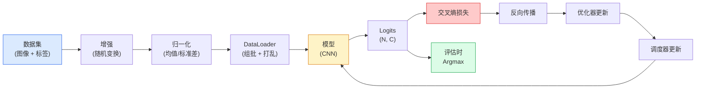

# 图像分类（Image Classification）

> 分类器就是一个从像素到类别概率分布的函数。其余一切都是管道工程。

**Type:** Build
**Languages:** Python
**Prerequisites:** Phase 2 Lesson 09 (Model Evaluation), Phase 3 Lesson 10 (Mini Framework), Phase 4 Lesson 03 (CNNs)
**Time:** ~75 minutes

## 学习目标（Learning Objectives）

- 在 CIFAR-10 上构建一条端到端的图像分类流水线：数据集、增强、模型、训练循环、评估
- 解释每个组件的角色（dataloader、损失、优化器、调度器、增强），并预测破坏其中任何一个会如何体现在损失曲线上
- 从零实现 mixup、cutout 和标签平滑，并说明什么时候值得引入每一种
- 读懂混淆矩阵和逐类别 precision/recall 表，在聚合准确率之外诊断数据集和模型的失败

## 问题（The Problem）

每个上线的视觉任务都在某个层面归结为图像分类。检测是对区域分类。分割是对像素分类。检索按与类别中心的相似度排序。把分类做对——数据集循环、增强策略、损失、评估——才是能迁移到本阶段其他所有任务的技能。

大多数分类 bug 不在模型里，而藏在流水线中：坏掉的归一化、没打乱的训练集、扭曲标签的增强、被训练数据污染的验证集划分、在 epoch 30 之后悄悄发散的学习率。配置正确时能在 CIFAR-10 上达到 93% 的 CNN，配置坏了通常只能拿 70-75%，而且整条损失曲线看起来一直都很正常。

本课手工接线整条流水线，让每个部件都可检查。你不会使用 `torchvision.datasets` 里任何可能藏 bug 的东西。

## 核心概念（The Concept）

### 分类流水线（The classification pipeline）



这个循环里的每一行都可能藏 bug。交叉熵吃的是原始 logits，不是 softmax 输出，所以任何出现在损失之前的 `model(x).softmax()` 都在悄悄算错梯度。增强只作用于输入，不作用于标签——mixup 除外，它对两者都做混合。`optimizer.zero_grad()` 每步必须执行一次；漏掉它会累积梯度，症状像一个疯狂不稳定的学习率。这些 bug 每一个都会把学习曲线压平，而不抛出任何错误。

### 交叉熵、logits 与 softmax（Cross-entropy, logits, and softmax）

分类器为每张图像产生 `C` 个数，称为 logits。应用 softmax 把它们变成一个概率分布：

```
softmax(z)_i = exp(z_i) / sum_j exp(z_j)
```

交叉熵度量正确类的负对数概率：

```
CE(z, y) = -log( softmax(z)_y )
        = -z_y + log( sum_j exp(z_j) )
```

右边的形式是数值稳定的形式（log-sum-exp）。PyTorch 的 `nn.CrossEntropyLoss` 把 softmax + NLL 融合成一个操作，直接吃原始 logits。自己先做一遍 softmax 几乎总是 bug——你算出的是 log(softmax(softmax(z)))，一个没有意义的量。

### 数据增强为何有效（Why augmentation works）

CNN 对平移有归纳偏置（来自权重共享），但对裁剪、翻转、颜色抖动或遮挡没有内置的不变性。教会它这些不变性的唯一办法，就是给它看能触发这些不变性的像素。训练中的每一次随机变换都是在说："这两张图有同样的标签；去学那些忽略差异的特征。"

```
Original crop:  "dog facing left"
Flip:           "dog facing right"       <- same label, different pixels
Rotate(+15):    "dog, slight tilt"
Colour jitter:  "dog in warmer light"
RandomErasing:  "dog with patch missing"
```

规则是：增强必须保持标签。对数字做 cutout 和旋转可能把"6"变成"9"；对这类数据集，要用更小的旋转范围，并挑选尊重数字特有不变性的增强。

### Mixup 与 cutmix（Mixup and cutmix）

普通增强变换像素但保持标签 one-hot。**Mixup** 和 **cutmix** 打破了这一点：对两者同时插值。

```
Mixup:
  lambda ~ Beta(a, a)
  x = lambda * x_i + (1 - lambda) * x_j
  y = lambda * y_i + (1 - lambda) * y_j

Cutmix:
  paste a random rectangle of x_j into x_i
  y = area-weighted mix of y_i and y_j
```

它为什么有用：模型不再死记尖峰状的 one-hot 目标，而是学会在类别之间插值。训练损失上升，测试准确率也上升。这是任何分类器最便宜的鲁棒性升级，没有之一。

### 标签平滑（Label smoothing）

mixup 的近亲。不再用 `[0, 0, 1, 0, 0]` 作为训练目标，而是用 `[eps/C, eps/C, 1-eps, eps/C, eps/C]`，其中 `eps` 取 0.1 这样的小值。它阻止模型产生任意尖锐的 logits，几乎零成本地改善校准。自 PyTorch 1.10 起内置在 `nn.CrossEntropyLoss(label_smoothing=0.1)` 中。

### 准确率之外的评估（Evaluation beyond accuracy）

聚合准确率掩盖不均衡。一个 90-10 的二分类器永远预测多数类就能拿 90%。真正能告诉你发生了什么的工具是：

- **逐类别准确率（per-class accuracy）**——每个类别一个数字；表现不佳的类别立刻浮出水面。
- **混淆矩阵（confusion matrix）**——C x C 的网格，第 i 行第 j 列 = 真实类别 i 被预测为类别 j 的次数；对角线是正确的部分，非对角线才是你模型的故事所在。
- **Top-1 / Top-5**——正确类是否出现在前 1 或前 5 个预测中；Top-5 对 ImageNet 很重要，因为像"Norwich terrier"对"Norfolk terrier"这样的类别真的难以区分。
- **校准（calibration，ECE）**——置信度 0.8 的预测是否在 80% 的时候是对的？现代网络系统性地过度自信；用温度缩放（temperature scaling）或标签平滑修复。

```figure
receptive-field
```

## 动手实现（Build It）

### 第 1 步：一个确定性的合成数据集（Step 1: A deterministic synthetic dataset）

CIFAR-10 存在磁盘上。为了让本课可复现且快速，我们构建一个看起来像 CIFAR 的合成数据集——32x32 的 RGB 图像，带有模型必须学习的类专属结构。同一条流水线原封不动地适用于真实 CIFAR-10。

```python
import numpy as np
import torch
from torch.utils.data import Dataset


def synthetic_cifar(num_per_class=1000, num_classes=10, seed=0):
    rng = np.random.default_rng(seed)
    X = []
    Y = []
    for c in range(num_classes):
        centre = rng.uniform(0, 1, (3,))
        freq = 2 + c
        for _ in range(num_per_class):
            yy, xx = np.meshgrid(np.linspace(0, 1, 32), np.linspace(0, 1, 32), indexing="ij")
            r = np.sin(xx * freq) * 0.5 + centre[0]
            g = np.cos(yy * freq) * 0.5 + centre[1]
            b = (xx + yy) * 0.5 * centre[2]
            img = np.stack([r, g, b], axis=-1)
            img += rng.normal(0, 0.08, img.shape)
            img = np.clip(img, 0, 1)
            X.append(img.astype(np.float32))
            Y.append(c)
    X = np.stack(X)
    Y = np.array(Y)
    idx = rng.permutation(len(X))
    return X[idx], Y[idx]


class ArrayDataset(Dataset):
    def __init__(self, X, Y, transform=None):
        self.X = X
        self.Y = Y
        self.transform = transform

    def __len__(self):
        return len(self.X)

    def __getitem__(self, i):
        img = self.X[i]
        if self.transform is not None:
            img = self.transform(img)
        img = torch.from_numpy(img).permute(2, 0, 1)
        return img, int(self.Y[i])
```

每个类有自己的配色和频率模式，外加高斯噪声，逼模型去学信号而不是死记像素。十个类，每类一千张图，已打乱顺序。

### 第 2 步：归一化与增强（Step 2: Normalisation and augmentation）

每条视觉流水线都有的两个变换。

```python
def standardize(mean, std):
    mean = np.array(mean, dtype=np.float32)
    std = np.array(std, dtype=np.float32)
    def _fn(img):
        return (img - mean) / std
    return _fn


def random_hflip(p=0.5):
    def _fn(img):
        if np.random.random() < p:
            return img[:, ::-1, :].copy()
        return img
    return _fn


def random_crop(pad=4):
    def _fn(img):
        h, w = img.shape[:2]
        padded = np.pad(img, ((pad, pad), (pad, pad), (0, 0)), mode="reflect")
        y = np.random.randint(0, 2 * pad)
        x = np.random.randint(0, 2 * pad)
        return padded[y:y + h, x:x + w, :]
    return _fn


def compose(*fns):
    def _fn(img):
        for fn in fns:
            img = fn(img)
        return img
    return _fn
```

裁剪前用反射填充，而不是零填充，因为黑色边框是一种信号，模型会以无用的方式学着忽略它。

### 第 3 步：Mixup（Step 3: Mixup）

在训练步骤内部混合两张图像和两个标签。实现为批级变换，让它紧挨着前向传播，而不是藏在数据集里。

```python
def mixup_batch(x, y, num_classes, alpha=0.2):
    if alpha <= 0:
        return x, torch.nn.functional.one_hot(y, num_classes).float()
    lam = float(np.random.beta(alpha, alpha))
    idx = torch.randperm(x.size(0), device=x.device)
    x_mixed = lam * x + (1 - lam) * x[idx]
    y_onehot = torch.nn.functional.one_hot(y, num_classes).float()
    y_mixed = lam * y_onehot + (1 - lam) * y_onehot[idx]
    return x_mixed, y_mixed


def soft_cross_entropy(logits, soft_targets):
    log_probs = torch.log_softmax(logits, dim=-1)
    return -(soft_targets * log_probs).sum(dim=-1).mean()
```

`soft_cross_entropy` 是针对软标签分布的交叉熵。当目标恰好是 one-hot 时，它退化为通常的 one-hot 情形。

### 第 4 步：训练循环（Step 4: The training loop）

完整配方：数据过一遍，每个批次做一次梯度，每个 epoch 走一次调度器。

```python
import torch
import torch.nn as nn
from torch.utils.data import DataLoader
from torch.optim import SGD
from torch.optim.lr_scheduler import CosineAnnealingLR

def train_one_epoch(model, loader, optimizer, device, num_classes, use_mixup=True):
    model.train()
    total, correct, loss_sum = 0, 0, 0.0
    for x, y in loader:
        x, y = x.to(device), y.to(device)
        if use_mixup:
            x_m, y_soft = mixup_batch(x, y, num_classes)
            logits = model(x_m)
            loss = soft_cross_entropy(logits, y_soft)
        else:
            logits = model(x)
            loss = nn.functional.cross_entropy(logits, y, label_smoothing=0.1)
        optimizer.zero_grad()
        loss.backward()
        optimizer.step()
        loss_sum += loss.item() * x.size(0)
        total += x.size(0)
        # Training accuracy vs the un-mixed labels `y` is only an approximation
        # when mixup is on (the model saw soft targets, not y). Treat it as a
        # rough progress signal; rely on val accuracy for real performance.
        with torch.no_grad():
            pred = logits.argmax(dim=-1)
            correct += (pred == y).sum().item()
    return loss_sum / total, correct / total


@torch.no_grad()
def evaluate(model, loader, device, num_classes):
    model.eval()
    total, correct = 0, 0
    loss_sum = 0.0
    cm = torch.zeros(num_classes, num_classes, dtype=torch.long)
    for x, y in loader:
        x, y = x.to(device), y.to(device)
        logits = model(x)
        loss = nn.functional.cross_entropy(logits, y)
        pred = logits.argmax(dim=-1)
        for t, p in zip(y.cpu(), pred.cpu()):
            cm[t, p] += 1
        loss_sum += loss.item() * x.size(0)
        total += x.size(0)
        correct += (pred == y).sum().item()
    return loss_sum / total, correct / total, cm
```

每次写训练循环都要检查的五条不变量：

1. 训练前 `model.train()`，评估前 `model.eval()`——切换 dropout 和 batchnorm 的行为。
2. `.backward()` 之前先 `.zero_grad()`。
3. 累积指标时用 `.item()`，别让任何东西把计算图吊着不放。
4. 评估期间加 `@torch.no_grad()`——省内存省时间，防止微妙的事故。
5. 对原始 logits 做 argmax，而不是对 softmax——结果一样，少一个操作。

### 第 5 步：组装起来（Step 5: Put it together）

使用上一课的 `TinyResNet`，训练几个 epoch，然后评估。

```python
from main import synthetic_cifar, ArrayDataset
from main import standardize, random_hflip, random_crop, compose
from main import mixup_batch, soft_cross_entropy
from main import train_one_epoch, evaluate
# TinyResNet comes from the previous lesson (03-cnns-lenet-to-resnet).
# Adjust the import path to wherever you stored the previous lesson's code.
from cnns_lenet_to_resnet import TinyResNet  # example placeholder

X, Y = synthetic_cifar(num_per_class=500)
split = int(0.9 * len(X))
X_train, Y_train = X[:split], Y[:split]
X_val, Y_val = X[split:], Y[split:]

mean = [0.5, 0.5, 0.5]
std = [0.25, 0.25, 0.25]
train_tf = compose(random_hflip(), random_crop(pad=4), standardize(mean, std))
eval_tf = standardize(mean, std)

train_ds = ArrayDataset(X_train, Y_train, transform=train_tf)
val_ds = ArrayDataset(X_val, Y_val, transform=eval_tf)

train_loader = DataLoader(train_ds, batch_size=128, shuffle=True, num_workers=0)
val_loader = DataLoader(val_ds, batch_size=256, shuffle=False, num_workers=0)

device = "cuda" if torch.cuda.is_available() else "cpu"
model = TinyResNet(num_classes=10).to(device)
optimizer = SGD(model.parameters(), lr=0.1, momentum=0.9, weight_decay=5e-4, nesterov=True)
scheduler = CosineAnnealingLR(optimizer, T_max=10)

for epoch in range(10):
    tr_loss, tr_acc = train_one_epoch(model, train_loader, optimizer, device, 10, use_mixup=True)
    va_loss, va_acc, _ = evaluate(model, val_loader, device, 10)
    scheduler.step()
    print(f"epoch {epoch:2d}  lr {scheduler.get_last_lr()[0]:.4f}  "
          f"train {tr_loss:.3f}/{tr_acc:.3f}  val {va_loss:.3f}/{va_acc:.3f}")
```

在合成数据集上，五个 epoch 内验证准确率就接近完美——这正是目的：流水线是对的，模型能学会一切可学的东西。把数据集换成真实 CIFAR-10，同样的循环不加任何改动就能训练到约 90%。

### 第 6 步：读懂混淆矩阵（Step 6: Read the confusion matrix）

光看准确率永远不知道模型在哪里失败。混淆矩阵可以。

```python
def print_confusion(cm, labels=None):
    c = cm.shape[0]
    labels = labels or [str(i) for i in range(c)]
    print(f"{'':>6}" + "".join(f"{l:>5}" for l in labels))
    for i in range(c):
        row = cm[i].tolist()
        print(f"{labels[i]:>6}" + "".join(f"{v:>5}" for v in row))
    print()
    tp = cm.diag().float()
    fp = cm.sum(dim=0).float() - tp
    fn = cm.sum(dim=1).float() - tp
    prec = tp / (tp + fp).clamp_min(1)
    rec = tp / (tp + fn).clamp_min(1)
    f1 = 2 * prec * rec / (prec + rec).clamp_min(1e-9)
    for i in range(c):
        print(f"{labels[i]:>6}  prec {prec[i]:.3f}  rec {rec[i]:.3f}  f1 {f1[i]:.3f}")

_, _, cm = evaluate(model, val_loader, device, 10)
print_confusion(cm)
```

行是真实类别，列是预测。类别 3 和类别 5 之间一堆非对角计数，说明模型混淆了这两类，并给你一个起点：去做有针对性的数据收集，或设计类专属的增强。

## 直接使用（Use It）

`torchvision` 把上面的一切封装成惯用组件。对真实 CIFAR-10 来说，整条流水线就是四行代码加一个训练循环。

```python
from torchvision.datasets import CIFAR10
from torchvision.transforms import Compose, RandomCrop, RandomHorizontalFlip, ToTensor, Normalize

mean = (0.4914, 0.4822, 0.4465)
std = (0.2470, 0.2435, 0.2616)
train_tf = Compose([
    RandomCrop(32, padding=4, padding_mode="reflect"),
    RandomHorizontalFlip(),
    ToTensor(),
    Normalize(mean, std),
])
eval_tf = Compose([ToTensor(), Normalize(mean, std)])

train_ds = CIFAR10(root="./data", train=True,  download=True, transform=train_tf)
val_ds   = CIFAR10(root="./data", train=False, download=True, transform=eval_tf)
```

有两点要注意：这里的均值/标准差是**数据集专属的**——在 CIFAR-10 训练集上计算，不是 ImageNet——而且反射填充是社区默认的裁剪策略。在这里照搬 ImageNet 统计量，等于白白漏掉约 1% 的准确率，除非有人给模型做性能剖析，否则没人会发现。

## 交付成果（Ship It）

本课产出：

- `outputs/prompt-classifier-pipeline-auditor.md`——一个提示词，按上述五条不变量审计训练脚本，并揪出第一处违规。
- `outputs/skill-classification-diagnostics.md`——一个技能，给定混淆矩阵和类名列表，总结逐类别的失败并提出影响最大的那个修复。

## 练习（Exercises）

1. **（简单）** 在合成数据集上分别用和不带 mixup 训练同一个模型五个 epoch。画出两者的 train 和 val 损失曲线。解释为什么带 mixup 的训练损失更高，但验证准确率相近甚至更好。
2. **（中等）** 实现 Cutout——把每张训练图像中随机一个 8x8 方块置零——并做消融实验：无增强、hflip+crop、hflip+crop+cutout、hflip+crop+mixup。报告每种设置的验证准确率。
3. **（困难）** 搭一条 CIFAR-100 流水线（100 类，同样的输入尺寸），把 ResNet-34 的训练成绩复现到公开准确率的 1% 以内。加分项：扫三组学习率和两组权重衰减，把日志写进本地 CSV，产出最终的混淆矩阵-最高混淆对表格。

## 关键术语（Key Terms）

| 术语 | 人们常说什么 | 实际含义 |
|------|-------------|---------|
| Logits | "原始输出" | 每张图像 softmax 之前由 C 个数组成的向量；交叉熵吃的是它们，不是 softmax 之后的值 |
| 交叉熵（Cross-entropy） | "那个损失" | 正确类的负对数概率；把 log-softmax 和 NLL 合成一个稳定的操作 |
| DataLoader | "组批器" | 用打乱、组批和（可选的）多进程加载包装数据集；一半的训练 bug 都赖它 |
| 数据增强（Augmentation） | "随机变换" | 训练时任何保持标签的像素级变换；教会 CNN 本身不具备的不变性 |
| Mixup / Cutmix | "混合两张图" | 同时混合输入和标签，让分类器学的是平滑插值而非生硬边界 |
| 标签平滑（Label smoothing） | "更软的目标" | 把 one-hot 换成 (1-eps, eps/(C-1), ...)；改善校准并小幅提升准确率 |
| Top-k 准确率（Top-k accuracy） | "Top-5" | 正确类出现在概率最高的 k 个预测中；用于类别间确实难以区分的数据集 |
| 混淆矩阵（Confusion matrix） | "错误住在哪里" | C x C 的表，(i, j) 位置统计真实类 i 被预测为 j 的图像数；对角线是对的，非对角线告诉你该修什么 |

## 延伸阅读（Further Reading）

- [CS231n: Training Neural Networks](https://cs231n.github.io/neural-networks-3/)——仍然是单页篇幅内对训练流水线最清晰的讲解
- [Bag of Tricks for Image Classification (He et al., 2019)](https://arxiv.org/abs/1812.01187)——所有小技巧加在一起，把 ResNet 在 ImageNet 上的准确率抬高 3-4%
- [mixup: Beyond Empirical Risk Minimization (Zhang et al., 2017)](https://arxiv.org/abs/1710.09412)——mixup 原始论文；三页理论加上有说服力的实验
- [Why temperature scaling matters (Guo et al., 2017)](https://arxiv.org/abs/1706.04599)——证明现代网络校准失准并用一个标量参数修复它的论文
