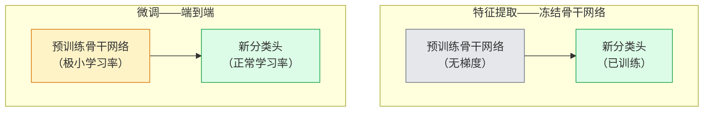

# 迁移学习与微调（Transfer Learning & Fine-Tuning）

> 别人已经花了一百万 GPU 小时教会一个网络认识边缘、纹理和物体部件。在你训练自己的模型之前，应该先把这批特征借过来用。

**Type:** Build
**Languages:** Python
**Prerequisites:** Phase 4 Lesson 03 (CNNs), Phase 4 Lesson 04 (Image Classification)
**Time:** ~75 minutes

## 学习目标（Learning Objectives）

- 区分特征提取（feature extraction）与微调（fine-tuning），并根据数据集规模、领域差距和算力预算做出正确选择
- 加载一个预训练骨干网络，替换其分类头，用不到 20 行代码只训练分类头，得到一个可用的基线
- 用判别式学习率（discriminative learning rates）渐进解冻各层，让早期的通用特征比后期的任务特定特征获得更小的更新
- 诊断三种常见失败：解冻块上学习率过高导致的特征漂移、小数据集上 BN 统计量的崩塌，以及灾难性遗忘（catastrophic forgetting）

## 问题背景（The Problem）

在 ImageNet 上训练一个 ResNet-50 大约要花 2,000 个 GPU 小时。很少有团队对每个要交付的任务都有这种预算。几乎所有团队真正交付的东西，是一个预训练骨干网络加上一个在几百到几千张任务相关图像上训练的新分类头。

这不是走捷径。任何在 ImageNet 上训练过的 CNN，第一个卷积块学到的都是边缘和类 Gabor 滤波器；接下来的几个块学习纹理和简单图案；中间的块学习物体部件；最后的块学习那些开始像 1,000 个 ImageNet 类别组合的特征。这个层级的前 90% 几乎原封不动地迁移到医学影像、工业检测、卫星数据以及其他所有视觉任务上——因为自然界中边缘和纹理的词汇本来就有限。最后 10% 才是你真正要训练的部分。

想把迁移做对，有三个坑在等着你：用过高的学习率摧毁预训练特征；冻结得太多让模型信息不足；以及让 BatchNorm 的滑动统计量漂移到一个网络其余部分从未学习过的小数据集上。本节课会故意把每个坑都走一遍。

## 核心概念（The Concept）

### 特征提取与微调（Feature extraction vs fine-tuning）

两种模式，如何选择取决于你对预训练特征的信任程度，以及你有多少数据。



经验法则：

| 数据集规模 | 领域差距 | 配方 |
|--------------|-----------------|--------|
| 少于 1k 张图像 | 接近 ImageNet | 冻结骨干网络，只训练分类头 |
| 1k-10k | 接近 | 冻结前 2-3 个 stage，微调其余部分 |
| 10k-100k | 任意 | 用判别式学习率做端到端微调 |
| 100k 以上 | 遥远 | 全部微调；领域差距足够大时，可以考虑从头训练 |

“接近 ImageNet”大致指拍摄内容像普通物体的自然 RGB 照片。医学 CT 扫描、俯视卫星图像和显微图像属于远域——特征仍然有帮助，但你需要让更多层参与适配。

### 冻结为什么有效（Why freezing works at all）

CNN 学到的 ImageNet 特征并不是专门针对那 1,000 个类别的，而是专门针对自然图像的统计特性：特定方向的边缘、纹理、对比度模式、形状基元。这些统计特性在几乎所有人类叫得出名字的视觉领域中都保持稳定。正因如此，一个在 ImageNet 上训练的模型，仅仅换上一个新的线性头在 CIFAR-10 上做零样本评估（完全不微调骨干网络），就能达到 80% 以上的准确率。线性头学习的只是：在已经学到的特征里，为这个任务挑选哪些特征、各给多大权重。

### 判别式学习率（Discriminative learning rates）

一旦开始解冻，早期的层就应该比后面的层训练得更慢。早期层编码的是你想保留的通用特征；后期层编码的是你必须大幅调整的任务特定结构。

```
Typical recipe:

  stage 0 (stem + first group): lr = base_lr / 100    (mostly fixed)
  stage 1:                       lr = base_lr / 10
  stage 2:                       lr = base_lr / 3
  stage 3 (last backbone group): lr = base_lr
  head:                          lr = base_lr  (or slightly higher)
```

在 PyTorch 里，这不过是传给优化器的一个参数组列表。一个模型，五个学习率，零额外代码。

### BatchNorm 问题（The BatchNorm problem）

BN 层保存着 `running_mean` 和 `running_var` 两个缓冲区，它们是在 ImageNet 上计算出来的。如果你的任务像素分布不同——光照不同、传感器不同、色彩空间不同——这些缓冲区就是错的。按优先级排列，有三种选择：

1. **在 train 模式下微调 BN。** 让 BN 与其他参数一起更新滑动统计量。任务数据集中等规模（>= 5k 样本）时的默认选择。
2. **在 eval 模式下冻结 BN。** 保留 ImageNet 统计量，只训练权重。当数据集小到 BN 的滑动平均会充满噪声时，这是正确做法。
3. **用 GroupNorm 替换 BN。** 彻底消除滑动平均问题。检测和分割骨干网络常这么做，因为那里每张 GPU 上的 batch size 很小。

这件事搞错了，会不动声色地拉低 5-15% 的准确率。

### 分类头设计（Head design）

分类头由 1-3 个线性层加上可选的 dropout 组成。每个 torchvision 骨干网络都自带一个默认分类头，你要做的就是替换它：

```
backbone.fc = nn.Linear(backbone.fc.in_features, num_classes)          # ResNet
backbone.classifier[1] = nn.Linear(..., num_classes)                    # EfficientNet, MobileNet
backbone.heads.head = nn.Linear(..., num_classes)                       # torchvision ViT
```

对小数据集来说，单个线性层通常就够用了。当任务分布离骨干网络的训练分布较远时，加一个隐藏层（Linear -> ReLU -> Dropout -> Linear）才有帮助。

### 逐层学习率衰减（Layer-wise LR decay）

判别式学习率有一个更平滑的版本，用于现代微调（BEiT、DINOv2、ViT-B 微调）。它不把层分组成 stage，而是让每一层的学习率都比上一层略小一点：

```
lr_layer_k = base_lr * decay^(L - k)
```

取 decay = 0.75、L = 12 个 transformer 块时，第一个块以分类头学习率的 `0.75^11 ≈ 0.04x` 训练。这对 transformer 微调比对 CNN 更要紧；对 CNN 来说，按 stage 分组的学习率通常已经够用。

### 应该评估什么（What to evaluate）

迁移学习实验需要跟踪两个从头训练时不会去跟踪的数字：

- **仅预训练准确率**——骨干网络冻结时分类头的准确率。这是你的下限。
- **微调后准确率**——同一个模型经过端到端训练后的准确率。这是你的上限。

如果微调后反而低于仅预训练，说明你有一个学习率或 BN 上的 bug。两个数字都要打印出来。

```figure
transfer-learning
```

## 动手构建（Build It）

### 步骤 1：加载预训练骨干网络并检查它（Step 1: Load a pretrained backbone and inspect it）

```python
import torch
import torch.nn as nn
from torchvision.models import resnet18, ResNet18_Weights

backbone = resnet18(weights=ResNet18_Weights.IMAGENET1K_V1)
print(backbone)
print()
print("classifier head:", backbone.fc)
print("feature dim:", backbone.fc.in_features)
```

`ResNet18` 有四个 stage（`layer1..layer4`），外加一个 stem 和一个 `fc` 分类头。每个 torchvision 分类骨干网络都有类似的结构。

### 步骤 2：特征提取——冻结全部，替换分类头（Step 2: Feature extraction — freeze everything, replace the head）

```python
def make_feature_extractor(num_classes=10):
    model = resnet18(weights=ResNet18_Weights.IMAGENET1K_V1)
    for p in model.parameters():
        p.requires_grad = False
    model.fc = nn.Linear(model.fc.in_features, num_classes)
    return model

model = make_feature_extractor(num_classes=10)
trainable = sum(p.numel() for p in model.parameters() if p.requires_grad)
frozen = sum(p.numel() for p in model.parameters() if not p.requires_grad)
print(f"trainable: {trainable:>10,}")
print(f"frozen:    {frozen:>10,}")
```

只有 `model.fc` 可训练。骨干网络就是一个冻结的特征提取器。

### 步骤 3：判别式微调（Step 3: Discriminative fine-tuning）

一个工具函数，按 stage 构建带专属学习率的参数组。

```python
def discriminative_param_groups(model, base_lr=1e-3, decay=0.3):
    stages = [
        ["conv1", "bn1"],
        ["layer1"],
        ["layer2"],
        ["layer3"],
        ["layer4"],
        ["fc"],
    ]
    groups = []
    for i, names in enumerate(stages):
        lr = base_lr * (decay ** (len(stages) - 1 - i))
        params = [p for n, p in model.named_parameters()
                  if any(n.startswith(k) for k in names)]
        if params:
            groups.append({"params": params, "lr": lr, "name": "_".join(names)})
    return groups

model = resnet18(weights=ResNet18_Weights.IMAGENET1K_V1)
model.fc = nn.Linear(model.fc.in_features, 10)
for p in model.parameters():
    p.requires_grad = True

groups = discriminative_param_groups(model)
for g in groups:
    print(f"{g['name']:>10s}  lr={g['lr']:.2e}  params={sum(p.numel() for p in g['params']):>8,}")
```

`decay=0.3` 表示每个 stage 以下一个 stage 30% 的速率训练。`fc` 拿到 `base_lr`，`layer4` 拿到 `0.3 * base_lr`，`conv1` 拿到 `0.3^5 * base_lr ≈ 0.00243 * base_lr`。听起来很极端；但经验上确实管用。

### 步骤 4：BatchNorm 处理（Step 4: BatchNorm handling）

一个辅助函数：冻结 BN 的滑动统计量，但不冻结它的权重。

```python
def freeze_bn_stats(model):
    for m in model.modules():
        if isinstance(m, (nn.BatchNorm1d, nn.BatchNorm2d, nn.BatchNorm3d)):
            m.eval()
            for p in m.parameters():
                p.requires_grad = False
    return model
```

在每个 epoch 开始、设置 `model.train()` 之后调用它。`model.train()` 会把所有模块切到训练模式；这个函数只把 BN 层切回去。

### 步骤 5：一个最小的端到端微调循环（Step 5: A minimal end-to-end fine-tuning loop）

```python
from torch.optim import SGD
from torch.utils.data import DataLoader
from torch.optim.lr_scheduler import CosineAnnealingLR
import torch.nn.functional as F

def fine_tune(model, train_loader, val_loader, device, epochs=5, base_lr=1e-3, freeze_bn=False):
    model = model.to(device)
    groups = discriminative_param_groups(model, base_lr=base_lr)
    optimizer = SGD(groups, momentum=0.9, weight_decay=1e-4, nesterov=True)
    scheduler = CosineAnnealingLR(optimizer, T_max=epochs)

    for epoch in range(epochs):
        model.train()
        if freeze_bn:
            freeze_bn_stats(model)
        tr_loss, tr_correct, tr_total = 0.0, 0, 0
        for x, y in train_loader:
            x, y = x.to(device), y.to(device)
            logits = model(x)
            loss = F.cross_entropy(logits, y, label_smoothing=0.1)
            optimizer.zero_grad()
            loss.backward()
            optimizer.step()
            tr_loss += loss.item() * x.size(0)
            tr_total += x.size(0)
            tr_correct += (logits.argmax(-1) == y).sum().item()
        scheduler.step()

        model.eval()
        va_total, va_correct = 0, 0
        with torch.no_grad():
            for x, y in val_loader:
                x, y = x.to(device), y.to(device)
                pred = model(x).argmax(-1)
                va_total += x.size(0)
                va_correct += (pred == y).sum().item()
        print(f"epoch {epoch}  train {tr_loss/tr_total:.3f}/{tr_correct/tr_total:.3f}  "
              f"val {va_correct/va_total:.3f}")
    return model
```

按上面的配方在 CIFAR-10 上跑五个 epoch，能把 `ResNet18-IMAGENET1K_V1` 从约 70% 的零样本线性探测（linear probe）准确率拉到约 93% 的微调准确率。如果完全不碰骨干网络，只训练分类头，它会在 86% 左右就停滞不前。

### 步骤 6：渐进式解冻（Step 6: Progressive unfreezing）

一个从末端向开端、每个 epoch 解冻一个 stage 的调度。以多花几个 epoch 为代价缓解特征漂移。

```python
def progressive_unfreeze_schedule(model):
    stages = ["layer4", "layer3", "layer2", "layer1"]
    yielded = set()

    def start():
        for p in model.parameters():
            p.requires_grad = False
        for p in model.fc.parameters():
            p.requires_grad = True

    def unfreeze(epoch):
        if epoch < len(stages):
            name = stages[epoch]
            yielded.add(name)
            for n, p in model.named_parameters():
                if n.startswith(name):
                    p.requires_grad = True
            return name
        return None

    return start, unfreeze
```

在第一个 epoch 之前调用一次 `start()`，在每个 epoch 开始时调用 `unfreeze(epoch)`。只要可训练参数的集合发生变化，就重建优化器；否则被冻结的参数仍持有缓存的动量，会干扰优化器。

## 直接使用（Use It）

对大多数真实任务来说，`torchvision.models` 加三行代码就够了。上面那套更重的机制，只在你撞上库默认行为解决不了的问题时才派上用场。

```python
from torchvision.models import resnet50, ResNet50_Weights

model = resnet50(weights=ResNet50_Weights.IMAGENET1K_V2)
model.fc = nn.Linear(model.fc.in_features, num_classes)
optimizer = torch.optim.AdamW(model.parameters(), lr=1e-4, weight_decay=1e-4)
```

另外两个生产级默认选择：

- `timm` 提供约 800 个 API 统一的预训练视觉骨干网络（`timm.create_model("resnet50", pretrained=True, num_classes=10)`）。对 torchvision 模型库之外的任何微调，它都是标准选择。
- 对 transformer 来说，`transformers.AutoModelForImageClassification.from_pretrained(name, num_labels=N)` 用与文本模型相同的加载语义，给你 ViT / BEiT / DeiT。

## 交付产物（Ship It）

本节课产出：

- `outputs/prompt-fine-tune-planner.md`——一个提示词，根据数据集规模、领域差距和算力预算，在特征提取、渐进式微调和端到端微调之间做选择。
- `outputs/skill-freeze-inspector.md`——一个技能，给定一个 PyTorch 模型，报告哪些参数可训练、哪些 BatchNorm 层处于 eval 模式，以及优化器是否真的拿到了可训练参数。

## 练习（Exercises）

1. **（简单）**把同一个 `ResNet18` 分别作为线性探测（冻结骨干网络）和完整微调，在同一个合成 CIFAR 数据集上训练。并排报告两种准确率。解释哪个差距说明特征迁移良好，哪个差距说明迁移不佳。
2. **（中等）**故意引入一个 bug：把 `base_lr = 1e-1` 设置在骨干网络 stage 上而不是分类头上。展示训练损失爆炸，然后应用 `discriminative_param_groups` 辅助函数把它救回来。记录每个 stage 开始发散的学习率。
3. **（困难）**选一个医学影像数据集（例如 CheXpert-small、PatchCamelyon 或 HAM10000），比较三种模式：(a) ImageNet 预训练 + 冻结骨干网络 + 线性头；(b) ImageNet 预训练端到端微调；(c) 从头训练。分别报告准确率和计算成本。数据集规模到多大时，从头训练才变得有竞争力？

## 关键术语（Key Terms）

| 术语 | 人们常说 | 实际含义 |
|------|----------------|----------------------|
| 特征提取（feature extraction） | “冻结并训练分类头” | 骨干网络参数冻结，只有新的分类头接收梯度 |
| 微调（fine-tuning） | “端到端重训” | 所有参数可训练，学习率通常远小于从头训练 |
| 判别式学习率（discriminative LR） | “早期层用更小的学习率” | 优化器参数组：早期 stage 的学习率是后期 stage 的一个分数 |
| 逐层学习率衰减（layer-wise LR decay） | “平滑的学习率梯度” | 每层学习率乘以 decay^(L - k)；在 transformer 微调中很常见 |
| 灾难性遗忘（catastrophic forgetting） | “模型把 ImageNet 忘了” | 过高的学习率在新任务信号学进来之前就覆盖了预训练特征 |
| BN 统计量漂移（BN statistics drift） | “滑动均值不对了” | BatchNorm 的 running_mean/var 是在与当前任务不同的分布上算出来的，悄悄损害准确率 |
| 线性探测（linear probe） | “冻结骨干网络 + 线性头” | 对预训练特征的评估——冻结表示之上最佳线性分类器的准确率 |
| 灾难性崩塌（catastrophic collapse） | “全都预测成同一个类” | 发生在学习率高到在来自分类头的梯度能稳住局面之前就摧毁特征时 |

## 延伸阅读（Further Reading）

- [How transferable are features in deep neural networks? (Yosinski et al., 2014)](https://arxiv.org/abs/1411.1792) —— 首篇量化各层特征可迁移性的论文
- [Universal Language Model Fine-tuning (ULMFiT, Howard & Ruder, 2018)](https://arxiv.org/abs/1801.06146) —— 判别式学习率 / 渐进式解冻配方的出处；这些思想可以直接迁移到视觉领域
- [timm 文档](https://huggingface.co/docs/timm) —— 现代视觉骨干网络及其训练时所用微调默认值的参考手册
- [A Simple Framework for Linear-Probe Evaluation (Kornblith et al., 2019)](https://arxiv.org/abs/1805.08974) —— 线性探测准确率为什么重要，以及如何正确报告它
