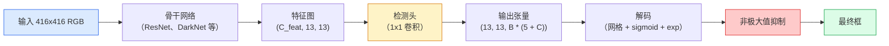

# 目标检测——从零实现 YOLO（Object Detection — YOLO from Scratch）

> 检测就是分类加上回归，在特征图的每个位置上各跑一次，再用非极大值抑制（non-maximum suppression）清理结果。

**Type:** Build
**Languages:** Python
**Prerequisites:** Phase 4 Lesson 03 (CNNs), Phase 4 Lesson 04 (Image Classification), Phase 4 Lesson 05 (Transfer Learning)
**Time:** ~75 minutes

## 学习目标（Learning Objectives）

- 解释把检测变成稠密预测问题的网格加锚框（anchor）设计，并说清输出张量里每个数字的含义
- 计算框与框之间的交并比（IoU），并从零实现非极大值抑制（NMS）
- 在预训练骨干网络之上搭建一个最小的 YOLO 风格检测头，包括分类损失、objectness 损失和框回归损失
- 读懂一行检测指标（precision@0.5、recall、mAP@0.5、mAP@0.5:0.95），并决定下一步该调哪个旋钮

## 问题背景（The Problem）

分类说“这张图里有一只狗”。检测说“像素 (112, 40, 280, 210) 处有一只狗，(400, 180, 560, 310) 处有一只猫，画面里没有别的东西了”。就是这一个结构性变化——从每张图一个标签，变成预测数量不定的带标签框——支撑起了每一个自动驾驶系统、每一个安防产品、每一个文档版面解析器、每一条工厂视觉产线。

检测也是视觉领域所有工程权衡同时现身的地方。你想要框得准（回归头），想给每个框配上正确的类别（分类头），想让模型知道什么时候没东西可检（objectness 分数），还想让每个真实物体只对应一个预测（非极大值抑制）。任何一环缺失，流水线要么漏检，要么报出幻觉框，要么把同一个物体在略有差异的位置上预测十五次。

YOLO（You Only Look Once，Redmon et al. 2016）让这一切靠单次前向传播实时跑了起来，而它做出的那些结构性决策，至今仍是现代检测器（YOLOv8、YOLOv9、YOLO-NAS、RT-DETR）的骨干。学会这个核心，之后每个变体都只是同一套零件的重新排列。

## 核心概念（The Concept）

### 检测即稠密预测（Detection as dense prediction）

分类器对每张图输出 C 个数。YOLO 风格检测器对每张图输出 `(S x S x (5 + C))` 个数，其中 S 是空间网格尺寸。



`S * S` 个网格单元各自预测 `B` 个框。每个框：

- 4 个数描述几何：`tx, ty, tw, th`。
- 1 个数是 objectness 分数：“这个单元的中心处有没有物体？”
- C 个数是类别概率。

每个单元合计 `B * (5 + C)` 个数。对 VOC 来说，取 `S=13, B=2, C=20`，就是每个单元 50 个数。

### 为什么需要网格和锚框（Why grids and anchors）

朴素回归会为每个物体预测绝对坐标 `(x, y, w, h)`。这对卷积网络来说很难：平移图像不应该让所有预测平移同样的量——每个物体在空间上是锚定的。网格给出的答案是：把每个真值框分配给它中心所在的网格单元；只有那个单元对这个物体负责。

锚框解决第二个问题。一个 3x3 卷积很难从感受野只有 16 像素的特征单元里回归出 500 像素宽的框。于是我们为每个单元预定义 `B` 个先验框形状（锚框），从每个锚框出发只预测小的偏移量。模型学的是挑对锚框然后微调，而不是从零开始回归。

```
Anchor box priors (example for 416x416 input):

  small:   (30,  60)
  medium:  (75,  170)
  large:   (200, 380)

At each grid cell, every anchor emits (tx, ty, tw, th, obj, c_1, ..., c_C).
```

现代检测器常配合 FPN 使用，不同分辨率配不同的锚框集合——浅层高分辨率图上放小锚框，深层低分辨率图上放大锚框。思路相同，尺度更多。

### 解码预测（Decoding predictions）

原始的 `tx, ty, tw, th` 并不是框坐标；它们是要先变换才能画出来的回归目标：

```
centre x  = (sigmoid(tx) + cell_x) * stride
centre y  = (sigmoid(ty) + cell_y) * stride
width     = anchor_w * exp(tw)
height    = anchor_h * exp(th)
```

`sigmoid` 把中心偏移限制在单元内部。`exp` 让宽度可以相对锚框自由缩放而不需要翻转符号。`stride` 把网格坐标缩放回像素。自 v2 起，所有 YOLO 版本的解码步骤都是这一套。

### 交并比（IoU）

检测中通用的框相似度度量：

```
IoU(A, B) = area(A intersect B) / area(A union B)
```

IoU = 1 表示完全重合；IoU = 0 表示毫无重叠。预测框与真值框之间的 IoU 决定一个预测算不算真正例（通常要求 IoU >= 0.5）。两个预测框之间的 IoU 则是 NMS 用来去重的依据。

### 非极大值抑制（Non-maximum suppression）

在相邻锚框上训练出来的卷积网络，常常对同一个物体预测出多个相互重叠的框。NMS 保留置信度最高的那个预测，删掉所有与它 IoU 超过阈值的预测。

```
NMS(boxes, scores, iou_threshold):
    sort boxes by score descending
    keep = []
    while boxes not empty:
        pick the top-scoring box, add to keep
        remove every box with IoU > iou_threshold to the picked box
    return keep
```

典型阈值：目标检测用 0.45。新近的检测器用 `soft-NMS`、`DIoU-NMS` 替代标准 NMS，或者直接学习抑制（RT-DETR），但结构上的目的是一样的。

### 损失（The loss）

YOLO 损失是三个带权重的损失之和：

```
L = lambda_coord * L_box(pred, target, where obj=1)
  + lambda_obj   * L_obj(pred, 1,     where obj=1)
  + lambda_noobj * L_obj(pred, 0,     where obj=0)
  + lambda_cls   * L_cls(pred, target, where obj=1)
```

只有包含物体的单元才对框回归损失和分类损失有贡献。不含物体的单元只对 objectness 损失有贡献（教模型保持沉默）。`lambda_noobj` 通常很小（约 0.5），因为绝大多数单元是空的，否则它们会主导总损失。

现代变体把 MSE 框损失换成 CIoU / DIoU（直接优化 IoU），用 focal loss 处理类别不平衡，并用 quality focal loss 平衡 objectness。三分量结构没有变。

### 检测指标（Detection metrics）

准确率这个指标迁移不到检测上。真正有用的是四个数字：

- **Precision@IoU=0.5**——被算作正例的预测里，有多少真的是对的。
- **Recall@IoU=0.5**——真实物体里，我们找到了多少。
- **AP@0.5**——IoU 阈值取 0.5 时的 PR 曲线下面积；每个类别各一个数。
- **mAP@0.5:0.95**——IoU 阈值取 0.5, 0.55, ..., 0.95 时 AP 的平均值。这是 COCO 指标；最严格，也最有信息量。

四个都要报告。一个 mAP@0.5 很强但 mAP@0.5:0.95 很弱的检测器，定位得粗但不精；用更好的框回归损失来修。一个高精度低召回的检测器过于保守；调低置信度阈值或加大 objectness 权重。

```figure
object-detection-nms
```

## 动手构建（Build It）

### 步骤 1：IoU（Step 1: IoU）

整节课的主力工具。输入两个 `(x1, y1, x2, y2)` 格式的框数组。

```python
import numpy as np

def box_iou(boxes_a, boxes_b):
    ax1, ay1, ax2, ay2 = boxes_a[:, 0], boxes_a[:, 1], boxes_a[:, 2], boxes_a[:, 3]
    bx1, by1, bx2, by2 = boxes_b[:, 0], boxes_b[:, 1], boxes_b[:, 2], boxes_b[:, 3]

    inter_x1 = np.maximum(ax1[:, None], bx1[None, :])
    inter_y1 = np.maximum(ay1[:, None], by1[None, :])
    inter_x2 = np.minimum(ax2[:, None], bx2[None, :])
    inter_y2 = np.minimum(ay2[:, None], by2[None, :])

    inter_w = np.clip(inter_x2 - inter_x1, 0, None)
    inter_h = np.clip(inter_y2 - inter_y1, 0, None)
    inter = inter_w * inter_h

    area_a = (ax2 - ax1) * (ay2 - ay1)
    area_b = (bx2 - bx1) * (by2 - by1)
    union = area_a[:, None] + area_b[None, :] - inter
    return inter / np.clip(union, 1e-8, None)
```

返回一个 `(N_a, N_b)` 的两两 IoU 矩阵。要对着单个真值框使用，把其中一个数组做成 `(1, 4)` 形状即可。

### 步骤 2：非极大值抑制（Step 2: Non-max suppression）

```python
def nms(boxes, scores, iou_threshold=0.45):
    order = np.argsort(-scores)
    keep = []
    while len(order) > 0:
        i = order[0]
        keep.append(i)
        if len(order) == 1:
            break
        rest = order[1:]
        ious = box_iou(boxes[[i]], boxes[rest])[0]
        order = rest[ious <= iou_threshold]
    return np.array(keep, dtype=np.int64)
```

确定性算法，复杂度来自排序的 `O(N log N)`，在相同输入下与 `torchvision.ops.nms` 行为一致。

### 步骤 3：框的编码与解码（Step 3: Box encoding and decoding）

在像素坐标和网络真正回归的 `(tx, ty, tw, th)` 目标之间来回转换。

```python
def encode(box_xyxy, cell_x, cell_y, stride, anchor_wh):
    x1, y1, x2, y2 = box_xyxy
    cx = 0.5 * (x1 + x2)
    cy = 0.5 * (y1 + y2)
    w = x2 - x1
    h = y2 - y1
    tx = cx / stride - cell_x
    ty = cy / stride - cell_y
    tw = np.log(w / anchor_wh[0] + 1e-8)
    th = np.log(h / anchor_wh[1] + 1e-8)
    return np.array([tx, ty, tw, th])


def decode(tx_ty_tw_th, cell_x, cell_y, stride, anchor_wh):
    tx, ty, tw, th = tx_ty_tw_th
    cx = (sigmoid(tx) + cell_x) * stride
    cy = (sigmoid(ty) + cell_y) * stride
    w = anchor_wh[0] * np.exp(tw)
    h = anchor_wh[1] * np.exp(th)
    return np.array([cx - w / 2, cy - h / 2, cx + w / 2, cy + h / 2])


def sigmoid(x):
    return 1.0 / (1.0 + np.exp(-x))
```

测试：先编码一个框再解码——你应该拿回一个与原框非常接近的结果（唯一的差别来自 `tx` 超出 sigmoid 后的取值范围时，sigmoid 的逆并非完全可逆）。

### 步骤 4：一个最小的 YOLO 检测头（Step 4: A minimal YOLO head）

特征图上的一个 1x1 卷积，重排成 `(B, S, S, num_anchors, 5 + C)`。

```python
import torch
import torch.nn as nn

class YOLOHead(nn.Module):
    def __init__(self, in_c, num_anchors, num_classes):
        super().__init__()
        self.num_anchors = num_anchors
        self.num_classes = num_classes
        self.conv = nn.Conv2d(in_c, num_anchors * (5 + num_classes), kernel_size=1)

    def forward(self, x):
        n, _, h, w = x.shape
        y = self.conv(x)
        y = y.view(n, self.num_anchors, 5 + self.num_classes, h, w)
        y = y.permute(0, 3, 4, 1, 2).contiguous()
        return y
```

输出形状：`(N, H, W, num_anchors, 5 + C)`。最后一个维度装着 `[tx, ty, tw, th, obj, cls_0, ..., cls_{C-1}]`。

### 步骤 5：真值分配（Step 5: Ground-truth assignment）

对每个真值框，决定由哪个 `(cell, anchor)` 负责。

```python
def assign_targets(boxes_xyxy, classes, anchors, stride, grid_size, num_classes):
    num_anchors = len(anchors)
    target = np.zeros((grid_size, grid_size, num_anchors, 5 + num_classes), dtype=np.float32)
    has_obj = np.zeros((grid_size, grid_size, num_anchors), dtype=bool)

    for box, cls in zip(boxes_xyxy, classes):
        x1, y1, x2, y2 = box
        cx, cy = 0.5 * (x1 + x2), 0.5 * (y1 + y2)
        gx, gy = int(cx / stride), int(cy / stride)
        bw, bh = x2 - x1, y2 - y1

        ious = np.array([
            (min(bw, aw) * min(bh, ah)) / (bw * bh + aw * ah - min(bw, aw) * min(bh, ah))
            for aw, ah in anchors
        ])
        best = int(np.argmax(ious))
        aw, ah = anchors[best]

        target[gy, gx, best, 0] = cx / stride - gx
        target[gy, gx, best, 1] = cy / stride - gy
        target[gy, gx, best, 2] = np.log(bw / aw + 1e-8)
        target[gy, gx, best, 3] = np.log(bh / ah + 1e-8)
        target[gy, gx, best, 4] = 1.0
        target[gy, gx, best, 5 + cls] = 1.0
        has_obj[gy, gx, best] = True
    return target, has_obj
```

锚框选择采用“与真值形状 IoU 最大”——一个廉价的代理策略，与 YOLOv2/v3 的分配方式一致。v5 及以后使用更精细的策略（task-aligned matching、动态 k），但都是对同一思想的改良。

### 步骤 6：三个损失（Step 6: The three losses）

```python
def yolo_loss(pred, target, has_obj, lambda_coord=5.0, lambda_obj=1.0, lambda_noobj=0.5, lambda_cls=1.0):
    has_obj_t = torch.from_numpy(has_obj).bool()
    target_t = torch.from_numpy(target).float()

    # box-regression loss: only on cells with objects
    box_pred = pred[..., :4][has_obj_t]
    box_true = target_t[..., :4][has_obj_t]
    loss_box = torch.nn.functional.mse_loss(box_pred, box_true, reduction="sum")

    # objectness loss
    obj_pred = pred[..., 4]
    obj_true = target_t[..., 4]
    loss_obj_pos = torch.nn.functional.binary_cross_entropy_with_logits(
        obj_pred[has_obj_t], obj_true[has_obj_t], reduction="sum")
    loss_obj_neg = torch.nn.functional.binary_cross_entropy_with_logits(
        obj_pred[~has_obj_t], obj_true[~has_obj_t], reduction="sum")

    # classification loss on cells with objects
    cls_pred = pred[..., 5:][has_obj_t]
    cls_true = target_t[..., 5:][has_obj_t]
    loss_cls = torch.nn.functional.binary_cross_entropy_with_logits(
        cls_pred, cls_true, reduction="sum")

    total = (lambda_coord * loss_box
             + lambda_obj * loss_obj_pos
             + lambda_noobj * loss_obj_neg
             + lambda_cls * loss_cls)
    return total, {"box": loss_box.item(), "obj_pos": loss_obj_pos.item(),
                   "obj_neg": loss_obj_neg.item(), "cls": loss_cls.item()}
```

五个超参数，每篇 YOLO 教程要么把它们硬编码，要么扫一遍。重要的是比例：`lambda_coord=5, lambda_noobj=0.5` 沿用了原始 YOLOv1 论文的设定，至今仍是合理的默认值。

### 步骤 7：推理流水线（Step 7: Inference pipeline）

解码检测头的原始输出，施加 sigmoid/exp，按 objectness 过阈值，最后做 NMS。

```python
def postprocess(pred_tensor, anchors, stride, img_size, conf_threshold=0.25, iou_threshold=0.45):
    pred = pred_tensor.detach().cpu().numpy()
    grid_h, grid_w = pred.shape[1], pred.shape[2]
    num_anchors = len(anchors)

    boxes, scores, classes = [], [], []
    for gy in range(grid_h):
        for gx in range(grid_w):
            for a in range(num_anchors):
                tx, ty, tw, th, obj, *cls = pred[0, gy, gx, a]
                score = sigmoid(obj) * sigmoid(np.array(cls)).max()
                if score < conf_threshold:
                    continue
                cls_idx = int(np.argmax(cls))
                cx = (sigmoid(tx) + gx) * stride
                cy = (sigmoid(ty) + gy) * stride
                w = anchors[a][0] * np.exp(tw)
                h = anchors[a][1] * np.exp(th)
                boxes.append([cx - w / 2, cy - h / 2, cx + w / 2, cy + h / 2])
                scores.append(float(score))
                classes.append(cls_idx)

    if not boxes:
        return np.zeros((0, 4)), np.zeros((0,)), np.zeros((0,), dtype=int)
    boxes = np.array(boxes)
    scores = np.array(scores)
    classes = np.array(classes)
    keep = nms(boxes, scores, iou_threshold)
    return boxes[keep], scores[keep], classes[keep]
```

这就是完整的评估链路：检测头 -> 解码 -> 过阈值 -> NMS。

## 直接使用（Use It）

`torchvision.models.detection` 自带概念结构相同的生产级检测器。加载一个预训练模型只要三行。

```python
import torch
from torchvision.models.detection import fasterrcnn_resnet50_fpn_v2

model = fasterrcnn_resnet50_fpn_v2(weights="DEFAULT")
model.eval()
with torch.no_grad():
    predictions = model([torch.randn(3, 400, 600)])
print(predictions[0].keys())
print(f"boxes:  {predictions[0]['boxes'].shape}")
print(f"scores: {predictions[0]['scores'].shape}")
print(f"labels: {predictions[0]['labels'].shape}")
```

对实时推理流水线来说，`ultralytics`（YOLOv8/v9）是标准选择：`from ultralytics import YOLO; model = YOLO('yolov8n.pt'); model(img)`。模型在内部完成解码和 NMS，返回的正是你上面亲手搭过的 `boxes / scores / labels` 三件套。

## 交付产物（Ship It）

本节课产出：

- `outputs/prompt-detection-metric-reader.md`——一个提示词，把一行 `precision, recall, AP, mAP@0.5:0.95` 指标变成一句诊断，以及接下来最值得做的一个实验。
- `outputs/skill-anchor-designer.md`——一个技能，给定一个真值框数据集，对 `(w, h)` 跑 k-means，返回每个 FPN 层级的锚框集合，以及挑选锚框数量所需的覆盖率统计。

## 练习（Exercises）

1. **（简单）**实现 `box_iou`，在 1,000 对随机框上与 `torchvision.ops.box_iou` 对拍。验证最大绝对差低于 `1e-6`。
2. **（中等）**把 `yolo_loss` 移植成用 `CIoU` 框损失代替 MSE 的版本。在一个 100 张图的合成数据集上证明：在相同 epoch 数下，CIoU 收敛到比 MSE 更好的最终 mAP@0.5:0.95。
3. **（困难）**实现多尺度推理：把同一张图按三种分辨率喂进模型，合并所有框预测，最后跑一次 NMS。在留出集上测量相比单尺度推理的 mAP 提升。

## 关键术语（Key Terms）

| 术语 | 人们常说 | 实际含义 |
|------|----------------|----------------------|
| 锚框（anchor） | “框先验” | 每个网格单元处预定义的框形状，网络预测相对它的偏移而不是绝对坐标 |
| IoU | “重叠度” | 两个框的交并比；检测中通用的相似度度量 |
| NMS | “去重” | 贪心算法：保留分数最高的预测，删除与它重叠超过阈值的其余预测 |
| Objectness | “这里有没有东西” | 每锚框、每单元一个标量，预测该单元中心处是否有物体 |
| Grid stride | “下采样倍数” | 每个网格单元对应多少像素；416 像素输入配 13 网格的检测头，stride 就是 32 |
| mAP | “平均精度的均值” | PR 曲线下面积的平均值，先对类别、再（对 COCO 而言）对 IoU 阈值求平均 |
| AP@0.5 | “PASCAL VOC AP” | IoU 阈值取 0.5 的平均精度；指标里宽松的版本 |
| mAP@0.5:0.95 | “COCO AP” | 对 IoU 阈值 0.5..0.95、步长 0.05 取平均；严格版本，也是当前社区标准 |

## 延伸阅读（Further Reading）

- [YOLOv1: You Only Look Once (Redmon et al., 2016)](https://arxiv.org/abs/1506.02640) —— 开山之作；此后每个 YOLO 版本都是对这一结构的改良
- [YOLOv3 (Redmon & Farhadi, 2018)](https://arxiv.org/abs/1804.02767) —— 引入多尺度 FPN 风格检测头的论文；图至今仍画得最清楚
- [Ultralytics YOLOv8 文档](https://docs.ultralytics.com) —— 当前的生产参考；涵盖数据集格式、数据增广和训练配方
- [目标检测图解指南（Jonathan Hui）](https://jonathan-hui.medium.com/object-detection-series-24d03a12f904) —— 对整个检测器家族最好的通俗讲解；理解 DETR、RetinaNet、FCOS 与 YOLO 之间关系的无价材料
