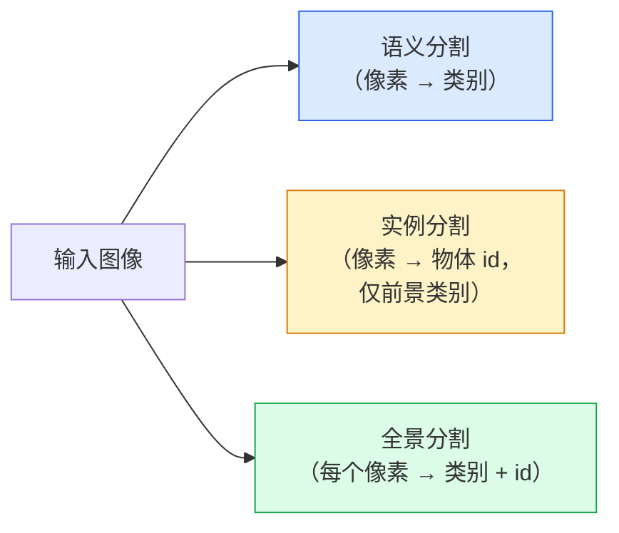
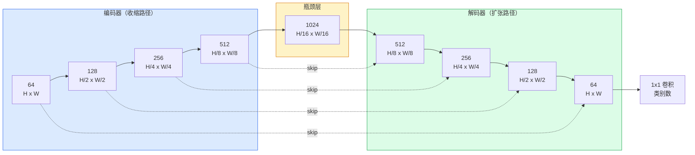

# 语义分割——U-Net（Semantic Segmentation — U-Net）

> 分割就是对每个像素做分类。U-Net 让这件事可行的办法是：一个下采样编码器配一个上采样解码器，中间用跳越连接（skip connection）把两边接起来。

**Type:** Build
**Languages:** Python
**Prerequisites:** Phase 4 Lesson 03 (CNNs), Phase 4 Lesson 04 (Image Classification)
**Time:** ~75 minutes

## 学习目标（Learning Objectives）

- 区分语义分割、实例分割和全景分割（panoptic segmentation），并为给定问题选对任务
- 用 PyTorch 从零搭建一个 U-Net：编码器块、瓶颈层、带转置卷积的解码器，以及跳越连接
- 实现逐像素交叉熵、Dice 损失，以及当前医学和工业分割默认使用的组合损失
- 读懂每个类别的 IoU 和 Dice 指标，判断糟糕的分数来自小目标召回、边界精度还是类别不平衡

## 问题背景（The Problem）

分类对每张图输出一个标签。检测对每张图输出几个框。分割对每个像素输出一个标签。对尺寸为 `H x W` 的输入，输出是形状 `H x W`（语义）或 `H x W x N_instances`（实例）的张量。这是每张图数以百万计的预测，而不是一个。

分割的这种结构，正是它能驱动几乎所有稠密预测视觉产品的原因：医学影像（肿瘤掩码）、自动驾驶（道路、车道、障碍物）、卫星（建筑轮廓、作物边界）、文档解析（版面区域）、机器人（可抓取区域）。这些任务没有一件是画个框就能解决的；它们需要精确的轮廓。

架构上的问题说出来简单，解决起来不简单：你需要网络同时看到图像的全局上下文（这是什么场景）和局部像素细节（究竟哪个像素是路面、哪个是人行道）。标准 CNN 通过空间压缩换取上下文，却把细节丢掉了。U-Net 是第一个两者兼得的设计。

## 核心概念（The Concept）

### 语义 vs 实例 vs 全景（Semantic vs instance vs panoptic）



- **语义分割**说“这个像素是道路，那个像素是汽车”。两辆紧挨着的车会融成一团。
- **实例分割**说“这个像素是 3 号车，那个像素是 5 号车”。忽略背景里的 stuff（“stuff”指天空、道路、草地这类区域）。
- **全景分割**把两者统一起来：每个像素都有类别标签，每个实例都有唯一 id，stuff 和 thing 都被分割。

本节课讲语义分割。下一课（Mask R-CNN）讲实例分割。

### U-Net 的形状（The U-Net shape）



编码器把空间分辨率减半四次，同时把通道数翻倍。解码器反过来：空间分辨率翻倍四次，通道数减半。跳越连接在每个分辨率上把对应的编码器特征与解码器特征拼接起来。最后的 1x1 卷积在全分辨率上把 `64 -> num_classes` 做映射。

为什么必须要有跳越连接：解码器在试图输出像素级预测时，见过的只是很小的特征图。没有跳越连接，它无法精确定位边缘，因为那些信息在编码器里被压缩掉了。跳越连接把编码器在下采样途中算出的高分辨率特征图直接递给它。

### 转置卷积 vs 双线性上采样（Transposed vs bilinear upsample）

解码器必须扩大空间维度。两种选择：

- **转置卷积**（`nn.ConvTranspose2d`）——可学习的上采样。历史上的 U-Net 默认。当 stride 和卷积核尺寸不能整除时，会产生棋盘伪影（checkerboard artifacts）。
- **双线性上采样 + 3x3 卷积**——先平滑上采样，再做一次卷积。伪影更少，参数更少，是现在的现代默认。

两种在真实项目里都见得到。第一个 U-Net 还是选双线性更稳。

### 像素网格上的交叉熵（Cross-entropy on a pixel grid）

对有 C 个类别的语义分割，模型输出是 `(N, C, H, W)`。目标是 `(N, H, W)` 的整数类别 ID。交叉熵与分类情形完全一样，只是施加在每一个空间位置上：

```
Loss = mean over (n, h, w) of -log( softmax(logits[n, :, h, w])[target[n, h, w]] )
```

PyTorch 的 `F.cross_entropy` 原生支持这种形状。不需要 reshape。

### Dice 损失，以及为什么需要它（Dice loss and why you need it）

交叉熵平等对待每个像素。当某个类别占满画面时（医学影像：99% 背景、1% 肿瘤），这是错的。网络可以处处预测背景，拿到 99% 的准确率，却毫无用处。

Dice 损失直接优化预测掩码与真实掩码之间的重叠来解决这一问题：

```
Dice(p, y) = 2 * sum(p * y) / (sum(p) + sum(y) + epsilon)
Dice_loss = 1 - Dice
```

其中 `p` 是某个类别的 sigmoid/softmax 概率图，`y` 是二值真值掩码。只有重叠完美时损失才为零。因为它是基于比值的，类别不平衡对它毫无影响。

实践中，用**组合损失**：

```
L = L_cross_entropy + lambda * L_dice       (lambda ~ 1)
```

交叉熵在训练早期提供稳定的梯度；Dice 把训练后期的注意力集中在真正匹配掩码形状上。这个组合是医学影像的默认做法，在任何类别不平衡的数据集上都难以被击败。

### 评估指标（Evaluation metrics）

- **像素准确率**——预测正确的像素百分比。便宜。在不平衡数据上，它和分类里的准确率一样不可靠。
- **每类 IoU**——每个类别掩码的交并比；对类别取平均就是 mIoU。
- **Dice（像素级 F1）**——与 IoU 类似；`Dice = 2 * IoU / (1 + IoU)`。医学影像圈偏好 Dice，自动驾驶圈偏好 IoU；两者单调相关。
- **边界 F1**——衡量预测边界与真值边界有多接近，即便很小的偏移也会被惩罚。对半导体检测这类高精度任务很重要。

要报告每类 IoU，而不只是 mIoU。平均 IoU 会把一个 15% 的类别藏在九个 85% 的类别后面。

### 输入分辨率的取舍（Input resolution trade-off）

U-Net 的编码器把分辨率减半四次，所以输入必须能被 16 整除。医学图像常见 512x512 或 1024x1024。自动驾驶裁剪图为 2048x1024。U-Net 的显存开销随 `H * W * C_max` 增长，在 1024x1024 输入、1024 通道瓶颈下，一次前向传播就要吃掉好几个 GB 的显存。

两个标准绕法：
1. 把输入切成小块——以重叠方式处理 256x256 的小块再拼接。
2. 用空洞卷积（dilated convolution）替换瓶颈层，保持较高的空间分辨率同时扩大感受野（DeepLab 系列）。

对第一个模型来说，256x256 输入加 64 通道基底的 U-Net 在 8 GB 显存上就能训练得很舒服。

```figure
segmentation-flood
```

## 动手构建（Build It）

### 步骤 1：编码器块（Step 1: Encoder block）

两个 3x3 卷积，各配 batch norm 和 ReLU。第一个卷积改变通道数；第二个保持不变。

```python
import torch
import torch.nn as nn
import torch.nn.functional as F

class DoubleConv(nn.Module):
    def __init__(self, in_c, out_c):
        super().__init__()
        self.net = nn.Sequential(
            nn.Conv2d(in_c, out_c, kernel_size=3, padding=1, bias=False),
            nn.BatchNorm2d(out_c),
            nn.ReLU(inplace=True),
            nn.Conv2d(out_c, out_c, kernel_size=3, padding=1, bias=False),
            nn.BatchNorm2d(out_c),
            nn.ReLU(inplace=True),
        )

    def forward(self, x):
        return self.net(x)
```

这个块在全程复用。`bias=False` 是因为 BN 的 beta 已经承担了偏置的角色。

### 步骤 2：下采样与上采样块（Step 2: Down and up blocks）

```python
class Down(nn.Module):
    def __init__(self, in_c, out_c):
        super().__init__()
        self.net = nn.Sequential(
            nn.MaxPool2d(2),
            DoubleConv(in_c, out_c),
        )

    def forward(self, x):
        return self.net(x)


class Up(nn.Module):
    def __init__(self, in_c, out_c):
        super().__init__()
        self.up = nn.Upsample(scale_factor=2, mode="bilinear", align_corners=False)
        self.conv = DoubleConv(in_c, out_c)

    def forward(self, x, skip):
        x = self.up(x)
        if x.shape[-2:] != skip.shape[-2:]:
            x = F.interpolate(x, size=skip.shape[-2:], mode="bilinear", align_corners=False)
        x = torch.cat([skip, x], dim=1)
        return self.conv(x)
```

只比较空间形状（`shape[-2:]`）的检查，是为了处理尺寸不能被 16 整除的输入：拼接之前用一次稳妥的 `F.interpolate` 把张量对齐。如果比较完整形状，通道数差异也会触发插值；而那本该是一次响亮的报错，而不是一次悄无声息的 interpolate。

### 步骤 3：U-Net 本体（Step 3: The U-Net）

```python
class UNet(nn.Module):
    def __init__(self, in_channels=3, num_classes=2, base=64):
        super().__init__()
        self.inc = DoubleConv(in_channels, base)
        self.d1 = Down(base, base * 2)
        self.d2 = Down(base * 2, base * 4)
        self.d3 = Down(base * 4, base * 8)
        self.d4 = Down(base * 8, base * 16)
        self.u1 = Up(base * 16 + base * 8, base * 8)
        self.u2 = Up(base * 8 + base * 4, base * 4)
        self.u3 = Up(base * 4 + base * 2, base * 2)
        self.u4 = Up(base * 2 + base, base)
        self.outc = nn.Conv2d(base, num_classes, kernel_size=1)

    def forward(self, x):
        x1 = self.inc(x)
        x2 = self.d1(x1)
        x3 = self.d2(x2)
        x4 = self.d3(x3)
        x5 = self.d4(x4)
        x = self.u1(x5, x4)
        x = self.u2(x, x3)
        x = self.u3(x, x2)
        x = self.u4(x, x1)
        return self.outc(x)

net = UNet(in_channels=3, num_classes=2, base=32)
x = torch.randn(1, 3, 256, 256)
print(f"output: {net(x).shape}")
print(f"params: {sum(p.numel() for p in net.parameters()):,}")
```

输出形状 `(1, 2, 256, 256)`——空间尺寸与输入相同，通道数为 `num_classes`。`base=32` 时约 7.7M 参数。

### 步骤 4：损失（Step 4: Losses）

```python
def dice_loss(logits, targets, num_classes, eps=1e-6):
    probs = F.softmax(logits, dim=1)
    targets_one_hot = F.one_hot(targets, num_classes).permute(0, 3, 1, 2).float()
    dims = (0, 2, 3)
    intersection = (probs * targets_one_hot).sum(dim=dims)
    denom = probs.sum(dim=dims) + targets_one_hot.sum(dim=dims)
    dice = (2 * intersection + eps) / (denom + eps)
    return 1 - dice.mean()


def combined_loss(logits, targets, num_classes, lam=1.0):
    ce = F.cross_entropy(logits, targets)
    dc = dice_loss(logits, targets, num_classes)
    return ce + lam * dc, {"ce": ce.item(), "dice": dc.item()}
```

Dice 逐类别计算后取平均（macro Dice）。`eps` 防止 batch 中不存在的类别导致除零。

### 步骤 5：IoU 指标（Step 5: IoU metric）

```python
@torch.no_grad()
def iou_per_class(logits, targets, num_classes):
    preds = logits.argmax(dim=1)
    ious = torch.zeros(num_classes)
    for c in range(num_classes):
        pred_c = (preds == c)
        true_c = (targets == c)
        inter = (pred_c & true_c).sum().float()
        union = (pred_c | true_c).sum().float()
        ious[c] = (inter / union) if union > 0 else torch.tensor(float("nan"))
    return ious
```

返回长度为 C 的向量。`nan` 标记 batch 中缺席的类别——计算 mIoU 时不要把它们平均进去。

### 步骤 6：用于端到端验证的合成数据集（Step 6: Synthetic dataset for end-to-end verification）

在彩色背景上生成几何形状，迫使网络学习形状而不是像素颜色。

```python
import numpy as np
from torch.utils.data import Dataset, DataLoader

def synthetic_segmentation(num_samples=200, size=64, seed=0):
    rng = np.random.default_rng(seed)
    images = np.zeros((num_samples, size, size, 3), dtype=np.float32)
    masks = np.zeros((num_samples, size, size), dtype=np.int64)
    for i in range(num_samples):
        bg = rng.uniform(0, 1, (3,))
        images[i] = bg
        masks[i] = 0
        num_shapes = rng.integers(1, 4)
        for _ in range(num_shapes):
            cls = int(rng.integers(1, 3))
            color = rng.uniform(0, 1, (3,))
            cx, cy = rng.integers(10, size - 10, size=2)
            r = int(rng.integers(4, 12))
            yy, xx = np.meshgrid(np.arange(size), np.arange(size), indexing="ij")
            if cls == 1:
                mask = (xx - cx) ** 2 + (yy - cy) ** 2 < r ** 2
            else:
                mask = (np.abs(xx - cx) < r) & (np.abs(yy - cy) < r)
            images[i][mask] = color
            masks[i][mask] = cls
        images[i] += rng.normal(0, 0.02, images[i].shape)
        images[i] = np.clip(images[i], 0, 1)
    return images, masks


class SegDataset(Dataset):
    def __init__(self, images, masks):
        self.images = images
        self.masks = masks

    def __len__(self):
        return len(self.images)

    def __getitem__(self, i):
        img = torch.from_numpy(self.images[i]).permute(2, 0, 1).float()
        mask = torch.from_numpy(self.masks[i]).long()
        return img, mask
```

三个类别：背景（0）、圆（1）、方（2）。网络必须学会区分形状。

### 步骤 7：训练循环（Step 7: Training loop）

```python
def train_one_epoch(model, loader, optimizer, device, num_classes):
    model.train()
    loss_sum, total = 0.0, 0
    iou_sum = torch.zeros(num_classes)
    for x, y in loader:
        x, y = x.to(device), y.to(device)
        logits = model(x)
        loss, _ = combined_loss(logits, y, num_classes)
        optimizer.zero_grad()
        loss.backward()
        optimizer.step()
        loss_sum += loss.item() * x.size(0)
        total += x.size(0)
        iou_sum += iou_per_class(logits, y, num_classes).nan_to_num(0)
    return loss_sum / total, iou_sum / len(loader)
```

在合成数据集上跑 10-30 个 epoch，看着形状类别的 mIoU 爬过 0.9。注意 `nan_to_num(0)` 把 batch 里缺席的类别当成零；要得到准确的每类 IoU，评估时应按类别是否出现做掩码，并用 `torch.nanmean` 跨 batch 求平均，而不是在这里直接平均。

## 直接使用（Use It）

生产环境中，`segmentation_models_pytorch`（“smp”）把每种标准分割架构都封装好了，可搭配任意 torchvision 或 timm 骨干网络。三行搞定：

```python
import segmentation_models_pytorch as smp

model = smp.Unet(
    encoder_name="resnet34",
    encoder_weights="imagenet",
    in_channels=3,
    classes=3,
)
```

真实工作中还值得知道的：
- **DeepLabV3+** 用空洞卷积替代基于最大池化的下采样，让瓶颈层保住分辨率；在卫星和驾驶数据上边界更快更准。
- **SegFormer** 把卷积编码器换成层级化 transformer；在许多基准上是当前的 SOTA。
- **Mask2Former** / **OneFormer** 用单一架构统一语义、实例和全景分割。

三者在 `smp` 或 `transformers` 里都是即插即用的替换品，数据加载器完全一样。

## 交付产物（Ship It）

本节课产出：

- `outputs/prompt-segmentation-task-picker.md`——一个提示词，为给定任务在语义、实例和全景分割之间做选择，并指出该用哪种架构。
- `outputs/skill-segmentation-mask-inspector.md`——一个技能，报告类别分布、预测掩码统计，以及哪些类别被低估或边界模糊。

## 练习（Exercises）

1. **（简单）**为一个二类分割任务（前景 vs 背景）实现 `bce_dice_loss`。在一个前景只占 5% 像素的合成两类数据集上验证：组合损失比单独的 BCE 收敛得更快。
2. **（中等）**把 `nn.Upsample + conv` 的上采样块换成 `nn.ConvTranspose2d` 的上采样块。两者都在合成数据集上训练并比较 mIoU。观察棋盘伪影出现在转置卷积版本的哪些位置。
3. **（困难）**找一个真实的分割数据集（Oxford-IIIT Pets、Cityscapes mini split 或某个医学子集），把 U-Net 训练到与 `smp.Unet` 参考结果相差 2 个 IoU 点以内。报告每类 IoU，并指出哪些类别从在损失中加入 Dice 中获益最多。

## 关键术语（Key Terms）

| 术语 | 人们常说 | 实际含义 |
|------|----------------|----------------------|
| 语义分割（semantic segmentation） | “给每个像素打标签” | 逐像素分成 C 类；同类别的实例会合并 |
| 实例分割（instance segmentation） | “给每个物体打标签” | 区分同一类别的不同实例；只处理前景 |
| 全景分割（panoptic segmentation） | “语义 + 实例” | 每个像素都有类别；每个 thing 实例还有唯一 id |
| 跳越连接（skip connection） | “U-Net 的桥” | 把编码器特征拼接到对应分辨率的解码器特征上；保留高频细节 |
| 转置卷积（transposed conv） | “反卷积” | 可学习的上采样；可能产生棋盘伪影 |
| Dice 损失（Dice loss） | “重叠损失” | 1 - 2|A ∩ B| / (|A| + |B|)；直接优化掩码重叠，对类别不平衡稳健 |
| mIoU | “平均交并比” | 各类别 IoU 的平均值；分割的社区标准指标 |
| 边界 F1（Boundary F1） | “边界准确率” | 只在边界像素上计算的 F1 分数；对精度敏感的任务很重要 |

## 延伸阅读（Further Reading）

- [U-Net: Convolutional Networks for Biomedical Image Segmentation (Ronneberger et al., 2015)](https://arxiv.org/abs/1505.04597) —— 原始论文；人人都在抄的那张图在第 2 页
- [Fully Convolutional Networks (Long et al., 2015)](https://arxiv.org/abs/1411.4038) —— 首篇把分割变成端到端卷积问题的论文
- [segmentation_models_pytorch](https://github.com/qubvel/segmentation_models.pytorch) —— 生产级分割的参考实现；所有标准架构加所有标准损失
- [训练 SOTA 分割模型的经验教训（kaggle.com 竞赛）](https://www.kaggle.com/code/iafoss/carvana-unet-pytorch) —— 一篇实战讲解：为什么 TTA、伪标签和类别权重在真实数据上如此重要
