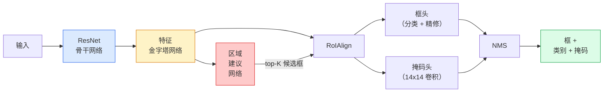

# 实例分割——Mask R-CNN（Instance Segmentation — Mask R-CNN）

> 给 Faster R-CNN 检测器加一个很小的掩码分支，你就得到了实例分割。难点在 RoIAlign，而且它比看上去更难。

**Type:** Build + Learn
**Languages:** Python
**Prerequisites:** Phase 4 Lesson 06 (YOLO), Phase 4 Lesson 07 (U-Net)
**Time:** ~75 minutes

## 学习目标（Learning Objectives）

- 端到端地梳理 Mask R-CNN 架构：骨干网络、FPN、RPN、RoIAlign、框头、掩码头
- 从零实现 RoIAlign，并解释为什么 RoIPool 已被弃用
- 使用 torchvision 的 `maskrcnn_resnet50_fpn_v2` 预训练模型生成生产级实例掩码，并正确读懂它的输出格式
- 通过替换框头和掩码头、保持骨干网络冻结，把 Mask R-CNN 微调到一个小型自定义数据集上

## 问题背景（The Problem）

语义分割给你每个类别一个掩码。实例分割给你每个物体一个掩码，即使两个物体属于同一类。数清个体、跨帧跟踪、测量物体（一堵墙上每块砖的外接框、显微图像里的每个细胞）都需要实例分割。

Mask R-CNN（He et al., 2017）把实例分割重新表述为“检测外加一个掩码”，从而解决了这个问题。这个设计干净到此后五年里几乎每一篇实例分割论文都是 Mask R-CNN 的变体，而 torchvision 的实现至今仍是中小规模数据集上的生产默认选择。

真正困难的工程问题在采样：怎么从一个角点不对齐像素边界的候选框里，裁出一块固定大小的特征区域？这里做错了，处处都要损失零点几个 mAP 点。RoIAlign 就是答案。

## 核心概念（The Concept）

### 架构总览（The architecture）



要理解五个部件：

1. **骨干网络**——在 ImageNet 上训练的 ResNet-50 或 ResNet-101。产出 stride 分别为 4、8、16、32 的特征图层级。
2. **FPN（特征金字塔网络）**——自顶向下加横向连接，给每个层级都提供 C 通道语义丰富的特征。检测时按物体大小查询对应的 FPN 层级。
3. **RPN（区域建议网络）**——一个小的卷积头，在每个锚框位置预测“这里有没有物体”和“这个框该怎么修”。每张图产出约 1000 个候选框。
4. **RoIAlign**——从任意 FPN 层级上的任意框中，采样出一个固定大小（例如 7x7）的特征块。双线性采样，不做量化。
5. **头**——一个两层框头负责精修框并挑选类别，外加一个小卷积头为每个候选框输出 `28x28` 的二值掩码。

### 为什么用 RoIAlign 而不是 RoIPool（Why RoIAlign, not RoIPool）

最初的 Fast R-CNN 用的是 RoIPool：把候选框切分成网格，取每个格子里的最大特征，并把所有坐标四舍五入到整数。这种取整会让特征图与输入像素坐标错位最多一整个特征图像素——在 224x224 的图上很小，但当特征图的 stride 是 32 时就是灾难。

```
RoIPool:
  box (34.7, 51.3, 98.2, 142.9)
  round -> (34, 51, 98, 142)
  split grid -> round each cell boundary
  misalignment accumulates at every step

RoIAlign:
  box (34.7, 51.3, 98.2, 142.9)
  sample at exact float coordinates using bilinear interpolation
  no rounding anywhere
```

RoIAlign 在 COCO 上免费带来 3-4 个点的掩码 AP 提升。如今每个在乎定位的检测器都在用它——YOLOv7 seg、RT-DETR、Mask2Former 概莫能外。

### 一段话讲完 RPN（The RPN in one paragraph）

在特征图的每个位置摆放 K 个大小和形状不同的锚框。为每个锚框预测一个 objectness 分数，以及一个把锚框变成更贴合的框的回归偏移。按分数保留前约 1,000 个框，在 IoU 0.7 上做 NMS，再把幸存者交给后面的头。RPN 用自己的小型损失训练——结构与第 6 课的 YOLO 损失相同，只是只有两个类（有物体 / 无物体）。

### 掩码头（The mask head）

对每个候选框（RoIAlign 之后），掩码头是一个微型 FCN：四个 3x3 卷积、一个 2 倍反卷积、最后一个 1x1 卷积，在 `28x28` 分辨率上产生 `num_classes` 个输出通道。只有对应预测类别的通道被保留，其余被忽略。这就把掩码预测与分类解耦了。

把 28x28 掩码上采样回候选框的原始像素尺寸，就得到最终的二值掩码。

### 损失（Losses）

Mask R-CNN 把四个损失加在一起：

```
L = L_rpn_cls + L_rpn_box + L_box_cls + L_box_reg + L_mask
```

- `L_rpn_cls`, `L_rpn_box`——RPN 候选框的 objectness + 框回归。
- `L_box_cls`——在头的分类器上对 (C+1) 个类别（含背景）做交叉熵。
- `L_box_reg`——头的框精修上的 smooth L1。
- `L_mask`——28x28 掩码输出上的逐像素二元交叉熵。

每个损失都有自己的默认权重；torchvision 的实现把它们暴露为构造函数参数。

### 输出格式（Output format）

`torchvision.models.detection.maskrcnn_resnet50_fpn_v2` 返回一个字典列表，每张图对应一个：

```
{
    "boxes":  (N, 4) in (x1, y1, x2, y2) pixel coordinates,
    "labels": (N,) class IDs, 0 = background so indices are 1-based,
    "scores": (N,) confidence scores,
    "masks":  (N, 1, H, W) float masks in [0, 1] — threshold at 0.5 for binary,
}
```

掩码已经是全图分辨率。28x28 的头输出已在内部上采样过。

```figure
cv3-roialign-sampling
```

## 动手构建（Build It）

### 步骤 1：从零实现 RoIAlign（Step 1: RoIAlign from scratch）

这是 Mask R-CNN 中唯一一个用代码理解比用文字理解更容易的组件。

```python
import torch
import torch.nn.functional as F

def roi_align_single(feature, box, output_size=7, spatial_scale=1 / 16.0):
    """
    feature: (C, H, W) single-image feature map
    box: (x1, y1, x2, y2) in original image pixel coordinates
    output_size: side of the output grid (7 for box head, 14 for mask head)
    spatial_scale: reciprocal of the feature map stride
    """
    C, H, W = feature.shape
    x1, y1, x2, y2 = [c * spatial_scale - 0.5 for c in box]
    bin_w = (x2 - x1) / output_size
    bin_h = (y2 - y1) / output_size

    grid_y = torch.linspace(y1 + bin_h / 2, y2 - bin_h / 2, output_size)
    grid_x = torch.linspace(x1 + bin_w / 2, x2 - bin_w / 2, output_size)
    yy, xx = torch.meshgrid(grid_y, grid_x, indexing="ij")

    gx = 2 * (xx + 0.5) / W - 1
    gy = 2 * (yy + 0.5) / H - 1
    grid = torch.stack([gx, gy], dim=-1).unsqueeze(0)
    sampled = F.grid_sample(feature.unsqueeze(0), grid, mode="bilinear",
                            align_corners=False)
    return sampled.squeeze(0)
```

每个数都采自双线性插值的位置。没有取整，没有量化，没有丢失的梯度。

### 步骤 2：与 torchvision 的 RoIAlign 对比（Step 2: Compare to torchvision's RoIAlign）

```python
from torchvision.ops import roi_align

feature = torch.randn(1, 16, 50, 50)
boxes = torch.tensor([[0, 10, 20, 100, 90]], dtype=torch.float32)  # (batch_idx, x1, y1, x2, y2)

ours = roi_align_single(feature[0], boxes[0, 1:].tolist(), output_size=7, spatial_scale=1/4)
theirs = roi_align(feature, boxes, output_size=(7, 7), spatial_scale=1/4, sampling_ratio=1, aligned=True)[0]

print(f"shape ours:   {tuple(ours.shape)}")
print(f"shape theirs: {tuple(theirs.shape)}")
print(f"max|diff|:    {(ours - theirs).abs().max().item():.3e}")
```

取 `sampling_ratio=1` 与 `aligned=True` 时，两者之差在 `1e-5` 以内。

### 步骤 3：加载预训练 Mask R-CNN（Step 3: Load a pretrained Mask R-CNN）

```python
import torch
from torchvision.models.detection import maskrcnn_resnet50_fpn_v2, MaskRCNN_ResNet50_FPN_V2_Weights

model = maskrcnn_resnet50_fpn_v2(weights=MaskRCNN_ResNet50_FPN_V2_Weights.DEFAULT)
model.eval()
print(f"params: {sum(p.numel() for p in model.parameters()):,}")
print(f"classes (including background): {len(model.roi_heads.box_predictor.cls_score.out_features * [0])}")
```

46M 参数，91 个类别（COCO）。第一个类别（id 0）是背景；模型真正检测的所有类别从 id 1 开始。

### 步骤 4：运行推理（Step 4: Run inference）

```python
with torch.no_grad():
    x = torch.randn(3, 400, 600)
    predictions = model([x])
p = predictions[0]
print(f"boxes:  {tuple(p['boxes'].shape)}")
print(f"labels: {tuple(p['labels'].shape)}")
print(f"scores: {tuple(p['scores'].shape)}")
print(f"masks:  {tuple(p['masks'].shape)}")
```

掩码张量形状为 `(N, 1, H, W)`。以 0.5 为阈值即可得到每个物体的二值掩码：

```python
binary_masks = (p['masks'] > 0.5).squeeze(1)  # (N, H, W) boolean
```

### 步骤 5：替换分类头以适配自定义类别数（Step 5: Swap the heads for a custom class count）

常见的微调配方：复用骨干网络、FPN 和 RPN；替换两个分类头。

```python
from torchvision.models.detection.faster_rcnn import FastRCNNPredictor
from torchvision.models.detection.mask_rcnn import MaskRCNNPredictor

def build_custom_maskrcnn(num_classes):
    model = maskrcnn_resnet50_fpn_v2(weights=MaskRCNN_ResNet50_FPN_V2_Weights.DEFAULT)
    in_features = model.roi_heads.box_predictor.cls_score.in_features
    model.roi_heads.box_predictor = FastRCNNPredictor(in_features, num_classes)
    in_features_mask = model.roi_heads.mask_predictor.conv5_mask.in_channels
    hidden_layer = 256
    model.roi_heads.mask_predictor = MaskRCNNPredictor(in_features_mask, hidden_layer, num_classes)
    return model

custom = build_custom_maskrcnn(num_classes=5)
print(f"custom cls_score.out_features: {custom.roi_heads.box_predictor.cls_score.out_features}")
```

`num_classes` 必须包含背景类，因此一个有 4 个物体类别的数据集要用 `num_classes=5`。

### 步骤 6：冻结不需要训练的部分（Step 6: Freeze what does not need training）

小数据集上，冻结骨干网络和 FPN。只让 RPN 的 objectness + 回归和两个头学习。

```python
def freeze_backbone_and_fpn(model):
    # torchvision Mask R-CNN packs the FPN inside `model.backbone` (as
    # `model.backbone.fpn`), so iterating `model.backbone.parameters()` covers
    # both the ResNet feature layers and the FPN lateral/output convs.
    for p in model.backbone.parameters():
        p.requires_grad = False
    return model

custom = freeze_backbone_and_fpn(custom)
trainable = sum(p.numel() for p in custom.parameters() if p.requires_grad)
print(f"trainable after freeze: {trainable:,}")
```

在 500 张图的数据集上，这就是收敛与过拟合之间的分界线。

## 直接使用（Use It）

torchvision 里 Mask R-CNN 的完整训练循环只有 40 行，而且在不同任务之间没有实质差别——换掉数据集就能用。

```python
def train_step(model, images, targets, optimizer):
    model.train()
    loss_dict = model(images, targets)
    losses = sum(loss for loss in loss_dict.values())
    optimizer.zero_grad()
    losses.backward()
    optimizer.step()
    return {k: v.item() for k, v in loss_dict.items()}
```

`targets` 列表中每张图一个字典，含 `boxes`、`labels` 和 `masks`（形状为 `(num_instances, H, W)` 的二值张量）。训练时模型返回一个包含四个损失的字典，评估时返回预测列表，行为由 `model.training` 决定。

`pycocotools` 评估器对框和掩码都给出 mAP@IoU=0.5:0.95；只有同时拿到这两个数字，你才知道瓶颈在框头还是掩码头。

## 交付产物（Ship It）

本节课产出：

- `outputs/prompt-instance-vs-semantic-router.md`——一个提示词，问三个问题，然后在实例、语义、全景分割之间做出选择，并给出该从哪个模型起步。
- `outputs/skill-mask-rcnn-head-swapper.md`——一个技能，给定新的 `num_classes`，为任意 torchvision 检测模型生成替换分类头的 10 行代码。

## 练习（Exercises）

1. **（简单）**在 100 个随机框上，把你的 RoIAlign 与 `torchvision.ops.roi_align` 对拍。报告最大绝对差。再跑一下 RoIPool（2017 年之前的行为），展示它在靠近边界的框上会偏差约 1-2 个特征图像素。
2. **（中等）**在一个 50 张图的自定义数据集上微调 `maskrcnn_resnet50_fpn_v2`（任意两个类别：气球、鱼、坑洞、logo）。冻结骨干网络，训练 20 个 epoch，报告掩码 AP@0.5。
3. **（困难）**把 Mask R-CNN 的掩码头换成在 56x56 而不是 28x28 上预测的版本。测量前后两个 mAP@IoU=0.75。解释为什么这个收益（或没有收益）符合预期的边界精度 / 显存权衡。

## 关键术语（Key Terms）

| 术语 | 人们常说 | 实际含义 |
|------|----------------|----------------------|
| Mask R-CNN | “检测加掩码” | Faster R-CNN 加一个小型 FCN 头，为每个候选框的每个类别预测一个 28x28 掩码 |
| FPN | “特征金字塔” | 自顶向下加横向连接，给每个 stride 层级提供 C 通道语义丰富的特征 |
| RPN | “区域建议器” | 一个小卷积头，每张图产出约 1000 个有物体/无物体的候选 |
| RoIAlign | “不取整的裁剪” | 从任意浮点坐标的框中双线性采样出固定大小的特征网格 |
| RoIPool | “2017 年前的裁剪” | 目的与 RoIAlign 相同，但会对框坐标取整；已过时 |
| Mask AP | “实例 mAP” | 用掩码 IoU 而非框 IoU 计算的平均精度；COCO 实例分割指标 |
| 二值掩码头 | “每类一个掩码” | 为每个候选框的每个类别预测一个二值掩码；只保留预测类别的通道 |
| 背景类 | “第 0 类” | 兜底的“无物体”类；真实类别的索引从 1 开始 |

## 延伸阅读（Further Reading）

- [Mask R-CNN (He et al., 2017)](https://arxiv.org/abs/1703.06870) —— 原始论文；第 3 节讲 RoIAlign，是必读内容
- [FPN: Feature Pyramid Networks (Lin et al., 2017)](https://arxiv.org/abs/1612.03144) —— FPN 论文；每个现代检测器都在用它
- [torchvision Mask R-CNN 教程](https://pytorch.org/tutorials/intermediate/torchvision_tutorial.html) —— 微调循环的参考实现
- [Detectron2 model zoo](https://github.com/facebookresearch/detectron2/blob/main/MODEL_ZOO.md) —— 生产级实现，几乎每种检测和分割变体都带训练好的权重
