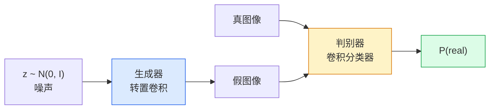
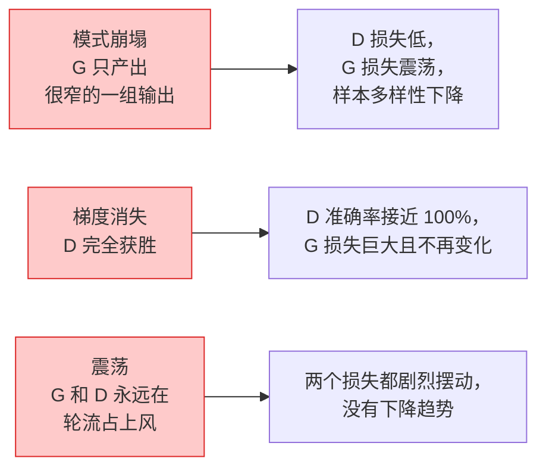

# 图像生成——GAN（Image Generation — GANs）

> GAN 是两个神经网络在玩一场规则固定的博弈：一个负责画，一个负责挑刺。它们一起进步，直到画出来的东西骗过挑刺者。

**Type:** Build
**Languages:** Python
**Prerequisites:** Phase 4 Lesson 03 (CNNs), Phase 3 Lesson 06 (Optimizers), Phase 3 Lesson 07 (Regularization)
**Time:** ~75 minutes

## 学习目标（Learning Objectives）

- 解释生成器与判别器之间的极小极大博弈，以及为什么均衡点对应 p_model = p_data
- 用 PyTorch 实现一个 DCGAN，用不到 60 行代码让它生成连贯的 32x32 合成图像
- 用三个标准技巧稳定 GAN 训练：non-saturating 损失、谱归一化（spectral norm）、TTUR（双时间尺度更新规则）
- 读懂训练曲线，区分健康收敛与模式崩塌、震荡、判别器完全获胜

## 问题背景（The Problem）

分类教网络把图像映射到标签。生成把问题倒过来：采样出看起来像来自同一分布的新图像。没有可以拿来做 diff 的“正确”输出；只有你想模仿的一个分布。

标准损失函数（MSE、交叉熵）无法度量“这个样本是否来自真实分布”。最小化逐像素误差得到的是模糊的平均图，而不是逼真的样本。突破在于把损失本身学出来：训练第二个网络，专门分辨真假，再用它的判断去推动生成器。

GAN（Goodfellow et al., 2014）定义了这一框架。到 2018 年，StyleGAN 已经能生成与照片难以区分的 1024x1024 人脸。此后扩散模型在质量和可控性上登上王座，但让扩散变得实用的每一个技巧——归一化的选择、潜空间、特征损失——最早都是在 GAN 上弄明白的。

## 核心概念（The Concept）

### 两个网络（The two networks）



**生成器（generator）** G 接收一个噪声向量 `z`，输出一张图像。**判别器（discriminator）** D 接收一张图像，输出单个标量：这张图是真的概率。

### 博弈（The game）

G 想让 D 判错。D 想让自己判对。形式化写出来：

```
min_G max_D  E_x[log D(x)] + E_z[log(1 - D(G(z)))]
```

从右往左读：D 在最大化对真图（`log D(real)`）和假图（`log (1 - D(fake))`）的判断准确率。G 在最小化 D 对假图的准确率——它想让 `D(G(z))` 变高。

Goodfellow 证明了这个极小极大博弈存在一个全局均衡：`p_G = p_data`，D 处处输出 0.5，生成分布与真实分布之间的 Jensen-Shannon 散度为零。难的是怎么到达那里。

### Non-saturating 损失（Non-saturating loss）

上面的形式数值上不稳定。训练初期，每个假图的 `D(G(z))` 都接近零，于是 `log(1 - D(G(z)))` 对 G 的梯度趋于消失。补救办法：把 G 的损失翻转过来。

```
L_D = -E_x[log D(x)] - E_z[log(1 - D(G(z)))]
L_G = -E_z[log D(G(z))]                          # non-saturating
```

这样一来，当 `D(G(z))` 接近零时，G 的损失很大，梯度也带有信息量。每个现代 GAN 用的都是这个变体。

### DCGAN 架构规则（DCGAN architecture rules）

Radford、Metz、Chintala（2015）把多年失败实验浓缩成五条规则，让 GAN 训练稳定下来：

1. 用步幅卷积替换池化（两个网络都如此）。
2. 生成器和判别器都用 batch norm，G 的输出层和 D 的输入层除外。
3. 在更深的架构中去掉全连接层。
4. G 除输出层外全用 ReLU（输出层用 tanh 映射到 [-1, 1]）。
5. D 的所有层都用 LeakyReLU（negative_slope=0.2）。

每个现代基于卷积的 GAN（StyleGAN、BigGAN、GigaGAN）仍然从这五条规则出发，然后一次替换一个部件。

### 失败模式及其特征（Failure modes and their signatures）



- **模式崩塌**：G 找到一张能骗过 D 的图，然后只产出这一张。修法：加 minibatch discrimination、谱归一化，或用标签条件化。
- **判别器获胜**：D 变强得太快，G 的梯度消失。修法：缩小 D、调低 D 的学习率，或对真标签做标签平滑（label smoothing）。
- **震荡**：两个网络轮流占上风，永远逼近不了均衡。修法：TTUR（D 的学习率比 G 快 2-4 倍），或换成 Wasserstein 损失。

### 评估（Evaluation）

GAN 没有真值，那怎么知道它有没有在工作？

- **看样本**——每个 epoch 结束时看一眼 64 个样本。这条没得商量。
- **FID（Fréchet Inception Distance）**——真实集与生成集在 Inception-v3 特征分布之间的距离。越低越好。社区标准。
- **Inception Score**——更老、更脆弱；优先用 FID。
- **生成模型的 Precision/Recall**——分别度量质量（precision）和覆盖（recall）。比单独的 FID 更有信息量。

对小规模合成数据实验来说，看样本就够了。

```figure
cv-gan-image
```

## 动手构建（Build It）

### 步骤 1：生成器（Step 1: Generator）

一个小型 DCGAN 生成器：吃进 64 维噪声，产出 32x32 图像。

```python
import torch
import torch.nn as nn

class Generator(nn.Module):
    def __init__(self, z_dim=64, img_channels=3, feat=64):
        super().__init__()
        self.net = nn.Sequential(
            nn.ConvTranspose2d(z_dim, feat * 4, kernel_size=4, stride=1, padding=0, bias=False),
            nn.BatchNorm2d(feat * 4),
            nn.ReLU(inplace=True),
            nn.ConvTranspose2d(feat * 4, feat * 2, kernel_size=4, stride=2, padding=1, bias=False),
            nn.BatchNorm2d(feat * 2),
            nn.ReLU(inplace=True),
            nn.ConvTranspose2d(feat * 2, feat, kernel_size=4, stride=2, padding=1, bias=False),
            nn.BatchNorm2d(feat),
            nn.ReLU(inplace=True),
            nn.ConvTranspose2d(feat, img_channels, kernel_size=4, stride=2, padding=1, bias=False),
            nn.Tanh(),
        )

    def forward(self, z):
        return self.net(z.view(z.size(0), -1, 1, 1))
```

四个转置卷积，每个都是 `kernel_size=4, stride=2, padding=1`，让空间尺寸每次干净利落地翻倍。输出激活经 tanh 落在 [-1, 1]。

### 步骤 2：判别器（Step 2: Discriminator）

生成器的镜像。LeakyReLU、步幅卷积，最后输出一个标量 logit。

```python
class Discriminator(nn.Module):
    def __init__(self, img_channels=3, feat=64):
        super().__init__()
        self.net = nn.Sequential(
            nn.Conv2d(img_channels, feat, kernel_size=4, stride=2, padding=1),
            nn.LeakyReLU(0.2, inplace=True),
            nn.Conv2d(feat, feat * 2, kernel_size=4, stride=2, padding=1, bias=False),
            nn.BatchNorm2d(feat * 2),
            nn.LeakyReLU(0.2, inplace=True),
            nn.Conv2d(feat * 2, feat * 4, kernel_size=4, stride=2, padding=1, bias=False),
            nn.BatchNorm2d(feat * 4),
            nn.LeakyReLU(0.2, inplace=True),
            nn.Conv2d(feat * 4, 1, kernel_size=4, stride=1, padding=0),
        )

    def forward(self, x):
        return self.net(x).view(-1)
```

最后一个卷积把 `4x4` 特征图缩到 `1x1`。每张图输出一个标量；只在计算损失时才套 sigmoid。

### 步骤 3：训练步（Step 3: Training step）

交替进行：每个 batch 先更新一次 D，再更新一次 G。

```python
import torch.nn.functional as F

def train_step(G, D, real, z, opt_g, opt_d, device):
    real = real.to(device)
    bs = real.size(0)

    # D step
    opt_d.zero_grad()
    d_real = D(real)
    d_fake = D(G(z).detach())
    loss_d = (F.binary_cross_entropy_with_logits(d_real, torch.ones_like(d_real))
              + F.binary_cross_entropy_with_logits(d_fake, torch.zeros_like(d_fake)))
    loss_d.backward()
    opt_d.step()

    # G step
    opt_g.zero_grad()
    d_fake = D(G(z))
    loss_g = F.binary_cross_entropy_with_logits(d_fake, torch.ones_like(d_fake))
    loss_g.backward()
    opt_g.step()

    return loss_d.item(), loss_g.item()
```

D 步中的 `G(z).detach()` 至关重要：在 D 的更新过程中，我们不希望梯度流进 G。忘了这一步是新手的经典 bug。

### 步骤 4：合成形状数据集上的完整训练循环（Step 4: Full training loop on synthetic shapes）

```python
from torch.utils.data import DataLoader, TensorDataset
import numpy as np

def synthetic_images(num=2000, size=32, seed=0):
    rng = np.random.default_rng(seed)
    imgs = np.zeros((num, 3, size, size), dtype=np.float32) - 1.0
    for i in range(num):
        r = rng.uniform(6, 12)
        cx, cy = rng.uniform(r, size - r, size=2)
        yy, xx = np.meshgrid(np.arange(size), np.arange(size), indexing="ij")
        mask = (xx - cx) ** 2 + (yy - cy) ** 2 < r ** 2
        color = rng.uniform(-0.5, 1.0, size=3)
        for c in range(3):
            imgs[i, c][mask] = color[c]
    return torch.from_numpy(imgs)

device = "cuda" if torch.cuda.is_available() else "cpu"
data = synthetic_images()
loader = DataLoader(TensorDataset(data), batch_size=64, shuffle=True)

G = Generator(z_dim=64, img_channels=3, feat=32).to(device)
D = Discriminator(img_channels=3, feat=32).to(device)
opt_g = torch.optim.Adam(G.parameters(), lr=2e-4, betas=(0.5, 0.999))
opt_d = torch.optim.Adam(D.parameters(), lr=2e-4, betas=(0.5, 0.999))

for epoch in range(10):
    for (batch,) in loader:
        z = torch.randn(batch.size(0), 64, device=device)
        ld, lg = train_step(G, D, batch, z, opt_g, opt_d, device)
    print(f"epoch {epoch}  D {ld:.3f}  G {lg:.3f}")
```

`Adam(lr=2e-4, betas=(0.5, 0.999))` 是 DCGAN 的默认值——偏低的 beta1 防止动量项把对抗博弈稳定得过头。

### 步骤 5：采样（Step 5: Sampling）

```python
@torch.no_grad()
def sample(G, n=16, z_dim=64, device="cpu"):
    G.eval()
    z = torch.randn(n, z_dim, device=device)
    imgs = G(z)
    imgs = (imgs + 1) / 2
    return imgs.clamp(0, 1)
```

采样前一定要切到 eval 模式。对 DCGAN 来说这一点很重要，因为此时用的是 batch norm 的滑动统计量，而不是当前 batch 的统计量。

### 步骤 6：谱归一化（Step 6: Spectral normalisation）

判别器中 BN 的即插即用替代品，保证网络是 1-Lipschitz 的。能修好大多数“D 赢得太狠”的失败。

```python
from torch.nn.utils import spectral_norm

def build_sn_discriminator(img_channels=3, feat=64):
    return nn.Sequential(
        spectral_norm(nn.Conv2d(img_channels, feat, 4, 2, 1)),
        nn.LeakyReLU(0.2, inplace=True),
        spectral_norm(nn.Conv2d(feat, feat * 2, 4, 2, 1)),
        nn.LeakyReLU(0.2, inplace=True),
        spectral_norm(nn.Conv2d(feat * 2, feat * 4, 4, 2, 1)),
        nn.LeakyReLU(0.2, inplace=True),
        spectral_norm(nn.Conv2d(feat * 4, 1, 4, 1, 0)),
    )
```

把 `Discriminator` 换成 `build_sn_discriminator()`，往往就不再需要 TTUR 技巧。谱归一化是你能做的最简单的单项鲁棒性升级。

## 直接使用（Use It）

要认真做生成，要么用预训练权重，要么转向扩散模型。两个标准库：

- `torch_fidelity` 不用自己写评估代码，就能在你的生成器上计算 FID / IS。
- `pytorch-gan-zoo`（较老）和 `StudioGAN` 附带经过验证的 DCGAN、WGAN-GP、SN-GAN、StyleGAN、BigGAN 实现。

到 2026 年，GAN 仍然是下列场景的最佳选择：实时图像生成（延迟 <10 ms）、风格迁移、需要精确控制的图像到图像翻译（Pix2Pix、CycleGAN）。扩散模型则在照片级真实感和文本条件化上更胜一筹。

## 交付产物（Ship It）

本节课产出：

- `outputs/prompt-gan-training-triage.md`——一个提示词，读一段训练曲线描述，判定失败模式（模式崩塌、D 完全获胜、震荡）并给出唯一推荐的修复手段。
- `outputs/skill-dcgan-scaffold.md`——一个技能，根据 `z_dim`、目标 `image_size` 和 `num_channels` 写出一个 DCGAN 脚手架，包含训练循环和样本保存器。

## 练习（Exercises）

1. **（简单）**在合成圆形数据集上训练上面的 DCGAN，并在每个 epoch 结束时保存一张 16 个样本的网格图。到第几个 epoch，生成的圆开始明显变圆？
2. **（中等）**把判别器的 batch norm 换成谱归一化。两个版本并排训练。哪个收敛更快？跨三个随机种子，哪个方差更低？
3. **（困难）**实现一个条件 DCGAN：把类别标签同时喂给 G 和 D（在 G 中把 one-hot 拼接到噪声上，在 D 中拼接一个类别嵌入通道）。在第 7 课的“圆 vs 方”合成数据集上训练，并用指定标签采样来证明类别条件化确实生效。

## 关键术语（Key Terms）

| 术语 | 人们常说 | 实际含义 |
|------|----------------|----------------------|
| 生成器（G） | “负责画画的网络” | 把噪声映射为图像；训练目标是骗过判别器 |
| 判别器（D） | “负责挑刺的评论家” | 二分类器；训练目标是区分真图和生成图 |
| Minimax | “那场博弈” | 对 G 取最小、对 D 取最大的对抗损失；均衡点在 p_G = p_data |
| Non-saturating 损失 | “数值上正常的那一版” | G 的损失用 -log(D(G(z))) 而不是 log(1 - D(G(z)))，避免训练早期梯度消失 |
| 模式崩塌（mode collapse） | “生成器只会画一种东西” | G 只产出数据分布的一小部分；用谱归一化、minibatch discrimination 或更大的 batch 来修 |
| TTUR | “两个学习率” | D 学得比 G 快，通常是 2-4 倍；用来稳定训练 |
| 谱归一化（spectral norm） | “1-Lipschitz 层” | 一种权重归一化，约束每层的 Lipschitz 常数；防止 D 变得任意陡峭 |
| FID | “Fréchet Inception Distance” | 真实集与生成集在 Inception-v3 特征分布上的距离；标准评估指标 |

## 延伸阅读（Further Reading）

- [Generative Adversarial Networks (Goodfellow et al., 2014)](https://arxiv.org/abs/1406.2661) —— 一切的起点
- [DCGAN (Radford, Metz, Chintala, 2015)](https://arxiv.org/abs/1511.06434) —— 让 GAN 变得可训练的架构规则
- [Spectral Normalization for GANs (Miyato et al., 2018)](https://arxiv.org/abs/1802.05957) —— 单项最有用的稳定化技巧
- [StyleGAN3 (Karras et al., 2021)](https://arxiv.org/abs/2106.12423) —— GAN 的 SOTA；读起来像过去十年所有技巧的精选集
