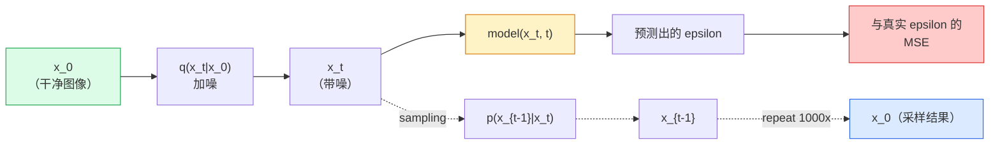

# 图像生成——扩散模型（Image Generation — Diffusion Models）

> 扩散模型（diffusion model）学的是去噪。训练它从一张带噪图像中去除一点点噪声，再把这个去噪过程反向重复一千次，你就得到了一个图像生成器。

**Type:** Build
**Languages:** Python
**Prerequisites:** Phase 4 Lesson 07 (U-Net), Phase 1 Lesson 06 (Probability), Phase 3 Lesson 06 (Optimizers)
**Time:** ~75 minutes

## 学习目标（Learning Objectives）

- 推导前向加噪过程 `x_0 -> x_1 -> ... -> x_T`，并解释为什么闭式解 `q(x_t | x_0)` 对任意 t 都成立
- 实现 DDPM 风格的训练目标（回归每一步加入的噪声），以及一个从纯噪声一路走回图像的采样器
- 搭建一个时间条件化（time-conditioned）的 U-Net（小到能在 CPU 上训练），为任意时间步预测噪声
- 解释 DDPM 与 DDIM 采样的区别，以及各自适用的场景（第 23 课会深入讲解流匹配（flow matching）与整流流（rectified flow））

## 问题所在（The Problem）

生成对抗网络（GAN）一次性生成：噪声进，图像出，一次前向传播。它们快，但难训练。扩散模型迭代生成：从纯噪声出发，一小步一小步去噪，图像逐渐浮现。它们慢，但好训练。过去五年，后一种特性占了上风：任何小团队都能训练一个扩散模型并得到像样的样本；而 GAN 训练是一门手艺，要靠多年的失败训练才能练出来。

除了训练稳定，扩散的迭代结构正是它解锁现代图像生成一切能力的关键：文本条件化（text conditioning）、图像修补（inpainting）、图像编辑、超分辨率、可控风格。采样循环的每一步都是注入新约束的位置。正是这个钩子，让 Stable Diffusion、Imagen、DALL-E 3、Midjourney，以及你将来会用到的每一个可控图像模型，全都建立在扩散之上。

本课构建最简 DDPM：前向加噪、反向去噪、训练循环。下一课（Stable Diffusion）会把它接进一个带 VAE、文本编码器和 classifier-free guidance 的生产级系统。

## 核心概念（The Concept）

### 前向过程（The forward process）

取一张图像 `x_0`。加一点点高斯噪声得到 `x_1`。再加一点得到 `x_2`。如此进行 T 步，直到 `x_T` 与纯高斯噪声几乎无法区分。

```
q(x_t | x_{t-1}) = N(x_t; sqrt(1 - beta_t) * x_{t-1},  beta_t * I)
```

`beta_t` 是一个很小的方差调度，通常在 T=1000 步内从 0.0001 线性升到 0.02。每一步都稍微削弱信号，并注入新鲜噪声。

### 闭式跳步（The closed-form jump）

一步一步加噪构成一个马尔可夫链（Markov chain），但数学可以折叠：你可以一步从 `x_0` 直接采样出 `x_t`。

```
Define alpha_t = 1 - beta_t
Define alpha_bar_t = prod_{s=1..t} alpha_s

Then:
  q(x_t | x_0) = N(x_t; sqrt(alpha_bar_t) * x_0,  (1 - alpha_bar_t) * I)

Equivalently:
  x_t = sqrt(alpha_bar_t) * x_0 + sqrt(1 - alpha_bar_t) * epsilon
  where epsilon ~ N(0, I)
```

这一个等式就是扩散模型得以实用化的全部原因。训练时你随机挑一个 `t`，直接从 `x_0` 采样出 `x_t`，一步完成训练——完全不用模拟整条马尔可夫链。

### 反向过程（The reverse process）

前向过程是固定的。反向过程 `p(x_{t-1} | x_t)` 才是神经网络要学的东西。扩散模型不直接预测 `x_{t-1}`，而是预测第 t 步加入的噪声 `epsilon`，再由数学公式从它推出 `x_{t-1}`。



### 训练损失（The training loss）

每个训练步：

1. 采样一张真实图像 `x_0`。
2. 从 [1, T] 中均匀采样一个时间步 `t`。
3. 采样噪声 `epsilon ~ N(0, I)`。
4. 计算 `x_t = sqrt(alpha_bar_t) * x_0 + sqrt(1 - alpha_bar_t) * epsilon`。
5. 用网络预测 `epsilon_theta(x_t, t)`。
6. 最小化 `|| epsilon - epsilon_theta(x_t, t) ||^2`。

就这么简单。神经网络学会预测任意时间步上的噪声，损失函数就是 MSE（均方误差）。没有对抗博弈，没有崩塌，没有震荡。

### 采样器（DDPM）（The sampler (DDPM)）

生成时：从 `x_T ~ N(0, I)` 出发，一步一步往回走。

```
for t = T, T-1, ..., 1:
    eps = model(x_t, t)
    x_{t-1} = (1 / sqrt(alpha_t)) * (x_t - (beta_t / sqrt(1 - alpha_bar_t)) * eps) + sqrt(beta_t) * z
    where z ~ N(0, I) if t > 1, else 0
return x_0
```

关键在于：尽管反向条件分布一般情况下没有闭式解，但对于这种特定的高斯前向过程来说它是有的。那些看起来很丑的系数，正是贝叶斯法则给你的结果。

### 为什么是 1000 步（Why 1000 steps）

前向噪声调度的选取原则是：每一步加入的噪声刚好足够，让反向一步接近高斯分布。步数太少，反向步离高斯太远，网络建模不好；步数太多，采样变贵而收益递减。T=1000 配线性调度是 DDPM 的默认设置。

### DDIM：采样快 20 倍（DDIM: 20x faster sampling）

训练不变，变的是采样。DDIM（Song et al., 2020）定义了一个确定性的反向过程，无需重新训练就能跳过时间步。用 DDIM 采样 50 步，就能得到接近 1000 步 DDPM 的质量。每个生产系统用的都是 DDIM 或更快的变体（DPM-Solver、Euler ancestral）。

### 时间条件化（Time conditioning）

网络 `epsilon_theta(x_t, t)` 需要知道自己在为哪个时间步去噪。现代扩散模型通过正弦时间嵌入注入 `t`（与 transformer 里的位置编码是同一个思想），嵌入会在 U-Net 的每一级被加到特征图上。

```
t_embedding = sinusoidal(t)
feature_map += MLP(t_embedding)
```

没有时间条件化，网络只能从图像本身去猜噪声水平——也能工作，但样本效率低得多。

```figure
cv-diffusion-image
```

## 动手构建（Build It）

### 步骤 1：噪声调度（Step 1: Noise schedule）

```python
import torch

def linear_beta_schedule(T=1000, beta_start=1e-4, beta_end=2e-2):
    return torch.linspace(beta_start, beta_end, T)


def precompute_schedule(betas):
    alphas = 1.0 - betas
    alphas_cumprod = torch.cumprod(alphas, dim=0)
    return {
        "betas": betas,
        "alphas": alphas,
        "alphas_cumprod": alphas_cumprod,
        "sqrt_alphas_cumprod": torch.sqrt(alphas_cumprod),
        "sqrt_one_minus_alphas_cumprod": torch.sqrt(1.0 - alphas_cumprod),
        "sqrt_recip_alphas": torch.sqrt(1.0 / alphas),
    }

schedule = precompute_schedule(linear_beta_schedule(T=1000))
```

预先计算一次，训练和采样时按索引取用。

### 步骤 2：前向扩散（q_sample）（Step 2: Forward diffusion (q_sample)）

```python
def q_sample(x0, t, noise, schedule):
    sqrt_a = schedule["sqrt_alphas_cumprod"][t].view(-1, 1, 1, 1)
    sqrt_one_minus_a = schedule["sqrt_one_minus_alphas_cumprod"][t].view(-1, 1, 1, 1)
    return sqrt_a * x0 + sqrt_one_minus_a * noise
```

一行闭式解。`t` 是一个时间步批次，批次里的每张图各对应一个。

### 步骤 3：一个小型时间条件化 U-Net（Step 3: A tiny time-conditioned U-Net）

```python
import torch.nn as nn
import torch.nn.functional as F
import math

def timestep_embedding(t, dim=64):
    half = dim // 2
    freqs = torch.exp(-math.log(10000) * torch.arange(half, device=t.device) / half)
    args = t[:, None].float() * freqs[None]
    emb = torch.cat([args.sin(), args.cos()], dim=-1)
    return emb


class TinyUNet(nn.Module):
    def __init__(self, img_channels=3, base=32, t_dim=64):
        super().__init__()
        self.t_mlp = nn.Sequential(
            nn.Linear(t_dim, base * 4),
            nn.SiLU(),
            nn.Linear(base * 4, base * 4),
        )
        self.t_dim = t_dim
        self.enc1 = nn.Conv2d(img_channels, base, 3, padding=1)
        self.enc2 = nn.Conv2d(base, base * 2, 4, stride=2, padding=1)
        self.mid = nn.Conv2d(base * 2, base * 2, 3, padding=1)
        self.dec1 = nn.ConvTranspose2d(base * 2, base, 4, stride=2, padding=1)
        self.dec2 = nn.Conv2d(base * 2, img_channels, 3, padding=1)
        self.time_proj = nn.Linear(base * 4, base * 2)

    def forward(self, x, t):
        t_emb = timestep_embedding(t, self.t_dim)
        t_emb = self.t_mlp(t_emb)
        t_proj = self.time_proj(t_emb)[:, :, None, None]

        h1 = F.silu(self.enc1(x))
        h2 = F.silu(self.enc2(h1)) + t_proj
        h3 = F.silu(self.mid(h2))
        d1 = F.silu(self.dec1(h3))
        d2 = torch.cat([d1, h1], dim=1)
        return self.dec2(d2)
```

两级 U-Net，时间条件化注入在瓶颈处。处理真实图像时再把深度和宽度放大。

### 步骤 4：训练循环（Step 4: Training loop）

```python
def train_step(model, x0, schedule, optimizer, device, T=1000):
    model.train()
    x0 = x0.to(device)
    bs = x0.size(0)
    t = torch.randint(0, T, (bs,), device=device)
    noise = torch.randn_like(x0)
    x_t = q_sample(x0, t, noise, schedule)
    pred = model(x_t, t)
    loss = F.mse_loss(pred, noise)
    optimizer.zero_grad()
    loss.backward()
    optimizer.step()
    return loss.item()
```

这就是完整的训练循环。没有 GAN 博弈，没有专门设计的损失，只有一次 MSE 调用。

### 步骤 5：采样器（DDPM）（Step 5: Sampler (DDPM)）

```python
@torch.no_grad()
def sample(model, schedule, shape, T=1000, device="cpu"):
    model.eval()
    x = torch.randn(shape, device=device)
    betas = schedule["betas"].to(device)
    sqrt_one_minus_a = schedule["sqrt_one_minus_alphas_cumprod"].to(device)
    sqrt_recip_alphas = schedule["sqrt_recip_alphas"].to(device)

    for t in reversed(range(T)):
        t_batch = torch.full((shape[0],), t, dtype=torch.long, device=device)
        eps = model(x, t_batch)
        coef = betas[t] / sqrt_one_minus_a[t]
        mean = sqrt_recip_alphas[t] * (x - coef * eps)
        if t > 0:
            x = mean + torch.sqrt(betas[t]) * torch.randn_like(x)
        else:
            x = mean
    return x
```

产出一批样本要跑 1000 次前向传播。真实代码里你会把它换成 DDIM 的 50 步采样器。

### 步骤 6：DDIM 采样器（确定性，约快 20 倍）（Step 6: DDIM sampler (deterministic, ~20x faster)）

```python
@torch.no_grad()
def sample_ddim(model, schedule, shape, steps=50, T=1000, device="cpu", eta=0.0):
    model.eval()
    x = torch.randn(shape, device=device)
    alphas_cumprod = schedule["alphas_cumprod"].to(device)

    ts = torch.linspace(T - 1, 0, steps + 1).long()
    for i in range(steps):
        t = ts[i]
        t_prev = ts[i + 1]
        t_batch = torch.full((shape[0],), t, dtype=torch.long, device=device)
        eps = model(x, t_batch)
        a_t = alphas_cumprod[t]
        a_prev = alphas_cumprod[t_prev] if t_prev >= 0 else torch.tensor(1.0, device=device)
        x0_pred = (x - torch.sqrt(1 - a_t) * eps) / torch.sqrt(a_t)
        sigma = eta * torch.sqrt((1 - a_prev) / (1 - a_t) * (1 - a_t / a_prev))
        dir_xt = torch.sqrt(1 - a_prev - sigma ** 2) * eps
        noise = sigma * torch.randn_like(x) if eta > 0 else 0
        x = torch.sqrt(a_prev) * x0_pred + dir_xt + noise
    return x
```

`eta=0` 时完全确定（同样的噪声输入永远产出同样的结果）。`eta=1` 则退回 DDPM。

## 生产实践（Use It）

生产环境请使用 `diffusers`：

```python
from diffusers import DDPMScheduler, UNet2DModel

unet = UNet2DModel(sample_size=32, in_channels=3, out_channels=3, layers_per_block=2)
scheduler = DDPMScheduler(num_train_timesteps=1000)
```

这个库自带现成的调度器（DDPM、DDIM、DPM-Solver、Euler、Heun）、可配置的 U-Net、文生图和图生图 pipeline，以及 LoRA 微调辅助工具。

做研究可以用 `k-diffusion`（Katherine Crowson），它有最忠实的参考实现和最好的采样变体。

## 交付产出（Ship It）

本课产出：

- `outputs/prompt-diffusion-sampler-picker.md` —— 一个提示词，根据质量目标、延迟预算和条件化类型，在 DDPM / DDIM / DPM-Solver / Euler 之间做选择。
- `outputs/skill-noise-schedule-designer.md` —— 一个技能，给定 T 和目标破坏程度，生成线性、余弦或 sigmoid 的 beta 调度，并附带信噪比随时间变化的诊断图。

## 练习（Exercises）

1. **（简单）** 可视化前向过程：取一张图像，在 `t in [0, 100, 250, 500, 750, 1000]` 处分别绘制 `x_t`。验证 `x_1000` 看起来就是纯高斯噪声。
2. **（中等）** 在合成圆形数据集上把 TinyUNet 训练 20 个 epoch，采样出 16 个圆。比较 DDPM（1000 步）与 DDIM（50 步）的采样结果——从同一个噪声种子出发，两者生成的图像相似吗？
3. **（困难）** 实现余弦噪声调度（Nichol & Dhariwal, 2021）：`alpha_bar_t = cos^2((t/T + s) / (1 + s) * pi / 2)`。分别用线性调度和余弦调度训练同一个模型，证明余弦调度在低步数下能给出更好的样本。

## 关键术语（Key Terms）

| 术语 | 人们常说的 | 实际含义 |
|------|----------------|----------------------|
| 前向过程 | “随时间不断加噪” | 一条固定的马尔可夫链，在 T 步内把图像逐渐破坏成高斯噪声 |
| 反向过程 | “一步步去噪” | 学出来的分布，从噪声一路走回图像 |
| epsilon 预测 | “预测噪声” | 训练目标：`epsilon_theta(x_t, t)` 预测第 t 步加入的噪声 |
| beta 调度 | “噪声量” | T 个小方差组成的序列，规定每一步进入多少噪声 |
| alpha_bar_t | “累计保留因子” | 到时刻 t 为止 (1 - beta_s) 的连乘积；t 越大，剩余信号越少 |
| DDPM 采样器 | “祖先采样、带随机性” | 从各自的条件高斯分布中采样每个 x_{t-1}；1000 步 |
| DDIM 采样器 | “确定性、快速” | 把采样改写成一个确定性 ODE；20-100 步就有相近质量 |
| 时间条件化 | “告诉模型现在是哪个 t” | 把 t 的正弦嵌入注入 U-Net，让它知道当前的噪声水平 |

## 延伸阅读（Further Reading）

- [Denoising Diffusion Probabilistic Models (Ho et al., 2020)](https://arxiv.org/abs/2006.11239) —— 让扩散模型变得实用、并在 FID 上击败 GAN 的那篇论文
- [Improved DDPM (Nichol & Dhariwal, 2021)](https://arxiv.org/abs/2102.09672) —— 余弦调度与 v-parameterisation
- [DDIM (Song, Meng, Ermon, 2020)](https://arxiv.org/abs/2010.02502) —— 让实时推理成为可能的确定性采样器
- [Elucidating the Design Space of Diffusion (Karras et al., 2022)](https://arxiv.org/abs/2206.00364) —— 对每一个扩散设计选择的统一视角；当前最好的参考
