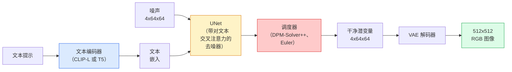

# Stable Diffusion——架构与微调（Stable Diffusion — Architecture & Fine-Tuning）

> Stable Diffusion 是一个运行在预训练 VAE 潜空间（latent space）里的 DDPM，通过交叉注意力（cross-attention）接受文本条件，用快速的确定性 ODE 求解器采样，并由 classifier-free guidance 引导。

**Type:** Learn + Use
**Languages:** Python
**Prerequisites:** Phase 4 Lesson 10 (Diffusion), Phase 7 Lesson 02 (Self-Attention)
**Time:** ~75 minutes

## 学习目标（Learning Objectives）

- 梳理 Stable Diffusion pipeline 的五个组成部分：VAE、文本编码器、U-Net、调度器、安全检查器——以及每一件到底在做什么
- 解释潜空间扩散（latent diffusion），以及为什么在 4x64x64 的潜空间（而不是 3x512x512 的图像）中训练能在不损失质量的情况下把计算量降低 48 倍
- 使用 `diffusers` 生成图像，运行图生图（image-to-image）、图像修补（inpainting）和 ControlNet 引导的生成
- 在小型自定义数据集上用 LoRA 微调 Stable Diffusion，并在推理时加载 LoRA 适配器

## 问题所在（The Problem）

直接在 512x512 的 RGB 图像上训练 DDPM 代价高昂。每个训练步都要让反向传播穿过一个面对 3x512x512 = 786,432 个输入值的 U-Net，采样还要对同一个 U-Net 做 50 多次前向传播。以 Stable Diffusion 1.5（2022 年发布）的质量水平，像素空间扩散大约需要 256 个 GPU 月的训练，在消费级 GPU 上每张图要 10-30 秒。

让开放权重文生图变得实用的诀窍是**潜空间扩散**（latent diffusion，Rombach et al., CVPR 2022）。先训练一个 VAE，把 3x512x512 的图像映射到 4x64x64 的潜张量再映射回来，然后在那个潜空间里做扩散。计算量减少 `(3*512*512)/(4*64*64) = 48x`。同一块 GPU 上，采样从几十秒降到两秒以内。

几乎每一个现代图像生成模型——SDXL、SD3、FLUX、HunyuanDiT、Wan-Video——都是潜空间扩散模型，差别只在自编码器、去噪器（U-Net 或 DiT）和文本条件化上的变化。学会 Stable Diffusion，你就学会了这个模板。

## 核心概念（The Concept）

### 流水线（The pipeline）



- **VAE** —— 冻结的自编码器（autoencoder）。编码器把图像变成潜变量（用于图生图和训练），解码器把潜变量还原成图像。
- **文本编码器** —— CLIP 文本编码器（SD 1.x/2.x）、CLIP-L + CLIP-G（SDXL），或 T5-XXL（SD3/FLUX）。产出一个词元（token）嵌入（embedding）序列。
- **U-Net** —— 去噪器。带有交叉注意力层，在每个分辨率级别上从潜变量注意文本嵌入。
- **调度器** —— 采样算法（DDIM、Euler、DPM-Solver++）。挑选 sigma，把预测的噪声混合回潜变量。
- **安全检查器** —— 输出图像上可选的 NSFW / 违法内容过滤器。

### 无分类器引导（CFG）（Classifier-free guidance (CFG)）

朴素的文本条件化要为每个提示 `c` 学习 `epsilon_theta(x_t, t, c)`。CFG 训练同一个网络时，以 10% 的概率把 `c` 丢掉（替换成空嵌入），从而得到一个同时预测有条件噪声和无条件噪声的单一模型。推理时：

```
eps = eps_uncond + w * (eps_cond - eps_uncond)
```

`w` 是引导强度（guidance scale）。`w=0` 是无条件生成，`w=1` 是普通有条件生成，`w>1` 会把输出推向“更贴合提示”，代价是多样性下降。SD 的默认值是 `w=7.5`。

CFG 是文生图能达到生产级质量的原因。没有它，提示只会轻微地偏置输出；有了它，提示才能说了算。

### 潜空间几何（Latent space geometry）

VAE 的 4 通道潜变量不只是一张压缩图像。它是一个流形（manifold），上面的算术大致对应语义编辑（提示工程和插值都发生在这里），而且扩散 U-Net 已被训练成把全部建模预算都花在这上面。解码一个随机的 4x64x64 潜变量，得到的不是一张“看起来随机”的图像——而是纯粹的乱码，因为只有潜空间中一个特定的子流形才会解码成有效图像。

两个推论：

1. **图生图（img2img）** = 把图像编码成潜变量，加一部分噪声，跑去噪器，再解码。图像结构得以保留，因为编码近乎可逆；内容随提示改变。
2. **图像修补（inpainting）** = 与图生图相同，但去噪器只更新被遮罩的区域；未遮罩区域保持在编码后的潜变量上。

### U-Net 架构（The U-Net architecture）

SD 的 U-Net 是第 10 课 TinyUNet 的加大版，外加三样东西：

- 每个空间分辨率上都有 **Transformer 块**，内含自注意力（self-attention）和对文本嵌入的交叉注意力。
- 用 MLP 作用在正弦编码上得到的**时间嵌入**。
- 编码器与解码器在对应分辨率之间的**跳跃连接（skip connection）**。

SD 1.5 的总参数量：约 860M。SDXL：约 2.6B。FLUX：约 12B。参数量的跃升主要来自注意力层。

### LoRA 微调（LoRA fine-tuning）

完整微调 Stable Diffusion 需要 20+ GB 显存，还要更新 860M 个参数。LoRA（Low-Rank Adaptation，低秩适配）把基础模型冻结，只在注意力层里注入小的秩分解矩阵。SD 的一个 LoRA 适配器通常只有 10-50 MB，在单张消费级 GPU 上 10-60 分钟就能训完，推理时作为即插即用的改动加载。

```
Original: W_q : (d_in, d_out)   frozen
LoRA:     W_q + alpha * (A @ B)   where A : (d_in, r), B : (r, d_out)

r is typically 4-32.
```

社区微调几乎全都以 LoRA 的形式分发。CivitAI 和 Hugging Face 上托管着数百万个。

### 你会遇到的调度器（Schedulers you will see）

- **DDIM** —— 确定性，约 50 步，简单。
- **Euler ancestral** —— 带随机性，30-50 步，样本更有创造力一点。
- **DPM-Solver++ 2M Karras** —— 确定性，20-30 步，生产默认。
- **LCM / TCD / Turbo** —— 一致性模型（consistency model）和蒸馏变体；1-4 步，代价是牺牲一些质量。

在 `diffusers` 里换调度器只需要改一行，有时不用任何重训练就能修好采样问题。

```figure
cv3-latent-compression
```

## 动手构建（Build It）

本课端到端使用 `diffusers`，而不是从零重写 Stable Diffusion。你要重写的那些部件（VAE、文本编码器、U-Net、调度器）各自都有专门的课程；这里的目标是熟练掌握生产级 API。

### 步骤 1：文生图（Step 1: Text-to-image）

```python
import torch
from diffusers import StableDiffusionPipeline

pipe = StableDiffusionPipeline.from_pretrained(
    "runwayml/stable-diffusion-v1-5",
    torch_dtype=torch.float16,
).to("cuda")

image = pipe(
    prompt="a dog riding a skateboard in tokyo, studio ghibli style",
    guidance_scale=7.5,
    num_inference_steps=25,
    generator=torch.Generator("cuda").manual_seed(42),
).images[0]
image.save("dog.png")
```

`float16` 把显存占用减半且没有可见的质量损失。`num_inference_steps=25` 配默认的 DPM-Solver++，效果相当于 DDIM 的 `num_inference_steps=50`。

### 步骤 2：换调度器（Step 2: Swap the scheduler）

```python
from diffusers import DPMSolverMultistepScheduler, EulerAncestralDiscreteScheduler

pipe.scheduler = DPMSolverMultistepScheduler.from_config(pipe.scheduler.config)
pipe.scheduler = EulerAncestralDiscreteScheduler.from_config(pipe.scheduler.config)
```

调度器的状态与 U-Net 权重是解耦的。你可以用 DDPM 训练，再用任意调度器采样。

### 步骤 3：图生图（Step 3: Image-to-image）

```python
from diffusers import StableDiffusionImg2ImgPipeline
from PIL import Image

img2img = StableDiffusionImg2ImgPipeline.from_pretrained(
    "runwayml/stable-diffusion-v1-5",
    torch_dtype=torch.float16,
).to("cuda")

init_image = Image.open("dog.png").convert("RGB").resize((512, 512))
out = img2img(
    prompt="a dog riding a skateboard, oil painting",
    image=init_image,
    strength=0.6,
    guidance_scale=7.5,
).images[0]
```

`strength` 是去噪前要加多少噪声（0.0 = 不变，1.0 = 完全重新生成）。0.5-0.7 是风格迁移的标准区间。

### 步骤 4：图像修补（Step 4: Inpainting）

```python
from diffusers import StableDiffusionInpaintPipeline

inpaint = StableDiffusionInpaintPipeline.from_pretrained(
    "runwayml/stable-diffusion-inpainting",
    torch_dtype=torch.float16,
).to("cuda")

image = Image.open("dog.png").convert("RGB").resize((512, 512))
mask = Image.open("dog_mask.png").convert("L").resize((512, 512))

out = inpaint(
    prompt="a cat",
    image=image,
    mask_image=mask,
    guidance_scale=7.5,
).images[0]
```

掩码里的白色像素是要重新生成的区域，黑色像素保持原样。

### 步骤 5：加载 LoRA（Step 5: LoRA loading）

```python
pipe.load_lora_weights("sayakpaul/sd-lora-ghibli")
pipe.fuse_lora(lora_scale=0.8)

image = pipe(prompt="a village square in ghibli style").images[0]
```

`lora_scale` 控制强度；0.0 = 无效果，1.0 = 完全生效。`fuse_lora` 会把适配器就地融合进权重以换取速度，但之后就换不了了。加载另一个适配器之前，先调用 `pipe.unfuse_lora()`。

### 步骤 6：LoRA 训练（草图）（Step 6: LoRA training (sketch)）

真正的 LoRA 训练在 `peft` 或 `diffusers.training` 里。流程概要：

```python
# Pseudocode
for step, batch in enumerate(dataloader):
    images, prompts = batch
    latents = vae.encode(images).latent_dist.sample() * 0.18215

    t = torch.randint(0, num_train_timesteps, (batch_size,))
    noise = torch.randn_like(latents)
    noisy_latents = scheduler.add_noise(latents, noise, t)

    text_emb = text_encoder(tokenizer(prompts))

    pred_noise = unet(noisy_latents, t, text_emb)  # LoRA weights injected here

    loss = F.mse_loss(pred_noise, noise)
    loss.backward()
    optimizer.step()
```

只有 LoRA 矩阵接收梯度；基础 U-Net、VAE 和文本编码器全部冻结。batch size 取 1 并开梯度检查点（gradient checkpointing）时，8 GB 显存就装得下。

## 生产实践（Use It）

在生产中，你真正要做的决策是：

- **模型家族**：SD 1.5 用开源社区微调，SDXL 要更高保真，SD3 / FLUX 追求最先进和严格的许可要求。
- **调度器**：20-30 步用 DPM-Solver++ 2M Karras，延迟低于 1 秒时用 LCM-LoRA。
- **精度**：4080/4090 上用 `float16`，A100 及更新的卡用 `bfloat16`，显存紧张时用 `int8`（借助 `bitsandbytes` 或 `compel`）。
- **条件化**：纯文本就够用；要更强的控制力，就在基础 pipeline 之上加 ControlNet（canny、深度、姿态）。

批量生成用社区工具 `AUTO1111` / `ComfyUI`；生产 API 用 `diffusers` + `accelerate`，或 `optimum-nvidia` 配 TensorRT 编译。

## 交付产出（Ship It）

本课产出：

- `outputs/prompt-sd-pipeline-planner.md` —— 一个提示词，在给定延迟预算、保真目标和许可约束时，选择 SD 1.5 / SDXL / SD3 / FLUX 以及调度器和精度。
- `outputs/skill-lora-training-setup.md` —— 一个技能，为自定义数据集写出完整的 LoRA 训练配置，包括描述文本（captions）、秩、batch size 和学习率。

## 练习（Exercises）

1. **（简单）** 用 `[1, 3, 5, 7.5, 10, 15]` 里的不同 `guidance_scale` 生成同一个提示。描述图像如何变化。guidance 取多大时开始出现伪影？
2. **（中等）** 拿任意一张真实照片，用 `StableDiffusionImg2ImgPipeline` 在 `strength` 取 `[0.2, 0.4, 0.6, 0.8, 1.0]` 时各跑一遍。哪个 strength 能在改变风格的同时保留构图？为什么 1.0 会完全无视输入？
3. **（困难）** 用某个单一主体（一只宠物、一个 logo、一个角色）的 10-20 张图像训练一个 LoRA，然后生成包含该主体的全新场景。报告主体身份保持得最好、又不对输入图像过拟合的 LoRA 秩和训练步数。

## 关键术语（Key Terms）

| 术语 | 人们常说的 | 实际含义 |
|------|----------------|----------------------|
| 潜空间扩散 | “在潜空间里做扩散” | 在 VAE 潜空间（4x64x64）而不是像素空间（3x512x512）里跑整个 DDPM；节省 48 倍计算 |
| VAE 缩放因子 | “0.18215” | 把 VAE 的原始潜变量重新缩放到大致单位方差的常数；硬编码在每一个 SD pipeline 里 |
| 无分类器引导 | “CFG” | 混合有条件和无条件的噪声预测；影响力最大的单个推理旋钮 |
| 调度器 | “采样器” | 把噪声 + 模型预测变成一条去噪潜变量轨迹的算法 |
| LoRA | “低秩适配器” | 小的秩分解矩阵，只微调注意力层而不动基础权重 |
| 交叉注意力 | “文本-图像注意力” | 从潜变量词元到文本词元的注意力；在每个 U-Net 层级注入提示信息 |
| ControlNet | “结构条件化” | 一个单独训练的适配器，用一份额外输入（canny、深度、姿态、分割）来引导 SD |
| DPM-Solver++ | “默认调度器” | 二阶确定性 ODE 求解器；2026 年在低步数（20-30 步）下质量最好 |

## 延伸阅读（Further Reading）

- [High-Resolution Image Synthesis with Latent Diffusion (Rombach et al., 2022)](https://arxiv.org/abs/2112.10752) —— Stable Diffusion 论文；包含证明其设计合理性的全部消融实验
- [Classifier-Free Diffusion Guidance (Ho & Salimans, 2022)](https://arxiv.org/abs/2207.12598) —— CFG 论文
- [LoRA: Low-Rank Adaptation of Large Language Models (Hu et al., 2021)](https://arxiv.org/abs/2106.09685) —— LoRA 诞生于 NLP；几乎没怎么改就迁移到了 SD
- [diffusers 文档](https://huggingface.co/docs/diffusers) —— 每一个 SD / SDXL / SD3 / FLUX pipeline 的参考手册
