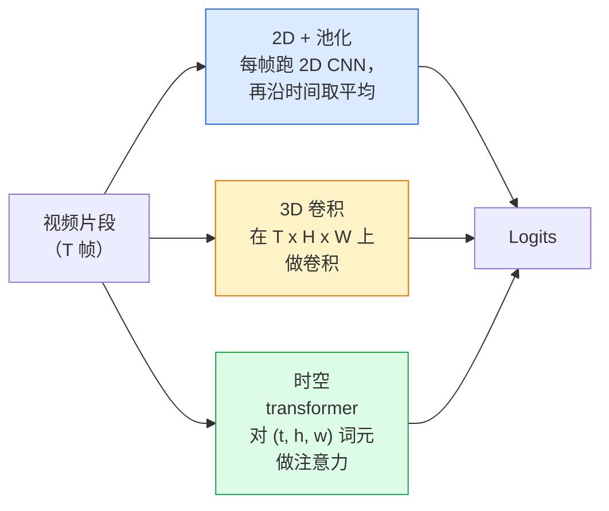

# 视频理解——时间建模（Video Understanding — Temporal Modeling）

> 视频是一串图像，再加上把它们连接起来的物理规律。每一种视频模型要么把时间当作一个额外的轴（3D 卷积），要么把它当作一个可以注意的序列（transformer），要么把它当作一次性提取再池化的特征（2D+池化）。

**Type:** Learn + Build
**Languages:** Python
**Prerequisites:** Phase 4 Lesson 03 (CNNs), Phase 4 Lesson 04 (Image Classification)
**Time:** ~45 minutes

## 学习目标（Learning Objectives）

- 区分三种主要的视频建模路线（2D+池化、3D 卷积、时空 transformer），并预测它们在成本和精度上的取舍
- 在 PyTorch 中实现帧采样、时间池化和一个 2D+池化基线分类器
- 解释为什么 I3D 的“膨胀”3D 卷积核能很好地从 ImageNet 权重迁移，以及因式分解的 (2+1)D 卷积有什么不同
- 读懂标准动作识别数据集与指标：Kinetics-400/600、UCF101、Something-Something V2；clip 级与视频级 top-1 准确率

## 问题所在（The Problem）

一段 30 秒、30 fps 的视频就是 900 张图像。天真地想，视频分类就是把图像分类跑 900 遍再做某种聚合。当动作几乎在每一帧里都可见时（体育、烹饪、健身视频），这样做行得通；而当动作由运动本身定义时，它就败得很惨：“把某物从左推到右”在每一帧里看起来都只是两个静止的物体。

每个视频架构的核心问题都是：时间结构在什么时候被建模，以及怎么建模？这个答案决定了其余一切——计算成本、预训练策略、能不能复用 ImageNet 权重、模型在哪些数据集上训练。

本课刻意比静态图像各课短。核心的图像机制已经就位，视频理解主要讲的是时间这条故事线：采样、建模、聚合。

## 核心概念（The Concept）

### 三大架构家族（The three architectural families）



### 2D + 池化（2D + pool）

拿一个 2D CNN（ResNet、EfficientNet、ViT），在每个采样帧上独立运行，再对逐帧嵌入取平均（或做最大池化、注意力池化），把池化后的向量喂给分类器。

优点：
- ImageNet 预训练权重直接可用。
- 实现最简单。
- 便宜：T 帧 × 单张图像的推理成本。

缺点：
- 无法建模运动。动作 = 外观的聚合。
- 时间池化不关心顺序；“开门”和“关门”看起来一样。

何时使用：外观主导的任务、小视频数据集上的迁移学习、初始基线。

### 3D 卷积（3D convolutions）

把 2D (H, W) 卷积核换成 3D (T, H, W) 卷积核，网络同时在空间和时间上做卷积。早期家族：C3D、I3D、SlowFast。

I3D 的诀窍：拿一个预训练的 2D ImageNet 模型，把每个 2D 卷积核沿一条新的时间轴复制来“膨胀”。3x3 的 2D 卷积变成 3x3x3 的 3D 卷积。这让 3D 模型拥有强大的预训练权重，而不是从零开始训练。

优点：
- 直接建模运动。
- I3D 膨胀带来免费的迁移学习。

缺点：
- 比对应的 2D 版本多 T/8 的 FLOPs（时间核为 3、堆叠 3 次时）。
- 时间核很小；长程运动需要金字塔或双流方案。

何时使用：以运动为信号的动作识别（Something-Something V2、运动类目占多的 Kinetics）。

### 时空 transformer（Spatio-temporal transformers）

把视频词元化（tokenise）成一组时空 patch（图像块），然后对所有词元（token）做注意力。TimeSformer、ViViT、Video Swin、VideoMAE。

真正要紧的注意力模式：
- **联合（joint）** —— 对 (t, h, w) 做一次大注意力。关于 `T*H*W` 是平方级；昂贵。
- **分离（divided）** —— 每个块两次注意力：一次在时间上，一次在空间上。接近线性扩展。
- **因式分解（factorised）** —— 时间注意力与空间注意力在块之间交替出现。

优点：
- 在所有主要基准上都是 SOTA 精度。
- 通过 patch 膨胀从图像 transformer（ViT）迁移。
- 通过稀疏注意力支持长上下文视频。

缺点：
- 吃算力。
- 需要仔细挑选注意力模式，否则运行时间会暴涨。

何时使用：大数据集、高保真视频理解、视频+文本多模态任务。

### 帧采样（Frame sampling）

30 fps 的 10 秒片段有 300 帧；把 300 帧全部喂给任何模型都是浪费。标准策略：

- **均匀采样** —— 在整个片段上等间隔取 T 帧。2D+池化的默认做法。
- **密集采样** —— 随机取一段连续的 T 帧窗口。3D 卷积常用，因为运动需要相邻帧。
- **多片段（multi-clip）** —— 从同一视频里采样多个 T 帧窗口，各自分类，测试时对预测取平均。

T 通常是 8、16、32 或 64。T 越大 = 时间信号越多，计算也越多。

### 评估（Evaluation）

两个层级：
- **clip 级准确率** —— 模型只看一个 T 帧 clip，报告 top-k。
- **视频级准确率** —— 对每个视频的多个 clip 的 clip 级预测取平均；数值更高也更稳定。

两个都要报告。一个 clip 78% / video 82% 的模型，严重依赖测试时的平均；一个 80% / 81% 的模型，在每个 clip 上更稳。

### 你会遇到的数据集（Datasets you will meet）

- **Kinetics-400 / 600 / 700** —— 通用动作数据集。40 万个 clip；来源是 YouTube 链接（很多已经失效）。
- **Something-Something V2** —— 由运动定义的动作（“把 X 从左移到右”）。2D+池化解不了。
- **UCF-101**、**HMDB-51** —— 更老、更小，但仍有人报告。
- **AVA** —— 时空中的动作*定位*；比分类更难。

```figure
v4-video-temporal
```

## 动手构建（Build It）

### 步骤 1：帧采样器（Step 1: Frame sampler）

作用于帧列表（或视频张量）的均匀采样器与密集采样器。

```python
import numpy as np

def sample_uniform(num_frames_total, T):
    if num_frames_total <= T:
        return list(range(num_frames_total)) + [num_frames_total - 1] * (T - num_frames_total)
    step = num_frames_total / T
    return [int(i * step) for i in range(T)]


def sample_dense(num_frames_total, T, rng=None):
    rng = rng or np.random.default_rng()
    if num_frames_total <= T:
        return list(range(num_frames_total)) + [num_frames_total - 1] * (T - num_frames_total)
    start = int(rng.integers(0, num_frames_total - T + 1))
    return list(range(start, start + T))
```

两者都返回 `T` 个索引，你用它们去切视频张量。

### 步骤 2：2D+池化基线（Step 2: A 2D+pool baseline）

对每一帧跑一个 2D ResNet-18，对特征做平均池化，再分类。

```python
import torch
import torch.nn as nn
from torchvision.models import resnet18, ResNet18_Weights

class FramePool(nn.Module):
    def __init__(self, num_classes=400, pretrained=True):
        super().__init__()
        weights = ResNet18_Weights.IMAGENET1K_V1 if pretrained else None
        backbone = resnet18(weights=weights)
        self.features = nn.Sequential(*(list(backbone.children())[:-1]))  # global avg pool kept
        self.head = nn.Linear(512, num_classes)

    def forward(self, x):
        # x: (N, T, 3, H, W)
        N, T = x.shape[:2]
        x = x.view(N * T, *x.shape[2:])
        feats = self.features(x).view(N, T, -1)
        pooled = feats.mean(dim=1)
        return self.head(pooled)

model = FramePool(num_classes=10)
x = torch.randn(2, 8, 3, 224, 224)
print(f"output: {model(x).shape}")
print(f"params: {sum(p.numel() for p in model.parameters()):,}")
```

1100 万参数，ImageNet 预训练，逐帧运行、取平均、分类。在外观主导的任务上，这个基线常常与正经的 3D 模型相差 5-10 个点以内——有时甚至更好，因为它复用了更强的 ImageNet 骨干。

### 步骤 3：I3D 风格的膨胀 3D 卷积（Step 3: An I3D-style inflated 3D conv）

沿一条新的时间轴重复权重，把一个 2D 卷积变成 3D 卷积。

```python
def inflate_2d_to_3d(conv2d, time_kernel=3):
    out_c, in_c, kh, kw = conv2d.weight.shape
    weight_3d = conv2d.weight.data.unsqueeze(2)  # (out, in, 1, kh, kw)
    weight_3d = weight_3d.repeat(1, 1, time_kernel, 1, 1) / time_kernel
    conv3d = nn.Conv3d(in_c, out_c, kernel_size=(time_kernel, kh, kw),
                        padding=(time_kernel // 2, conv2d.padding[0], conv2d.padding[1]),
                        stride=(1, conv2d.stride[0], conv2d.stride[1]),
                        bias=False)
    conv3d.weight.data = weight_3d
    return conv3d

conv2d = nn.Conv2d(3, 64, kernel_size=3, padding=1, bias=False)
conv3d = inflate_2d_to_3d(conv2d, time_kernel=3)
print(f"2D weight shape:  {tuple(conv2d.weight.shape)}")
print(f"3D weight shape:  {tuple(conv3d.weight.shape)}")
x = torch.randn(1, 3, 8, 56, 56)
print(f"3D output shape:  {tuple(conv3d(x).shape)}")
```

除以 `time_kernel` 让激活量级大致保持不变——这一点很重要，能避免第一遍前向传播时破坏 batch norm 的统计量。

### 步骤 4：因式分解的 (2+1)D 卷积（Step 4: Factorised (2+1)D conv）

把一个 3D 卷积拆成一个 2D（空间）卷积加一个 1D（时间）卷积。感受野相同，参数更少，某些基准上精度更好。

```python
class Conv2Plus1D(nn.Module):
    def __init__(self, in_c, out_c, kernel_size=3):
        super().__init__()
        mid_c = (in_c * out_c * kernel_size * kernel_size * kernel_size) \
                // (in_c * kernel_size * kernel_size + out_c * kernel_size)
        self.spatial = nn.Conv3d(in_c, mid_c, kernel_size=(1, kernel_size, kernel_size),
                                 padding=(0, kernel_size // 2, kernel_size // 2), bias=False)
        self.bn = nn.BatchNorm3d(mid_c)
        self.act = nn.ReLU(inplace=True)
        self.temporal = nn.Conv3d(mid_c, out_c, kernel_size=(kernel_size, 1, 1),
                                  padding=(kernel_size // 2, 0, 0), bias=False)

    def forward(self, x):
        return self.temporal(self.act(self.bn(self.spatial(x))))

c = Conv2Plus1D(3, 64)
x = torch.randn(1, 3, 8, 56, 56)
print(f"(2+1)D output: {tuple(c(x).shape)}")
```

一个完整的 R(2+1)D 网络，就是把 ResNet-18 里的每个 3x3 卷积都换成 `Conv2Plus1D`。

## 生产实践（Use It）

两个库覆盖生产级视频工作：

- `torchvision.models.video` —— R(2+1)D、MViT、Swin3D，带 Kinetics 预训练权重。API 与图像模型相同。
- `pytorchvideo`（Meta）—— 模型库、Kinetics / SSv2 / AVA 数据加载器、标准变换。

视频-语言模型（视频字幕、视频问答）用 `transformers`（`VideoMAE`、`VideoLLaMA`、`InternVideo`）。

## 交付产出（Ship It）

本课产出：

- `outputs/prompt-video-architecture-picker.md` —— 一个提示词，根据“外观 vs 运动”、数据集规模和算力预算，在 2D+池化 / I3D / (2+1)D / transformer 之间做选择。
- `outputs/skill-frame-sampler-auditor.md` —— 一个技能，检查视频 pipeline 的采样器并标出常见 bug：索引差一、`num_frames < T` 时采样不均、缺少保持宽高比的裁剪，等等。

## 练习（Exercises）

1. **（简单）** 计算 T=8 的 FramePool 与 T=8 的 I3D 风格 3D ResNet 的（近似）FLOPs。论证为什么 2D+池化便宜 3-5 倍。
2. **（中等）** 生成一个合成视频数据集：随机的小球朝随机方向运动，按运动方向打标签（“从左到右”、“从右到左”、“斜向上”）。在其上训练 FramePool。展示它只能达到接近瞎猜的准确率，从而证明单凭外观不足以完成运动任务。
3. **（困难）** 把 ResNet-18 里的每个 Conv2d 都换成 `Conv2Plus1D`，构建一个 R(2+1)D-18。用 ImageNet 预训练的 ResNet-18 膨胀第一个卷积的权重。在练习 2 的运动数据集上训练，并击败 FramePool。

## 关键术语（Key Terms）

| 术语 | 人们常说的 | 实际含义 |
|------|----------------|----------------------|
| 2D + 池化 | “逐帧分类器” | 对每个采样帧跑 2D CNN，跨时间平均池化特征，再分类 |
| 3D 卷积 | “时空卷积核” | 在 (T, H, W) 上卷积的核；原生就能建模运动 |
| 膨胀（inflation） | “把 2D 权重升到 3D” | 沿新时间轴重复 2D 卷积的权重来初始化 3D 卷积，再除以 kernel_T 以保持激活量级 |
| (2+1)D | “因式分解卷积” | 把 3D 拆成 2D 空间 + 1D 时间；参数更少，中间多一层非线性 |
| 分离注意力 | “先时间后空间” | 每层两次注意力的 transformer 块：一次对同一帧的词元，一次对同一位置的词元 |
| Clip | “T 帧窗口” | 采样出的 T 帧子序列；视频模型消费的基本单元 |
| clip 级 vs 视频级准确率 | “两种评测设定” | clip = 每个视频采一个样本，video = 对多个采样 clip 取平均 |
| Kinetics | “视频界的 ImageNet” | 400-700 个动作类别、30 万条以上 YouTube clip，标准的视频预训练语料 |

## 延伸阅读（Further Reading）

- [I3D: Quo Vadis, Action Recognition (Carreira & Zisserman, 2017)](https://arxiv.org/abs/1705.07750) —— 提出膨胀方法与 Kinetics 数据集
- [R(2+1)D: A Closer Look at Spatiotemporal Convolutions (Tran et al., 2018)](https://arxiv.org/abs/1711.11248) —— 因式分解卷积，至今仍是强基线
- [TimeSformer: Is Space-Time Attention All You Need? (Bertasius et al., 2021)](https://arxiv.org/abs/2102.05095) —— 第一个强大的视频 transformer
- [VideoMAE (Tong et al., 2022)](https://arxiv.org/abs/2203.12602) —— 视频的掩码自编码器预训练；当前主流的预训练配方
